# 学前先看

## 1.认识ArmPi FPV

### 1.1 产品简介

ArmPi FPV智能视觉机械臂以树莓派5为主控，内置逆运动学算法，配备总线舵机及高清晰度摄像头。

ArmPi FPV配合跨平台的计算机视觉库OpenCV，可以实现图像识别、颜色分拣、移动追踪夹取、智能码垛等功能。

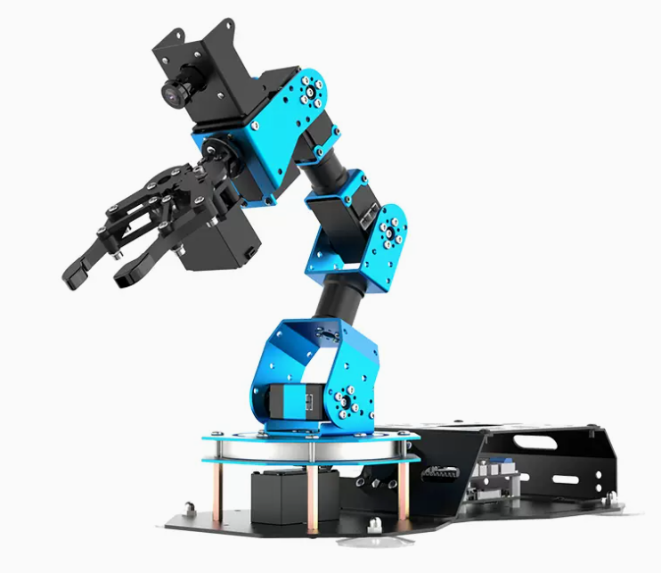

为了满足不同情况的学习需要，我们还准备了以下三个版本供大家选择。

**第一种是入门版：** 不含摄像头模块，可实现单机械臂操控功能。

**第二种是标准版：** 用户可根据自身的需求选择不内存的树莓派主板，使用套餐内包含的地图和道具，能够实现AI视觉玩法。

**第三种是豪华版：** 在"标准版"的基础上，新增智慧仓储功能，同时结合语音识别和合成模块，还可实现语音控制机械臂的智能玩法。

**第四种是专业开发版：** 在"豪华版"的基础上增加了超声波传感器、风扇模块、触摸传感器、光敏传感器、颜色传感器、4位数码管、红外传感器、点阵模块等电子模块，可以实现传感器与机械臂的联动。

温馨提示，这四种版本在出厂前均已烧录系统镜像，因此用户无需进行烧录。

### 1.2 产品清单

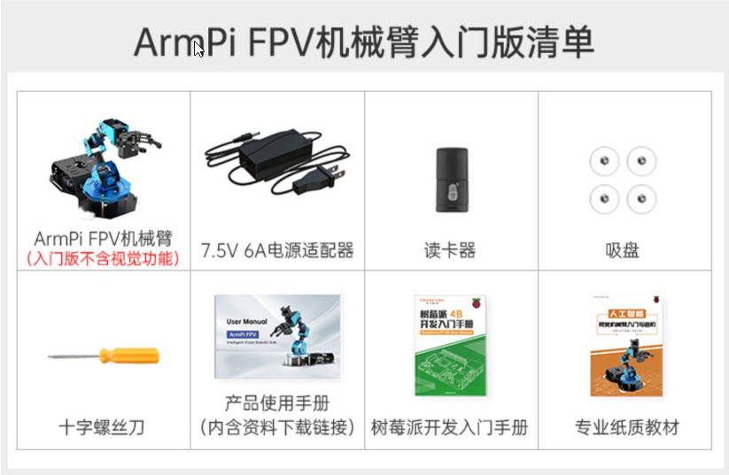

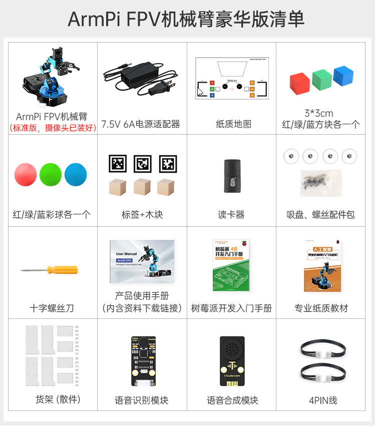

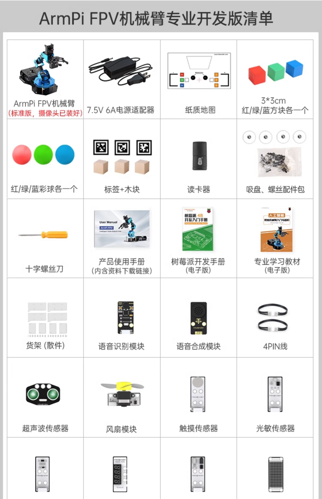

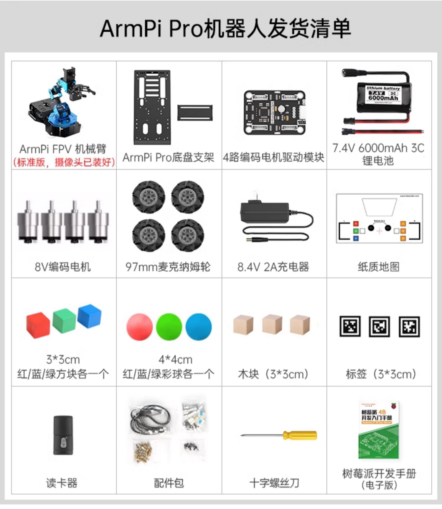

## 2. 安装吸盘、货架及地图摆放

### 2.1 地图介绍及设备放置

在体验玩法之前，我们需要对地图有一个基础的认识，所以本节课学习地图区域的分布及设备放置。

- **地图介绍**

地图由四个部分组成，其分布如下图所示：

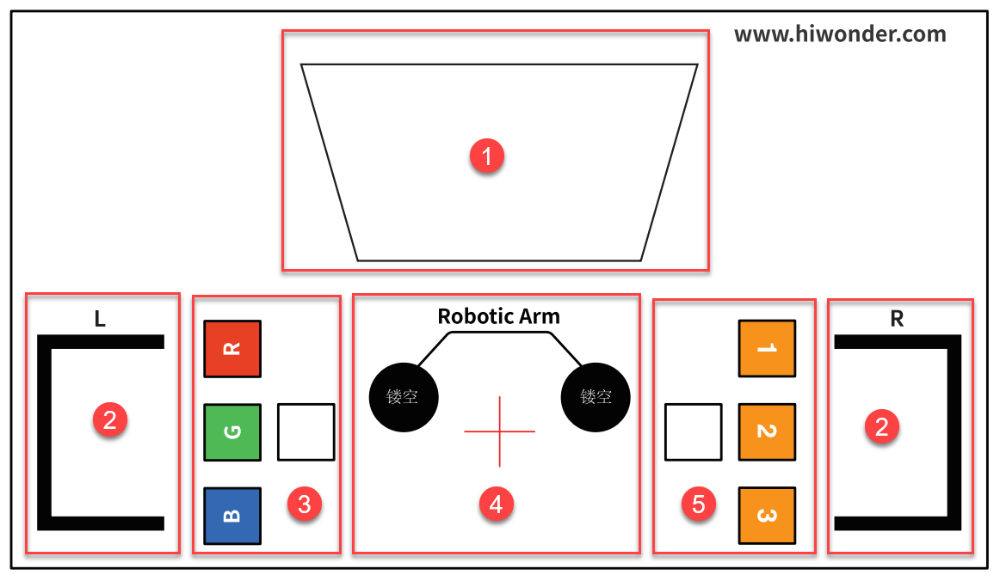

下面对这几个组成部分的功能进行说明：

- **视觉识别区**

视觉识别区为机械臂的可识别范围区域，可将需要识别的色块或标签木块放置到此区域内。

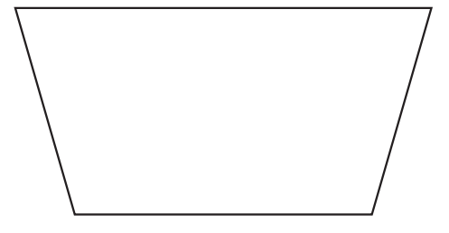

:::{Note}
摆放标签木块或色块时，建议标签木块或色块之前保持3cm以上的距离，不要放置在视觉识别区的边线位置，以免识别失败。
:::

- **货架摆放区**

货架是在"智慧仓储课程"中会使用到的道具，机械臂会将物品夹取后放置于货架上或者从货架上夹取物品。

:::{Note}
货架的厚度与地图上的黑线宽度是一致的，因此摆放货架时，看不见黑线即为摆放在了正确的位置上。
:::

- **色块分拣、码垛区**

机械臂将视觉识别区内色块搬运到对应的放置区域。

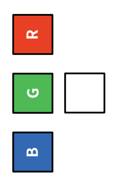

各区域功能如下表所示：

| **图标** | **功能说明** |
|:--:|:--:|
|  | 码垛区 |
|  | 红色色块放置区域 |
|  | 绿色色块放置区域 |
|  | 蓝色色块放置区域 |

- **机械臂放置区**

机械臂放置在此区域内，再进行运动。

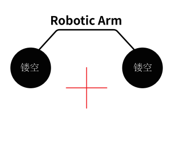

- **标签木块分拣、码垛区**

机械臂将视觉识别区内的标签木块搬运到对应的放置区域。

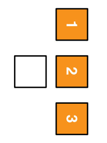

各区域功能如下表所示：

| **图标** | **功能说明** |
|:--:|:--:|
|  | 码垛区 |
|  | 标签木块ID1的放置区 |
|  | 标签木块ID2的放置区 |
|  | 标签木块ID3的放置区 |

### 2.2 设备放置

我们将地图平整的铺放在桌面，然后将机械臂摆放至机械臂放置区域内。底座前端要与机械臂放置区的前端边线重合，吸盘要紧贴桌面，如下图所示：

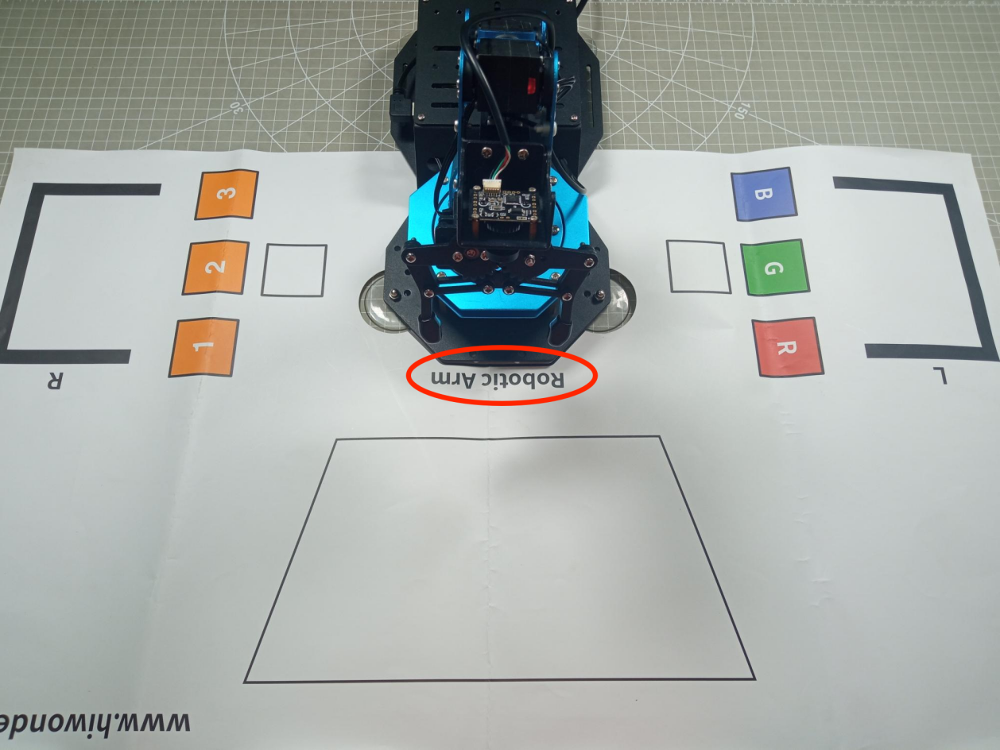

### 2.3 关于货架说明

自2021.10. 1号开始，货架没有背板，其玩法和功能没有影响。实际收到以下图为准：

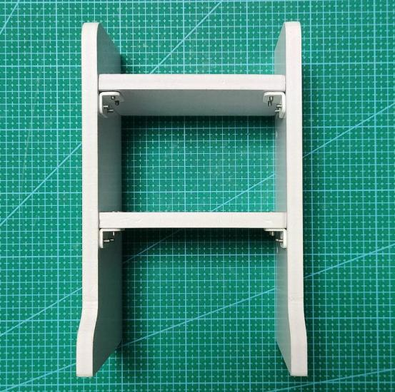

## 3.首次开机及检验

### 3.1 USB摄像头连接确认

在开机之前请先确认摄像头连接线是否已连接牢固。（摄像头连接线可接入树莓派主板上4个USB的任意一个上。）

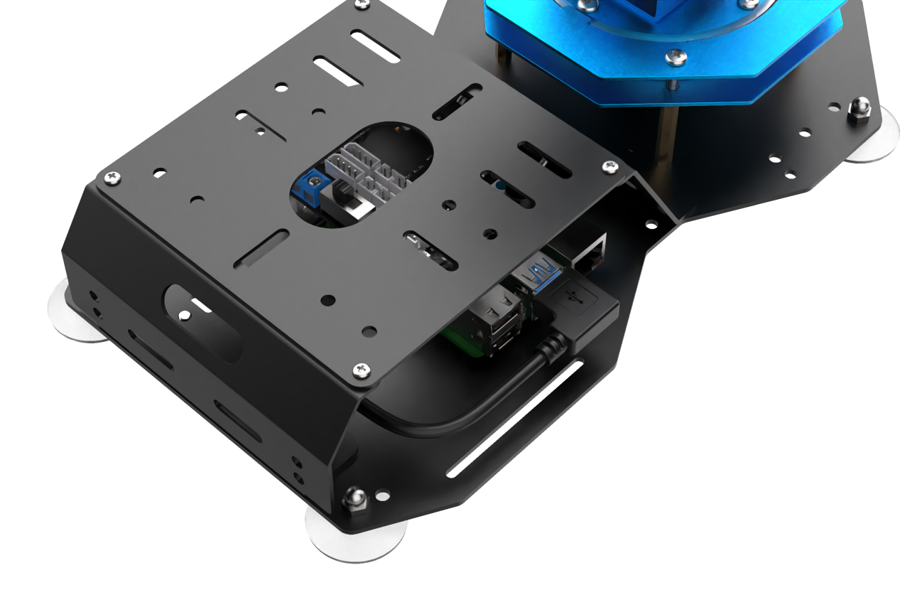

### 3.2 电源适配器连接

:::{Note}
DC电源连接线如果没有连接至扩展板，切勿直接连接适配器接口，防止正负极接触造成短路发生危险。
:::

1)  将电源对接线接入树莓派扩展板的电源接口，红色接+、黑色接-。（如已接入，请确认即可）

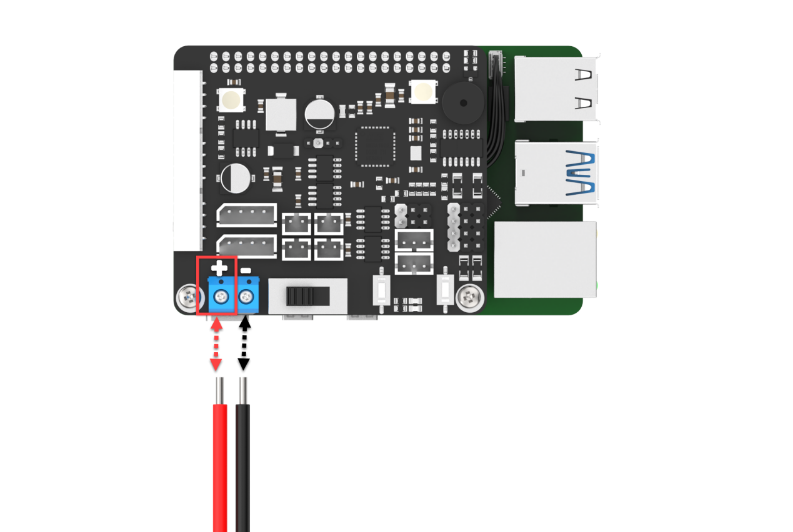

2)  取出适配器，将适配器公头与对接线的母头进行对接，对接完成连入插排通电即可。

### 3.3 开机

1)  开机前，需要检查主控器上的连接线是否安插好，主要检查电源、舵机、单目相机连接线。

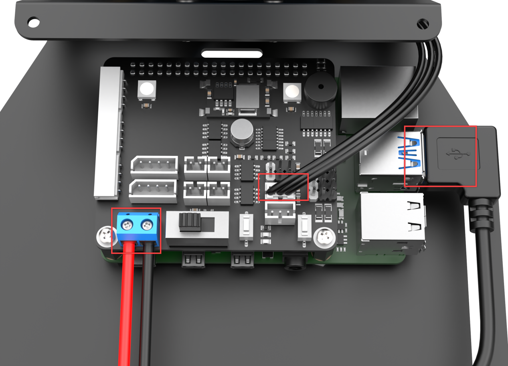

2. 将机械臂自然平放在桌面上。为避免舵机突然发力使舵机受损，机械臂的舵机请勿上下叠加。

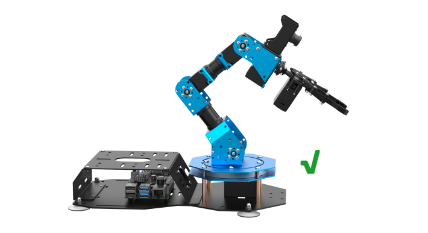

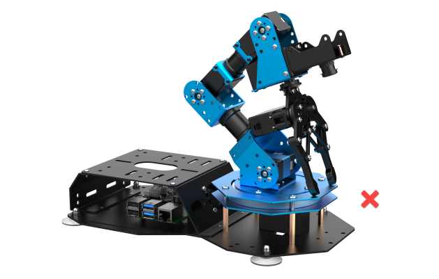

3)  将树莓派扩展板的开关由"**OFF**"推动到"**ON**"，此时树莓派的LED1、LED2常亮，稍等片刻后LED2由常亮变为每隔1秒闪亮一次，稍等片刻后看到机械臂复位，听到蜂鸣器"滴"的一声响，即设备成功开机。

:::{Note}
这里的蓝色LED2灯闪烁是Wi-Fi已经开启，但是机器人还未完全启动。需要等到蜂鸣器短鸣一声才代表机器人完全启动。
:::

**如果蜂鸣器未短鸣，则说明扩展板上如：RGB、蜂鸣器、按键等硬件可能存在问题。正常使用的情况下不会发生这种情况，若发生上述问题，请联系客服人员解决。**

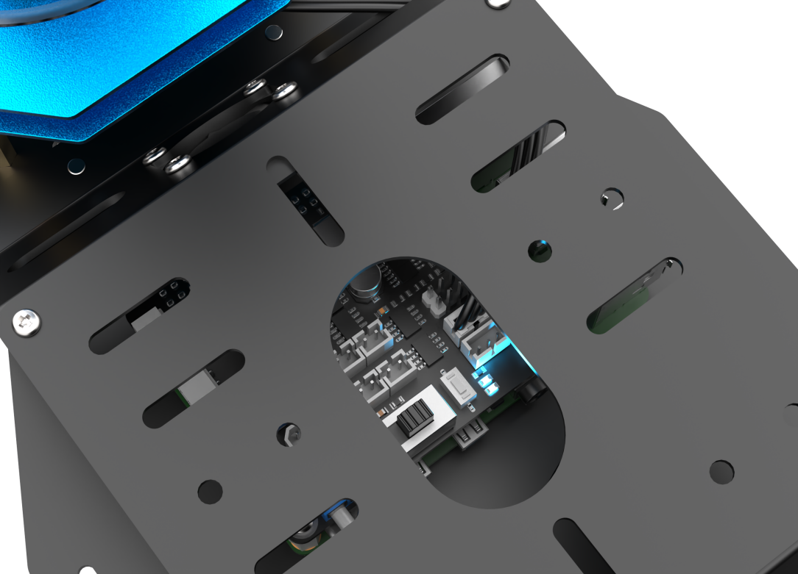

4)  设备开机成功后，出厂默认为AP直连模式，并将产生一个以HW开头的热点。

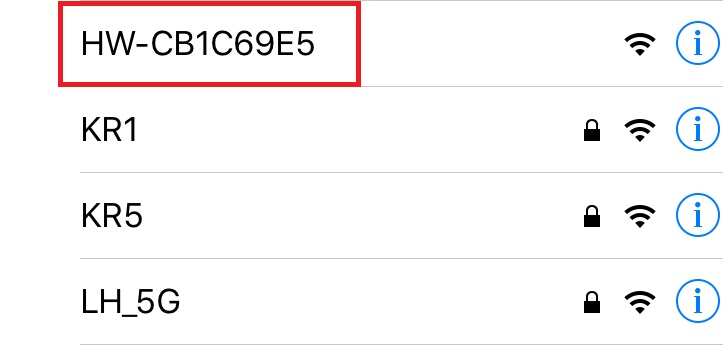

### 3.4 检验

开机完成后还需要对风扇、舵机、摄像头等模块进行检验，具体检验方法如下所示：

- 风扇：开机成功后，风扇会一直旋转。

- 蜂鸣器：在正常开机后会嘀一声。

- LED2在直连模式下是闪烁。

- LED3在APP控制的时候会闪烁。

- 舵机：可通过手机APP中的机体遥控对其各个舵机进行独立控制（**关于手机APP的安装、连接可参考"[上手试玩](https://docs.hiwonder.com/projects/ArmPi_FPV/en/latest/docs/2.quick_user_experience.html)"**）。

  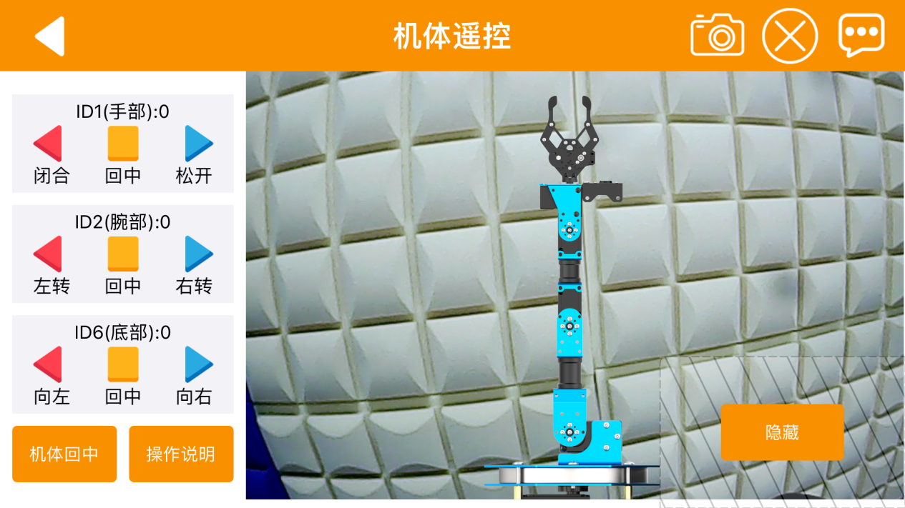

- 单目相机：通过手机APP中的机体遥控查看其回传画面。

  

