# 1. Getting Ready

## 1.1 ArmPi FPV Introduction

**1.1.1 Introduction**

The intelligent vision robotic arm ArmPi FPV is powered by Raspberry Pi, with built-in inverse kinematics algorithm, bus servo, and a high-definition camera.

Combined with OpenCV, a cross-platform computer vision library, ArmPi FPV can perform image recognition, color sorting, moving, tracking, picking, smart stacking etc.

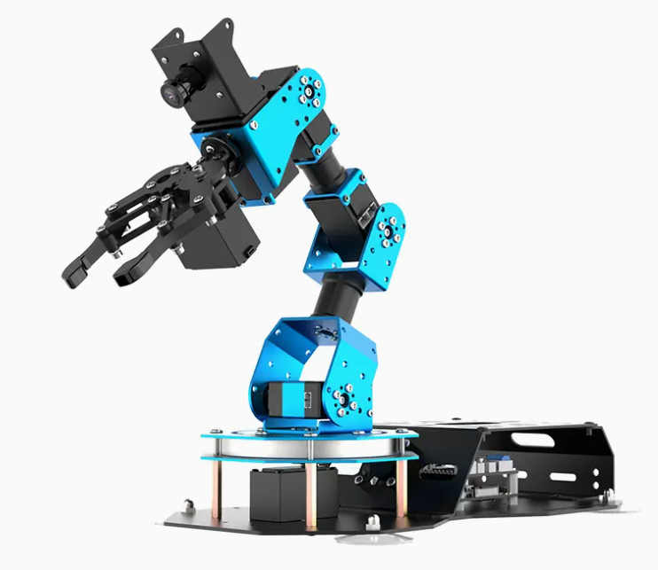

**1.1.2 Usage Precautions**

Please pay attention to the following points when using and storing this product:

(1)  This product contains conductive components. Avoid contact with metal objects when powered on.

(2) After the robot is powered on, do not forcibly move the servo, as this may cause damage.

(3) If the robot runs for an extended period, the servos may become hot. Allow the robot to "**rest**" and wait for the servos to cool before resuming operation.

(4) Keep your face, glasses, and other body parts away from the robot while it is operating. Do not place fingers within the joint movement range to prevent injury. Also, be cautious of falls from high edges.

(5) The robot's servos are precision components and consumable parts. They may need replacement after long-term or intensive use.

(6) If the product will not be used for an extended period, fully charge the battery, remove it, and store it in a cool, dry place.

**1.1.3 Copyright Notice**

This manual is the property of Shenzhen Hiwonder Technology Co., Ltd. No organization or individual is permitted to reproduce, copy, translate, or distribute any content from this manual without authorization.
Any unauthorized use or infringement of this manual's copyright will be subject to legal action by our company.

**1.1.4 Disclaimer**

The product described in this manual (including hardware, software, etc.) is provided "**as is**". Every effort has been made to ensure the accuracy of this manual, but we cannot guarantee it is completely free from errors or omissions. This document is regularly reviewed, and we welcome feedback for improvements.
Product features and specifications may change with version upgrades. For the latest product information, please contact customer service when placing your order.
Furthermore, unless explicitly stated by Hiwonder, we are not responsible for any losses resulting from product malfunctions or damage under extreme conditions outside of typical use cases.

## 1.2 Package List

(1) Standard Kit

<table class="docutils-nobg" border="1" style="width:100%;text-align: center">
<thead>
    <tr>
      <th>No.</th>
      <th style="width:50%">Product Name</th>
      <th>Quantity</th>
      <th>Picture</th>
    </tr>
</thead>
<tbody>
<tr>
<td>1</td>
<td>ArmPi FPV</td>
<td>1</td>
<td>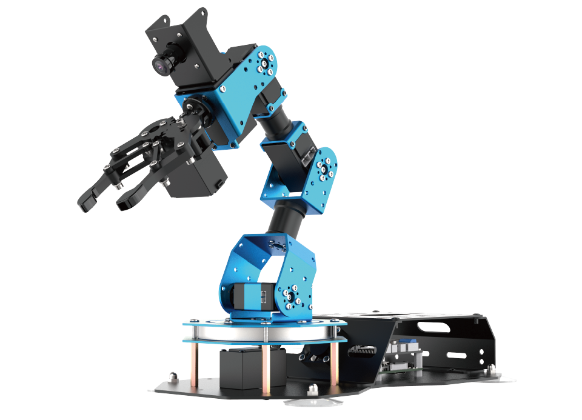</td>
</tr>
<tr>
<td>2</td>
<td>7.5V 6A adapter</td>
<td>1</td>
<td>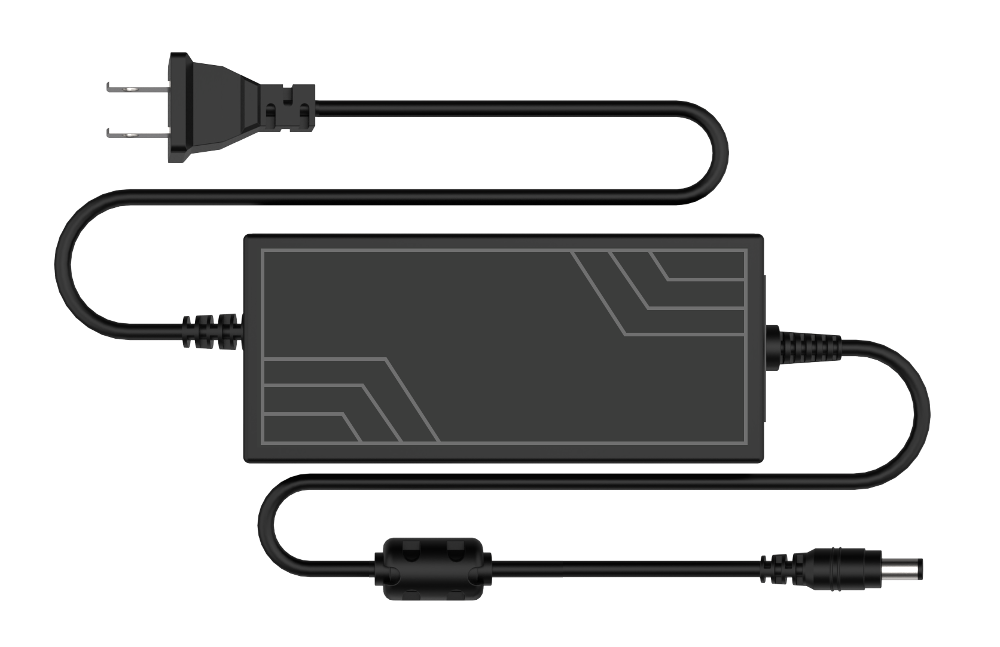</td>
</tr>
<tr>
<td>3</td>
<td>Map</td>
<td>1</td>
<td>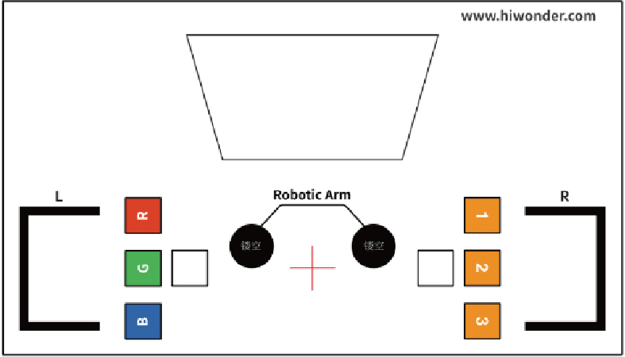</td>
</tr>
<tr>
<td>4</td>
<td>4*4 cm Balls</td>
<td>3</td>
<td>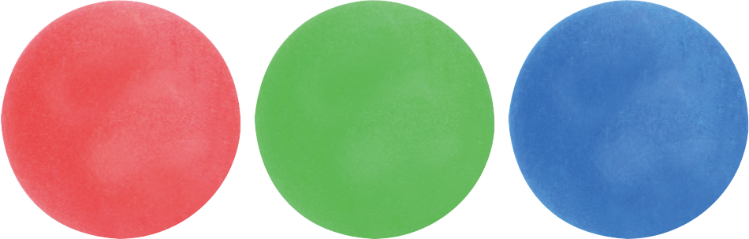</td>
</tr>
<tr>
<td>5</td>
<td>3*3 cm Color blocks</td>
<td>3</td>
<td>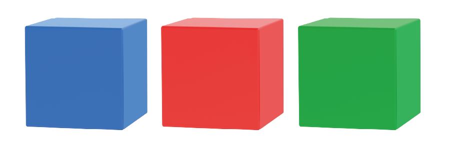</td>
</tr>
<tr>
<td>6</td>
<td>3*3 cm Wooden blocks</td>
<td>3</td>
<td></td>
</tr>
<tr>
<td>7</td>
<td>3*3 Tags</td>
<td>3</td>
<td></td>
</tr>
<tr>
<td>8</td>
<td>Card reader</td>
<td>1</td>
<td>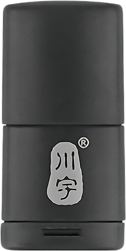</td>
</tr>
<tr>
<td>9</td>
<td>32G card</td>
<td>1</td>
<td></td>
</tr>
<tr>
<td>10</td>
<td>Cable tie</td>
<td>5</td>
<td>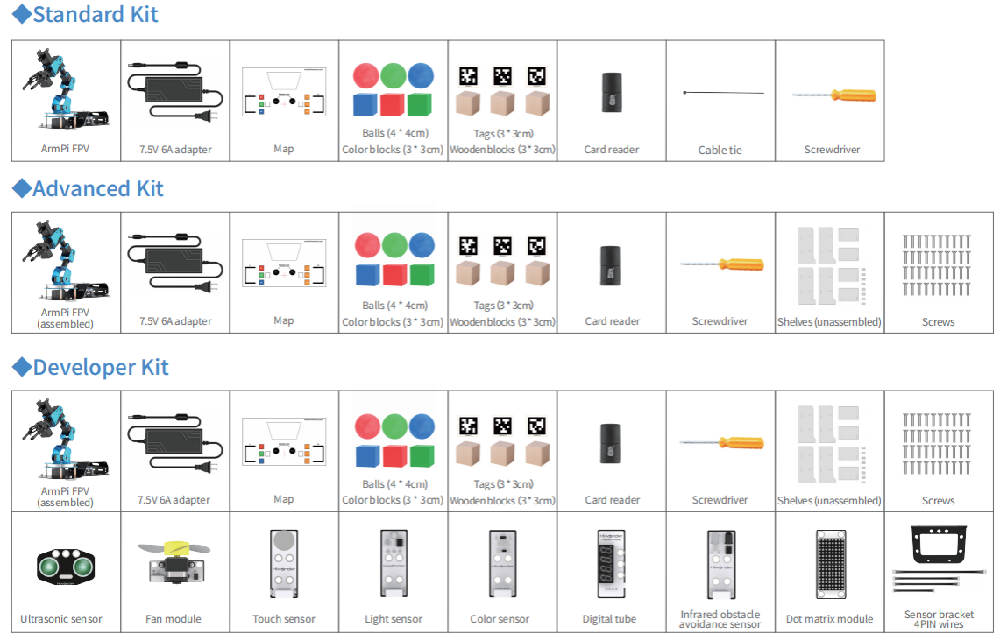</td>
</tr>
<tr>
<td>11</td>
<td>Screwdriver</td>
<td>1</td>
<td>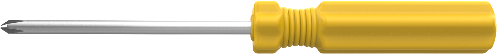</td>
</tr>
<tr>
<td>12</td>
<td>Suction cup</td>
<td>4</td>
<td></td>
</tr>
<tr>
<td>13</td>
<td>ArmPi FPV user manual</td>
<td>1</td>
<td>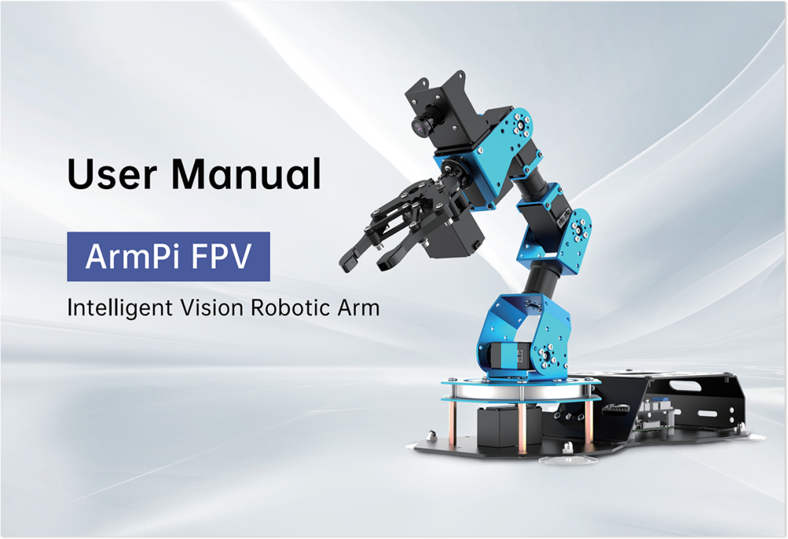</td>
</tr>
<tr>
<td>14</td>
<td>Double sides adhesive tape</td>
<td>1</td>
<td>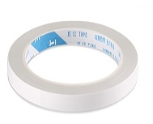</td>
</tr>
<tr>
<td>15</td>
<td>Shelves （side stand*4  support plate*4  L-shaped bracket*8） </td>
<td>1</td>
<td>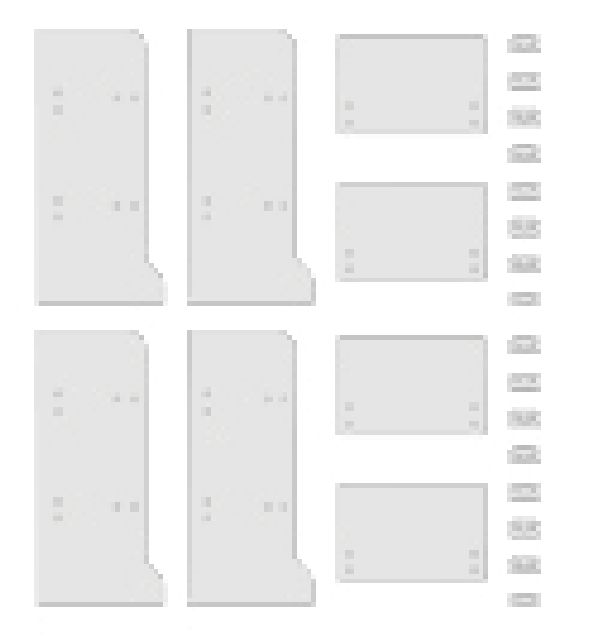</td>
</tr>
<tr>
<td>16</td>
<td>Screws （M3*16 flat head screw*40）</td>
<td></td>
<td>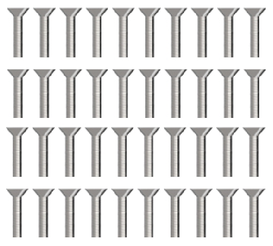</td>
</tr>
</tbody>
</table>

(2) Advanced Kit

<table class="docutils-nobg" border="1" style="width:100%;text-align: center">
  <thead>
    <tr>
      <th>NO.</th>
      <th style="width:50%">Product Name</th>
      <th>Quantity</th>
      <th>Picture</th>
    </tr>
  </thead>
  <tbody>
    <tr>
      <td>1</td>
      <td>ArmPi FPV</td>
      <td>1</td>
      <td></td>
    </tr>
    <tr>
      <td>2</td>
      <td>7.5V 6A adapter</td>
      <td>1</td>
      <td></td>
    </tr>
    <tr>
      <td>3</td>
      <td>Map</td>
      <td>1</td>
      <td></td>
    </tr>
    <tr>
      <td>4</td>
      <td>4*4 cm Balls</td>
      <td>3</td>
      <td></td>
    </tr>
    <tr>
      <td>5</td>
      <td>3*3 cm Color blocks</td>
      <td>3</td>
      <td></td>
    </tr>
    <tr>
      <td>6</td>
      <td>3*3 cm Wooden blocks</td>
      <td>3</td>
      <td></td>
    </tr>
    <tr>
      <td>7</td>
      <td>3*3 Tags</td>
      <td>3</td>
      <td></td>
    </tr>
    <tr>
      <td>8</td>
      <td>Card reader</td>
      <td>1</td>
      <td></td>
    </tr>
    <tr>
      <td>9</td>
      <td>32G card</td>
      <td>1</td>
      <td></td>
    </tr>
    <tr>
      <td>10</td>
      <td>Cable tie</td>
      <td>5</td>
      <td></td>
    </tr>
    <tr>
      <td>11</td>
      <td>Screwdriver</td>
      <td>1</td>
      <td></td>
    </tr>
    <tr>
      <td>12</td>
      <td>Suction cup</td>
      <td>4</td>
      <td></td>
    </tr>
    <tr>
      <td>13</td>
      <td>ArmPi FPV user manual</td>
      <td>1</td>
      <td></td>
    </tr>
    <tr>
      <td>14</td>
      <td>Double sides adhesive tape</td>
      <td>1</td>
      <td></td>
    </tr>
    <tr>
      <td>15</td>
      <td>Shelves （side stand*4 support plate*4 L-shaped bracket*8） </td>
      <td>1</td>
      <td></td>
    </tr>
    <tr>
      <td>16</td>
      <td>Screws （M3*16 flat head screw*40）</td>
      <td>40</td>
      <td></td>
    </tr>
  </tbody>
</table>

(3) Developer Kit

<table class="docutils-nobg" border="1" style="text-align: center;width:100%">
  <thead>
    <tr>
      <th>NO.</th>
      <th style="width:50%">Product Name</th>
      <th>Quantity</th>
      <th>Picture</th>
    </tr>
  </thead>
  <tbody>
    <tr>
      <td>1</td>
      <td>ArmPi FPV</td>
      <td>1</td>
      <td></td>
    </tr>
    <tr>
      <td>2</td>
      <td>7.5V 6A adapter</td>
      <td>1</td>
      <td></td>
    </tr>
    <tr>
      <td>3</td>
      <td>Map</td>
      <td>1</td>
      <td></td>
    </tr>
    <tr>
      <td>4</td>
      <td>4*4 cm Balls</td>
      <td>3</td>
      <td></td>
    </tr>
    <tr>
      <td>5</td>
      <td>3*3 cm Color blocks</td>
      <td>3</td>
      <td></td>
    </tr>
    <tr>
      <td>6</td>
      <td>3*3 cm Wooden blocks</td>
      <td>3</td>
      <td></td>
    </tr>
    <tr>
      <td>7</td>
      <td>3*3 Tags</td>
      <td>3</td>
      <td></td>
    </tr>
    <tr>
      <td>8</td>
      <td>Card reader</td>
      <td>1</td>
      <td></td>
    </tr>
    <tr>
      <td>9</td>
      <td>32G card</td>
      <td>1</td>
      <td></td>
    </tr>
    <tr>
      <td>10</td>
      <td>Cable tie</td>
      <td>5</td>
      <td></td>
    </tr>
    <tr>
      <td>11</td>
      <td>Screwdriver</td>
      <td>1</td>
      <td></td>
    </tr>
    <tr>
      <td>12</td>
      <td>Suction cup</td>
      <td>4</td>
      <td></td>
    </tr>
    <tr>
      <td>13</td>
      <td>ArmPi FPV user manual</td>
      <td>1</td>
      <td></td>
    </tr>
    <tr>
      <td>14</td>
      <td>Double sides adhesive tape</td>
      <td>1</td>
      <td></td>
    </tr>
    <tr>
      <td>15</td>
      <td>Shelves （side stand*4 support plate*4 L-shaped bracket*8）</td>
      <td>1</td>
      <td></td>
    </tr>
    <tr>
      <td>16</td>
      <td>Fan module</td>
      <td>1</td>
      <td>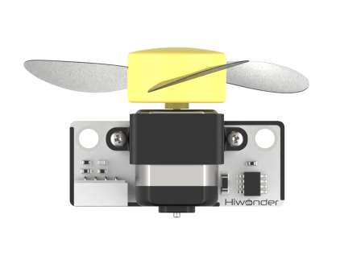</td>
    </tr>
    <tr>
      <td>17</td>
      <td>Ultrasonic sensor</td>
      <td>1</td>
      <td>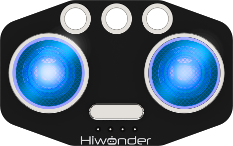</td>
    </tr>
    <tr>
      <td>18</td>
      <td>Touch sensor</td>
      <td>1</td>
      <td>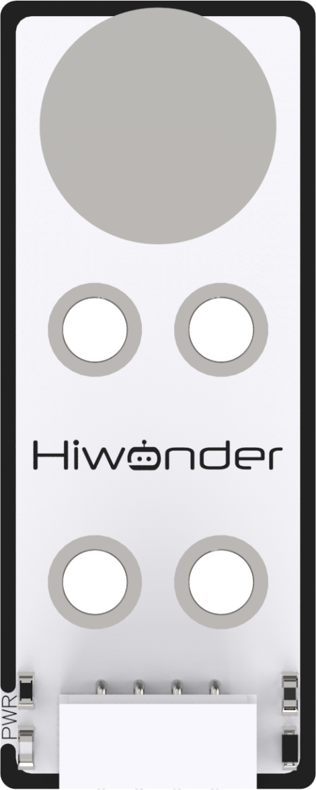</td>
    </tr>
    <tr>
      <td>19</td>
      <td>Light sensor</td>
      <td>1</td>
      <td>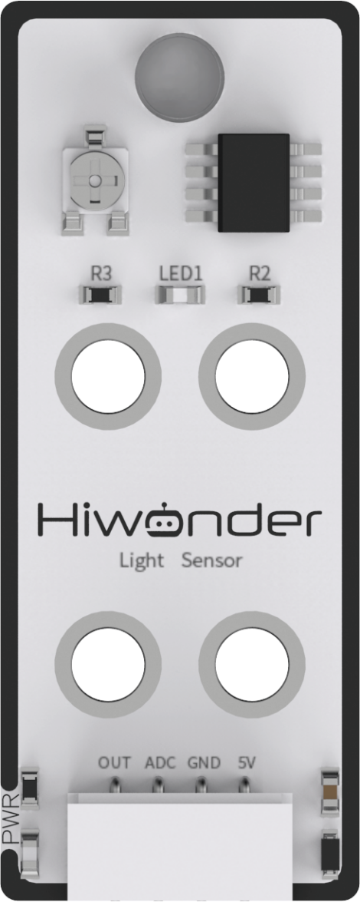</td>
    </tr>
    <tr>
      <td>20</td>
      <td>Digital tube</td>
      <td>1</td>
      <td>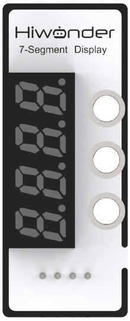</td>
    </tr>
    <tr>
      <td>21</td>
      <td>Infrared obstacle aviodance sensor</td>
      <td>1</td>
      <td>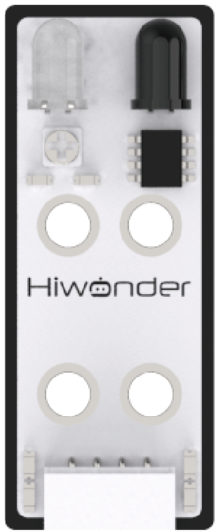</td>
    </tr>
    <tr>
      <td>22</td>
      <td>Dot Matrix module</td>
      <td>1</td>
      <td>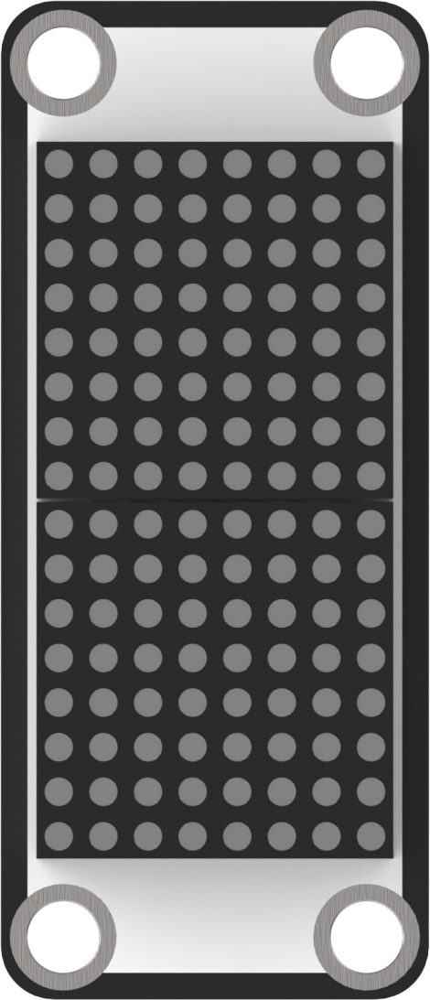</td>
    </tr>
    <tr>
      <td>23</td>
      <td>Color sensor</td>
      <td>1</td>
      <td>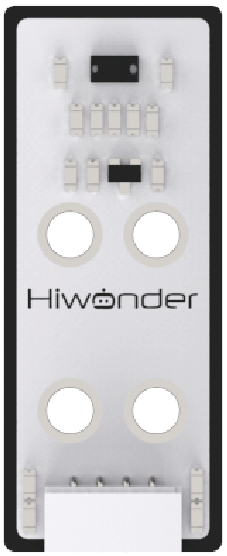</td>
    </tr>
    <tr>
      <td>24</td>
      <td>Sensor braket</td>
      <td>1</td>
      <td>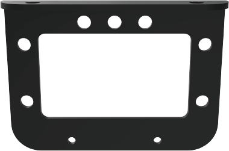</td>
    </tr>
    <tr>
      <td>25</td>
      <td>Screws （M3*16 flat head screw*40）</td>
      <td>40</td>
      <td></td>
    </tr>
    <tr>
      <td>26</td>
      <td>4 PIN wires (50cm 4pin wire*1  20 cm 4pin wire*2  10cm 4pin wire*1) </td>
      <td>4</td>
      <td>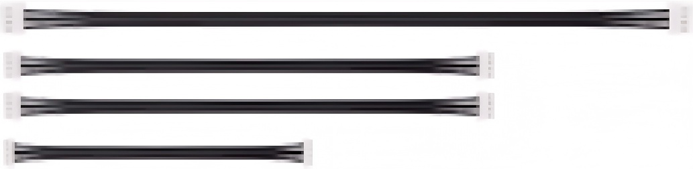</td>
    </tr>
  </tbody>
</table>

## 1.3 Suction Cup Installation and Map Placement

**1.3.1 Map and Device Placement**

Let's briefly learn about map before experiencing games. As follows, it demonstrates the distribution of the map location and equipment placement. 

* **Map Introduction** 

The map consists of four parts as pictured:

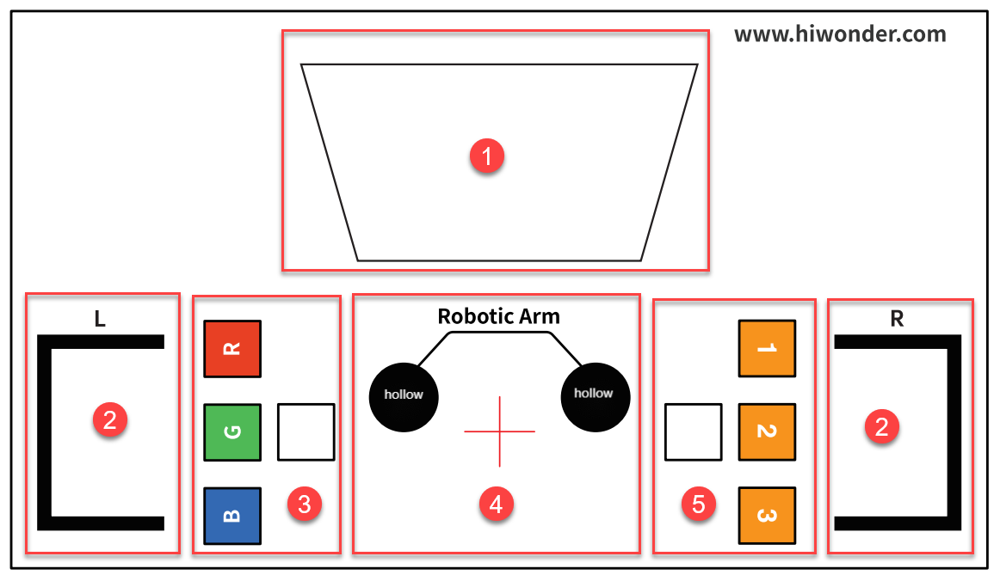

The following will explain the function of these components:

(1) Vision Recognition Area

The visual recognition area is the identifiable range of the robotic arm. Color blocks or labeled wooden blocks that need recognition can be placed within this area.

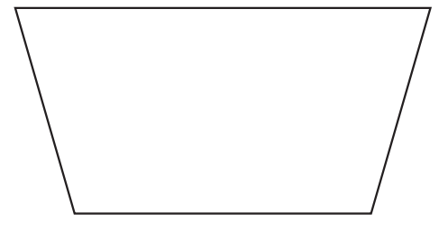

:::{Note}
when place labeled wooden blocks and color blocks, it is recommended to maintain the distance of more than 3cm between the blocks, and avoid placing them at the edges of the visual recognition area to prevent recognition failure.
:::

(2) Shelf Placement Area

Shelf is a tool used in "**Intelligent Warehouse Course**". The robot arm will pick up items and place them on the shelves or pick up items from shelves.

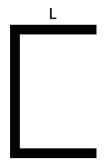
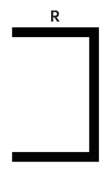

:::{Note}
The thickness of the shelves matches the width of the black lines on the map. Therefore, when placing the shelves, if the black lines are not visible, it means the shelves are placed in the correct position.
:::

(3) Color Sorting and Stacking Area

The robot arm move the blocks in the vision recognition area to the corresponding area.

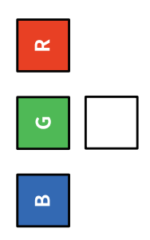

The function of each area are shown as follows:

| Icon | Function |
|:--:|:--:|
| 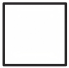 | Stacking area |
|  | Red blocks area |
|  | Green blocks area |
|  | Blue blocks area |

(4) Robotic Arm Area

Place the robot arm in this area before proceeding with its movement. 

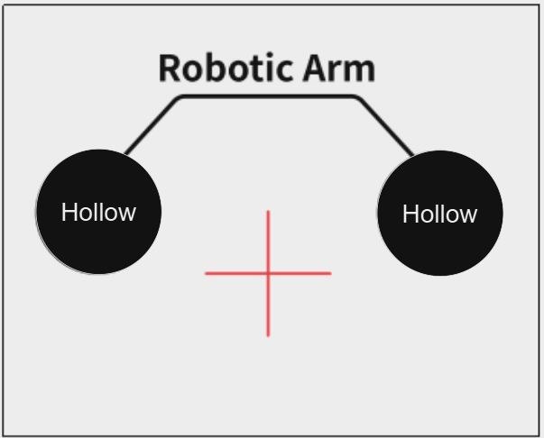

(5) Labeled Wooden Blocks Sorting and Stacking Area

The robot arm move the labeled wooden blocks in the vision recognition area to the corresponding area.

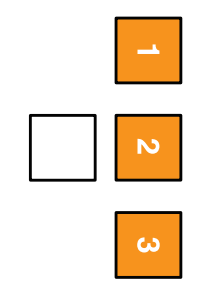

The function of each area are shown as this table:

| Icon | Function |
|:--:|:--:|
|  | Stacking area |
|  | Label wooden block ID1 area |
|  | Label wooden block ID2 area |
|  | Label wooden block ID3 area |

**1.3.2 Device Placement**

Firstly, lay the map flat on the desktop, then place the robot arm in the robot arm placement area. The front end of the base should align with the front edge of the robotic arm placement area, and the suction cup should be closely attached to the tabletop as pictured:

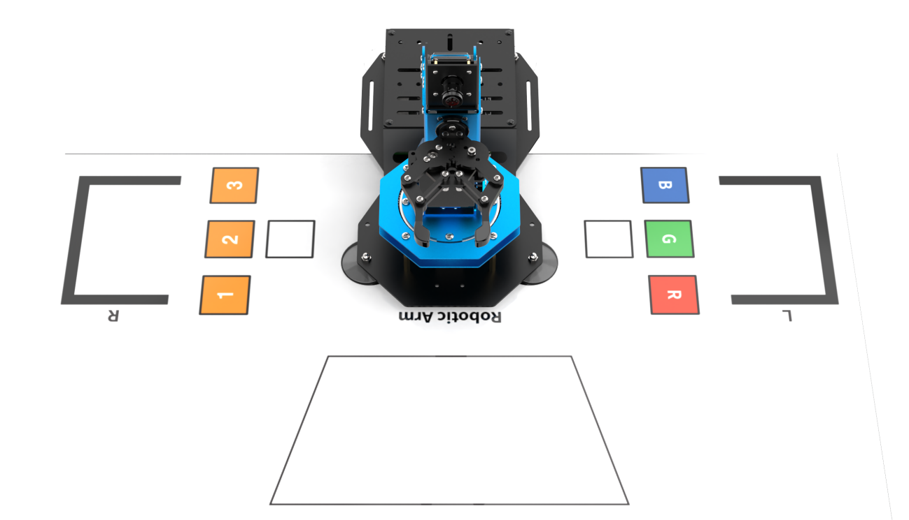

## 1.4 Power-On Status Explanation

**1.4.1 Getting Ready**

(1) Before turning on robot, please inspect if the cables were connected to main control well, including the cables of power, servo, fan and monocular.  

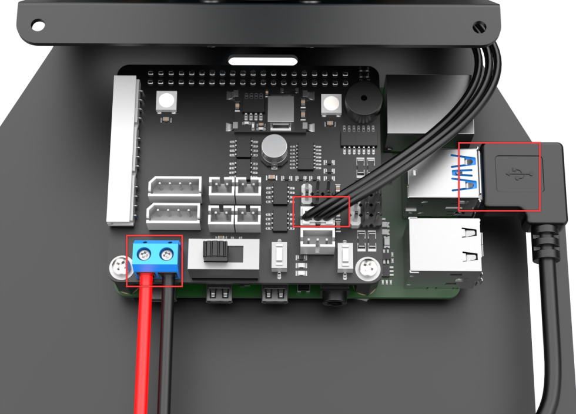

(2) Place robotic arm on flat desktop. Please do not overlap the servos to prevent the damage of servo from sudden force. 

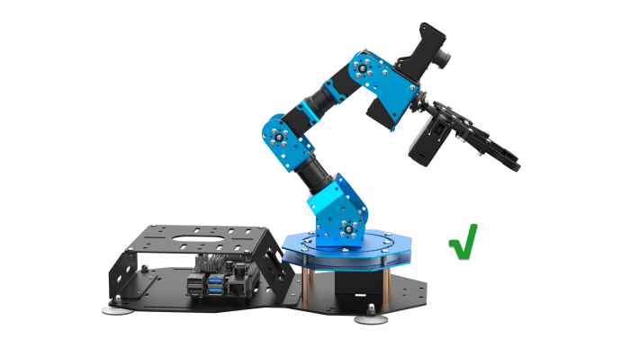

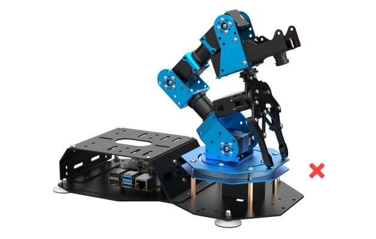

**1.4.2 Turn on ArmPi FPV**

(1) Switch on Raspberry Pi expansion board. The LED1 and LED2 of the Raspberry Pi will be on firstly and then the LED2 will flash every 1 seconds, which means the robot is turned on successfully. Wait for a moment, robotic arm will be back to the initial pose and buzzer will emit "Di" sound, it means device is boot up successfully.

:::{Note}
The flashing of the blue LED2 here indicates that the Wi-Fi has been turned on, but the robot has not yet fully started. You need to wait until the buzzer emits a short beep to indicate that the robot has fully started. 
:::

If the buzzer does not emit a short beep, it indicates that there may be a problem with hardware components such as the RGB, buzzer, buttons on the expansion board. This situation should not occur under normal circumstances. If the above issue occurs, please contact customer service for assistance. 

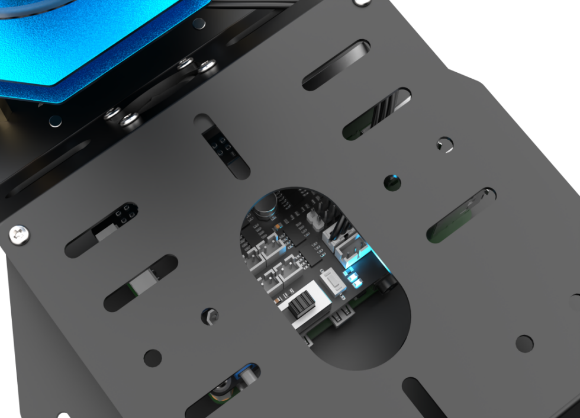

(2) After turning on, Raspberry Pi will be in a AP hotspot mode and launch a Wi-Fi hotspot with a network named with the first letters "**HW**".

