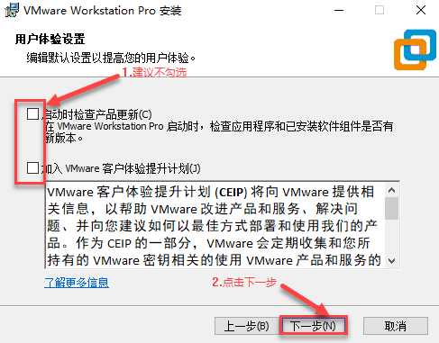
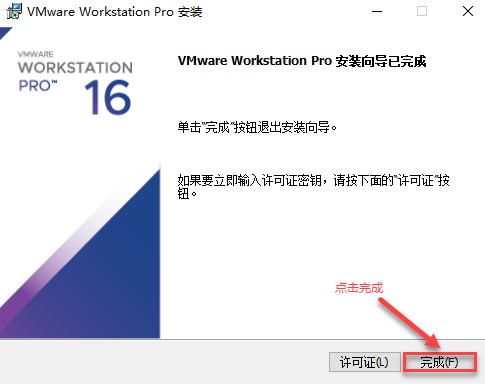
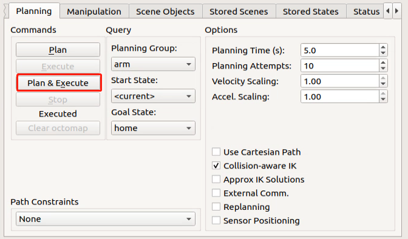
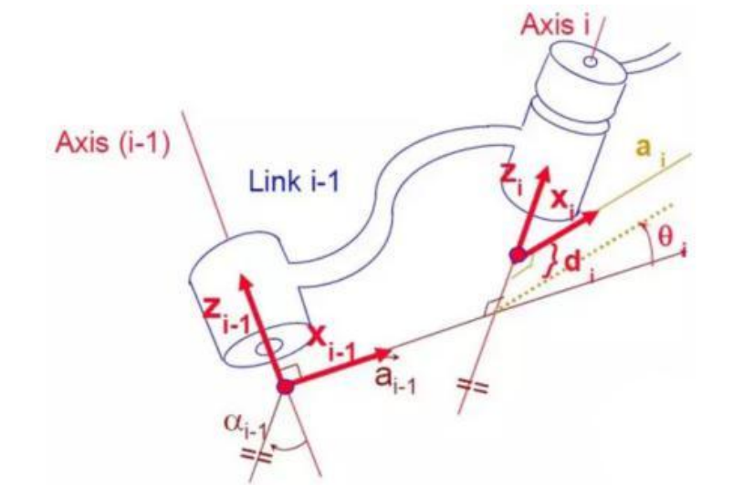
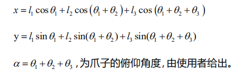
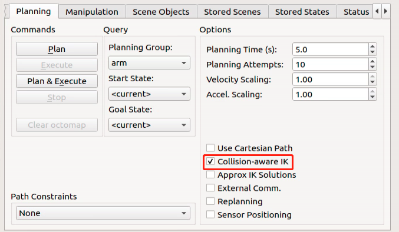

# 机械臂运动及MoveIt仿真课程

## 1. URDF模型简介与入门

### 1.1 URDF模型简介

URDF是一种基于XML规范、用于描述机器人结构的格式。这一格式的目的在于提供一种尽可能通用的机器人描述规范。

机器人通常被建模成由多个连杆和关节组成的结构，连杆可以理解成有质量的刚性物体，关节可以理解成，用于连接和限制两个连杆之间的相对运动。

当多个连杆通过关节相互连接又相互限制，就构成了一个机器人运动模型。URDF文档即描述了这样的一系列关节与连杆的相对关系、惯性属性、几何特点和碰撞模型。

### 1.2 xacro模型与URDF模型比较

URDF模型是比较简单的机器人模型描述文件，它有结构明了，容易理解的特点，若用URDF模型来描述比较复杂的机器人结构时，就会出现描述文件冗长，无法简洁的描述机器人模型。

xacro模型是URDF模型的拓展形式， 本质上两者是一样的。若使用xacro格式来描述机器人，则可以通过更高级的方式来简洁化机器人描述文件，能提描述代码的复用性，一定程度上解决URDF模型的冗长问题。

例如，我们需要描述一个人形机器人的双腿，若使用URDF模型，我们需要将单腿单独描述，若使用的是xacro模型，则只需要描述单腿，进行复用。

### 1.3 安装URDF依赖（仅了解）

:::{Note}
在机器人与虚拟机内已安装好URDF模型与Xacro模型，所以用户无需重复安装，本节内容仅作了解即可。
:::

1.  输入指令，并按下回车，更新安装包信息。

```py
sudo apt update
```

2.  输入指令，并按下回车，安装URDF依赖。

```py
sudo apt-get install ros-melodic-urdf
```

当出现下图即代表安装成功：


3.  输入指令，并按下回车，安装URDF模型拓展格式xacro。

```py
sudo apt-get install ros-melodic-xacro
```

当出现下图即代表安装成功：


### 1.4 URDF模型基本语法

**XML基础语法**

由于URDF模型是基于XML规范编写的，我们需要了解XML格式的基本构成。

元素：

元素可以根据我们想要定义的名字去定义，定义元素的时候我们可以根据下列语法规则：

```xml
<元素>
</元素>
```

属性：

属性是被包含到元素内部，用于定义一个元素的一些性质和参数，定义元素的时候可以根据下列公式：

```xml
<元素属性_1 = "属性值1" 属性_2 = "属性值2">
</元素>
```

\<元素属性_1 = "属性值1" 属性_2 = "属性值2"\>

\</元素\>

注释：

注释不影响其他属性和元素，定义注释时可以根据下列语法规则：

```xml
<!-- 注释内容>
```

**连杆**

连杆在URDF模型中以"link"作为标签，它描述了机器人某个刚体部分的外观和物理属性，编写连杆动作会用到下图标签：

```xml
<link name="link name">
	<inertial>......</inertial>
    <visual>......</visual>
    <collision>......</collision>
</link>
```

**\<visual\>**：描述机器人link部分的外观参数，如尺寸、颜色、形状等。

**\<inertial\>**：描述link的惯性参数，主要用到机器人动力学的运算部分。

**\<collision\>**：描述link的碰撞属性。

每个标签都含相应的子标签和不同的作用，可以参考下表：

| 标签 | 作用 |
|:--:|:--:|
| origin | 对连杆位姿的描述。内部有两个参数：xyz描述的是连杆在仿真地图中的位姿，rpy描述的是连杆在仿真地图中的姿态。 |
| mess | 描述连杆的质量 |
| inertia | 描述连杆的惯性，由于惯性矩阵的对称性，需要填入六个参数ixx, ixy, ixz, iyy, iyz, izz作为属性。这些参数需要通过计算得到。 |
| geometry | 描述连杆的形状，它有用mesh参数加载纹理文件，用filename参数加载纹理的路径地址。还有三个子标签：box、cylinder、sphere，分别表示矩形、圆柱、球。 |
| material | 描述连杆的材质，参数name为必填项。通过子标签color可以调节颜色和透明度。 |

<p id="anchor_1_4_3"></p>

**关节**

关节在URDF模型中以"**joint**"作为标签，描述机器人关节的运动学和动力学属性，以及运动的位置和速度限制。根据运动的形式，将关节分为下表中六种类型：

|                  **类型和说明**                  |  **标签**  |
|:------------------------------------------------:|:----------:|
|          旋转关节：可以围绕单轴无限旋转          | continuous |
| 旋转关节：类似于continuous，但是有旋转的角度限制 |  revolute  |
|   滑动关节：沿某一轴线移动的关节，带有位置极限   | prismatic  |
|    平面关节：允许在平面正交方向上平移或者旋转    |   planar   |
|         浮动关节：允许进行平移、旋转运动         |  floating  |
|          固定关节：不允许运动的特殊关节          |   fixed    |

编写关节动作会用到下图标签：

```xml
<joint name="name of joint">
	<parent link="link1">
    <child link="link2">
    <calibration>......</calibration>
    <dynamics damping ....../>
    <limit effort ....../>
</joint>
```

**\<parent_link\>**：父连杆。

**\<child_link\>**：子连杆。

**\<calibration\>**：用于校准关节角度。

**\<dynamics\>**：描述运动的一些物理属性。

**\<limit\>**：描述运动的一些极限值。

每个标签都含相应的子标签和不同的作用，可以参考下表：

| **标签** | **作用** |
|:--:|:--:|
| origin | 对父连杆位姿的描述。内部有两个参数：xyz描述的是连杆在仿真地图中的位姿，rpy描述的是连杆在仿真地图中的姿态。 |
| axis | 设置子连杆对父连杆的XYZ三轴中任意一轴做转动。 |
| limit | 限制子连杆，lower属性和upper属性限制了旋转的弧度范围，effort属性限制的是转动过程中的受力范围。(正负value值，单位为牛或N)，velocity属性限制了转动时的速度，单位为米/秒或m/s。 |
| mimic | 描述该关节与其他关节的关系 |
| safety_controller | 描述安全控制器参数，用于保护机器人的关节运动。 |

**robot标签**

完整的机器人最顶层的标签，**\<link\>**标签和**\<joint\>**标签必须包含在**\<robot\>**内，格式如下：

```xml
<robot name="name of robot">
	<link>......</link>
    <link>......</link>
    
    <joint>......</joint>
    <joint>......</joint>
</robot>
```

**gazebo标签**

配合gazebo仿真器使用，可以设置一些仿真参数，使用此标签引入gazebo插件、gazebo物理属性设置等等。

```xml
<gazebo reference="link1">
	<material>Gazebo/Black</material>
</gazebo>
```

**编写简单的URDF模型**

**设置机器人模型名称**

在编写URDF模型最开始时，我们需要设置机器人模型的名字："\<robot name="机器人模型名称"\>"。在模型编写的最后输入"\</robot\>"，表示该机器人模型编写完成。

```xml
<?xml version="1.0"?>
<robot name="pan_tilt">

</robot>
```

**设置连杆**

1.  编写第一个连杆，用缩进表示此连杆属于此次设置的模型内，然后需要设置连杆的名称："\<link name="连杆名称"\>"。在连杆编写的最后需要输入"\</link\>"，表示该连杆编写完成。

```x
<link name="base_link">

</link>
```

2. 编写连杆描述部分，用缩进表示此描述用于此次设置的连杆内，需要在描述的开头输入"\<visual\>"开始描述，在描述结束后输入"\</visual\>"。

```xml
<visual>

</visual>
```

3. "\<geometry\>"是对连杆形状的描述，描述完毕后需要输入"\</geometry\>"，在其中，用缩进表示其内部是对连杆外形的具体描述。下图描述了一个连杆外形："\<cylinder length="0.01" radius="0.2"/\>"，其中，length="0.01"表示该连杆的长度为0.01米， radius="0.2"该连杆半径为0.2米，是一个圆柱体。

```xml
<geometry>
	<cylinder length="0.01" radius="0.2" />
</geometry>
```

4. "**\<origin\>**"是对连杆位置的描述，用缩进表示对连杆位置的具体描述。下图描述了一个连杆位置："**\<origin rpy="0 0 0" xyz="0 0 0" /\>**"，其中rpy为连杆的角度，xyz为连杆的坐标位置。表示连杆在坐标系中的位置为原点。

```xml
<origin rpy="0 0 0" xyz="0 0 0" />
```

5. "\<material\>"**是对连杆位置的描述，用缩进表示对连杆颜色的具体描述，需要在描述的开头输入**"\<material\>"**开始描述，在描述结束后输入**"\</material\>"**。下图描述了将连杆设置成黄色：**"\<color rgba="1 1 0 1" /\>"，rgba="1 1 0 1"**为设置颜色阈值。

```xml
<material name="yellow">
	<color rgba="1 1 0 1" />
</material>
```

**设置关节**

1.  编写第一个关节，用缩进表示此关节属于此次设置的模型内，然后需要设置关节的名称和类型：**"\<joint name="关节名称" type="关节类型"\>"**。在关节编写的最后需要输入"**\</joint\>"**，表示该关节编写完成。

:::{Note}
关节类型可以前往"[关节](anchor_1_4_3)"进行学习。
:::

```xml
<joint name="pan_joint" type="revolute">

</joint>
```

1.  编写关节连接连杆描述部分，用缩进表示此描述用于此次设置的关节内，需要设置parent参数和child参数。可以根据以下公式设置："**\<parent link="父连杆"/\>**"、"**\<child link="子连杆"/\>**"。当关节转动的时候，会以父连杆为支店，转动子连杆。

```xml
<parent link="base_link" />
<child link="pan_link" />
```

1.  "**\<origin\>**"是对关节位置的描述，用缩进表示对关节位置的具体描述。下图描述了一个关节位置：**"\<origin xyz="0 0 0.1" /\>"**，其中，xyz为关节的坐标位置，表示关节在坐标系的具体位置为x=0、y=0、z=0.1。


```xml
<origin xyz="0 0 0.1" />
```

1.  "**\<axis\>**"是对关节位置的描述，用缩进表示对关节姿态的具体描述。下图描述了一个关节姿态："**\<axis xyz="0 0 1" /\>**"，其中，xyz为关节的姿态位置。


```xml
<axis xyz="0 0 1" />
```

1.  "**\<limit\>**"是对关节运动进行限制，用缩进表示对关节角度限制的具体描述。下图描述了关节限制了转动关节最大的力不超过300牛，转动弧度的上线为3.14，下限为-3.14。其中，根据以下公式设置:**effort**="**关节的力度（牛）**"、**velocity**="**关节运动的速度**"、**lower**="**弧度下限**"、**upper**="**弧度上限**"。


```xml
<limit effort="300" velocity="0.1" lower="-3.14" upper="3.14" />
```

1.  "**\<dynamics\>**"是对关节位动力学的描述，用缩进表示对关节姿态的具体描述。下图描述了一个关节的动力学参数："**\<dynamics damping="50" friction="1"/\>**"，其中，**damping**="**阻尼值**"、fric**t**ion="**摩檫力**"。

```xml
<dynamics damping="50" friction="1" />
```

**全部代码如下所示：**

```xml
<?xml version="1.0"?>
<robot name="pan tilt">

	<!--定义Jbase link -->
	<!--<visual>标签描述了在仿真环境的外观，包括几何外形geometry>(园柱形cylinder)等--)
	<link name="base link">
		<visual>
			<geometry>
				<cylinder length="0.01" radius="0.2" />
			</geometry>
			<origin rpy="0 0 日" xyz="0 0 0" />
			<material name="yellow">
				<color rgba="1 1 0 1"/>
			</material>
		</visual>
	</link>

    <!--定义了关节pan joint，以及其关节类型:旋转副(有限制)-->
	<!--旋转副连接的两个刚体分别为base link和pan link -->
	<joint name="pan joint" type="revolute">
		<parent link="base link" />
		<child link="pan link" />
		<origin xyz="0 0 0.1"/>
		<axis xyz="0 0 1" />
		<limit effort="300" velocity="0.1" lower="-3.14" upper="3.14" />
		<dynamics damping="50" friction="1"/>
	</joint>

    <link name="pan_link">
		<visual>
			<geometry>
				<cylinder length="0.4" radius="0.04" />
			</geometry>
			<origin rpy="6 0 θ" xyz="0 0 0.09"/>
			<material name="red">
				<color rgba="6 0 1 1"/>
			</material>
		</visual>
	</link>

    <joint name="tilt joint" type="continuous">
		<parent link="pan link" />
		<child link="tilt link" />
		<origin xyz="0 0 0.2"/>
		<axis xyz="0 1 0" />
		<limit effort="300" velocity="0.1" lower="-4.64" upper="-1.5"/>
		<dynamics damping="50" friction="1"/>
	</joint>

    <link name="tilt link">
		<visual>
			<geometry>
				<cylinder length="0.4"radius=0.04" />
			</geometry>
			<origin rpy="0 1.5 0" xyz="0 0 0" />
			<material name="green">
				<color rgba="1 0 0 1"/>
			</material>
		</visual>
	</link>
</robot>
```

## 2.R OS机械臂URDF模型说明

:::{Note}
在输入指令时需要严格区分大小写，且可使用"Tab"键补齐关键词。
:::

本节对机械臂模型代码和部件模型进行简要解析。

### 2.1 查看机械臂模型代码

将设备开机，并参照课程资料的"**[远程工具安装及容器进入方法 \1. 远程工具安装与连接]()**"内容，通过VNC远程连接工具连接。


1.  点击系统桌面左上角的图标，打开Terminator终端输入指令，并按下回车，进入urdf程序目录。

```commandline
cd armpi_fpv/src/armpi_fpv_descrption/urdf
```

2. 输入指令，打开仿真模型文件。

```commandline
vim armpi_fpv.urdf
```

3. 找到下图所示代码区域：


4. 上图中调用了多个urdf模型来组成完整的机械臂：

| **标签**  |                 **说明**                 |
|:---------:|:----------------------------------------:|
| material  |                   颜色                   |
| inertial  | 惯性，转动惯量，使Gazebo物理引擎正常工作 |
| base_link |              机械臂主体模型              |
|   robot   |          总体名称，凡是URDF文件          |
|   joint   |         可活动的机械部件，例如轴         |

### 2.2 机械臂主体模型简要解析

**机械臂各关节参数**

1)  首先机械臂在全代码中定义了6个连杆，每个连杆代表一个关节。由于定义连杆Link-Link5都大致相同，仅模型与初始位置不同，所以这里以Link为例，进行说明：


2)  描述其的惯性\<inertlal\>：定义产生惯性的初始位置（关键字"origin"），定义质量（关键字"mass"），定义惯性属性（关键字"inertia"）；

3)  定义\<visual\>描述外观：位置为原点（关键字"origin"）、引入相关的模型（关键"geometry"）、将颜色定义为蓝色（关键字"material"）；

4)  定义碰撞属性\<collision\>：产生碰撞的初始位置（关键字"origin"）以及碰撞位置的模型（关键字"geometry"），将颜色定义为灰色（关键字"material"）。

**摄像头模型参数**

1)  摄像头模型被定义了连杆"camera_link"。

2)  描述其的惯性\<inertlal\>：定义产生惯性的初始位置（关键字"origin"），定义质量（关键字"mass"），定义惯性属性（关键字"inertia"）。

3)  定义\<visual\>描述外观：位置为原点（关键字"origin"）、引入相关的外观模型（关键字"geometry"）、将颜色定义为灰色（关键字"material"）。


**夹持器（爪子）参数**

1)  夹持器模型被定义了连杆"**gripper_base**"。

2)  描述其的惯性\<inertlal\>：定义产生惯性的初始位置（关键字"origin"）、定义质量（关键字"mass"）、定义惯性属性（关键字"inertia"）。

3)  定义\<visual\>描述外观：位置为原点（关键字"origin"）、引入相关的外观模型（关键字"geometry"）、将颜色定义为灰色（关键字"material"）。


<p id="anchor_3"></p>

## 3. 环境搭建及建立连接

注意：虚拟机开机后，需输入密码"**ubuntu**"方可进入。

### 3.1 安装虚拟机并启动

1.  确认电脑网络已连接（这里以"**Hiwonder**"为例）。


2. 将"**[软件工具\6. 虚拟机安装包与镜像]()**"路径下的**Ubuntu**镜像压缩包和虚拟机软件压缩包进行解压。

<p >
    
    
</p>

3. 解压完成后找到**VMware**虚拟机文件夹，双击虚拟机可执行文件（后缀名为**.exe**）。


接着按照下图所示内容完成虚拟机的安装。







4. 安装完成后，双击桌面上的图标。第一次启动虚拟机时，需要输入产品秘钥。复制虚拟机文件夹"**VMware16 激活密钥.txt**"文本中的任意一个秘钥，粘贴到产品密钥中。点击"**继续**"即可。


5.  进入虚拟机界面后，点击"**打开虚拟机**"。


6. 出现弹窗后，选择解压后ubuntu镜像文件夹内的"**Ubuntu64位.vmx**"文件，点击"**打开**"。


7. 完成上述步骤后，点击"**开启此虚拟机**"。


8. 在弹出的窗口选择"**我已复制该虚拟机（P）**"。


9.  虚拟机开机后，密码为"**ubuntu**"输入完成即可进入。

### 3.2 建立连接

**获取虚拟机桥接模式下的IP**

1)  在VMware虚拟机界面点击"**编辑**"，选择"**虚拟网络编辑器**"。


2)  选择"**VMnet0**"，然后选择合适的桥接模式（根据实际情况选择网卡类型），点击"**应用**"，然后再点击"**确定**"。（如果没有"VMnet0"桥接模式，可以点击"还原默认设置"）


3)  查看网卡类型的方法如下所示（以Win10版本为例）：

4. 依次点击"**开始-\>设置-\>网络和 Internet-\>更改适配器选项**"，找到下图数字序号"**6**"所示内容即为网卡类型。


5)  选择完成后，再点击"**虚拟机**"，选择"**设置**"。


6)  点击"**硬件**"，点击"**网络适配器**"，选择"**桥接模式**"，勾选"**复制物理网络连接状态**"，点击"**确定**"，即可修改虚拟机网络配置。


7)  打开ubuntu的命令行终端，输入指令，查看虚拟机IP，将虚拟机IP记录下来。（此处只是示例，每台电脑的虚拟机IP不同）

```commandline
ifconfig
```


:::{Note}
输入"ifconfig"未出现IP，原因是虚拟机需要更新IP，等待一会，多输入几次即可。
:::

**获取机械臂的IP**

1.  将手机上的Wi-Fi连接到与电脑相同的Wi-Fi网络下。（这里以"Hiwonder"为例）


2. 打开手机上的"**WonderPi"**软件，选择"**进阶平台**"、"**ArmPi**"。


3. 接着在产品选择里，选择"**ArmPi FPV**"。


4.  点击框中图标，选择连接模式。


5. 选择"**局域网模式**"。


6. 输入**Wi-Fi**密码，点击"**好的**"。


7. 点击"**去连接设备热点**"。


8. 选择设备热点进行连接。（这里以"**HW-E0768005**"为例）


9. 等待连接完成。


10. 连接完成后等待它自动搜索。若未搜索到可点击搜索图标，重新搜索设备。（连接成功时树莓派拓展板的LED1和LED2常亮）


11. 搜索到设备后，长按设备图标，就可看到设备的IP地址了，将它记录下来（以上步骤只是为了获取设备的IP地址，大家也可通过其它方法获取）。


**在设备中添加虚拟机IP**

1.  再次确认电脑与手机连接至同一Wi-Fi网络下。


2. 连接完成后双击图标，在下图位置输入2.3.2中获取的设备IP，并点击绿框位置。


3. 接着按照图示内容输入用户名"**pi**"和密码"**raspberrypi**"，进入设备桌面。


4.  在提示页面下进行勾选，并点击"**OK**"。


5.  点击左上角的图标，打开命令行终端。


6.  输入指令，按下回车，进入网络配置文件。

```commandline
sudo vim /etc/hosts
```


7.  按下键盘上的"**i**"进入编辑模式，在第2行下面添加机械臂IP和虚拟机IP。（注意：IP后面的名称不可随意更改）

    

8.  按下"**Esc**"，输入指令退出并保存。

```commandline
:wq
```

**在虚拟机中添加IP**

1)  点击框中图标，打开命令行终端。


2)  输入指令，按下回车，进入网络配置文件。（如果提示"**password for ubuntu**"，输入"**ubuntu**"回车即可）。

```commandline
sudo vim /etc/hosts
```


3)  按下键盘上的"**i**"进入编辑模式，将第2行注释，在第2行下面添加虚拟机IP和机械臂**IP**。（注意：IP后面的名称不可随意更改）


4)  按下"**Esc**"，输入指令退出并保存。

```commandline
:wq
```

5)  输入指令，按下回车，进入网络配置文件。（如果提示"**password for ubuntu**"，输入"**ubuntu**"，输入密码时界面不会有任何显示，输入完成回车即可）。

```commandline
sudo vim ~/.bashrc
```


6)  在打开后，按下键盘上的"**i**"进入编辑模式，将最后两行的"**ROS_MASTER_URI**"处改为"**http://+机械臂IP的名称+:11311**"，将"**ROS_HOSTNAME**"处的IP改为虚拟机 IP的名称（此处可以写具体IP，也可以写网络配置文件中的名称）。


7)  按下"**Esc**"，输入指令退出并保存

```commandline
:wq
```

8)  返回后，在**ubuntu**命令行界面输入指令，让更改的部分生效。

```commandline
source ~/.bashrc
```


9)  在**ubuntu**的命令行界面输入，若出现**ArmPi FPV**机械臂开启的节点，则说明配置联网成功。

```commandline
rostopic list
```


### 3.3 MoveIt配置

:::{Note}
MoveIt配置在机器出厂前已经提前配置好了，无需再进行更改，本节内容仅对配置内容做介绍了解，想直接体验玩法的可以跳过此步骤。
:::

**MoveIt介绍**

MoveIt由ROS中一系列移动操作的功能包组成，包含运动规划、操作控制、3D感知、运动学、碰撞检测等，是目前针对移动操作最先进的软件。

它提供了一个操作便捷的平台，用于开发先进的机器人应用程序，评估新的机器人设计和建筑集成的机器人产品，并且它已经应用于工业、商业、研发和其他领域，是目前被使用最广泛的开源操作软件。

此外，MoveIt还提供了一系列成熟的插件和工具，可以实现机械臂控制的快速配置，并且封装了大量API，方便用户在MoveIt模块上进行二次开发，进而开发更多创意应用。

**启动配置程序**

:::{Note}
输入指令时需要严格区分大小写，且可使用"Tab"键补齐关键词。
:::

1)  将机械臂开机，并通过本文同目录下的"**[3. 环境搭建及建立连接](#anchor_3)**"内容，将机械臂与虚拟机建立连接。

2)  双击虚拟机系统桌面的图标，打开命令行终端。

3)  输入指令，启动MoveIt设置助手。

```commandline
roslaunch armpi_fpv_moveit_config setup_assistant.launch
```

4)  点击，编辑现有的配置包。

```commandline
Edit Existing MoveIt Configuration Package
```


5)  接着点击"**Browse**"，选择"**/home/ubuntu/armpi_fpv/src**"路径下的"**armpi_fpv_moveit_config**"文件夹，点击打开。


6)  点击"**Load Files**"，等待文件加载完成。


加载到100%后，右侧会出现机器人的模型，代表加载成功。


7)  然后对左侧的**"Virtual joints"、"Robot pose"**等内容选项进行配置。


:::{Note}
重新配置会覆盖掉之前配置好的，如果有步骤出错，可能会造成无法使用。
:::

**配置介绍**

- **Self-Collisions**

产生自定义碰撞矩阵，默认的碰撞矩阵生成器会搜索机器人所有的关节，这个碰撞矩阵可以安全地关闭检测，从而减少行动规划的处理时间。

采样密度是指抽取多少个随机关节来检查碰撞。更高的密度需要更多的计算时间，默认值是10000个碰撞检测。


- **Virtual joints**

添加虚拟关节，虚拟关节主要用于将机器人连接到仿真程序上。这里定义了一个虚拟关节连接base_footprint和world_frame框架。


- **Planning Groups**

添加关节组合，主要用于描述组成机器人所需的不同关节部分。


- **Robot Poses**

定义机器人的姿态，自定义机器人的姿态名称，以及该姿态所需要用到哪些关节组合。


- **Passive Joints**

定义不使用的关节，设置哪些是可用的关节，哪些是不可用的关节。


- **ROS Control**

这里我们可以通过ROS Control面板为关节添加模拟控制器，这样就可以通过MoveIt模拟机械臂运动。


- **Simulation**

设置Gazebo仿真，设置仿真需要的URDF文件。


- **3D perception**

**环境感知**

支持外部传感器，能够将采集的点云或者深度数据，转换为（octomap）八叉树，并添加至仿真环境中，以进行运动规划和避障。


- **Author Information**

添加作者信息。


- **Configuration Files**

生成配置文件，确认好文件路径后，点击"**Generate Package**"生成配置包。


## 4. MoveIt注意事项与控制

### 4.1 注意事项

**开始前，请确保机械臂周围有足够的活动空间，执行玩法期间与机械臂保持一定的距离，避免对人体产生误伤。**

本节会使用MoveIt来规划路径，并控制仿真模型和真实机械臂按照路径移动到指定位置。

### 4.2 启动MoveIt工具和控制机械臂

:::{Note}
输入指令时需要严格区分大小写，且可使用"Tab"键补齐关键词。
:::

1)  将机械臂开机，并通过"**[3. 环境搭建及建立连接](#anchor_3)**"内容，将机械臂与虚拟机建立连接。

2)  双击虚拟机系统桌面的图标，打开命令行终端。

3)  打开一个新的命令行终端，输入指令，启动MoveIt工具。

```commandline
roslaunch armpi_fpv_moveit_config demo.launch
```


程序界面如下图所示：

一号位置为：RVIZ工具栏、二号位置为：Movelt调试区、三号位置为：仿真模型调节区。


### 4.3 控制说明

1)  在MoveIt调试区找到并点击"**Planning**"版块。


2)  在仿真模型调节区，有红绿蓝三种颜色的箭头，点击并拖动箭头即可调节机械臂的姿态。以机械臂为第一视角，其中绿色是X轴方向，正方向为机械臂左方；红色是Y轴方向，正方向为机械臂前边；蓝色是Z轴方向，正方向是机械臂上方。


3)  除了通过箭头整体调节，也能直接单独调节对应关节，点击右边的三角标志，找到并点击"**Joints**"面板。


4)  拖动对应关节的滑杆，单独调整关节的角度。


5)  正常规划完机械臂运动路径后，新的位置会以橙色标识，如新的位置和机械臂其他部分有碰撞，则会标识为红色，此时需要重新调整到无碰撞状态，否则会无法执行该动作。

橙色可执行状态如图：


比如机械臂按下图这样位置规划，将会与我们的货架发生碰撞。所以为红色不可执行状态，如下图：


6)  规划好路径后，回到"**Planning**"版块，点击"**Plan**"选项，仿真模型会演示出原位置到新规划位置的移动路径。


7)  之后点击"**Execute**"选项，可使仿真模型和机械臂都执行规划好的运动。


8)  点击"**Plan & Execute**"则机械臂先演示新规划的移动路径后，再执行动作。



9)  如需关闭此玩法，可在终端界面按下"Ctrl+C"。若关闭失败，请反复尝试。

## 5. MoveIt随机移动

### 5.1 注意事项

**开始前，请确保机械臂周围有足够的活动空间，执行玩法期间与机械臂保持一定的距离，避免对人体产生误伤。**

本节会使用MoveIt来规划路径，并控制仿真模型和真实机械臂移动到随机位置。

### 5.2 启动相关服务

:::{Note}
输入指令时需要严格区分大小写，且可使用"Tab"键补齐关键词。
:::

1)  将机械臂开机，并通过"**[3. 环境搭建及建立连接](#anchor_3)**"内容，将机械臂与虚拟机建立连接。

2)  双击虚拟机系统桌面的图标，打开命令行终端。

3)  打开一个新的命令行终端，输入指令：，启动MoveIt工具。

```commandline
roslaunch armpi_fpv_moveit_config demo.launch
```


程序界面如下图所示：

一号位置为：RVIZ工具栏、二号位置为：Movelt调试区、三号位置为：仿真模型调节区。


### 5.3 随机移动

1)  在MoveIt调试区找到并点击"**Planning**"版块。


2)  在仿真模型调节区，有红绿蓝三种颜色的箭头，以机器人为第一视角，其中绿色是X轴方向，正方向为机器人左方；红色是Y轴方向，正方向为机器人前方；蓝色是Z轴方向，正方向是机器人上方。


3)  在"**Query**"类别中，点击"**Planning Group**"的下拉菜单，选择需要控制的关节组（舵机组），这里默认以"**arm**"组为例。


4)  点击"**Goal State**"的下拉菜单，选择所需的目标位置。


5)  下拉菜单中的参数列表如下所示：


具体参数含义如下：

第一个参数"**random valid**"是有效的随机位置，即不会发生碰撞；

第二个参数"**random**"是随机位置，但可能会随机到发生碰撞的情况；

第三个参数"**current**"是当前的位置；

第四个参数"**same as start**"是和开始位置相同；

第五个参数"**previous**"是上一个目标位置。

后面的"**home**"以及"**p1**"为程序默认设置的位置。

6)  为避免随机到发生碰撞的情况，我们选择"**random valid**"来随机一个目标位置，每次选择都会随机一个目标位置，并用仿真模型展示出来。


7)  点击"**Plan & Execute**"，仿真模型和机械臂将同时进行，仿真模型演示新规划的移动路径，机械臂则执行动作。

:::{Note}
实际表现上来说，软件可能会相对慢一些，这是正常现象！
:::


8. 如需关闭此玩法，可在终端界面按下"**Ctrl+C**"。若关闭失败，请反复尝试。

## 6. MoveIt运动学设计

### 6.1 运动学介绍

运动学是从几何的角度（指不涉及物体本身的物理性质和加在物体上的力) 出发，描述和研究物体位置随时间变化的规律，是力学的一个分支。其中正运动学和逆运动学则是求解机器人运动变化过程的不同方法。

正运动学是给定关节变量的取值来确定末端执行器的位置和姿态，就是从舵机旋转的角度来确定机器人最终的位置和姿态。

逆运动学是给定的末端执行器的位置和姿态来确定机器人关节变量的取值，就是从机器人最终的位置和姿态，反向推算舵机需要旋转的角度。

### 6.2 正运动学简析

**DH参数介绍**

DH参数就是一个用四个参数表达两对关节连杆之间位置角度关系的机械臂数学模型和坐标系确定系统。DH选的四个参数都有非常明确的物理含义，如下：

1)  link length（连杆长度）：两个关节的轴（旋转关节的旋转轴，平移关节的平移轴）之间的公共法线长度

2)  link twist（连杆扭转）：一个关节的轴相对于另一个关节的轴绕它们的公共法线旋转的角度

3)  link offset（连杆偏移）：一个关节与下一个关节的公共法线和它与上一个关节的公共法线沿这个关节轴的距离

4)  joint angle（关节转角）：一个关节与下一个关节的公共法线和它与上一个关节的公共法线绕这个关节轴的转角

以上定义看了很绕口，但是结合坐标系看就会清楚许多。

首先你应该注意到最重要的两条"线"：一个关节的轴（axis），和一个关节的轴与相邻关节的轴之间的公共法线（common normal）。

在 DH 参数体系里，我们把axis定为z轴；common normal 定为 x 轴，且 x 轴的方向为：从本关节指向下一个关节。

当然，仅仅这两个规则还不足以完全确定每个关节的坐标系。下面我们就来详细讲确定坐标系的步骤。

在机械臂的仿真等应用中，我们也常常会采取其他方法来确立坐标系，但是掌握这里讲的方法，对你理解机械臂的数学表达和理解我们后续的分析是很有必要的。

下图是两个典型的机器人关节。虽然这种关节和连杆不一定与任何实际机器人的关节及连杆相似，但是它们比较常见，且能很容易地表示实际机器人地任何关节。



**坐标系确定**

确定坐标系，一般有以下几个步骤：

为了用DH表示法对机器人进行建模，第一件事是为每个关节指定一个参考坐标系，因此对于每个关节都必须指定一个Z轴和X轴。

指定Z轴，如果关节是旋转地，Z轴位于按右手规则旋转的方向。绕Z轴的旋转角是关节的变量；如果关节是滑动关节，则Z轴为沿直线运动的方向。沿Z轴的连杆长度d是关节变量。

指定X轴，当两关节不平行或相交时，Z轴通常是斜线，但总有一条距离最短的公垂线，它正交于任意两条斜线。在公垂线方向上定义本地参考坐标系的X轴。如果a n表示Zn1之间的公垂线，则Xn的方向将沿an 。

当然也有特殊情况。当两关节的Z轴平行，就会有无数条公垂线。此时可挑选与前一关节的公垂线共线的一条，可简化模型；两关节相交，他们之间没有公垂线，这时可将垂直于两条轴线构成的平面的直线定义为 X 轴，可简化模型。

给每个关节都附上对应坐标系之后，如下图所示：


确定好坐标系后，我们可以用更简洁的方法来表示上面很绕口的四个参数：

link length（连杆长度) ：沿 *Xi*1 的 *Zi*1 到 *Zi* 的距离

link twist（连杆扭转）*i*1 ： *Zi* 相对于 *Zi*1绕 *Xi*1旋转的角度

link offset（连杆偏移） *d i* ：沿 *Zi*的 *Xi*1到 *Xi*的距离

joint angle（关节转角）*i* ： *Xi* 相对于 *Xi*1 绕 *Zi*

### 6.3 逆运动学简析

对于机械臂而言，就是给出夹持器的位置和朝向后求出每个关节的旋转角度。机械臂的三维运动是比较复杂的，这里为了简化模型，我们去掉下方云台的旋转关节，这样就可以在二维的平面上进行运动学分析了。

进行逆运动学分析一般要进行大量的矩阵运算，过程复杂计算量大所以实现起来较难。为了更好的适应我们的需要，我们使用几何法对机械臂进行分析。


我们将机械臂的模型简化，去掉底座云台，和执行器部分得到机械臂的主体。从上图可以看到机械臂的端点P的坐标（x,y），最终由三个部分组成（x1+x2+x3，y1+y2+y3）。

其中上图的θ1，θ2 ，θ3就是我们要求解的舵机的角度，α是爪子与水平面的夹角。从图上来看显然爪子的俯视角度α=θ1+θ2+θ3，据此我们可以列出下式：



其中x，y由使用者给出，l1、l2、l3为机械臂的机械结构固有属性。

为了方便计算，我们将已知部分处理一下，作整体考虑：


将m、n代入已有方程，再化简可得：


通过计算可得：


我们看到上式为一元二次方程的求根公式，其中：


据此我们可以求出θ1的角度，同理我们也可以求出θ2。由此我们便可求出三个舵机的角度，然后根据角度控制舵机即可实现坐标位置的控制。

### 6.4 机械臂坐标系介绍

- **基座坐标系**

在机械臂基座的位置上，在下图的机械臂中，以底部舵机为原点，绿轴为X轴，红轴为Y轴，蓝轴为Z轴。


- **关节坐标系**

机械臂的本体有两个重要的组成部分，分别是旋转关节与连杆。在下图机械臂模型关节中展示各个关节的坐标系，以粉色锥体位置为原点，绿轴为X轴，红轴为Y轴，蓝轴为Z轴。


- **工具坐标系**

在机械臂的末端一般都会安装相应的工具，从而满足不同工作的需要。机械臂自带的工具是机械爪。下图机械臂模型中，夹子的工具坐标系是以锥体位置为原点，绿轴为X轴，红轴为Y轴，蓝轴为Z轴。


## 7. MoveIt笛卡尔路径

### 7.1 MoveIt笛卡尔路径介绍

**笛卡尔坐标系**

笛卡尔坐标系就是直角坐标系和斜角坐标系的统称。 相交于原点的两条数轴，构成了平面仿射坐标系。如两条数轴上的度量单位相等，则称此仿射坐标系为笛卡尔坐标系。两条数轴互相垂直的笛卡尔坐标系，称为笛卡尔直角坐标系，否则称为笛卡尔斜角坐标系。

我们在描述空间位置、速度和加速度时，大部分都是使用笛卡尔坐标系，当我们说绕某一个轴旋转多少角度时，正方向的确定使用右手定则，如下图：


**笛卡尔路径规划**

笛卡尔路径规划按照路径的性质可以分为笛卡尔点到点的路径规划以及笛卡尔连续路径规划。即通过事先给定机械臂的目标点或者目标路径，通过运动学的计算得到机械臂关节层轨迹，进而实现期望路径的跟踪。

**MoveIt笛卡尔路径分析**

通过对关节空间（所有关节矢量组成的空间）下的机械臂每个轴进行控制，各个轴的变化都是通过插补进行运动，轴之间互相不会关心其他轴是如何运动的，机械臂轴端在两个点之间走出的轨迹是任意的曲线。

但在一些特殊情况，要求机械臂终端轨迹的形状是直线或者圆弧等，即对轨迹的形状是有要求的，这个时候就要使用笛卡尔路径规划，增加笛卡尔路径约束。

:::{Note}
开始前，请确保机械臂周围有足够的活动空间，执行玩法期间与机械臂保持一定的距离，避免对人体产生误伤。
:::

本节会给路径规划增加笛卡尔路径约束，限制仿真模型和真实机械臂做线性运动。

### 7.2 仿真软件打开及实操

:::{Note}
输入指令时需要严格区分大小写，且可使用"Tab"键补齐关键词。
:::

1. 将机械臂开机，并通过"**[3. 环境搭建及建立连接](#anchor_3)**"内容，将机械臂与虚拟机建立连接。

2.  双击虚拟机系统桌面的图标，打开命令行终端。

3.  打开一个新的命令行终端，输入指令，启动MoveIt工具。

```commandline
roslaunch armpi_fpv_moveit_config demo.launch
```

程序界面如下图所示：

一号位置为：RVIZ工具栏、二号位置为：Movelt调试区、三号位置为：仿真模型调节区。


4.  找到"**Planning**"版块，勾选"**Use Cartesian Path**"，开启笛卡尔路径规划。


5.  之后通过鼠标拖拽"仿真模型调节区"的箭头，规划机械臂的路径。以机械臂为第一视角，其中绿色是X轴方向，正方向为机械臂左边；红色是Y轴方向，正方向为机械臂前方；蓝色是Z轴方向，正方向是机械臂上方。


6. 规划完成后，点击"**Plan & Execute**"，仿真模型会执行该动作，并尝试在笛卡尔空间中线性移动末端执行器，如果该动作在笛卡尔路径约束下无法实现，则会显示失败。

7. 如需关闭此玩法，可在终端界面按下"**Ctrl+C**"。若关闭失败，请反复尝试。

## 8. MoveIt碰撞检测

### 8.1 MoveIt碰撞检测介绍

**碰撞检测配置介绍**

MoveIt2中的碰撞检测是使用CollisionWorld对象在规划场景中进行配置的。该置

中的碰撞检测主要使用FCL软件包来执行，而FCL软件包是MoveIt2的主要CC库。

**碰撞对象介绍**

MoveIt2支持对不同类型的对象进行碰撞检测，包括：

1)  网格（Meshes）；

2)  基本形状—例如方盒、圆柱体、圆锥体、球体和平面；

3)  Octomap—Octomap对象可以直接用于碰撞检测。

**允许碰撞矩阵（ACM）**

.允许碰撞矩阵（Allowed Collision Matrix或ACM）会编码一个二进制值，表示是否需要对物体（可能是在机械臂身上或在机械臂世界中的物体）之间的碰撞进行碰撞检测。

如果在ACM中将两个物体对应的值设置为1，则表示不需要对这两个物体之间的碰撞进行检测，否则需要进行碰撞检测。

本节会增加一个碰撞模型，演示仿真模型和真实机械臂碰撞检测的效果。

### 8.2 启动MoveIt工具和执行

:::{Note}
输入指令时需要严格区分大小写，且可使用"Tab"键补齐关键词。
:::

**开始前，请确保机械臂周围有足够的活动空间，执行玩法期间与机械臂保持一定的距离，避免对人体产生误伤。**

1)  将机械臂开机，并通过"**[3. 环境搭建及建立连接](#anchor_3)**"内容，将机械臂与虚拟机建立连接。

2)  双击虚拟机系统桌面的图标，打开命令行终端。

3)  打开一个新的命令行终端，输入指令，启动MoveIt工具。

```commandline
roslaunch armpi_fpv_moveit_config demo.launch
```

程序界面如下图所示：

一号位置为：RVIZ工具栏、二号位置为：Movelt调试区、三号位置为：仿真模型调节区。


4)  在仿真模型调节区，有红绿蓝三种颜色的箭头，点击并拖动箭头即可调节机械臂的姿态。以机械臂为第一视角，其中绿色是X轴方向，正方向为机械臂左方；红色是Y轴方向，正方向为机械臂前方；蓝色是Z轴方向，正方向是机械臂上方。

5)  规划路径后，新的位置会以橙色标识，如下图：


6)  规划完成机械臂的路径后，点击"**Scene Objects**"版块，添加碰撞模型。


7)  点击下图红框所示下拉菜单，选择一个碰撞模型，这里以"**Cylinder**"圆柱模型为例。


8)  点击加号，添加当前选择碰撞模型。


模型会默认生成在机械臂底部，如图：


9)  拖动下图滑杆，更改碰撞模型的大小，建议缩小到初始大小的50%左右：


10) 拖拽圆柱形的三维箭头，移动该碰撞模型到开始位置与目标位置之间，便于测试碰撞检测的效果。


11) 点击"**Planning**"版块，勾选了"**Collision-aware IK**"，开启模型碰撞检测。



12) 接着，点击"**Plan & Execute**"准备开始按规划路径移动，出现如下提示时，选择"**Yes**"即可。


13) 确认后，机械臂会规划移动的路径，躲避途中的模型，防止发生碰撞。


14) 如需关闭此玩法，可在终端界面按下"Ctrl+C"。若关闭失败，请反复尝试。

## 9. MoveIt场景设计

### 9.1 Rviz插件介绍

Rviz是ROS系统中的三维可视化平台，也是MoveIt的插件之一。这款插件可以实现对 外部信息的图形化显示，还可以给监测对象发布控制信息。

通过MoveIt的Rviz插件，用户可以设置虚拟环境（场景），以交互方式设置机械臂的开始及目标状态，测试各种运动规划算法，并进行视化输出。

本节我们会介绍如何在场景中添加物体模型。

### 9.2 实验步骤

:::{Note}
开始前，请确保机械臂周围有足够的活动空间，执行玩法期间与机械臂保持一定的距离，避免对人体产生误伤。
:::

1)  将机械臂开机，并通过"**[3. 环境搭建及建立连接](#anchor_3)**"内容，将机械臂与虚拟机建立连接。

2)  双击虚拟机系统桌面的图标，打开命令行终端。

3)  打开一个新的命令行终端，输入指令，启动MoveIt工具。

```commandline
roslaunch armpi_fpv_moveit_config demo.launch
```

程序界面如下图所示：

一号位置为：RVIZ工具栏、二号位置为：Movelt调试区、三号位置为：仿真模型调节区。


4)  在仿真模型调节区，有红绿蓝三种颜色的箭头，点击并拖动箭头即可调节机械臂的姿态。以机械臂为第一视角，其中绿色是X轴方向，正方向为机械臂左方；红色是Y轴方向，正方向为机械臂前方；蓝色是Z轴方向，正方向是机械臂上方。

5)  规划路径后，新的位置会以橙色标识，如下图：


6)  在调试区找到"**Scene Objects**"版块，添加场景物体模型。


7)  该版块划分为4个区域，具体如下：


8)  首先在自定义模型区，选择需要的基础模型，此处以方块模型为例。


9)  在模型选择上方，调整初始物体模型的尺寸，单位为米。具体如下图：


10) 调整完后，点击加号，添加当前设置的物体模型到场景中。


11) 添加完后，模型列表会更新添加的模型，模型会生成在场景的中心位置（即机械臂中心）。


12) 在仿真模型调节区，有红绿蓝三种颜色的箭头，点击并拖动箭头即可调节机械臂的姿态。以机械臂为第一视角，其中绿色是X轴方向，正方向为机器左方；红色是Y轴方向，正方向为机械臂前方；蓝色是Z轴方向，正方向是机械臂上方。


13) 除了箭头拖拽的方式，我们也可以在位置和大小调整区进行更改。


其中"**Positon**"是调整物体的位置，从左到右对应的XYZ三个轴上的位置变化；"**Rotation**"是调整物体的角度，从左到右对应的绕XYZ三个轴上的角度变化；"**Scale**"是调整物体的大小，滑动滑杆，缩放物体的大小。

14) 例如我们将位置如下图所示调整。


15) 调整好物体后，点击"**Publish**",发布该模型的话题消息，MoveIt会自动订阅该消息。


16) 之后为防止物体模型发生碰撞，需要在"**Planning**"版块中，勾选"**Collision-aware IK**"，开启模型的碰撞检测。


17. 如需关闭此玩法，可在终端界面按下"Ctrl+C"。若关闭失败，请反复尝试。

## 10. MoveIt轨迹规划

### 10.1 轨迹规划器介绍

- **开源运动规划库（OMPL）**

OMPL是一个基于采样方法的开源机械臂运动规划库（基于C++），其内的算法大多是基于RRT和RPM衍生出来的，如RRTStar、RRT-Connect等。

OMPL由于其模块化的设计、前端GUI的支持、稳定的更新，已经成为目前最主流的运动规划软件（ROS默认使用OMPL）

基于采样方法的规划方式无需考虑规划目标的维度，即不会出现维度爆炸，能够有效地解决高维空间和复杂约束下的路径规划问题，这也是OMPL能够应用于Moveit机械臂控制的一个关键原因。

对于一个N自由度的机械臂运动规划问题来说，OMPL可以在机械臂的关节空间内为末端规划一段轨迹，其中包括M个数组（轨迹由M个控制点组成），每个数组的维度为N（每个控制点下的关节序列），且机械臂在执行这段轨迹时不会与周围障碍物发生碰撞。

- **工业运动规划器（Pilz）**

Pilz工业运动规划器是用于圆周运动和线性运动的确定性生成器。此外，它还支持使用MoveIt2功能将多个运动段混合在一起。

- **运动规划随机轨迹优化（STOMP）**

STOMP是一种基于优化的运动规划器，该规划器是基于 PI^2算法之上的。该规划器可以为机械臂规划平滑的轨迹、避开障碍物并优化约束。该算法不需要梯度，因此可以优化成本函数中的任意项。

- **基于搜索的规划库（SBPL）**

是一组通用的运动规划器，这些规划器使用基于搜索的规划方法来离散化空间。

- **运动规划协变哈密顿优化（CHOMP）**

CHOMP是一种新颖的基于梯度的轨迹优化程序，它使许多日常运动规划问题变得既简单又可训练。

大多数高维运动规划器均将轨迹生成过程分割为规划和优化两个不同的阶段，而此算法在优化阶段利用协变梯度和函数梯度方法来设计完全基于轨迹优化的运动规划算法。

在给定一个不可行的初始轨迹的情况下，CHOMP会对周围环境做出反应，以快速将轨迹从碰撞中脱离出来，同时优化诸如关节速度和加速度等动力学量。该算法可以迅速收敛到一条平滑无碰撞的轨迹，使轨迹可以在机械臂上高效执行。

**注意：开始前，请确保机械臂周围有足够的活动空间，执行玩法期间与机械臂保持一定的距离，防止机械臂碰撞到肢体发生损伤，并且把天线向后弯折，防止机械臂移动碰撞损坏到天线。**

本节程序集成了OMPL和CHOMP规划器，程序默认使用OMPL规划器，下面会演示如何启动CHOMP规划器。

### 10.2 启动MoveIt工具和执行

:::{Note}
输入指令时需要严格区分大小写，且可使用"Tab"键补齐关键词。
:::

**开始前，请确保机械臂周围有足够的活动空间，执行玩法期间与机械臂保持一定的距离，避免对人体产生误伤。**

1)  将机械臂开机，并通过"**[3. 环境搭建及建立连接](#anchor_3)**"内容，将机械臂与虚拟机建立连接。

2)  双击虚拟机系统桌面的图标，打开命令行终端。

3)  打开一个新的命令行终端，输入指令，启动MoveIt工具。

```commandline
roslaunch armpi_fpv_moveit_config demo.launch
```

程序界面如下图所示：

一号位置为：RVIZ工具栏、二号位置为：Movelt调试区、三号位置为：仿真模型调节区。


4)  仿真模型调节区，有红绿蓝三种颜色的箭头，点击并拖动箭头即可调节机械臂的姿态。以机械臂为第一视角，其中绿色是X轴方向，正方向为机械臂左方；红色是Y轴方向，正方向为机械臂前方；蓝色是Z轴方向，正方向是机械臂上方。


5)  除了通过箭头整体调节，也能直接单独调节对应关节，点击右边的三角标志，找到并点击"**Joints**"面板。


6)  拖动对应关节的滑杆，单独调整关节的角度。


7)  正常规划完机械臂运动路径后，新的位置会以橙色标识，如新的位置和机械臂其他部分有碰撞，则会标识为红色，此时需要重新调整到无碰撞状态，否则会无法执行该动作。

橙色可执行状态如图：


8)  找到RVIZ工具栏，依次点击"**Motion Planning**"和"**Planned Path**"，然后勾选"**Show Trail**"选项，会显示机械臂移动的每一帧图像。


9)  回到"**Planning**"版块，点击"**Plan**"选项，仿真模型会演示出原位置到新规划位置的移动路径。


10. 观察完演示后，取消"**Show Trail**"的勾选，之后点击"**Execute**"选项，仿真模型和机械臂会同时执行该规划动作。


11) 如需关闭此玩法，可在终端界面按下"Ctrl+C"。若关闭失败，请反复尝试。
