# 7.ArmPi Action Programming

## 1. PC Software Introduction

### 1.1 Open the PC software

Click the PC software icon to start it.


### 1.2 Interface Layout

The interface of the PC software is shown in the figure below. 

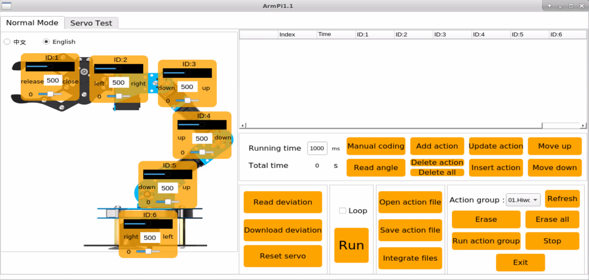

In “Normal Mode”, the interface looks like this.

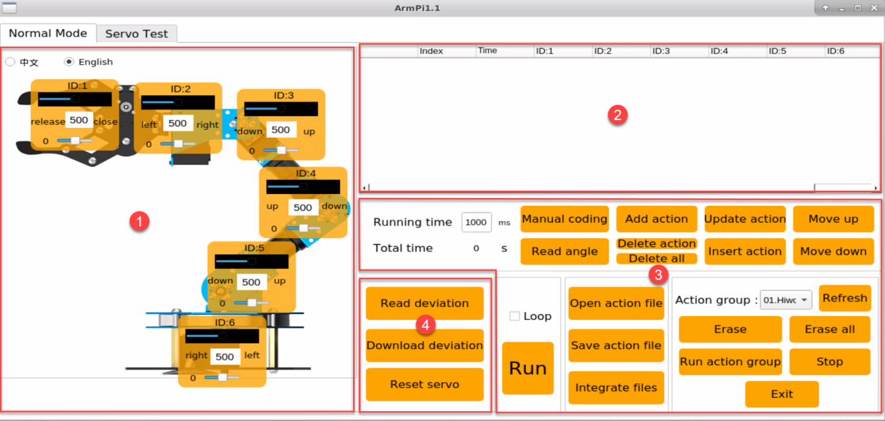

**(1) Servo operation area** 

Drag the corresponding servo to adjust the servo position.

|                                              Icon                                              | Function |
|:------------------------------------------------------------------------------------------------:|:--:|
|   | ID number. Take NO.1 servo as example. |
| 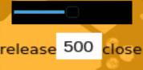  | Adjust the servo position from 0 to 1000. |
|  | Adjust servo deviation from -125 to 125. |

**(2) Detailed data of action**

Action list displays the running time and servo data of the current action.

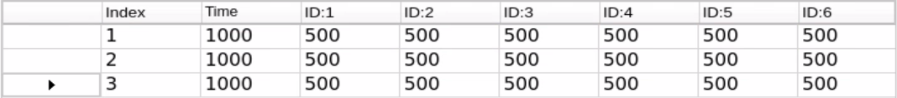

| Icon | Function |
|:--:|:--:|
|  | Action group No. |
| 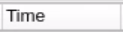 | Running time of the action |
|  | Action data of the corresponding servo. Double click the figureto revise. |

(3) Action group setting

<table class="docutils-nobg" border="1">
<colgroup>
<col  />
<col  />
</colgroup>
<tbody>
<tr>
<td ><strong>Icon</strong></td>
<td ><strong>Function</strong></td>
</tr>
<tr>
<td >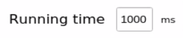</td>
<td >Running time of one action. Click  to modify. </td>
</tr>
<tr>
<td >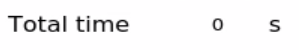</td>
<td >Total running time of action group.</td>
</tr>
<tr>
<td ></td>
<td >When you click this icon, the joints of robot will become loose and you can twist it and design the action. </td>
</tr>
<tr>
<td ></td>
<td >Read the angle of twisted action.</td>
</tr>
<tr>
<td >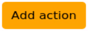</td>
<td >Make the current servo value of servo operation area an action and add it to the last line of the action list.</td>
</tr>
<tr>
<td >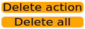</td>
<td ><p>Click “delete action” to delete the selected action in the action list.</p>
<p>Click “Delete all” to delete all the action in the action list. </p></td>
</tr>
<tr>
<td ></td>
<td ><p>Replace the selected value of the action list.</p>
<p>The servo value is replaced by the current servo value of the servo operation area. And the running time is replaced with the time set in “Action Time”. </p></td>
</tr>
<tr>
<td >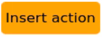</td>
<td ><p>Insert action above the selected action.</p>
<p>The action time corresponds to Action time (ms), and the angle value is the servo value.</p></td>
</tr>
<tr>
<td ></td>
<td >Exchange the selected action with the action on the previous line.</td>
</tr>
<tr>
<td ></td>
<td >Exchange the selected action with the action on the next line.</td>
</tr>
<tr>
<td >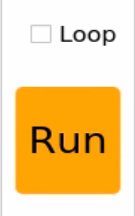</td>
<td ><p>Click to run the action of the action list.</p>
<p>（ If you select “Loop”, the robot will repeat the action.）</p></td>
</tr>
<tr>
<td >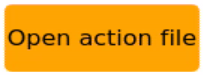</td>
<td ><p>Click and select the action group to be opened to load its data into the action list.</p>
<p>（Path："ArmPi_PC_Software-&gt;ActionGroups"）</p></td>
</tr>
<tr>
<td >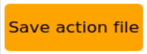</td>
<td ><p>Save the current actions in the action list into the computer.</p>
<p>（ArmPi_PC_Software-&gt;ActionGroups）</p></td>
</tr>
<tr>
<td ></td>
<td >Click to integrate provided action groups. Choose one action group, click Integrate and then choose another one.</td>
</tr>
<tr>
<td >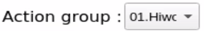</td>
<td >Click to refresh the action groups.</td>
</tr>
<tr>
<td ></td>
<td >Click to refresh the action groups.</td>
</tr>
<tr>
<td ></td>
<td >Delete the current action group file.</td>
</tr>
<tr>
<td ></td>
<td ><strong>（Be careful!）</strong>Delete all the action group files.</td>
</tr>
<tr>
<td ></td>
<td >Run the selected action group once.</td>
</tr>
<tr>
<td ></td>
<td >Stop running the action group.</td>
</tr>
<tr>
<td ></td>
<td >Exit the PC software.</td>
</tr>
</tbody>
</table>

**(4) Servo deviation setting area**

|                                              Icon                                           | Function |
|:-------------------------------------------------------------------------------------------------:|:--:|
|  | Click to read the save the servo deviation. |
|                       | Click to download the deviation adjusted in the PC software. |
|                       | Click to return all the servos the middle position (500). |

## 2. Action Group Programming

### 2.1 Project Outcome

Program an action group consisting of 12 actions to allow the ArmPi FPV to "downward to grip the item and place it in the front".

### 2.2 Complete Program

**2.2.1 Action Programming**

(1) first, we need to drag the slider to let the robotic arm return to original posture.


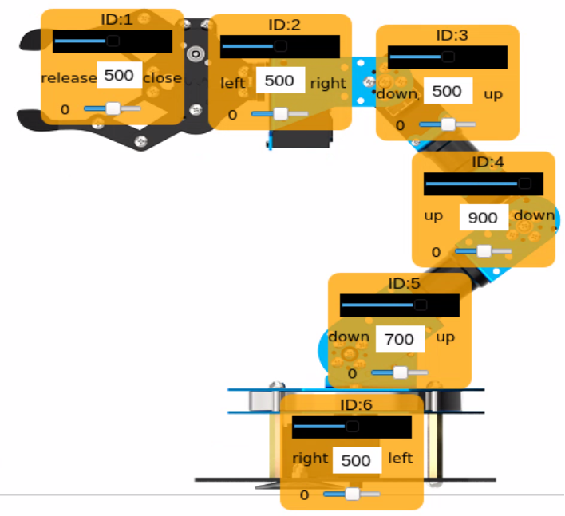

(2) Then click “Add action” to add this action to the action list.

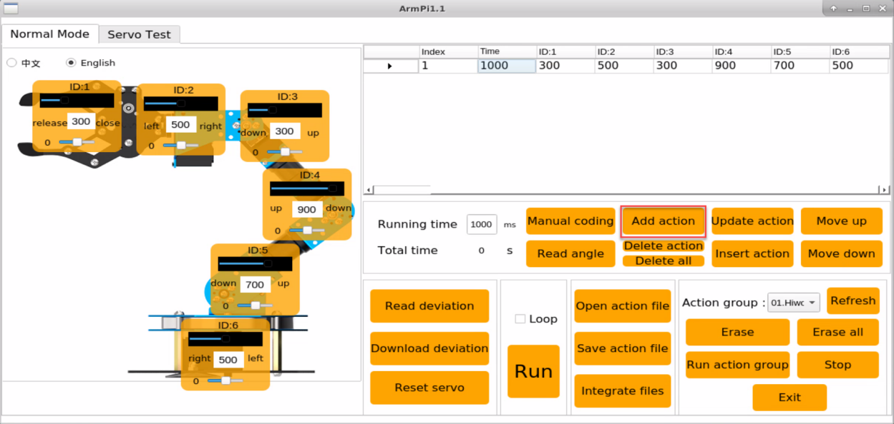

(3) set the running time as 800ms and click “update action”.

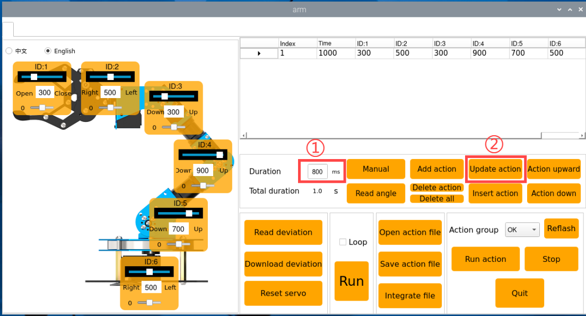

(4) Program to lower the arm. Drag the sliders of the No. 3, 4, 5 servos as the figure below. Then click “Add action” to add the action and the running time should be set as 800ms as well.

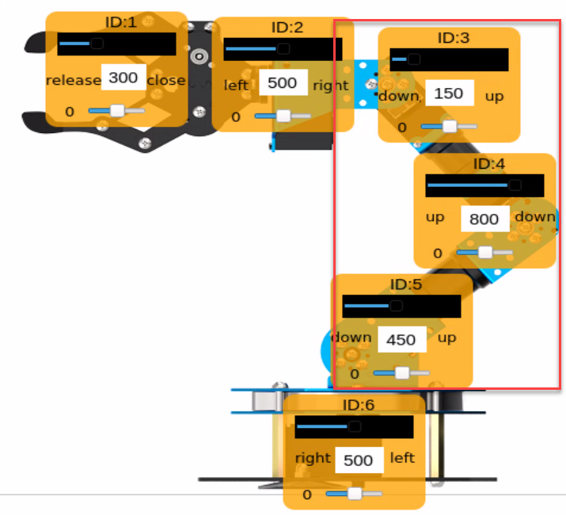

(5) add this action group to make the actions more coordinate and natural. Select the No.2 action and click "Add Action". The running time does not need to be set too long and you can modify it to 200 ms. 

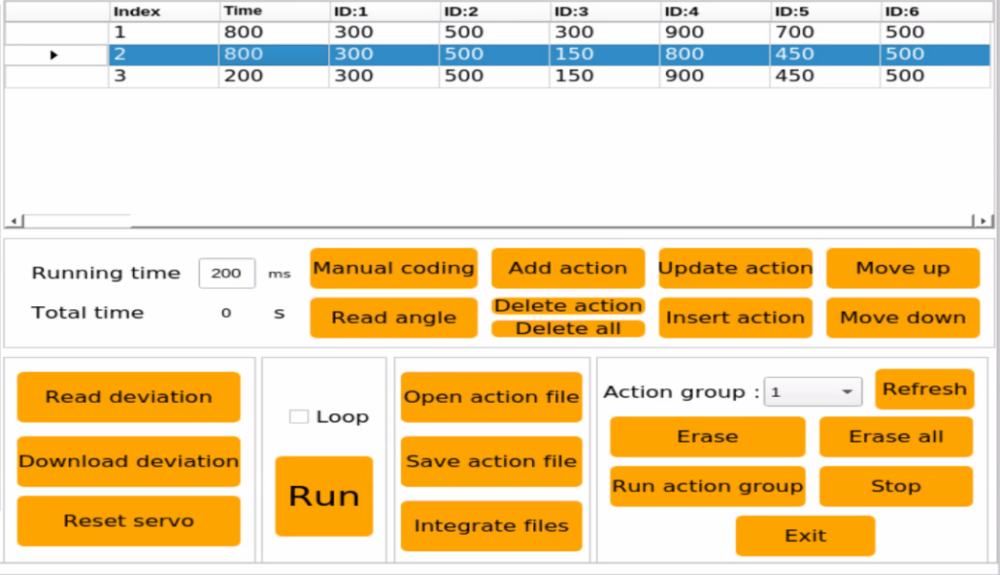

(6) Open the gripper. Drag the ID:1 slider to set the figure below, then click “add action” to add the fourth action. The running time should be set as 400ms.

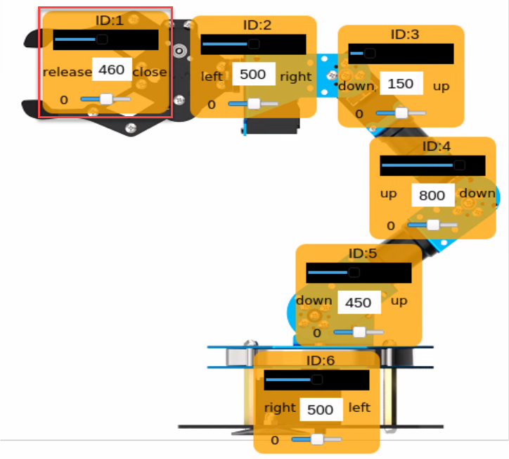

(7) In order to make the gripping action more stable, we make No.5 action transition action. Select the fourth action group, then click “add action” and set the running time as 200ms. 

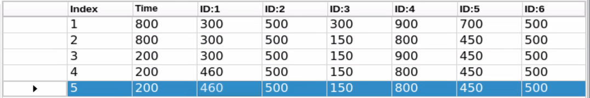

(8) Program the robotic arm to lift the item up after picking. Drag the ID:3, ID:4, ID:5 slider in turn. Then set the running time as 500ms and add the action to the sixth action group.


(9) The 7th action group serves as a transition of the 6th action group, and the running time can be set to 200ms. Then we need to move the items forward. The adjusting figure of the 8th actions are as follow, and the running time is 800ms.


(10) when the robotic arm arrives at the set position, add the ninth action group as the transition group for the eighth action group, and the running time is set as 200ms. Then adjust ID:1 servo and set the running time as 600ms.

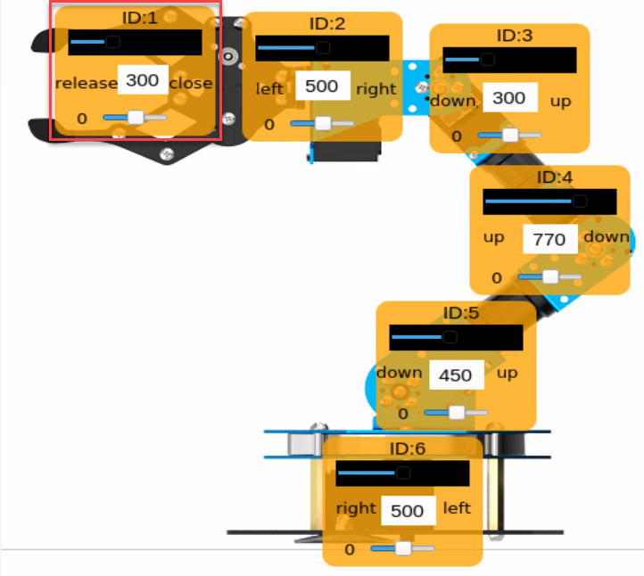

(11) Program the tenth and eleventh action groups to release the gripper to finish the task. And the the twelfth action group aims at making the robotic arm return to the original posture. And you can click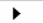on the left side of the first action group. Then set the running time as 800ms and click “Add Action”.  

The intact action list is as follow.

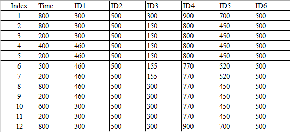

**2.2.2 Save Action Group**

After programming, please save the action groups for future debugging. Click “Save action file”, choose the path as **“/home/ubuntu/software/armpi_fpv_control/ActionGroups”**, name it (such as “grab-forward”) and then click “Save” button.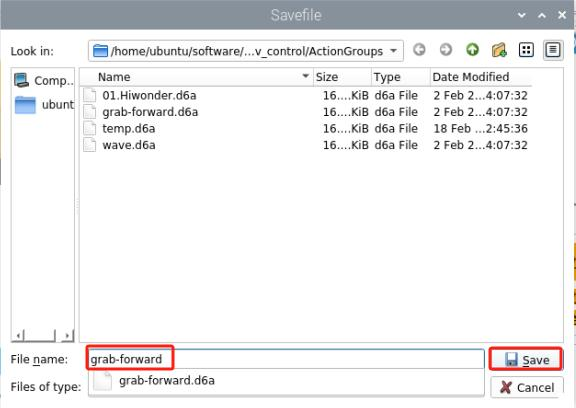

## 3. Execute Action

### 3.1 Program Description

Call and execute the action group programmed in the “[ArmPi Action Programming->2.Action Group Programming]()” through the terminal command line.
(Action group file must be saved in the path of **/home/ubuntu/software/armpi_fpv_control/ActionGroups**

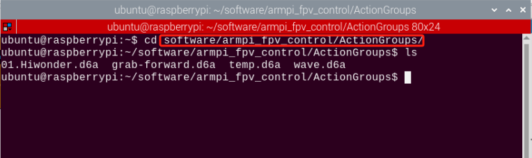

### 3.2 Complete Project 

**3.2.1 Action Executes**

(1) Turn on the device, and connect it to the VNC tool.


(2) Click the upper left iconon the desktop to open the Terminator terminal.


(3) Input command to switch to the PC content.

```commandline
cd software/armpi_fpv_control/
```

(4) Input command to check all the files on this content.

```commandline
ls
```

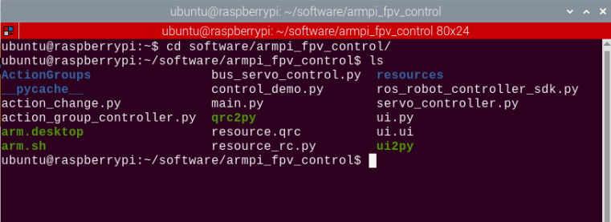

**3.2.2 Single Action Execution**

If you want to run the single action, you’re required to modify in the file of actions programming.

(1) Enter and press “Enter” to open the program through vim editor.

```commandline
sudo vim control_demo.py
```

(2) Press “i” key to delete “import Board” in the program.

(3) Next, you can see the default "pick" action in the program. We need to change "pick" to the name of the action group to be executed. Here, taking the "grab-forward" action group edited in the previous section as an example, replace "pick" with "grab-forward" inside the parentheses.

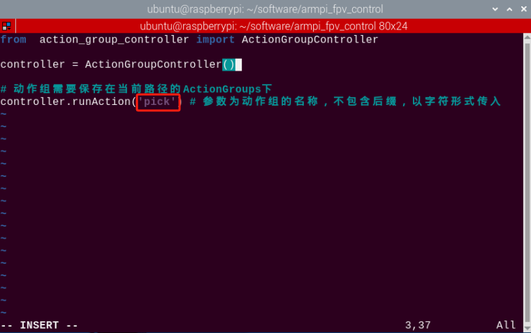

:::{Note}
Action names must match the actual stored names, or else the call will fail!
:::

(4) Press “Ese” and “wq” and press “Enter” to save and exit. 

```commandline
:wq
```

(5) Enter the command again and press “Enter”. ArmPi will run “grab-forward” action once.

```commandline
python3 control_demo.py
```

:::{Note}
if there is no action group file under the path, the LX terminal will display "Action Group File Cannot Be Found."
:::

**6.2.3 Execute More Actions**

Refer to the “[2.Action Group Programming]()” to study how to program and save action. We will take the example of the third action programmed and saved. 


(1) Please enter command to the program file according to the above steps.

```commandline
sudo vim control_demo.py
```

(2) Copy the “AGC.runAction(‘’)” function. The name of the parameters in the function must be the same as the saved action file, otherwise it cannot be executed.

(3) For example, after executing the No.1 and No.2 actions, call to run the No.3 action. Select the function in line 26 with the mouse, press the "Y key" twice, and then press "P" to copy the above function.

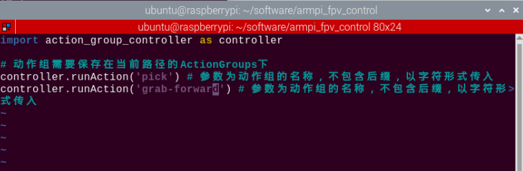

(4) Revise the parameter in the function to “grab-forward”, save and exit. Then enter the command again.

```commandline
python3 control_demo.py
```

## 4. Integrate Action Groups

### 4.1 Project Outcome

Integrate the provided basic actions to become a new action group.

### 4.2 Have a Try

Step 1: Open ArmPi FPV PC software and click “Integrate Files”


Step 2: Select 23_ok action group in the pop-up interface, then click “Open”.

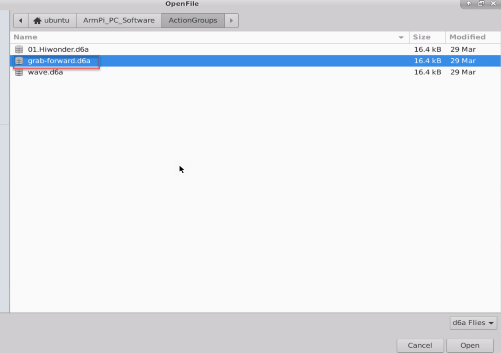

Step 3: Then the action list displays all the action of this 23_ok action group.

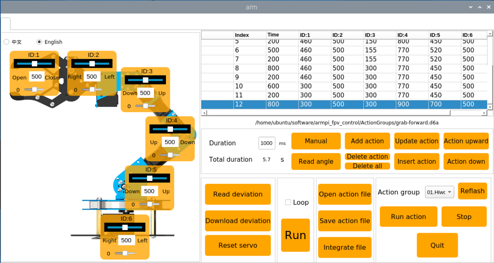

Step 4: Click “Integrate file” again, choose “20_no” action group and click “Open”.

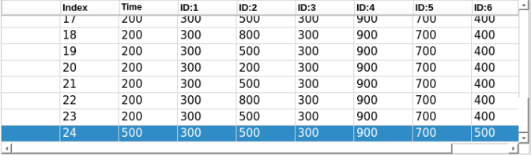

Step5: Move the cursor to NO.1 action, and click “Run” to execute the newly linked action group online. 

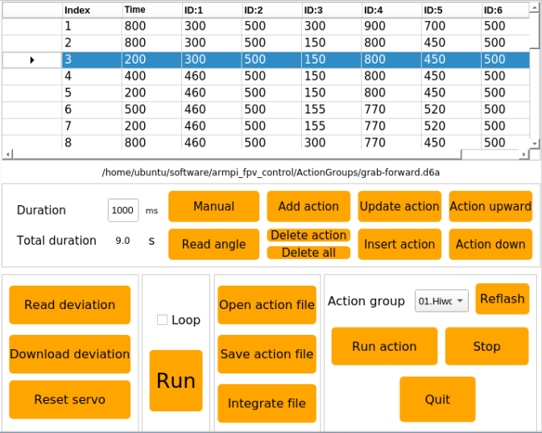

Step 6: Click “Save action file” to save the newly action group for subsequent debugging. 

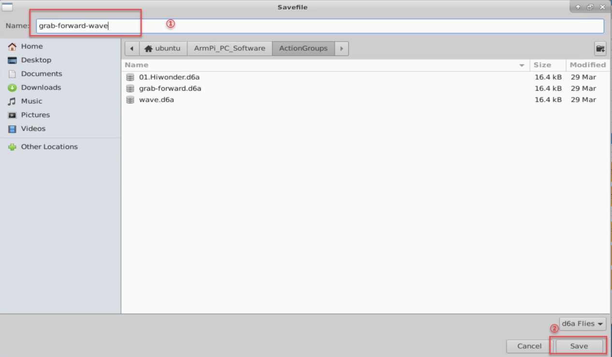

