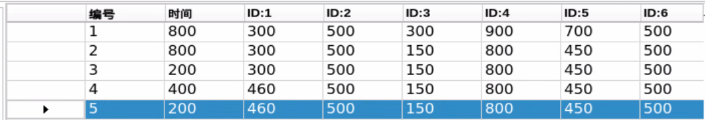

# 动作编辑教学

## 1. 上位机的介绍

### 1.1 启动上位机

点击桌面上的PC_Software图标即可启动上位机。


### 1.2 上位机界面分布

上位机界面如下图所示：


上位机在主界面"**普通模式**"下分为以下区域：


1.  **舵机操控区域**

舵机操控区域显示了被选中的舵机图标，通过调整对应滑杆值即可调整舵机位置。

|                                              **图标**                                              | **功能说明** |
|:------------------------------------------------------------------------------------------------:|:--:|
|   | 代表舵机的ID号，这里以1为例。 |
|   | 用于调整舵机位置，最小值为0，最大值为1000。 |
|  | 用于调整舵机偏差，最小值为-125，最大值为125。 |

2.  **动作详情列表**

动作详情列表显示了当前动作组每个动作的执行时间，以及每个动作里各个舵机值。


| **图标** | **功能说明** |
|:--:|:--:|
|  | 动作组编号。 |
|  | 动作运行的时间，即执行该动作需所用的时间。 |
|  | 该ID下对应的动作数值，双击下方数值可直接修改。 |

3.  **动作组设置区域**

<table class="docutils-nobg" border="1">
<colgroup>
<col  />
<col  />
</colgroup>
<tbody>
<tr>
<td ><strong>图标</strong></td>
<td ><strong>功能说明</strong></td>
</tr>
<tr>
<td ></td>
<td >运行单个动作所需的时间，点击可进行修改。</td>
</tr>
<tr>
<td ></td>
<td >动作组运行所需的总时长。</td>
</tr>
<tr>
<td ></td>
<td >点击后机器人的关节会变得松弛，此时可以用手掰动机器人，设计动作。</td>
</tr>
<tr>
<td ></td>
<td >将掰成形状的角度信息读取出来。（需要搭配"马达掉电"按钮使用）</td>
</tr>
<tr>
<td ></td>
<td >将当前舵机操控区域的舵机数值作为一个动作，添加至动作详情列表的最后一行。</td>
</tr>
<tr>
<td ></td>
<td ><p>删除动作：将会删除动作详情列表里选中的动作。</p>
<p>删除全部：将会删除动作详情列表里所有动作。</p></td>
</tr>
<tr>
<td ></td>
<td ><p>将动作详情列表中选中的数值进行替换。</p>
<p>（舵机数值替换为舵机操控区域的当前舵机值，动作运行时间替换为"动作时间"内设定的时间）</p></td>
</tr>
<tr>
<td ></td>
<td ><p>在选中的动作上面插入一行动作。</p>
<p>（其中动作的时间为"动作时间(ms)"的时间，角度数值为舵机操控区域的舵机值）</p></td>
</tr>
<tr>
<td ></td>
<td >将选中的动作与其上一行进行位置交换。</td>
</tr>
<tr>
<td ></td>
<td >将选中的动作与其下一行进行位置交换。</td>
</tr>
<tr>
<td ></td>
<td ><p>单击该按钮后将会运行一次动作详情列表的动作。</p>
<p>（如果勾选了"循环"，机器人则重复运行动作）</p></td>
</tr>
<tr>
<td ></td>
<td ><p>单击后选择要打开的动作组即可将动作组数据加载到动作详情列表中。</p>
<p>（动作组文件路径："ArmPi_PC_Software-&gt;ActionGroups"）</p></td>
</tr>
<tr>
<td ></td>
<td ><p>将此时动作详情列表里的动作保存到指定位置。</p>
<p>（ArmPi_PC_Software-&gt;ActionGroups）</p></td>
</tr>
<tr>
<td ></td>
<td >打开一个动作组后，点击串联动作文件按钮，继续打开另一个动作组文件，可将两个动作组文件串联成一个新的动作组。</td>
</tr>
<tr>
<td ></td>
<td >可在上位机中显示已保存的动作组。</td>
</tr>
<tr>
<td ></td>
<td >按下此按钮，动作组选择栏即可刷新。</td>
</tr>
<tr>
<td ></td>
<td >删除当前动作组文件。</td>
</tr>
<tr>
<td ></td>
<td ><strong>（慎点）</strong>删除所有动作组文件。</td>
</tr>
<tr>
<td ></td>
<td >执行动作组（选定序号）一次。</td>
</tr>
<tr>
<td ></td>
<td >停止正在运行的动作组。</td>
</tr>
<tr>
<td ></td>
<td >退出当前上位机操作界面。</td>
</tr>
</tbody>
</table>

4.  **偏差设置区域（此区域功能按键了解即可）**

|                                              **图标**                                               | **功能说明** |
|:-------------------------------------------------------------------------------------------------:|:--:|
|  | 单击后即可自动读取保存的偏差。 |
|                       | 单击后即可将通过上位机调整好的偏差下载到机器人中。 |
|                       | 单击后即可将舵机操控区域的所有舵机恢复至500位置。 |

## 2. 动作编辑教学

### 2.1 实现目标

创建一个实现"**向下夹取并放置在前方**"的动作组，由12个动作组成。

### 2.2 动作实现

**动作设计**

1)  首先我们设置一下机械臂的初始位置，按照下图所示拖动舵机滑杆按钮（将滑杆拖动到大致位置时，可使用鼠标快速点击滑杆或根据键盘的"←"、"→"键进行微调）。


2)  然后点击界面右侧的"**添加动作**"按钮，将动作添加至动作详情列表里（此动作舵机参数值仅为参考，可根据实际需求自行微调）。


3)  动作时间我们设置为800ms，将鼠标光标移动到动作时间框填入800，然后点击"更新动作"即可同步时间。


4)  接下来我们让机械臂向下。在左侧的舵机操控区域，我们将ID为3号、4号、5号舵机的滑杆按照下图的数值进行滑动。然后单击"**添加动作**"，将这个动作添加至右侧动作列表中，动作时间同样设置为800ms。


5)  我们添加一组过渡动作，让动作协调更加自然一些。选择编号为2的动作，点击"**添加动作**"即可。动作时间无需设置过长，我们示例修改为200ms。


6)  我们让爪子进行张开。将1号舵机滑杆按照下图进行滑动，然后单击"**添加动作**"将该动作添加到第4组动作，动作时间设置为400ms。


7)  同理，为了让夹取的动作更加平稳，我们将第5号动作作为过渡。选中第4组动作后，点击"**添加动作**"，动作时间设置为200ms。



8)  夹取物品后机械臂应向上抬起，我们根据机械臂的结构，依次调整3、4、5号舵机滑杆按钮，将动作时间设定为500ms后添加为第6组动作。


9)  第7组动作作为第6组动作的过渡，动作时间设置为200ms即可。随后我们需要将夹取抬起的物品向前移动，那么第8组动作参考下图所示进行调整，动作时间为800ms。


10) class="common_img" style="width:70%" 在到达设定位置后，9组为8组的过渡动作，动作时间设置为200ms。随后我们即可让爪子进行张开，只需调整1号舵机，然后动作时间设置为600ms。


11) 放置完成第11组动作为爪子张开的过渡，到此机械臂的夹取放置任务完成。最后第12组动作机械臂需要返回初始的姿态，可以通过光标点击1号动作左侧的按钮，将动作时间修改800ms后，单击"添加动作"即可完成复制。

完整的动作列表如下图所示：


**动作保存**

为了便于后期的调试和管理，可将动作保存起来。单击"保存动作文件"按钮，在打开的界面中路径选择为"**/home/ubuntu/software/armpi_fpv_control/ActionGroups**"，这里以"**grab-forward**"为例进行命名，单击"**Save**"即可。

## 3. 动作执行教学

本节适用于采用命令行形式启动上位机。

### 3.1 实现目标

将"**[动作编辑教学\2. 动作编辑教学](https://docs.hiwonder.com/projects/ArmPi_FPV/en/latest/docs/11.action_programming.html#id5)**"所编辑的动作，通过终端命令行的形式进行调用执行。（动作文件必须保存在"**/home/ubuntu/software/armpi_fpv_control/ActionGroups**"路径下才能被调用）


### 3.2 动手实现

**执行方法**

1)  将设备开机，并参照课程资料的"**[远程工具安装及容器进入方法\1. 远程工具安装与连接]()**"内容，通过VNC远程连接工具连接。


2)  点击系统桌面左上角的图标，打开Terminator终端。


3)  输入指令，切换到上位机目录内。

```commandline
cd software/armpi_fpv_control/
```


4)  输入指令来查看该目录下的所有文件。

```commandline
ls
```


**单个动作执行方法**

如需执行单个动作，需要前往调用动作的程序文件中进行修改。

1)  输入指令，按回车，通过vim编辑器打开该程序。

```commandline
sudo vim control_demo.py
```


2)  然后按下键盘上的"**i**"键进入程序编辑模式。

3)  接下来，可以看到程序中默认"**pick**"动作。我们需要"**pick**"改为执行的动作组名。这里以上一节编辑好的"**grab-forward**"动作组为例进行，将"**grab-forward**"替换括号内的"**pick**"。


:::{Note}
动作名称要与实际存储的名称一致，否则将调用失败！
:::

4)  按下**Esc**键，然后再输入指令按下回车，将修改保存并退出。

```commandline
:wq
```


5)  输入指令，按下回车，此时机械臂将执行"**grab-forward**"动作1次。

```commandline
python3 control_demo.py
```


:::{Note}
当路径下不存在动作组文件时，LX终端会显示"未能找到动作组文件"的提示。因此请确保被调用的动作组保存在正确路径下。
:::

**调用更多执行动作**

动作编辑及保存教学可参考上一课"**第2课 动作编辑教学**"内容。这里以已编辑存储好的四个动作为例进行说明，如下图：


1)  先按照前面的操作输入指令进入程序文件。

```commandline
sudo vim control_demo.py
```

2)  然后将controller.runAction(''')函数进行复制，函数内参数要与保存的动作文件名称相同，否则无法执行。

3)  比如在执行完上面动作文件后，需要执行一下3号动作文件。鼠标选中该行的函数，按"**Y**"两下，然后按下"**P**"即可将上面的函数复制下来。


4)  将函数内的参数修改为"**grab-forward**"，保存退出，再次输入指令即可。

```commandline
python3 control_demo.py
```

## 4. 串联动作文件

### 4.1 实现目标

串联动作文件是将两个动作组文件首尾串联起来，组成一个新的动作组文件，这样可实现动作组文件之间的合并。

### 4.2 动手实现

**步骤1：** 远程连接系统后，启动ArmPi FPV上位机。


**步骤2：** 点击动作组设置区的"**串联动作文件**"按钮，在打开的弹窗界面中选择"**grab-forward.d6a**"，双击打开。


**步骤3：** 此时，我们看到动作组详情列表中显示了该动作组参数。


**步骤4：** 再次点击"**串联动作文件**"，选择"**wave.d6a**"，双击打开，即可看到第二个动作组文件串联进来了。


**步骤5：** 将光标移动至编号1，然**后**点击"**运行**"，将串联的新的动作组在线运行一遍。


**步骤6：** 点击"**保存动作文件**"按钮，可将新串联的动作组进行保存，以便后期调试。


