# 9. ROS+OpenCV Course

## 1. Color Threshold Adjustment

Different light source will have diverse influence on the object color, which will lead to recognition difference between the related color function. If this difference affects the function realization, it needs to be eliminated and LAB_Tool is used to cope with this problem. Check the below steps to use LAB_Tool. 

### 1.1 Turn on LAB_Tool

(1) Open NoMachine, and double click "LAB_Tool" in the homepage.


(2) At this time, windows of "Execute File" will pop up, and just click "Execute".

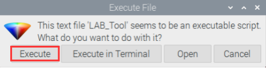

(3) LAB_Tool interface is as follow.

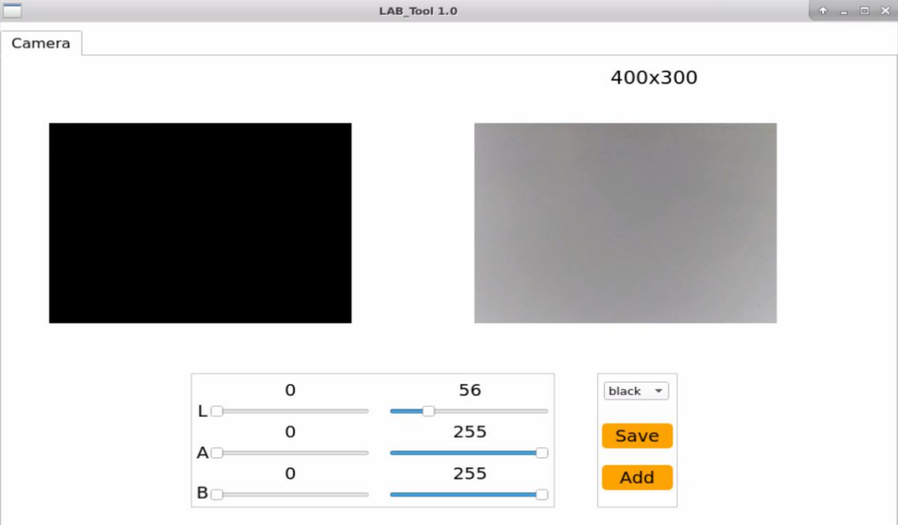

:::{Note}
if there is no transmitted image in the pop-up interface, camera is not connected successfully, and please check whether the camera cable is connected properly.
:::

### 1.2 LAB_Tool interface layout and description

Its interface is divided into two parts, including image display area and recognition adjustment area. 

| Area | Area layout |
|:--:|:--:|
| Image display area |  |
| Recognition adjustment area |  |

**1.2.1 Image display area**

| Icon | Function |
|:--:|:--:|
|  | At the left side, it is the original image. At the right side, it is the processed image. |

**1.2.2 Recognition adjustment area**

Color attributes can be adjusted in this area. The corresponding functions are as follow. 

| Icon | Function |
|:--:|:--:|
| 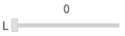 | This slider is used to adjust L value, which is similar to A and B slider. |
|  | Select the recognition color to be adjusted. |
|  | It is used to save the adjusted value. |
|  | It is used to add new color for recognition |

### 1.3 Adjust the effect of default color

Take adjusting red for example. The specific adjustment steps are as follow.

(1) Open LAB_Tool software on system desktop. After the camera is connected, select "red" in the drop-down menu.

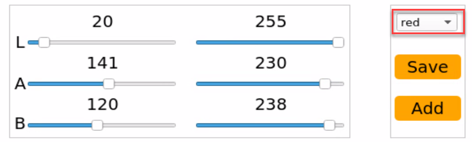

(2) Please face the camera to the object whose color needs to be adjusted. Drag the slider of L, A and B to adjust the threshold until the block image at left turns white, and other area becomes black.

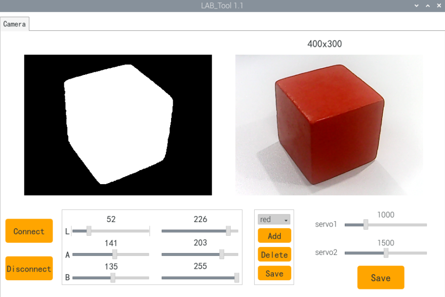

The adjusted parameter of LAB threshold is as follow. 

| Color component | Color component value | Corresponding color zone |
| :-------------: | :-------------------: | :----------------------: |
|        L        |         0~255         |  black-white（-L ~ +L）  |
|        A        |         0~255         |   green-red（-a ~ +a）   |
|        B        |         0~255         |  blue-yellow（-b ~ +b）  |

When adjusting the color threshold, please adjust the value of L, A and B to make them approach the corresponding color zone. Take adjust the object color to red for example. 

① Adjust the parameters at left of L, A and B to 0, and parameters at right to 255. 
② Color red is around "+a", hence A parameter at right remains the same, and increase parameter at left till the object image at left turns white and other area turns black. 
③ Then modify L and B value according to the surroundings. If the color belongs to light red, increase L parameter at left. If it belongs to dark red, decrease L parameter at right. If it belongs to warm tone, increase B parameter at left. If it belongs to cool tone, decrease B parameter at right.

(3) Lastly, click **"Save"** button to save the adjusted parameters.

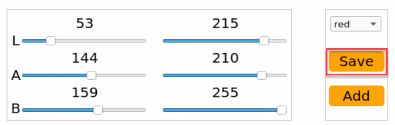

### 1.4 Add new recognition color

There are three built-in recognition colors. Besides them, you can add new recognition colors. Here are two ways to operate.
① Directly adjust LAB value of default color option in drop-down menu to the LAB value of actual color.
② Add new color option by clicking "Add".
Compare with method ②, method ① can achieve the goal more quickly. 
Take adding color orange for example.

(1) Open LAB_Tool software on the system desktop. After the camera is connected successfully, please select "red" in drop-down menu.


(2) Face the camera to the orange object to recognize, and drag the slider of L, A and B to adjust the threshold till the image of orange object turns white, and other area turns black.

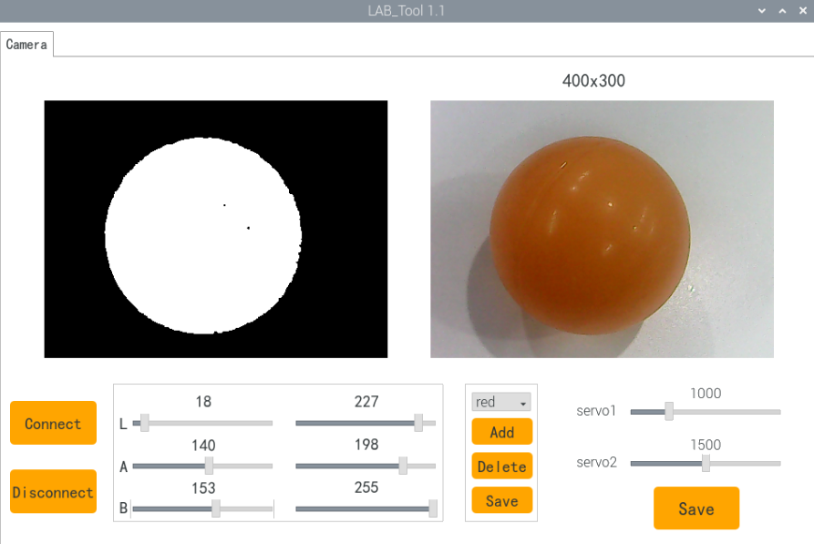

(3) Click "Save" button to save adjusted L, A and B value.

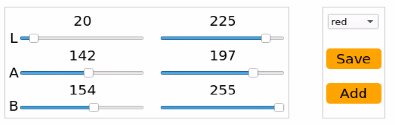

## 2. Color Recognition

### 2.1 Program Description

Let's have a look of implementation process of color recognition. 

**Firstly, fetch the camera image**
Process the real-time image of the camera through OpenCV. 

**Secondly, perform image binaryzation**
OpenCV represents all pixels in the image as 0 and 1, and displays pixels with a value of 0 in black, and pixels with a value of 1 in white.

**Thirdly, corrode and dilate**
Corrosion aims at removing burr at the edge of image. Dilation will dilate the image edge to fill the non-target pixel at the edge of and inside target object.  

**Fourthly, locate the contour**
By dividing black and white area to locate the contour of the target object.

**Fifthly, frame the recognized colored object.**
Convert the recognized object in red, green or blue into coordinate without zooming to determine whether it is the largest colored object. 

### 2.2 Start and Close the Game

:::{Note}
The entered command should be case sensitive, and key words can be complemented by "Tab" key.
:::

(1) Power on the robot and use VNC Viewer to connect to the remote desktop.


(2) Click the icon  on the upper-left of the desktop, and open Terminator terminal to input command. Then press Enter to close app self-starter service.

```shell
sudo ./.stop_ros.sh
```

(3) Enter command to run game program, and press Enter. 

```shell
cd course/vision_course/
```

(4) Enter command to run game program, and press Enter.

```shell
python3 color_recognition.py
```

(5) If want to close this program, press "Ctrl+C". If it fails, please try again.

(6) After experiencing the program, you can activate the mobile app service by using commands or restarting the robot. If the app service is not activated, the app-related functions will be disabled. If the robot restarts, the app service will be automatically enabled.

(7) Click terminal icon  on the upper-left of the desktop. Note: it is needed to input command in system path, rather than input app service command in the docker container. Input "sudo systemctl restart start_node.service" in the system path and press Enter to start APP service. Wait for a moment until the robotic arm return to the initial posture and the buzzer emits "Di" for one time.

```shell
sudo systemctl restart start_node.service
```

### 2.3  Program Outcome

:::{Note}
please operate in a solid color background, and do not move the block too fast.
:::

Having ran the program, robotic arm will recognize the color of the object within its vision. When object in red, green or blue is recognized, this object will be framed in transmitted image. 

### 2.4 Program Analysis

The source code of this program lies in **[/home/ubuntu/course/vision_course/color_recognition.py]()**

**inRange(), findContours() and morphologyEx()** function in cv2 library and setPixelColor() function in Board library are mainly used in color recognition. 

**inRange()** function is used to binarize the input image. The first parameter in bracket is entered parameter. The second and the third parameter separately is the lower limit and upper limit of the threshold. When the RGB color value of pixel is between upper and lower limit, this pixel will be assigned 1, otherwise 0.

**findContours()** function is used to search for the target contour in the image. The first parameter in the bracket is the entered image. The second parameter is retrieving mode. The third parameter is approximate method. 

**morphologyEx()** function is used for morphologic transformations. The first parameter of this function is entered image data. The second parameter is the way to transform. The third parameter is the size of the frame.  

**setPixelColor()** function is used to control RGB light on expansion board. Take "Board.RGB.setPixelColor(0, Board.PixelColor(255, 0, 0))" for example. The meanings of parameters in bracket are as follow.

The first parameter "0" is serial number of RGB light. "0" represents RGB1, and "1" represents RGB2.
The second parameter **"Board.PixelColor(255, 0, 0)"** is parameter of RGB color channel. **"255"**, **"0"** and **"0"** represents value of R, G and B respectively. The value here refers to red.

## 3. Colored Locating

### 3.1 Program logic 

Firstly, recognize the object color with Lab color space. Convert RGB color space into Lab first, carry out image binarization, and then perform operations such as open operation and closed operation to obtain an outline containing only the target color so as to achieve color recognition. 

Next, traverse all found contours of target color and make comparison between them to find the contour of largest area. Then obtain coordinate of four angular points and calculate the coordinate of center point. 

Lastly, frame the target contour, display center coordinate of the contour, and control LED on expansion board to light up the target color.

### 3.2 Start and Close the Game

:::{Note}
The entered command should be case sensitive, and key words can be complemented by "Tab" key.
:::

(1) Power on the robot and use VNC Viewer to connect to the remote desktop.


(2) Click the icon  on the upper-left of the desktop, and open Terminator terminal to input command: "sudo ./.stop_ros.sh". Then press Enter to close app self-starter service.

```shell
sudo ./.stop_ros.sh
```

(3) Enter command to run game program, and press Enter.

```shell
cd course/vision_course/
```

(4) Enter command to run game program, and press Enter.

```shell
python3 get_color_position.py
```

(5) If want to close this program, press "Ctrl+C". If it fails, please try again.

(6) After experiencing the program, you can activate the mobile app service by using commands or restarting the robot. If the app service is not activated, the app-related functions will be disabled. If the robot restarts, the app service will be automatically enabled.

(7) Click terminal icon  on the upper-left of the desktop. Note: it is needed to input command in system path, rather than input app service command in the docker container. Input "sudo systemctl restart start_node.service" in the system path and press Enter to start APP service. Wait for a moment until the robotic arm return to the initial posture and the buzzer emits "Di" for one time.

```shell
sudo systemctl restart start_node.service
```

### 3.3 Program Outcome

After the program runs, the robotic arm moves to make the camera face straight ahead.When red block is recognized, it will be framed, and the corresponding coordinate will be displayed on the bottom-left corner.

### 3.4 Program Analysis

The source code of this program lies in the Docker container:**[/home/ubuntu/course/vision_course/get_color_position.py]()**

After obtaining the largest contour, obtain the smallest circumscribed rectangle through calling minAreaRect() function in cv2 library. Point set and vector of point coordinate are stored in the bracket. 

Through calling boxPoints() function, obtain four vertex coordinate of the target rectangle. Take "box = np.int0(cv2.boxPoints(rect))" for example. Four vertex coordinates of smallest circumscribed rectangle of target contour will be obtained here. Based on four vertex coordinates, calculate the center coordinate of this rectangle.

## 4. Color Tracking

### 4.1 Program Analysis

Firstly, recognize the object color with Lab color space. Convert RGB color space into Lab first, carry out image binarization, and then perform operations such as open operation and closed operation to obtain an outline containing only the target color so as to achieve color recognition. 

Next, traverse all found contours of target color. Find the largest contour
and the largest contour area through comparing, and then use OpenCV built-in
function to obtain the real-time circle center coordinate of the smallest circumscribed circle of the target contour.

Lastly, update PID value based on circle center coordinate. Then obtain 
rotation angle of each servo through inverse kinematics to control robotic arm to track the block. 

### 4.2 Start and Close the Game

:::{Note}
The entered command should be case sensitive, and key words can be complemented by "Tab" key.
:::

(1) Power on the robot and use VNC Viewer to connect to the remote desktop.

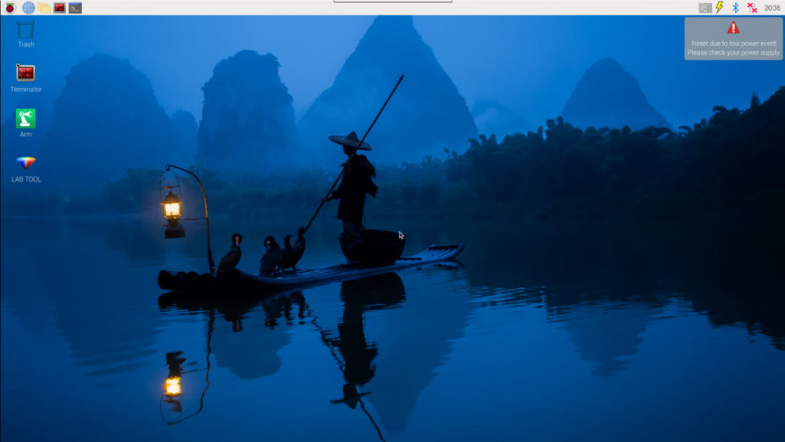

(2) Click the icon  on the upper-left of the desktop, and open Terminator terminal to input command. Then press Enter to close app self-starter service.

```shell
sudo ./.stop_ros.sh
```

(3) Enter command to run game program, and press Enter.

```shell
cd course/vision_course/
```

(4) Enter command to run game program, and press Enter.

```shell
python3 track_by_color.py
```

(5) If want to close this program, press "Ctrl+C". If it fails, please try again.

(6) After experiencing the program, you can activate the mobile app service by using commands or restarting the robot. If the app service is not activated, the app-related functions will be disabled. If the robot restarts, the app service will be automatically enabled.

(7) Click terminal icon  on the upper-left of the desktop. Note: it is needed to input command in system path, rather than input app service command in the docker container. Input "sudo systemctl restart start_node.service" in the system path and press Enter to start APP service. Wait for a moment until the robotic arm return to the initial posture and the buzzer emits "Di" for one time.

```shell
sudo systemctl restart start_node.service
```

### 4.3 Program Outcome

After the program runs, the robotic arm will start tracking the color block. As the program tracks red object by default, please face the red block to the camera and move slightly. When recognizing the block, robotic arm will move with the block, and the block will be framed in transmitted image.

:::{Note}
please move the block within the camera vision, and do not move the block too fast, otherwise the game effect will be influenced.
:::

### 4.4 Program Analysis

The source code of this program lies in the Docker container:

```commandline
python3 /home/ubuntu/course/vision_course/track_by_color.py
```

After obtaining the block's location, robotic arm can track the colored block 
through calling **setPitchRange()** function in ArmMoveIK library and **setBusServoPulse()** function in board library. 

The function of **setPitchRange()** is that obtain the corresponding servo 
angle and pitch angle with the given coordinate and pitch angle range. When 
there is no solution, function will return **"False"**. 

Take **"target = AK.setPitchRange((0, round(y_dis, 2), round(z_dis, 2)), -90, 0)"** for example. The first function **"(0, round(y_dis, 2), round(z_dis, 2))"** is the given coordinate in centimeter, and it is passed in as tuple. The second parameter **"-90"** and the third parameter "0" is pitch angle range.   

**setBusServoPulse()** is used to drive the serial servo to rotate to the specific position.Take "Board.setBusServoPulse(3, servo_data['servo3'], 1000)" for example. The meaning of parameter in bracket is as follow.

The first parameter **"3"** is the servo ID referring to NO.3 servo. 

The second parameter **"servo_data['servo3']"** is rotation position. 

The third parameter **"1000"** is rotation time in millisecond.

## 5. Intelligent Transport

### 5.1 Program Description

**Step 1: call the camera image**

Use OpenCV to process the real-time camera image.

**Step 2: image binarization**
In OpenCV, all pixels in an image are represented with 0 and 1. Any pixel in the image with a value of 0 will be displayed as black, while pixels with a value of 1 will be displayed as white. 

**Step 3: erosion and dilation** 
The purpose of erosion is to smooth the edge of image, while dilation processing expands the edges to fill non-target pixels on the edges of image or inside the target object.

**Step 4: find out the contour**
By separating the black and white areas to find out the outline of the target, you can obtain the contour that contain the target color, which enables color recognition.

**Step 5: place the red block**
After red block is identified, buzzer will sound once. Then hold the block in front of claw, and robotic arm will grip and transport it to the set position.

### 5.2 Start and Close the Game

:::{Note}
The entered command should be case sensitive. And the keywords can be complemented by Tab key.
:::

(1) Power on the robot and use VNC Viewer to connect to the remote desktop.


(2) Click the icon  on the upper-left of the desktop, and open Terminator terminal.


(3) Enter command to run game program, and press Enter.

```shell
sudo ./.stop_ros.sh
```

(4) Enter command to run game program, and press Enter.

```shell
cd /home/ubuntu/course/vision_course/
```

(5) Enter command to run game program, and press Enter.

```shell
python3 grasp_by_vision.py
```

(6) If you want to close program, just press "Ctrl+C".

(7) Click terminal icon  on the upper-left of the desktop. Note: it is needed to input command in system path, rather than input app service command in the docker container. Input "sudo systemctl restart start_node.service" in the system path and press Enter to start APP service. Wait for a moment until the robotic arm return to the initial posture and the buzzer emits "Di" for one time.

```shell
sudo systemctl restart start_node.service
```

### 5.3 Program Outcome

After game starts, robotic arm will identify object within camera's field of view. When the red block is identified, the color of the block will be displayed in terminal and buzzer will sound once. Then put the red block in front of claw, and robotic arm will transport it to a specific position.

### 5.4 Program Analysis

The source code of program is stored in the Docker container:  **[/home/ubuntu/course/vision_course/grasp_by_vision.py]()**

**5.4.1 Import functional libraries**

  |                      **Import Module**                       |                         **Function**                         |
  | :----------------------------------------------------------: | :----------------------------------------------------------: |
  |                          import cv2                          | The OpenCV library is imported for image processing and AIvision-related functions. |
  |                         import copy                          |               Used for copying Python objects.               |
  |                         import math                          | The math module provides access to underlying mathematical operations, including many commonly used mathematical functions and constants. |
  |                         import queue                         | Provide queue data structure, supporting multi-threaded programming. |
  |                         import rospy                         | Import the library for the Python interface of ROS for communicationwith ROS. |
  |                        import signal                         |                Allow to handle Unix signals.                 |
  |                      import  threading                       |    Provide an environment for executing multiple threads.    |
  |                          import np                           | Import the NumPy library: an open-source numerical computing extension library for Python, used for array and matrix operations. |
  |                 from threading import Timer                  | Import the Timer class from thethreading module, used to call a method after a specified amount of time. |
  |              from sensor_msgs.msg import Image               | Import the Image message type from the sensor_msgs package.  |
  |  from std_srvs.srv import Trigger, SetBool,SetBoolResponse   | Import the Trigger and SetBool service types from the ROS standard services, as well as the response type for SetBool. |
  |               from warehouse.msg import Grasp                |           Import data related to grasping actions.           |
  |     from hiwonder_servo_msgs.msg import MultiRawIdPosDur     | Import the MultiRawIdPosDur message type to control multiple servos. |
  |  from ros_robot_controller.msg import RGBState, BuzzerState  | Import the message types of RGB light, and buzzer, controlling the status of RGB lights and buzzer. |
  |    from armpi_fpv_common import pid,misc,common,apriltag     | Import the PID controller, the misc Handling module, common function module, and the module for handling AprilTag. |
  |     from hiwonder_servo_control import bus_servo_control     |              Import the servo control library.               |
  | from armpi_fpv_kinematics_controllers import set_pose_target, go_pose_target |      Import the libraries related to robot kinematics.       |

If you want to call a function from a functional library, you can use "library name + function name (parameter, parameter...)" format, such as:

```commandline
rospy.sleep(0.1)
```

The above command is to call the "sleep" function from the "rospy" library, which is used for delaying execution. In Python, there are some built-in libraries that we can directly import and use, such as 'cv2', 'math', and others.


**5.4.2 Main function analysis**

**(1) Initialization and read camera image**

```commandline
if __name__ == '__main__':
    target_color = 'red'
    cap = cv2.VideoCapture(-1) #读取摄像头
```

The value of variable __target_color is set to red for setting the target color as red and it can be modified for other colors based on specific requirements. 

The cap variable is used to initialize VideoCapture function from the cv2 library, with its parameter set to -1, to capture the camera image. 

**(2) Read and display camera image**

```commandline
while True:
    ret, img = cap.read()
    if ret:
        frame = run(img)           
        cv2.imshow('frame', frame)
        key = cv2.waitKey(1)
        if key == 27:
            break
        else:
            time.sleep(0.01)
```

Using the read function from the cv2 library to read the frame, if the reading is successful, reassign the variable Frame with the new width and height of the frame, and display it in a window named frame. If the reading fails, delay for 0.01 seconds before attempting to read again."

**5.4.5 Sub-function Analysis**

**(1) Convert LAB space** 

Convert the image into LAB space using the cvtColor() function from the cv2 library.

```commandline
frame_lab = cv2.cvtColor(frame_gb, cv2.COLOR_BGR2LAB)  # 将图像转换到LAB空间
```

**(2) Binarization**

Perform binarization on the image using the inRange() function from the cv2 library.

```commandline
frame_mask = cv2.inRange(frame_lab,
                         (lab_data[target_color]['min'][0],
                          lab_data[target_color]['min'][1],
                          lab_data[target_color]['min'][2]),
                         (lab_data[target_color]['max'][0],
                          lab_data[target_color]['max'][1],
                          lab_data[target_color]['max'][2]))  #对原图像和掩模进行位运算
```

The first parameter **"frame_lab"** denotes the input image.

The second parameter **"tuple(self.target_color_range\['min'\])"** denotes the minimal value of the color threshold.

The third parameter **"tuple(self.target_color_range\['max'\])"** denotes the maximum value of the color threshold.

**(3) Opening and Closing Operation** 

Perform opening and closing operation on the image to smooth the contour edges, and facilitate the subsequent search for target contours.

```commandline
opened = cv2.morphologyEx(frame_mask, cv2.MORPH_OPEN, np.ones((3, 3), np.uint8))  # 开运算
closed = cv2.morphologyEx(opened, cv2.MORPH_CLOSE, np.ones((3, 3), np.uint8))  # 闭运算
```

The "morphologyEx()" function is used to performing morphological operations. Take code "cv2.morphologyEx(frame_mask, cv2.MORPH_OPEN, np.ones((3, 3), np.uint8))" for example. The meaning of the parameters in brackets is as follow:
The first parameter "frame_mask" denotes the input image.
The second parameter "cv2.MORPH_OPEN" represents opening operation, which is the process of followed by dilation. Opening operation can be used to eliminate small black spots, separate objects in thin areas, and smooth larger objects conveniently. At the same tine, not significantly altering their areas. 
The third parameter "np.ones((3, 3), np.uint8)" represents kernel, which is used to define the shape and size of morphological operations.

**(4) Obtain the maximum contour**

Find the maximum contour of the identified color in the image by calling the findContours() function from cv2 library.

```commandline
contours = cv2.findContours(closed, cv2.RETR_EXTERNAL, cv2.CHAIN_APPROX_NONE)[-2]  # 找出轮廓
areaMaxContour, area_max = getAreaMaxContour(contours)  # 找出最大轮廓
```

The first parameter "closed" is the input image.

The second parameter "cv2.RETR_EXTERNAL" is the contour retrieval mode. 

The third parameter "cv2.CHAIN_APPROX_NONE" is the contour approximation method

**(5) Contour contrast**

Using function "getAreaMaxContour" to iterate through all contours and calculate the area of each contour, and selects the contour with the maximum area to avoid filtering out interference.

```python
#找出面积最大的轮廓
#参数为要比较的轮廓的列表
def getAreaMaxContour(contours):
        contour_area_temp = 0
        contour_area_max = 0
        area_max_contour = None

        for c in contours : #历遍所有轮廓
            contour_area_temp = math.fabs(cv2.contourArea(c))  #计算轮廓面积
            if contour_area_temp > contour_area_max:
                contour_area_max = contour_area_temp
                if contour_area_temp > 300:  #只有在面积大于300时，最大面积的轮廓才是有效的，以过滤干扰
                    area_max_contour = c
        return area_max_contour, contour_area_max  #返回最大的轮廓
```

**(6) Set the RGB lights on expansion board**

```python
#设置扩展板的RGB灯颜色使其跟要追踪的颜色一致
def set_rgb(color):
    if color == "red":
        board.set_rgb([[1, 255, 0, 0], [2, 255, 0, 0]])
    elif color == "green":
        board.set_rgb([[1, 0, 255, 0], [2, 0, 255, 0]])
    elif color == "blue":
        board.set_rgb([[1, 0, 0, 255], [2, 0, 0, 255]])
    else:
        board.set_rgb([[1, 0, 0, 0], [2, 0, 0, 0]])
```

Import color to the set_rgb function to judge the color value for setting the RGB color. Take code "board.set_rgb([[1, 255, 0, 0], [2, 255, 0, 0]])" as an example. The meaning of parameter in brackets is as follow:
Take "[1, 255,0, 0 ]" as example. The first argument "1" denotes the RGB1. "255,0,0" refers to the red color of RGB light.

**(7) Robotic Arm Motion**

```python
def move():
    global detect_color
    global start_pick_up
    
    while True:
        if start_pick_up and detect_color != 'None':       
            board.set_buzzer(1900, 0.1, 0.9, 1)# 设置蜂鸣器响0.1秒
            time.sleep(2)
            board.bus_servo_set_position(0.5, [[1, 450]])
            time.sleep(1)
            controller.go_pose_target([0, 0.1, 0.1], 90, [-90, 90], 0, 2)
            time.sleep(2)
            controller.go_pose_target([0, 0.12, 0.01], 90, [-90, 90], 0, 1)
            time.sleep(1.5)
            board.bus_servo_set_position(0.5, [[1, 200]])
            time.sleep(0.5)
            controller.go_pose_target([0, 0.1, 0.1], 90, [-90, 90], 0, 1)
            time.sleep(1)
            controller.go_pose_target([0.1, 0, 0.1], 90, [-90, 90], 0, 2)
            time.sleep(2)
            
            detect_color = 'None'
            start_pick_up = False
        else:
            time.sleep(0.01)
```

"If the global variables detect_color and start_pick_up are true, when a color is detected, the function "board.set_buzzer(1900, 0.1, 0.9, 1)" will set the internal parameter to 0.1, the buzzer will sound for 0.1 seconds, and the function "board.bus_servo_set_position" will set servo 1 to rotate to the position of 450 for 500ms. The function "controller.go_pose_target()" is used to control the servo of the robotic arm.

Take the code "controller.go_pose_target(\[0, 0.1, 0.1\], 90, \[-90, 90\], 0, 2)" as example. The meaning of the parameters in brackets is as follow:

The first parameter "\[0, 0.1, 0.1\]" represents the three-dimensional space coordinates (X, Y, Z) of the end effector with the robotic arm as the origin.

The second parameter "90" is the pitch angle at which the robotic arm moves to the end effector coordinate.

The third parameter "\[-90, 90\]" is the range of the pitch angle. When the robotic arm cannot reach the specified pitch angle, it will automatically search for the closest solution to the given pitch angle.

The fourth parameter "2" represents the duration of the servo rotation, measured in milliseconds.

## 6.  AprilTag Recognition

### 6.1 Program Description

AprilTag is a visual positioning marker, similar to QR code or bar code. It is used to detect the tag quickly and calculate the corresponding position, which can meet the requirement of real-time feedback.

Check the implementation process of AprilTag recognition.

**Firstly, obtain and process the image**
Firstly, initialize and turn on the camera to obtain the image. And copy, remap, and display the image. Then convert image information in BGR format into gray-scale image information.

**Secondly, recognize the tag**
Then, obtain four angular coordinates of the AprilTag, and draw contour of Tag.

**Thirdly, obtain tag information**
In order to further determine whether the coding is reliable, the lattice coordinates are clarified in the determined quadrilateral, and it is necessary to match with the known coding library at the same time. After filtering and validation, the ID and rotation angle of the tag can be calculated.

**Fourthly, frame the recognized tag and control the buzzer to sound**
Lastly, convert the recognized coordinate into the coordinate without zooming to determine whether it is the largest tag.

### 6.2 Start and Close the Game

:::{Note}
The entered command should be case sensitive. And key words can be complemented by "Tab" key.
:::

(1) Power on the robot and use VNC Viewer to connect to the remote desktop.


(2) Click the iconon the upper-left of the desktop, and open Terminator terminal to input command. Then press Enter to close app self-starter service.

```shell
sudo ./.stop_ros.sh
```

(3) Enter command to run game program, and press Enter.

```shell
cd course/vision_course/
```

(4) Enter command to run game program, and press Enter.

```shell
python3 apriltag_recognition.py
```

(5) If want to close this program, press "Ctrl+C". If it fails, please try again.

(6) After experiencing the program, you can activate the mobile app service by using commands or restarting the robot. If the app service is not activated, the app-related functions will be disabled. If the robot restarts, the app service will be automatically enabled.

(7) Click terminal icon  on the upper-left of the desktop. Note: it is needed to input command in system path, rather than input app service command in the docker container. Input "sudo systemctl restart start_node.service" in the system path and press Enter to start APP service. Wait for a moment until the robotic arm return to the initial posture and the buzzer emits "Di" for one time.

```shell
sudo systemctl restart start_node.service
```

### 6.3 Program Outcome

After the program runs, the robotic arm will recognize the tag within the vision. When the tag is recognized, it will be framed in transmitted image, and ID information will be displayed at lower left corner. Whenever the tag is recognized, the buzzer will sound. 

### 6.4 Project Analysis

The source code lies in  **[/home/ubuntu/course/vision_course/apriltag_recognition.py]()**

**drawContours()** function and **putText()** function in cv2 library are mainly used in AprilTag recognition 
drawContours() function is used for drawing tag contour. Take **"cv2.drawContours(img, \[np.array(corners, np.int)\], -1, (0, 255, 255), 2)"** for example. The meanings of parameters in bracket are as follow.

The first parameter **"img"** is the image of drawn contour.

The second parameter "**\[np.array(corners, np.int)\]**" is the contour itself. It is list in Python.

The third parameter **"-1"** is the contour drawn in the designated contour list. The value here represents that draw all the contours.

The fourth parameter **"(0, 255, 255)"** is contour color, and the order is B, G and R. The value here refers to yellow.

The fifth parameter **"2"** is contour width, and "-1" represents fill the contour in designated color.

**putText()** function is used to display the text content on the image Take **"cv2.putText(img, "tag_id: " + str(tag_id), (10, img.shape[0] - 30), cv2.FONT_HERSHEY_SIMPLEX, 0.65, [0, 255, 255], 2)"** for example.

The first parameter **"img"** is entered image.

The second parameter "**"tag_id: " + str(tag_id)"** is added text.

The third parameter **"(10, img.shape\[0\] - 30)"** is upper left corner coordinate of added content. 

The fourth parameter **"cv2.FONT_HERSHEY_SIMPLEX"** is the font of added content.

The fifth parameter **"0.65"** is the font size

The sixth parameter **"\[0, 255, 255\]"** is font color, and its order is B, G and R. The color here is yellow. 

The seventh parameter **"2"** is font width.

## 7. Near and Far AprilTag Recognition

### 7.1 Program Description

AprilTag is a visual positioning marker, similar to QR code or bar code. It is used to detect the tag quickly and calculate the corresponding position, which can meet the requirement of real-time feedback. When the camera recognizes the Tag, the closer the Tag is to the camera, the more the pixels of the Tag are detected.

Check the implementation process of AprilTag recognition.

**Firstly, obtain and process the image**
Firstly, initialize and turn on the camera to obtain the image. And copy, remap, and display the image. Then convert image information in BGR format into gray-scale image information.

**Secondly, detect the tag**
Then, obtain four angular coordinates of the AprilTag, and draw contour of Tag.

**Thirdly, obtain tag information**
In order to further determine whether the coding is reliable, the lattice coordinates are clarified in the determined quadrilateral, and it is necessary to match with the known coding library at the same time. After filtering and validation, the ID and rotation angle of the tag can be calculated.

**Fourthly, frame the recognized tag and display tag ID**
Convert the recognized coordinate into the coordinate without zooming to determine whether it is the largest tag. Frame the Tag in Frame, and display Tag ID.

**Fifthly, display pixel, and control the buzzer to sound**
Display the pixel in the terminal. When the pixel is less than 300, the buzzer will sound.

### 7.2 Start and Close the Games

:::{Note}
The entered command should be case sensitive. And key words can be complemented by "Tab" key.
:::

(1) Power on the robot and use VNC Viewer to connect to the remote desktop.


(2) Click the iconon the upper-left of the desktop, and open Terminator terminal to input command. Then press Enter to close app self-starter service.

```shell
sudo ./.stop_ros.sh
```

(3) Enter command to run game program, and press Enter.

```shell
cd course/vision_course/
```

(4) Enter command to run game program, and press Enter.

```shell
python3 get_apriltag_area.py
```

(5) If want to close this program, press "Ctrl+C". If it fails, please try again.

(6) After experiencing the program, you can activate the mobile app service by using commands or restarting the robot. If the app service is not activated, the app-related functions will be disabled. If the robot restarts, the app service will be automatically enabled.

(7) Click terminal iconon the upper-left of the desktop. Note: it is needed to input command in system path, rather than input app service command in the docker container. Input "systemctl restart start_node.service" in the system path and press Enter to start APP service. Wait for a moment until the robotic arm return to the initial posture and the buzzer emits "Di" for one time.

```shell
systemctl restart start_node.service
```

### 7.3 Program Outcome

After the program runs, the robotic arm will recognize the tag within the vision. When the tag is recognized, it will be framed in transmitted image, and the detected tag pixel will be displayed in the terminal. Whenever the label pixel area is greater than 10000, the buzzer will sound.


### 7.4 Project Analysis

The source code of this program lies in the Docker container:  **/home/ubuntu/course/vision_course/get_apriltag_area.py**

**drawContours()** and **putText()** function in cv2 library are mainly used in this game
**drawContours()** function is used to draw tag contour. Take "**cv2.drawContours(img, \[np.array(corners, np.int)\], -1, (0, 255, 255), 2)**" for example. The meanings of the parameters in bracket are as follow.

The first parameter **"img"** is image of drawn contour.

The second parameter **"\[np.array(corners, np.int)\]"** is the contour itself, and list in Python.

The third parameter **"-1"** is the contour drawn in designated contour list. The value here represents draw all the contours.

The fourth parameter **"(0, 255, 255)"** is contour color, and its order is B, G and R. The color here is yellow.

The fifth parameter **"2"** is contour width. **"-1"** represents use designated color to fill the contour.

**putText()** function is used to display the text content on the image. Take **"cv2.putText(img, "tag_id: " + str(tag_id), (10, img.shape[0] - 30), cv2.FONT_HERSHEY_SIMPLEX, 0.65, [0, 255, 255], 2)"** for example.

The first parameter **"img"** is entered image.

The second parameter **""tag_id: " + str(tag_id)"**** is added text.

The third parameter **"(10, img.shape[0] - 30)"** is upper left corner coordinate of added content.

The fourth parameter **"cv2.FONT_HERSHEY_SIMPLEX"** is the font of added content.

The fifth parameter **"0.65"** is the font size

The sixth parameter **"\[0, 255, 255\]"** is font color, and its order is B, G and R. The color here is yellow.

The seventh parameter **"2"** is font width.

## 8. AprilTag Locating

### 8.1 Program Description

AprilTag is a visual positioning marker, similar to QR code or bar code. It is used to detect the tag quickly and calculate the corresponding position, which can meet the requirement of real-time feedback. 
Check the implementation process of AprilTag locating. 

**Firstly, obtain and process the image** 
Firstly, initialize and turn on the camera to obtain the image. And copy, remap, and display the image. Then convert image information in BGR format into gray-scale image information. 

**Secondly, recognize the tag** 
Obtain four angular information of the AprilTag, and draw contour of Tag. 

**Thirdly, obtain tag information** 
In order to further determine whether the coding is reliable, the lattice coordinates are clarified in the determined quadrilateral, and it is necessary to match with the known coding library at the same time. After filtering and validation, the ID and rotation angle of the tag can be calculated. 

**Fourthly, frame the recognized tag** 
Convert the recognized coordinate into the coordinate without zooming to determine whether it is the largest tag. 

**Fifthly, display the coordinate on the terminal** 
Display the recognized tag coordinate on the terminal.

### 8.2 Start and Close the Game

:::{Note}
The entered command should be case sensitive, and key words can be complemented by "Tab" key.
:::

(1) Power on the robot and use VNC Viewer to connect to the remote desktop.


(2) Click the icon  on the upper-left of the desktop, and open Terminator terminal to input command. Then press Enter to close app self-starter service.

```shell
sudo ./.stop_ros.sh
```

(3) Enter command to run game program, and press Enter.

```shell
cd course/vision_course/
```

(4) Enter command to run game program, and press Enter.

```shell
python3 get_apriltag_position.py
```

(5) If want to close this program, press "Ctrl+C". If it fails, please try again.

(6) After experiencing the program, you can activate the mobile app service by using commands or restarting the robot. If the app service is not activated, the app-related functions will be disabled. If the robot restarts, the app service will be automatically enabled.

(7) Click terminal icon  on the upper-left of the desktop. Note: it is needed to input command in system path, rather than input app service command in the docker container. Input "sudo systemctl restart start_node.service" in the system path and press Enter to start APP service. Wait for a moment until the robotic arm return to the initial posture and the buzzer emits "Di" for one time.

```shell
sudo systemctl restart start_node.service
```

### 8.3 Program Outcome

After the program runs, the Tag will be framed in Frame tool and display the center coordinates and rotation angle within the box, with the label ID and label category shown at the bottom left corner.

### 8.4 Program Analysis

The source code of the program lies in the Docker container:**/home/ubuntu/course/vision_course/get_apriltag_position.py**

After AprilTag is recognized, the tag contour can be drawn in transmitted image through calling **drawContours()** function in cv2 library. Take **"cv2.drawContours(img, [np.array(corners, np.int)], -1, (0, 255, 255), 2)"** for example. The meanings of parameter in bracket is as follow. 

The first parameter **"img"** is the image of drawn contour. 

The second parameter **"\[np.array(corners, np.int)\]"** is the contour itself. It is list in Python. 

The third parameter **"-1"** is the contour drawn in the designated contour list. The value here represents that draw all the contours. 

The fourth parameter **"(0, 255, 255)"** is contour color, and the order is B, G and R. The value here refers to yellow. 

The fifth parameter **"2"** is contour width, and "-1" represents fill the contour in designated color.

## 9. AprilTag Tracking

### 9.1 Program Description

Firstly, initialize and turn on the camera to obtain the image. And copy and remap the image. Then convert image information in BGR format into gray-scale image information.

 Next, detect the Tag. Detect the obtained image through calling apriltag library file. 

Following, if there is object in the image, coordinates of four angular points and center point will be obtained. According to these information, frame the AprilTag, and display the real-time center coordinate of AprilTag. 

Lastly, update PID value according to center coordinate. And obtain the rotation angle of each servo through inverse kinematics solving to control the robotic arm to track. At the same time, display the detected tag name and ID on the transmitted image. 

### 9.2 Start and Close the Game

:::{Note}
The entered command should be case sensitive, and key words can be complemented by "Tab" key.
:::

(1) Power on the robot and use VNC Viewer to connect to the remote desktop.


(2) Click the icon  on the upper-left of the desktop, and open Terminator terminal to input command. Then press Enter to close app self-starter service.

```shell
sudo ./.stop_ros.sh
```

(3) Enter command to run game program, and press Enter.

3. 输入进入玩法程序所在目录的指令，按下回车键。

```shell
cd course/vision_course/
```

(4) Enter command to run game program, and press Enter.

```shell
python3 track_by_apriltag.py
```

(5) If want to close this program, press "Ctrl+C". If it fails, please try again.

(6) After experiencing the program, you can activate the mobile app service by using commands or restarting the robot. If the app service is not activated, the app-related functions will be disabled. If the robot restarts, the app service will be automatically enabled.

(7) Click terminal icon  on the upper-left of the desktop. Note: it is needed to input command in system path, rather than input app service command in the docker container. Input "sudo systemctl restart start_node.service" in the system path and press Enter to start APP service. Wait for a moment until the robotic arm return to the initial posture and the buzzer emits "Di" for one time.

```shell
sudo systemctl restart start_node.service
```

### 9.3 Program Outcome

After the program runs, robotic arm will start tracking the Tag. Face the Tag to the camera, and move it slowly, then the robotic arm will move with the Tag. At the same time, the recognized Tag will be framed in transmitted image and the center coordinate and pixel area size of the label will be printed.

:::{Note}
please move the tag within the camera vision, and do not move too fast for better game effect.
:::

### 9.4 Program Analysis

The source code of the program lies in the Docker container:

**[/home/ubuntu/course/vision_course/track_by_apriltag.py]()**

After obtaining the coordinate, robotic arm can track the Tag through calling "setPitchRange()" function in ArmMoveIK library and "setBusServoPulse()" function in board library. 

"setPitchRange()" function is used to obtain the corresponding servo angle and pitch angle when the coordinate and pitch angle range is given. When there is no solution, function will return "False". 

Take "target = AK.setPitchRange((0, round(y_dis, 2), round(z_dis, 2)), -90, 0)" for example. The first function "(0, round(y_dis, 2), round(z_dis, 2))" is the given coordinate in centimeter. It is passed in as tuple. The second parameter "-90" and the third parameter "0" is pitch angle range. 
"setBusServoPulse()" function is used to drive the servo to rotate to the designated position. Take "Board.setBusServoPulse(3, servo_data['servo3'], 1000)" for example. The meanings of parameters are as follow. 

The first parameter "3" is servo ID referring to NO.3 servo. 

The second parameter "servo_data\['servo3'\]" is rotation position. 

The third parameter "1000" is rotation time in millisecond.

<p id="anchor_10"></p>

## 10. Object Sorting

### 10.1 Program Description 

The process of goods sorting are mainly divided into three parts including recognition, picking and placement.

Firstly, Convert the RGB color space to Lab, image binarization, and then perform operations such as expansion and corrosion to obtain an outline containing only the target color. Use circles to frame the color outline to realize object color recognition.
After recognition, robot and robotic arm begin picking goods. They will pick the goods with label first, then pick the goods in terms of color. Each situation has corresponding order criterion.    

Goods with labels: they will pick the goods following the order of 1, 2, 3. (If you don't label the goods, this step will be skipped.)

Goods in different colors: after obtaining the recognition area of the corresponding colors, ArmPi FPV will compare the date it gain. It will make multiple judgments and takes the average to compare their sizes. Then it determines the picking order of the goods in the same color based on their area. Priority will be given to object with larger area.             

Having picked, it sorts the goods in terms of label and color, then it will return to original posture. 

<p id="anchor_10_2"></p>

### 10.2 Start and Close the Game

:::{Note}
The entered command should be case sensitive. And the keywords can be complemented by Tab key.
:::

**10.2.1 Preparation**

① Please place the map on even desk and the robotic arm should be placed on the corresponding area on the map.
② Prepare 3 blocks in red, green and yellow and 3 blocks labeled with tag1, tag2 and tag3. And place them randomly on the recognition area of the map. Note: the interval between each blocks is not less than 3cm. 
③ Turn on the robotic arm and wait to finish. 

<p id="anchor_10_2_2"></p>

**10.2.2 Access to game**

(1) Power on the robot and use VNC Viewer to connect to the remote desktop.


(2) Click the icon  on the upper-left of the desktop, and open Terminator terminal.


(3) Enter command to run game program, and press Enter to close APP self-starter service.

```shell
sudo ./.stop_ros.sh
```

(4) Input command, and press Enter to open motion control, camera and other underlying services.

```shell
roslaunch armpi_fpv_bringup bringup.launch
```

(5) Open new terminal and input command according to "Step2". Then press Enter proceed to obkect tracking program. After entering successfully, the prompt information will be printed as pictured:

```shell
rosservice call /object_sorting/enter "{}"
```

**10.2.3 Enable live camera feed** 

(1) After entering game, rqt tool is required to enable live camera feed. Based on "Step2" to open a new terminal.

(2) Enter command and press **Enter** to open rqt tool.

```shell
rqt_image_view
```

(3) As shown in the following figure, select "/object_sorting/image_result" and other settings remain the same.


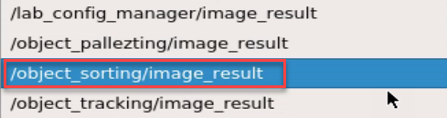

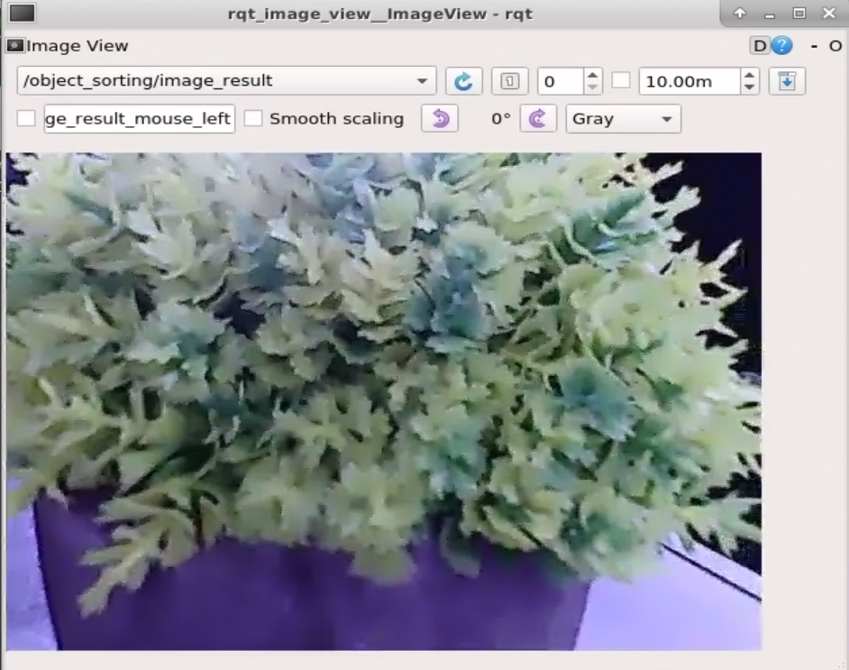

:::{Note}
 After camera image is enabled, you must select the topic corresponding to the game or the recognition process can not be displayed normally after game starts.
:::

<p id="anchor_10_2_4"></p>

**10.2.4  Start game**

(1) Get back to the terminal opened in "[**10.2.2 Access to game**](#anchor_10_2_2)" and enter command and press Enter. The prompt in box as below picture denotes game is started.

```shell
rosservice call /object_sorting/set_running "data: true"
```

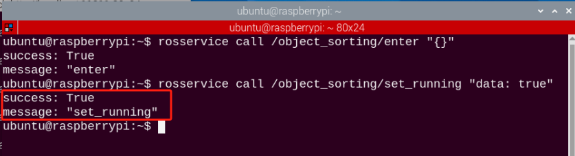

(2) After starting the game, we need to select the targeted color and labels. If want to pick red blocks and blocks with tag1 label, enter **"rosservice call /object_sorting/set_target "color:**

```shell
rosservice call /object_sorting/set_target "color:

- 'red'

tag:

- 'tag1'"
```

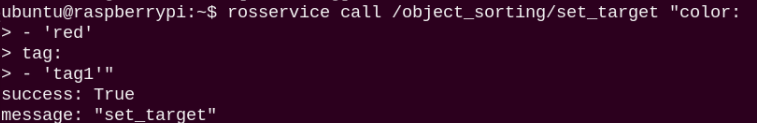

If you need to sort multiple items in turn, you need to input multiple parameters. For example, if you need to sort three colors (red, green, blue) and three tags (tag1, tag2, tag3), there will be a total of six items. The input format is hyphen + space + 'color/tag'. Please strictly follow this format.

The operation steps are as follow. 

(1) Please enter command and press "Tab" to complete. Then delete the following content in red box. 

```shell
rosservice call /object_sorting/set_target "color"
```

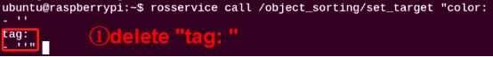

(2) Enter argument "red" according to the previous steps, then press "Enter+Shift" for newline. Then enter second parameter referring to the format.

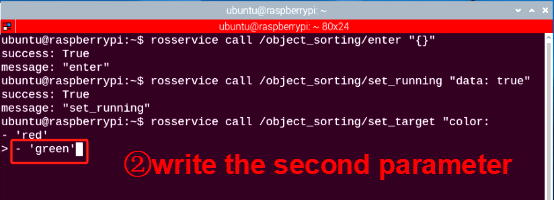

(3) The rest of the argument should be entered in turn according to the format. After editing, input double quotes, then press Enter to complete the setup. Be mindful of spaces when inputting parameters.

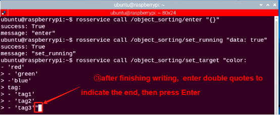

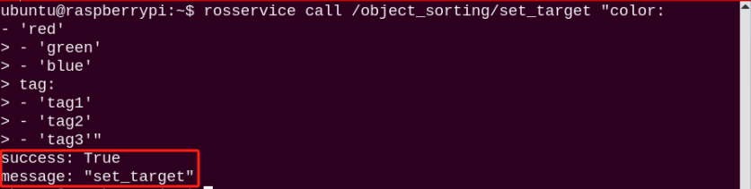

**10.2.5 Stop and exit game**

(1) If desire to stop the game, please enter command "rosservice call /object_pallezting/set_running "data: false"" and press **Enter.**
Referring to "[10.2.4 Start the game]()", you can change the targeted color or label after a pause. 

```shell
rosservice call /object_pallezting/set_running "data: false"
```

(2) Enter command to quit the game.

```shell
rosservice call /object_sorting/exit "{}"
```

:::{Note}
before game is exited, it will continue to run in the current Raspberry Pi power-on state. To prevent occupying the RAM of Raspberry Pi, please refer to the above steps to close the current program before another program is executed.
:::

For disabling camera image function, please return to the terminal of rqt tool and press "Ctrl+C".

(3) Click terminal icon  on the upper-left of the desktop. Note: it is needed to input command in system path, rather than input app service command in the docker container. Input "sudo systemctl restart start_node.service" in the system path and press Enter to start APP service. Wait for a moment until the robotic arm return to the initial posture and the buzzer emits "Di" for one time.

```shell
sudo systemctl restart start_node.service
```

### 10.3 Program Outcome

Due to the needs of color recognition, please play this game in well-lit room. When the game starts, we should place the red block and the block with Tag1 label on corresponding area of the map. When recognized, the target goods will be framed, which can be seen in the rqt tool. Then the robotic arm will pick the goods with Tag1 label to one side at first and red goods next.

### 10.4 Function Extension

**10.4.1 Add new identifiable color** 

There are three built-in identifiable colors in program, which are red, green and blue. However, you can also add other identifiable colors for this game. For instance, add orange as a new identifiable color, please refer to the following steps:
① Open a terminal. Enter command "python3 /home/ubuntu/software/lab_config/main.py" and press Enter to open color threshold adjustment tool. If the camera image does not display on LAB tool, please check if the camera is connected properly.

```shell
python3 /home/ubuntu/software/lab_config/main.py
```


② When camera is connected successfully, select "red" in color drop-down list.


③ The right side of interface shows the real-time camera image, while the left side of interface shows the color required to be collected. First of all, point robot's camera at the orange object. Next, drag the below six sliders until the orange area turns white and others turns black. Lastly, click "save" to save the set data. 

:::{Note}
It is recommend to record the initial values of sliders with a screenshot or a backup file, which provides a reference data for adding "red" as identifiable color.
:::


④ Start object sorting according to the operation steps from "10.2.1 Access to game"to "2.3 Start Game".

 :::{Note}

As red is replaced by orange in LAB tool, please select "red" as target color before starting game.

:::

⑤ After the game starts, put orange object in front of camera. When it is identified, ArmPi FPV will pick and transport it to color sorting area. If you want to add other identifiable colors for this game, please refer to the steps above in this section.

### 10.5 Program Analysis

The source code of program is stored in Docker container: **[/home/ubuntu/armpi_fpv/src/object_sorting/scripts/sorting.py]()**

- #### 10.5.1 Import functional libraries

  |                      **Import Module**                       |                         **Function**                         |
  | :----------------------------------------------------------: | :----------------------------------------------------------: |
  |                          import cv2                          | The OpenCV library is imported for image processing and AIvision-related functions. |
  |                         import copy                          |               Used for copying Python objects.               |
  |                         import math                          | The math module provides access to underlying mathematical operations, including many commonly used mathematical functions and constants. |
  |                         import queue                         | Provide queue data structure, supporting multi-threaded programming. |
  |                         import rospy                         | Import the library for the Python interface of ROS for communicationwith ROS. |
  |                        import signal                         |                Allow to handle Unix signals.                 |
  |                      import  threading                       |    Provide an environment for executing multiple threads.    |
  |                          import np                           | Import the NumPy library: an open-source numerical computing extension library for Python, used for array and matrix operations. |
  |                 from threading import Timer                  | Import the Timer class from thethreading module, used to call a method after a specified amount of time. |
  |              from sensor_msgs.msg import Image               | Import the Image message type from the sensor_msgs package.  |
  |  from std_srvs.srv import Trigger, SetBool,SetBoolResponse   | Import the Trigger and SetBool service types from the ROS standard services, as well as the response type for SetBool. |
  |               from warehouse.msg import Grasp                |           Import data related to grasping actions.           |
  |     from hiwonder_servo_msgs.msg import MultiRawIdPosDur     | Import the MultiRawIdPosDur message type to control multiple servos. |
  |  from ros_robot_controller.msg import RGBState, BuzzerState  | Import the message types of RGB light, and buzzer, controlling the status of RGB lights and buzzer. |
  |    from armpi_fpv_common import pid,misc,common,apriltag     | Import the PID controller, the misc Handling module, common function module, and the module for handling AprilTag. |
  |     from hiwonder_servo_control import bus_servo_control     |              Import the servo control library.               |
  | from armpi_fpv_kinematics_controllers import set_pose_target, go_pose_target |      Import the libraries related to robot kinematics.       |

If you want to call a function from a functional library, you can use "library name + function name (parameter, parameter...)" format, such as:

```python
rospy.sleep(0.1)
```

The above command is to call the "sleep" function from the "rospy" library, which is used for delaying execution. In Python, there are some built-in libraries that we can directly import and use, such as 'cv2', 'math', and others.

<p id="anchor_10_5_4"></p>

**10.5.2 Define placement coordinate** 

```python
##################################################
# 放置坐标x, y, z(m)
place_position = {'red':  [0.190,    0.061,  0.01],
                  'green':[0.190,    0,      0.01],
                  'blue': [0.190,   -0.059,  0.01],
                  'tag1': [-0.190,   0.053,  0.01],
                  'tag2': [-0.190,   0,      0.01],
                  'tag3': [-0.190,  -0.061,  0.01]}
###################################################
```

The "place_position()" function represents the coordinate (x,y,z) of the object placement area in meters, with robot's perspective as the first-person view. X refers to the left and right movement of robotic arm, Y represents the forward and backward movement and Z represents the upward and downward movement for height adjustment.

In the example of "'red': "[0.190,  0.061,   0.01]", the first argument "0.190" represents that the block was placed at 0.19 meters to the left of the centre point of the robotic arm. If the argument is a negative number, the object is placed to the right.

The second argument "0.061" represents that the block is placed under 0.61m of the center point of the robotic arm. If the argument is a negative number, the object is placed on the top of the center point.

The third argument "0.01" represents that the block is put down a height of 0.01 meter. 

If the sorting position has deviation, you may adjust the coordinate "X,Y, Z" to adjustment the position.

**10.5.3 Main function analysis**

**(1) Initialize the node**


```python
if __name__ == '__main__':
    # 初始化节点
    rospy.init_node('object_sorting', log_level=rospy.INFO)
```

Initialize the node named "object_sorting".

**(2) Publish the node topic** 

```python
# 舵机发布
joints_pub = rospy.Publisher('/servo_controllers/port_id_1/multi_id_pos_dur', MultiRawIdPosDur, queue_size=1)
# 图像发布
image_pub = rospy.Publisher('/object_sorting/image_result', Image, queue_size=1)  # register result image publisher
```

```python
# 蜂鸣器
buzzer_pub = rospy.Publisher('/ros_robot_controller/set_buzzer', BuzzerState, queue_size=1)
# rgb 灯
rgb_pub = rospy.Publisher('/ros_robot_controller/set_rgb', RGBsState, queue_size=1)
```

joints_pub is to create and publish the topic '/servo_controllers/port_id_1/multi_id_pos_dur' of type MulitiRawIdPosDur, and a queue length of 1. Start the relevant nodes for the robotic arm.

image_pub is to create and publish the topic '/object_sorting/image_result' with the topic type Image and a queue length of 1.

buzzer_pub is to create and publish the topic '/sensor/buzzer' with the topic type Float32 and a queue length of 1 to start the node of buzzer.

rgb_pub is to create and publish the topic /sensor/rgb_led' with the topic type Led and a queue length of 1 to start the node of RGB.

**(3) Enable service** 

```python
    # app通信服务
    enter_srv = rospy.Service('/object_sorting/enter', Trigger, enter_func)
    exit_srv = rospy.Service('/object_sorting/exit', Trigger, exit_func)
    running_srv = rospy.Service('/object_sorting/set_running', SetBool, set_running)
    set_target_srv = rospy.Service('/object_sorting/set_target', SetTarget, set_target)
    heartbeat_srv = rospy.Service('/object_sorting/heartbeat', SetBool, heartbeat_srv_cb)
```

**enter_srv:** subscribe to topic **'/object_sorting/enter'** of type Trigger and associate it with the callback function enter_func.  

**exit_srv:** subscribe to topic **'/object_sorting/exit'** of type Trigger and associate it with the callback function exit_func.

runing_srv: subscribe to topic '/object_sorting/set_running' of type SetBool and associate it with the callback function set_running.

hearbeat_srv: subscribe to topic '/object_sorting/hearbeat' of type SetBool and associate it with the callback function heartbeat_srv_cb.

**(4) Test (optional)**

```python
if debug:
    rospy.sleep(0.2)
    enter_func(1)

    msg = SetTarget()
    msg.color = ['red', 'green', 'blue']
    msg.tag = ['tag1', 'tag2', 'tag3']
    set_target(msg)

    start_running()
```

This part is to enter the debugging mode and will directly start object tracking. The specific content is as follow:
After modifying the value of debug as True, you will enter the debugging mode when starting game.
When the internal parameter of the enter_func function is set as 1, the game will start. 
Launch start_running function to start object sorting.

**10.5.4 Sub-function Analysis**

<p id="anchor_10_5_6"></p>

**(1) Initialize position**

```python
# 初始位置
def initMove(delay=True):
    with lock:
        bus_servo_control.set_servos(joints_pub, 1.5, ((1, 200), (2, 500), (3, 80), (4, 825), (5, 625), (6, 500)))
    if delay:
        rospy.sleep(2)
```

Use the example of "bus_servo_control.set_servos(joints_pub, 1500, ((1, 75), (2, 500), (3, 80), (4, 825), (5, 625), (6, 500)))". The meaning of arguments in brackets is as follow:

The first parameter "joints_pub" is the published topic.

The second parameter "1.5" is the rotation time of servo in ms.

In the third parameter "((1, 200), (2, 500), (3, 80), (4, 825), (5, 625), (6, 500))", take "（1，200）" as example, "1" represents the ID number of servo and "200" represents the rotation position of servo.

**(2) Define initialization function**

```python
# app初始化调用
def init():
    global stop_state
    global target_data

    rospy.loginfo("object sorting Init")
    load_lab_config()
    load_config()
    stop_state = 0
    target_data = ((), ())
    initMove()
    reset()

y_d = 0
roll_angle = 0
gripper_rotation = 0
# 木块对角长度一半
square_diagonal = 0.03*math.sin(math.pi/4)
F = 1000/240.0
```

The parameter of lab is obtained by calling the load_lab_config() function for later contrast.

```python
def load_lab_config():
    global color_range
    
    # 获取lab参数
    color_range = rospy.get_param('/lab_config_manager/color_range_list', {})  # get lab range from ros param server
```

Initialize the position information of map by calling the load_config() function.

```python
def load_config():
    global config
    global d_tag_map
    global tag_z_min
    global tag_z_max
    global d_color_map
    global color_z_min
    global color_z_max
    global d_color_y
    global color_y_adjust
    global center_x
    
    
    config = rospy.get_param('config', {})
    if config != {}:        
        d_tag_map = config['d_tag_map']

        tag_z_min = config['tag_z_min']
        tag_z_max = config['tag_z_max']

        d_color_map = config['d_color_map']

        color_z_min = config['color_z_min']
        color_z_max = config['color_z_max']
        d_color_y = config['d_color_y']
        color_y_adjust = config['color_y_adjust']

        center_x = config['center_x']
```

You can refer to "5.3.1 Initialize position" to restore the robotic arm back to the launch pose by calling the initMove() function.

```python
initMove()
```

Reset all parameters by calling the reset() function.

```python
with lock:
    X = 0
    Y = 0

    x_dis = 500
    y_dis = Y_DIS
    tag_x_dis = 500
    tag_y_dis = 0    
    x_pid.clear()
    y_pid.clear()
    tag_x_pid.clear()
    tag_y_pid.clear()
    last_x_dis = x_dis
    last_y_dis = y_dis

    adjust = False
    approach = False
    start_move = False
    adjust_error = False

    move_state = 1
    set_rgb(0, 0, 0)
    rotation_angle = 0
    box_rotation_angle = 0
    last_box_rotation_angle = 0

    count = 0
    count2 = 0
    count3 = 0
```

**(3) Define color sorting function**

At first, obtain the real-time camera image for identify color. When the target color is identified, it will be circle on frame. Next, pick the block with maximum area. 

**(4)  Map block coordinate position**

The "Misc.map()" function is used to convert the position of the object in the camera image to its actual position. 

```python
# 位置映射
if 298 + d_color_map < centerY <= 424 + d_color_map:
    Y = misc.map(centerY, 298 + d_color_map, 424 + d_color_map, 0.12, 0.12 - 0.04)
elif 198 + d_color_map < centerY <= 298 + d_color_map:
    Y = misc.map(centerY, 198 + d_color_map, 298 + d_color_map, 0.12 + 0.04, 0.12)
elif 114 + d_color_map < centerY <= 198 + d_color_map:
    Y = misc.map(centerY, 114 + d_color_map, 198 + d_color_map, 0.12 + 0.08, 0.12 + 0.04)
elif 50 + d_color_map < centerY <= 114 + d_color_map:
    Y = misc.map(centerY, 50 + d_color_map, 114 + d_color_map, 0.12 + 0.12, 0.12 + 0.08)
elif 0 + d_color_map < centerY <= 50 + d_color_map:
    Y = misc.map(centerY, 0 + d_color_map, 50 + d_color_map, 0.12 + 0.16, 0.12 + 0.12)
else:
    Y = 1
```

**(5) PID data update** 

```python
last_x = centerX
last_y = centerY
if (not approach or adjust) and start_move: # pid调节           
    detect_color = (color_area_max, )            
    x_pid.SetPoint = center_x #设定           
    x_pid.update(centerX) #当前
    dx = x_pid.output
    x_dis += dx #输出  
    # print(x_dis, dx, center_x centerX)
    x_dis = 0 if x_dis < 0 else x_dis          
    x_dis = 1000 if x_dis > 1000 else x_dis
```

**(6) Update the value of Y axis**

```python
if adjust:
    y_pid.SetPoint = color_y_adjust
    start_move = True
    # print(1111, gripper_rotation, roll_angle)
    centerY += abs(misc.map(70*math.sin(math.pi/4)/2, 0, size[0], 0, img_w)*math.sin(math.radians(abs(gripper_rotation) + 45))) + 65*math.sin(math.radians(abs(roll_angle)))
    if Y < 0.12 + 0.04:
        centerY += d_color_y 
        if 0 < centerY - color_y_adjust <= 5:
            centerY = color_y_adjust
            y_pid.update(centerY)

            dy = y_pid.output
            y_dis += dy
            y_dis = 0.1 if y_dis > 0.1 else y_dis
            y_dis = -0.1 if y_dis < -0.1 else y_dis
        else:
            dy = 0
```

By using the PID algorithm, the actual position of the object is compared with the position captured in the camera image. The difference between the two positions is calculated, and this deviation is assigned to the variable "y_dis."

**(7) Update the gripping angle for block**

```python
if abs(dx) < 0.1 and abs(dy) < 0.0001 and (abs(last_box_rotation_angle - rect[2]) <= 10 or abs(last_box_rotation_angle - rect[2] >= 80)):
    count += 1
    rospy.sleep(0.01)
    if (adjust and count > 10) or (not adjust and count >= 10):
        count = 0
        if adjust:
            adjust = False
        else:
            rotation_angle = 240 * (x_dis - 500)/1000.0
            X = round(-Y * math.tan(math.radians(rotation_angle)), 4)
            state = 'color'
            pick_color = detect_color[0]
            adjust_error = False
            approach = True
        else:
            count = 0
```

**(8) Convert between coordinates to angles**

```python
if adjust and (abs(last_x_dis - x_dis) >= 2 or abs(last_y_dis - y_dis) > 0.002):
    position = grasps.grasp_pos.position
    rotation = grasps.grasp_pos.rotation
    target = set_pose_target((position.y + y_dis, position.x, position.z), rotation.r, [-90, 90], 0)
    if target[1]:
        servo_data = target[1]
        bus_servo_control.set_servos(joints_pub, 0.1, ((3, servo_data[3]), (4, servo_data[2]), (5, servo_data[1]), (6, int(x_dis))))
        rospy.sleep(0.1)
        last_x_dis = x_dis
        last_y_dis = y_dis
    else:
        bus_servo_control.set_servos(joints_pub, 0.02, ((6, int(x_dis)), ))
    else:                    
        bus_servo_control.set_servos(joints_pub, 0.02, ((6, int(x_dis)), ))
```

Convert the position between coordinates and angles through "set_pose_target()" function. The first parameter "(position.x, position.y + y_dis, position.z)" is the given coordinate, e,i, the coordinate of the end effector in cm, and imported by tuple. 
The second parameter "rotation.r" and the third parameter "[-90, 90]" represents pitch angle range.
The fourth parameter "0" represents the increment in pitch angle during traversal.

**(9) Define tag sorting function**

**① Obtain tag ID**

The tag in camera image is detected by using the apriltagDetect() function.

```python
# 检测apriltag
detector = apriltag.Detector(searchpath=apriltag._get_demo_searchpath())
def apriltagDetect(img):
    global tag1, tag2, tag3
    
    gray = cv2.cvtColor(img, cv2.COLOR_BGR2GRAY)
    detections = detector.detect(gray, return_image=False)
    
    tag1 = ['tag1', -1, -1, -1, 0]
    tag2 = ['tag2', -1, -1, -1, 0]
    tag3 = ['tag3', -1, -1, -1, 0]
    if len(detections) != 0:
        for i, detection in enumerate(detections):              
            corners = np.rint(detection.corners)  # 获取四个角点
            cv2.drawContours(img, [np.array(corners, np.int)], -1, (0, 255, 255), 2)

            tag_id = int(detection.tag_id)  # 获取tag_id
```

**(10) Map tag coordinate**

```python
# 位置映射
if tag_map[1] + d_tag_map < centerY <= tag_map[0] + d_tag_map:
    Y = misc.map(centerY, tag_map[1] + d_tag_map, tag_map[0] + d_tag_map, 0.12 + d_map, 0.12) - 0.005
elif tag_map[2] + d_tag_map < centerY <= tag_map[1] + d_tag_map:
    Y = misc.map(centerY, tag_map[2] + d_tag_map, tag_map[1] + d_tag_map, 0.12 + 2*d_map, 0.12 + d_map)
elif tag_map[3] + d_tag_map < centerY <= tag_map[2] + d_tag_map:
    Y = misc.map(centerY, tag_map[3] + d_tag_map, tag_map[2] + d_tag_map, 0.12 + 3*d_map, 0.12 + 2*d_map)
elif tag_map[4] + d_tag_map < centerY <= tag_map[3] + d_tag_map:
    Y = misc.map(centerY, tag_map[4] + d_tag_map, tag_map[3] + d_tag_map, 0.12 + 4*d_map, 0.12 + 3*d_map)
elif tag_map[5] + d_tag_map < centerY <= tag_map[4] + d_tag_map:
    Y = misc.map(centerY, tag_map[5] + d_tag_map, tag_map[4] + d_tag_map, 0.12 + 5*d_map, 0.12 + 4*d_map)
elif tag_map[6] + d_tag_map < centerY <= tag_map[5] + d_tag_map:
    Y = misc.map(centerY, tag_map[6] + d_tag_map, tag_map[5] + d_tag_map, 0.12 + 6*d_map, 0.12 + 5*d_map)
elif tag_map[7] + d_tag_map < centerY <= tag_map[6] + d_tag_map:
    Y = misc.map(centerY, tag_map[7] + d_tag_map, tag_map[6] + d_tag_map, 0.12 + 7*d_map, 0.12 + 6*d_map)
elif tag_map[8] + d_tag_map < centerY <= tag_map[7] + d_tag_map:
    Y = misc.map(centerY, tag_map[8] + d_tag_map, tag_map[7] + d_tag_map, 0.12 + 8*d_map, 0.12 + 7*d_map)
elif tag_map[9] + d_tag_map < centerY <= tag_map[8] + d_tag_map:
    Y = misc.map(centerY, tag_map[9] + d_tag_map, tag_map[8] + d_tag_map, 0.12 + 9*d_map, 0.12 + 8*d_map)
elif tag_map[10] + d_tag_map < centerY <= tag_map[9] + d_tag_map:
    Y = misc.map(centerY, tag_map[10] + d_tag_map, tag_map[9] + d_tag_map, 0.12 + 10*d_map, 0.12 + 9*d_map)
elif tag_map[11] + d_tag_map < centerY <= tag_map[10] + d_tag_map:
    Y = misc.map(centerY, tag_map[11] + d_tag_map, tag_map[10] + d_tag_map, 0.12 + 11*d_map, 0.12 + 10*d_map)
elif tag_map[12] + d_tag_map < centerY <= tag_map[11] + d_tag_map:
    Y = misc.map(centerY, tag_map[12] + d_tag_map, tag_map[11] + d_tag_map, 0.12 + 12*d_map, 0.12 + 11*d_map)
elif tag_map[13] + d_tag_map < centerY <= tag_map[12] + d_tag_map:
    Y = misc.map(centerY, tag_map[13] + d_tag_map, tag_map[12] + d_tag_map, 0.12 + 13*d_map, 0.12 + 12*d_map)
else:
    Y = 1
```

**(11) Define gripping priority for tag**

```python
# 选取策略，优先tag, 夹取超时处理
if 'tag1' in target_data[1] and 'tag1' in current_tag:
    if tag1[1] != -1:
        count_adjust_timeout = 0
        image = tag_sort(image, tag1)
    else:
        if adjust:
            count_adjust_timeout += 1
            if count_adjust_timeout > 50:
                count_adjust_timeout = 0
                adjust_error = True
            else:
                count_tag_timeout += 1
                if count_tag_timeout > 3:
                    count_tag_timeout = 0
                    if current_tag != 'tag1':
                        current_tag.remove('tag1')
                    elif 'tag2' in target_data[1] and 'tag2' in current_tag:
                        if tag2[1] != -1:
                            count_adjust_timeout = 0
                            image = tag_sort(image, tag2)
                        else:
                            if adjust:
                                count_adjust_timeout += 1
                                if count_adjust_timeout > 50:
                                    count_adjust_timeout = 0
                                    adjust_error = True
                                else:
                                    count_tag_timeout += 1
                                    if count_tag_timeout > 3:
                                        count_tag_timeout = 0
                                        if current_tag != 'tag2':
                                            current_tag.remove('tag2')
                                        elif 'tag3' in target_data[1] and 'tag3' in current_tag:
                                            if tag3[1] != -1:
                                                count_adjust_timeout = 0
```

If more than one tag appears in a camera image, the tag wood block is gripped according to the ID number of the tag, and its priority is ID1, 2 and 3.

**(12) Define gripping function**

Determine if the target position is reached.

```python
# 夹取
def pick(grasps, have_adjust=False):
    global roll_angle, last_x_dis
    global adjust, x_dis, y_dis, tag_x_dis, tag_y_dis, adjust_error, gripper_rotation

    position = grasps.grasp_pos.position
    rotation = grasps.grasp_pos.rotation
    approach = grasps.grasp_approach
    retreat = grasps.grasp_retreat

    # 计算是否能够到达目标位置，如果不能够到达，返回False
    target1 = set_pose_target((position.y + approach.y, position.x + approach.x, position.z + approach.z), rotation.r, [-90, 90], 0)
    target2 = set_pose_target((position.y, position.x, position.z), rotation.r, [-90, 90], 0)
    target3 = set_pose_target((position.y, position.x, position.z + grasps.up), rotation.r, [-90, 90], 0)
    target4 = set_pose_target((position.y + retreat.y, position.x + retreat.x, position.z + retreat.z), rotation.r, [-90, 90], 0)
```

According to the position in the camera screen, calculate whether the robotic arm can reach the position of the block, and start gripping if it can reach it.

**(13) Move the gripper above the target position**

```commandline
# 第三步：移到目标点
target2 = set_pose_target((position.y, position.x, position.z), rotation.r, [-90, 90], 0)
servo_data = target2[1]
bus_servo_control.set_servos(joints_pub, 1.5, ((3, servo_data[3]), (4, servo_data[2]), (5, servo_data[1])))
rospy.sleep(2)
if not running:
    target4 = set_pose_target((position.y, position.x, position.z + grasps.up), rotation.r, [-90, 90], 0)
    servo_data = target4[1]
    bus_servo_control.set_servos(joints_pub, 1, ((1, 200), (3, servo_data[3]), (4, servo_data[2]), (5, servo_data[1])))
    rospy.sleep(1)
    return False
```

The robot arm is moved by calling the bus_servo_control.set_servos() function. The analysis of this function can be viewed by referring to "Initialize Position"
A tiny adjustment for the gripping position and align the position of the color block.

A tiny adjustment for the gripping position and align the position of the color block.

```commandline
if state == 'color':
    # 第四步：微调整位置
    if not adjust:
        adjust = True
        return True
    else:
        return True
    else:
        # 第五步: 对齐
        bus_servo_control.set_servos(joints_pub, 0.5, ((2, 500 + int(F*gripper_rotation)), ))
        rospy.sleep(0.5)
        if not running:
            target4 = set_pose_target((position.y, position.x, position.z + grasps.up), rotation.r, [-90, 90], 0)
            servo_data = target4[1]
            bus_servo_control.set_servos(joints_pub, 1, ((1, 200), (3, servo_data[3]), (4, servo_data[2]), (5, servo_data[1])))
            rospy.sleep(1)             
            return False
```

After reaching above the block, to capture the color block more accurately, it is necessary to slightly adjust the gripping position of the block according to the angle of the block.

**(14) Grip block**

```commandline
# 第六步：夹取
bus_servo_control.set_servos(joints_pub, 0.5, ((1, grasps.grasp_posture - 80), ))
rospy.sleep(0.6)
bus_servo_control.set_servos(joints_pub, 0.5, ((1, grasps.grasp_posture), ))
rospy.sleep(0.8)
if not running:
    bus_servo_control.set_servos(joints_pub, 0.5, ((1, grasps.pre_grasp_posture), ))
    target4 = set_pose_target((position.y, position.x, position.z + grasps.up), rotation.r, [-90, 90], 0)
    rospy.sleep(0.5)            
    servo_data = target4[1]
    bus_servo_control.set_servos(joints_pub, 1, ((1, 200), (3, servo_data[3]), (4, servo_data[2]), (5, servo_data[1])))
    rospy.sleep(1)             
    return False
```

After adjusting the gripping position, you can pick up the color block.

**(15) Raise robotic arm**

```commandline
# 第七步：抬升物体
if grasps.up != 0:
    target3 = set_pose_target((position.y, position.x, position.z + grasps.up), rotation.r, [-90, 90], 0)
    servo_data = target3[1]
    bus_servo_control.set_servos(joints_pub, 0.5, ((3, servo_data[3]), (4, servo_data[2]), (5, servo_data[1])))
    rospy.sleep(0.6)
    if not running:
        bus_servo_control.set_servos(joints_pub, 0.5, ((1, grasps.pre_grasp_posture), ))
        target4 = set_pose_target((position.y, position.x, position.z + grasps.up), rotation.r, [-90, 90], 0)
        rospy.sleep(0.5)            
        servo_data = target4[1]
        bus_servo_control.set_servos(joints_pub, 1, ((1, 200), (3, servo_data[3]), (4, servo_data[2]), (5, servo_data[1])))
        rospy.sleep(1)             
        return False

    # 第八步：移到撤离点
    target4 = set_pose_target((position.y, position.x, position.z + grasps.up), rotation.r, [-90, 90], 0)
    servo_data = target4[1]
    if servo_data != target3[1]:    
        bus_servo_control.set_servos(joints_pub, 1, ((3, servo_data[3]), (4, servo_data[2]), (5, servo_data[1])))
        rospy.sleep(1)
        if not running:
            bus_servo_control.set_servos(joints_pub, 0.5, ((1, grasps.pre_grasp_posture), ))
            rospy.sleep(0.5)                
            return False

        # 第九步：移到稳定点
        bus_servo_control.set_servos(joints_pub, 1.5, ((2, 500), (3, 80), (4, 825), (5, 625)))
        rospy.sleep(1.5)
        if not running:
            bus_servo_control.set_servos(joints_pub, 0.5, ((1, grasps.pre_grasp_posture), ))
            rospy.sleep(0.5)            
            return False
```

**(16)  Define placement function**

The process for the placement function is similar to the gripping function. What's important to note here is that the placement position has already been defined in **"10.5.2 Definition of Placement Coordinates,"** and users can adjust it according to their actual needs.

## 11.Intelligent Stacking

### 11.1 Program Description

When intelligent stacking game starts, the robotic arm can recognize two kinds of items and stack the items to different area by category. Color blocks and blocks with tags respectively represent one kind of items. The overall process consists of three parts, including recognizing, picking and stacking.        

First, the robotic arm will recognize the object within the recognition area. It is divided into tags recognition and color recognition, and recognition methods of these two cases are different.  

Color recognition is realized by Lab color space. Convert the RGB color space to Lab, image binarization, and then perform operations such as expansion and corrosion to obtain an outline containing only the target color. Use circles to frame the color outline to realize object color recognition.

For tag recognition, the robotic arm target the tag outline through locating, image segmentation and outline searching. Next, it comes to quadrilateral detection, and form a quadrilateral through connecting four corner points. Then, it will code and decode the target tag, and gets corresponding ID.   

The next step is to determine whether the block continues to move or not. If it detect that the blocks stop moving for a while, it will begin picking the block. And there is differences between the ways to pick color block and to pick block with tag. 

Block with tag: The robotic arm will determine the picking order through comparing the ID number it obtained before. Block with smaller ID number will be picked first.

Color block: after obtaining the recognition area of the corresponding colors, ArmPi FPV will compare the data it gain. It will make multiple judgments and takes the average to compare their sizes. Then it determines the picking order of the goods in the same color based on their area. Priority will be given to object with large area. 

Lastly, stack the color blocks and blocks with tags in different stacking area. When stacking two kinds of block, the robotic arm will stack the block on the below block. Having completing the task, the robotic arm will return to original posture.     

### 11.2 Start and Close the Game

:::{Note}
The entered command should be case sensitive and "Tab" key can be used to complement the keywords.
:::

**11.2.1 Preparation**

① Please place the map on even desk and the robotic arm should be placed on the corresponding area on the map.  

② Prepare 3 blocks in red, green and yellow and 3 blocks labeled with tag1, tag2 and tag3. And place them randomly on the recognition area of the map. Note: the interval between each blocks is not less than 3cm.

③ Turn on the robotic arm and wait to finish. 

<p id="anchor_11_2_2"></p>

**11.2.2  Access to game**

(1) Power on the robot and use VNC Viewer to connect to the remote desktop.


(2) Click the icon  on the upper-left of the desktop, and open Terminator terminal.


(3) Enter command to run game program, and press Enter to close APP self-starter service.

```shell
sudo ./.stop_ros.sh
```

(4) Input command, and press Enter to open motion control, camera and other underlying services.

```shell
roslaunch armpi_fpv_bringup bringup.launch
```

(5) Open new terminal and input command according to "Step2". Then press Enter proceed to obkect tracking program. After entering successfully, the prompt information will be printed as pictured:

```shell
rosservice call /object_pallezting/enter "{}"
```

#### 11.2.3 Enable live camera feed 

(1) After entering game, rqt tool is required to enable live camera feed. Based on "Step2" to open a new terminal.

(2) Enter command and press Enter to open rqt tool.

```shell
rqt_image_view
```

(3) As shown in the following figure, select "/object_pallezting/image_result" and other settings remain the same.

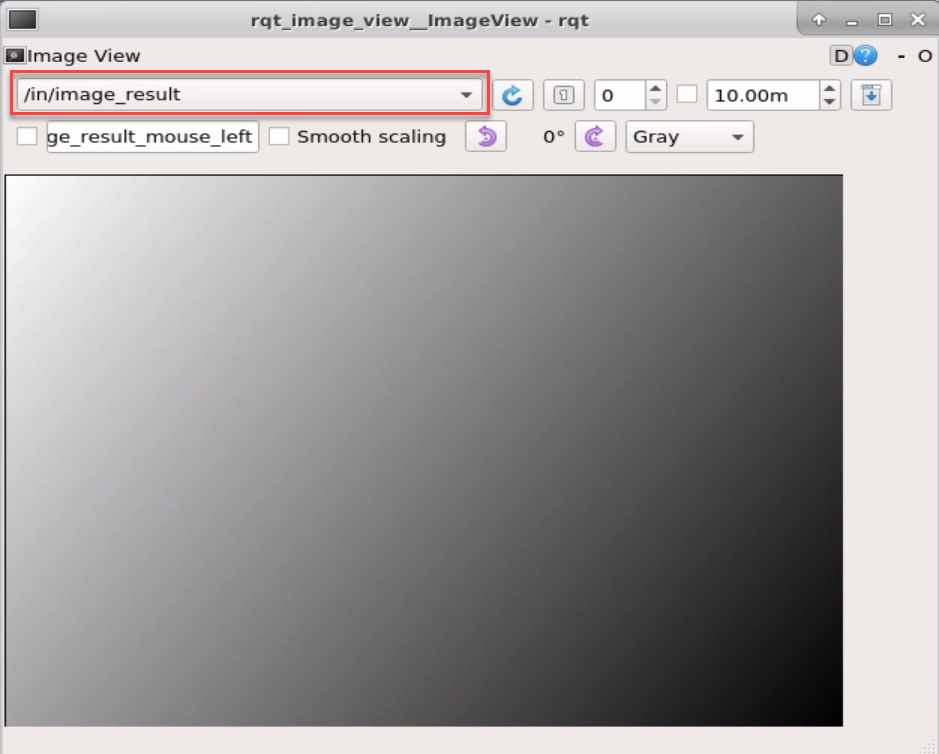

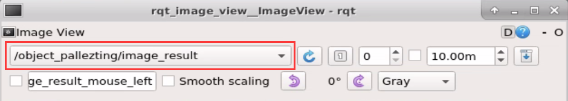

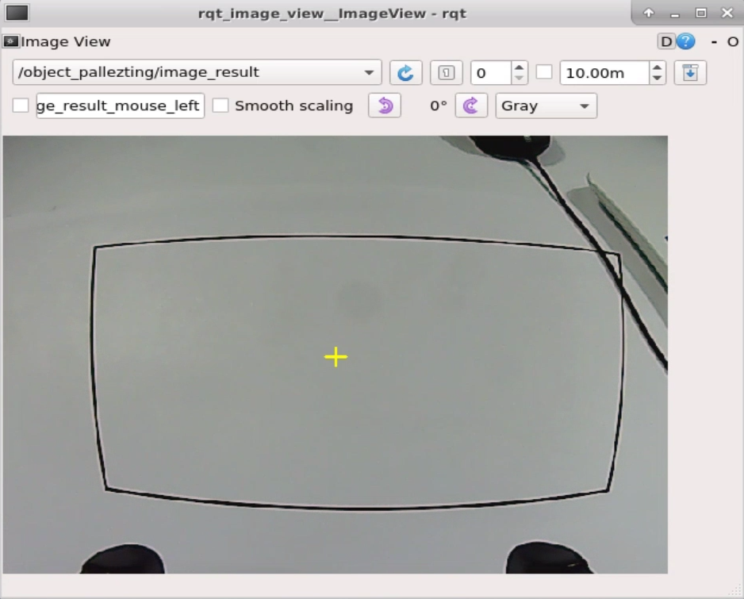

:::{Note}
after the image is turned on, please be sure to select the topic corresponding to the game you play. Otherwise, the recognition process can not be displayed normally if you start other games.
:::

<p id="anchor_11_2_4"></p>

**11.2.4 Start the Game**

Please get back to the terminal opened in "2.2 Enter the Game" and enter rosservice call /object_pallezting/set_running "data: true" command. When the prompt, shown in the red box, appears, it means you start the game successfully.

```shell
rosservice call /object_pallezting/set_running "data: true"
```

**11.2.5 Stop and exit the game**

(1) You can enter command to pause the game. 

```shell
rosservice call /object_pallezting/set_running "data: false"
```

(2) You can enter command to quit the game.

```shell
rosservice call /object_pallezting/exit "{}"
```

:::{Note}
before game is exited, it will continue to run in the current Raspberry Pi power-on state. To prevent occupying the RAM of Raspberry Pi, please refer to the above steps to close the current program before another program is executed.
:::

(3) If you want to turn off the image returned by camera, you can turn back to open rqt terminal and press "Ctrl+C".

(4) Click terminal icon  on the upper-left of the desktop. Note: it is needed to input command in system path, rather than input app service command in the docker container. Input in the system path and press Enter to start APP service. Wait for a moment until the robotic arm return to the initial posture and the buzzer emits "Di" for one time.

```shell
sudo systemctl restart start_node.service
```

### 11.3 Program Outcome

When the game starts, the robotic arm will pick the label block and color block in turn and place them in the corresponding stacking area.

### 11.4 Function Extension

- #### 11.4.1 Add new identifiable color 

There are three built-in identifiable colors in program, which are red, green and blue. However, you can also add other identifiable colors for this game. For instance, add orange as a new identifiable color, please refer to the following steps:

(1) Open a terminal. Enter command and press Enter to open color threshold adjustment tool. If the camera image does not display on pop-up interface, please check if the camera is connected properly.

```shell
python3 /home/ubuntu/software/lab_config/main.py
```

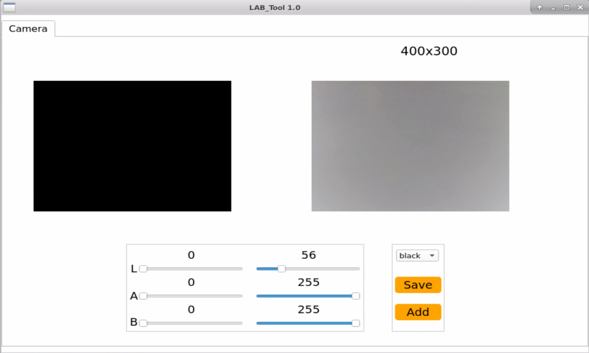

(2) When camera is connected successfully, select "red" in color drop-down list.

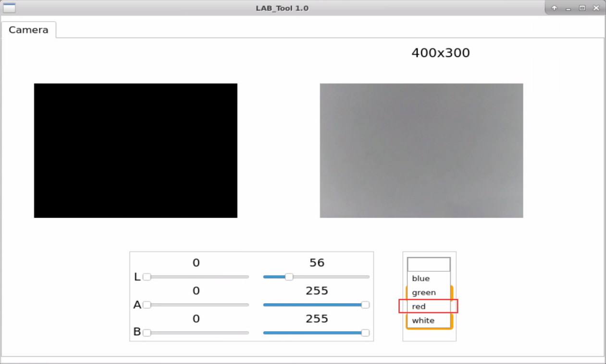

(3) The right side of interface shows the real-time camera image, while the left side of interface shows the color required to be collected. First of all, point robot's camera at the orange object. Next, drag the below six sliders until the orange area turns white and others turns black. Lastly, click "save" to save the set data. 

:::{Note}
It is recommend to record the initial values of sliders with a screenshot or a backup file, which provides a reference data for adding "red" as identifiable color.  
:::

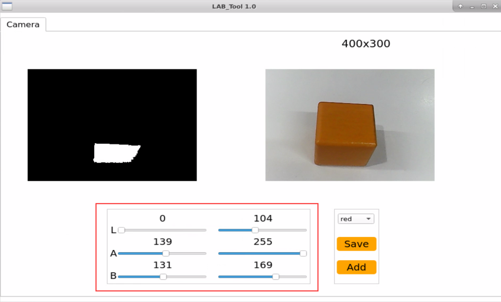


(4) Start object sorting according to the operation steps from "2.2 Access to game"to "[10.2.4 Start Game](#anchor_10_2_4)".

**As red is replaced by orange in threshold value adjustment tool, please select "red" as target color before starting game.**

(5) Put orange object in front of camera, ArmPi FPV will pick up blocks within the visual range in turn. The difference is that after modifying the program, the robotic arm will pick up the orange block instead of the red one. If you need to add other colors as recognizable colors, you can refer to the previous steps.

### 11.5 Program Analysis

The source code is located in the Docker container: **[/home/ubuntu/armpi_fpv/src/object_pallezting/scripts/pallezting.py]()**

**11.5.1 Program Analysis**

| **Import Module**                                            | **Function**                                                 |
| ------------------------------------------------------------ | ------------------------------------------------------------ |
| import cv2                                                   | The OpenCV library is imported for image processing and AIvision-related functions. |
| import copy                                                  | Used for copying Python objects.                             |
| import math                                                  | The math module provides access to underlying mathematical operations, including many commonly used mathematical functions and constants. |
| import queue                                                 | Provide queue data structure, supporting multi-threaded programming. |
| import rospy                                                 | Import the library for the Python interface of ROS for communicationwith ROS. |
| import signal                                                | Allow to handle Unix signals.                                |
| import  threading                                            | Provide an environment for executing multiple threads.       |
| import np                                                    | Import the NumPy library: an open-source numerical computing extension library for Python, used for array and matrix operations. |
| from threading import Timer                                  | Import the Timer class from thethreading module, used to call a method after a specified amount of time. |
| from sensor_msgs.msg import Image                            | Import the Image message type from the sensor_msgs package.  |
| from std_srvs.srv import Trigger, SetBool,SetBoolResponse    | Import the Trigger and SetBool service types from the ROS standard services, as well as the response type for SetBool. |
| from warehouse.msg import Grasp                              | Import data related to grasping actions.                     |
| from hiwonder_servo_msgs.msg import MultiRawIdPosDur         | Import the MultiRawIdPosDur message type to control multiple servos. |
| from ros_robot_controller.msg import RGBState, BuzzerState   | Import the message types of RGB light, and buzzer, controlling the status of RGB lights and buzzer. |
| from armpi_fpv_common import pid,misc,common,apriltag        | Import the PID controller, the misc Handling module, common function module, and the module for handling AprilTag. |
| from hiwonder_servo_control import bus_servo_control         | Import the servo control library.                            |
| from armpi_fpv_kinematics_controllers import set_pose_target, go_pose_target | Import the libraries related to robot kinematics.            |

If you want to call a function from a functional library, you can use "library name + function name (parameter, parameter...)" format, such as:

```python
rospy.sleep(0.1)
```

The above command is to call the "sleep" function from the "rospy" library, which is used for delaying execution. In Python, there are some built-in libraries that we can directly import and use, such as 'cv2', 'math', and others.

<p id="anchor_11_5_4"></p>

**11.5.2 Define the target and placement coordinate**

```python
# 码剁
# 如未声明，使用的长度，距离单位均为m
d_tag_map = 0

tag_z_min = 0.01
tag_z_max = 0.015

d_color_map = 30

color_z_min = 0.01
color_z_max = 0.015
d_color_y = 20
color_y_adjust = 400

center_x = 320

target_data = (('red', 'green', 'blue'), ('tag1', 'tag2', 'tag3'))

running = False

lock = threading.RLock()

mask1 = cv2.imread('/home/ubuntu/armpi_fpv/src/object_sorting/scripts/mask1.jpg', 0)
mask2 = cv2.imread('/home/ubuntu/armpi_fpv/src/object_sorting/scripts/mask2.jpg', 0)
rows, cols = mask1.shape

################################################
# 放置坐标x, y, z(m)
place_position = {'red':  [0.14, -0, 0.01],
                  'green':[0.14, -0, 0.01],
                  'blue': [0.14, -0, 0.01],
                  'tag1': [-0.14, -0, 0.01],
                  'tag2': [-0.14, -0, 0.01],
                  'tag3': [-0.14, -0, 0.01]}
################################################
```

The "place_position()" function represents the coordinate (x,y,z) of the object placement area in meters, with robot's perspective as the first-person view. X refers to the left and right movement of robotic arm, Y represents the forward and backward movement and Z represents the upward and downward movement for height adjustment.
In the example of "'red':  [0.14,  -0,   0.01]", the first argument "0.14" represents that the block was placed at 0.14 meters to the left of the centre point of the robotic arm. If the argument is a negative number, the object is placed to the right.
The second argument "-0" represents that the block is placed at 0 meter on the top of center points. If the argument is a positive number, the object is placed below the center point.
The third argument "0.01" represents that a block is put down a height of 0.01 meter.
If the placement position has deviation, you may adjust the coordinate "X,Y, Z" to adjustment the position.

**11.5.3 Main function analysis**

**(1) Initialize the node**

```python
if __name__ == '__main__':
    # 初始化节点
    rospy.init_node('object_pallezting', log_level=rospy.INFO)
```

Initialize the node named "object_pallezting".

**(2) Publish the node topic** 

```python
# 舵机发布
joints_pub = rospy.Publisher('/servo_controllers/port_id_1/multi_id_pos_dur', MultiRawIdPosDur, queue_size=1)

# 图像发布
image_pub = rospy.Publisher('/object_pallezting/image_result', Image, queue_size=1)  # register result image publisher
```

```python
# 蜂鸣器
buzzer_pub = rospy.Publisher('/ros_robot_controller/set_buzzer', BuzzerState, queue_size=1)
# rgb 灯
rgb_pub = rospy.Publisher('/ros_robot_controller/set_rgb', RGBsState, queue_size=1)
```

joints_pub is to create and publish the topic '/servo_controllers/port_id_1/multi_id_pos_dur' of type MulitiRawIdPosDur, and a queue length of 1. Start the relevant nodes for the robotic arm.
image_pub is to create and publish the topic '/object_pallezting/image_result' with the topic type Image and a queue length of 1.
buzzer_pub is to create and publish the topic '/ros_robot_controller/set_buzzer' with the topic type BuzzerState and a queue length of 1 to start the node of buzzer.
rgb_pub is to create and publish the topic /ros_robot_controller/set_rge' with the topic type RGBsState and a queue length of 1 to start the node of RGB.

**(3) Enable service** 

```python
# app通信服务
enter_srv = rospy.Service('/object_pallezting/enter', Trigger, enter_func)
exit_srv = rospy.Service('/object_pallezting/exit', Trigger, exit_func)
running_srv = rospy.Service('/object_pallezting/set_running', SetBool, set_running)
heartbeat_srv = rospy.Service('/object_pallezting/heartbeat', SetBool, heartbeat_srv_cb)
```

enter_srv: subscribe to topic '/object_pallezting/enter' of type Trigger and associate it with the callback function enter_func.  

exit_srv: subscribe to topic '/object_pallezting/exit' of type Trigger and associate it with the callback function exit_func.

runing_srv: subscribe to topic '/object_pallezting/set_running' of type SetBool and associate it with the callback function set_running.

hearbeat_srv: subscribe to topic '/object_pallezting/hearbeat' of type SetBool and associate it with the callback function heartbeat_srv_cb.

**(4) Obtain coordinates** 

```python
config = rospy.get_param('config', {})
if config != {}:        
    d_tag_map = config['d_tag_map']

    tag_z_min = config['tag_z_min']
    tag_z_max = config['tag_z_max']

    d_color_map = config['d_color_map']

    color_z_min = config['color_z_min']
    color_z_max = config['color_z_max']
    d_color_y = config['d_color_y']
    color_y_adjust = config['color_y_adjust']

    center_x = config['center_x']
```

Obtain the coordinate of the tacking area on map.

**(5) Test (optional)**

```python
debug = 0
if debug:
    rospy.sleep(0.2)
    enter_func(1)
    start_running()
```

This part is to enter the debugging mode and will directly start object tracking. The specific content is as follow:

After modifying the value of debug as True, you will enter the debugging mode when starting game.

When the internal parameter of the enter_func function is set as 1, the game will start. 
Launch start_running function to start intelligent stacking.

<p id="anchor_11_5_6"></p>

**11.5.4 Sub-function Analysis**

**(1) Initialize position**

```python
# 初始位置
def initMove(delay=True):
    with lock:
        bus_servo_control.set_servos(joints_pub, 1.5, ((1, 200), (2, 500), (3, 80), (4, 825), (5, 625), (6, 500)))
    if delay:
        rospy.sleep(2)
```

Use the example of "bus_servo_control.set_servos(joints_pub, 1500, ((1, 75), (2, 500), (3, 80), (4, 825), (5, 625), (6, 500)))". The meaning of arguments in brackets is as follow:

The first parameter "joints_pub" is the published topic.

The second parameter "1.5" is the rotation time of servo in s.

In the third parameter "((1, 200), (2, 500), (3, 80), (4, 825), (5, 625), (6, 500))", take "（1，200）" as example, "1" represents the ID number of servo and "200" represents the rotation position of servo.

(2) Initialize position

```python
# app初始化调用
def init():
    global stop_state
    global color_range

    rospy.loginfo("object pallezting Init")
    # 获取lab参数
    color_range = rospy.get_param('/lab_config_manager/color_range_list', {})  # get lab range from ros param server
    initMove()
    stop_state = 0
    reset_position()
    reset()

place_z_color = copy.deepcopy(place_position['red'][2])
place_z_tag = copy.deepcopy(place_position['red'][2])
def reset_position():
    global place_z_color
    global place_z_tag 

    place_z_color = copy.deepcopy(place_position['red'][2])
    place_z_tag = copy.deepcopy(place_position['red'][2])
```

Obtain the lab parameter for later contrast.

```python
# 获取lab参数
color_range = rospy.get_param('/lab_config_manager/color_range_list', {})  # get lab range from ros param server
```

Restore the robotic arm back to the launch pose by calling the initMove() function. For this part, please refer to "5.4.1 Initialize position".

```python
initMove()
```

Reset the position of the block by calling the "reset_position()" function.

```python
reset_position()
```

Reset the position of the block to be gripped and calculate the height of the block.

```python
def reset_position():
    global place_z_color
    global place_z_tag 

    place_z_color = copy.deepcopy(place_position['red'][2])
    place_z_tag = copy.deepcopy(place_position['red'][2])

y_d = 0
roll_angle = 0
gripper_rotation = 0
# 木块对角长度一半
square_diagonal = 0.03*math.sin(math.pi/4)
F = 1000/240.0
```

Reset all the parameters by calling the "reset()" function.

```python
reset()
```

```python
with lock:
    X = 0
    Y = 0

    x_dis = 500
    y_dis = Y_DIS
    tag_x_dis = 500
    tag_y_dis = 0    
    x_pid.clear()
    y_pid.clear()
    tag_x_pid.clear()
    tag_y_pid.clear()
    last_x_dis = x_dis
    last_y_dis = y_dis

    adjust = False
    approach = False
    start_move = False
    adjust_error = False

    move_state = 1
    set_rgb(0, 0, 0)
    rotation_angle = 0
    box_rotation_angle = 0
    last_box_rotation_angle = 0

    count = 0
    count2 = 0
    count3 = 0
    count_d = 0
    count_timeout = 0
    count_tag_timeout = 0
    count_adjust_timeout = 0

    tag1 = ['tag1', -1, -1, -1, 0]
    tag2 = ['tag2', -1, -1, -1, 0]
    tag3 = ['tag3', -1, -1, -1, 0]
    current_tag = ['tag1', 'tag2', 'tag3']
    detect_color = ('red', 'green', 'blue')
```

**(3) Define block stacking function**

At first, obtain the real-time camera image for identify color. When the target color is identified, it will be circle on frame. Next, pick the block with maximum area. The function for color recognition is consistent with the one in "1.Object Tracking.docx". Once the gripping color is obtained, its position will be calculated for later gripping.

**(4) Map block coordinate position**

The "Misc.map()" function is used to convert the position of the object in the camera image to its actual position. 

```python
# 位置映射
if 298 + d_color_map < centerY <= 424 + d_color_map:
    Y = misc.map(centerY, 298 + d_color_map, 424 + d_color_map, 0.12, 0.12 - 0.04)
elif 198 + d_color_map < centerY <= 298 + d_color_map:
    Y = misc.map(centerY, 198 + d_color_map, 298 + d_color_map, 0.12 + 0.04, 0.12)
elif 114 + d_color_map < centerY <= 198 + d_color_map:
    Y = misc.map(centerY, 114 + d_color_map, 198 + d_color_map, 0.12 + 0.08, 0.12 + 0.04)
elif 50 + d_color_map < centerY <= 114 + d_color_map:
    Y = misc.map(centerY, 50 + d_color_map, 114 + d_color_map, 0.12 + 0.12, 0.12 + 0.08)
elif 0 + d_color_map < centerY <= 50 + d_color_map:
    Y = misc.map(centerY, 0 + d_color_map, 50 + d_color_map, 0.12 + 0.16, 0.12 + 0.12)
else:
    Y = 1
else:
    count_d = 0
```

**(5) PID data update** 

```python
if (not approach or adjust) and start_move: # pid调节           
    detect_color = (color_area_max, )            
    x_pid.SetPoint = center_x #设定           
    x_pid.update(centerX) #当前
    dx = x_pid.output
    x_dis += dx #输出  

    x_dis = 0 if x_dis < 0 else x_dis          
    x_dis = 1000 if x_dis > 1000 else x_dis
```

**(6)  Update the value of Y axis**

```python
if adjust:
    y_pid.SetPoint = color_y_adjust
    start_move = True

    centerY += abs(misc.map(70*math.sin(math.pi/4)/2, 0, size[0], 0, img_w)*math.sin(math.radians(abs(gripper_rotation) + 45))) + 65*math.sin(math.radians(abs(roll_angle)))
    if Y < 0.12 + 0.04:
        centerY += d_color_y 
        if 0 < centerY - color_y_adjust <= 5:
            centerY = color_y_adjust 
            y_pid.update(centerY)

            dy = y_pid.output
            y_dis += dy
            y_dis = 0.1 if y_dis > 0.1 else y_dis
            y_dis = -0.1 if y_dis < -0.1 else y_dis
        else:
            dy = 0
```

Use the PID algorithm to compare the actual position of the block with the position in the camera image, calculate the offset of the object, and assign it to y_dis.

**(7)  Update the gripping angle for block**

```python
if abs(dx) < 0.1 and abs(dy) < 0.0001 and (abs(last_box_rotation_angle - rect[2]) <= 10 or abs(last_box_rotation_angle - rect[2] >= 80)):
    count += 1
    if (adjust and count > 10) or (not adjust and count >= 10):
        count = 0
        if adjust:
            adjust = False
        else:
            rotation_angle = 240 * (x_dis - 500)/1000.0
            X = round(-Y * math.tan(math.radians(rotation_angle)), 4)
            state = 'color'
            pick_color = detect_color[0]
            adjust_error = False
            approach = True
        else:
            count = 0
```

**(8) Convert between coordinates to angles**

```python
if adjust and (abs(last_x_dis - x_dis) >= 2 or abs(last_y_dis - y_dis) > 0.002):
    position = grasps.grasp_pos.position
    rotation = grasps.grasp_pos.rotation
    target = set_pose_target((position.y + y_dis, position.x, position.z), rotation.r, [-90, 90], 0)
    if target: 
        servo_data = target[1]
        bus_servo_control.set_servos(joints_pub, 0.1, ((3, servo_data[3]), (4, servo_data[2]), (5, servo_data[1]), (6, int(x_dis))))
        rospy.sleep(0.1)
        last_x_dis = x_dis
        last_y_dis = y_dis
    else:
        bus_servo_control.set_servos(joints_pub, 0.02, ((6, int(x_dis)), ))
    else:                    
        bus_servo_control.set_servos(joints_pub, 0.02, ((6, int(x_dis)), ))

        last_box_rotation_angle = rect[2]
```

The "set_pose_target()" function is used to convert between coordinates and angles. The first parameter "(position.x, position.y + y_dis, position.z)" is the given coordinate, e,i, the coordinate of the end effector in cm, and imported by tuple. 
The second parameter "rotation.r" and the third parameter "[-90, 90]"represents the pitch angle range.
The fourth parameter "0" represents the increment in pitch angle during traversal.

**(9) Define tag sorting function**

**①  Obtain tag ID**

The tag in camera image is detected by using the apriltagDetect() function.

```python
def apriltagDetect(img):
    global tag1, tag2, tag3
    
    gray = cv2.cvtColor(img, cv2.COLOR_BGR2GRAY)
    detections = detector.detect(gray, return_image=False)
    
    tag1 = ['tag1', -1, -1, -1, 0]
    tag2 = ['tag2', -1, -1, -1, 0]
    tag3 = ['tag3', -1, -1, -1, 0]
    if len(detections) != 0:
        for i, detection in enumerate(detections):              
            corners = np.rint(detection.corners)  # 获取四个角点
            cv2.drawContours(img, [np.array(corners, np.int)], -1, (0, 255, 255), 2)

            tag_family = str(detection.tag_family, encoding='utf-8')  # 获取tag_family
            tag_id = int(detection.tag_id)  # 获取tag_id
```

**② Map tag coordinate** 

```python
# 位置映射
if tag_map[1] + d_tag_map < centerY <= tag_map[0] + d_tag_map:
    Y = misc.map(centerY, tag_map[1] + d_tag_map, tag_map[0] + d_tag_map, 0.12 + d_map, 0.12) - 0.005
elif tag_map[2] + d_tag_map < centerY <= tag_map[1] + d_tag_map:
    Y = misc.map(centerY, tag_map[2] + d_tag_map, tag_map[1] + d_tag_map, 0.12 + 2*d_map, 0.12 + d_map)
elif tag_map[3] + d_tag_map < centerY <= tag_map[2] + d_tag_map:
    Y = misc.map(centerY, tag_map[3] + d_tag_map, tag_map[2] + d_tag_map, 0.12 + 3*d_map, 0.12 + 2*d_map)
elif tag_map[4] + d_tag_map < centerY <= tag_map[3] + d_tag_map:
    Y = misc.map(centerY, tag_map[4] + d_tag_map, tag_map[3] + d_tag_map, 0.12 + 4*d_map, 0.12 + 3*d_map)
elif tag_map[5] + d_tag_map < centerY <= tag_map[4] + d_tag_map:
    Y = misc.map(centerY, tag_map[5] + d_tag_map, tag_map[4] + d_tag_map, 0.12 + 5*d_map, 0.12 + 4*d_map)
elif tag_map[6] + d_tag_map < centerY <= tag_map[5] + d_tag_map:
    Y = misc.map(centerY, tag_map[6] + d_tag_map, tag_map[5] + d_tag_map, 0.12 + 6*d_map, 0.12 + 5*d_map)
elif tag_map[7] + d_tag_map < centerY <= tag_map[6] + d_tag_map:
    Y = misc.map(centerY, tag_map[7] + d_tag_map, tag_map[6] + d_tag_map, 0.12 + 7*d_map, 0.12 + 6*d_map)
elif tag_map[8] + d_tag_map < centerY <= tag_map[7] + d_tag_map:
    Y = misc.map(centerY, tag_map[8] + d_tag_map, tag_map[7] + d_tag_map, 0.12 + 8*d_map, 0.12 + 7*d_map)
elif tag_map[9] + d_tag_map < centerY <= tag_map[8] + d_tag_map:
    Y = misc.map(centerY, tag_map[9] + d_tag_map, tag_map[8] + d_tag_map, 0.12 + 9*d_map, 0.12 + 8*d_map)
elif tag_map[10] + d_tag_map < centerY <= tag_map[9] + d_tag_map:
    Y = misc.map(centerY, tag_map[10] + d_tag_map, tag_map[9] + d_tag_map, 0.12 + 10*d_map, 0.12 + 9*d_map)
elif tag_map[11] + d_tag_map < centerY <= tag_map[10] + d_tag_map:
    Y = misc.map(centerY, tag_map[11] + d_tag_map, tag_map[10] + d_tag_map, 0.12 + 11*d_map, 0.12 + 10*d_map)
elif tag_map[12] + d_tag_map < centerY <= tag_map[11] + d_tag_map:
    Y = misc.map(centerY, tag_map[12] + d_tag_map, tag_map[11] + d_tag_map, 0.12 + 12*d_map, 0.12 + 11*d_map)
elif tag_map[13] + d_tag_map < centerY <= tag_map[12] + d_tag_map:
    Y = misc.map(centerY, tag_map[13] + d_tag_map, tag_map[12] + d_tag_map, 0.12 + 13*d_map, 0.12 + 12*d_map)
else:
    Y = 1
```

**③ Define gripping priority for tag**

```python
# 选取策略，优先tag, 夹取超时处理
if 'tag1' in target_data[1] and 'tag1' in current_tag:
    if tag1[1] != -1:
        count_adjust_timeout = 0
        image = tag_sort(image, tag1)
    else:
        if adjust:
            count_adjust_timeout += 1
            if count_adjust_timeout > 50:
                count_adjust_timeout = 0
                adjust_error = True
            else:
                count_tag_timeout += 1
                if count_tag_timeout > 3:
                    count_tag_timeout = 0
                    if current_tag != 'tag1':
                        current_tag.remove('tag1')
                    elif 'tag2' in target_data[1] and 'tag2' in current_tag:
                        if tag2[1] != -1:
                            count_adjust_timeout = 0
                            image = tag_sort(image, tag2)
                        else:
                            if adjust:
                                count_adjust_timeout += 1
                                if count_adjust_timeout > 50:
                                    count_adjust_timeout = 0
                                    adjust_error = True
                                else:
                                    count_tag_timeout += 1
                                    if count_tag_timeout > 3:
                                        count_tag_timeout = 0
```

If more than one tag appears in a camera image, the tag wood block is gripped according to the ID number of the tag, and its priority is ID1, 2 and 3.

**(10) Define gripping function**

**① Determine if the target position is reached.**

```python
# 夹取
def pick(grasps, have_adjust=False):
    global roll_angle, last_x_dis
    global adjust, x_dis, y_dis, tag_x_dis, tag_y_dis, adjust_error, gripper_rotation
    
    position = grasps.grasp_pos.position
    rotation = grasps.grasp_pos.rotation
    approach = grasps.grasp_approach
    retreat = grasps.grasp_retreat
     
    # 计算是否能够到达目标位置，如果不能够到达，返回False
    target1 = set_pose_target((position.y + approach.y, position.x + approach.x, position.z + approach.z), rotation.r, [-90, 90], 0)
    target2 = set_pose_target((position.y, position.x, position.z), rotation.r, [-90, 90], 0)
    target3 = set_pose_target((position.y, position.x, position.z + grasps.up), rotation.r, [-90, 90], 0)
    target4 = set_pose_target((position.y + retreat.y, position.x + retreat.x, position.z + retreat.z), rotation.r, [-90, 90], 0)
```

According to the position in the camera screen, calculate whether the robotic arm can reach the position of the block, and start gripping if it can reach it.

**② Move the gripper above the target position**

```python
# 第三步：移到目标点
target2 = set_pose_target((position.y, position.x, position.z), rotation.r, [-90, 90], 0)
servo_data = target2[1]
bus_servo_control.set_servos(joints_pub, 1.5, ((3, servo_data[3]), (4, servo_data[2]), (5, servo_data[1])))
rospy.sleep(2)
if not running:
    target4 = set_pose_target((position.y + retreat.y, position.x + retreat.x, position.z + retreat.z), rotation.r, [-90, 90], 0)
    servo_data = target4[1]
    bus_servo_control.set_servos(joints_pub, 1, ((1, 200), (3, servo_data[3]), (4, servo_data[2]), (5, servo_data[1])))       
    rospy.sleep(1)            
    return False

roll_angle = target2[3][1]
gripper_rotation = box_rotation_angle

x_dis = tag_x_dis = last_x_dis = 1000 - target2[1][0]
y_dis = tag_y_dis =0
```

The robot arm is moved by calling the bus_servo_control.set_servos() function. The analysis of this function can be viewed by referring to "Initialize Position"

**③ A tiny adjustment for the gripping position and align the position of the color block.**

```python
# 第四步：微调整位置
if not adjust:
    adjust = True
    return True
else:
    return True
else:
    # 第五步: 对齐
    bus_servo_control.set_servos(joints_pub, 0.5, ((2, 500 + int(F*gripper_rotation)), ))
    rospy.sleep(0.8)
    if not running:
        target4 = set_pose_target((position.y + retreat.y, position.x + retreat.x, position.z + retreat.z), rotation.r, [-90, 90], 0)
        servo_data = target4[1]
        bus_servo_control.set_servos(joints_pub, 1, ((1, 200), (3, servo_data[3]), (4, servo_data[2]), (5, servo_data[1])))       
        rospy.sleep(1)             
        return False
```

After reaching above the block, to capture the color block more accurately, it is necessary to slightly adjust the gripping position of the block according to the angle of the block.

**④  Grip block**

```python
# 第六步：夹取
bus_servo_control.set_servos(joints_pub, 0.5, ((1, grasps.grasp_posture), ))               
rospy.sleep(0.8)
if not running:
    bus_servo_control.set_servos(joints_pub, 0.5, ((1, grasps.pre_grasp_posture), ))               
    target4 = set_pose_target((position.y + retreat.y, position.x + retreat.x, position.z + retreat.z), rotation.r, [-90, 90], 0)
    rospy.sleep(0.5)            
    servo_data = target4[1]
    bus_servo_control.set_servos(joints_pub, 1, ((1, 200), (3, servo_data[3]), (4, servo_data[2]), (5, servo_data[1])))       
    rospy.sleep(1)             
    return False
```

**⑤ Raise robotic arm**

```python
# 第七步：抬升物体
if grasps.up != 0:
    target3 = set_pose_target((position.y, position.x, position.z + grasps.up), rotation.r, [-90, 90], 0)
    servo_data = target3[1]
    bus_servo_control.set_servos(joints_pub, 0.5, ((3, servo_data[3]), (4, servo_data[2]), (5, servo_data[1])))
    rospy.sleep(0.6)
    if not running:
        bus_servo_control.set_servos(joints_pub, 0.5, ((1, grasps.pre_grasp_posture), ))               
        target4 = set_pose_target((position.y + retreat.y, position.x + retreat.x, position.z + retreat.z), rotation.r, [-90, 90], 0)
        rospy.sleep(0.5)            
        servo_data = target4[1]
        bus_servo_control.set_servos(joints_pub, 1, ((1, 200), (3, servo_data[3]), (4, servo_data[2]), (5, servo_data[1])))       
        rospy.sleep(1)             
        return False
```

**(11) Define placement function**

The process for the placement function is similar to the gripping function. What's important to note here is that the placement position has already been defined in "11.5.2 Definition of Placement Coordinates," and users can adjust it according to their actual needs.
During stacking, for each wooden block placed in the stacking area, the stacking height will decrease by 40cm.

```python
bus_servo_control.set_servos(joints_pub, 0.4, ((1, places.pre_grasp_posture - 40), ))         
rospy.sleep(0.8) 
```

## 12. Human Face Detection

### 12.1 Program Description 

Please check the implementation process of human face detection.

**Firstly, use the camera to locate human face**
When there is human face in the image, mark the coordinate of it, or segment the human face image. 

**Secondly, acquire the location of human face** 
It will involve processing of image. For example, convert the gray-scale value of the picture, and calculate the gradient of pixels in image. 

**Thirdly, confirm the face**
Process the human face, such as analyze its feature and compare it with the known face features stored in data library. 

**Fourthly, frame the recognized face**
Convert the coordinate of recognized human face into the coordinate without zooming, to determine whether it is the biggest human face.

### 12.2 Start and Close the Game

:::{Note}
The entered command should be case sensitive, and key words can be complemented by **"Tab"** key.
:::

(1) Power on the robot and use VNC Viewer to connect to the remote desktop.


(2) Click the icon  on the upper-left of the desktop, and open Terminator terminal to input command. Then press Enter to close app self-starter service.

```shell
sudo ./.stop_ros.sh
```

(3) Enter command to run game program, and press Enter.

```shell
cd course/vision_course/
```

(4) Enter command to run game program, and press Enter.

```shell
python3 face_recognition.py
```

(5) If want to close this program, press "Ctrl+C". If it fails, please try again.

(6) After experiencing the program, you can activate the mobile app service by using commands or restarting the robot. If the app service is not activated, the app-related functions will be disabled. If the robot restarts, the app service will be automatically enabled.

(7) Click terminal icon  on the upper-left of the desktop. Note: it is needed to input command in system path, rather than input app service command in the docker container. Input "sudo systemctl restart start_node.service" in the system path and press Enter to start APP service. Wait for a moment until the robotic arm return to the initial posture and the buzzer emits "Di" for one time.

```shell
sudo systemctl restart start_node.service
```

### 12.3 Program Outcome

After the program runs, robotic arm will recognize the human face within vision. When the human face is recognized, it will be framed in transmitted image. 

### 12.4 Program Analysis

The source code of this program lies in ：**[/home/ubuntu/course/vision_course/face_recognition.py]()**

**setPixelColor()** function in Board library and cv2.rectangle() function in cv2 library are mainly used in human face detection.
setPixelColor() function is used to control RGB colored light on expansion board. Take **"Board.RGB.setPixelColor(0, Board.PixelColor(0, 255, 255))"** for example. The meanings of parameters in bracket are as follow. 
The first parameter "0" is serial number of RGB light. **"0"** represents RGB1, and "1" represents RGB2.
The second parameter **"Board.PixelColor(0, 255, 255)"** is parameter of RGB color channel. "255", "0" and "0" respectively represent the value of R, G, B channel.
rectangle() function is used to draw rectangle frame and frame the recognized human face. Take **"cv2.rectangle(img, (x1, y1), (x2, y2), (0, 255, 0), 2, 8)"** code for example. The meanings of parameters in bracket are as follow. 
The first parameter **"img"** represents draw the image of rectangle. 
The second parameter **"(x1, y1)"** represents the original coordinate of rectangle. 
The third parameter **"(x2, y2)"** represents the end coordinate of rectangle. 
The fourth parameter **"(0, 255, 0)"** represents the color of rectangle border and its order is B, G and R. The value here refers to green. 
The fifth parameter **"2"** is width of rectangle border in pixel. **"-1"** represents use designated color to fill rectangle. 
The sixth parameter "8" is type of rectangle border which involves the generation algorithm of the line. Here it is the 8-connected line type.

## 13. Face Locating

### 13.1 Program Description 

Please check the implementation process of face locating. 

**Firstly, locate human face with the camera.** 
When human face is found, mark the coordinate of human face, or segment human face. 

**Secondly, obtain human face position** 
It involves image processing, for example convert the image gray-scale value and calculate gradient of pixels in the image. 

**Thirdly, confirm the human face** 
Process human face, for example, analyze face features and compare with known facial features stored in the database. 

**Fourthly, frame the recognized human face** 
Convert the recognized human face coordinate into the coordinate without zooming, so as to judge whether it is the biggest human face. 

**Fifthly, display the coordinate on the terminal** 
Display the recognized human face coordinate on the terminal. 

### 13.2 Start and Close the Game

:::{Note}
The entered command should be case sensitive, and key words can be complemented by **"Tab"** key.
:::

(1) Power on the robot and use VNC Viewer to connect to the remote desktop.


(2) Click the icon  on the upper-left of the desktop, and open Terminator terminal to input command. Then press Enter to close app self-starter service.

```shell
sudo ./.stop_ros.sh
```

(3) Enter command to run game program, and press Enter.

```shell
cd course/vision_course/
```

(4) Enter command to run game program, and press Enter.

```shell
python3 get_face_position.py
```

(5) If want to close this program, press "Ctrl+C". If it fails, please try again.

(6) After experiencing the program, you can activate the mobile app service by using commands or restarting the robot. If the app service is not activated, the app-related functions will be disabled. If the robot restarts, the app service will be automatically enabled.

(7) Click terminal icon  on the upper-left of the desktop. Note: it is needed to input command in system path, rather than input app service command in the docker container. Input "sudo systemctl restart start_node.service" in the system path and press Enter to start APP service. Wait for a moment until the robotic arm return to the initial posture and the buzzer emits "Di" for one time.

```shell
sudo systemctl restart start_node.service
```

### 13.3 Program Outcome

After the program runs, human face will be framed in Frame when it is recognized, and display the corresponding coordinate on the terminal.

### 13.4 Program Analysis

The source code of this program lies in the Docker container:：**[/home/ubuntu/course/vision_course/get_face_position.py]()**

After the human face is recognized, call **rectangle()** function in cv2 library to draw rectangle and frame human face. Take **"cv2.rectangle(img, (x1, y1), (x2, y2), (0, 255, 0), 2, 8)"** for example. 

The first parameter **"img"** represents drawing rectangle. 

The second parameter **"(x1, y1)"** represents the original coordinate of rectangle. 

The third parameter **"(x2, y2)"** represents the end coordinate of rectangle. 

The fourth parameter **"(0, 255, 0)"** represents the color of rectangle border, and the order is B, G and R. The value here represents green. 

The fifth parameter **"2"** is width of the rectangle border in pixel. **"-1"** represents that fill the rectangle with designated color. 

The sixth parameter **"8"** is rectangle border type involving generation algorithm of line. And here is the 8-connected line type.

## 14. Face Recognition

### 14.1 Program Description 

The trained face model is used to first detect faces by scaling the frame. Then, convert the detected face coordinates to the coordinates before scaling to determine if it is the largest face. Finally, outline the recognized face.

Then we set the pan-tilt to rotate left and right to capture the face, and let the robot perform the corresponding action after recognition by controlling the servo.

### 14.2 Start and Close the Game

:::{Note}
The entered command should be case sensitive. And the keywords can be complemented by **Tab** key.
:::

<p  id="anchor_14_2_1"></p>

**14.2.1 Access to game**

(1) Power on the robot and use VNC Viewer to connect to the remote desktop.


(2) Click the icon on the upper-left of the desktop, and open Terminator terminal.


(3) Enter command to run game program, and press Enter.

```shell
sudo ./.stop_ros.sh
```

(4) Enter command to run game program, and press Enter.

```shell
roslaunch armpi_fpv_bringup bringup.launch
```

(5) Open new terminal and input command. Then press Enter proceed to face detection program. After entering successfully, the prompt information will be printed as pictured:

```shell
rosservice call /face_detect/enter "{}"
```

**14.2.2  Enable live camera feed** 

(1) After entering game, rqt tool is required to enable live camera feed. Based on "Step2" to open a new terminal.

(2) Enter command and press Enter to open rqt tool.

```shell
rqt_image_view
```

(3) Select the face detect topic **"face_detect/image_result"** and others remain the same.


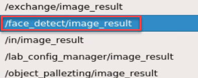

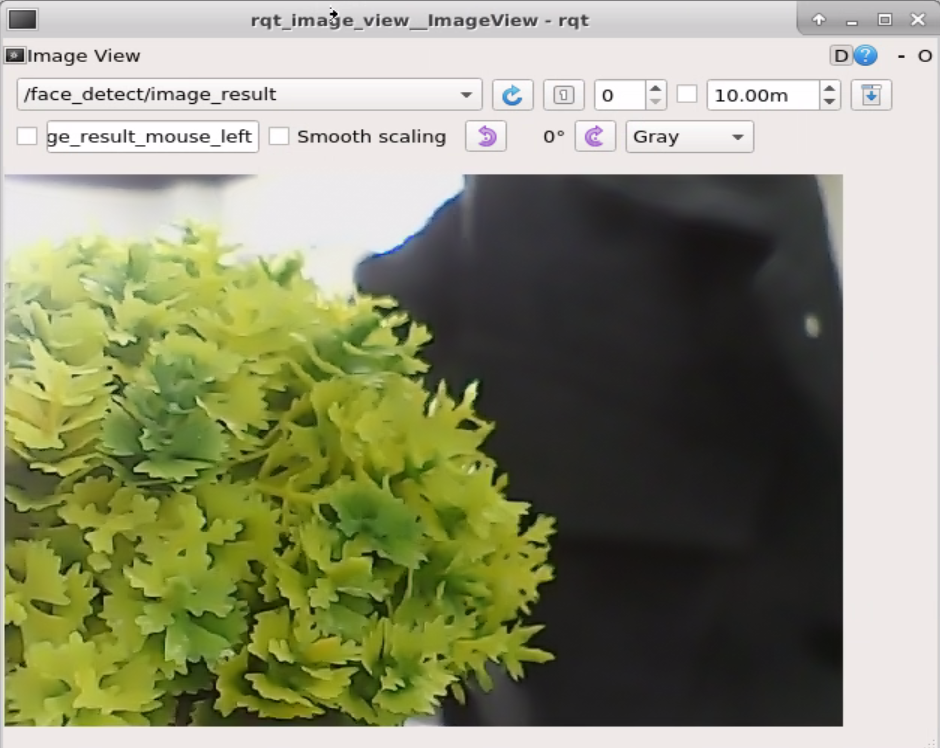

:::{Note}
after camera image is enabled, you must select the topic corresponding to the game or the recognition process can not be displayed normally after game starts.
:::

**14.2.3 Start game** 

Get back to the terminal opened in "[14.2.1 Access to game](#anchor_14_2_1)" and enter command and press Enter. The prompt in box as shown below picture denotes game is started.

```shell
rosservice call /face_detect/set_running "data: true"
```

**14.2.4 Stop and exit game** 

(1) If desire to stop game, please enter command and press Enter. 

```shell
rosservice call /face_detect/set_running "data: false"
```

(2) If desire to stop game, please enter command and press Enter. 

```shell
rosservice call /face_detect/exit "{}"
```

:::{Note}
before game is exited, it will continue to run in the current Raspberry Pi power-on state. To prevent occupying the RAM of Raspberry Pi, please refer to the above steps to close the current program before another program is executed.
:::

For disabling camera image function, please return to the terminal of rqt tool and press "Ctrl+C".

Click terminal iconon the upper-left of the desktop. Note: it is needed to input command in system path, rather than input app service command in the docker container. Input "sudo systemctl restart start_node.service" in the system path and press Enter to start APP service. Wait for a moment until the robotic arm return to the initial posture and the buzzer emits "Di" for one time.

```shell
sudo systemctl restart start_node.service
```

### 14.3 Program Outcome

After game starts, robotic arm will move right and left.When a face is recognized and framed in rqt tool, the gripper will rotate back and forth.

### 14.4 Program Analysis

The source code of the program is located in Docker container: ：**/home/ubuntu/armpi_fpv/src/face_detect/scripts/face.py**

**14.4.1 Import functional libraries**

|                      **Import Module**                       |                         **Function**                         |
| :----------------------------------------------------------: | :----------------------------------------------------------: |
|                          import cv2                          | The OpenCV library is imported for image processing and AIvision-related functions. |
|                         import copy                          |               Used for copying Python objects.               |
|                         import math                          | The math module provides access to underlying mathematical operations, including many commonly used mathematical functions and constants. |
|                         import queue                         | Provide queue data structure, supporting multi-threaded programming. |
|                         import rospy                         | Import the library for the Python interface of ROS for communicationwith ROS. |
|                        import signal                         |                Allow to handle Unix signals.                 |
|                      import  threading                       |    Provide an environment for executing multiple threads.    |
|                          import np                           | Import the NumPy library: an open-source numerical computing extension library for Python, used for array and matrix operations. |
|                 from threading import Timer                  | Import the Timer class from thethreading module, used to call a method after a specified amount of time. |
|              from sensor_msgs.msg import Image               | Import the Image message type from the sensor_msgs package.  |
|  from std_srvs.srv import Trigger, SetBool,SetBoolResponse   | Import the Trigger and SetBool service types from the ROS standard services, as well as the response type for SetBool. |
|               from warehouse.msg import Grasp                |           Import data related to grasping actions.           |
|     from hiwonder_servo_msgs.msg import MultiRawIdPosDur     | Import the MultiRawIdPosDur message type to control multiple servos. |
|  from ros_robot_controller.msg import RGBState, BuzzerState  | Import the message types of RGB light, and buzzer, controlling the status of RGB lights and buzzer. |
|    from armpi_fpv_common import pid,misc,common,apriltag     | Import the PID controller, the misc Handling module, common function module, and the module for handling AprilTag. |
|     from hiwonder_servo_control import bus_servo_control     |              Import the servo control library.               |
| from armpi_fpv_kinematics_controllers import set_pose_target, go_pose_target |      Import the libraries related to robot kinematics.       |

If you want to call a function from a functional library, you can use "library name + function name (parameter, parameter...)" format, such as:

```python
rospy.sleep(0.1)
```

The above command is to call the "sleep" function from the "rospy" library, which is used for delaying execution. In Python, there are some built-in libraries that we can directly import and use, such as 'cv2', 'math', and others.

**14.4.2 Main function analysis**

**(1) Initialize the node**

```python
if __name__ == '__main__':
    rospy.init_node('face_detect', log_level=rospy.INFO)
```

Initialize the node named "face_detect".

**(2) Publish the node topic** 

```python
joints_pub = rospy.Publisher('/servo_controllers/port_id_1/multi_id_pos_dur', MultiRawIdPosDur, queue_size=1)
image_pub = rospy.Publisher('/face_detect/image_result', Image, queue_size=1)  # register result image publisher
```

joints_pub: create and publish the topic '/servo_controllers/port_id_1/multi_id_pos_dur, and a queue length of 1. Start the relevant nodes for the robotic arm.

image_pub: create and publish the topic '/object_tracking/image_result' of type Image and a queue length of 1.

**(3) Enable service** 

```python
enter_srv = rospy.Service('/face_detect/enter', Trigger, enter_func)
exit_srv = rospy.Service('/face_detect/exit', Trigger, exit_func)
running_srv = rospy.Service('/face_detect/set_running', SetBool, set_running)
heartbeat_srv = rospy.Service('/face_detect/heartbeat', SetBool, heartbeat_srv_cb)
```

enter_srv: subscribe to topic '/object_tracking/enter' of type Trigger and associate it with the callback function enter_func.  

exit_srv: subscribe to topic '/object_tracking/exit' of type Trigger and associate it with the callback function exit_func.

runing_srv: subscribe to topic '/object_tracking/set_running' of type SetBool and associate it with the callback function set_running.

hearbeat_srv: subscribe to topic'/object_tracking/hearbeat' of type SetBool and associate it with the callback function heartbeat_srv_cb.

**(4) Test (optional)**

```python
debug = 0
if debug:
    enter_func(1)
    start_running()
```

This part is to enter the debugging mode and will directly start tracking. The specific content is as follow:

After modifying the value of debug as True, you will enter the debugging mode when starting game.

When the internal parameter of the function enter_func is set as 1, the game will start. 

Launch the function start_running  to start face recognition.

**14.4.3 Sub-function Analysis**

**(1) Import model**

```python
mp_face_detection = mp.solutions.face_detection
mp_drawing = mp.solutions.drawing_utils
face_detection = mp_face_detection.FaceDetection(min_detection_confidence=0.8) #阈值
```

Import "mp_face_detection" and "mp_drawing" module. Then create an object "face_detection" of FaceDetection and set minimum detection confidence to 0.8.

**(2) Detect face**

**① Image processing**

Preliminary processing of image by calling the function cv2.cvtColor to convert the image information of RGB format to BGR format. The program is as follow: 

```commandline
image = cv2.cvtColor(image, cv2.COLOR_BGR2RGB)
```

Among the code,

The first parameter "image" denotes the image required to be converted. 

The second parameter "cv2.COLOR_RGB2BGR" is to convert RGB to BGR.

**② Face Detection **

```python
if results.detections:
    for detection in results.detections:
        if detection.label_id == [0]:
            mp_drawing.draw_detection(image, detection)
            data = detection.location_data.relative_bounding_box
            point = _normalized_to_pixel_coordinates(data.xmin, data.ymin, w, h)

            if point is not None:
                x1, y1 = point
                width, height = _normalized_to_pixel_coordinates(data.width, data.height, w, h)
                x, y = (x1 + width / 2, y1 + height / 2)
                cv2.circle(image, (int(x), int(y)), 5, (255, 255, 0), -1)
                if action_finish and abs(x - w/2) < 100:
                    start_greet = True 
```

Using real-time video stream, detect faces, extract face bounding box coordinates and center point position. If the center point is close to the image center, trigger the robotic arm to perform a gesture, achieving physical response interactive function based on real-time face tracking from video stream.

It uses a pre-trained face detection model to detect faces in every frame of a video, calculates the center point position of the face, and controls the robotic arm to perform specific actions based on whether the center point is at the image's center. This creates a closed loop between visual detection and physical response, achieving human-machine interaction.

**③ Robotic Arm Motion**

Use the function **"set_servos"** to set the rotation position and rotation time of servo. The program is as follow:

```python
bus_servo_control.set_servos(joints_pub, 0.3, ((2, 300),))
rospy.sleep(0.3)
```

Take code **"bus_servo_control.set_servos(joints_pub,0.3,[[1,200]])"** as example. The parameter definition within the function parenthesis is as follows:

The first parameter **"joints_pub"** denotes the published topic.

The second parameter **"300"** denotes the rotation time of servo in ms.

In the third parameter **"((2，300)，)"**, the argument "2" denotes the ID number of servo and the argument "300" denotes the rotation position of servo.

## 15. Human Face Tracking

### 15.1 Program Description 

Firstly, initialize and open the camera, and obtain the current image through camera. Then use human face recognition library of convolutional neural networks human face model trained by caffe, put the model under the specific path, and call the model through OpenCV . 

Next, we define a variable used to hold threshold. And calculate the similarity between the currently recognized human face and the facial features of all users in human face recognition library to obtain recognition confidence. When recognition confidence is greater than the threshold, convert the human face coordinate into coordinate without zooming, and frame the human face. 

Lastly, calculate the real-time center coordinate of human face to update PID value. Then through inverse kinematics solving, obtain rotation angle of each servo to control the robotic arm to track human face. 

### 15.2 Start and Close the Game

:::{Note}
The entered command should be case sensitive, and key words can be complemented by "Tab" key.
:::

(1) Power on the robot and use VNC Viewer to connect to the remote desktop.

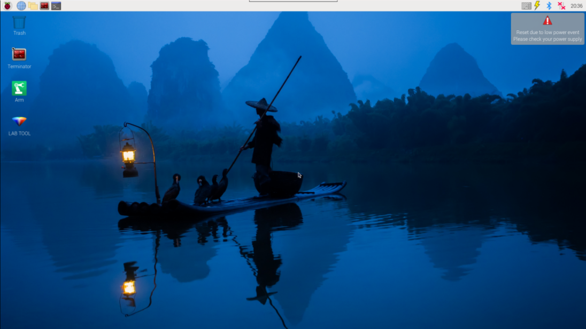

(2) Click the icon  on the upper-left of the desktop, and open Terminator terminal to input command. Then press Enter to close app self-starter service.

```shell
sudo ./.stop_ros.sh
```

(3) Enter command to run game program, and press Enter.

```shell
cd course/vision_course/
```

(4) Enter command to run game program, and press Enter.

```shell
python3 track_by_face.py
```

(5) If want to close this program, press "Ctrl+C". If it fails, please try again.

(6) After experiencing the program, you can activate the mobile app service by using commands or restarting the robot. If the app service is not activated, the app-related functions will be disabled. If the robot restarts, the app service will be automatically enabled.

(7) Click terminal icon  on the upper-left of the desktop. Note: it is needed to input command in system path, rather than input app service command in the docker container. Input "sudo systemctl restart start_node.service" in the system path and press Enter to start APP service. Wait for a moment until the robotic arm return to the initial posture and the buzzer emits "Di" for one time.

```shell
sudo systemctl restart start_node.service
```

### 15.3 Program Outcome

After the program runs, robotic arm will start tracking human face. When human face is recognized by camera, robotic arm will move with human face. At the same time, the recognized human face is circled in transmitted image. 

:::{Note}
human face should move within camera vision and do not move too fast for better game effect.
:::

### 15.4 Program Analysis

The source code of this program lies in the Docker container:**[/home/ubuntu/course/vision_course/track_by_face.py]()**

After the location of human face is obtained, call **setBusServoPulse()** function in board library to control robotic arm to track human face.

**setBusServoPulse()** function is used to drive the servo to rotate to the designated position. Take **Board.setBusServoPulse(3,servo_data['servo3'], 1000)** for example. The meanings of parameter in bracket are as follow.

The first parameter **"3"** is servo ID referring to NO.3 servo. 

The second parameter **"servo_data\['servo3'\]"** is rotation position. 

The third parameter **"1000"** is rotation time in millisecond.

## 16. Gesture Recognition

### 16.1 Program Description 

Firstly, initialize and turn on the camera to obtain the image.
Then, zoom the image, and convert BGR color space into YCrCb, and then segment its color channel to obtain the image of single color channel. Through Gaussian filtering, OTSU binarization, opening operation, corrosion and other operations, the binary image is obtained.
Then use contour retrieving mode of CV_RETR_EXTERNAL to find out all hand contours in binary image. Next, traverse these contours to get the biggest hand contour, and return its value.
Lastly, convex hull detection is performed on the target contour to locate the fingertip. After the location is confirmed, detect the convex defect of the fingertip and obtain its coordinate. According to the number of obtained fingertip coordinate, judge the finger number in the image so as to realize gesture recognition.

### 16.2 Start and Close the Game

:::{Note}
The entered command should be case sensitive, and key words can be complemented by "Tab" key.
:::

(1) Power on the robot and use VNC Viewer to connect to the remote desktop.


(2) Click the icon  on the upper-left of the desktop, and open Terminator terminal to input command. Then press Enter to close app self-starter service.

```shell
sudo ./.stop_ros.s
```

(3) Enter command to run game program, and press Enter.

```shell
cd course/vision_course/
```

(4) Enter command to run game program, and press Enter.

```shell
python3 gesture_recognition.py
```

(5) If want to close this program, press "Ctrl+C". If it fails, please try again.

(6) After experiencing the program, you can activate the mobile app service by using commands or restarting the robot. If the app service is not activated, the app-related functions will be disabled. If the robot restarts, the app service will be automatically enabled.

(7) Click terminal icon on the upper-left of the desktop. Note: it is needed to input command in system path, rather than input app service command in the docker container. Input "sudo systemctl restart start_node.service" in the system path and press Enter to start APP service. Wait for a moment until the robotic arm return to the initial posture and the buzzer emits "Di" for one time.

```shell
sudo systemctl restart start_node.service
```

### 16.3 Program Outcome

After the program runs, put your finger within the camera vision. If the camera recognizes the finger successfully, the number of finger will be displayed in transmitted image. And fingertip will be marked with white line.

### 16.4 Program Analysis

The source code of this program lies in **/home/ubuntu/course/vision_course/gesture_recognition.py**

convexHull(), convexityDefects() and findContours() function in cv2 library are mainly used in gesture recognition. 

convexHull() function is used to obtain convex defect. Take **"hull = cv2.convexHull(contours, returnPoints=False)"** code for example. The meanings of parameters in bracket are as follow. 

The first parameter **"contours"** is entered contour.

The second parameter **"returnPoints=False"** is returned data of selection function. "True" represents return x, y coordinate of convex angular point, and "False" represents return index of convex corner point in the contour.  

convexityDefects() function is used to obtain convex defect information between convex hull and contour, including the contour point index of the starting point and the end point, the contour point index of the defect that is farthest from the convex hull edge of the defect, and the distance of the farthest point from the convex hull edge.

Take **"defects = cv2.convexityDefects(contours, hull)"** code for example. The first parameter "contours" is entered contour. The second parameter "hull" is the index of the convex hull corner point in the original contour point set.

**findContours()** function is used to find the target contour in the image. The first parameter in the bracket is entered image. The second parameter is contour retrieving mode. The third parameter is approximate method of contour. 

## 17. Gesture-Guided Goods Stacking

### 17.1 Program Description 

First, determine a coordinate point for grasping and placing the blocks. Calculate the rotational angles of each servo based on inverse kinematics.
Next, initialize and activate the camera, scale the captured image, convert the color space from BGR to YCrCb, and perform color channel separation to obtain a single-channel color image. Then, apply Gaussian filtering, OTSU thresholding, opening operation, erosion, and other operations to obtain a binary image.

Then, use the contour retrieval mode CV_RETR_EXTERNAL to find all hand contours in the binary image. By iterating and comparing, identify the largest hand contour and return its value.

Finally, perform convex hull detection on the target contour to locate the fingertips. After determining the positions, further detect the convex defects in the fingertip area and obtain their coordinate values. Based on the number of obtained fingertip coordinates, determine the number of fingers in the image and control the robotic arm to perform the corresponding number of grasping and placing actions, thereby achieving the stacking effect of the blocks.

### 17.2 Start and Close the Game

:::{Note}
The entered command should be case sensitive and "Tab" key can be used to complement the keywords.
:::

(1) Power on the robot and use VNC Viewer to connect to the remote desktop.


(2) Click the icon  on the upper-left of the desktop, and open Terminator terminal.


(3) Enter command to run game program, and press Enter.

```shell
sudo ./.stop_ros.sh
```

(4) Enter command to run game program, and press Enter.

```shell
cd /home/ubuntu/course/vision_course/
```

(5) Enter command to run game program, and press Enter.

```shell
python3 control_by_gesture.py
```

If you want to close the program, please press "Ctrl+C".

(6) Click terminal icon  on the upper-left of the desktop. Note: it is needed to input command in system path, rather than input app service command in the docker container. Input "sudo systemctl restart start_node.service" in the system path and press Enter to start APP service. Wait for a moment until the robotic arm return to the initial posture and the buzzer emits "Di" for one time.

```shell
sudo systemctl restart start_node.service
```

### 17.3 Program Outcome

After game starts, ArmPi FPV will switch to the gesture recognition mode. Place your fingers within the field of camera's view. If the recognition is successful, the number of fingers detected will be printed on the frame and the fingertips will be marked with yellow solid points. Also, ArmPi FPV will grasp and stack the corresponding numbers of blocks. 

### 17.4 Program Analysis

The source code of the program is stored in Docker container: ：**[/home/ubuntu/course/vision_course/control_by_gesture.py]()**

**17.4.1  Import functional libraries**

|                      **Import Module**                       |                         **Function**                         |
| :----------------------------------------------------------: | :----------------------------------------------------------: |
|                          import cv2                          | The OpenCV library is imported for image processing and AIvision-related functions. |
|                         import copy                          |               Used for copying Python objects.               |
|                         import math                          | The math module provides access to underlying mathematical operations, including many commonly used mathematical functions and constants. |
|                         import queue                         | Provide queue data structure, supporting multi-threaded programming. |
|                         import rospy                         | Import the library for the Python interface of ROS for communicationwith ROS. |
|                        import signal                         |                Allow to handle Unix signals.                 |
|                      import  threading                       |    Provide an environment for executing multiple threads.    |
|                          import np                           | Import the NumPy library: an open-source numerical computing extension library for Python, used for array and matrix operations. |
|                 from threading import Timer                  | Import the Timer class from thethreading module, used to call a method after a specified amount of time. |
|              from sensor_msgs.msg import Image               | Import the Image message type from the sensor_msgs package.  |
|  from std_srvs.srv import Trigger, SetBool,SetBoolResponse   | Import the Trigger and SetBool service types from the ROS standard services, as well as the response type for SetBool. |
|               from warehouse.msg import Grasp                |           Import data related to grasping actions.           |
|     from hiwonder_servo_msgs.msg import MultiRawIdPosDur     | Import the MultiRawIdPosDur message type to control multiple servos. |
|  from ros_robot_controller.msg import RGBState, BuzzerState  | Import the message types of RGB light, and buzzer, controlling the status of RGB lights and buzzer. |
|    from armpi_fpv_common import pid,misc,common,apriltag     | Import the PID controller, the misc Handling module, common function module, and the module for handling AprilTag. |
|     from hiwonder_servo_control import bus_servo_control     |              Import the servo control library.               |
| from armpi_fpv_kinematics_controllers import set_pose_target, go_pose_target |      Import the libraries related to robot kinematics.       |

If you want to call a function from a functional library, you can use "library name + function name (parameter, parameter...)" format, such as:

```python
rospy.sleep(0.1)
```

The above command is to call the "sleep" function from the "rospy" library, which is used for delaying execution. In Python, there are some built-in libraries that we can directly import and use, such as 'cv2', 'math', and others.

**17.4.2 Initialize Recognition Parameters**

```python
board = Board()
controller = KinematicsController(board)
board.bus_servo_set_position(0.5, [[1, 200]])
controller.go_pose_target([0.1, 0, 0.18], 0, [-90, 90], 0, 1)
time.sleep(1)
```

**17.4.3 Main function analysis**

**(1) nitialization and obtain camera image** 

```python
self.cap = cv2.VideoCapture(-1)
threading.Thread(target=self.action_thread, daemon=True).start()
```

Use the variable cap to initialize the VideoCaputure function in cv2 library and set its internal parameter as -1 for reading the camera image.

**17.4.4 Read the screen and display window**

```python
self.last_geture = gesture
self.fps.update()
result_image = self.fps.show_fps(result_image)
result_image = cv2.cvtColor(result_image, cv2.COLOR_RGB2BGR)
cv2.imshow('hand_gesture', cv2.resize(result_image, (640, 480)))
key = cv2.waitKey(1)
if key == 27:
    break
except Exception as e:
    print(e)
```

**17.4.5 Sub-function Analysis**

**(1) Gesture recognition function**

```python
def action_thread(self):
    while True:
        if not self.action_finish and self.gesture in ['one', 'two', 'three', 'four', 'five']:
            board.set_buzzer(1900, 0.1, 0.9, 1)# 设置蜂鸣器响0.1秒
            board.bus_servo_set_position(0.8, [[1, 200]])
            time.sleep(1)
            if self.gesture == 'one':
                action(1)
            elif self.gesture == 'two':
                action(2)
            elif self.gesture == 'three':
                action(3)
            elif self.gesture == 'four':
                action(4)
            elif self.gesture == 'five':
                action(5)
                self.action_finish = True
                self.gesture = 'none'
            else:
                time.sleep(0.01)
```

First, call "action()" function to determine the obtained results of gesture recognition. Based on the recognized different gesture results, input different parameters to complete gesture recognition control.

**(2) Image process function**

```python
def image_proc(self):
    while True:
        ret, image = self.cap.read()
        if ret:
            image_flip = cv2.cvtColor(cv2.flip(image, 1), cv2.COLOR_BGR2RGB)
            result_image = image_flip.copy()
            try:
                gesture = "none"
                results = self.hand_detector.process(image_flip)
                if results is not None and results.multi_hand_landmarks:
                    gesture = "none"
                    index_finger_tip = [0, 0]
                    for hand_landmarks in results.multi_hand_landmarks:
                        self.drawing.draw_landmarks(
                            result_image,
                            hand_landmarks,
                            mp.solutions.hands.HAND_CONNECTIONS)
                        landmarks = get_hand_landmarks(image_flip, hand_landmarks.landmark)
                        angle_list = (hand_angle(landmarks))
                        gesture = (h_gesture(angle_list))
                        cv2.putText(result_image, gesture, (10, image.shape[0] - 10), cv2.FONT_HERSHEY_SIMPLEX, 1, (255, 255, 0), 2)
                        if gesture == self.last_geture and gesture != 'none' and self.action_finish:
                            self.count += 1
                            if self.count >= 3:
                                self.action_finish = False
                                self.gesture = gesture
                                self.count = 0

                                self.last_geture = gesture
                                self.fps.update()
                                result_image = self.fps.show_fps(result_image)
                                result_image = cv2.cvtColor(result_image, cv2.COLOR_RGB2BGR)
                                cv2.imshow('hand_gesture', cv2.resize(result_image, (640, 480)))
                                key = cv2.waitKey(1)
                                if key == 27:
                                    break
                                except Exception as e:
                                    print(e)
```

**(3) Scaling**

The image is scaled using the resize() function from the cv2 library to reduce computational complexity.

```python
cv2.imshow('hand_gesture', cv2.resize(result_image, (640, 480)))
```

The first parameter "result_image" in parentheses is the input image. The second parameter "(640,480)" represents the width and height of the image after scaling. 

**(4) Convert to RGB**

The cvtColor() function from the cv2 library is used to perform image conversion, specifically converting the image to the RGB color space.

```python
image_flip = cv2.cvtColor(cv2.flip(image, 1), cv2.COLOR_BGR2RGB)
```

**(5) Fingertips recognition function**

```python
thr_angle = 65.
thr_angle_thumb = 53.
thr_angle_s = 49.
gesture_str = "none"
if (angle_list[0] > thr_angle_thumb) and (angle_list[1] > thr_angle) and (angle_list[2] > thr_angle) and (
    angle_list[3] > thr_angle) and (angle_list[4] > thr_angle):
    gesture_str = "fist"
elif (angle_list[0] < thr_angle_s) and (angle_list[1] < thr_angle_s) and (angle_list[2] > thr_angle) and (
    angle_list[3] > thr_angle) and (angle_list[4] > thr_angle):
    gesture_str = "hand_heart"
elif (angle_list[0] < thr_angle_s) and (angle_list[1] < thr_angle_s) and (angle_list[2] > thr_angle) and (
    angle_list[3] > thr_angle) and (angle_list[4] < thr_angle_s):
    gesture_str = "nico-nico-ni"
elif (angle_list[0] < thr_angle_s) and (angle_list[1] > thr_angle) and (angle_list[2] > thr_angle) and (
    angle_list[3] > thr_angle) and (angle_list[4] > thr_angle):
    gesture_str = "hand_heart"
elif (angle_list[0] > 5) and (angle_list[1] < thr_angle_s) and (angle_list[2] > thr_angle) and (
    angle_list[3] > thr_angle) and (angle_list[4] > thr_angle):
    gesture_str = "one"
elif (angle_list[0] > thr_angle_thumb) and (angle_list[1] < thr_angle_s) and (angle_list[2] < thr_angle_s) and (
    angle_list[3] > thr_angle) and (angle_list[4] > thr_angle):
    gesture_str = "two"
elif (angle_list[0] > thr_angle_thumb) and (angle_list[1] < thr_angle_s) and (angle_list[2] < thr_angle_s) and (
    angle_list[3] < thr_angle_s) and (angle_list[4] > thr_angle):
    gesture_str = "three"
elif (angle_list[0] > thr_angle_thumb) and (angle_list[1] > thr_angle) and (angle_list[2] < thr_angle_s) and (
    angle_list[3] < thr_angle_s) and (angle_list[4] < thr_angle_s):
    gesture_str = "OK"
elif (angle_list[0] > thr_angle_thumb) and (angle_list[1] < thr_angle_s) and (angle_list[2] < thr_angle_s) and (
    angle_list[3] < thr_angle_s) and (angle_list[4] < thr_angle_s):
    gesture_str = "four"
elif (angle_list[0] < thr_angle_s) and (angle_list[1] < thr_angle_s) and (angle_list[2] < thr_angle_s) and (
    angle_list[3] < thr_angle_s) and (angle_list[4] < thr_angle_s):
    gesture_str = "five"
elif (angle_list[0] < thr_angle_s) and (angle_list[1] > thr_angle) and (angle_list[2] > thr_angle) and (
    angle_list[3] > thr_angle) and (angle_list[4] < thr_angle_s):
    gesture_str = "six"
else:
    "none"
    return gesture_str
```

**(6) Stacking blocks**

Stack the block based on the recognition result.

```python
def action_thread(self):
    while True:
        if not self.action_finish and self.gesture in ['one', 'two', 'three', 'four', 'five']:
            board.set_buzzer(1900, 0.1, 0.9, 1)# 设置蜂鸣器响0.1秒
            board.bus_servo_set_position(0.8, [[1, 200]])
            time.sleep(1)
            if self.gesture == 'one':
                action(1)
            elif self.gesture == 'two':
                action(2)
            elif self.gesture == 'three':
                action(3)
            elif self.gesture == 'four':
                action(4)
            elif self.gesture == 'five':
                action(5)
                self.action_finish = True
                self.gesture = 'none'
            else:
                time.sleep(0.01)
```

The "action_thread()" function passes different result parameters into the "action()" function based on the recognition results. When one finger is identified, the "controller.go_pose_target()" function is called to make robotic arm move. For example, the code "controller.go_pose_target(\[0, 0.1, 0.18\], 0, [-90, 90], 0, 1.5)":
The first parameter "\[0, 0.1, 0.18\]" represents the three-dimensional end coordinate (X, Y, Z) with the robotic arm as the origin. 
The second parameter "0" is the pitch angle for the robotic arm to move to the end coordinate. 
The third parameter "\[-90, 90\]" and the fourth parameter "0" define the range of the pitch angle. If the robotic arm cannot reach the specified pitch angle, it will automatically find the closest solution. 
The fourth parameter "1.5" is the servo rotation time in seconds.

```python
def action(times=1):
    for i in range(times):
        controller.go_pose_target([0, 0.1, 0.18], 0, [-90, 90], 0, 1.5)
        time.sleep(1.5)
        controller.go_pose_target([0, 0.12, 0.01], 90, [-90, 90], 0, 1.5)
        time.sleep(1.5)
        board.bus_servo_set_position(0.8, [[1, 500]])
        time.sleep(1)
        controller.go_pose_target([0, 0.1, 0.18], 0, [-90, 90], 0, 1.5)
        time.sleep(1.5)
        controller.go_pose_target([0.1, 0, 0.18], 0, [-90, 90], 0, 1.5)
        time.sleep(1.5)
        controller.go_pose_target([0.12, 0, 0.012 + i*0.03], 90, [-90, 90], 0, 1.5)
        time.sleep(1.5)
        board.bus_servo_set_position(0.8, [[1, 200]])
        time.sleep(1)
        controller.go_pose_target([0.1, 0, 0.18], 0, [-90, 90], 0, 1.5)
        time.sleep(1.5)
```

## 18. Shape Recognition

### 18.1 Program Description 

Please check the implementation process of shape recognition.

Firstly, fetch the camera image
Process the real-time image of the camera through OpenCV.

Secondly, perform image binaryzation
OpenCV represents all pixels in the image as 0 and 1, and displays pixels with a value of 0 in black, and pixels with a value of 1 in white.

Thirdly, corrode and dilate
Corrosion aims at removing burr at the edge of image. Dilation will dilate the image edge to fill the non-target pixel at the edge of and inside target object.

Fourthly, locate the contour
By dividing black and white zone to locate the contour of the target object.

Fifthly, place shapes picture
Place the shapes picture into the bottom of the camera. Frame the recognized picture in Frame tool, and display it in the terminal.

### 18.2 Start and Close the Game

(1) Power on the robot and use VNC Viewer to connect to the remote desktop.


(2) Click the icon ，打开Terminator终端，输入指令按下回车，关闭手机APP自启服务。

```shell
sudo ./.stop_ros.sh
```

(3) Enter command to run game program, and press Enter.

```shell
cd course/vision_course/
```

(4) Enter command to run game program, and press Enter.

```shell
python3 shape_recognition.py
```

(5) If want to close this program, press "Ctrl+C". If it fails, please try again.

After experiencing the program, you can activate the mobile app service by using commands or restarting the robot. If the app service is not activated, the app-related functions will be disabled. If the robot restarts, the app service will be automatically enabled.

Click terminal iconon the upper-left of the desktop. Note: it is needed to input command in system path, rather than input app service command in the docker container. Input "sudo systemctl restart start_node.service" in the system path and press Enter to start APP service. Wait for a moment until the robotic arm return to the initial posture and the buzzer emits "Di" for one time.

```shell
sudo systemctl restart start_node.service
```

### 18.3 Program Outcome

After program runs, the robotic arm will recognize the pattern within vision. When the corresponding patterns are recognized, object edge will be framed and the shape name will be printed in the terminal.

### 18.4 Program Analysis

The source code of this program lies in **[/home/ubuntu/course/vision_course/shape_recognition.py]()**

**approxPolyDP()** and **morphologyEx()** function in cv2 library are mainly used in shape recognition. 

approxPolyDP() function is used to polyline a continuous smooth curve. Take "**approx = cv2.approxPolyDP(areaMaxContour_max, epsilon, True)"** code for example. The meanings of the parameters in bracket are as follow.

The first parameter **"areaMaxContour_max"** is entered shape contour.

The second parameter **"epsilon"** is distance representing the extent to which the outline of a polygon is close to the actual outline.

The third parameter **"True"** represents that the contour is closed curve. 
The morphologyEx() function is used for morphologic transformations. Take **"closed = cv2.morphologyEx(opened,cv2.MORPH_CLOSE, np.ones((6,6),np.uint8))"** code for example. The meanings of the parameters in bracket are as follow. 
The first parameter **"opened"** is entered image.
The second parameter **"cv2.MORPH_CLOSE"** adopts morphologic method, where the close operation is used.
The third parameter **"np.ones((6,6),np.uint8)"** is internal of morphological operation, which refers to 3 x 3 square structure. 

## 19. Bar Code Recognition

### 19.1 Program Description 

pyzbar function package is mainly used in bar code recognition. Please check the below implementation process. 

**Step 1, obtain and process the image**
Firstly, initialize the camera. After the image is obtained, copy, remap, display and convert the image in BGR format into gray-scale image.

**Step 2: decode and obtain position**
Next, decode the bar code, extract the boundary position of the bar code, draw the frame, print the number and type of bar code.

### 19.2 Start and Close the Game

:::{Note}
The entered command should be case sensitive, and key words can be complemented by "Tab" key.
:::

(1) Power on the robot and use VNC Viewer to connect to the remote desktop.


(2) Click the icon  on the upper-left of the desktop, and open Terminator terminal to input command. Then press Enter to close app self-starter service.

```shell
sudo ./.stop_ros.sh
```

(3) Enter command to run game program, and press Enter.

```shell
cd course/vision_course/
```

(4) Enter command to run game program, and press Enter.

```shell
python3 barcode_recognition.py
```

(5) If want to close this program, press "Ctrl+C". If it fails, please try again.

After experiencing the program, you can activate the mobile app service by using commands or restarting the robot. If the app service is not activated, the app-related functions will be disabled. If the robot restarts, the app service will be automatically enabled.

Click terminal iconon the upper-left of the desktop. Note: it is needed to input command in system path, rather than input app service command in the docker container. Input command in the system path and press Enter to start APP service. Wait for a moment until the robotic arm return to the initial posture and the buzzer emits "Di" for one time.

```shell
sudo systemctl restart start_node.service
```

### 19.3 Program Outcome

When the program runs, robotic arm will return to original posture. Place the barcode of the object within the camera vision. When the barcode is recognized, the barcode will be framed in red, and its corresponding number and type of barcode will be print.

### 19.4 Program Analysis

The source code of this program lies in  **[/home/ubuntu/course/vision_course/barcode_recognition.py]()**

decode() function in pyzbar library and rectangle() function in cv2 library are mainly used in barcode recognition.

decode() function is used to parse the image information. Take "barcodes = pyzbar.decode(image)" for example. "image" is the data of input image.
rectangle() function is used to draw the frame of barcode. Take "cv2.rectangle(image, (x, y), (x + w, y + h), (0, 0, 255), 2)" for example. Meanings of parameters in bracket are as follow.

The first parameter **"image"** represents the drawn rectangle image.

The second parameter **"(x,y)"** represents the start coordinate of rectangle.

The third parameter **"(x + w, y + h)"** represents the end coordinate of rectangle.

The fourth parameter **"(0, 0, 255)"** represents the color of rectangle frame line. Its order is B, G and R, and the value here represents red. 

The fifth parameter **"2"** is width of rectangle frame line in pixel. **"-1"** represents use designated color to fill the rectangle.
