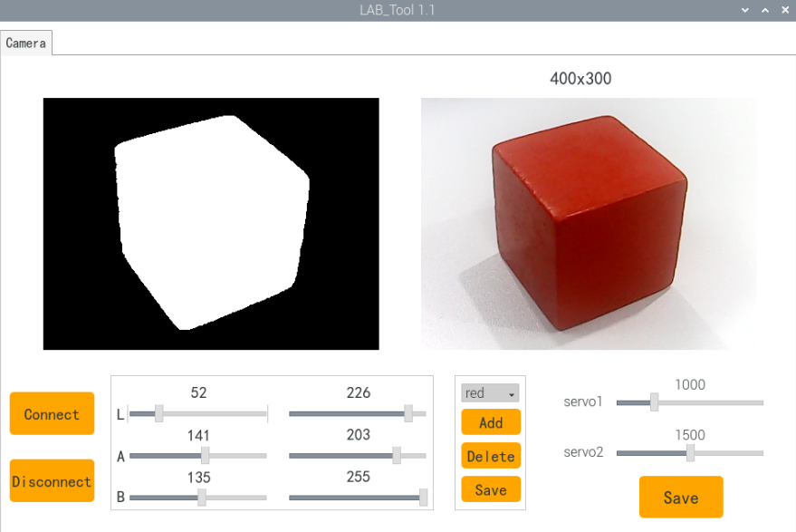
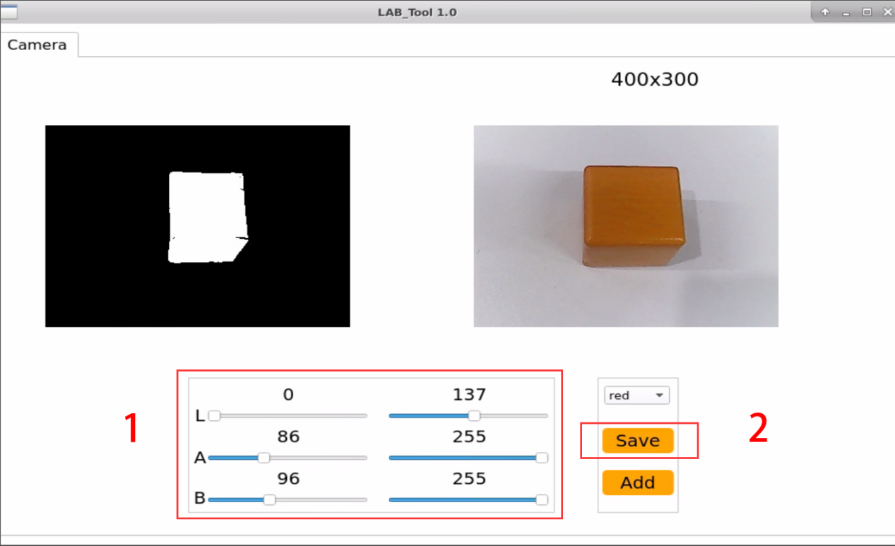
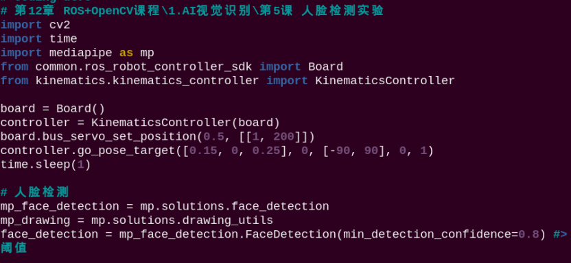
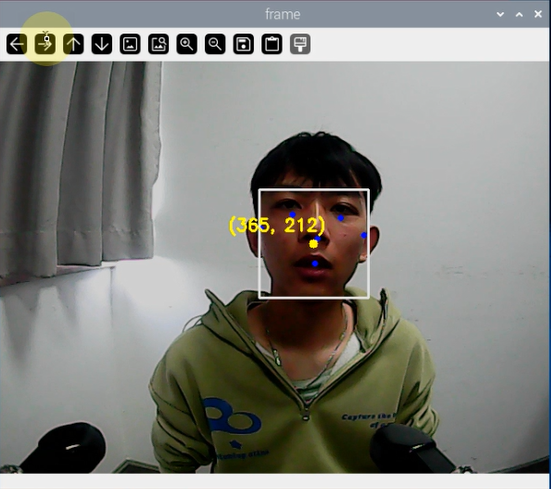
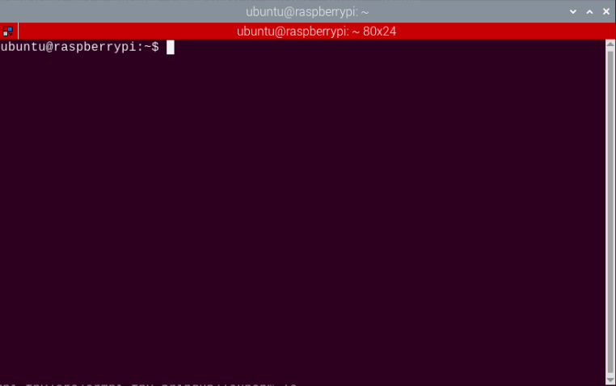
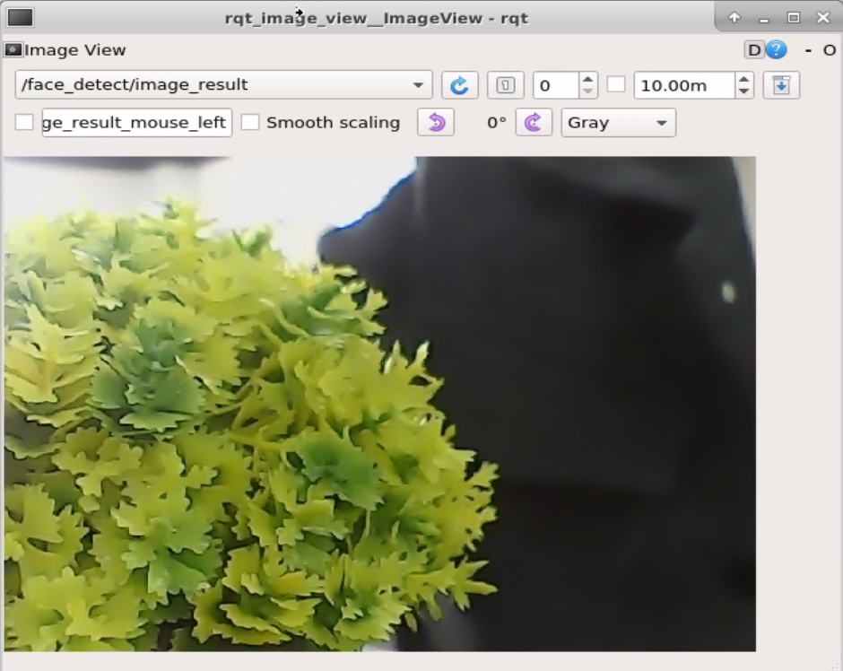
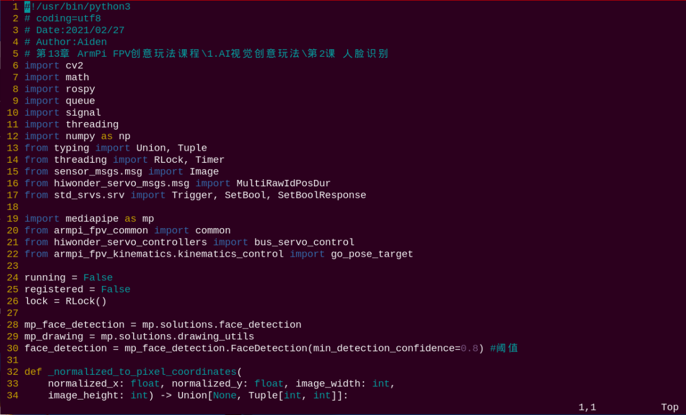

# ROS+OpenCV课程

## 1.1 颜色阈值调节实验

我们都知道不同光源下会对物体颜色造成不同的影响，因此在进行颜色相关的功能时，会存在识别上的差异。如果这种差异影响到功能的实现，需要进行差异消除。

针对以上这个问题的解决，本节我们来学习这款LAB_Tool工具。

### 1.1 启动LAB_Tool

1)  打开NoMachine软件，在主界面上找到"**LAB_Tool**"，双击打开。

2)  此时将出现"**执行文件**"对话框，点击"**执行**"即可。


3)  进入软件后，我们可以看到LAB_Tool的界面，如下图所示：


:::{Note}
若在弹出的界面中没有出现回传画面，说明摄像头未连接成功，需检查一下摄像头连接线是否连接好。
:::

### 1.2 LAB_Tool的界面分布及说明

LAB_Tool软件的界面分为画面显示区和识别调节区两个部分。

| **区域名称** | **区域分布** |
|:--:|:--:|
| 画面显示区 |  |
| 识别调节区 |  |

- **画面显示区**

| **图标** | **功能说明** |
|:--:|:--:|
|  | 左侧为处理后的画面，右侧为原始画面。 |

- **识别调节区**

在识别调节区，可调节颜色属性。各部分对应功能见下表：

| **图标** | **功能说明** |
|:--:|:--:|
|  | 用于调节画面L分量的数值。（A、B滑杆功能与此类似，皆为调节画面对应分量的数值。） |
|  | 选择需要调节的识别颜色。 |
|  | 用于保存调节的效果数值。 |
|  | 用于增加识别的颜色种类。 |

### 1.3 调节默认颜色效果

我们这里以调节红色为例，其它颜色亦可参考，具体调节步骤如下：

1)  启动系统桌面的LAB_Tool，连接摄像头后，在识别调节区的颜色选择栏中选择"**red**"。


2)  将摄像头对准需要进行效果调节的颜色物体，拖动识别调节区的L、A、B分量滑杆进行阈值调节，直至画面显示区左侧的颜色物体区域变为白色，其它区域变为黑色。



LAB阈值调节参数表：

| **颜色分量** | **颜色分量数值** | **对应颜色区间** |
|:------------:|:----------------:|:----------------:|
|      L       |      0~255       | 黑-白（-L ~ +L） |
|      A       |      0~255       | 绿-红（-a ~ +a） |
|      B       |      0~255       | 蓝-黄（-b ~ +b） |

调节颜色阈值时，需要将L、A、B的参数数值向需要识别的颜色区间进行调整。此处以红色为例，调节步骤如下：

1.  将L、A、B三个颜色分量的数值范围都调整为0~255，即调节区左侧参数都为0，右侧参数都为255；

2.  所有的红色都处于"+a"附近，所以保持A分量右侧参数不变，增大左侧参数，直至画面显示区左侧的颜色物体区域变为白色，其它区域变为黑色；

3.  根据所处环境修改L、B分量的数值。若红色偏浅，则增大L分量左侧参数；偏深，则减小L分量右侧参数；若红色偏暖，则增加B分量左侧参数；偏冷，则减小B分量右侧参数。

4. 最后点击识别调节区的"Save"按键，将调节后的参数数值保存。


### 1.4 增加新的识别颜色

除了内置的三种识别颜色，我们还可以增设其它可识别的颜色。增设的方法有两种：

- 直接将默认颜色选项的LAB数值调整为实际颜色的LAB数值；

- 使用"**Add**"按键，增加新的颜色选项。

本着最易操作，最快速达到效果的原则，本节课仅介绍第一种方法。

**下面我们以橙色为例进行设置，具体步骤如下：**

1)  启动系统桌面的LAB_Tool，连接摄像头后，在识别调节区的颜色选择栏中选择"**red**"。


2)  将摄像头对准需要识别的橙色物体，拖动L、A、B分量滑杆调整阈值，直到画面显示区左侧画面中的橙色物体所在区域变为白色，其他区域变成黑色。


3)  点击识别调节区的"**Save**"按键，将修改后的L、A、B参数数值保存。


## 2. 颜色识别实验

### 2.1 实现流程

下面看一下本节课整体实现的流程：

**第一步，调取摄像头的图像：**

通过OpenCV处理摄像头的实时图像。

**第二步，图像的二值化：**

OpenCV将图像中的所有像素以0和1来表示，将值为0的像素点用黑色显示，值为1的用白色显示。

**第三步，腐蚀和膨胀：**

腐蚀处理的目的是去除图像边缘的毛刺。膨胀处理会将图像的边缘扩大，用以填充目标物体边缘或内部的非目标像素点。

**第四步，找出轮廓的位置：**

通过对黑、白区域进行分界来找出目标物体的轮廓位置。

**第五步，将识别到的颜色物体框出：**

将识别到的颜色物体（红绿蓝三种）转换为未缩放前的坐标，进而判断是否为最大的颜色物体。

### 2.2 玩法开启及关闭

:::{Note}
指令的输入需严格区分大小写，另外可按键盘"**Tab**"键进行关键词补齐。
:::

1. 将设备开机，并参照课程资料的"**[远程工具安装及容器进入方法\1. 远程工具安装与连接]()**"内容，通过VNC远程连接工具连接。


2. 点击系统桌面左上角的图标，打开Terminator终端，输入指令按下回车，关闭手机APP自启服务。


```commandline
sudo ./.stop_ros.sh
```

3. 输入进入玩法程序所在目录的指令，按下回车键。

```commandline
cd course/vision_course/
```

4. 输入运行玩法程序的指令，按下回车键。

```commandline
python3 color_recognition.py
```

5. 如需关闭此程序，可按下"**Ctrl+C**"，若关闭失败，可多次按下。

玩法体验完毕后，可通过指令或重启机器人来开启手机APP服务。如未开启手机APP服务，则APP相关功能会失效。（若机器人重启，手机APP服务将会自动开启）

点击桌面左上角终端图标（**注意：需要在系统路径下输入指令，而不是在docker容器中输入开启APP服务的指令**），在系统路径下输入指令，按下回车，启动APP服务，等待机械臂恢复至初始姿态，蜂鸣器"滴"一声即可。

```commandline
sudo systemctl restart start_node.service
```

### 2.3 实现效果

:::{Note}
请在纯色背景下操作，且手持色块移动时不宜过快。
:::

程序运行后，机械臂会对视觉范围内的物体进行颜色识别。当识别到红、绿、蓝三种颜色的物体时，回传画面会框选该物体。


### 2.4 程序简要分析

该程序的源代码位于Docker容器中的: **/home/ubuntu/course/vision_course/color_recognition.py**


颜色识别实验主要用到cv2库中的inRange()、findContours()和morphologyEx()函数，以及Board库中的setPixelColor()函数。其中：

inRange()函数用于对输入图像进行二值化处理。括号内的第一个参数是输入图像。第二个、第三个参数分别是阈值的下限和上限。当像素点RGB的颜色数值处于上、下限之间时，该像素点被赋值为1，否则为0。

findContours()函数用于查找图像中的目标轮廓。括号内的第一个参数是输入图像。第二个参数是轮廓的检索模式，第三个参数是轮廓的近似方法。

morphologyEx()函数用于进行形态学的变换。该函数的第一个参数为输入的图像数据，第二个参数为进行变化的方式，第三个参数表示方框的大小。

set_rgb(color)函数用于控制扩展板上的RGB彩灯。以代码"b**oard.set_rgb(\[\[1, 255, 0, 0\],\[2, 255, 0, 0\])**"为例，括号内的参数含义如下：

第一个参数"**0**"是RGB灯序号，"**0**"代表RGB1，而"**1**"则代表RGB2；

第二个参数"\[**255, 0, 0\]**"是RGB的颜色通道参数，"**255**"、"**0**"、"**0**"分别代表R、G、B通道的数值，此处为红色。

## 3. 色块定位实验

### 3.1 实现流程

首先，色块在确定位置之前，需先进行颜色识别。我们使用Lab颜色空间来进行处理。先将RGB颜色空间转换为Lab，再进行二值化处理、开运算、闭运算等操作，获得只包含目标颜色的轮廓，即可实现物体颜色的识别。

接着，遍历所有找到的目标颜色轮廓，通过逐一比较，找到最大轮廓面积。然后获取目标轮廓的四个角点坐标，并计算出中心点坐标。

最后，将目标轮廓用红框框出，显示轮廓的中心坐标，并控制扩展板的LED灯亮起目标颜色。

### 3.2 玩法开启及关闭

:::{Note}
指令的输入需严格区分大小写，另外可按键盘"**Tab**"键进行关键词补齐。
:::

1. 将设备开机，并参照课程资料的"**[远程工具安装及容器进入方法\1. 远程工具安装与连接]()**"内容，通过VNC远程连接工具连接。


2. 点击系统桌面左上角的图标，打开Terminator终端，输入指令按下回车，关闭手机APP自启服务。

```commandline
sudo ./.stop_ros.sh
```

3. 输入进入玩法程序所在目录的指令，按下回车键。

```commandline
cd course/vision_course/
```

4. 输入运行玩法程序的指令，按下回车键。

```commandline
python3 get_color_position.py
```

5. 如需关闭此程序，可按下"**Ctrl+C**"，若关闭失败，可多次按下。

玩法体验完毕后，可通过指令或重启机器人来开启手机APP服务。如未开启手机APP服务，则APP相关功能会失效。（若机器人重启，手机APP服务将会自动开启）

点击桌面左上角终端图标（**注意：需要在系统路径下输入指令，而不是在docker容器中输入开启APP服务的指令**），在系统路径下输入按下回车，启动APP服务，等待机械臂恢复至初始姿态，蜂鸣器"滴"一声即可。

```commandline
sudo systemctl restart start_node.service
```

### 3.3 实现效果

程序运行后，机械臂运动，使摄像头正对正前方。在回传画面内可以看到当红色色块被识别到后，会将红色色块框出，并显示色块中心点的x、y坐标，在回传画面左下角显示识别到的颜色。


### 3.4 程序简要分析

该程序的源代码位于Docker容器中的： /home/ubuntu/course/vision_course/get_color_position.py


在获得最大轮廓面积后，通过调用cv2库内的minAreaRect()函数，可以得到其最小外接矩形，括号内是存放了点坐标的点集数组或向量。

通过调用boxPoints()函数，可以获取目标矩形的四个顶点坐标。以"**box = np.int0(cv2.boxPoints(rect))**"为例，此处得到了目标轮廓最小外接矩形的四个顶点坐标，后续可以在此基础上，通过计算求得该矩形的中心坐标。

## 4. 色块追踪实验

### 4.1 实现流程

首先，在色块进行定位之前，该功能需要先进行颜色识别。我们使用Lab颜色空间来进行处理。先将RGB颜色空间转换为Lab，然后进行二值化处理、开运算、闭运算等操作，获得只包含目标颜色的轮廓，便可实现物体颜色的识别。

接着，遍历所有找到的目标颜色轮廓，通过逐一比较，找到最大轮廓和最大轮廓面积，再使用OpenCV内置函数获取目标轮廓的最小外接圆实时圆心坐标。

最后，我们根据圆心坐标来计算更新PID值，再经过逆运动学求解获得各个舵机的转动角度从而控制机械臂完成追踪。

### 4.2 玩法开启及关闭

:::{Note}
指令的输入需严格区分大小写，另外可按键盘"**Tab**"键进行关键词补齐。
:::

1. 将设备开机，并参照课程资料的"**[远程工具安装及容器进入方法\1. 远程工具安装与连接]()**"内容，通过VNC远程连接工具连接。


2. 点击系统桌面左上角的图标，打开Terminator终端，输入指令按下回车，关闭手机APP自启服务。

```commandline
sudo ./.stop_ros.sh
```

3. 输入进入玩法程序所在目录的指令，按下回车键。

```commandline
cd course/vision_course/
```

4. 输入运行玩法程序的指令，按下回车键。

```commandline
python3 track_by_color.py
```

5. 如需关闭此程序，可按下"**Ctrl+C**"，若关闭失败，可多次按下。

玩法体验完毕后，可通过指令或重启机器人来开启手机APP服务。如未开启手机APP服务，则APP相关功能会失效。（若机器人重启，手机APP服务将会自动开启）

点击桌面左上角终端图标（**注意：需要在系统路径下输入指令，而不是在docker容器中输入开启APP服务的指令**），在系统路径下输入指令，按下回车，启动APP服务，等待机械臂恢复至初始姿态，蜂鸣器"滴"一声即可。

```commandline
sudo systemctl restart start_node.service
```

### 4.3 实现效果

程序运行后，机械臂会变为色块追踪姿态。因为程序默认追踪红色，所以我们将红色的色块置于摄像头前缓缓移动。当识别到后机械臂会跟随着色块进行运动，并且回传画面中会将色块框出。

:::{Note}
色块的移动范围必须保持在摄像头的视野范围内，且不宜移动过快，否则会影响最终效果。
:::


### 4.4 程序简要分析

该程序的源代码位于Docker容器中的：

```commandline
python3 /home/ubuntu/course/vision_course/track_by_color.py
```


在获得色块位置后，通过调用ArmMoveIK库内的setPitchRange()和board库内的setBusServoPulse()函数，便可以实现机械臂对色块的追踪。

setPitchRange()函数的作用是，在给定坐标与俯仰角范围的情况下，求得对应舵机角度与俯仰角。当无解时，函数会返回"**False**"。

以"**target = AK.setPitchRange((0, round(y_dis, 2), round(z_dis, 2)), -90, 0)**"为例，其中，第一个函数"**(0, round(y_dis, 2), round(z_dis, 2))**"是给定坐标，单位为厘米，以元组形式传入。第二个参数"**-90**"与第三个参数"**0**"是俯仰角的取值范围。

setBusServoPulse()函数的作用在于驱动串口舵机转动到指定位置。以"**Board.setBusServoPulse(3, servo_data\['servo3'\], 1000)**"为例，括号内的参数含义如下：

第一个参数"**3**"是舵机ID，此处为3号舵机；

第二个参数"**servo_data\['servo3'\]**"是转动位置；

第三个参数"**1000**"是转动时间，单位为毫秒。

## 5. 你放我抓

### 5.1 实现流程

下面看一下本节课整体实现的流程：

**第一步，调取摄像头的图像：**

通过OpenCV处理摄像头的实时图像。

**第二步，图像的二值化：**

OpenCV将图像中的所有像素以0和1来表示，将值为0的像素点用黑色显示，值为1的用白色显示。

**第三步，腐蚀和膨胀：**

腐蚀处理的目的是去除图像边缘的毛刺。膨胀处理会将图像的边缘扩大，用以填充目标物体边缘或内部的非目标像素点。

**第四步，找出轮廓：**

通过对黑、白区域进行分界来找出目标物体的轮廓位置，从而获得包含目标颜色的轮廓，即可实现物体颜色的识别。

**第五步，放置红色色块：**

识别到红色色块后，蜂鸣器响一次，红色色块放入机械臂爪子中间，机械臂将它搬运到设置位置。

### 5.2 玩法开启及关闭

:::{Note}
指令的输入需严格区分大小写，另外可按键盘"**Tab**"键进行关键词补齐。
:::

1. 将设备开机，并参照课程资料的"**[远程工具安装及容器进入方法\1. 远程工具安装与连接]()**"内容，通过VNC远程连接工具连接。


2. 点击系统桌面左上角的图标，打开Terminator终端。


3. 输入指令按下回车，关闭手机APP自启服务。

```commandline
sudo ./.stop_ros.sh
```

4. 输入进入玩法程序所在目录的指令，按下回车键。

```commandline
cd /home/ubuntu/course/vision_course/
```

5. 输入运行玩法程序的指令，按下回车键。

```commandline
python3 grasp_by_vision.py
```

如需关闭玩法，按下"**Ctrl+C**"即可。

点击桌面左上角终端图标（**注意：需要在系统路径下输入指令，而不是在docker容器中输入开启APP服务的指令**），在系统路径下输入按下回车，启动APP服务，等待机械臂恢复至初始姿态，蜂鸣器"滴"一声即可。

```commandline
sudo systemctl restart start_node.service
```

### 5.3 实现效果

程序运行后，机械臂会对视觉范围内的物体进行识别。当识别到红色方块，终端会打印色块颜色，且蜂鸣器会响一次。随后，将色块置于机械臂爪子中间，机械臂会将其搬运到指定位置。

### 5.4 程序简要分析

该程序的源代码位于Docker容器中的： **/home/ubuntu/course/vision_course/grasp_by_vision.py**


- ####  5.4.1 导入功能库

|                                   **导入模块**                                    |                    **作用**                     |
|:-----------------------------------------------------------------------------:|:---------------------------------------------:|
|                                  import cv2                                   |         导入了OpenCV库，用于图像处理和计算机视觉相关的功能          |
|                                  import copy                                  |                 用于复制Python对象                  |
|                                  import math                                  |      math模块提供了对数学运算的底层访问，包含了许多常用的数学函数和常量      |
|                                 import queue                                  |               提供队列数据结构，支持多线程编程                |
|                                 import rospy                                  |        导入 ROS的 Python 接口的库，用于与 ROS 通信         |
|                                 import signal                                 |                  允许处理Unix信号                   |
|                               import threading                                |                  提供多线程运行的环境                   |
|                                   import np                                   |   导入NumPy库，是Python的一个开源数值计算扩展库，用于处理数组和矩阵运算    |
|                          from threading import Timer                          |     从threading模块导入Timer类，用于在设定的时间后调用一个方法      |
|                       from sensor_msgs.msg import Image                       |         从 sensor_msgs 包导入 Image 消息类型          |
|           from std_srvs.srv import Trigger, SetBool,SetBoolResponse           | 导入ROS标准服务的Trigger和SetBool服务类型，以及SetBool的响应类型  |
|                        from warehouse.msg import Grasp                        |                导入用于处理抓取动作相关的数据                |
|             from hiwonder_servo_msgs.msg import MultiRawIdPosDur              |     导入 MultiRawIdPosDur 消息类型，用于控制多个舵机的的消息     |
|          from ros_robot_controller.msg import RGBState, BuzzerState           |       导入 GB灯和蜂鸣器的消息类型，控制机器人的RGB灯和蜂鸣器状态        |
|             from armpi_fpv_common import pid,misc,common,apriltag             |    导入PID控制器，处理misc的模块，常用函数模块、处理AprilTag的模块    |
|             from hiwonder_servo_control import bus_servo_control              |                    导入舵机控制库                    |
| from armpi_fpv_kinematics_controllers import set_pose_target, go_pose_target  |                 导入机器人运动学相关的库                  |

我们如果想要调用功能库里的函数，就可以使用"功能库名+函数名（参数，参数...）"如：

```commandline
rospy.sleep(0.1)
```

就是调用"rospy""库中的"sleep"函数，sleep()的作用是延时。在 python 中有一些已经内置的库，我们直接导入调用就可以，比如"cv2"、"math"等。

- ####  5.4.2 功能逻辑

根据实现效果，梳理该玩法的实现逻辑如下图所示：


通过摄像头获取图像信息，再进行图像处理，即对图像进行二值化处理。同时为了降低干扰，令图像更平滑，对图像进行腐蚀和膨胀处理。

然后进行颜色识别，识别到红色色块之后，夹取木块并放置到设置好的位置。

- ####  5.4.3 程序逻辑及对应的代码分析

从程序文件梳理得到程序逻辑流程图如下图所示。


从上图得到，程序的逻辑流程主要为图像处理与机械臂控制，以下的文档内容将依照上述程序逻辑流程图进行编写。

- ####  5.4.4 主函数分析

**初始化及读取摄像头画面**

```commandline
if __name__ == '__main__':
    target_color = 'red'
    cap = cv2.VideoCapture(-1) #读取摄像头
```

将变量target_color的值设置为"**red**"，将机器人的目标颜色设置为红色，可以根据自己的需求进行修改其他颜色。

使用变量cap初始化cv2库中的VideoCaputure函数并且将其内参设置为-1，读取摄像头的画面。

**读取画面并显示窗口**

```commandline
while True:
    ret, img = cap.read()
    if ret:
        frame = run(img)           
        cv2.imshow('frame', frame)
        key = cv2.waitKey(1)
        if key == 27:
            break
        else:
            time.sleep(0.01)
```

采用cv2库中的read函数读取画面，如果成功读取，就将变量Frame重新设置画面宽与高并显示名为"**frame**"的窗口，若读取失败则延时0.01秒后重新读取。

- ####  5.4.5 子函数分析

- **定义色块定位**

**转换LAB空间**

采用cv2库中的cvtColor()函数对图像进行图像转换到LAB空间。

```commandline
frame_lab = cv2.cvtColor(frame_gb, cv2.COLOR_BGR2LAB)  # 将图像转换到LAB空间
```

**二值化处理**

采用cv2库中的inRange()函数对图像进行二值化处理。

```commandline
frame_mask = cv2.inRange(frame_lab,
                         (lab_data[target_color]['min'][0],
                          lab_data[target_color]['min'][1],
                          lab_data[target_color]['min'][2]),
                         (lab_data[target_color]['max'][0],
                          lab_data[target_color]['max'][1],
                          lab_data[target_color]['max'][2]))  #对原图像和掩模进行位运算
```

第一个参数"**frame_lab**"是输入图像

第二个参数"**lab_data\[target_color\]\['min'\]\[0\]**"是颜色阈值的最小值；

第三个参数"**lab_data\[target_color\]\['max'\]\[0\]**"是颜色阈值的最大值。

**开闭运算**

对图像进行开闭运算，平滑图像内的轮廓边缘，便于后续查找目标轮廓。

```commandline
opened = cv2.morphologyEx(frame_mask, cv2.MORPH_OPEN, np.ones((3, 3), np.uint8))  # 开运算
closed = cv2.morphologyEx(opened, cv2.MORPH_CLOSE, np.ones((3, 3), np.uint8))  # 闭运算
```

morphologyEx()函数用于对图像进行形态学操作。以代码"**cv2.morphologyEx(frame_mask, cv2.MORPH_OPEN, np.ones((3, 3), np.uint8))**"为例，括号内的参数含义如下：

第一个参数"**frame_mask**"是输入图像；

第二个参数"**cv2.MORPH_OPEN**"是开运算，先腐蚀后膨胀的过程。开运算可以用来消除小黑点，在纤细点处分离物体、平滑较大物体的便捷，同时并不明显改变其面积。

第三个参数"**np.ones((3, 3), np.uint8)**"是结构元素（kernel），用于定义形态学操作的形状和大小。

**获取最大面积轮廓**

通过调用cv2库中的findContours()函数，查找图像内目标识别颜色的最大轮廓。

```commandline
contours = cv2.findContours(closed, cv2.RETR_EXTERNAL, cv2.CHAIN_APPROX_NONE)[-2]  # 找出轮廓
areaMaxContour, area_max = getAreaMaxContour(contours)  # 找出最大轮廓
```

第一个参数"**closed**"是输入图像；

第二个参数"**cv2.RETR_EXTERNAL**"是轮廓检索模式；

第三个参数"**cv2.CHAIN_APPROX_NONE**"是轮廓近似方法。

**轮廓比较**

函数getAreaMaxContour，通过遍历所有的轮廓，计算轮廓的面积从而选出最大面积的轮廓，避免过滤干扰。

```commandline
#找出面积最大的轮廓
#参数为要比较的轮廓的列表
def getAreaMaxContour(contours):
        contour_area_temp = 0
        contour_area_max = 0
        area_max_contour = None

        for c in contours : #历遍所有轮廓
            contour_area_temp = math.fabs(cv2.contourArea(c))  #计算轮廓面积
            if contour_area_temp > contour_area_max:
                contour_area_max = contour_area_temp
                if contour_area_temp > 300:  #只有在面积大于300时，最大面积的轮廓才是有效的，以过滤干扰
                    area_max_contour = c
        return area_max_contour, contour_area_max  #返回最大的轮廓
```

**设置扩展板的RGB灯**

```commandline
#设置扩展板的RGB灯颜色使其跟要追踪的颜色一致
def set_rgb(color):
    if color == "red":
        board.set_rgb([[1, 255, 0, 0], [2, 255, 0, 0]])
    elif color == "green":
        board.set_rgb([[1, 0, 255, 0], [2, 0, 255, 0]])
    elif color == "blue":
        board.set_rgb([[1, 0, 0, 255], [2, 0, 0, 255]])
    else:
        board.set_rgb([[1, 0, 0, 0], [2, 0, 0, 0]])
```

将参数color传入set_rgb函数中，判断参数color的值，设置扩展板上RGB灯的颜色，以代码"**board.set_rgb(\[\[1, 255, 0, 0\], \[2, 255, 0, 0\]\])**"为例，函数括号内的参数含义如下：

以"**\[1, 255,0, 0 \]**"为例,"**1**"为RGB1号灯，"**255,0, 0**"为设置RGB灯的颜色，"**255,0, 0**"为红色。

**机械臂移动**

```commandline
def move():
    global detect_color
    global start_pick_up
    
    while True:
        if start_pick_up and detect_color != 'None':       
            board.set_buzzer(1900, 0.1, 0.9, 1)# 设置蜂鸣器响0.1秒
            time.sleep(2)
            board.bus_servo_set_position(0.5, [[1, 450]])
            time.sleep(1)
            controller.go_pose_target([0, 0.1, 0.1], 90, [-90, 90], 0, 2)
            time.sleep(2)
            controller.go_pose_target([0, 0.12, 0.01], 90, [-90, 90], 0, 1)
            time.sleep(1.5)
            board.bus_servo_set_position(0.5, [[1, 200]])
            time.sleep(0.5)
            controller.go_pose_target([0, 0.1, 0.1], 90, [-90, 90], 0, 1)
            time.sleep(1)
            controller.go_pose_target([0.1, 0, 0.1], 90, [-90, 90], 0, 2)
            time.sleep(2)
            
            detect_color = 'None'
            start_pick_up = False
        else:
            time.sleep(0.01)
```

判断全局变量"**detect_color**"和"**start_pick_up**"，当识别到了颜色，那么函数board.set_buzzer(1900, 0.1, 0.9, 1)就会设置内参为0.1，蜂鸣器就会响0.1秒，并且函数board.bus_servo_set_position将设置1号舵机转动到450的位置，转动时间为500ms。controller.go_pose_target()函数用于控制机械臂舵机，以代码

"**controller.go_pose_target(\[0, 0.1, 0.1\], 90, \[-90, 90\], 0, 2)**"为例，括号内的参数含义如下：

第一个参数"**\[0, 0.1, 0.1\]**"表示以机械臂为原点的三维空间末端坐标（X, Y, Z）；

第二个参数"**90**"是机械臂运动到末端坐标的俯仰角；

第三个参数"**\[-90, 90\]**"是俯仰角的取值范围，机械臂无法运动到指定俯仰角时，会自动寻找最接近给定俯仰角的解；

第四个参数"**2**"是舵机转动时间，单位为秒。

## 6. AprilTag识别

### 6.1 实现流程

AprilTag作为一种视觉定位标志符，类似于二维码或者条形码，可以用于快速地检测标签并计算出其相对位置，能够满足实时性的要求。

下面看下本节课整体实现的流程：

**第一步，图像获取及处理：**

首先，初始化摄像头，获取图像后，对其进行复制、重映射、显示，并将BGR格式图像信息转换为灰度图像信息。

**第二步，标签检测：**

然后，获取标签码四个角点的坐标信息，并绘制Tag标签的轮廓。

**第三步，获取标签信息：**

接着，在确定的四边形中明确点阵坐标，是为了进一步确定编码是否可靠，同时要与已知的编码库进行匹配。在经过筛选和验证后，便可以计算该标签的ID和旋转角。

**第四步，将识别到的标签框出，并控制蜂鸣器响起：**

最后，将识别到的标签坐标转换为未缩放前的坐标，进而判断是否为最大的标签。

### 6.2 玩法开启及关闭

:::{Note}
指令的输入需严格区分大小写，另外可按键盘"**Tab**"键进行关键词补齐。
:::

1. 将设备开机，并参照课程资料的"**[远程工具安装及容器进入方法\1. 远程工具安装与连接]()**"内容，通过VNC远程连接工具连接。


2. 点击系统桌面左上角的图标，打开Terminator终端，输入指令按下回车，关闭手机APP自启服务。

```commandline
sudo ./.stop_ros.sh
```

3. 输入进入玩法程序所在目录的指令，按下回车键

```commandline
cd course/vision_course/
```

4. 输入运行玩法程序的指令，按下回车键。

```commandline
python3 apriltag_recognition.py
```

5. 如需关闭此程序，可按下"**Ctrl+C**"，若关闭失败，可多次按下。

玩法体验完毕后，可通过指令或重启机器人来开启手机APP服务。如未开启手机APP服务，则APP相关功能会失效。（若机器人重启，手机APP服务将会自动开启）

点击桌面左上角终端图标（**注意：需要在系统路径下输入指令，而不是在docker容器中输入开启APP服务的指令**），在系统路径下输入指令，按下回车，启动APP服务，等待机械臂恢复至初始姿态，蜂鸣器"滴"一声即可。

```commandline
sudo systemctl restart start_node.service
```

### 6.3 实现效果

程序运行后，机械臂会对视觉范围内的标签进行识别。当识别到标签，回传画面内会将其框出，并在左下角打印ID信息。每检测到一次标签，蜂鸣器就会响起一声。


### 6.4 程序简要分析

该程序的源代码位于Docker容器中的： **/home/ubuntu/course/vision_course/apriltag_recognition.py**


AprilTag识别主要用到cv2库中的drawContours()和putText()函数。其中：

drawContours()函数用于绘制标签轮廓，以"**cv2.drawContours(img, \[np.array(corners, np.int)\], -1, (0, 255, 255), 2)**"为例，其括号内的参数含义如下：

第一个参数"**img**"是绘制轮廓的图像；

第二个参数"**\[np.array(corners, np.int)\]**"是轮廓本身，在Python中为list；

第三个参数"**-1**"是指定轮廓list内进行绘制的轮廓，此处数值代表绘制其中的所有轮廓；

第四个参数"**(0, 255, 255)**"是轮廓颜色，其顺序为B、G、R，此处为黄色；

第五个参数"**2**"是轮廓宽度，"**-1**"代表用指定颜色填充轮廓。

putText()函数用于在图像上显示文字内容。以"**cv2.putText(img, "tag_id: " + str(tag_id), (10, img.shape\[0\] - 30), cv2.FONT_HERSHEY_SIMPLEX, 0.65, \[0, 255, 255\], 2)**"为例：

第一个参数"**img**"是输入图像；

第二个参数"**"tag_id: " + str(tag_id)**"是添加的文字；

第三个参数"**(10, img.shape\[0\] - 30)**"是添加内容的左上角坐标；

第四个参数"**cv2.FONT_HERSHEY_SIMPLEX**"是添加内容的字体；

第五个参数"**0.65**"是字体大小；

第六个参数"**\[0, 255, 255\]**"是字体颜色，其顺序为B、G、R，此处为黄色；

第七个参数"**2**"是字体宽度。

## 7. AprilTag远近识别

### 7.1 实现流程

AprilTag作为一种视觉定位标志符，类似于二维码或者条形码，可以用于快速地检测标签并计算出其相对位置，能够满足实时性的要求。摄像头检测Tag标签时，距离越近，检测到Tag标签的像素点越多。

下面看下本节课整体实现的流程：

**第一步，图像获取及处理：**

首先，初始化摄像头，获取图像后，对其进行复制、重映射、显示，并将BGR格式图像信息转换为灰度图像信息。

**第二步，标签检测：**

然后，获取标签码四个角点的坐标信息，并绘制Tag标签的轮廓。

**第三步，获取标签信息：**

接着，在确定的四边形中明确点阵坐标，是为了进一步确定编码是否可靠，同时要与已知的编码库进行匹配。在经过筛选和验证后，便可以计算该标签的ID和旋转角。

**第四步，将识别到的标签框出，并显示标签ID：**

将识别到的标签坐标转换为未缩放前的坐标，进而判断是否为最大的标签。在Frame工具中框出Tag标签，并显示Tag标签ID。

**第五步，显示像素点，并控制蜂鸣器响起：**

在终端显示像素点，当像素点小于300时，蜂鸣器响起。

### 7.2 玩法开启及关闭

:::{Note}
指令的输入需严格区分大小写，另外可按键盘"**Tab**"键进行关键词补齐。
:::

1. 将设备开机，并参照课程资料的"**[远程工具安装及容器进入方法\1. 远程工具安装与连接]()**"内容，通过VNC远程连接工具连接。


2. 点击系统桌面左上角的图标，打开Terminator终端，输入指令按下回车，关闭手机APP自启服务。

```commandline
sudo ./.stop_ros.sh
```

3. 输入进入玩法程序所在目录的指令，按下回车键。

```commandline
cd course/vision_course/
```

4. 输入运行玩法程序的指令，按下回车键。

```commandline
python3 get_apriltag_area.py
```

5. 如需关闭此程序，可按下"Ctrl+C"，若关闭失败，可多次按下。

玩法体验完毕后，可通过指令或重启机器人来开启手机APP服务。如未开启手机APP服务，则APP相关功能会失效。（若机器人重启，手机APP服务将会自动开启）

点击桌面左上角终端图标（**注意：需要在系统路径下输入指令，而不是在docker容器中输入开启APP服务的指令**），在系统路径下输入指令，按下回车，启动APP服务，等待机械臂恢复至初始姿态，蜂鸣器"滴"一声即可。

```commandline
systemctl restart start_node.service
```

### 7.3 实现效果

程序运行后，机械臂会对视觉范围内的标签进行识别。当识别到标签，回传画面内会将其框出，回传画面左下角会分别显示检测到的标签像素点面积、标签ID、标签种类，如果标签像素面积大于10000，蜂鸣器便会响起。


### 7.4 程序简要分析

该程序的源代码位于Docker容器中的： **/home/ubuntu/course/vision_course/get_apriltag_area.py**


AprilTag远近识别主要用到cv2库中的drawContours()和putText()函数。其中：

drawContours()函数用于绘制标签轮廓，以"**cv2.drawContours(img, \[np.array(corners, np.int)\], -1, (0, 255, 255), 2)**"为例，其括号内的参数含义如下：

第一个参数"**img**"是绘制轮廓的图像；

第二个参数"**\[np.array(corners, np.int)\]**"是轮廓本身，在Python中为list；

第三个参数"**-1**"是指定轮廓list内进行绘制的轮廓，此处数值代表绘制其中的所有轮廓；

第四个参数"**(0, 255, 255)**"是轮廓颜色，其顺序为B、G、R，此处为黄色；

第五个参数"**2**"是轮廓宽度，"**-1**"代表用指定颜色填充轮廓。

putText()函数用于在图像上显示文字内容。以"**cv2.putText(img, "tag_id: " + str(tag_id), (10, img.shape\[0\] - 30), cv2.FONT_HERSHEY_SIMPLEX, 0.65, \[0, 255, 255\], 2)**"为例：

第一个参数"**img**"是输入图像；

第二个参数"**"tag_id: " + str(tag_id)**"是添加的文字；

第三个参数"**(10, img.shape\[0\] - 30)**"是添加内容的左上角坐标；

第四个参数"**cv2.FONT_HERSHEY_SIMPLEX**"是添加内容的字体；

第五个参数"**0.65**"是字体大小；

第六个参数"**\[0, 255, 255\]**"是字体颜色，其顺序为B、G、R，此处为黄色；

第七个参数"**2**"是字体宽度。

## 8. AprilTag定位

### 8.1 实现流程

AprilTag 作为一种视觉定位标志符，类似于二维码或者条形码，可以用于快速地检测标志并计算出相对位置，能够满足实时性的要求。

下面看下本节课整体实现的流程：

**第一步，图像获取及处理：**

首先初始化并开启摄像头，进行图像获取，并对图像进行复制、重映射、显示；然后将 BGR 格式图像信息转换为灰度图像信息。

**第二步，标签检测：**

首先获取标签码四个角点的信息，然后绘制Tag标签的轮廓。

**第三步，获取标签信息：**

在确定的四边形中明确点阵坐标，为了进一步确定编码是否可靠，要同时与已知的编码库进行匹配。在经过筛选和验证后，便可以计算该标签的 ID 和旋转角。

**第四步，将识别到的标签框出：**

将识别到的标签坐标转换为未缩放前的坐标，进而判断是否为最大的标签。

**第五步，终端显示坐标：**

将识别到的标签坐标在终端显示出来。

### 8.2 玩法开启及关闭

:::{Note}
指令的输入需严格区分大小写，另外可按键盘"**Tab**"键进行关键词补齐。
:::

1. 将设备开机，并参照课程资料的"**[远程工具安装及容器进入方法\1. 远程工具安装与连接]()**"内容，通过VNC远程连接工具连接。


2. 点击系统桌面左上角的图标，打开Terminator终端，输入指令按下回车，关闭手机APP自启服务。

```commandline
sudo ./.stop_ros.sh
```

3. 输入进入玩法程序所在目录的指令，按下回车键。

```commandline
cd course/vision_course/
```

4. 输入运行玩法程序的指令，按下回车键。

```commandline
python3 get_apriltag_position.py
```

5. 如需关闭此程序，可按下"**Ctrl+C**"，若关闭失败，可多次按下。

玩法体验完毕后，可通过指令或重启机器人来开启手机APP服务。如未开启手机APP服务，则APP相关功能会失效。（若机器人重启，手机APP服务将会自动开启）

点击桌面左上角终端图标（**注意：需要在系统路径下输入指令，而不是在docker容器中输入开启APP服务的指令**），在系统路径下输入指令，按下回车，启动APP服务，等待机械臂恢复至初始姿态，蜂鸣器"滴"一声即可。

```commandline
sudo systemctl restart start_node.service
```

### 8.3 实现效果

程序运行后，当识别到标签，Frame工具内会框出标签并显示方框中心坐标和旋转角度，左下角显示标签ID和标签类别。


### 8.4 程序简要分析

该程序的源代码位于Docker容器中的： **/home/ubuntu/course/vision_course/get_apriltag_position.py**


在识别AprilTag后，通过调用cv2库内的drawContours()函数，可以在回传画面内绘制出标签轮廓。以"**cv2.drawContours(img, \[np.array(corners, np.int)\], -1, (0, 255, 255), 2)**"为例，其括号内的参数含义如下：

第一个参数"**img**"是绘制轮廓的图像；

第二个参数"**\[np.array(corners, np.int)\]**"是轮廓本身，在Python中为list；

第三个参数"**-1**"是指定轮廓list内进行绘制的轮廓，此处数值代表绘制其中的所有轮廓；

第四个参数"**(0, 255, 255)**"是轮廓颜色，其顺序为B、G、R，此处数值代表黄色；

第五个参数"**2**"是轮廓宽度，"**-1**"代表用指定颜色填充轮廓。

## 9. AprilTag追踪

### 9.1 实现流程

首先，初始化并开启摄像头，进行图像获取，再对图像进行复制、重映射。再将BGR格式的图像信息转换为灰度图像信息，然后标签进行检测处理，通过调用apriltag的库文件对获取的图像进行检测。

接着，如果图像非空，将会获取到标签码四个角点坐标及中心点坐标信息。根据这些信息，我们将标签码框出，同时显示出AprilTag标签的实时中心点位置坐标。

最后，我们根据中心点坐标来计算更新PID值，再经过逆运动学求解获得各个舵机的转动角度从而控制机械臂完成追踪。同时，将图像检测获得标签名称及ID显示到回传画面中。

### 9.2 玩法开启及关闭

:::{Note}
指令的输入需严格区分大小写，另外可按键盘"**Tab**"键进行关键词补齐。
:::

1. 将设备开机，并参照课程资料的"**[远程工具安装及容器进入方法\1. 远程工具安装与连接]()**"内容，通过VNC远程连接工具连接。


2. 点击系统桌面左上角的图标，打开Terminator终端，输入指令按下回车，关闭手机APP自启服务。

```commandline
sudo ./.stop_ros.sh
```

3. 输入进入玩法程序所在目录的指令，按下回车键。

```commandline
cd course/vision_course/
```

4. 输入运行玩法程序的指令，按下回车键。

```commandline
python3 track_by_apriltag.py
```

5. 如需关闭此程序，可按下"**Ctrl+C**"，若关闭失败，可多次按下。

玩法体验完毕后，可通过指令或重启机器人来开启手机APP服务。如未开启手机APP服务，则APP相关功能会失效。（若机器人重启，手机APP服务将会自动开启）

点击桌面左上角终端图标（**注意：需要在系统路径下输入指令，而不是在docker容器中输入开启APP服务的指令**），在系统路径下输入按下回车，启动APP服务，等待机械臂恢复至初始姿态，蜂鸣器"滴"一声即可。

```commandline
sudo systemctl restart start_node.service
```

### 9.3 实现效果

程序运行后，机械臂切换为标签追踪姿态。我们将标签卡片放在摄像头正对正前方，然后缓缓改变位置移动，机械臂会跟随着标签进行移动。同时，回传画面会框出识别到标签卡片并打印出标签的中心点坐标和像素面积大小。

:::{Note}
标签的移动范围必须保持在摄像头的视野范围内，且不宜移动过快，否则会影响最终效果。
:::


### 9.4 程序简要分析

该程序的源代码位于Docker容器中的： **/home/ubuntu/course/vision_course/track_by_apriltag.py**


在获得标签坐标后，通过调用ArmMoveIK库内的setPitchRange()和board库内的setBusServoPulse()函数，便可以实现机械臂对标签的追踪。

setPitchRange()函数的作用是，在给定坐标与俯仰角范围的情况下，求得对应舵机角度与俯仰角。当无解时，函数会返回"**False**"。

以"**target = AK.setPitchRange((0, round(y_dis, 2), round(z_dis, 2)), -90, 0)**"为例，其中，第一个函数"**(0, round(y_dis, 2), round(z_dis, 2))**"是给定坐标，单位为厘米，以元组形式传入。第二个参数"**-90**"与第三个参数"**0**"是俯仰角的取值范围。

setBusServoPulse()函数的作用在于驱动串口舵机转动到指定位置。以"**Board.setBusServoPulse(3, servo_data\['servo3'\], 1000)**"为例，括号内的参数含义如下：

第一个参数"**3**"是舵机ID，此处为3号舵机；

第二个参数"**servo_data\['servo3'\]**"是转动位置；

第三个参数"**1000**"是转动时间，单位为毫秒。

<p id="anchor_10"></p>

## 10. 物品分拣

### 10.1 实现流程

对于物品分类而言，过去物品的分装、分拣需要人力手动操作，这种方式不仅效率低下、还易出错。可通过机器人或机械臂的视觉模块，通过颜色、标签码识别等作为特征来进行区分，可以帮助我们更好的完成任务。

首先需要进行识别，在标签识别方面，通过定位、图像分割、轮廓查找来实现。根据检测的标签进行编码与解码处理。

在颜色识别方面，同第2课颜色追踪一样，我们使用 Lab 颜色空间来进行颜色识别。

先将RGB颜色空间转换为Lab，然后进行二值化处理，再经过膨胀腐蚀等操作，可获得只包含目标颜色的轮廓，然后将该颜色轮廓用圆圈框起，便实现了物体颜色的识别。

接着在识别完成后，将进入夹取阶段。夹取的优先级先为标签、其次为颜色。其中每种情况有对应的顺序标准。

**标签物品：** 将按照标签1、2、3的顺序进行夹取。（若无放置则会跳过）

**颜色物品：** 将通过获取区域面积，对相应颜色物体所在的面积进行比较，然后取多次判断的平均值来比较其大小，进而根据面积大小决定同色物体之间夹取的先后顺序。（优先夹取面积大的物体）

最后在夹取完成后会将不同颜色及标签的物品进行分类放置，然后机械臂返回初始位置。

<p id="anchor_10_2"></p>

### 10.2 玩法开启及关闭

:::{Note}
指令的输入需严格区分大小写，另外可按键盘"**Tab**"键进行关键词补齐。
:::
- #### 10.2.1 玩法准备

1)  将地图铺设在平整的桌面，机械臂摆放到地图上的对应位置。

2)  准备3个颜色方块（红、绿、蓝）和3个标签方块（tag1、tag2、tag3）随机摆放在地图的物品可识别区域，方块之间的间隔不能小于3cm。

3)  打开机械臂开关，等待开机完成。

<p id="anchor_10_2_2"></p>

- #### 10.2.2 玩法进入

1. 将设备开机，并参照课程资料的"**[远程工具安装及容器进入方法\1. 远程工具安装与连接]()**"内容，通过VNC远程连接工具连接。


2. 点击系统桌面左上角的图标，打开Terminator终端。


3. 输入指令按下回车，关闭手机APP自启服务。

```commandline
sudo ./.stop_ros.sh
```

4. 输入指令，然后按下回车开启运动控制、相机等底层服务。

```commandline
roslaunch armpi_fpv_bringup bringup.launch
```

5. 打开新的终端，输入指令，然后按下回车进入物品追踪玩法。当成功进入后，会打印提示信息，如下图所示：

```commandline
rosservice call /object_sorting/enter "{}"
```

- #### 10.2.3 开启图像回传

1)  进入玩法后我们需要使用rqt工具来开启图像回传，打开新的终端。

2)  输入指令，按下回车，稍等片刻即可打开rqt工具。

```commandline
rqt_image_view
```

3)  单击下图所示红框位置，对物品分拣的话题选项（topic）进行选择，选项为"**/object_sorting/image_result**"，其余设置保持不变。如下方三图所示。


:::{Note}
图像开启后请务必选择与玩法相对应的话题选项，否则在后续玩法启动后，将无法正常显示其识别过程。
:::

- #### 10.2.3 玩法启动

1. 此时返回[玩法进入](#anchor_10_2_2)开启的终端，输入指令，同理出现下图所框提示即为启动成功。

```commandline
rosservice call /object_sorting/set_running "data: true"
```


2. 启动玩法后我们还需要设置参数即选择分拣的目标颜色或标签，这里以分拣**红色、标签1**为例，输入指令。(**此指令建议手动输入，使用Tab键进行补齐**)

```commandline
rosservice call /object_sorting/set_target "color:

- 'red'

tag:

- 'tag1'"
```


如需依次分拣多个物品，则需要输入多个参数，例如我们需要分拣红、绿、蓝三种颜色和标签tag1、tag2、tag3，总共6个物品。输入的格式为:**短横杠+空格+’颜色/标签’**，请严格按照此格式进行。

以这里例子，操作步骤如下：

1)  输入指令，按"**Tab**"键补齐。然后删除包含tag的这一段。

```commandline
rosservice call /object_sorting/set_target "color"
```

2)  按照前面所学先填写红色参数，随后按"**Enter+Shift**"键回车换行，按照格式输入第2个参数。


3)  同理后续参数按照格式依次进行编辑填写。编辑完成后，输入双引号，按下回车即可设置完成（在输入参数时注意空格）。


- #### 10.2.4 玩法停止及退出

1)  如需停止该玩法，输入指令。在停止该玩法后可参考[玩法进入](#anchor_10_2_2)，更换被分拣的颜色/标签。

```commandline
rosservice call /object_pallezting/set_running "data: false"
```

2)  如需退出该玩法，输入指令即可退出。

```commandline
rosservice call /object_sorting/exit "{}"
```

:::{Note}
玩法在未退出时，会在当前树莓派通电状态下持续运行。为避免过多占用树莓派的运行内存，如需执行其它AI视玩法，请先按照上述指令关闭当前玩法。
:::

如需关闭摄像头回传图像，返回开启rqt工具的终端，按下"**Ctrl+C**"即可。

3)  点击桌面左上角终端图标（**注意：需要在系统路径下输入指令，而不是在docker容器中输入开启APP服务的指令**），在系统路径下输入按下回车，启动APP服务，等待机械臂恢复至初始姿态，蜂鸣器"滴"一声即可。

```commandline
sudo systemctl restart start_node.service
```

### 10.3 实现效果

由于颜色识别的需求，本玩法建议在光线明亮下的室内进行操作。

玩法开启后，我们将红色和标签1的色块放置在地图对应区域，在rqt工具内可以看到当识别到颜色后，会将目标框出。然后机械臂先将标签1的物品夹取至一侧，接着夹取红色的物品。


### 10.4 功能延伸

- #### 增加新的可识别颜色

物品追踪玩法程序内置了三种颜色：红、绿、蓝。除了这三种内置的颜色，我们还可以添加其它可识别颜色，**例如我们将橙色作为新的可识别颜色，程序步骤如下：**

1)  打开新的终端，输入指令，打开颜色阈值调试工具。若在弹出的界面中没有出现回传画面，说明摄像头未连接成功，需检查一下摄像头连接线是否连接好。

```commandline
python3 /home/ubuntu/software/lab_config/main.py
```


2)  连接成功后，在界面右下角的颜色选项栏中选择"red"。


3)  此时界面右侧是实时回传画面，左侧是需要被采集的颜色。将摄像头对准橙色物品，然后拖动下方的六个滑杆，使得左侧画面中橙色物品的区域全部变为白色，其它区域为黑色。接着点击"**save**"按钮保存数据。

:::{Note}
建议在拖动滑杆前使用截图或文件备份的方式记录滑杆初始数值，以便后续更改回红色。或者也可以放入一个红色物品通过拖动滑杆来实现将红色重新设置为可识别颜色。
:::




4)  按照[10.2 玩法开启及关闭](#anchor_10_2)中的前三步骤（"2.1玩法进入"至"2.3玩法启动"）的步骤启动颜色追踪玩法。

 **因为我们在阈值调试工具中是用橙色代替了红色的位置，因此启动玩法时目标颜色应选择"red"。**

5)  将橙色物品放在摄像头前，并手持该物品缓慢移动，ArmPi FPV的机身便会跟随橙色物品的移动而跟随移动。如果需添加其它颜色作为可识别颜色，可参考前面的步骤。

### 10.5 代码分析

该程序的源代码位于Docker容器中的： **/home/ubuntu/armpi_fpv/src/object_sorting/scripts/sorting.py**


- #### 10.5.1 导入功能库

| **导入模块** | **作用** |
|:----:|:----:|
| import cv2 | 导入了OpenCV库，用于图像处理和计算机视觉相关的功能 |
| import copy | 用于复制Python对象 |
| import math | math模块提供了对数学运算的底层访问，包含了许多常用的数学函数和常量 |
| import queue | 提供队列数据结构，支持多线程编程 |
| import rospy | 导入 ROS的 Python 接口的库，用于与 ROS 通信 |
| import signal | 允许处理Unix信号 |
| import threading | 提供多线程运行的环境 |
| import np | 导入NumPy库，是Python的一个开源数值计算扩展库，用于处理数组和矩阵运算 |
| from threading import Timer | 从threading模块导入Timer类，用于在设定的时间后调用一个方法 |
| from sensor_msgs.msg import Image | 从 sensor_msgs 包导入 Image 消息类型 |
| from std_srvs.srv import Trigger, SetBool,SetBoolResponse | 导入ROS标准服务的Trigger和SetBool服务类型，以及SetBool的响应类型 |
| from warehouse.msg import Grasp | 导入用于处理抓取动作相关的数据 |
| from hiwonder_servo_msgs.msg import MultiRawIdPosDur | 导入 MultiRawIdPosDur 消息类型，用于控制多个舵机的的消息 |
| from ros_robot_controller.msg import RGBState, BuzzerState | 导入 GB灯和蜂鸣器的消息类型，控制机器人的RGB灯和蜂鸣器状态 |
| from armpi_fpv_common import pid,misc,common,apriltag | 导入PID控制器，处理misc的模块，常用函数模块、处理AprilTag的模块 |
| from hiwonder_servo_control import bus_servo_control | 导入舵机控制库 |
| from armpi_fpv_kinematics_controllers import set_pose_target, go_pose_target | 导入机器人运动学相关的库 |

我们如果想要调用功能库里的函数，就可以使用"功能库名+函数名（参数，参数...）"如：

```commandline
rospy.sleep(0.1)
```

就是调用"rospy""库中的"sleep"函数，sleep()的作用是延时。在 python 中有一些已经内置的库，我们直接导入调用就可以，比如"cv2"、"math"等。

- #### 10.5.2 功能逻辑

根据实现效果，梳理该玩法的实现逻辑如下图所示：


通过摄像头获取图像信息，再进行图像处理，即对图像进行二值化处理。同时为了降低干扰，令图像更平滑，对图像进行腐蚀和膨胀处理。

接着对图像进行标签识别和颜色识别，根据识别结果优先进行标签木块的分拣，再进行色块的分拣。

- #### 10.5.3 程序逻辑及对应的代码分析

从程序文件梳理得到程序逻辑流程图如下图所示。


从上图得到，程序的逻辑流程主要为图像处理与物品分拣，以下的文档内容将依照上述程序逻辑流程图进行编写。

<p id="anchor_10_5_4"></p>

- #### 10.5.4 定义放置坐标

```commandline
##################################################
# 放置坐标x, y, z(m)
place_position = {'red':  [0.190,    0.061,  0.01],
                  'green':[0.190,    0,      0.01],
                  'blue': [0.190,   -0.059,  0.01],
                  'tag1': [-0.190,   0.053,  0.01],
                  'tag2': [-0.190,   0,      0.01],
                  'tag3': [-0.190,  -0.061,  0.01]}
###################################################
```

其中"**place_position()**"函数为物品放置区域的X、Y、Z轴坐标，单位为m，以机器人为第一视角，X为机械臂的左右，Y为前后，Z为上升下降的高度。

这里以"**'red': \[0.190, 0.061, 0.01\]**"为例，其中第一个参数"0.190"代表将木块放在机械臂中心点的左边0.19m处，若为负值则放在右边；

第二个参数0.061代表将木块放在机械臂中心点的下方0.061m处，若为负值则放在上方。

第三个参数0.01代表将木块在距离0.01米的高度放下。进行分拣放置时若放置位置不准确可通过"X、Y、Z"的坐标进行调整。

- #### 10.5.5 主函数分析

- 初始化节点


```commandline
if __name__ == '__main__':
    # 初始化节点
    rospy.init_node('object_sorting', log_level=rospy.INFO)
```

初始化名为"**object_sorting**"的节点。

- 发布节点话题

```commandline
# 舵机发布
joints_pub = rospy.Publisher('/servo_controllers/port_id_1/multi_id_pos_dur', MultiRawIdPosDur, queue_size=1)
# 图像发布
image_pub = rospy.Publisher('/object_sorting/image_result', Image, queue_size=1)  # register result image publisher
```

```commandline
# 蜂鸣器
buzzer_pub = rospy.Publisher('/ros_robot_controller/set_buzzer', BuzzerState, queue_size=1)
# rgb 灯
rgb_pub = rospy.Publisher('/ros_robot_controller/set_rgb', RGBsState, queue_size=1)
```

**joints_pub**:创建并发布"**/servo_controllers/port_id_1/multi_id_pos_dur**"的话题，话题类型为MulitiRawIdPosDur，列队长度为1，开启机械臂舵机的相关节点。

**image_pub:**创建并发布"**/object_sorting/image_result**"的话题，话题类型为Image，列队长度为1。

**buzzer_pub**创建并发布"**/ros_robot_controller/set_buzzer**"的话题，话题类型为BuzzerState，队列长队为1，开启蜂鸣器节点。

**rgb_pub**创建并发布"**/ros_robot_controller/set_rge**"的话题，话题类型为RGBsState，队列长队为1，开启RGB灯节点。

- 开启服务

```commandline
    # app通信服务
    enter_srv = rospy.Service('/object_sorting/enter', Trigger, enter_func)
    exit_srv = rospy.Service('/object_sorting/exit', Trigger, exit_func)
    running_srv = rospy.Service('/object_sorting/set_running', SetBool, set_running)
    set_target_srv = rospy.Service('/object_sorting/set_target', SetTarget, set_target)
    heartbeat_srv = rospy.Service('/object_sorting/heartbeat', SetBool, heartbeat_srv_cb)
```

**enter_srv**：订阅名为'**/object_sorting/enter**'的话题，类型为Trigger，回调enter_func的函数；

**exit_srv**：订阅名为'**/object_sorting/exit**'的话题，类型为Trigger，回调exit_func的函数；

**runing_srv**：订阅名为'**/object_sorting/set_running**'的话题，类型为SetBool，回调set_running的函数；

**hearbeat_srv**：订阅名为'**/object_sorting/hearbeat**'的话题，类型为SetBool，回调heartbeat_srv_cb的函数；

- 测试（可选）

```commandline
if debug:
    rospy.sleep(0.2)
    enter_func(1)

    msg = SetTarget()
    msg.color = ['red', 'green', 'blue']
    msg.tag = ['tag1', 'tag2', 'tag3']
    set_target(msg)

    start_running()
```

该部分为进入调试模式，会直接开始进行分拣，具体内容如下：

将debug的值修改为Ture后，我们开启玩法后会直接进入调试模式。

函数enter_func的内参设置为1时，开启玩法。

启动start_running函数，开始物品分拣。

- #### 10.5.6 子函数分析

<p id="anchor_10_5_6"></p>

- 初始化位置

```commandline
# 初始位置
def initMove(delay=True):
    with lock:
        bus_servo_control.set_servos(joints_pub, 1.5, ((1, 200), (2, 500), (3, 80), (4, 825), (5, 625), (6, 500)))
    if delay:
        rospy.sleep(2)
```

以代码"**bus_servo_control.set_servos(joints_pub, 1.5, ((1, 200), (2, 500), (3, 80), (4, 825), (5, 625), (6, 500)))**"为例，函数括号内的参数含义如下：

第一个参数"**joints_pub**"为发布的话题；

第二个参数"**1.5**"是舵机的转动时间，单位为s；

第三个参数"**((1, 200), (2, 500), (3, 80), (4, 825), (5, 625), (6, 500)))**"，其中以（1，200）为例：第一个参数"**1**"为舵机的ID号，第二个参数"**200**"是舵机的转动位置。

- 定义初始化函数

```commandline
# app初始化调用
def init():
    global stop_state
    global target_data

    rospy.loginfo("object sorting Init")
    load_lab_config()
    load_config()
    stop_state = 0
    target_data = ((), ())
    initMove()
    reset()

y_d = 0
roll_angle = 0
gripper_rotation = 0
# 木块对角长度一半
square_diagonal = 0.03*math.sin(math.pi/4)
F = 1000/240.0
```

调用load_lab_config()函数，获取lab参数，方便后续进行颜色的比对。

```commandline
def load_lab_config():
    global color_range
    
    # 获取lab参数
    color_range = rospy.get_param('/lab_config_manager/color_range_list', {})  # get lab range from ros param server
```

调用load_config()函数，初始化地图位置信息。

```commandline
def load_config():
    global config
    global d_tag_map
    global tag_z_min
    global tag_z_max
    global d_color_map
    global color_z_min
    global color_z_max
    global d_color_y
    global color_y_adjust
    global center_x
    
    
    config = rospy.get_param('config', {})
    if config != {}:        
        d_tag_map = config['d_tag_map']

        tag_z_min = config['tag_z_min']
        tag_z_max = config['tag_z_max']

        d_color_map = config['d_color_map']

        color_z_min = config['color_z_min']
        color_z_max = config['color_z_max']
        d_color_y = config['d_color_y']
        color_y_adjust = config['color_y_adjust']

        center_x = config['center_x']
```

调用initMove()函数，让机械臂回归分拣姿态，可参考"[初始化位置](#anchor_10_5_6)"。

```commandline
initMove()
```

调用reset()对所有参数进行重置。

```commandline
with lock:
    X = 0
    Y = 0

    x_dis = 500
    y_dis = Y_DIS
    tag_x_dis = 500
    tag_y_dis = 0    
    x_pid.clear()
    y_pid.clear()
    tag_x_pid.clear()
    tag_y_pid.clear()
    last_x_dis = x_dis
    last_y_dis = y_dis

    adjust = False
    approach = False
    start_move = False
    adjust_error = False

    move_state = 1
    set_rgb(0, 0, 0)
    rotation_angle = 0
    box_rotation_angle = 0
    last_box_rotation_angle = 0

    count = 0
    count2 = 0
    count3 = 0
```

- 定义颜色分拣函数

首先获取摄像头的实时画面，对颜色进行识别，在识别到目标颜色后将其圈出来；再根据色块在画面的大小对色块进行夹取，色块夹取的优先级是先夹取面积最大的色块，关于颜色识别的函数与"[10. 物品分拣](#anchor_10)"是一致的；获取到夹取颜色后，会将其位置计算出来，方便后续夹取。

**映射色块坐标位置**

通过Misc.map()函数对物品在回传画面中的位置，与物品的实际位置进行转换。

```commandline
# 位置映射
if 298 + d_color_map < centerY <= 424 + d_color_map:
    Y = misc.map(centerY, 298 + d_color_map, 424 + d_color_map, 0.12, 0.12 - 0.04)
elif 198 + d_color_map < centerY <= 298 + d_color_map:
    Y = misc.map(centerY, 198 + d_color_map, 298 + d_color_map, 0.12 + 0.04, 0.12)
elif 114 + d_color_map < centerY <= 198 + d_color_map:
    Y = misc.map(centerY, 114 + d_color_map, 198 + d_color_map, 0.12 + 0.08, 0.12 + 0.04)
elif 50 + d_color_map < centerY <= 114 + d_color_map:
    Y = misc.map(centerY, 50 + d_color_map, 114 + d_color_map, 0.12 + 0.12, 0.12 + 0.08)
elif 0 + d_color_map < centerY <= 50 + d_color_map:
    Y = misc.map(centerY, 0 + d_color_map, 50 + d_color_map, 0.12 + 0.16, 0.12 + 0.12)
else:
    Y = 1
```

**PID数据更新**

```commandline
last_x = centerX
last_y = centerY
if (not approach or adjust) and start_move: # pid调节           
    detect_color = (color_area_max, )            
    x_pid.SetPoint = center_x #设定           
    x_pid.update(centerX) #当前
    dx = x_pid.output
    x_dis += dx #输出  
    # print(x_dis, dx, center_x centerX)
    x_dis = 0 if x_dis < 0 else x_dis          
    x_dis = 1000 if x_dis > 1000 else x_dis
```

**更新Y轴的坐标**

```commandline
if adjust:
    y_pid.SetPoint = color_y_adjust
    start_move = True
    # print(1111, gripper_rotation, roll_angle)
    centerY += abs(misc.map(70*math.sin(math.pi/4)/2, 0, size[0], 0, img_w)*math.sin(math.radians(abs(gripper_rotation) + 45))) + 65*math.sin(math.radians(abs(roll_angle)))
    if Y < 0.12 + 0.04:
        centerY += d_color_y 
        if 0 < centerY - color_y_adjust <= 5:
            centerY = color_y_adjust
            y_pid.update(centerY)

            dy = y_pid.output
            y_dis += dy
            y_dis = 0.1 if y_dis > 0.1 else y_dis
            y_dis = -0.1 if y_dis < -0.1 else y_dis
        else:
            dy = 0
```

通过PID算法对物体的实际位置与回传画面中的位置进行比对，计算出物体的偏移量，将它赋值给y_dis。

**更新色块夹取角度**

```commandline
if abs(dx) < 0.1 and abs(dy) < 0.0001 and (abs(last_box_rotation_angle - rect[2]) <= 10 or abs(last_box_rotation_angle - rect[2] >= 80)):
    count += 1
    rospy.sleep(0.01)
    if (adjust and count > 10) or (not adjust and count >= 10):
        count = 0
        if adjust:
            adjust = False
        else:
            rotation_angle = 240 * (x_dis - 500)/1000.0
            X = round(-Y * math.tan(math.radians(rotation_angle)), 4)
            state = 'color'
            pick_color = detect_color[0]
            adjust_error = False
            approach = True
        else:
            count = 0
```

**将坐标和角度进行转换**

```commandline
if adjust and (abs(last_x_dis - x_dis) >= 2 or abs(last_y_dis - y_dis) > 0.002):
    position = grasps.grasp_pos.position
    rotation = grasps.grasp_pos.rotation
    target = set_pose_target((position.y + y_dis, position.x, position.z), rotation.r, [-90, 90], 0)
    if target[1]:
        servo_data = target[1]
        bus_servo_control.set_servos(joints_pub, 0.1, ((3, servo_data[3]), (4, servo_data[2]), (5, servo_data[1]), (6, int(x_dis))))
        rospy.sleep(0.1)
        last_x_dis = x_dis
        last_y_dis = y_dis
    else:
        bus_servo_control.set_servos(joints_pub, 0.02, ((6, int(x_dis)), ))
    else:                    
        bus_servo_control.set_servos(joints_pub, 0.02, ((6, int(x_dis)), ))
```

通过set_pose_target()函数进行坐标与位置的转换，其中第一个参数**(position.y + y_dis, position.x, position.z)**是给定坐标，即夹持器末端坐标，单位为厘米，以元组形式传入；

第二个参数"**rotation.r**"与第三个参数"**\[-90, 90\]**"是俯仰角范围；

第四个参数"**0**"是俯仰角遍历时每次增加的角度。

- 定义标签分拣函数

**获取标签ID**

通过apriltagDetect()函数对摄像头画面中的标签进行检测。

```commandline
# 检测apriltag
detector = apriltag.Detector(searchpath=apriltag._get_demo_searchpath())
def apriltagDetect(img):
    global tag1, tag2, tag3
    
    gray = cv2.cvtColor(img, cv2.COLOR_BGR2GRAY)
    detections = detector.detect(gray, return_image=False)
    
    tag1 = ['tag1', -1, -1, -1, 0]
    tag2 = ['tag2', -1, -1, -1, 0]
    tag3 = ['tag3', -1, -1, -1, 0]
    if len(detections) != 0:
        for i, detection in enumerate(detections):              
            corners = np.rint(detection.corners)  # 获取四个角点
            cv2.drawContours(img, [np.array(corners, np.int)], -1, (0, 255, 255), 2)

            tag_id = int(detection.tag_id)  # 获取tag_id
```

**映射标签坐标位置**

```commandline
# 位置映射
if tag_map[1] + d_tag_map < centerY <= tag_map[0] + d_tag_map:
    Y = misc.map(centerY, tag_map[1] + d_tag_map, tag_map[0] + d_tag_map, 0.12 + d_map, 0.12) - 0.005
elif tag_map[2] + d_tag_map < centerY <= tag_map[1] + d_tag_map:
    Y = misc.map(centerY, tag_map[2] + d_tag_map, tag_map[1] + d_tag_map, 0.12 + 2*d_map, 0.12 + d_map)
elif tag_map[3] + d_tag_map < centerY <= tag_map[2] + d_tag_map:
    Y = misc.map(centerY, tag_map[3] + d_tag_map, tag_map[2] + d_tag_map, 0.12 + 3*d_map, 0.12 + 2*d_map)
elif tag_map[4] + d_tag_map < centerY <= tag_map[3] + d_tag_map:
    Y = misc.map(centerY, tag_map[4] + d_tag_map, tag_map[3] + d_tag_map, 0.12 + 4*d_map, 0.12 + 3*d_map)
elif tag_map[5] + d_tag_map < centerY <= tag_map[4] + d_tag_map:
    Y = misc.map(centerY, tag_map[5] + d_tag_map, tag_map[4] + d_tag_map, 0.12 + 5*d_map, 0.12 + 4*d_map)
elif tag_map[6] + d_tag_map < centerY <= tag_map[5] + d_tag_map:
    Y = misc.map(centerY, tag_map[6] + d_tag_map, tag_map[5] + d_tag_map, 0.12 + 6*d_map, 0.12 + 5*d_map)
elif tag_map[7] + d_tag_map < centerY <= tag_map[6] + d_tag_map:
    Y = misc.map(centerY, tag_map[7] + d_tag_map, tag_map[6] + d_tag_map, 0.12 + 7*d_map, 0.12 + 6*d_map)
elif tag_map[8] + d_tag_map < centerY <= tag_map[7] + d_tag_map:
    Y = misc.map(centerY, tag_map[8] + d_tag_map, tag_map[7] + d_tag_map, 0.12 + 8*d_map, 0.12 + 7*d_map)
elif tag_map[9] + d_tag_map < centerY <= tag_map[8] + d_tag_map:
    Y = misc.map(centerY, tag_map[9] + d_tag_map, tag_map[8] + d_tag_map, 0.12 + 9*d_map, 0.12 + 8*d_map)
elif tag_map[10] + d_tag_map < centerY <= tag_map[9] + d_tag_map:
    Y = misc.map(centerY, tag_map[10] + d_tag_map, tag_map[9] + d_tag_map, 0.12 + 10*d_map, 0.12 + 9*d_map)
elif tag_map[11] + d_tag_map < centerY <= tag_map[10] + d_tag_map:
    Y = misc.map(centerY, tag_map[11] + d_tag_map, tag_map[10] + d_tag_map, 0.12 + 11*d_map, 0.12 + 10*d_map)
elif tag_map[12] + d_tag_map < centerY <= tag_map[11] + d_tag_map:
    Y = misc.map(centerY, tag_map[12] + d_tag_map, tag_map[11] + d_tag_map, 0.12 + 12*d_map, 0.12 + 11*d_map)
elif tag_map[13] + d_tag_map < centerY <= tag_map[12] + d_tag_map:
    Y = misc.map(centerY, tag_map[13] + d_tag_map, tag_map[12] + d_tag_map, 0.12 + 13*d_map, 0.12 + 12*d_map)
else:
    Y = 1
```

**定义标签夹取优先级**

```commandline
# 选取策略，优先tag, 夹取超时处理
if 'tag1' in target_data[1] and 'tag1' in current_tag:
    if tag1[1] != -1:
        count_adjust_timeout = 0
        image = tag_sort(image, tag1)
    else:
        if adjust:
            count_adjust_timeout += 1
            if count_adjust_timeout > 50:
                count_adjust_timeout = 0
                adjust_error = True
            else:
                count_tag_timeout += 1
                if count_tag_timeout > 3:
                    count_tag_timeout = 0
                    if current_tag != 'tag1':
                        current_tag.remove('tag1')
                    elif 'tag2' in target_data[1] and 'tag2' in current_tag:
                        if tag2[1] != -1:
                            count_adjust_timeout = 0
                            image = tag_sort(image, tag2)
                        else:
                            if adjust:
                                count_adjust_timeout += 1
                                if count_adjust_timeout > 50:
                                    count_adjust_timeout = 0
                                    adjust_error = True
                                else:
                                    count_tag_timeout += 1
                                    if count_tag_timeout > 3:
                                        count_tag_timeout = 0
                                        if current_tag != 'tag2':
                                            current_tag.remove('tag2')
                                        elif 'tag3' in target_data[1] and 'tag3' in current_tag:
                                            if tag3[1] != -1:
                                                count_adjust_timeout = 0
```

若回传画面中出现多个标签，根据标签的ID号夹取标签木块，其优先级为ID1、2、3。

- 定义夹取函数

**判断是否可以到达目标位置**

```commandline
# 夹取
def pick(grasps, have_adjust=False):
    global roll_angle, last_x_dis
    global adjust, x_dis, y_dis, tag_x_dis, tag_y_dis, adjust_error, gripper_rotation

    position = grasps.grasp_pos.position
    rotation = grasps.grasp_pos.rotation
    approach = grasps.grasp_approach
    retreat = grasps.grasp_retreat

    # 计算是否能够到达目标位置，如果不能够到达，返回False
    target1 = set_pose_target((position.y + approach.y, position.x + approach.x, position.z + approach.z), rotation.r, [-90, 90], 0)
    target2 = set_pose_target((position.y, position.x, position.z), rotation.r, [-90, 90], 0)
    target3 = set_pose_target((position.y, position.x, position.z + grasps.up), rotation.r, [-90, 90], 0)
    target4 = set_pose_target((position.y + retreat.y, position.x + retreat.x, position.z + retreat.z), rotation.r, [-90, 90], 0)
```

根据回传画面中的位置，计算机械臂是否能到达木块位置，若能到达则开始夹取。

**将及机械爪移动到目标位置上方**

```commandline
# 第三步：移到目标点
target2 = set_pose_target((position.y, position.x, position.z), rotation.r, [-90, 90], 0)
servo_data = target2[1]
bus_servo_control.set_servos(joints_pub, 1.5, ((3, servo_data[3]), (4, servo_data[2]), (5, servo_data[1])))
rospy.sleep(2)
if not running:
    target4 = set_pose_target((position.y, position.x, position.z + grasps.up), rotation.r, [-90, 90], 0)
    servo_data = target4[1]
    bus_servo_control.set_servos(joints_pub, 1, ((1, 200), (3, servo_data[3]), (4, servo_data[2]), (5, servo_data[1])))
    rospy.sleep(1)
    return False
```

通过调用bus_servo_control.set_servos()函数进行机械臂的移动，有关此函数的分析可参照"[初始化位置](#anchor_10_5_6)"进行查看。

**对夹取位置进行微调，并对齐色块位置**

```commandline
if state == 'color':
    # 第四步：微调整位置
    if not adjust:
        adjust = True
        return True
    else:
        return True
    else:
        # 第五步: 对齐
        bus_servo_control.set_servos(joints_pub, 0.5, ((2, 500 + int(F*gripper_rotation)), ))
        rospy.sleep(0.5)
        if not running:
            target4 = set_pose_target((position.y, position.x, position.z + grasps.up), rotation.r, [-90, 90], 0)
            servo_data = target4[1]
            bus_servo_control.set_servos(joints_pub, 1, ((1, 200), (3, servo_data[3]), (4, servo_data[2]), (5, servo_data[1])))
            rospy.sleep(1)             
            return False
```

到达色块上方后，为了更加精准的夹取到色块，还需要根据色块的角度对色块的夹取位置进行微调。

**夹取色块**

```commandline
# 第六步：夹取
bus_servo_control.set_servos(joints_pub, 0.5, ((1, grasps.grasp_posture - 80), ))
rospy.sleep(0.6)
bus_servo_control.set_servos(joints_pub, 0.5, ((1, grasps.grasp_posture), ))
rospy.sleep(0.8)
if not running:
    bus_servo_control.set_servos(joints_pub, 0.5, ((1, grasps.pre_grasp_posture), ))
    target4 = set_pose_target((position.y, position.x, position.z + grasps.up), rotation.r, [-90, 90], 0)
    rospy.sleep(0.5)            
    servo_data = target4[1]
    bus_servo_control.set_servos(joints_pub, 1, ((1, 200), (3, servo_data[3]), (4, servo_data[2]), (5, servo_data[1])))
    rospy.sleep(1)             
    return False
```

调整好夹取位置后，便可以将色块夹取。

**将机械臂抬起**

```commandline
# 第七步：抬升物体
if grasps.up != 0:
    target3 = set_pose_target((position.y, position.x, position.z + grasps.up), rotation.r, [-90, 90], 0)
    servo_data = target3[1]
    bus_servo_control.set_servos(joints_pub, 0.5, ((3, servo_data[3]), (4, servo_data[2]), (5, servo_data[1])))
    rospy.sleep(0.6)
    if not running:
        bus_servo_control.set_servos(joints_pub, 0.5, ((1, grasps.pre_grasp_posture), ))
        target4 = set_pose_target((position.y, position.x, position.z + grasps.up), rotation.r, [-90, 90], 0)
        rospy.sleep(0.5)            
        servo_data = target4[1]
        bus_servo_control.set_servos(joints_pub, 1, ((1, 200), (3, servo_data[3]), (4, servo_data[2]), (5, servo_data[1])))
        rospy.sleep(1)             
        return False

    # 第八步：移到撤离点
    target4 = set_pose_target((position.y, position.x, position.z + grasps.up), rotation.r, [-90, 90], 0)
    servo_data = target4[1]
    if servo_data != target3[1]:    
        bus_servo_control.set_servos(joints_pub, 1, ((3, servo_data[3]), (4, servo_data[2]), (5, servo_data[1])))
        rospy.sleep(1)
        if not running:
            bus_servo_control.set_servos(joints_pub, 0.5, ((1, grasps.pre_grasp_posture), ))
            rospy.sleep(0.5)                
            return False

        # 第九步：移到稳定点
        bus_servo_control.set_servos(joints_pub, 1.5, ((2, 500), (3, 80), (4, 825), (5, 625)))
        rospy.sleep(1.5)
        if not running:
            bus_servo_control.set_servos(joints_pub, 0.5, ((1, grasps.pre_grasp_posture), ))
            rospy.sleep(0.5)            
            return False
```

- 定义放置函数

放置函数与夹取函数的流程是类似的，这里需要注意的是，放置的位置已经在"[10.5 代码分析\ 定义放置坐标](#anchor_10_5_4)"中被我们定义好了，用户可根据实际需求调整它的放置位置。

## 11. 智能码垛

### 11.1 实现流程

本节智能码垛可分辨两类物品，并按照类别将物品码垛到不同的区域。我们以颜色方块和标签方块来代表着两类物品。整个过程包括三个部分：识别、夹取、码垛。

首先需要对视觉范围内的物品进行识别，此时分为标签识别和颜色识别两种情况，这两种情况的识别方式是不一样的。

颜色识别我们使用Lab颜色空间来进行。先将RGB颜色空间转换为Lab，然后进行二值化处理，再经过膨胀腐蚀等操作，可获得只包含目标颜色的轮廓，然后将该颜色轮廓用圆圈框起，实现物体颜色的识别。

而标签识别，是先通过定位、图像分割、轮廓查找来找到标签轮廓。接着进行四边形的检测，通过对四个角点的获取，将直线拟合形成一个闭环。然后对检测的标签进行编码与解码处理，得到标签对应的ID号。

接下来会对放置方块的移动状态进行判断。若检测到方块已停止移动一段时间后，则机械臂便开始进入夹取流程。相对应的，两种类别的方块的夹取流程也有区别。

首先是标签方块，通过比较识别阶段得到的ID号大小来确定夹取顺序：ID号越小越先被夹取。

颜色方块则是通过获取区域面积，对相应颜色物体所在的面积进行比较，然后取多次判断的平均值来比较其大小，进而根据面积大小决定同色物体之间夹取的先后顺序。（优先夹取面积大的）

最后根据方块的类别不同，将颜色和标签方块在不同的码垛区进行码垛。无论是码垛哪类方块，机械臂在放置时，都会在前一个方块放置位置的高度上进行叠加。当全部方块码垛完毕之后，机械臂便回到初始位置。

### 11.2 玩法开启及关闭

:::{Note}
指令的输入需严格区分大小写，另外可按键盘"**Tab**"键进行关键词补齐。
:::

- #### 11.2.1 玩法准备

1)  将地图铺设在平整的桌面，机械臂摆放到地图上的对应位置。

2)  准备3个颜色方块（红、绿、蓝）和3个标签方块（tag1、tag2、tag3）随机摆放在地图的物品可识别区域，方块之间的间隔不能小于3cm。

3)  打开机械臂开关，等待开机完成。

<p id="anchor_11_2_2"></p>

- #### 11.2.2 玩法进入

1. 将设备开机，并参照课程资料的"**[远程工具安装及容器进入方法\1. 远程工具安装与连接]()**"内容，通过VNC远程连接工具连接。


2. 点击系统桌面左上角的图标，打开Terminator终端。


3. 输入指令按下回车，关闭手机APP自启服务。

```commandline
sudo ./.stop_ros.sh
```

4. 输入指令，然后按下回车开启运动控制、相机等底层服务。

```commandline
roslaunch armpi_fpv_bringup bringup.launch
```

5. 参照"步骤2"打开新的终端，输入指令，然后按下回车进入智能码垛玩法。当成功进入后，会打印提示信息，如下图所示：

```commandline
rosservice call /object_pallezting/enter "{}"
```

- #### 11.2.3 开启图像回传

1)  进入玩法后我们需要使用rqt工具来开启图像回传，打开新的终端。

2)  输入指令，按下回车，稍等片刻即可打开rqt工具。

```commandline
rqt_image_view
```

3)  单击下图所示红框位置，对智能码垛的话题选项（topic）进行选择，选项为"**/object_pallezting/image_result**"，其余设置保持不变。如下方三图所示。


:::{Note}
图像开启后请务必选择与玩法相对应的话题选项，否则在后续玩法启动后，将无法正常显示其识别过程。
:::

<p id="anchor_11_2_4"></p>

- #### 11.2.4 玩法启动

此时返回[玩法进入](#anchor_11_2_2)开启的终端，输入指令，同理出现下图所框提示即为启动成功。

```commandline
rosservice call /object_pallezting/set_running "data: true"
```

- #### 11.2.5 玩法停止及退出

1)  如需停止该玩法，输入指令，停止该玩法。

```commandline
rosservice call /object_pallezting/set_running "data: false"
```

2)  如需退出该玩法，输入指令即可退出。

```commandline
rosservice call /object_pallezting/exit "{}"
```

:::{Note}
玩法在未退出时，会在当前树莓派通电状态下持续运行。为避免过多占用树莓派的运行内存，如需执行其它AI视玩法，请先按照上述指令关闭当前玩法。
:::

如需关闭摄像头回传图像，返回开启rqt工具的终端，按下"**Ctrl+C**"即可。

3)  点击桌面左上角终端图标（**注意：需要在系统路径下输入指令，而不是在docker容器中输入开启APP服务的指令**），在系统路径下输入按下回车，启动APP服务，等待机械臂恢复至初始姿态，蜂鸣器"滴"一声即可。

```commandline
sudo systemctl restart start_node.service
```

### 11.3 实现效果

玩法开启，机械臂将会依次夹取标签方块、颜色方块，分别叠放在对应的码垛区。

### 11.4 功能延伸

- #### 增加新的可识别颜色

物品追踪玩法程序内置了三种颜色：红、绿、蓝。除了这三种内置的颜色，我们还可以添加其它可识别颜色，**例如我们将橙色作为新的可识别颜色，程序步骤如下：**

1)  打开新的终端，输入指令，打开颜色阈值调试工具。若在弹出的界面中没有出现回传画面，说明摄像头未连接成功，需检查一下摄像头连接线是否连接好。

```commandline
python3 /home/ubuntu/software/lab_config/main.py
```


2)  连接成功后，在界面右下角的颜色选项栏中选择"red"。


3)  此时界面右侧是实时回传画面，左侧是需要被采集的颜色。将摄像头对准橙色物品，然后拖动下方的六个滑杆，使得左侧画面中橙色物品的区域全部变为白色，其它区域为黑色。接着点击"**save**"按钮保存数据。

:::{Note}
建议在拖动滑杆前使用截图或文件备份的方式记录滑杆初始数值，以便后续更改回红色。或者也可以放入一个红色物品通过拖动滑杆来实现将红色重新设置为可识别颜色。
:::


4)  按照[2.玩法开启及关闭](#玩法开启及关闭)中的前三步骤（"[玩法进入](#anchor_11_2_2)"至"[玩法启动](#anchor_11_2_4)"）的步骤启动颜色追踪玩法。

    **因为我们在阈值调试工具中是用橙色代替了红色的位置，因此启动玩法时目标颜色应选择"red"。**

5)  将橙色方块放在摄像头前，ArmPi FPV识别到后，便会依次夹取视觉范围内的方块，不同的是修改程序后机械臂将夹取橙色方块，而非红色。如果需添加其它颜色作为可识别颜色，可参考前面的步骤。

### 11.5 程序简要分析

该程序的源代码位于Docker容器中的： **/home/ubuntu/armpi_fpv/src/object_pallezting/scripts/pallezting.py**


- #### 11.5.1 导入功能库

| **导入模块** | **作用** |
|:----:|:----:|
| import cv2 | 导入了OpenCV库，用于图像处理和计算机视觉相关的功能 |
| import copy | 用于复制Python对象 |
| import math | math模块提供了对数学运算的底层访问，包含了许多常用的数学函数和常量 |
| import queue | 提供队列数据结构，支持多线程编程 |
| import rospy | 导入 ROS的 Python 接口的库，用于与 ROS 通信 |
| import signal | 允许处理Unix信号 |
| import threading | 提供多线程运行的环境 |
| import np | 导入NumPy库，是Python的一个开源数值计算扩展库，用于处理数组和矩阵运算 |
| from threading import Timer | 从threading模块导入Timer类，用于在设定的时间后调用一个方法 |
| from sensor_msgs.msg import Image | 从 sensor_msgs 包导入 Image 消息类型 |
| from std_srvs.srv import Trigger, SetBool,SetBoolResponse | 导入ROS标准服务的Trigger和SetBool服务类型，以及SetBool的响应类型 |
| from warehouse.msg import Grasp | 导入用于处理抓取动作相关的数据 |
| from hiwonder_servo_msgs.msg import MultiRawIdPosDur | 导入 MultiRawIdPosDur 消息类型，用于控制多个舵机的的消息 |
| from ros_robot_controller.msg import RGBState, BuzzerState | 导入 GB灯和蜂鸣器的消息类型，控制机器人的RGB灯和蜂鸣器状态 |
| from armpi_fpv_common import pid,misc,common,apriltag | 导入PID控制器，处理misc的模块，常用函数模块、处理AprilTag的模块 |
| from hiwonder_servo_control import bus_servo_control | 导入舵机控制库 |
| from armpi_fpv_kinematics_controllers import set_pose_target, go_pose_target | 导入机器人运动学相关的库 |

我们如果想要调用功能库里的函数，就可以使用"功能库名+函数名（参数，参数...）"如：


就是调用"rospy""库中的"sleep"函数，sleep()的作用是延时。在 python 中有一些已经内置的库，我们直接导入调用就可以，比如"cv2"、"math"等。

- #### 11.5.2 功能逻辑

根据实现效果，梳理该玩法的实现逻辑如下图所示：


通过摄像头获取图像信息，再进行图像处理，即对图像进行二值化处理。同时为了降低干扰，令图像更平滑，对图像进行腐蚀和膨胀处理。

接着对图像进行标签识别和颜色识别，根据识别结果优先进行标签木块的码垛，再进行色块的码垛。

- #### 11.5.3 程序逻辑及对应的代码分析

从程序文件梳理得到程序逻辑流程图如下图所示。


从上图得到，程序的逻辑流程主要为图像处理与智能码垛，以下的文档内容将依照上述程序逻辑流程图进行编写。

<p id="anchor_11_5_4"></p>

- #### 11.5.4 定义码垛目标及放置位置

```commandline
# 码剁
# 如未声明，使用的长度，距离单位均为m
d_tag_map = 0

tag_z_min = 0.01
tag_z_max = 0.015

d_color_map = 30

color_z_min = 0.01
color_z_max = 0.015
d_color_y = 20
color_y_adjust = 400

center_x = 320

target_data = (('red', 'green', 'blue'), ('tag1', 'tag2', 'tag3'))

running = False

lock = threading.RLock()

mask1 = cv2.imread('/home/ubuntu/armpi_fpv/src/object_sorting/scripts/mask1.jpg', 0)
mask2 = cv2.imread('/home/ubuntu/armpi_fpv/src/object_sorting/scripts/mask2.jpg', 0)
rows, cols = mask1.shape

################################################
# 放置坐标x, y, z(m)
place_position = {'red':  [0.14, -0, 0.01],
                  'green':[0.14, -0, 0.01],
                  'blue': [0.14, -0, 0.01],
                  'tag1': [-0.14, -0, 0.01],
                  'tag2': [-0.14, -0, 0.01],
                  'tag3': [-0.14, -0, 0.01]}
################################################
```

其中"**place_position()**"函数为物品放置区域的X、Y、Z轴坐标，单位为m，以机器人为第一视角，X为机械臂的左右，Y为前后，Z为上升下降的高度。

这里以"**'red': \[0.14, -0, 0.01\]**"为例，其中第一个参数"0.14"代表将木块放在机械臂中心点的左边0.14m处，若为负值则放在右边；

第二个参数-0代表将木块放在机械臂中心点的上方0m处，若为正值则放在下方。

第三个参数0.01代表将木块在距离0.01米的高度放下。进行分拣放置时若放置位置不准确可通过"X、Y、Z"的坐标进行调整。

- ####  11.5.5 主函数分析

**初始化节点**

```commandline
if __name__ == '__main__':
    # 初始化节点
    rospy.init_node('object_pallezting', log_level=rospy.INFO)
```

初始化名为"**object_pallezting**"的节点。

- 发布节点话题

```commandline
# 舵机发布
joints_pub = rospy.Publisher('/servo_controllers/port_id_1/multi_id_pos_dur', MultiRawIdPosDur, queue_size=1)

# 图像发布
image_pub = rospy.Publisher('/object_pallezting/image_result', Image, queue_size=1)  # register result image publisher
```

```commandline
# 蜂鸣器
buzzer_pub = rospy.Publisher('/ros_robot_controller/set_buzzer', BuzzerState, queue_size=1)
# rgb 灯
rgb_pub = rospy.Publisher('/ros_robot_controller/set_rgb', RGBsState, queue_size=1)
```

**joints_pub**:创建并发布"**/servo_controllers/port_id_1/multi_id_pos_dur**"的话题，话题类型为MulitiRawIdPosDur，列队长度为1，开启机械臂舵机的相关节点。

**image_pub:**创建并发布"**/object_sorting/image_result**"的话题，话题类型为Image，列队长度为1。

**buzzer_pub**创建并发布"**/ros_robot_controller/set_buzzer**"的话题，话题类型为BuzzerState，队列长队为1，开启蜂鸣器节点。

**rgb_pub**创建并发布"**/ros_robot_controller/set_rge**"的话题，话题类型为RGBsState，队列长队为1，开启RGB灯节点。

- 开启服务

```commandline
# app通信服务
enter_srv = rospy.Service('/object_pallezting/enter', Trigger, enter_func)
exit_srv = rospy.Service('/object_pallezting/exit', Trigger, exit_func)
running_srv = rospy.Service('/object_pallezting/set_running', SetBool, set_running)
heartbeat_srv = rospy.Service('/object_pallezting/heartbeat', SetBool, heartbeat_srv_cb)
```

**enter_srv**：订阅名为'**/object_pallezting/enter**'的话题，类型为Trigger，回调enter_func的函数；

**exit_srv**：订阅名为'**/object_pallezting/exit**'的话题，类型为Trigger，回调exit_func的函数；

**runing_srv**：订阅名为'**/object_pallezting/set_running**'的话题，类型为SetBool，回调set_running的函数；

**hearbeat_srv**：订阅名为'**/object_pallezting/hearbeat**'的话题，类型为SetBool，回调heartbeat_srv_cb的函数；

- 获取坐标位置

```commandline
config = rospy.get_param('config', {})
if config != {}:        
    d_tag_map = config['d_tag_map']

    tag_z_min = config['tag_z_min']
    tag_z_max = config['tag_z_max']

    d_color_map = config['d_color_map']

    color_z_min = config['color_z_min']
    color_z_max = config['color_z_max']
    d_color_y = config['d_color_y']
    color_y_adjust = config['color_y_adjust']

    center_x = config['center_x']
```

获取地图码垛区X、Y、Z轴的坐标位置。

- 测试（可选）

```commandline
debug = 0
if debug:
    rospy.sleep(0.2)
    enter_func(1)
    start_running()
```

该部分为进入调试模式，会直接开始进行分拣，具体内容如下：

将debug的值修改为Ture后，我们开启玩法后会直接进入调试模式。

函数enter_func的内参设置为1时，开启玩法。

启动start_running函数，开始智能码垛。

<p id="anchor_11_5_6"></p>

- #### 11.5.6 子函数分析

- 初始化位置


```commandline
# 初始位置
def initMove(delay=True):
    with lock:
        bus_servo_control.set_servos(joints_pub, 1.5, ((1, 200), (2, 500), (3, 80), (4, 825), (5, 625), (6, 500)))
    if delay:
        rospy.sleep(2)
```

以代码"**bus_servo_control.set_servos(joints_pub, 1.5, ((1, 200), (2, 500), (3, 80), (4, 825), (5, 625), (6, 500)))**"为例，函数括号内的参数含义如下：

第一个参数"**joints_pub**"为发布的话题；

第二个参数"**1.5**"是舵机的转动时间，单位为s；

第三个参数"**((1, 200), (2, 500), (3, 80), (4, 825), (5, 625), (6, 500))**"，其中以（1，200）为例：第一个参数"**1**"为舵机的ID号，第二个参数"**200**"是舵机的转动位置。

- 定义初始化函数

```commandline
# app初始化调用
def init():
    global stop_state
    global color_range

    rospy.loginfo("object pallezting Init")
    # 获取lab参数
    color_range = rospy.get_param('/lab_config_manager/color_range_list', {})  # get lab range from ros param server
    initMove()
    stop_state = 0
    reset_position()
    reset()

place_z_color = copy.deepcopy(place_position['red'][2])
place_z_tag = copy.deepcopy(place_position['red'][2])
def reset_position():
    global place_z_color
    global place_z_tag 

    place_z_color = copy.deepcopy(place_position['red'][2])
    place_z_tag = copy.deepcopy(place_position['red'][2])
```

获取lab参数，方便后续进行颜色的比对。

```commandline
# 获取lab参数
color_range = rospy.get_param('/lab_config_manager/color_range_list', {})  # get lab range from ros param server
```

调用initMove()函数，让机械臂回归码垛姿态，可参考"[初始化位置](#anchor_11_5_6)"。

```commandline
initMove()
```

调用reset_position()重置木块位置。

```commandline
reset_position()
```

在这里对需要夹取的木块的位置进行重置，计算木块的夹取高度。

```commandline
def reset_position():
    global place_z_color
    global place_z_tag 

    place_z_color = copy.deepcopy(place_position['red'][2])
    place_z_tag = copy.deepcopy(place_position['red'][2])

y_d = 0
roll_angle = 0
gripper_rotation = 0
# 木块对角长度一半
square_diagonal = 0.03*math.sin(math.pi/4)
F = 1000/240.0
```

调用reset()对所有参数进行重置。

```commandline
reset()
```

```commandline
with lock:
    X = 0
    Y = 0

    x_dis = 500
    y_dis = Y_DIS
    tag_x_dis = 500
    tag_y_dis = 0    
    x_pid.clear()
    y_pid.clear()
    tag_x_pid.clear()
    tag_y_pid.clear()
    last_x_dis = x_dis
    last_y_dis = y_dis

    adjust = False
    approach = False
    start_move = False
    adjust_error = False

    move_state = 1
    set_rgb(0, 0, 0)
    rotation_angle = 0
    box_rotation_angle = 0
    last_box_rotation_angle = 0

    count = 0
    count2 = 0
    count3 = 0
    count_d = 0
    count_timeout = 0
    count_tag_timeout = 0
    count_adjust_timeout = 0

    tag1 = ['tag1', -1, -1, -1, 0]
    tag2 = ['tag2', -1, -1, -1, 0]
    tag3 = ['tag3', -1, -1, -1, 0]
    current_tag = ['tag1', 'tag2', 'tag3']
    detect_color = ('red', 'green', 'blue')
```

- 定义色块码垛分拣函数

首先获取摄像头的实时画面，对颜色进行识别，在识别到目标颜色后将其圈出来；再根据色块在画面的大小对色块进行夹取，色块夹取的优先级是先夹取面积最大的色块，关于颜色识别的函数与"[物品追踪](#anchor_10)"是一致的；获取到夹取颜色后，会将其位置计算出来，方便后续夹取。

**映射色块坐标位置**

通过Misc.map()函数对物品在回传画面中的位置，与物品的实际位置进行转换。

```commandline
# 位置映射
if 298 + d_color_map < centerY <= 424 + d_color_map:
    Y = misc.map(centerY, 298 + d_color_map, 424 + d_color_map, 0.12, 0.12 - 0.04)
elif 198 + d_color_map < centerY <= 298 + d_color_map:
    Y = misc.map(centerY, 198 + d_color_map, 298 + d_color_map, 0.12 + 0.04, 0.12)
elif 114 + d_color_map < centerY <= 198 + d_color_map:
    Y = misc.map(centerY, 114 + d_color_map, 198 + d_color_map, 0.12 + 0.08, 0.12 + 0.04)
elif 50 + d_color_map < centerY <= 114 + d_color_map:
    Y = misc.map(centerY, 50 + d_color_map, 114 + d_color_map, 0.12 + 0.12, 0.12 + 0.08)
elif 0 + d_color_map < centerY <= 50 + d_color_map:
    Y = misc.map(centerY, 0 + d_color_map, 50 + d_color_map, 0.12 + 0.16, 0.12 + 0.12)
else:
    Y = 1
else:
    count_d = 0
```

**PID数据更新**

```commandline
if (not approach or adjust) and start_move: # pid调节           
    detect_color = (color_area_max, )            
    x_pid.SetPoint = center_x #设定           
    x_pid.update(centerX) #当前
    dx = x_pid.output
    x_dis += dx #输出  

    x_dis = 0 if x_dis < 0 else x_dis          
    x_dis = 1000 if x_dis > 1000 else x_dis
```

**更新Y轴的坐标**

```commandline
if adjust:
    y_pid.SetPoint = color_y_adjust
    start_move = True

    centerY += abs(misc.map(70*math.sin(math.pi/4)/2, 0, size[0], 0, img_w)*math.sin(math.radians(abs(gripper_rotation) + 45))) + 65*math.sin(math.radians(abs(roll_angle)))
    if Y < 0.12 + 0.04:
        centerY += d_color_y 
        if 0 < centerY - color_y_adjust <= 5:
            centerY = color_y_adjust 
            y_pid.update(centerY)

            dy = y_pid.output
            y_dis += dy
            y_dis = 0.1 if y_dis > 0.1 else y_dis
            y_dis = -0.1 if y_dis < -0.1 else y_dis
        else:
            dy = 0
```

通过PID算法对物体的实际位置与回传画面中的位置进行比对，计算出物体的偏移量，将它赋值给y_dis。

**更新色块夹取角度**

```commandline
if abs(dx) < 0.1 and abs(dy) < 0.0001 and (abs(last_box_rotation_angle - rect[2]) <= 10 or abs(last_box_rotation_angle - rect[2] >= 80)):
    count += 1
    if (adjust and count > 10) or (not adjust and count >= 10):
        count = 0
        if adjust:
            adjust = False
        else:
            rotation_angle = 240 * (x_dis - 500)/1000.0
            X = round(-Y * math.tan(math.radians(rotation_angle)), 4)
            state = 'color'
            pick_color = detect_color[0]
            adjust_error = False
            approach = True
        else:
            count = 0
```

**将坐标和角度进行转换**

```commandline
if adjust and (abs(last_x_dis - x_dis) >= 2 or abs(last_y_dis - y_dis) > 0.002):
    position = grasps.grasp_pos.position
    rotation = grasps.grasp_pos.rotation
    target = set_pose_target((position.y + y_dis, position.x, position.z), rotation.r, [-90, 90], 0)
    if target: 
        servo_data = target[1]
        bus_servo_control.set_servos(joints_pub, 0.1, ((3, servo_data[3]), (4, servo_data[2]), (5, servo_data[1]), (6, int(x_dis))))
        rospy.sleep(0.1)
        last_x_dis = x_dis
        last_y_dis = y_dis
    else:
        bus_servo_control.set_servos(joints_pub, 0.02, ((6, int(x_dis)), ))
    else:                    
        bus_servo_control.set_servos(joints_pub, 0.02, ((6, int(x_dis)), ))

        last_box_rotation_angle = rect[2]
```

通过set_pose_target()函数进行坐标与位置的转换，其中第一个参数**(position.y + y_dis, position.x, position.z)**是给定坐标，即夹持器末端坐标，单位为厘米，以元组形式传入；

第二个参数"**rotation.r**"与第三个参数"**\[-90, 90\]**"是俯仰角范围；

第四个参数"0"是俯仰角遍历时每次增加的角度。

- 定义标签码垛函数

**获取标签ID**

通过apriltagDetect()函数对摄像头画面中的标签进行检测。

```commandline
def apriltagDetect(img):
    global tag1, tag2, tag3
    
    gray = cv2.cvtColor(img, cv2.COLOR_BGR2GRAY)
    detections = detector.detect(gray, return_image=False)
    
    tag1 = ['tag1', -1, -1, -1, 0]
    tag2 = ['tag2', -1, -1, -1, 0]
    tag3 = ['tag3', -1, -1, -1, 0]
    if len(detections) != 0:
        for i, detection in enumerate(detections):              
            corners = np.rint(detection.corners)  # 获取四个角点
            cv2.drawContours(img, [np.array(corners, np.int)], -1, (0, 255, 255), 2)

            tag_family = str(detection.tag_family, encoding='utf-8')  # 获取tag_family
            tag_id = int(detection.tag_id)  # 获取tag_id
```

**映射标签坐标位置**

```commandline
# 位置映射
if tag_map[1] + d_tag_map < centerY <= tag_map[0] + d_tag_map:
    Y = misc.map(centerY, tag_map[1] + d_tag_map, tag_map[0] + d_tag_map, 0.12 + d_map, 0.12) - 0.005
elif tag_map[2] + d_tag_map < centerY <= tag_map[1] + d_tag_map:
    Y = misc.map(centerY, tag_map[2] + d_tag_map, tag_map[1] + d_tag_map, 0.12 + 2*d_map, 0.12 + d_map)
elif tag_map[3] + d_tag_map < centerY <= tag_map[2] + d_tag_map:
    Y = misc.map(centerY, tag_map[3] + d_tag_map, tag_map[2] + d_tag_map, 0.12 + 3*d_map, 0.12 + 2*d_map)
elif tag_map[4] + d_tag_map < centerY <= tag_map[3] + d_tag_map:
    Y = misc.map(centerY, tag_map[4] + d_tag_map, tag_map[3] + d_tag_map, 0.12 + 4*d_map, 0.12 + 3*d_map)
elif tag_map[5] + d_tag_map < centerY <= tag_map[4] + d_tag_map:
    Y = misc.map(centerY, tag_map[5] + d_tag_map, tag_map[4] + d_tag_map, 0.12 + 5*d_map, 0.12 + 4*d_map)
elif tag_map[6] + d_tag_map < centerY <= tag_map[5] + d_tag_map:
    Y = misc.map(centerY, tag_map[6] + d_tag_map, tag_map[5] + d_tag_map, 0.12 + 6*d_map, 0.12 + 5*d_map)
elif tag_map[7] + d_tag_map < centerY <= tag_map[6] + d_tag_map:
    Y = misc.map(centerY, tag_map[7] + d_tag_map, tag_map[6] + d_tag_map, 0.12 + 7*d_map, 0.12 + 6*d_map)
elif tag_map[8] + d_tag_map < centerY <= tag_map[7] + d_tag_map:
    Y = misc.map(centerY, tag_map[8] + d_tag_map, tag_map[7] + d_tag_map, 0.12 + 8*d_map, 0.12 + 7*d_map)
elif tag_map[9] + d_tag_map < centerY <= tag_map[8] + d_tag_map:
    Y = misc.map(centerY, tag_map[9] + d_tag_map, tag_map[8] + d_tag_map, 0.12 + 9*d_map, 0.12 + 8*d_map)
elif tag_map[10] + d_tag_map < centerY <= tag_map[9] + d_tag_map:
    Y = misc.map(centerY, tag_map[10] + d_tag_map, tag_map[9] + d_tag_map, 0.12 + 10*d_map, 0.12 + 9*d_map)
elif tag_map[11] + d_tag_map < centerY <= tag_map[10] + d_tag_map:
    Y = misc.map(centerY, tag_map[11] + d_tag_map, tag_map[10] + d_tag_map, 0.12 + 11*d_map, 0.12 + 10*d_map)
elif tag_map[12] + d_tag_map < centerY <= tag_map[11] + d_tag_map:
    Y = misc.map(centerY, tag_map[12] + d_tag_map, tag_map[11] + d_tag_map, 0.12 + 12*d_map, 0.12 + 11*d_map)
elif tag_map[13] + d_tag_map < centerY <= tag_map[12] + d_tag_map:
    Y = misc.map(centerY, tag_map[13] + d_tag_map, tag_map[12] + d_tag_map, 0.12 + 13*d_map, 0.12 + 12*d_map)
else:
    Y = 1
```

**定义标签夹取优先级**

```commandline
# 选取策略，优先tag, 夹取超时处理
if 'tag1' in target_data[1] and 'tag1' in current_tag:
    if tag1[1] != -1:
        count_adjust_timeout = 0
        image = tag_sort(image, tag1)
    else:
        if adjust:
            count_adjust_timeout += 1
            if count_adjust_timeout > 50:
                count_adjust_timeout = 0
                adjust_error = True
            else:
                count_tag_timeout += 1
                if count_tag_timeout > 3:
                    count_tag_timeout = 0
                    if current_tag != 'tag1':
                        current_tag.remove('tag1')
                    elif 'tag2' in target_data[1] and 'tag2' in current_tag:
                        if tag2[1] != -1:
                            count_adjust_timeout = 0
                            image = tag_sort(image, tag2)
                        else:
                            if adjust:
                                count_adjust_timeout += 1
                                if count_adjust_timeout > 50:
                                    count_adjust_timeout = 0
                                    adjust_error = True
                                else:
                                    count_tag_timeout += 1
                                    if count_tag_timeout > 3:
                                        count_tag_timeout = 0
```

若回传画面中出现多个标签，根据标签的ID号夹取标签木块，其优先级为ID1、2、3。

- 定义夹取函数

**判断是否可以到达目标位置**

```commandline
# 夹取
def pick(grasps, have_adjust=False):
    global roll_angle, last_x_dis
    global adjust, x_dis, y_dis, tag_x_dis, tag_y_dis, adjust_error, gripper_rotation
    
    position = grasps.grasp_pos.position
    rotation = grasps.grasp_pos.rotation
    approach = grasps.grasp_approach
    retreat = grasps.grasp_retreat
     
    # 计算是否能够到达目标位置，如果不能够到达，返回False
    target1 = set_pose_target((position.y + approach.y, position.x + approach.x, position.z + approach.z), rotation.r, [-90, 90], 0)
    target2 = set_pose_target((position.y, position.x, position.z), rotation.r, [-90, 90], 0)
    target3 = set_pose_target((position.y, position.x, position.z + grasps.up), rotation.r, [-90, 90], 0)
    target4 = set_pose_target((position.y + retreat.y, position.x + retreat.x, position.z + retreat.z), rotation.r, [-90, 90], 0)
```

根据回传画面中的位置，计算机械臂是否能到达木块位置，若能到达则开始夹取。

**将及机械爪移动到目标位置上方**

```commandline
# 第三步：移到目标点
target2 = set_pose_target((position.y, position.x, position.z), rotation.r, [-90, 90], 0)
servo_data = target2[1]
bus_servo_control.set_servos(joints_pub, 1.5, ((3, servo_data[3]), (4, servo_data[2]), (5, servo_data[1])))
rospy.sleep(2)
if not running:
    target4 = set_pose_target((position.y + retreat.y, position.x + retreat.x, position.z + retreat.z), rotation.r, [-90, 90], 0)
    servo_data = target4[1]
    bus_servo_control.set_servos(joints_pub, 1, ((1, 200), (3, servo_data[3]), (4, servo_data[2]), (5, servo_data[1])))       
    rospy.sleep(1)            
    return False

roll_angle = target2[3][1]
gripper_rotation = box_rotation_angle

x_dis = tag_x_dis = last_x_dis = 1000 - target2[1][0]
y_dis = tag_y_dis =0
```

通过调用bus_servo_control.set_servos()函数进行机械臂的移动，有关此函数的分析可参照"[初始化位置](#anchor_11_5_6)"进行查看

**对夹取位置进行微调，并对齐色块位置**

```commandline
# 第四步：微调整位置
if not adjust:
    adjust = True
    return True
else:
    return True
else:
    # 第五步: 对齐
    bus_servo_control.set_servos(joints_pub, 0.5, ((2, 500 + int(F*gripper_rotation)), ))
    rospy.sleep(0.8)
    if not running:
        target4 = set_pose_target((position.y + retreat.y, position.x + retreat.x, position.z + retreat.z), rotation.r, [-90, 90], 0)
        servo_data = target4[1]
        bus_servo_control.set_servos(joints_pub, 1, ((1, 200), (3, servo_data[3]), (4, servo_data[2]), (5, servo_data[1])))       
        rospy.sleep(1)             
        return False
```

到达色块上方后，为了更加精准的夹取到色块，还需要根据色块的角度对色块的夹取位置进行微调。

**夹取色块**

```commandline
# 第六步：夹取
bus_servo_control.set_servos(joints_pub, 0.5, ((1, grasps.grasp_posture), ))               
rospy.sleep(0.8)
if not running:
    bus_servo_control.set_servos(joints_pub, 0.5, ((1, grasps.pre_grasp_posture), ))               
    target4 = set_pose_target((position.y + retreat.y, position.x + retreat.x, position.z + retreat.z), rotation.r, [-90, 90], 0)
    rospy.sleep(0.5)            
    servo_data = target4[1]
    bus_servo_control.set_servos(joints_pub, 1, ((1, 200), (3, servo_data[3]), (4, servo_data[2]), (5, servo_data[1])))       
    rospy.sleep(1)             
    return False
```

调整好夹取位置后，便可以将色块夹取。

**将机械臂抬起**

```commandline
# 第七步：抬升物体
if grasps.up != 0:
    target3 = set_pose_target((position.y, position.x, position.z + grasps.up), rotation.r, [-90, 90], 0)
    servo_data = target3[1]
    bus_servo_control.set_servos(joints_pub, 0.5, ((3, servo_data[3]), (4, servo_data[2]), (5, servo_data[1])))
    rospy.sleep(0.6)
    if not running:
        bus_servo_control.set_servos(joints_pub, 0.5, ((1, grasps.pre_grasp_posture), ))               
        target4 = set_pose_target((position.y + retreat.y, position.x + retreat.x, position.z + retreat.z), rotation.r, [-90, 90], 0)
        rospy.sleep(0.5)            
        servo_data = target4[1]
        bus_servo_control.set_servos(joints_pub, 1, ((1, 200), (3, servo_data[3]), (4, servo_data[2]), (5, servo_data[1])))       
        rospy.sleep(1)             
        return False
```

- 定义放置函数

放置函数与夹取函数的流程是类似的，这里需要注意的是，放置的位置已经在"[定义码垛目标及放置位置](#_anchor_11_5_4)"中被我们定义好了，用户可根据实际需求调整它的放置位置。

在进行码垛时，码垛区域每放置一个木块，放置高度会减少40cm

```commandline
bus_servo_control.set_servos(joints_pub, 0.4, ((1, places.pre_grasp_posture - 40), ))         
rospy.sleep(0.8) 
```

## 12. 人脸检测实验

### 12.1 实现流程

下面看一下本节课整体实现的流程：

**第一步，利用摄像头找到人脸的位置：**

当发现有人脸出现在画面上时，标记出人脸的坐标信息，或者将人脸图像分割出来。

**第二步，获取人脸的位置：**

它会涉及到图像方面的处理，比如先将图片灰度值转换，计算图像中像素的梯度。

**第三步，确定人脸：**

对人脸进行处理，如通过分析其中的特征，与存储在数据库中的已知人脸特征进行比较。

**第四步，将识别到的人脸框出：**

将识别到的人脸坐标转换为未缩放前的坐标，进而判断是否为最大的人脸。

### 12.2 玩法开启及关闭

:::{Note}
指令的输入需严格区分大小写，另外可按键盘"**Tab**"键进行关键词补齐。
:::

1. 将设备开机，并参照课程资料的"**[远程工具安装及容器进入方法\1. 远程工具安装与连接]()**"内容，通过VNC远程连接工具连接。

   

2. 点击系统桌面左上角的图标，打开Terminator终端，输入指令按下回车，关闭手机APP自启服务。

```commandline
sudo ./.stop_ros.sh
```

3. 输入进入玩法程序所在目录的指令，按下回车键。

```commandline
cd course/vision_course/
```

4. 输入运行玩法程序的指令，按下回车键。

```commandline
python3 face_recognition.py
```

5. 如需关闭此程序，可按下"**Ctrl+C**"，若关闭失败，可多次按下。

玩法体验完毕后，可通过指令或重启机器人来开启手机APP服务。如未开启手机APP服务，则APP相关功能会失效。（若机器人重启，手机APP服务将会自动开启）

点击桌面左上角终端图标（**注意：需要在系统路径下输入指令，而不是在docker容器中输入开启APP服务的指令**），在系统路径下输入按下回车，启动APP服务，等待机械臂恢复至初始姿态，蜂鸣器"滴"一声即可。

```commandline
sudo systemctl restart start_node.service
```

### 12.3 实现效果

程序运行后，机械臂会对视觉范围内的人脸进行识别。当识别到人脸，回传画面内会将其框出，并用蓝色圆点将人脸关键点标出来。


### 12.4 程序简要分析

该程序的源代码位于Docker容器中的：**/home/ubuntu/course/vision_course/face_recognition.py**



人脸检测实验主要用到Board库中的setPixelColor()函数和cv2库中的cv2.rectangle()函数。其中：

set_rgb(color)函数用于控制扩展板上的RGB彩灯。以代码"b**oard.set_rgb(\[\[1, 255, 0, 0\],\[2, 255, 0, 0\])**"为例，括号内的参数含义如下：

第一个参数"**0**"是RGB灯序号，"**0**"代表RGB1，而"**1**"则代表RGB2；

第二个参数"\[**255, 0, 0\]**"是RGB的颜色通道参数，"**255**"、"**0**"、"**0**"分别代表R、G、B通道的数值，此处为红色。

rectangle()函数用于绘制矩形方框，目的在于框出识别的人脸。以代码"**cv2.rectangle(img, (x1, y1), (x2, y2), (0, 255, 0), 2, 8)**"为例，括号内的参数含义如下：

第一个参数"**img**"代表绘制矩形的图像；

第二个参数"**(x1, y1)**"代表矩形的起始坐标；

第三个参数"**(x2, y2)**"代表矩形的结束坐标；

第四个参数"**(0, 255, 0)**"代表矩形边框线条的颜色，其顺序为B、G、R，此处数值代表绿色；

第五个参数"**2**"是矩形边线宽度，单位为像素，"**-1**"代表用指定颜色填充矩形；

第六个参数"8"是矩形边线类型，涉及线的产生算法，此处为8联通线型。

## 13. 人脸定位实验

### 13.1 实现流程

下面看下本节课整体实现的流程：

**第一步，利用摄像头找到人脸的位置：**

当发现有人脸出现在图片上时，标记出人脸的坐标信息，或者将人脸切割出来。

**第二步，获取人脸的位置：**

它会涉及到图像方面的处理，比如先将图片灰度值转换，计算图像中像素的梯度。

**第三步，确定人脸:**

对人脸进行处理，比如通过分析其中的特征，与数据库中存储的已知人脸特征进行比较。

**第四步，将识别到的人脸框出：**

将识别到的人脸坐标转换为未缩放前的坐标，进而判断是否为最大的人脸。

**第五步，终端显示坐标：**

将识别到的人脸坐标在终端显示出来。

### 13.2 玩法开启及关闭

:::{Note}
指令的输入需严格区分大小写，另外可按键盘"**Tab**"键进行关键词补齐。
:::

1. 将设备开机，并参照课程资料的"**[远程工具安装及容器进入方法\1. 远程工具安装与连接]()**"内容，通过VNC远程连接工具连接。


2. 点击系统桌面左上角的图标，打开Terminator终端，输入指令按下回车，关闭手机APP自启服务。

```commandline
sudo ./.stop_ros.sh
```

3. 输入进入玩法程序所在目录的指令，按下回车键。

```commandline
cd course/vision_course/
```

4. 输入运行玩法程序的指令，按下回车键。

```commandline
python3 get_face_position.py
```

5. 如需关闭此程序，可按下"**Ctrl+C**"，若关闭失败，可多次按下。

玩法体验完毕后，可通过指令或重启机器人来开启手机APP服务。如未开启手机APP服务，则APP相关功能会失效。（若机器人重启，手机APP服务将会自动开启）

点击桌面左上角终端图标（**注意：需要在系统路径下输入指令，而不是在docker容器中输入开启APP服务的指令**），在系统路径下输入按下回车，启动APP服务，等待机械臂恢复至初始姿态，蜂鸣器"滴"一声即可。

```commandline
sudo systemctl restart start_node.service
```

### 13.3 实现效果

程序运行后，当人脸被识别到，在Frame工具内会将人脸框出，并且在显示方框中心坐标。



### 13.4 程序简要程序

该程序的源代码位于Docker容器中的：**/home/ubuntu/course/vision_course/get_face_position.py**


在识别到人脸后，可以调用cv2库内的rectangle()函数来绘制矩形，框出人脸。以"**cv2.rectangle(img, (x1, y1), (x2, y2), (0, 255, 0), 2, 8)**"为例，其中：

第一个参数"**img**"代表绘制矩形的图像；

第二个参数"**(x1, y1)**"代表矩形的起始坐标；

第三个参数"**(x2, y2)**"代表矩形的结束坐标；

第四个参数" **(0, 255, 0)**"代表矩形边框线条的颜色，其顺序为B、G、R，此处数值代表绿色；

第五个参数"**2**"是矩形边线宽度，单位为像素，"**-1**"代表用指定颜色填充矩形。

第六个参数"**8**"是矩形边线类型，涉及线的产生算法，此处为8联通线型。

## 14. 人脸识

### 14.1 实现流程

人工智能中最为一个广泛的应用当属图像识别，而图像识别中的人脸识别是最火热的应

用，常常应用于门锁和手机人脸解锁等场景。

下面看下本节课整体实现的流程：

我们使用训练好的人脸模型，首先通过缩放画面检测人脸。接着将识别到的人脸坐标转换为未缩放前的坐标，进而判断是否为最大的人脸，并将识别到的人脸框出。

然后设定云台舵机进行左右转动来获取人脸，通过控制舵机角度转动让机器人来执行识别后的反馈。

### 14.2 玩法开启及关闭

:::{Note}
指令的输入需严格区分大小写，另外可按键盘"**Tab**"键进行关键词补齐。
:::

<p  id="anchor_14_2_1"></p>

- #### 14.2.1 玩法进入

1. 将设备开机，并参照课程资料的"**[远程工具安装及容器进入方法\1. 远程工具安装与连接]()**"内容，通过VNC远程连接工具连接。


2. 点击系统桌面左上角的图标，打开Terminator终端。



3. 输入指令按下回车，关闭手机APP自启服务。

```commandline
sudo ./.stop_ros.sh
```

4. 输入指令，然后按下回车开启运动控制、相机等底层服务。

```commandline
roslaunch armpi_fpv_bringup bringup.launch
```

5. 打开新的终端，输入指令，然后按下回车进入人脸识别玩法。当成功进入后，会打印提示信息，如下图所示：

```commandline
rosservice call /face_detect/enter "{}"
```

- #### 14.2.2 开启图像回传

1)  进入玩法后我们需要使用rqt工具来开启图像回传，打开新的终端。

2)  输入指令，按下回车，稍等片刻即可打开rqt工具。

```commandline
rqt_image_view
```

3)  单击下图所示红框位置，对物品追踪的话题选项（topic）进行选择，选项为"**/face_detect/image_result**"，其余设置保持不变。




:::{Note}
图像开启后请务必选择与玩法相对应的话题选项，否则在后续玩法启动后，将无法正常显示其识别过程。
:::

- #### 14.2.3 玩法启动

此时返回[玩法进入](#anchor_14_2_1)开启的终端，输入指令，同理出现下图所框提示即为启动成功。

```commandline
rosservice call /face_detect/set_running "data: true"
```

- #### 玩法停止及退出

1)  如需停止该玩法，输入指令。

```commandline
rosservice call /face_detect/set_running "data: false"
```

2)  如需退出该玩法，输入指令即可退出。

```commandline
rosservice call /face_detect/exit "{}"
```

:::{Note}
玩法在未退出时，会在当前树莓派通电状态下持续运行。为避免过多占用树莓派的运行内存，如需执行其它AI视玩法，请先按照上述指令关闭当前玩法。
:::

如需关闭摄像头回传图像，返回开启rqt工具的终端，按下"**Ctrl+C**"即可。

点击桌面左上角终端图标（**注意：需要在系统路径下输入指令，而不是在docker容器中输入开启APP服务的指令**），在系统路径下输入按下回车，启动APP服务，等待机械臂恢复至初始姿态，蜂鸣器"滴"一声即可。

```commandline
sudo systemctl restart start_node.service
```

### 14.3 实现效果

玩法开启后机械臂将左右来回转动，在rqt工具内可以看到当脸部被识别到后，会将人脸目标框出，此时机械臂的爪子将会来回转动。


### 14.4 程序简要分析

该程序的源代码位于Docker容器中的：**/home/ubuntu/armpi_fpv/src/face_detect/scripts/face.py**




- #### 14.4.1 导入功能库

| **导入模块** | **作用** |
|:----:|:----:|
| import cv2 | 导入了OpenCV库，用于图像处理和计算机视觉相关的功能 |
| import copy | 用于复制Python对象 |
| import math | math模块提供了对数学运算的底层访问，包含了许多常用的数学函数和常量 |
| import queue | 提供队列数据结构，支持多线程编程 |
| import rospy | 导入 ROS的 Python 接口的库，用于与 ROS 通信 |
| import signal | 允许处理Unix信号 |
| import threading | 提供多线程运行的环境 |
| import np | 导入NumPy库，是Python的一个开源数值计算扩展库，用于处理数组和矩阵运算 |
| from threading import Timer | 从threading模块导入Timer类，用于在设定的时间后调用一个方法 |
| from sensor_msgs.msg import Image | 从 sensor_msgs 包导入 Image 消息类型 |
| from std_srvs.srv import Trigger, SetBool,SetBoolResponse | 导入ROS标准服务的Trigger和SetBool服务类型，以及SetBool的响应类型 |
| from warehouse.msg import Grasp | 导入用于处理抓取动作相关的数据 |
| from hiwonder_servo_msgs.msg import MultiRawIdPosDur | 导入 MultiRawIdPosDur 消息类型，用于控制多个舵机的的消息 |
| from ros_robot_controller.msg import RGBState, BuzzerState | 导入 GB灯和蜂鸣器的消息类型，控制机器人的RGB灯和蜂鸣器状态 |
| from armpi_fpv_common import pid,misc,common,apriltag | 导入PID控制器，处理misc的模块，常用函数模块、处理AprilTag的模块 |
| from hiwonder_servo_control import bus_servo_control | 导入舵机控制库 |
| from armpi_fpv_kinematics_controllers import set_pose_target, go_pose_target | 导入机器人运动学相关的库 |

我们如果想要调用功能库里的函数，就可以使用"功能库名+函数名（参数，参数...）"如：

```commandline
rospy.sleep(0.1)
```

就是调用"rospy""库中的"sleep"函数，sleep()的作用是延时。在 python 中有一些已经内置的库，我们直接导入调用就可以，比如"cv2"、"math"等。

- #### 14.4.2 功能逻辑

根据实现效果，梳理该玩法的实现逻辑如下图所示：


通过摄像头获取图像信息，再进行图像处理，即对图像进行颜色空间转化，方便进行人脸检测。

接着使用人脸模型对图像进行人脸检测，获取人脸检测结果并控制爪子舵机进行反馈。

- #### 14.4.3 程序逻辑及对应的代码分析

从程序文件梳理得到程序逻辑流程图如下图所示。


从上图得到，程序的逻辑流程主要为图像处理与人脸识别，以下的文档内容将依照上述程序逻辑流程图进行编写。

- #### 14.4.4 主函数分析

- 初始化节点


```commandline
if __name__ == '__main__':
    rospy.init_node('face_detect', log_level=rospy.INFO)
```

初始化名为"**face_detect**"的节点。

- 发布节点话题

```commandline
joints_pub = rospy.Publisher('/servo_controllers/port_id_1/multi_id_pos_dur', MultiRawIdPosDur, queue_size=1)
image_pub = rospy.Publisher('/face_detect/image_result', Image, queue_size=1)  # register result image publisher
```

**joints_pub:**创建并发布'**/servo_controllers/port_id_1/multi_id_pos_dur**'的话题，话题类型为**MulitiRawIdPosDur**，列队长度为1，开启机械臂的相关节点。

**image_pub**:创建并发布'**/object_tracking/image_result**'的话题，话题类型为**Image**，列队长度为1。

- 开启服务

```commandline
enter_srv = rospy.Service('/face_detect/enter', Trigger, enter_func)
exit_srv = rospy.Service('/face_detect/exit', Trigger, exit_func)
running_srv = rospy.Service('/face_detect/set_running', SetBool, set_running)
heartbeat_srv = rospy.Service('/face_detect/heartbeat', SetBool, heartbeat_srv_cb)
```

**enter_srv：**订阅名为'**/object_tracking/enter**'的话题，类型为**Trigger**，回调enter_func的函数。

**exit_srv：**订阅名为'**/object_tracking/exit**'的话题，类型为**Trigger**，回调exit_func的函数。

**runing_srv：**订阅名为'**/object_tracking/set_running**'的话题，类型为**SetBool**，回调set_running的函数。

**hearbeat_srv：**订阅名为'**/object_tracking/hearbeat**'的话题，类型为**SetBool**，回调heartbeat_srv_cb的函数。

- 测试（可选）

```commandline
debug = 0
if debug:
    enter_func(1)
    start_running()
```

该部分为进入调试模式，会直接开始进行追踪，具体内容如下：

将debug的值修改为Ture后，我们开启玩法后会直接进入调试模式。

函数enter_func的内参设置为1时，开启玩法。

启动start_running函数，开始识别人脸。

- #### 14.4.5 子函数分析

- 导入模型


```commandline
mp_face_detection = mp.solutions.face_detection
mp_drawing = mp.solutions.drawing_utils
face_detection = mp_face_detection.FaceDetection(min_detection_confidence=0.8) #阈值
```

导入了mp_face_detection和mp_drawing模块，然后创建了一个FaceDetection对象face_detection，并设置了最小检测置信度为0.8。

- 检测人脸

**图像处理**

通过调用"**cv2.cvtColor**"函数，初步处理的图像，将RGB格式的图像信息转换为BGR格式，程序如下：

```commandline
image = cv2.cvtColor(image, cv2.COLOR_BGR2RGB)
```

其中：

第一个参数"**image**"表示需要转换的图片；

第二个参数"**cv2.COLOR_RGB2BGR**"，表示将RGB格式转换成BGR格式。

- **人脸检测**

```commandline
if results.detections:
    for detection in results.detections:
        if detection.label_id == [0]:
            mp_drawing.draw_detection(image, detection)
            data = detection.location_data.relative_bounding_box
            point = _normalized_to_pixel_coordinates(data.xmin, data.ymin, w, h)

            if point is not None:
                x1, y1 = point
                width, height = _normalized_to_pixel_coordinates(data.width, data.height, w, h)
                x, y = (x1 + width / 2, y1 + height / 2)
                cv2.circle(image, (int(x), int(y)), 5, (255, 255, 0), -1)
                if action_finish and abs(x - w/2) < 100:
                    start_greet = True 
```

通过实时视频流人脸检测,提取人脸框坐标和中心点位置,如果中心点接近图像中心则触发机械臂进行示意动作,从而实现基于视频流实时人脸跟踪的物理响应交互功能。

它利用预训练的人脸检测模型在视频每帧中检测人脸,同时计算人脸中心点位置,并根据中心点是否处于图像中央位置控制机械臂进行定型动作,从而在视觉检测和物理响应之间建立闭环,实现人机交互效果。

- 机械臂运动

通过"**set_servos**"函数设置舵机的转动位置与转动时间，程序如下：

```commandline
bus_servo_control.set_servos(joints_pub, 0.3, ((2, 300),))
rospy.sleep(0.3)
```

以代码"**bus_servo_control.set_servos(joints_pub,0.3,\[\[1,200\]\])**"为例，函数括号内的参数含义如下：

第一个参数"**joints_pub**"为发布的话题。

第二个参数"**0.3**"是舵机的转动时间，单位为s。

第三个参数"**\[\[2,300\]\]**"，其中\[2,300\]：第一个参数"2"为舵机的ID号，第二个参数"300"是舵机的转动位置。

## 15. 人脸追踪实验

### 15.1 实现流程

首先，我们先初始化并开启摄像头，通过摄像头获取当前画面图像。再使用caffe训练好的卷积神经网络人脸模型的人脸识别库，把模型放置到指定的路径下，通过OpenCV的函数进行调用。

接着，我们定义一个变量，用来存放阈值。再计算当前检测到的人脸，与人脸识别库的所有用户面部特征对比的相似度，得到置信度值。当置信度值大于阈值时，我们将人脸坐标转换为未缩放前坐标，将人脸框出。

最后，我们计算出人脸的中心点实时坐标，以此来更新PID数值，再经过逆运动学求解获得各个舵机的转动角度从而控制机械臂完成追踪。

### 15.2 玩法开启及关闭

:::{Note}
指令的输入需严格区分大小写，另外可按键盘"**Tab**"键进行关键词补齐。
:::

1. 将设备开机，并参照课程资料的"**[远程工具安装及容器进入方法\1. 远程工具安装与连接]()**"内容，通过VNC远程连接工具连接。

   

2. 点击系统桌面左上角的图标，打开Terminator终端，输入指令按下回车，关闭手机APP自启服务。

```commandline
sudo ./.stop_ros.sh
```

3. 输入进入玩法程序所在目录的指令，按下回车键。

```commandline
cd course/vision_course/
```

4. 输入运行玩法程序的指令，按下回车键。

```commandline
python3 track_by_face.py
```

5. 如需关闭此程序，可按下"**Ctrl+C**"，若关闭失败，可多次按下。

玩法体验完毕后，可通过指令或重启机器人来开启手机APP服务。如未开启手机APP服务，则APP相关功能会失效。（若机器人重启，手机APP服务将会自动开启）

点击桌面左上角终端图标（**注意：需要在系统路径下输入指令，而不是在docker容器中输入开启APP服务的指令**），在系统路径下输入指令按下回车，启动APP服务，等待机械臂恢复至初始姿态，蜂鸣器"滴"一声即可。

```commandline
sudo systemctl restart start_node.service
```

### 15.3 实现效果

程序运行后，机械臂切换为人脸追踪姿态。当摄像头检测到人脸后，机械臂跟随人脸的移动而运动，同时回传画面中会将识别到的人脸圈出。

:::{Note}
人脸的移动范围必须保持在摄像头的视野范围内，且不宜移动过快，否则会影响最终效果。
:::


### 15.4 程序简要程序分析

该程序的源代码位于Docker容器中的： **/home/ubuntu/course/vision_course/track_by_face.py**


在获得人脸位置后，通过调用board库内的setBusServoPulse()函数，可以操控机械臂完成对人脸的追踪。

setBusServoPulse()函数的作用是驱动舵机转动到指定位置。以"**Board.setBusServoPulse(3, servo_data\['servo3'\], 1000)**"为例，括号内的参数含义如下：

第一个参数"**3**"是舵机ID，此处为3号舵机；

第二个参数"**servo_data\['servo3'\]**"是转动位置；

第三个参数"**1000**"是转动时间，单位为毫秒。

## 16. 手势识别实验

### 16.1 实现流程

首先，初始化并开启摄像头，进行图像获取。

然后，缩放图像，将BRG颜色空间转换为YCrCb，并对其进行颜色通道分割，得到单通道颜色图像，再经过高斯滤波、OTSU二值化、开运算、腐蚀等操作，获得二值图像。

接着，使用CV_RETR_EXTERNAL的轮廓检索模式，查找出二值图像里所有的手部轮廓，再通过遍历比较得到最大手部目标轮廓，并返回其值。

最后，对目标轮廓进行凸包检测，以锁定手指指尖的位置。确定位置后，进一步检测指尖部位的凸缺陷，并获取其坐标值。根据获得的指尖坐标个数，对画面中手指的数量进行判断，从而达到手势识别的目的。

### 16.2 玩法开启及关闭

:::{Note}
指令的输入需严格区分大小写，另外可按键盘"**Tab**"键进行关键词补齐。
:::

1. 将设备开机，并参照课程资料的"**[远程工具安装及容器进入方法\1. 远程工具安装与连接]()**"内容，通过VNC远程连接工具连接。


2. 点击系统桌面左上角的图标，打开Terminator终端，输入指令按下回车，关闭手机APP自启服务。

```commandline
sudo ./.stop_ros.s
```

3. 输入进入玩法程序所在目录的指令，按下回车键。

```commandline
cd course/vision_course/
```

4. 输入运行玩法程序的指令，按下回车键。

```commandline
python3 gesture_recognition.py
```

5. 如需关闭此程序，可按下"**Ctrl+C**"，若关闭失败，可多次按下。

玩法体验完毕后，可通过指令或重启机器人来开启手机APP服务。如未开启手机APP服务，则APP相关功能会失效。（若机器人重启，手机APP服务将会自动开启）

点击桌面左上角终端图标（**注意：需要在系统路径下输入指令，而不是在docker容器中输入开启APP服务的指令**），在系统路径下输入按下回车，启动APP服务，等待机械臂恢复至初始姿态，蜂鸣器"滴"一声即可。

```commandline
sudo systemctl restart start_node.service
```

### 16.3 实现效果

程序启动后，将手指置于摄像头的视野范围内，若摄像头识别成功，回传画面中会打印手指的数量信息，且会用白色线将手部关键点连接起来。


### 16.4 程序简要分析

该程序的源代码位于Docker容器中的： **/home/ubuntu/course/vision_course/gesture_recognition.py**


手势识别实验主要用到cv2库中的convexHull()、convexityDefects()、findContours()函数，其中：

convexHull()函数用于获取凸包缺陷点。以代码"**hull = cv2.convexHull(contours, returnPoints=False)**"为例，括号内的参数含义如下：

第一个参数"**contours**"是输入轮廓；

第二个参数"**returnPoints=False**"是选择函数返回数据，"**True**"表示返回凸包角点的X、Y轴坐标，"**False**"表示返回轮廓中凸包角点的索引。

convexityDefects()函数用于获取凸包与轮廓之间的凸缺陷信息，包括起始点与终止点的轮廓点索引、缺陷中离缺陷相关凸包边最远的轮廓点索引、最远点距离凸包边的距离。

以代码"**defects = cv2.convexityDefects(contours, hull)**"为例，第一个参数"**contours**"是输入轮廓。第二个参数"**hull**"是凸包角点在原轮廓点集中的索引。

findContours()函数用于查找图像中的目标轮廓。括号内的第一个参数是输入图像，第二个参数是轮廓的检索模式，第三个参数是轮廓的近似方法。

## 17. 手势识别堆积木实验

### 17.1 实现流程

首先，确定一个积木夹取、放置的坐标点，根据逆运动学，求得各个舵机的转动角度。

接着，初始化并开启摄像头，对获取的图像进行缩放，将BRG颜色空间转换为YCrCb，并对其进行颜色通道分割，得到单通道颜色图像，再经过高斯滤波、OTSU二值化、开运算、腐蚀等操作，获得二值图像。

随后，使用CV_RETR_EXTERNAL的轮廓检索模式，查找出二值图像里的所有手部轮廓，再通过遍历比较得到最大手部目标轮廓，并返回其值。

最后，对目标轮廓进行凸包检测，以锁定手指指尖的位置。确定位置后，进一步检测指尖部位的凸缺陷，并获取其坐标值。根据获得的指尖坐标个数，对画面中手指的数量进行判断，并控制机械臂执行相应次数的夹取放置动作，从而达到堆积木的效果。

### 17.2 玩法开启及关闭

:::{Note}
指令的输入需严格区分大小写，另外可按键盘"**Tab**"键进行关键词补齐。
:::

1. 将设备开机，并参照课程资料的"**[远程工具安装及容器进入方法\1. 远程工具安装与连接]()**"内容，通过VNC远程连接工具连接。


2. 点击系统桌面左上角的图标，打开Terminator终端。


3. 输入指令按下回车，关闭手机APP自启服务。

```commandline
sudo ./.stop_ros.sh
```

4. 输入进入玩法程序所在目录的指令，按下回车键。

```commandline
cd /home/ubuntu/course/vision_course/
```

5. 输入运行玩法程序的指令，按下回车键。

```commandline
python3 control_by_gesture.py
```

如需关闭玩法，按下"**Ctrl+C**"即可。

6. 点击桌面左上角终端图标（**注意：需要在系统路径下输入指令，而不是在docker容器中输入开启APP服务的指令**），在系统路径下输入按下回车，启动APP服务，等待机械臂恢复至初始姿态，蜂鸣器"滴"一声即可。

```commandline
sudo systemctl restart start_node.service
```

### 17.3 实现效果

程序启动后，机械臂切换为手势识别姿态。将手指置于摄像头的视野范围内，若摄像头识别成功，回传画面中会打印手指的数量信息，且会用黄色实心点在识别到的手指指尖上做标识。同时，机械臂会夹取并堆放对应数量的积木块。


### 17.4 程序简要分析

该程序的源代码位于Docker容器中的：**/home/ubuntu/course/vision_course/control_by_gesture.py**


- #### 17.4.1 导入功能库

| **导入模块** | **作用** |
|:----:|:----:|
| import cv2 | 导入了OpenCV库，用于图像处理和计算机视觉相关的功能 |
| import copy | 用于复制Python对象 |
| import math | math模块提供了对数学运算的底层访问，包含了许多常用的数学函数和常量 |
| import queue | 提供队列数据结构，支持多线程编程 |
| import rospy | 导入 ROS的 Python 接口的库，用于与 ROS 通信 |
| import signal | 允许处理Unix信号 |
| import threading | 提供多线程运行的环境 |
| import np | 导入NumPy库，是Python的一个开源数值计算扩展库，用于处理数组和矩阵运算 |
| from threading import Timer | 从threading模块导入Timer类，用于在设定的时间后调用一个方法 |
| from sensor_msgs.msg import Image | 从 sensor_msgs 包导入 Image 消息类型 |
| from std_srvs.srv import Trigger, SetBool,SetBoolResponse | 导入ROS标准服务的Trigger和SetBool服务类型，以及SetBool的响应类型 |
| from warehouse.msg import Grasp | 导入用于处理抓取动作相关的数据 |
| from hiwonder_servo_msgs.msg import MultiRawIdPosDur | 导入 MultiRawIdPosDur 消息类型，用于控制多个舵机的的消息 |
| from ros_robot_controller.msg import RGBState, BuzzerState | 导入 GB灯和蜂鸣器的消息类型，控制机器人的RGB灯和蜂鸣器状态 |
| from armpi_fpv_common import pid,misc,common,apriltag | 导入PID控制器，处理misc的模块，常用函数模块、处理AprilTag的模块 |
| from hiwonder_servo_control import bus_servo_control | 导入舵机控制库 |
| from armpi_fpv_kinematics_controllers import set_pose_target, go_pose_target | 导入机器人运动学相关的库 |

我们如果想要调用功能库里的函数，就可以使用"功能库名+函数名（参数，参数...）"如：

```commandline
rospy.sleep(0.1)
```

就是调用"rospy""库中的"sleep"函数，sleep()的作用是延时。在 python 中有一些已经内置的库，我们直接导入调用就可以，比如"cv2"、"math"等。

- #### 17.4.2 功能逻辑

根据实现效果，梳理该玩法的实现逻辑如下图所示：


通过摄像头获取图像信息，再进行图像处理，即对图像进行颜色空间转化，通过对转化后的图像进行检测，根据检测到的手指数量控制机械臂进行堆积木的动作。

- ####  17.4.3 程序逻辑及对应的代码分析

从程序文件梳理得到程序逻辑流程图如下图所示。


从上图得到，程序的逻辑流程主要为图像处理与手部目标检测，以下的文档内容将依照上述程序逻辑流程图进行编写。

- #### 17.4.4 初始化识别参数

```commandline
board = Board()
controller = KinematicsController(board)
board.bus_servo_set_position(0.5, [[1, 200]])
controller.go_pose_target([0.1, 0, 0.18], 0, [-90, 90], 0, 1)
time.sleep(1)
```

- #### 17.4.5 主函数分析

- 初始化设置并获取摄像头图像


```commandline
self.cap = cv2.VideoCapture(-1)
threading.Thread(target=self.action_thread, daemon=True).start()
```

使用变量cap 初始化cv2库中的VideoCaputure函数并且将其内参设置为-1，读取摄像头的画面。

- #### 17.4.6 读取画面并显示窗口

```commandline
self.last_geture = gesture
self.fps.update()
result_image = self.fps.show_fps(result_image)
result_image = cv2.cvtColor(result_image, cv2.COLOR_RGB2BGR)
cv2.imshow('hand_gesture', cv2.resize(result_image, (640, 480)))
key = cv2.waitKey(1)
if key == 27:
    break
except Exception as e:
    print(e)
```

- #### 17.4.7 子函数分析

- 手势识别函数 


```commandline
def action_thread(self):
    while True:
        if not self.action_finish and self.gesture in ['one', 'two', 'three', 'four', 'five']:
            board.set_buzzer(1900, 0.1, 0.9, 1)# 设置蜂鸣器响0.1秒
            board.bus_servo_set_position(0.8, [[1, 200]])
            time.sleep(1)
            if self.gesture == 'one':
                action(1)
            elif self.gesture == 'two':
                action(2)
            elif self.gesture == 'three':
                action(3)
            elif self.gesture == 'four':
                action(4)
            elif self.gesture == 'five':
                action(5)
                self.action_finish = True
                self.gesture = 'none'
            else:
                time.sleep(0.01)
```

先判断获取手势识别的结果，调用"action()"函数,根据识别到的不同手势结果传入不同的参数，完成手势识别控制。

- 图像处理函数

```commandline
def image_proc(self):
    while True:
        ret, image = self.cap.read()
        if ret:
            image_flip = cv2.cvtColor(cv2.flip(image, 1), cv2.COLOR_BGR2RGB)
            result_image = image_flip.copy()
            try:
                gesture = "none"
                results = self.hand_detector.process(image_flip)
                if results is not None and results.multi_hand_landmarks:
                    gesture = "none"
                    index_finger_tip = [0, 0]
                    for hand_landmarks in results.multi_hand_landmarks:
                        self.drawing.draw_landmarks(
                            result_image,
                            hand_landmarks,
                            mp.solutions.hands.HAND_CONNECTIONS)
                        landmarks = get_hand_landmarks(image_flip, hand_landmarks.landmark)
                        angle_list = (hand_angle(landmarks))
                        gesture = (h_gesture(angle_list))
                        cv2.putText(result_image, gesture, (10, image.shape[0] - 10), cv2.FONT_HERSHEY_SIMPLEX, 1, (255, 255, 0), 2)
                        if gesture == self.last_geture and gesture != 'none' and self.action_finish:
                            self.count += 1
                            if self.count >= 3:
                                self.action_finish = False
                                self.gesture = gesture
                                self.count = 0

                                self.last_geture = gesture
                                self.fps.update()
                                result_image = self.fps.show_fps(result_image)
                                result_image = cv2.cvtColor(result_image, cv2.COLOR_RGB2BGR)
                                cv2.imshow('hand_gesture', cv2.resize(result_image, (640, 480)))
                                key = cv2.waitKey(1)
                                if key == 27:
                                    break
                                except Exception as e:
                                    print(e)
```

**缩放处理**

采用cv2库中的resize()函数对图像进行缩放处理，以减小计算量。

```commandline
cv2.imshow('hand_gesture', cv2.resize(result_image, (640, 480)))
```

函数括号内的第一个参数"result_image"是输入图像，第二个参数"（640,480）"是图像缩放后的宽度与长度。

**转换为RGB**

采用cv2库中的cvtColor()函数对图像进行图像转换，将其转换为RGB。

```commandline
image_flip = cv2.cvtColor(cv2.flip(image, 1), cv2.COLOR_BGR2RGB)
```

- 指尖识别函数

```commandline
thr_angle = 65.
thr_angle_thumb = 53.
thr_angle_s = 49.
gesture_str = "none"
if (angle_list[0] > thr_angle_thumb) and (angle_list[1] > thr_angle) and (angle_list[2] > thr_angle) and (
    angle_list[3] > thr_angle) and (angle_list[4] > thr_angle):
    gesture_str = "fist"
elif (angle_list[0] < thr_angle_s) and (angle_list[1] < thr_angle_s) and (angle_list[2] > thr_angle) and (
    angle_list[3] > thr_angle) and (angle_list[4] > thr_angle):
    gesture_str = "hand_heart"
elif (angle_list[0] < thr_angle_s) and (angle_list[1] < thr_angle_s) and (angle_list[2] > thr_angle) and (
    angle_list[3] > thr_angle) and (angle_list[4] < thr_angle_s):
    gesture_str = "nico-nico-ni"
elif (angle_list[0] < thr_angle_s) and (angle_list[1] > thr_angle) and (angle_list[2] > thr_angle) and (
    angle_list[3] > thr_angle) and (angle_list[4] > thr_angle):
    gesture_str = "hand_heart"
elif (angle_list[0] > 5) and (angle_list[1] < thr_angle_s) and (angle_list[2] > thr_angle) and (
    angle_list[3] > thr_angle) and (angle_list[4] > thr_angle):
    gesture_str = "one"
elif (angle_list[0] > thr_angle_thumb) and (angle_list[1] < thr_angle_s) and (angle_list[2] < thr_angle_s) and (
    angle_list[3] > thr_angle) and (angle_list[4] > thr_angle):
    gesture_str = "two"
elif (angle_list[0] > thr_angle_thumb) and (angle_list[1] < thr_angle_s) and (angle_list[2] < thr_angle_s) and (
    angle_list[3] < thr_angle_s) and (angle_list[4] > thr_angle):
    gesture_str = "three"
elif (angle_list[0] > thr_angle_thumb) and (angle_list[1] > thr_angle) and (angle_list[2] < thr_angle_s) and (
    angle_list[3] < thr_angle_s) and (angle_list[4] < thr_angle_s):
    gesture_str = "OK"
elif (angle_list[0] > thr_angle_thumb) and (angle_list[1] < thr_angle_s) and (angle_list[2] < thr_angle_s) and (
    angle_list[3] < thr_angle_s) and (angle_list[4] < thr_angle_s):
    gesture_str = "four"
elif (angle_list[0] < thr_angle_s) and (angle_list[1] < thr_angle_s) and (angle_list[2] < thr_angle_s) and (
    angle_list[3] < thr_angle_s) and (angle_list[4] < thr_angle_s):
    gesture_str = "five"
elif (angle_list[0] < thr_angle_s) and (angle_list[1] > thr_angle) and (angle_list[2] > thr_angle) and (
    angle_list[3] > thr_angle) and (angle_list[4] < thr_angle_s):
    gesture_str = "six"
else:
    "none"
    return gesture_str
```

- 堆积木

根据识别结果进行积木的堆积。

```commandline
def action_thread(self):
    while True:
        if not self.action_finish and self.gesture in ['one', 'two', 'three', 'four', 'five']:
            board.set_buzzer(1900, 0.1, 0.9, 1)# 设置蜂鸣器响0.1秒
            board.bus_servo_set_position(0.8, [[1, 200]])
            time.sleep(1)
            if self.gesture == 'one':
                action(1)
            elif self.gesture == 'two':
                action(2)
            elif self.gesture == 'three':
                action(3)
            elif self.gesture == 'four':
                action(4)
            elif self.gesture == 'five':
                action(5)
                self.action_finish = True
                self.gesture = 'none'
            else:
                time.sleep(0.01)
```

action_thread()函数根据识别的结果，以不同的结果参数传入action()函数：当识别到1根手指时，会调用controller.go_pose_target()函数移动机械臂；以"controller.go_pose_target(\[0, 0.1, 0.18\], 0, \[-90, 90\], 0, 1.5)"为例进行说明：

第一个参数"\[0, 0.1, 0.18\]"表示以机械臂为原点的三维空间末端坐标（X, Y, Z）；

第二个参数"0"是机械臂运动到末端坐标的俯仰角；

第三个参数"\[-90, 90\]"与第四个参数"0"是俯仰角的取值范围，机械臂无法运动到指定俯仰角时，会自动寻找最接近给定俯仰角的解；

第四个参数"1.5"是舵机转动时间，单位为秒。

```commandline
def action(times=1):
    for i in range(times):
        controller.go_pose_target([0, 0.1, 0.18], 0, [-90, 90], 0, 1.5)
        time.sleep(1.5)
        controller.go_pose_target([0, 0.12, 0.01], 90, [-90, 90], 0, 1.5)
        time.sleep(1.5)
        board.bus_servo_set_position(0.8, [[1, 500]])
        time.sleep(1)
        controller.go_pose_target([0, 0.1, 0.18], 0, [-90, 90], 0, 1.5)
        time.sleep(1.5)
        controller.go_pose_target([0.1, 0, 0.18], 0, [-90, 90], 0, 1.5)
        time.sleep(1.5)
        controller.go_pose_target([0.12, 0, 0.012 + i*0.03], 90, [-90, 90], 0, 1.5)
        time.sleep(1.5)
        board.bus_servo_set_position(0.8, [[1, 200]])
        time.sleep(1)
        controller.go_pose_target([0.1, 0, 0.18], 0, [-90, 90], 0, 1.5)
        time.sleep(1.5)
```

## 18. 形状识别实验

### 18.1 实现流程

下面看一下本节课整体实现的流程：

**第一步，调取摄像头的图像：**

通过OpenCV处理摄像头的实时图像。

**第二步，图像的二值化：**

OpenCV将图像中的所有像素以0和1来表示，将值为0的像素点用黑色显示，值为1的用白色显示。

**第三步，腐蚀和膨胀：**

腐蚀处理的目的是去除图像边缘的毛刺。膨胀处理会将图像的边缘扩大，用以填充目标物体边缘或内部的非目标像素点。

**第四步，找出轮廓：**

通过对黑、白区域进行分界来找出目标物体的轮廓位置，从而获得包含目标颜色的轮廓，即可实现物体颜色的识别。

**第五步，放置形状图片：**

放置形状图片（图片为黑色）到摄像头底部，在Frame工具中框出识别到的图片，并在终端显示出来。

### 18.2 玩法开启及关闭

1. 将设备开机，并参照课程资料的"**[远程工具安装及容器进入方法\1. 远程工具安装与连接]()**"内容，通过VNC远程连接工具连接。


2. 点击系统桌面左上角的图标，打开Terminator终端，输入指令按下回车，关闭手机APP自启服务。

```commandline
sudo ./.stop_ros.sh
```

3. 输入进入玩法程序所在目录的指令，按下回车键。

```commandline
cd course/vision_course/
```

4. 输入运行玩法程序的指令，按下回车键。

```commandline
python3 shape_recognition.py
```

5. 如需关闭此程序，可按下"**Ctrl+C**"，若关闭失败，可多次按下。

玩法体验完毕后，可通过指令或重启机器人来开启手机APP服务。如未开启手机APP服务，则APP相关功能会失效。（若机器人重启，手机APP服务将会自动开启）

点击桌面左上角终端图标（**注意：需要在系统路径下输入指令，而不是在docker容器中输入开启APP服务的指令**），在系统路径下输入按下回车，启动APP服务，等待机械臂恢复至初始姿态，蜂鸣器"滴"一声即可。

```commandline
sudo systemctl restart start_node.service
```

### 18.3 实现效果

程序运行后，机械臂会对视觉范围内的物体进行识别。当识别到时，回传画面会框出物体边缘，且终端会打印形状名称。


### 18.4 程序简要分析

该程序的源代码位于Docker容器中的： **/home/ubuntu/course/vision_course/shape_recognition.py**


形状识别实验主要用到cv2库内的approxPolyDP()、morphologyEx()函数。其中：

approxPolyDP()函数用于将一个连续光滑曲线折线化。以代码"**approx = cv2.approxPolyDP(areaMaxContour_max, epsilon, True)**"为例，括号内的参数含义如下：

第一个参数"**areaMaxContour_max**"是输入的形状轮廓；

第二个参数"**epsilon**"是距离值，表示多边形的轮廓接近实际轮廓的程度，值越小，越精确；

第三个参数"**True**"表示轮廓为闭合曲线。

morphologyEx()函数用于进行形态学的变换，以代码"**closed = cv2.morphologyEx(opened, cv2.MORPH_CLOSE, np.ones((6,6),np.uint8))**"为例，括号内的参数含义如下：

第一个参数"**opened**"是输入图像；

第二个参数"**cv2.MORPH_CLOSE**"是使用的形态学方法，此处为闭操作；

第三个参数"**np.ones((6,6),np.uint8)**"是形态学运算的内核，此处指采用3×3的方形结构元素。

## 19. 条形码识别实验

### 19.1 实现流程

条形码是将宽度不等的多个黑白和空白，按照一定的编码规则，用以表达一组信息的图形标识符。

本节课功能的实现主要用到pyzbar功能包，下面看下整体实现的流程：

**第一步：图像的获取及处理：**

首先，初始化摄像头，获取图像后，对其进行复制、重映射、显示，并将BGR格式图像信息转换为灰度图像信息。

**第二步：解码及提取位置：**

随后，对图像中的条形码进行解码处理，提取条形码的边界位置，并绘出边框，打印条形码的数字及条形码类型。

### 19.2 玩法开启及关闭

:::{Note}
指令的输入需严格区分大小写，另外可按键盘"**Tab**"键进行关键词补齐。
:::

1. 将设备开机，并参照课程资料的"**[远程工具安装及容器进入方法\1. 远程工具安装与连接]()**"内容，通过VNC远程连接工具连接。


2. 点击系统桌面左上角的图标，打开Terminator终端，输入指令按下回车，关闭手机APP自启服务。

```commandline
sudo ./.stop_ros.sh
```

3. 输入进入玩法程序所在目录的指令，按下回车键。

```commandline
cd course/vision_course/
```

4. 输入运行玩法程序的指令，按下回车键。

```commandline
python3 barcode_recognition.py
```

5. 如需关闭此程序，可按下"**Ctrl+C**"，若关闭失败，可多次按下。

玩法体验完毕后，可通过指令或重启机器人来开启手机APP服务。如未开启手机APP服务，则APP相关功能会失效。（若机器人重启，手机APP服务将会自动开启）

点击桌面左上角终端图标（**注意：需要在系统路径下输入指令，而不是在docker容器中输入开启APP服务的指令**），在系统路径下输入指令，按下回车，启动APP服务，等待机械臂恢复至初始姿态，蜂鸣器"滴"一声即可。

```commandline
sudo systemctl restart start_node.service
```

### 19.3 实现效果

当程序启动后，机械臂会恢复初始姿态。将物品条形码置于摄像头的视野范围内，当识别到条形码，回传画面会用红线框出条形码，并打印其对应数字与条形码类型。


### 19.4 程序简要分析

该程序的源代码位于Docker容器中的： **/home/ubuntu/course/vision_course/barcode_recognition.py**


条形码识别实验主要用到pyzbar库中的decode()函数和cv2库中的rectangle()函数。其中：

decode()函数用于解析图像信息。以代码"**barcodes = pyzbar.decode(image)**"为例，"**image**"是输入的图片数据。

rectangle()函数用于绘制条形码的边框。以代码"**cv2.rectangle(image, (x, y), (x + w, y + h), (0, 0, 255), 2)**"为例，括号内的参数含义如下：

第一个参数"**image**"代表绘制矩形的图像；

第二个参数"**(x, y)**"代表矩形的起始坐标；

第三个参数"**(x + w, y + h)**"代表矩形的结束坐标；

第四个参数"**(0, 0, 255)**"代表矩形边框线条的颜色，其顺序为B、G、R，此处数值代表红色；

第五个参数"**2**"是矩形边线宽度，单位为像素，"**-1**"代表用指定颜色填充矩形。
