# 智慧仓储课程

## 1. 货架的安装和摆放

### 1.1 关于货架说明

自2021.10. 1号开始，货架没有背板，玩法和功能没有影响。实际收到以下图为准：

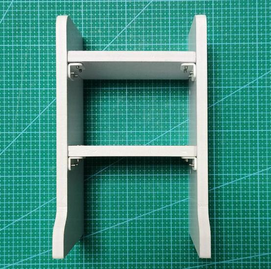

## 2. 通过手机APP展示

【视频】

## 3. 智能入库

:::{Note}
本节仅适用于购买了豪华版套餐的用户
:::

### 3.1 实验原理

我们这节课主要学习一下ArmPi FPV机械臂智能入库的功能。入库物品包括颜色方块和标签方块。整个入库过程分为三个阶段进行：识别阶段、搬运阶段和入库放置阶段。

首先是**识别阶段**，程序启动后，通过转动底部云台让ArmPi FPV在地图上"**搜寻**"可识别物品。然后判断是否"**搜寻**"到方块，再根据"**搜寻**"到的方块开启对应的识别子程序。

其中标签识别可以根据视线范围内的标签解码出对应ID号。

先通过定位、图像分割、轮廓查找来找到标签轮廓。接着进行四边形的检测，通过对四个角点的获取，将直线拟合形成一个闭环。然后对检测的标签进行编码与解码处理，得到标签对应的ID号。

而颜色识别则是通过先将图像转换为Lab空间，进行二值化处理，再经过膨胀腐蚀等操作，获得只包含程序内置颜色的轮廓，最后将该颜色轮廓框起来实现的。

在识别阶段之后机械臂进入搬运阶段。

该阶段首先将会根据外部的输入数据（目标方块），以及对图像反馈信息的处理，来调整夹取时的高度、俯仰角以及夹取后的抬升高度、方向、距离等参数。

每成功夹取一次方块，便会跳转到入库放置阶段。

机械臂将依照外部的输入数据（方块放置的目标货架编号）来确定方块在货架上的**具体放置位置**，最终来达到入库的目的。

该程序的源代码位于Docker容器中的： **/home/ubuntu/armpi_fpv/src/warehouse/scripts/in.py**

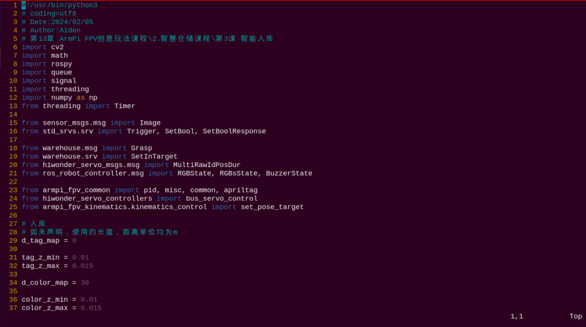

### 3.2 玩法开启及关闭

:::{Note}
指令的输入需严格区分大小写，另外可按键盘"Tab"键进行关键词补齐。
:::

**本小节以将红色方块放置到右侧第三层货架，ID为1的标签方块放到左侧第三层货架上为例。**

- #### 3.2.1 玩法准备

1)  将地图铺设在平整的桌面，货架和机械臂摆放到地图上的对应位置。

2)  准备3个颜色方块（红、绿、蓝）和3个标签方块（tag1、tag2、tag3）随机摆放在地图的物品可识别区域，方块之间的间隔不能小于3cm。

3)  打开机械臂开关，等待开机完成。

<p id="anchor_3_2_2"></p>

- #### 3.2.2 玩法进入

1. 将设备开机，并参照课程资料的"**[远程工具安装及容器进入方法\1. 远程工具安装与连接](https://docs.hiwonder.com/projects/ArmPi_FPV/en/latest/docs/8.remote.html#id2)**"内容，通过VNC远程连接工具连接。


2. 点击系统桌面左上角的图标，打开Terminator终端。


3. 输入指令按下回车，关闭手机APP自启服务。

```commandline
sudo ./.stop_ros.sh
```

4. 输入指令，然后按下回车开启运动控制、相机等底层服务。

```commandline
roslaunch armpi_fpv_bringup bringup.launch
```

5. 打开新的终端，输入指令，然后按下回车进入智能入库玩法。当成功进入后，会打印提示信息，如下图所示：

```commandline
rosservice call /in/enter "{}"
```

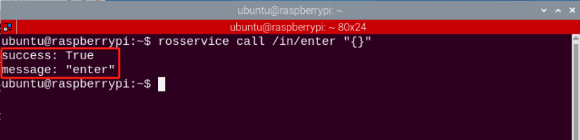

- #### 3.2.3 开启图像回传

1)  进入玩法后我们需要使用rqt工具来开启图像回传，打开新的终端。

2)  输入指令，按下回车，稍等片刻即可打开rqt工具。

```commandline
rqt_image_view
```

3)  单击下图所示红框位置，对智能入库的话题选项（topic）进行选择，选项为"**/in/image_result**"，其余设置保持不变。

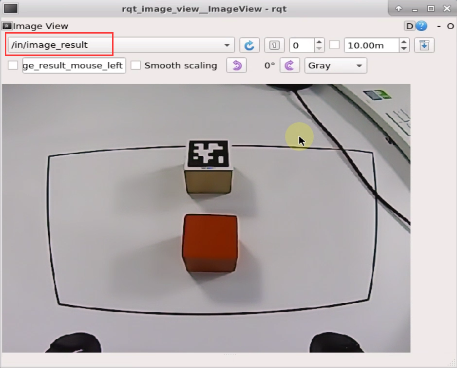

:::{Note}
图像开启后请务必选择与玩法相对应的话题选项，否则在后续玩法启动后，将无法正常显示其识别过程。
:::

<p id="anchor_3_2_4"></p>

- #### 3.2.4 玩法启动

1)  返回[玩法进入](#anchor_3_2_2)的终端，输入指令，同理出现下图所框提示即为启动成功。

```commandline
rosservice call /in/set_running "data: true"
```

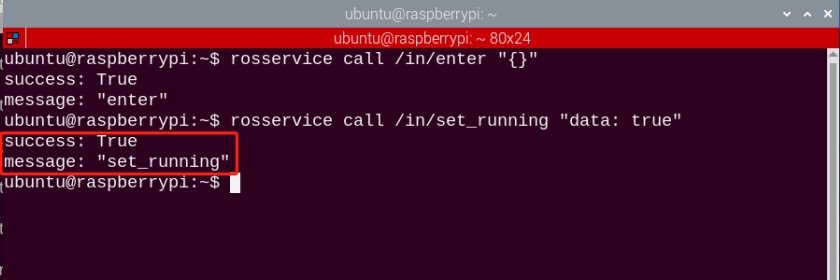

2)  启动玩法后我们还需要设置参数即入库的目标和入库后放置的位置，这里以将红色方块放置到右侧第三层货架，ID为1的标签方块放到左侧第三层货架上为例，手动输入指令，关键字使用Tab键进行补齐：

```commandline
rosservice call /in/set_target "goods:
- 'red'
- 'tag1'
position:
- 'R3'
- 'L3'"
```

设置参数指令中共有两类参数，其含义和内置参数可见下表。

<table class="docutils-nobg" border="1">
<colgroup>
<col  />
<col  />
<col  />
</colgroup>
<tbody>
<tr>
<td><strong>类型</strong></td>
<td><strong>含义</strong></td>
<td><strong>内置参数</strong></td>
</tr>
<tr>
<td>goods</td>
<td>待入库物品</td>
<td><p>标签方块：tag1、tag2、tag3</p>
<p>颜色方块：red、green、blue</p></td>
</tr>
<tr>
<td>position</td>
<td>入库位置</td>
<td><p>左侧货架（由低到高）：L1、L2、L3</p>
<p>右侧货架（由低到高）：R1、R2、R3</p></td>
</tr>
</tbody>
</table>

**输入参数时需注意以下几点事项：**

1.  如果是输入多个参数（如上图），则参数与参数之间必须换行，且输入的格式为：**短横杠+空格+‘货架编号’**，请严格按照此格式进行。如果是输入单个参数，则无需换行。

2.  为避免因输入法的问题造成运行报错，建议多使用Tab键补齐的方式，在对应位置输入参数即可。

3.  若是通过Tab键补齐之后，再来输入参数，那么在换行前需删除掉第一个参数后的内容。等全部参数都编辑好之后，再将双引号添加到最后一个参数的后面。步骤如下：

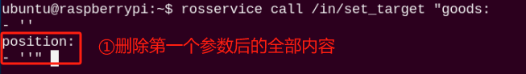

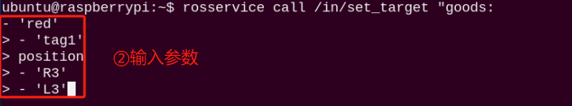

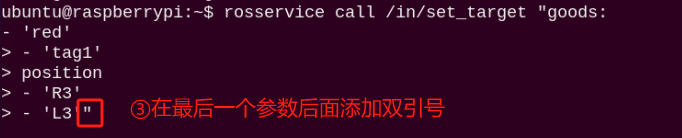

4. 两类参数在位置和数目上是一一对应的关系，即position输入的参数个数和goods的个数应相同，且goods输入的第一个参数对应方块将入库到position输入的第一个参数对应的货架上，以此类推。

- #### 3.2.5 玩法停止及退出

1)  如需停止该玩法，输入指令。在停止该玩法后可参考[玩法启动](#anchor_3_2_4)，更换或添加其他方块进行入库，以及入库的对应货架编号。

```commandline
rosservice call /exchange/set_running "data: false"
```

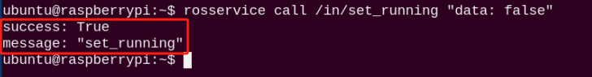

2)  如需退出该玩法，输入指令即可退出。

```commandline
rosservice call /in/exit "{}"
```

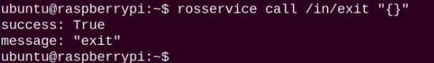

:::{Note}
玩法在未退出时，会在当前树莓派通电状态下持续运行。为避免过多占用树莓派的运行内存，如需执行其它AI视玩法，请先按照上述指令关闭当前玩法。
:::

如需关闭摄像头回传图像，返回开启rqt工具的终端，按下"**Ctrl+C**"即可。

3)  点击桌面左上角终端图标（**注意：需要在系统路径下输入指令，而不是在docker容器中输入开启APP服务的指令**），在系统路径下输入按下回车，启动APP服务，等待机械臂恢复至初始姿态，蜂鸣器"滴"一声即可。

```commandline
sudo systemctl restart start_node.service
```

### 3.3 功能实现

玩法开启后，当机械臂识别到红色方块之后，便会将其夹取到右侧第三层货架上，如果是识别到tag1方块，则会夹取到左侧第三层货架上，而其它方块无法被识别。

## 4. 智能出库

:::{Note}
本节仅适用于购买了豪华版套餐的用户
:::

### 4.1 实验原理

智能仓储系统，是利用先进的技术手段和智能设备对物品的进库、出库、存储、分拣、包装、配送等过程进行有效操控的物流活动。相较于人力仓储，智能仓储能更及时地更新库存、物品物流状态等信息，确保企业准确及时掌握真实的仓储数据，合理控制库存。

我们这节课主要学习一下ArmPi FPV机械臂的智能出库功能。

首先我们设置好物品在每层货架上的位置,然后设置一个外部输入，通过外部输入来决定夹取哪一层货架上的物品以及夹取的顺序。

搬运子程序在接收到输入数据之后，便控制机身转向对应货架的方向，然后调整夹取的角度、高度，靠近目标物品并进行夹取。再操控机械臂进行搬运和放置物品。

该程序的源代码位于Docker容器中的： **/home/ubuntu/armpi_fpv/src/warehouse/scripts/out.py**

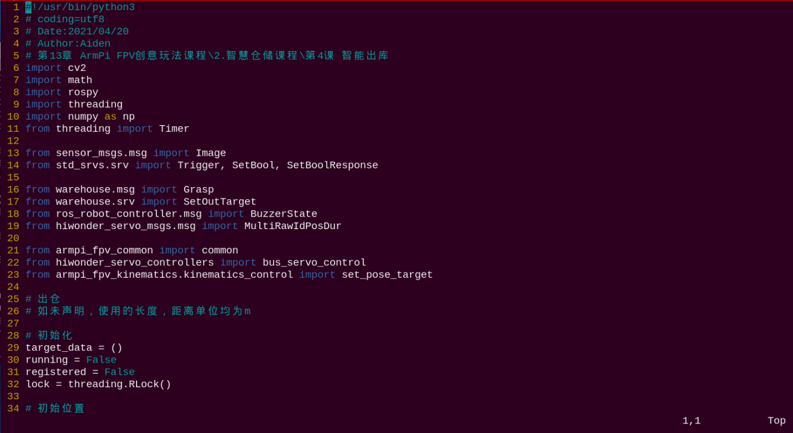

### 4.2 玩法开启及关闭

:::{Note}
指令的输入需严格区分大小写，另外可按键盘"**Tab**"键进行关键词补齐。
:::

**本小节以让机械臂依次搬运右侧货架R1、R2、R3上的物品出库为例。**

- #### 4.2.1 玩法准备

1)  将地图铺设在平整的桌面，货架和机械臂摆放到地图上的对应位置。

2)  然后准备3个方块分别摆放在右侧货架的各层，摆放顺序随机，但需保证每层只放置一个方块，且需放置在该层货架的中心位置。

3)  打开机械臂开关，等待开机完成。

<p id="anchor_4_2_2"></p>

- #### 4.2.2 玩法进入

1. 将设备开机，并参照课程资料的"**[远程工具安装及容器进入方法\1. 远程工具安装与连接](https://docs.hiwonder.com/projects/ArmPi_FPV/en/latest/docs/8.remote.html#id2)**"内容，通过VNC远程连接工具连接。


2. 点击系统桌面左上角的图标，打开Terminator终端。


3. 输入指令按下回车，关闭手机APP自启服务。

```commandline
sudo ./.stop_ros.sh
```

4. 输入指令，然后按下回车开启运动控制、相机等底层服务。

```commandline
roslaunch armpi_fpv_bringup bringup.launch
```

5. 打开新的终端，输入指令，然后按下回车进入智能出库玩法。当成功进入后，会打印提示信息，如下图所示：

```commandline
rosservice call /out/enter "{}"
```

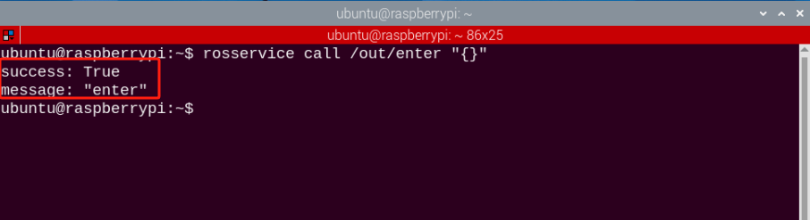

- #### 4.2.3 开启图像回传

1)  进入玩法后我们需要使用rqt工具来开启图像回传，打开新的终端。

2)  输入指令，按下回车，稍等片刻即可打开rqt工具。

```commandline
rqt_image_view
```

3)  单击下图所示红框位置，对智能出库的话题选项（topic）进行选择，选项为"**/out/image_result**"，其余设置保持不变。

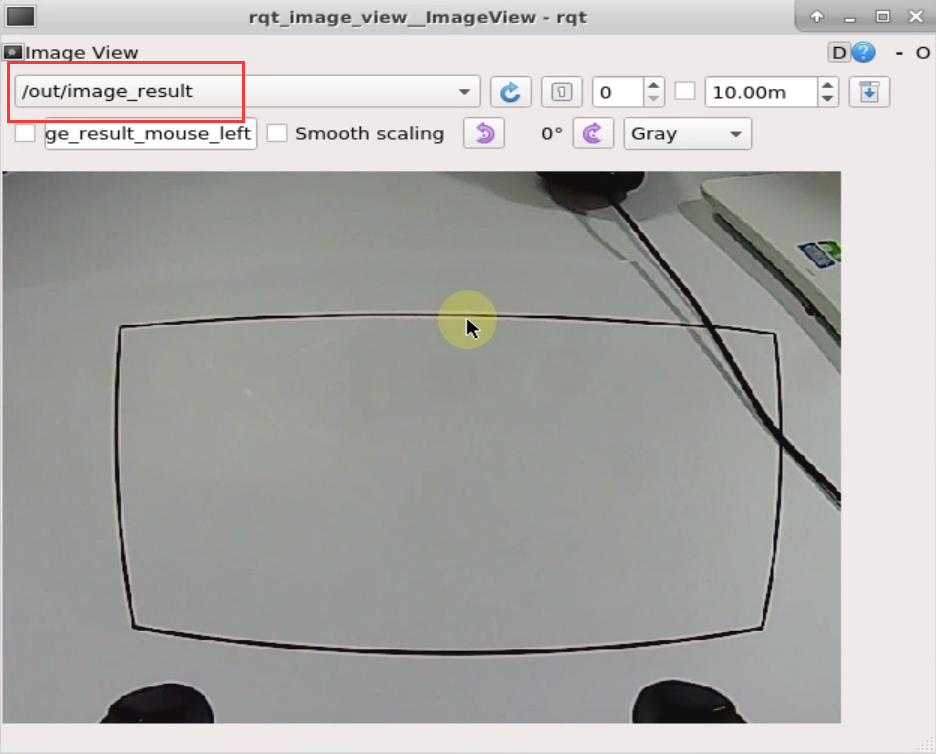

:::{Note}
图像开启后请务必选择与玩法相对应的话题选项，否则在后续玩法启动后，将无法正常显示其识别过程。
:::

<p id="anchor_4_2_4"></p>

- #### 4.2.4 玩法启动

1)  返回[玩法进入](#anchor_4_2_2)开启的终端，输入指令，同理出现下图所框提示即为启动成功。

```commandline
rosservice call /out/set_running "data: true"
```


2)  启动玩法后我们还需要设置参数，也就是出库的目标和出库顺序，因为两个货架的层数总和为6，所以机械臂执行一次程序可以搬运6个物品。

我们可以通过设置参数来指定出库的物品，在这里机械臂的出库顺序与我们输入参数的顺序是一致的，我们以让机械臂**依次搬运右侧货架R1、R2、R3上的物品出库**为例。输入指令，关键字使用Tab键进行补齐：

```commandline
rosservice call /out/set_target "position:
- 'R1'
- 'R2'
- 'R3'"
```

设置参数指令中输入参数的类型，及其含义和内置参数可见下表。

<table class="docutils" border="1">
<colgroup>
<col  />
<col  />
<col  />
</colgroup>
<tbody>
<tr>
<td><strong>类型</strong></td>
<td><strong>含义</strong></td>
<td><strong>内置参数</strong></td>
</tr>
<tr>
<td>position</td>
<td>出库商品货架编号</td>
<td><p>左侧货架（由低到高）：L1、L2、L3</p>
<p>右侧货架（由低到高）：R1、R2、R3</p></td>
</tr>
</tbody>
</table>

**输入参数时需注意以下两点事项：**

1.  如果是输入多个参数（如上图），则参数与参数之间必须换行，且输入的格式为：短横杠+空格+‘货架编号’，请严格按照此格式进行。如果是输入单个参数，则无需换行。

2.  为避免因输入法的问题造成运行报错，建议多使用Tab键补齐的方式，然后在对应位置输入参数即可。

3.  若是通过Tab键补齐之后，再来输入参数，那么在换行前需删除掉第一个参数后方的双引号。等全部参数都编辑好之后，再将双引号添加到最后一个参数的后面。步骤如下：

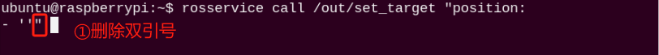

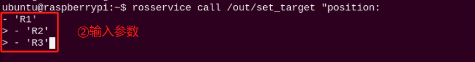

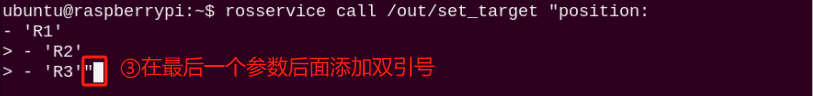

- #### 4.2.5 玩法停止及退出

1)  如需停止该玩法，输入指令。在停止该玩法后可参考[玩法启动](#anchor_4_2_4)，更换或者增加出库的货架或层数。

```commandline
rosservice call /out/set_running "data: false"
```


2)  如需退出该玩法，输入指令即可退出。

```commandline
rosservice call /out/exit "{}"
```


:::{Note}
玩法在未退出时，会在当前树莓派通电状态下持续运行。为避免过多占用树莓派的运行内存，如需执行其它AI视玩法，请先按照上述指令关闭当前玩法。
:::

如需关闭摄像头回传图像，返回开启rqt工具的终端，按下"**Ctrl+C**"即可。

3)  点击桌面左上角终端图标（**注意：需要在系统路径下输入指令，而不是在docker容器中输入开启APP服务的指令**），在系统路径下输入按下回车，启动APP服务，等待机械臂恢复至初始姿态，蜂鸣器"滴"一声即可。

```commandline
sudo systemctl restart start_node.service
```

### 4.3 功能实现

玩法开启后，机械臂将会按照我们在[玩法启动](#anchor_4_2_4)步骤2中输入的货架编号顺序依次搬运对应货架层上的物品出库。

搬运出库的物品呈一条直线摆放在物品可识别区，摆放顺序取决于物品原先所在的货架位置。若每层货架上的物品都搬运出库，则物品出库后的放置位置，从左至右依次为：R1、R2、R3、L1、L2、L3。

## 5. 智能转仓

:::{Note}
本节仅适用于购买了豪华版套餐的用户
:::

### 5.1 实验原理

随着物流业的高速发展，仓库中的物品进出、转运越来越频繁，为了便于管理和加强转运物品的高效准确性，采用机械臂来实现货架与货架之间的物品转移、交换，可以优化库位安排，使物流内部准确、安全、高效运行。

我们这节课学习ArmPi FPV机械臂的智能转仓功能。

首先我们在程序中设置好需转仓物品的货架编号和转仓后的货架编号，然后设置一个外部输入，通过外部输入来决定该物品转仓前和转仓后的货架和所在层。

转仓子程序在接收到输入数据之后，便控制机身转向对应货架的方向，然后调整夹取的角度、高度，靠近目标物品并进行夹取。再根据数据中的转仓后的货架编号操控机械臂进行搬运和放置物品。

该程序的源代码位于Docker容器中的： **/home/ubuntu/armpi_fpv/src/warehouse/scripts/exchange.py**

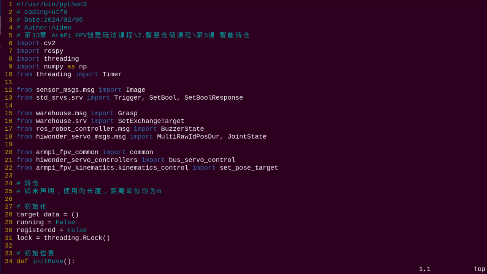

### 5.2 玩法开启及关闭

:::{Note}
指令的输入需严格区分大小写，另外可按键盘"Tab"键进行关键词补齐。
:::

**本小节以将左侧货架第2层的物品转运至右侧货架第3层为例。**

### 5.2.1 玩法准备

1)  将地图铺设在平整的桌面，货架和机械臂摆放到地图上的对应位置，并准备一个方块放在左侧第二层货架的中心位置上。

2)  打开机械臂开关，等待开机完成。

<p id="anchor_5_2_2"></p>

### 5.2.2 玩法进入

1)  将设备开机，并参照课程资料的"**[远程工具安装及容器进入方法\1. 远程工具安装与连接](https://docs.hiwonder.com/projects/ArmPi_FPV/en/latest/docs/8.remote.html#id2)**"内容，通过VNC远程连接工具连接。


2)  点击系统桌面左上角的图标，打开Terminator终端。

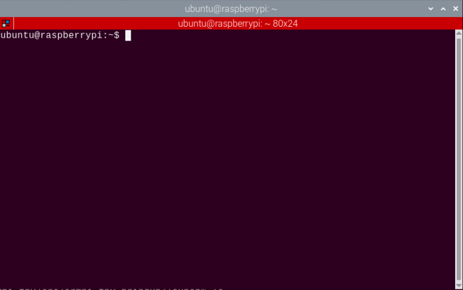

3)  输入指令按下回车，关闭手机APP自启服务。

```commandline
sudo ./.stop_ros.sh
```

3)  输入指令，然后按下回车开启运动控制、相机等底层服务。


```commandline
roslaunch armpi_fpv_bringup bringup.launch
```

3)  打开新的终端，输入指令，然后按下回车进入智能转仓玩法。当成功进入后，会打印提示信息，如下图所示：

```commandline
rosservice call /exchange/enter "{}"
```

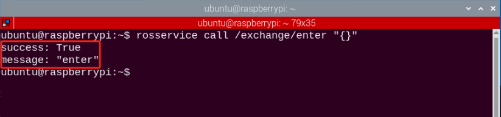

### 5.2.3 开启图像回传

1)  进入玩法后我们需要使用rqt工具来开启图像回传，打开新的终端。

2)  输入指令，按下回车，稍等片刻即可打开rqt工具。

```commandline
rqt_image_view
```

3)  单击下图所示红框位置，对智能入库的话题选项（topic）进行选择，选项为"**/exchange/image_result**"，其余设置保持不变。

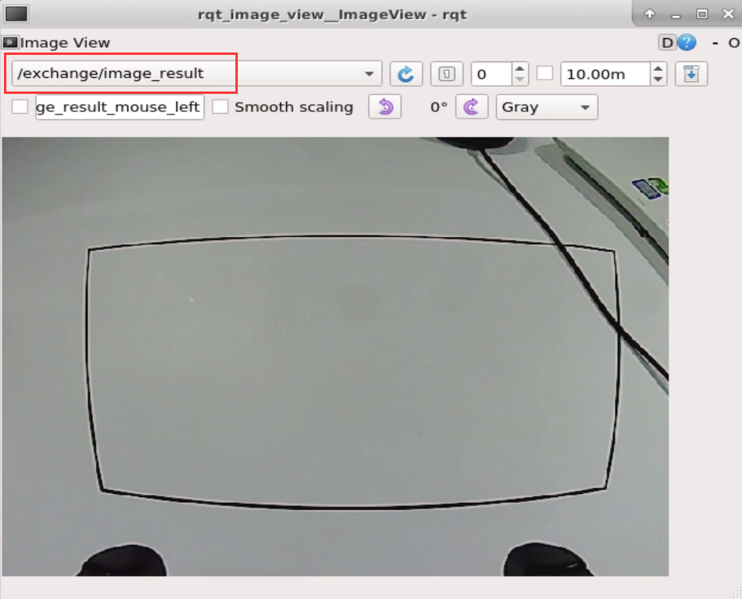

:::{Note}
图像开启后请务必选择与玩法相对应的话题选项，否则在后续玩法启动后，将无法正常显示其识别过程。
:::

<p id="anchor_5_2_4"></p>

### 5.2.4 玩法启动

1)  返回[玩法进入](#anchor_5_2_2)开启的终端，输入指令，同理出现下图所框提示即为启动成功。

```commandline
rosservice call /exchange/set_running "data: true"
```

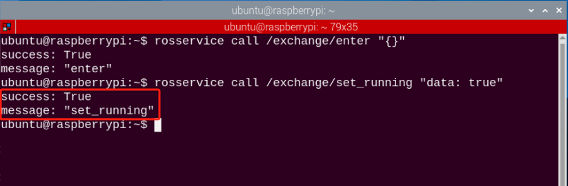

2)  启动玩法后我们还需要设置参数即转仓的货架编号，这里以将**左侧货架第2层的物品转运至右侧货架第3层为例**。手动输入指令，关键字可以使用Tab键进行补齐：

```commandline
rosservice call /exchange/set_target "position:
- 'L2'
- 'R3'"
```

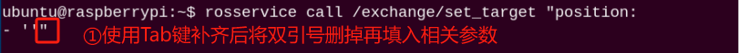

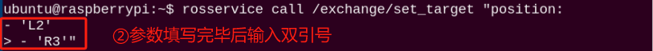

设置参数指令中输入参数的类型，及其含义和内置参数可见下表。

<table class="docutils-nobg" border="1">
<colgroup>
<col  />
<col  />
<col  />
</colgroup>
<tbody>
<tr>
<td><strong>类型</strong></td>
<td><strong>含义</strong></td>
<td><strong>内置参数</strong></td>
</tr>
<tr>
<td>position</td>
<td>转仓物品货架编号（第1个参数为转出货架，第2个参数为被转入货架）</td>
<td><p>左侧货架（由低到高）：L1、L2、L3</p>
<p>右侧货架（由低到高）：R1、R2、R3</p></td>
</tr>
</tbody>
</table>

**输入参数时需注意以下几点事项：**

1.  由于转仓是物品由一个货架层上转到另一个货架层上，因此本节程序只能输入两个参数，参数之间使用换行隔开，输入的格式为：**短横杠+空格+‘货架编号’**，请大家严格按照此格式进行。

2.  未避免因输入法的问题造成运行报错，建议多使用Tab键补齐方式，然后在对应位置输入参数即可。

3.  若是通过Tab键补齐之后，再来输入参数，那么在换行前需删除掉第一个参数后方的双引号。等全部参数都编辑好之后，再将双引号添加到最后一个参数的后面。

- #### 5.2.5 玩法停止及退出

1)  如需停止该玩法，输入指令。在停止该玩法后可参考[玩法启动](#anchor_5_2_4)，更换转仓的货架层。

```commandline
rosservice call /exchange/set_running "data: false"
```

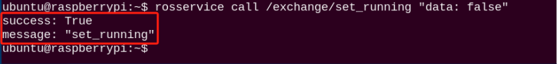

2)  如需退出该玩法，输入指令即可退出。

```commandline
rosservice call /exchange/exit "{}"
```


:::{Note}
玩法在未退出时，会在当前树莓派通电状态下持续运行。为避免过多占用树莓派的运行内存，如需执行其它AI视玩法，请先按照上述指令关闭当前玩法。
:::

如需关闭摄像头回传图像，返回开启rqt工具的终端，按下"Ctrl+C"即可。

3)  点击桌面左上角终端图标（**注意：需要在系统路径下输入指令，而不是在docker容器中输入开启APP服务的指令**），在系统路径下输入指令按下回车，启动APP服务，等待机械臂恢复至初始姿态，蜂鸣器"滴"一声即可。

```commandline
sudo systemctl restart start_node.service
```

### 5.3 功能实现

玩法开启后，机械臂将会将左侧货架第2层的物品转运至右侧货架第3层。