# 9. Intelligent Warehouse Course

## 9.1 About Shelf Instruction

Starting from October 1, 2021, the shelves have been without back panels. This change does not affect the game and functionality. Please refer to the following image for actual details:

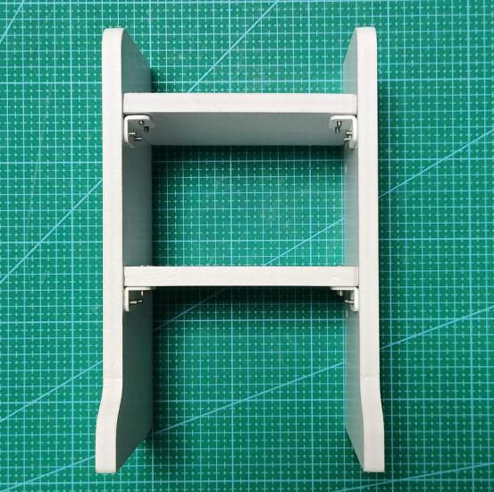

## 9.2 App Smart Warehouse Demo

Install and connect to the app according to the instructions in '[Quick User Experience\2.App Control]()'.

### 9.2.1 Intelligent Warehousing

After starting this game, ArmPi FPV will put target block to the specific position on the shelf. The app interface of game is divided into four parts.

① The left and right side is the area for selecting shelf.

② The middle is the live camera feed area.

③ The bottom part is the block selection area.

④ The lower right part is the function button area.

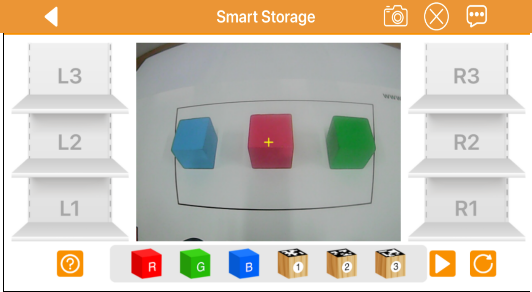

Select the blocks to be warehoused and the shelf for storage and click on . Then the robotic arm will pick the corresponding blocks and place them to the selected shelf.

|                           **Icon**                           |                **Function**                 |
| :----------------------------------------------------------: | :-----------------------------------------: |
|  |              Start/Stop game.               |
|  |    Clear the previous selection record.     |
|  | Select the shelf where the block is placed. |
|  |     Select the block to be warehoused.      |
|  |     Capture the real-time camera image      |
|  |               Close menu bar.               |
|  |            Get help information.            |

:::{Note}
① Please start this game in a well-lit environment.

② Keep a certain interval between the blocks, do not get too close to each other.

:::

### 9.2.2 Intelligent Delivering

For users who purchased ArmPi FPV advanced kit or developer kit, you can refer to the document in "14. Creative Courses/2. Intelligent Warehouse Course" to assemble the shelf for this game.

After starting this game, ArmPi FPV will put target block to the specific position on the shelf. The app interface of game is divided into four parts.

① The left and right side is the area for selecting shelf.

② The middle is the live camera feed area.

③ The bottom part is the area where the delivering sequence of block is selected.

④ The lower right part is the function button area.

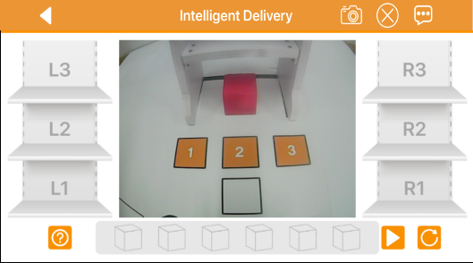

Select the shelf of the items to be delivered and the place to place. Click on , robotic arm will grab a block from the specified shelf and place it in the corresponding position.

|                           **Icon**                           |                 **Function**                  |
| :----------------------------------------------------------: | :-------------------------------------------: |
|  |               Start/Stop game.                |
|  |     Clear the previous selection record.      |
|  |  Select the corresponding layer of the shelf  |
|  | Select the sequence of block to be delivered. |
|  |      Capture the real-time camera image       |
|  |                Close menu bar.                |
|  |             Get help information.             |

:::{Note}
the block must be placed in the middle of the shelf.
:::

### 9.2.3 Intelligent Transferring

For users who purchased ArmPi FPV advanced kit or developer kit, you can refer to the document in "14. Creative Courses/2. Intelligent Warehouse Course" to assemble the shelf for this game.

After starting this game, ArmPi FPV will put target block to the specific position on the shelf. The app interface of game is divided into four parts.

① The left and right side is the area for selecting shelf.

② The middle is the live camera feed area.

③ The bottom part is the area for selecting the blocks to be transferred.

④ The lower right part is the function button area.

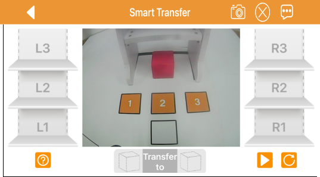

Move the blocks from one side of the shelf to the other side of the shelf, or move the blocks from one layer to other layer on the same shelf.

Drag the specific layer of shelf in which the target block is located to the left of the transferring selection area and tap . The robotic arm will grab the block and move it to the target shelf.

|                           **Icon**                           |                       **Function**                        |
| :----------------------------------------------------------: | :-------------------------------------------------------: |
|  |                     Start/Stop game.                      |
|  |           Clear the previous selection record.            |
|  |            Select the shelf to be transferred.            |
| 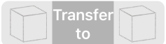 | Select the initial shelf layer and the target shelf layer |
|  |            Capture the real-time camera image             |
|  |                      Close menu bar.                      |
|  |                   Get help information.                   |

:::{Note}

① Must place the block in the middle of the shelf.

② There must be block in the corresponding position to be transferred, and there should be no square in the place to be transferred.

:::

## 9.3 Intelligent Warehousing

### 9.3.1 Program Description

We are going to learn how ArmPi FPV perform intelligent "stock enter" function. The robotic arm can intelligently warehouse the color blocks and blocks with tag. And the whole process consists of three steps, including recognizing, transferring and stock entering. 

In the recognition phase, having launched the program, you should turn the bottom holder to make ArmPi FPV search the objects on the map. And the robotic arm will determine the searching result, then it launch corresponding subroutine based on the block searched. 

Through tag recognition, the robotic arm can decode the tag within recognition area to corresponding ID number.

The robotic arm target the tag outline through locating, image segmentation and outline searching. Next, it comes to quadrilateral detection, and form a quadrilateral through connecting four corner points. Then, it will code and decode the target tag, and gets corresponding ID.

During color recognition, it will firstly convert the RGB color space to Lab, image binarization, and then perform operations such as expansion and corrosion to obtain an outline containing only the target color. Use circles to frame the color outline to realize object color recognition.

Having finished the previous steps, the robotic arm will move into transferring phase.

In this stage, based on the target block you have set and the processing of image feedback information, it will adjust the height to pick, pitching angle and lifting height, lifting direction and lifting distance.  

Whenever it successfully pick up one block, it will change into intelligent warehousing mode. 

According to the shelf set to place the block, the robotic arm will determine the specific placing location on the shelf to finish intelligent warehousing.   

### 9.3.2 Start and Close the Game

:::{Note}
The entered command must be strictly distinguished between uppercase and lowercase and spaces, and the keywords support the "TAB" key completing.
:::

Let's take the example of placing the red block on the third shelf on the right and the ID1 block on the third shelf on the left.

* **Preparation** 

(1) Please place the map on even desk and the robotic arm should be placed on the corresponding area on the map.

(2) Prepare 3 blocks in red, green and yellow and 3 blocks labeled with tag1, tag2 and tag3. And place them randomly on the recognition area of the map. Note: the interval between each blocks is not less than 3cm.

(3) Turn on the robotic arm and wait to finish.  

<p id="anchor_3_2_2"></p>

**3.2.2 Access to Game**

(1) Power on the robot and use VNC Viewer to connect to the remote desktop.


(2) Click the iconon the upper-left of the desktop, and open Terminator terminal.

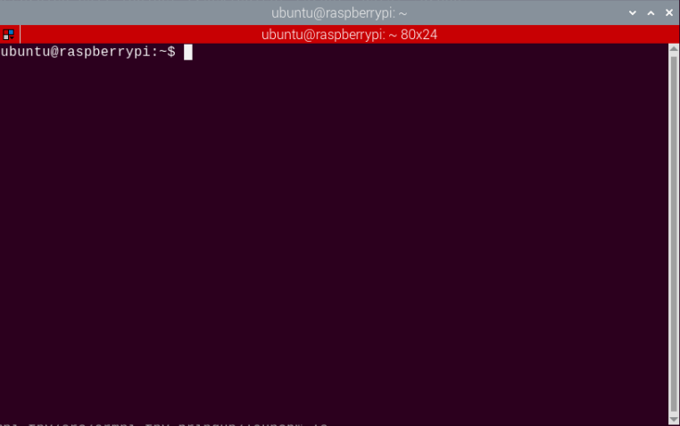

(3) Enter command to run game program, and press Enter.

```shell
sudo ./.stop_ros.sh
```

(4) Enter command to run game program, and press Enter.

```shell
roslaunch armpi_fpv_bringup bringup.launch
```

(5) Input command to open a new terminal based on "Step2". Then press Enter to process to Intelligent Warehousing program. After entering successfully, the prompt information will be printed as pictured:

```shell
rosservice call /in/enter "{}"
```

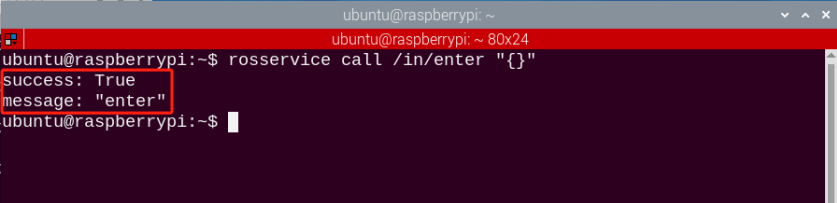

* **Enable Live Camera Feed** 

(1) When entering the game, we need to turn on image returned by camera with rqt tool.

(2) Enter "rqt_image_view" command and press "Enter". Then open rqt tool after few seconds.

```shell
rqt_image_view
```

(3) As shown in the following figure, select "/in/image_result" and other settings remain the same.

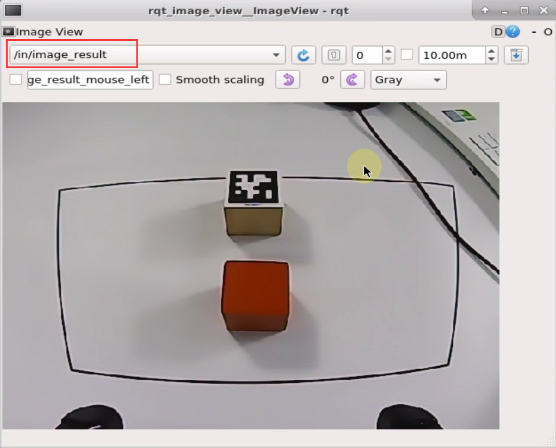

:::{Note}
after the image is turned on, please be sure to select the topic corresponding to the game you play. Otherwise, the recognition process can not be displayed normally if you start other games.
:::

<p id="anchor_3_2_4"></p>

* **Start the Game** 

(1) Please go back to the terminal opened in "[ Access to Game](#anchor_3_2_2)" and enter command. When the prompt, shown in the red box, appears, it means you start the game successfully.

```shell
rosservice call /in/set_running "data: true"
```

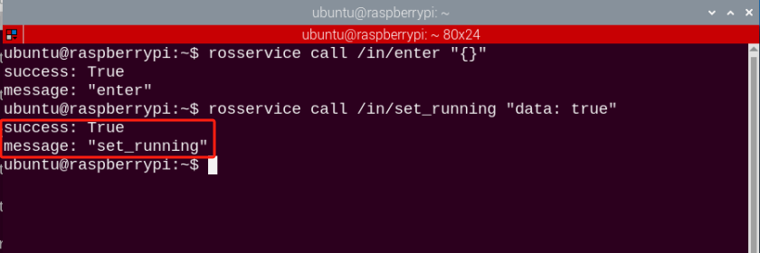

(2) After starting the game, we need to set the parameters including target goods and placing location. Let's take the example of placing the red block on the third shelf on the right and the ID1 block on the third shelf on the left. The entered command is as follow.

```shell
rosservice call /in/set_target "goods:
- 'red'
- 'tag1'
position:
- 'R3'
- 'L3'"
```

There are two types of parameter, and you can refer to the table below for their meanings and built-in parameters. 

| **Type** |       **Meaning**       |                    **Built-in parameter**                    |
| :------: | :---------------------: | :----------------------------------------------------------: |
|  goods   | Object to be warehoused |   Tag Block: tag1, tag2, tag3Color block: red, green, blue   |
| position |    Placing Location     | Left Shelf (from bottom to top): L1, L2, L3Right Shelf (from bottom to top): R1, R2, R3 |

Pay attention to the following points when entering parameters.

① If you are entering multiple parameters (as shown in the figure above), you must wrap between each parameters. And please strictly follow this hyphen + space + 'shelf number'.

② In order to avoid errors caused by input method, it is recommended to use the Tab key completing, and enter the parameters in the corresponding position.

③ If you enter the parameters after Tab key completing, then you need to delete the content after the first parameter before wrapping. After all the parameters are entered, add double quotation marks after the last parameter. The instruction is as follow.

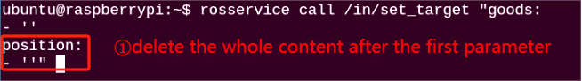

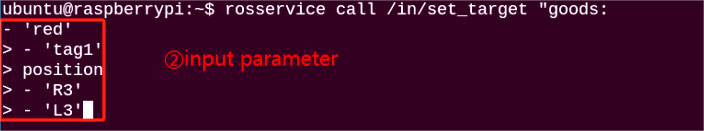

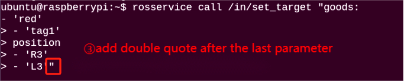

(4) There is corresponding relationship between these two types of parameters in terms of location and number, that is, the number of entered position parameter is the same as entered goods parameter. And the robotic arm will place the first target block on the first specific shelf. And the first target block corresponds to first goods parameter and the first specific shelf corresponds to first positions parameter.   

* **Pause and Quit the Game** 

(1) If you want to pause this program, input command. After pausing this program, you can refer to "[ Start the Game]()" to replace or add other blocks for storage, along with the corresponding shelf numbers for storage.

```shell
rosservice call /exchange/set_running "data: false"
```

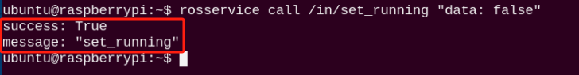

(2) You can enter command to quit the game.

```shell
rosservice call /in/exit "{}"
```

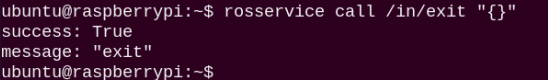

:::{Note}
the current game will continue as Raspberry Pi is powered on. To avoid occupying too much RAM, please quit the current game according to the instruction above before playing other AI vision game.
:::

If you want to turn off the image returned by camera, you can turn back to open rqt terminal and press "Ctrl+C".

(3) Click terminal icon  on the upper-left of the desktop. Note: it is needed to input command in system path, rather than input app service command in the docker container. Input in the system path and press Enter to start APP service. Wait for a moment until the robotic arm return to the initial posture and the buzzer emits "Di" for one time.

```shell
sudo systemctl restart start_node.service
```

### 9.3.3 Program Outcome

After recognizing the red block, the robotic arm will pick up the red block and place it on the third layer of right shelf. If tag1 block is recognized, tag1 block will be picked up and placed on the third layer of left shelf. Other blocks can not be recognized. 

## 9.4 Intelligent Outbound

### 9.4.1 Program Description

Taking advantage of advanced technology and smart devices, intelligent warehousing system can efficiently manipulate the process of stock enter, stock deliver, sorting, packaging, distribution, etc. Compared with human warehousing, intelligent warehousing can update the information in time, including inventory, logistics status, etc., to ensure that the company can master the real warehousing data and adjust the inventory.        

In this lesson, we are going to learn how the ArmPi FPV perform "stock deliver" function. 
First, we need to set the location of the goods on each shelf layer, then set the external input to decide which layer to pick up and the picking order.      

After receiving the data, deliver subroutine will control the body of robotic arm to turn to the corresponding shelf. After the picking angle and height is adjusted by deliver subroutine, the robotic arm will approach and pick up the goods. Next, control the robotic arm to deliver and place the goods.

### 9.4.2 Start and Close the Game

:::{Note}
The entered command must be strictly distinguished between uppercase and lowercase and spaces, and the keywords support the **"TAB"** key completing.
:::

Let's take the example of making the robotic arm deliver R1, R2 and R3 goods on the left shelf in turns. 

* **Preparation** 

① Please place the map on even desk and the robotic arm and shelf should be placed on the corresponding area on the map.

② Place 3 blocks on each layer of the right shelf respectively. You can place them randomly on each layer, but ensure that one block is placed on one layer and on the center of the shelf.

③ Turn on the robotic arm and wait to finish.

<p id="anchor_4_2_2"></p>

* **Access to Game** 

(1) Power on the robot and use VNC Viewer to connect to the remote desktop.


(2) Click the iconon the upper-left of the desktop, and open Terminator terminal.


(3) Enter command to run game program, and press Enter.

```shell
sudo ./.stop_ros.sh
```

(4) Enter command to run game program, and press Enter to open motion control, camera and other underlying services.

```shell
roslaunch armpi_fpv_bringup bringup.launch
```

(5) Input command to open a new terminal based on "Step (2)". Then press Enter to process to Intelligent Warehousing program. After entering successfully, the prompt information will be printed as pictured:

```shell
rosservice call /out/enter "{}"
```

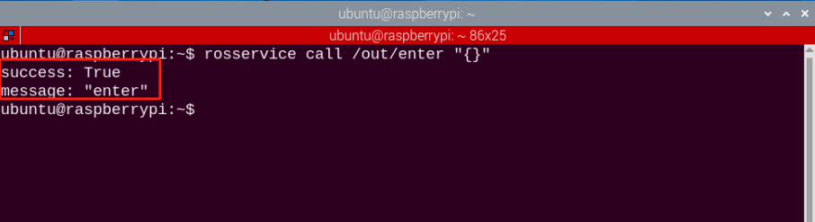

* **Enable Live Camera Feed** 

(1) When entering the game, we need to turn on image returned by camera with rqt tool. You can according to "Step2".

(2) Enter command and press "Enter". Then open rqt tool after few seconds.

```shell
rqt_image_view
```

(3) As shown in the following figure, select "/out/image_result" and other settings remain the same. 

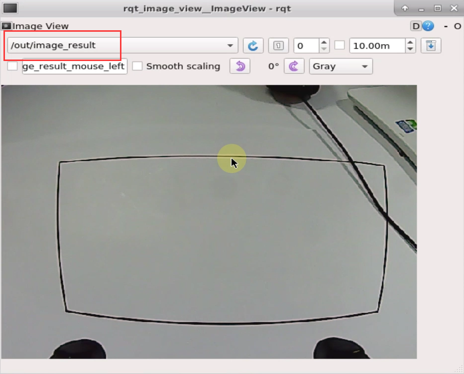

:::{Note}
after the image is turned on, please be sure to select the topic corresponding to the game you play. Otherwise, the recognition process can not be displayed normally if you start other games.
:::

<p id="anchor_4_2_4"></p>

* **Start the Game** 

(1) Please go back to the terminal opened in  "[Access to Game]() " and enter command. When the prompt, shown in the red box, appears, it means you start the game successfully.

```shell
rosservice call /out/set_running "data: true"
```

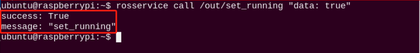

(2) When the game starts, we need to set the parameter, including target goods and the deliver order. The total number of the layers of the two shelves is 6, hence the robotic arm can deliver 6 items once the program is executed. 

(3) Through setting the parameter, we can designate the goods to be delivered. The delivering order is consistent with the parameter we input. Let's take the example of making the robotic arm deliver R1, R2 and R3 goods on the left shelf in turns. And enter the following command.

```shell
rosservice call /out/set_target "position:
- 'R1'
- 'R2'
- 'R3'"
```

Sets the type of input parameter in the parameter command, and you can refer to the table below for their meanings and built-in parameters. 

| **Type** |  **Meanings**   |                    **Built-in parameter**                    |
| :------: | :-------------: | :----------------------------------------------------------: |
| position | Number of shelf | Left Shelf (from bottom to top): L1, L2, L3Right Shelf (from bottom to top): R1, R2, R3 |

Pay attention to the following points when entering parameters.

① If you are entering multiple parameters (as shown in the figure above), you must wrap between each parameters. And please strictly follow this hyphen + space + 'shelf number'.

② In order to avoid errors caused by input method, it is recommended to use the Tab key completing, and enter the parameters in the corresponding position.

③ If you enter the parameters after Tab key completing, then you need to delete the content after the first parameter before wrapping. After all the parameters are entered, add double quotation marks after the last parameter. The instruction is as follow.

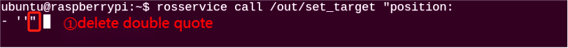

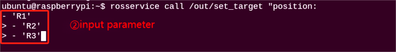

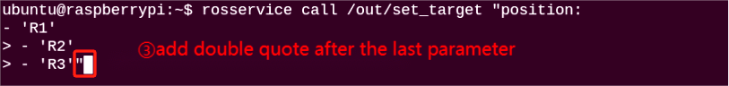

* **Pause and Quit the Game** 

(1) You can enter command to pause the game. After pausing this program, you can refer to "2.4 Start the Game" to replace or add other blocks for storage, along with the corresponding shelf numbers for storage.

```shell
rosservice call /out/set_running "data: false"
```

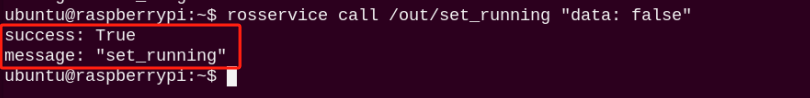

(2) You can enter command to quit the game.

```shell
rosservice call /out/exit "{}"
```

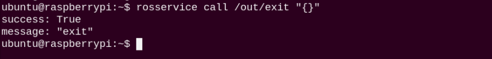

:::{Note}
the current game will continue as Raspberry Pi is powered on. To avoid occupying too much RAM, please quit the current game according to the instruction above before playing other AI vision game.
:::

If you want to turn off the image returned by camera, you can turn back to open rqt terminal and press "Ctrl+C".

(3) Click terminal iconon the upper-left of the desktop. Note: it is needed to input command in system path, rather than input app service command in the docker container. Input "sudo systemctl restart start_node.service" in the system path and press Enter to start APP service. Wait for a moment until the robotic arm return to the initial posture and the buzzer emits "Di" for one time.

```shell
sudo systemctl restart start_node.service
```

### 9.4.3 Program Outcome

When the game starts, the robotic arm will deliver the goods on the corresponding shelf in turns in accordance with the number of shelf inputted in "Step2" of "[Start the game]()". 

After delivered, the goods will be placed in a straight line in the recognition area. And the placing order depends on the location of the shelf where items were originally placed. If the items on each shelf are delivered, the placement positions of the items on recognition area, from left to right, are R1, R2, R3, L1, L2, L3. 

## 9.5 Intelligent Warehouse Transfer

### 9.5.1 Program Logic

As logistics industry advances swiftly, goods in warehouse are increasing frequently entered, delivered and transferred. In order to facilitate the management and enhance the efficiency and accuracy of goods transferring, we use robot arm to transfer goods between shelves, which optimizes the shelves arrangement to ensure accurate, safe and efficient internal operations.          

In this lesson, we are going to take a look at stock transfer function of ArmPi FPV.
First of all, we need to set the shelf number of the item to be transferred and the shelf number the item to be warehoused in the program. Then set the external input to decide the shelf and floor location before and after the goods transferring.  

After receiving the data, transfer subroutine will control the body of robotic arm to turn to the corresponding shelf. After the picking angle and height is adjusted by transfer subroutine, the robotic arm will approach and pick up the goods. Next, control the robotic arm to transfer and place the goods according to the shelf numbers set in the program.

The source code is located in Docker container: **[/home/ubuntu/armpi_fpv/src/warehouse/scripts/exchange.py]()**

### 9.5.2 Operation Steps 

:::{Note}
The entered command must be strictly distinguished between uppercase and lowercase and spaces, and the keywords support the "TAB" key completing.
:::

Let's take the example of making the robotic arm transfer the goods on the second floor of the left shelf to the third floor of the right shelf.

* **Preparation**

① Please place the map on even desk, and the robotic arm and shelf should be placed on the corresponding area on the map. And prepare a block and place it on the center of the second floor. 

② Turn on the robotic arm and wait to finish.

<p id="anchor_5_2_2"></p>

* **Access to Game**

(1) Power on the robot and use VNC Viewer to connect to the remote desktop.


(2) Click the icon  on the upper-left of the desktop, and open Terminator terminal.


(3) Enter command and press Enter to close app self-starter service.

```shell
sudo ./.stop_ros.sh
```

(4) Input command and press Enter to start movement control, camera and other underlying service.

```shell
roslaunch armpi_fpv_bringup bringup.launch
```

(5) Input command to open a new terminal based on "Step2". Then press Enter to process to Intelligent Warehousing Transfer program. After entering successfully, the prompt information will be printed as pictured:

```shell
rosservice call /exchange/enter "{}"
```

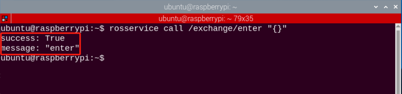

* **Enable Live Camera Feed**

(1) When entering the game, we need to turn on image returned by camera with rqt. Please according to "Step2" to open a new terminal.

(2) Enter "rqt_image_view" command and press "Enter". Then open rqt after few seconds.

```commandline
rqt_image_view
```

(3) As shown in the following figure, select "/exchange/image_result" and other settings remain the same.

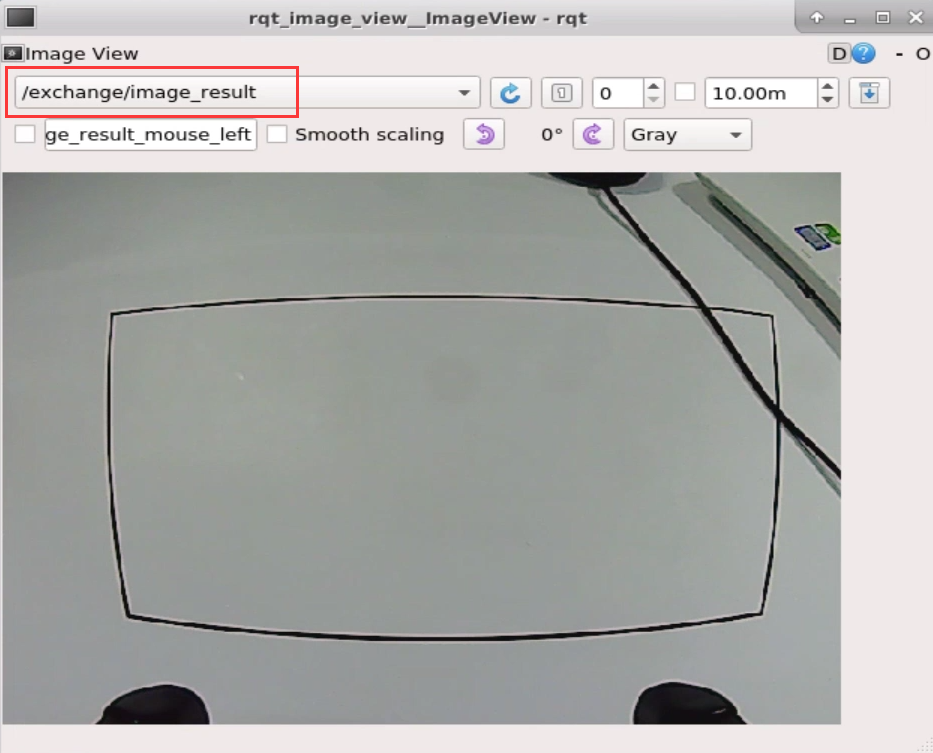

:::{Note}
after the image is turned on, please be sure to select the topic corresponding to the game you play. Otherwise, the recognition process can not be displayed normally if you start other games.
:::

<p id="anchor_5_2_4"></p>

* **Start the Game**

(1) Please go back to the terminal opened in " [Enter the Game]()" and enter "rosservice call /exchange/set_running "data: true" command. When the prompt, shown in the red box, appears, it means you start the game successfully.

```shell
rosservice call /exchange/set_running "data: true"
```

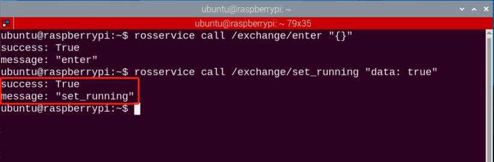

(2) When the game starts, we need to set the parameter, numbers of the shelf. Let's take the example of transferring the goods on the second floor of the left shelf to the third floor of the right shelf.

```shell
rosservice call /exchange/set_target "position:
- 'L2'
- 'R3'"
```

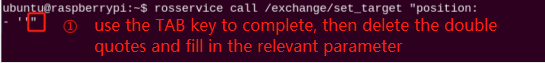

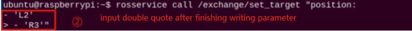

Sets the type of input parameter in the parameter command, and you can refer to the table below for their meanings and built-in parameters.

| **Type** |                         **Meaning**                          |                    **Built-in parameter**                    |
| :------: | :----------------------------------------------------------: | :----------------------------------------------------------: |
| position | Numbers of shelves. The first parameter refers to the shelf transferred out. And the second parameter is for the shelf transferred in. | Left Shelf (from bottom to top): L1, L2, L3Right Shelf (from bottom to top): R1, R2, R3 |

Pay attention to the following points when entering parameters.

(1) As stock transfer is to transfer the goods from one shelf to other shelf, you only need to enter two parameters in this program. And parameters are separated by a newline. Please strictly follow the correct input form, hyphen + space + 'shelf number'.   

(2) In order to avoid errors caused by incorrect input method, it is recommended to use the Tab key completing, and enter the parameters in the corresponding position.

(3) If you enter the parameters after Tab key completing, then you need to delete the content after the first parameter before wrapping. After all the parameters are entered, add double quotation marks after the last parameter. 

* **Pause and Quit the Game** 

(1) You can enter "rosservice call /exchange/set_running "data: false"" command to pause the game. After pausing this program, you can refer to "[Start the Game]()" to replace the shelf layer of the transfer warehouse.

```shell
rosservice call /exchange/set_running "data: false"
```

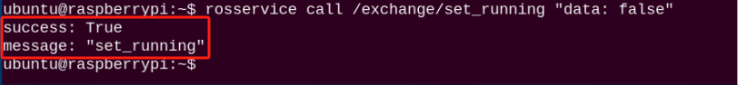

(2) You can enter command to quit the game.

```shell
rosservice call /exchange/exit "{}"
```

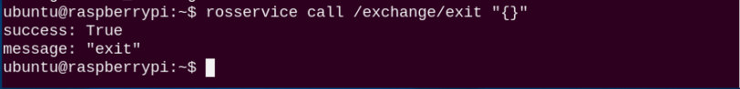

:::{Note}
 the current game will continue as Raspberry Pi is powered on. To avoid occupying too much RAM, please quit the current game according to the instruction above before playing other AI vision game.
:::

If you want to turn off the image returned by camera, you can turn back to open rqt terminal and press "Ctrl+C".

(3) Click terminal icon  on the upper-left of the desktop. Note: it is needed to input command in system path, rather than input app service command in the docker container. Input "sudo systemctl restart start_node.service" in the system path and press Enter to start APP service. Wait for a moment until the robotic arm return to the initial posture and the buzzer emits "Di" for one time.

```shell
sudo systemctl restart start_node.service
```

### 9.5.3 Program Outcome

When the game starts, the robotic arm will transfer the items on the second floor of the left shelf to the third floor of the right shelf.