# 语音交互玩法课程

## 1. 语音模块介绍

### 1.1 初识语音识别模块

- #### 1.1.1 概述

语音识别模块是基于嵌入式语音识别技术的模块，它主要包括语音识别芯片和一些其他的附属电路，能够方便的与主控芯片进行通讯。开发者可以方便的将该模块嵌入到产品中使用，达到实现语音交互的目的。

工作原理

采用IIC通信，用户只需要把识别的关键词语以字符串的形式传送进芯片，即可在下次识别中立即生效。

其算法本质是在提取输入声音的特征后，在关键词语列表中寻找一个相似度最高的词语作为识别结果。

该模块有三种使用模式，用户可通过编程，设置两种不同的使用模式。

**按钮检测模式：** 系统的主控MCU在接收到外界一个触发后（比如用户按下按键），将会启动芯片上的一个定时识别过程（比如5 s），此时需要用户在这个定时过程中说出要识别的语音关键词语。当这个过程结束后，需要用户再次触发才能再次启动一个识别过程。

**循环检测模式：** 系统的主控MCU反复启动的识别过程。如果没有人说话就没有识别结果，则每次识别过程的定时到时后会再启动一个识别过程；如果有识别结果，则根据识别作相应处理后（比如播放某个声音作为回答）再启动一个识别过程。

**口令检测模式：** 口令模式需要一个关键词来唤醒，唤醒后才可以进行识别，默认唤醒关键词为第一句，识别结束后，想再次进行识别，还需唤醒它。

- #### 1.1.2 规格参数

|   工作电压   |                 DC 5V                 |
|:--------:|:-------------------------------------:|
|   通讯方式   |                  IIC                  |
|    尺寸    |               48mm×24mm               |
|   接口型号   |               5264-4AW                |
|  PWR说明   |             电源指示灯（供电后亮起）              |
|  STA说明   |            状态指示灯（识别到声音后亮起）            |
|  KEY说明   |          触发声音识别控制按键（按钮检测模式）           |

- #### 1.1.3 应用领域

主打傻瓜式的简易操作、出色的语音识别性能，使其应用非常广泛，例如像智能家居、对话机器人、教育机器人、车载调度终端等方面。

- #### 1.1.4 接线方法

这里我们将语音识别模块连接在树莓派扩展板上。大家可以通过4PIN线将其连接至树莓派扩展板上的任意一个IIC接口，如下图所示：

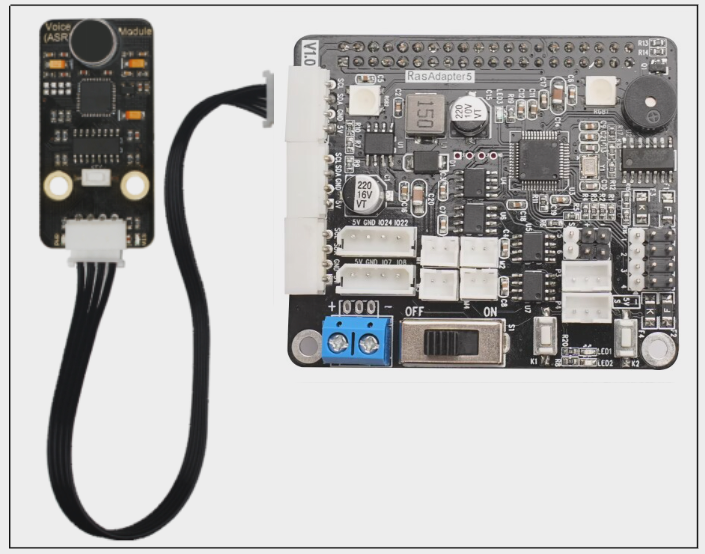

:::{Note}
4PIN线采用防反插设计，切勿硬塞。
:::

### 1.2 初识语音合成模块

- #### 1.2.1 概述

这是一款高集成度的语音合成模块，可实现中文、英文语音合成，并集成了语音编码、解码功能。

该模块可实现音量调节、智能语速、语调调节等功能，模拟真人发声效果，可助力开发者快速实现顺畅自然的智能语音交互体验，适用于搭建智能家居，制作语音控制机器人等项目。

- #### 1.2.2 工作原理

语音合成的理论基础是语音生成的数学模型。该模型语言生成过程是在激励信号的激励下，声波经谐振腔（声道），由嘴或鼻辐射声波。

语音合成模块就是模拟该数学模型，设置对应控制电路，对应控制信号控制电路中的喇叭向外辐射声波，达到模拟真人发声效果。

- #### 1.2.3 规格参数

|   工作电压    |   DC 5V    |
|:---------:|:----------:|
|   工作电流    |  29-38mA   |
|   通讯方式    |    IIC     |
|    尺寸     | 48mm×24mm  |
|   接口型号    |  5264-4AW  |
|   语种支持    |   英语/汉语    |
|   通信速率    |   最大50K    |

- #### 1.2.4 应用领域

模拟真人发声效果，可实现顺畅自然的智能语音交互体验，使其应用非常广泛，例如像智能家居、对话机器人、教育机器人、车载调度终端等方面。

- #### 1.2.5 接线方法

这里我们将语音合成模块连接在树莓派扩展板上。大家可以通过4PIN线将其连接至树莓派扩展板上的任意一个IIC接口，如下图所示：

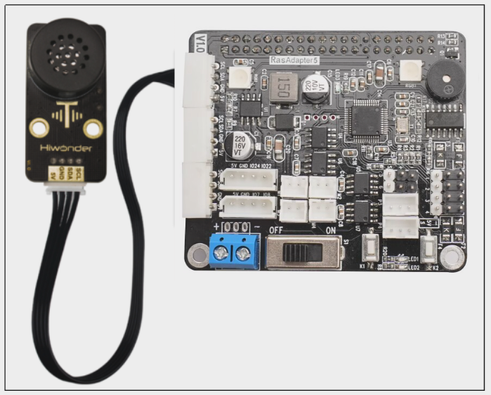

:::{Note}
4PIN线采用防反插设计，切勿硬塞。
:::

## 2. 语音模块的安装及接线

【视频】

## 3. 语音模块测试

### 3.1 树莓派语音识别实验

- #### 3.1.1 准备工作

需要准备语音识别模块，并通过4PIN线将其连接至树莓派扩展板上的任意一个IIC接口，如下图所示：

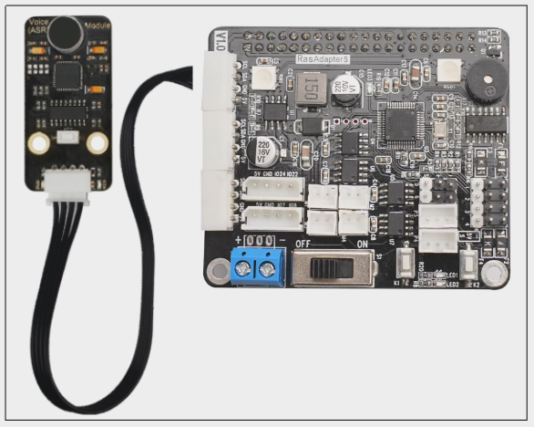

:::{Note}
4PIN线采用防反插设计，切勿硬塞。
:::

- #### 3.1.2 实现原理

语音识别模块采用IIC通信，用户只需要把识别的关键词语以字符串的形式传送进芯片，即可在下次识别中立即生效。

其算法本质是在提取输入声音的特征后，在关键词语列表中寻找一个相似度最高的词语作为识别结果。

该程序的源代码位于Docker容器中的： /home/ubuntu/armpi_fpv/src/asr_control/scripts/asr_demo.py

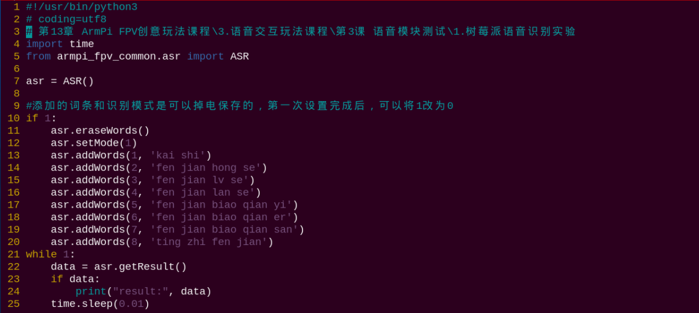

通过调用addWords()函数，可以添加所需词条。其中，括号内的第一个参数是词条序号，第二个参数是词条内容（必须为英文）。

- #### 3.1.3 玩法开启及关闭

1. 将设备开机，并参照课程资料的"**[远程工具安装及容器进入方法\1. 远程工具安装与连接](https://docs.hiwonder.com/projects/ArmPi_FPV/en/latest/docs/8.remote.html#id2)**"内容，通过VNC远程连接工具连接。


2. 点击系统桌面左上角的图标，打开Terminator终端。


3. 输入进入玩法程序所在目录的指令，按下回车键。

```commandline
cd /home/ubuntu/armpi_fpv/src/asr_control/scripts/
```

1)  输入运行玩法程序的指令，按下回车键。

```commandline
python3 asr_demo.py
```

1)  如需关闭此程序，可按下"**Ctrl+C**"。

- #### 3.1.4 功能实现

:::{Note}
建议在相对安静的环境下进行操作，说指令时声音要保持洪亮，同时要一条一条地进行，在执行完一次动作后，我们可以继续说出其它关键字。
:::

口令唤醒模式词条使用示例："**开始**"（唤醒词，必说）+"**分拣红色**"（程序设置关键词）

我们可以靠近语音识别模块的麦克风，首先要说"**开始**"（程序设置的词条）。当模块上的STA指示灯变为蓝色常亮时，我们再说出其它设置词条，例如"**分拣红色**"、"**分拣蓝色**"等。

当模块上的STA指示灯熄灭，同时会把识别的结果打印在终端界面(我们这里以"**分拣红色**"为例)。如下图所示：

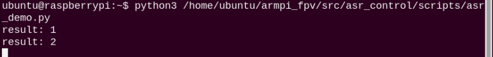

此时我们可以继续说出其它设置的关键词（但每次必须先说"**开始**"），这样语音识别模块将继续进行识别，终端继续打印识别的结果。

程序完整设置的关键字如下表所示：

| **序号** |   **唤醒词**    |
|:--------:|:------------------------------------:|
|    1     | kai shi（开始） |

| **序号** |              **关键字**              |
|:--------:|:------------------------------------:|
|    2     |     fen jian hong se（分拣红色）     |
|    3     |      fen jian lv se（分拣绿色）      |
|    4     |     fen jian lan se（分拣蓝色）      |
|    5     | fen jian biao qian yi（分拣标签一）  |
|    6     | fen jian biao qian er（分拣标签二）  |
|    7     | fen jian biao qian san（分拣标签三） |
|    8     |    ting zhi fen jian（停止分拣）     |

### 3.2 树莓派语音合成实验

- #### 3.2.1 准备工作

需要准备语音合成模块，并通过4PIN线将其连接至树莓派扩展板上的任意一个IIC接口，如下图所示：


:::{Note}
4PIN线采用防反插设计，切勿硬塞。
:::

- #### 3.2.2 实现原理

语音合成模块上带有IIC通信端口，将其连接至树莓派扩展板。扩展板可以通过IIC通信端口发送对应数据，控制语音合成模块上的喇叭发声。

该程序的源代码位于Docker容器中的： /home/ubuntu/armpi_fpv/src/asr_control/scripts/tts_demo.py

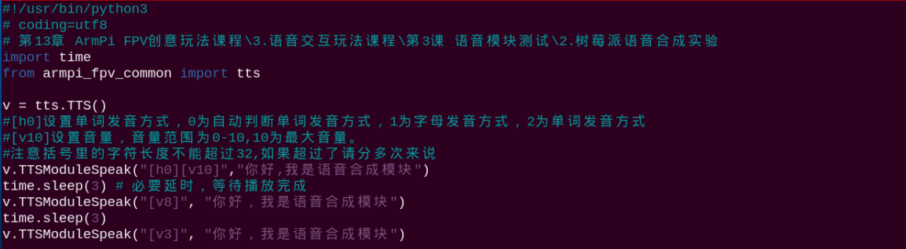

通过调用TTSModuleSpeak()函数，可以设置合成语音的具体参数。以代码"**v.TTSModuleSpeak("\[h0\]\[v10\]","你好,我是语音合成模块")**"为例，其中：

第一个参数"**\[h0\]**"用于设置单词发音方式，"0"为自动判断单词发音方式，"**1**"为字母发音方式，"**2**"为单词发音方式；

第二个参数"**\[v10\]**"用于设置音量，可设置范围是0-10，"**10**"为最大音量；

第三个参数"**你好，我是语音合成模块**"是合成语音内容。

需要注意，括号内的字符长度不可大于32。若需要合成更多语音内容，可以分为多句代码。

- #### 3.2.3 玩法开启及关闭

1. 将设备开机，并参照课程资料的"**[远程工具安装及容器进入方法\1. 远程工具安装与连接](https://docs.hiwonder.com/projects/ArmPi_FPV/en/latest/docs/8.remote.html#id2)**"内容，通过VNC远程连接工具连接。


2. 点击系统桌面左上角的图标，打开Terminator终端。


3. 输入进入玩法程序所在目录的指令，按下回车键。

```commandline
cd /home/ubuntu/armpi_fpv/src/asr_control/scripts/
```

4. 输入运行玩法程序的指令，按下回车键。

```commandline
python3 tts_demo.py
```

5. 如需关闭此程序，可按下"**Ctrl+C**"。

- #### 3.2.4 功能实现

程序启动后，语音合成模块将以三种不同的音量播放"你好，我是语音合成模块"的语音信息。

### 3.3 树莓派语音交互实验

- #### 3.3.1 准备工作

需要准备语音识别模块和语音合成模块，并通过4PIN线将它们连接至树莓派扩展板上的任意2个IIC接口，如下图所示：

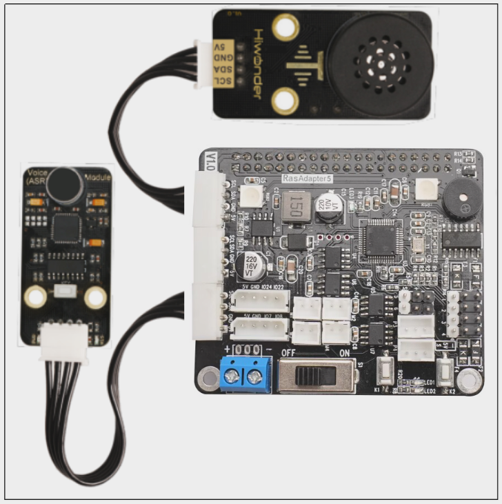

:::{Note}
4PIN线采用防反插设计，切勿硬塞。
:::

- #### 玩法开启及关闭

1. 将设备开机，并参照课程资料的"**[远程工具安装及容器进入方法\1. 远程工具安装与连接](https://docs.hiwonder.com/projects/ArmPi_FPV/en/latest/docs/8.remote.html#id2)**"内容，通过VNC远程连接工具连接。


2. 点击系统桌面左上角的图标，打开Terminator终端。


3. 输入进入玩法程序所在目录的指令，按下回车键。

```commandline
cd /home/ubuntu/armpi_fpv/src/asr_control/scripts/
```

4. 输入运行玩法程序的指令，按下回车键。

```commandline
python3 interaction.py
```

5. 如需关闭此程序，可按下"**Ctrl+C**"。

- #### 功能实现

:::{Note}
建议在相对安静的环境下进行操作，说指令时声音要保持洪亮，同时要一条一条地进行，在执行完一次动作后，我们可以继续说出其它关键字。
:::

口令唤醒模式词条使用示例："**开始**"（唤醒词，必说）+"**你好**"（程序设置关键词）

我们可以靠近语音识别模块的麦克风，首先要说"**开始**"（程序设置的词条）。当模块上的STA指示灯变为蓝色常亮时，我们再说出其它设置词条，例如"**你好**"。

当模块上的STA指示灯熄灭，语音合成模块播放"**你好，Hiwonder**"的语音信息，同时会把语音信息打印在终端界面，如下图所示：

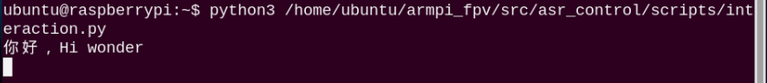

此时我们可以继续说出其它设置的关键词（但每次必须先说"开始"），这样语音识别模块将继续进行识别，语音合成模块将播放对应的语音信息，终端继续打印语音信息。

程序完整设置的关键字如下表所示：

| **序号** |   **唤醒词**    |
|:--------:|:---------------:|
|    1     | kai shi（开始） |

| **序号** | **关键字**  |    **回复**    |
|:--------:|:-----------:|:--------------:|
|    2     |   ni hao    | 你好，Hiwonder |
|    3     | ni shi shui | 我是ArmPi FPV  |

## 4.语音播报垃圾分类

### 4.1 语音播报垃圾分类

- #### 4.1.1 实验原理

本节垃圾分拣实验的实现过程包括三个部分：识别、播报、显示。

首先，需要进行颜色识别，这里使用Lab颜色空间来进行处理。先将RGB颜色空间转换为Lab，然后进行二值化处理、开运算、闭运算等操作，获得只包含红、绿、蓝、灰四种颜色的垃圾卡片轮廓，从而实现颜色的识别。

接着，用算法遍历所有获得的轮廓，得到其中面积最大的颜色垃圾卡片轮廓。 然后，开启一个语音播报的子线程，播放该卡片所示垃圾对应的垃圾种类名称。

最后，控制RGB彩灯亮起与垃圾卡片相对应的颜色灯光，并在回传画面中用对应颜色的线条将垃圾卡片框出，显示其垃圾种类名称。

- #### 4.1.2 玩法开启及关闭

:::{Note}
指令的输入需严格区分大小写，另外可按键盘"**Tab**"键进行关键词补齐。
:::

1. 将设备开机，并参照课程资料的"**[远程工具安装及容器进入方法\1. 远程工具安装与连接](https://docs.hiwonder.com/projects/ArmPi_FPV/en/latest/docs/8.remote.html#id2)**"内容，通过VNC远程连接工具连接。


2. 点击系统桌面左上角的图标，打开Terminator终端。


3. 输入进入玩法程序所在目录的指令，按下回车键。

```commandline
cd /home/ubuntu/course/vision_course/
```

1)  输入运行玩法程序的指令，按下回车键。

```commandline
python3 garbage_classification.py
```

1)  如需关闭此程序，可按下"**Ctrl+C**"。

- #### 4.1.3 功能实现

首先，将语音合成模块连接至扩展板的任意一个IIC接口。

程序开启后，机械臂切换为垃圾分拣姿态。将垃圾卡片放到摄像头的视野范围内，当摄像头识别到卡片，RGB彩灯会亮起对应颜色，语音合成模块会播报卡片图案对应的垃圾类别，同时回传画面中会框出垃圾卡片并显示垃圾种类名称。

垃圾卡片和卡片所属种类、RGB彩灯、播报语音的对应关系见下表：

| **垃圾卡片** | **垃圾种类名称** | **RGB彩灯颜色** | **播报语音** |
|:--:|:--:|:--:|:--:|
|  | Hazardous Waste | 红色 | 有害垃圾 |
|  | Food Waste | 绿色 | 厨余垃圾 |
|  | Recyclable | 蓝色 | 可回收垃圾 |
|  | Residual Waste | 灰色 | 其它垃圾 |

- #### 4.1.4 程序简要分析

该程序的源代码位于Docker容器中的： **/home/ubuntu/course/vision_course/garbage_classification.py**

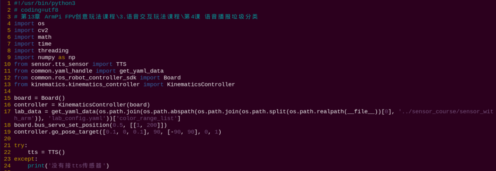

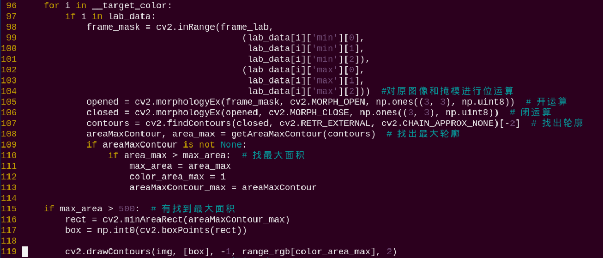

此例程主要用到cv2库内的drawContours()函数和TTS库内的TTSModuleSpeak()函数。

drawContours()函数用于绘制图像中的目标轮廓，以"**cv2.drawContours(img, \[box\], -1, range_rgb\[color_area_max\], 2)**"为例，括号内的参数含义如下：

第一个参数"**img**"是绘制轮廓的图像；

第二个参数"**\[box\]**"是获得的角点数据；

第三个参数"**-1**"是指定轮廓list内进行绘制的轮廓，此处数值代表绘制其中的所有轮廓；

第四个参数"**range_rgb\[color_area_max\]**"是轮廓颜色；

第五个参数"**2**"是轮廓线条宽度，"**-1**"代表用指定颜色填充轮廓。

TTSModuleSpeak()用于广播识别到垃圾类型。以"**tts.TTSModuleSpeak("\[h0\]\[v10\]", "有害垃圾")**"为例，括号内的参数含义如下：

第一个参数"**"\[h0\]\[v10\]\[m52\]"**"是声音设置参数。其中，"**\[h0\]**"用于设置单词发音方式，"**0**"为自动判断单词发音方式，"**1**"为字母发音方式。"**\[v10\]**"用于设置音量，可设置范围是0-10，"**10**"为最大音量。

第二个参数"**"有害垃圾"**"是播报内容。

## 5. 语音控制色块分拣

### 5.1 语音控制色块分拣

- #### 5.1.1 实验原理

人机交互是我们智能时代的趋势，与机器人进行语音交流，让机器人能够"听懂"人类的语言，并能做出正确的反馈是我们当前人机的交互目标。

这个过程分为3种技术，第一是语音识别，让机器人知道我们说什么；第二是识别到后的处理；第三是运用语音合成，也就是让机器人说话。

下面我们来看一下本节功能的实现流程：

首先，我们通过语音识别模块来识别我们设置的词条。当识别到词条后，语音合成模块会播放设置的语音词条作为反馈。

如果ArmPi FPV机械臂接收到的指令是分拣某一颜色，那么它就会对物体颜色进行识别，并将检测到的RGB数据转换为LAB数据。再经过二值化处理、膨胀腐蚀等操作，从而获得目标颜色的轮廓，实现对物体颜色的识别。

如果ArmPi FPV机械臂接收到的指令是分拣标签物品，那么它就会通过定位、图像分割、轮廓查找对标签物品进行轮廓确定。再经过四边形检测获取四个角点，将直线拟合成闭环。接着对标签进行编码和解码，从而确定标签ID，实现标签的识别。

完成识别之后，机械臂便对物体进行夹取。夹取的流程为：机械臂先移动到目标位置附近，然后爪子张开。通过计算夹持器需旋转的角度后，再降低至距目标位置合适之处。此时夹持器闭合，便可完成对物品的夹取。

最后，机械臂将夹取的物品进行分类，放置在地图上。在操作完成后机械臂会回归初始位置，语音合成模块并再次播报一次语音作为完成反馈。

该程序的源代码位于： **/home/ubuntu/armpi_fpv/src/asr_control/scripts/asr_control_sorting.py**

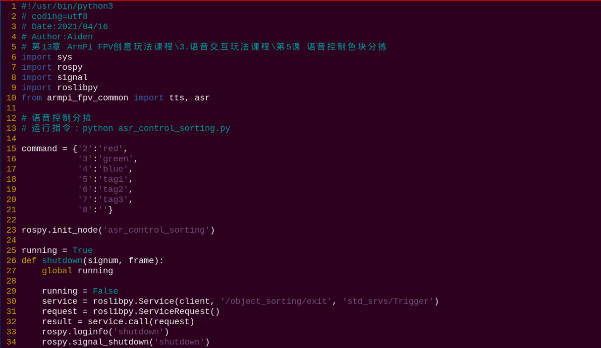

- #### 5.1.2 玩法开启及关闭

:::{Note}
指令的输入需严格区分大小写及空格。
:::

1. 将设备开机，并参照课程资料的"**[远程工具安装及容器进入方法\1. 远程工具安装与连接](https://docs.hiwonder.com/projects/ArmPi_FPV/en/latest/docs/8.remote.html#id2)**"内容，通过VNC远程连接工具连接。


2. 点击系统桌面左上角的图标，打开Terminator终端。


3. 输入指令，然后按下回车开启运动控制、相机等底层服务。

```commandline
roslaunch armpi_fpv_bringup bringup.launch
```

4. 打开新的终端，输入进入玩法程序所在目录的指令，按下回车键。

```commandline
cd /home/ubuntu/armpi_fpv/src/asr_control/scripts/
```

5. 输入指令，然后按下回车进入玩法。

```commandline
python3 asr_control_sorting.py
```

6. 如需关闭此玩法，只需要在命令行终端界面中按下"**Ctrl+C**"。如果关闭失败，可多次按下。

- #### 5.1.3 功能实现

:::{Note}
建议在相对安静的环境下进行操作，说指令时声音要保持洪亮，同时要一条一条地进行，在执行完一次动作后，我们可以继续说出其它关键字。
:::

口令唤醒模式词条使用示例："**开始**"（唤醒词，必说）+"**分拣红色**"（程序设置的关键词）

我们可以靠近语音识别模块的麦克风，首先要说"开始"（程序设置的词条）。当模块上的STA指示灯变为蓝色常亮时，我们再说出其它设置词条，例如"分拣红色"、"分拣标签一"等。

当识别到后，语音识别模块上的STA指示灯会熄灭，语音播报模块将播放"收到"的语音作为反馈，然后机械臂便进行执行一次动作。

执行完后，我们可以继续说出其它设置的关键词（但每次必须先说"开始"），这样语音识别模块将继续进行识别。

程序完整设置的关键字如下表所示：

| **序号** |   **唤醒词**    |
|:--------:|:---------------:|
|    1     | kai shi（开始） |

| **序号** |              **关键字**              |
|:--------:|:------------------------------------:|
|    2     |     fen jian hong se（分拣红色）     |
|    3     |      fen jian lv se（分拣绿色）      |
|    4     |     fen jian lan se（分拣蓝色）      |
|    5     | fen jian biao qian yi（分拣标签一）  |
|    6     | fen jian biao qian er（分拣标签二）  |
|    7     | fen jian biao qian san（分拣标签三） |
|    8     |    ting zhi fen jian（停止分拣）     |

- #### 5.1.4 功能延伸

**语音识别模块**

- 增加或修改检测词条

1)  程序中默认添加了8个关键词条，词条my_asr.addWords(1, 'kai shi')中的第一个参数是词条的编号，词条的编号需要随着词条数量进行手动依次增加；第二个参数是词条的内容，这里需要将识别的内容以拼音的形式进行添加，汉字拼音之间以空格隔开。

例如：ni hao为正确的，nihao为错误。

2)  在添加词条时，需要注意：最多可以设置50个词条识别句，词条识别句可以是单字，词组或短句，每句长度为不超过10个汉字或者79个字节的拼音串。

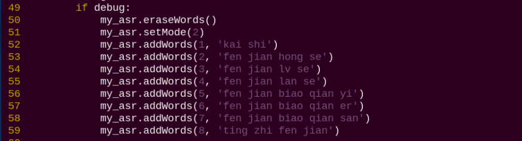

3)  如需增加或修改词条，只需按照前面词条的格式进行添加或修改就可以了。例如**我们这里增加一个搬运红色的词条**。

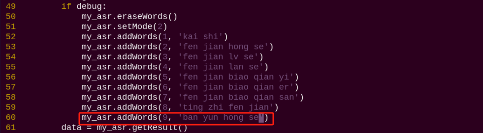

:::{Note}
这里只是增加了一个语音识别的新词条，在识别后并无任何执行动作。如需加入识别后的动作，请详细参考源码程序注释。
:::

- 修改唤醒词条

1)  程序中默认为口令模式。在口令模式下，每次执行语音识别，都需要先说出唤醒的词条，再接着说出检测的词条，机器人才会执行检测词条对应的动作。

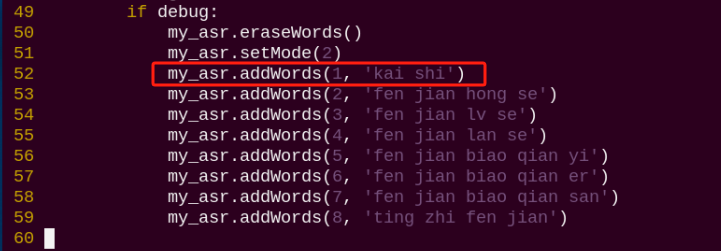

2)  程序设置词条的第一个词条作为启动语音识别的唤醒词条。如果需要修改唤醒的词条，那将第一个词条内容修改即可。例如：**我们将唤醒词修改为"准备"**，可参考下图：

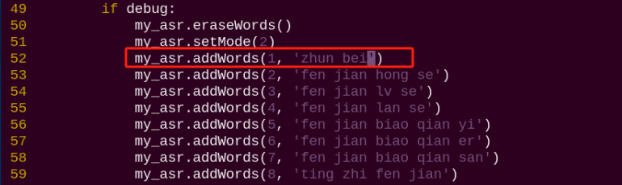

- 修改识别模式

语音识别模块支持3种语音识别模式，分别是循环识别模式、口令模式、按键模式。

1)  循环模式是让语音识别模块一直循环检测词条；

2)  口令模式是每次检测前，都需要说出第一个词条作为启动检测的口令，然后再说出检测的词条；

3)  按键模式是只有按下语音识别模块上的按键，才会开始检测词条；

4)  程序中默认设置为口令模式，即my_asr.setMode()的值为2。如果要修改语音识别的模式，可以在程序中如下位置进行修改：

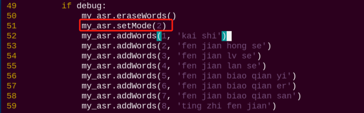

5)  如果要设置为循环模式，需要将my_asr.setMode()值修改为1；如果要设置为按键模式，需要将my_asr.setMode()值修改为3。

**语音合成模块**

- 修改播放内容

1)  程序默认播放内容是"**准备就绪**"，这里以其中一处展示：

    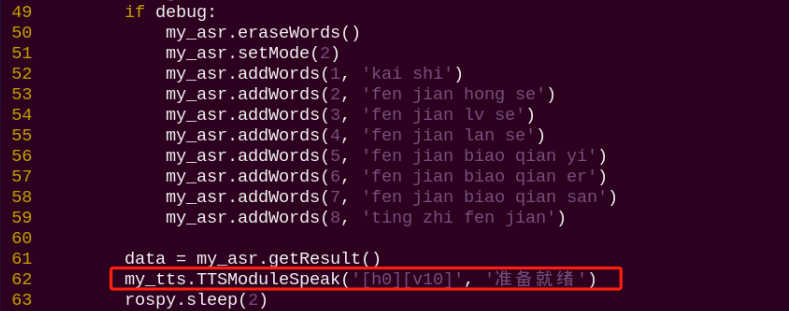

2)  如需修改播放的内容，直接修改对应的文本的内容就可以了，例如我们这里修改为"**你好 ArmPi FPV**"，如下图所示：

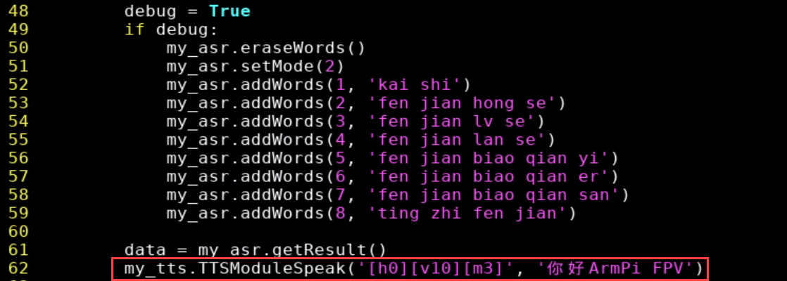

- 修改播放声音

1)  语音合成模块支持多种发音的方式控制，包括音量、语速等多种控制。

2)  设置的方式是半角中括号（即"\[\]"）内一个小写字母和一个阿拉伯数字。如程序中的这一处播放内容，参数为\[h0\]\[v10\]。分别代表自适应中英文，音量10，

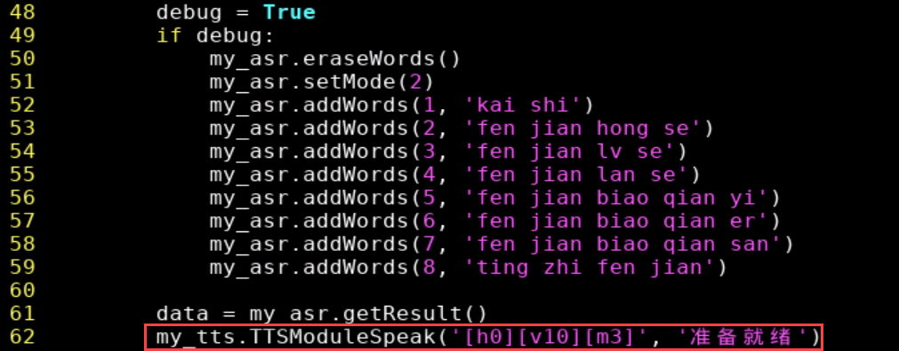

3)  如需修改，可直接将参数进行替换即可。部分参数设置可参考如下：\[v10\]设置音量，音量范围为0-10，10为最大音量。
