# 11. Group Sending Control

## 1. Action Group Calling

### 1.1 Preface

The action group files are stored in the path "/home/ubuntu/software/armpi_fpv_control/ActionGroups". There are three built-in action groups by default.

### 1.2 Start and Close the Game

(1) Power on the robot and use VNC Viewer to connect to the remote desktop.


(2) Click the icon  on the upper left corner of the desktop to open Terminator terminal.


(3) Enter command, and press Enter to switch to the PC content.

```shell
cd /home/ubuntu/software/armpi_fpv_control/
```

(4) Input command and press Enter to open this program through vim editor.

```shell
sudo vim control_demo.py
```

(5) Press "i" key to enter the program editing mode.

(6) Here calls the "grab-forward" as the example. Replace "pick" with "grab-forward" within the parentheses.

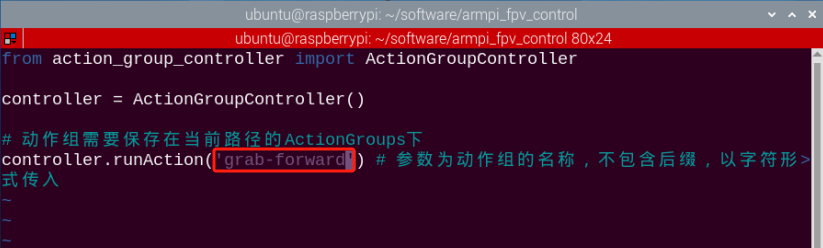

:::{Note}
The action name must be the same as the name actually stored, otherwise it may cause failure to action calling.
:::

(7) Press "Esc" to exit editing mode. Then press ":wq" again to save and exit.

````shell
:wq
````

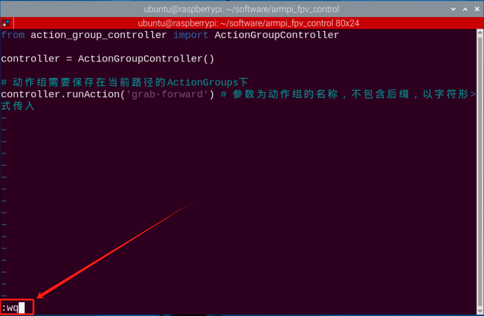

(8) Input command and press Enter.

```shell
python3 control_demo.py
```

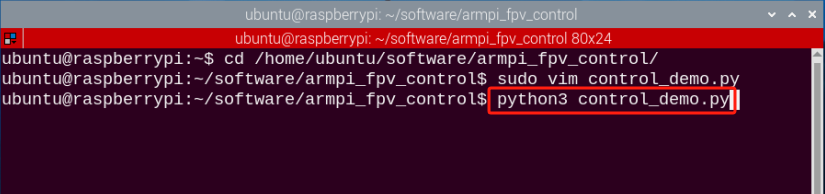

:::{Note}
When there is no action group files in the path, the prompt "The action group file cannot be found", so please make sure that the called action group is saved in the correct path.
:::

### 1.3 Outcome

After the program runs, the robotic arm will execute "grab-forward" once.

### 1.4 Function realization

If we want to make robotic arm perform multiple actions at a time, please follow the below steps to operate. Take "making robotic arm execute two built-in action groups" for example.

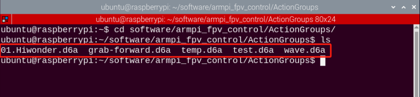

(1) Enter the command to enter the program file according to the previous operation.

```shell
sudo vim control_demo.py
```

(2) Then copy the "controller.runAction()" function. The parameters in the function must be the same as the name of the saved action file, otherwise it cannot be executed.

(3) Select the function in line 6 with the mouse. Press the "Y" key twice, and then press the "P" key to copy the above function to the next line.

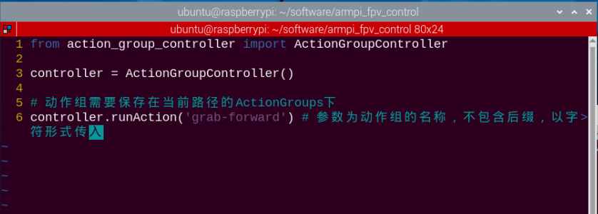

(4) Change the parameters in the function to "wave", and then save and exit. And enter the command "python3 control_demo.py" again and press Enter.

```shell
python3 control_demo.py
```

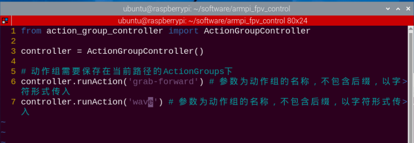

## 2. Multiple Robotic Arms Control

### 2.1 Getting Ready

(1) Please prepare at least 2 or more robotic arms. 3 robotic arms are used in this lesson for demonstration.

(2) Set development environment. Please download and install NoMachine according to "Set Development Environment".

### 2.2 Program logic 

By configuring the master and the slave in the same network, the master sends action commands to the slave through the group sending program to realize controlling the slave.

### 2.3 Operation steps

<p id="anchor_2_3_1"></p> 

**2.3.1 Check Master**

(1) Power on the robot and use VNC Viewer to connect to the remote desktop.


(2) Click the icon  on the upper left of the desktop, and press "Ctrl+Alt+T" to open the LX terminal.. Enter the command and press Enter.

```shell
cd hiwonder-toolbox
```

(3) Use the vim editor to open the Wi-Fi configuration file, enter the command, and press Enter.

```shell
sudo vim hiwonder_wifi_conf.py
```

(4) Enter the "i" key on the keyboard to enter the editing mode.

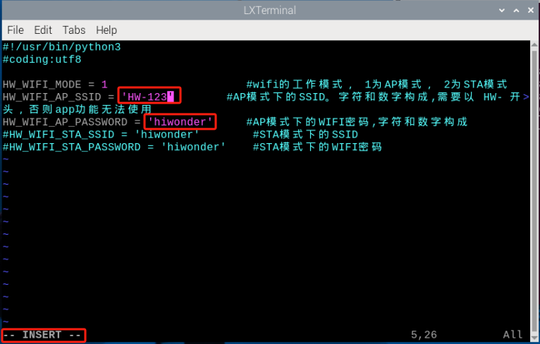

(5) After the modification is completed, press the "Esc" key to exit the editing mode. Enter ":wq" again to save and exit.

```shell
:wq
```

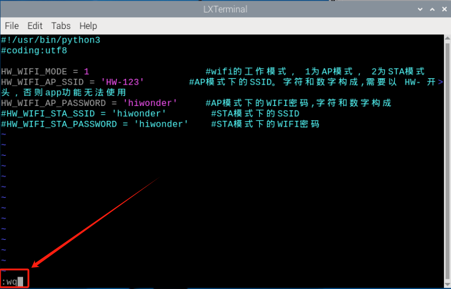

(6) Entering the command will restart the device in order for the WI-FI configuration file to take effect. This step cannot be skipped!

```shell
sudo reboo
```

**2.3.2 Configure the slave**

:::{Note}
other slave machines can be configured by referring to the following method.
:::

(1) Power on the robot and use VNC Viewer to connect to the remote desktop.


(2) Click the iconon the upper left of the desktop and press "Ctrl+Alt+T" to open the LX terminal. Input command and press Enter.

```shell
cd hiwonder-toolbox
```

(3) Use vim editor to open the Wi-Fi configuration file. Enter command and press Enter.

```shell
sudo vim hiwonder_wifi_conf.py
```

(4) Press the "i" key to enter the editing mode. Modify the code of Wi-Fi name and password as pictured:

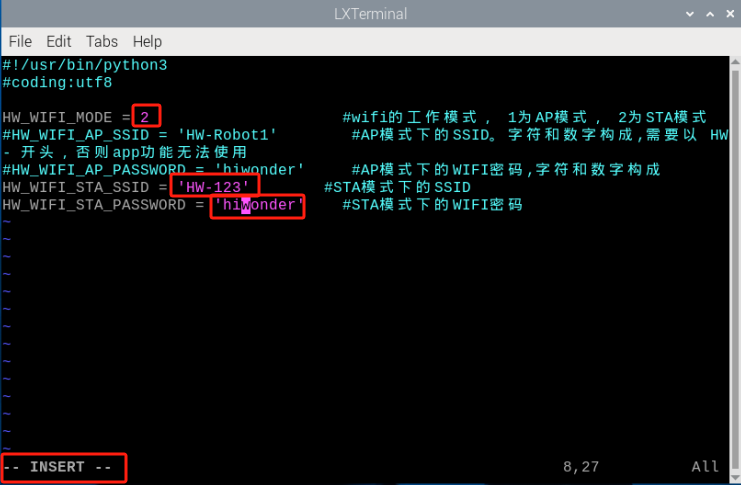

Setting the slave device's network mode to "2" means it's in LAN mode, while "HW-123" and "hiwonder" are version 2.3.1. Please check the host's configured WI-FI name and password.

(6) After the modification is completed, press the "Esc" key to exit the editing mode. Enter ":wq" again to save and exit. 

```shell
:wq
```

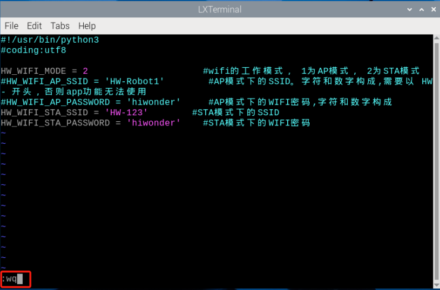

(7) Entering the command will restart the device in order for the WI-FI configuration file to take effect. This step cannot be skipped!

```shell
sudo reboot
```

**2.3.3 Group sending control**

:::{Note}
In group sending control, the slave machine needs to wait for the master to start successfully before turning it on.
:::

(1) Power on the robot and use VNC Viewer to connect to the remote desktop.


(2) Click the iconon the upper left corner of the desktop and open Terminator terminal.


(3) Enter command and press Enter to close the APP auto-open service.

```shell
sudo ./.stop_ros.sh
```

(4) Enter command and press Enter to open movement control, camera and underlying service.

```shell
roslaunch armpi_fpv_bringup bringup.launch
```

(5) Referring to 'Step 2', open a new terminal and type the command, then press enter to control the robotic arm. Once successfully entered, it will display the IDs of the master and slave as shown in the figure below:

```shell
rosrun multi_control master.py
```

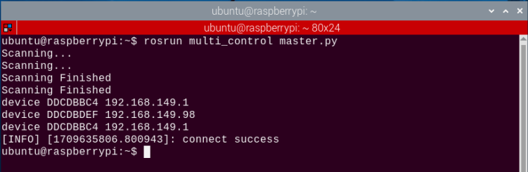

Press "Ctrl+C" to close the program.

(6) Click on the terminal iconlocated at the top left corner of the desktop (Note: Commands need to be entered in the system path, not in the Docker container to start the APP service). Input the following command in the system path: "sudo systemctl restart start_node.service" and press enter to start the APP service. Wait for the robotic arm to return to its initial position, indicated by a single beep from the buzzer.

```shell
sudo systemctl restart start_node.service
```

### 2.4 Outcome

After the program is started, the slave robot arm will execute the same action group at the same time as the master robot arm.
