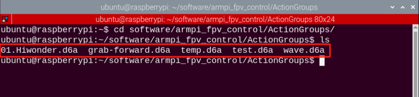

# 群发控制课程

## 1.命令调用动作组

### 1.1 学前须知

动作组文件储存在"**/home/ubuntu/software/armpi_fpv_control/ActionGroups**"路径下，默认提供三个内置动作组。

### 1.2 玩法开启及关闭

1. 将设备开机，并参照课程资料的"**[远程工具安装及容器进入方法\1. 远程工具安装与连接]()**"内容，通过VNC远程连接工具连接。


2. 点击系统桌面左上角的图标，打开Terminator终端。


3. 输入指令，按下回车切换到上位机所在目录内。

```commandline
cd /home/ubuntu/software/armpi_fpv_control/
```

4.  输入指令，按下回车，通过vim编辑器打开该程序。

```commandline
sudo vim control_demo.py
```

5. 然后按下键盘上的"**i**"键进入程序编辑模式


6. 这里以调用"**grab-forward**"为例。将括号内的"**pick**"替换为"**grab-forward**"。


:::{Note}
动作名称要与实际存储的名称一致，否则将调用失败！
:::

7. 按下"**Esc**"键，退出编辑模式，再输入指令保存并退出。

````commandline
:wq
````


8.  输入指令，按下回车

```commandline
python3 control_demo.py
```


:::{Note}
当路径下不存在动作组文件时，终端会显示"未能找到动作组文件"的提示。因此请确保被调用的动作组保存在正确路径下。
:::

### 1.3 实现效果

程序开启后，机械臂将执行"**grab-forward**"动作1次。

### 1.4 拓展延伸

如果我们想单次执行多个动作，可通过以下步骤来实现。这里以依次执行内置的两个动作组为例。示例动作组如下图所示：



1)  先按照前面的操作输入指令进入程序文件。

```commandline
sudo vim control_demo.py
```

2. 然后将"**controller.runAction()**"函数进行复制，函数内参数要与保存的动作文件名称相同，否则无法执行。

3. 鼠标选中第6行的函数，按"**Y**"键两次，然后按下"**P**"键，将上面的函数复制到下行。


4. 将函数内的参数修改为"**wave**"，保存并退出，再次输入指令回车即可。

```commandline
python3 control_demo.py
```


## 2. 多台机械臂控制

### 2.1 准备工作

1)  至少准备2台及以上的机械臂（本节课以3台机械臂为例进行示范）。

2)  开发环境搭建。参照"**[远程工具安装及容器进入方法\1. 远程工具安装与连接]()**"，下载并安装远程连接工具VNC。

 该程序的源代码位于Docker容器中的：/home/ubuntu/armpi_fpv/src/multi_control/scripts/master.py


### 2.2 实现原理

通过将主机与从机配置在同一个网络内，主机通过群发程序向从机发送动作指令，达到控制从机的效果。

### 2.3 玩法开启及关闭

<p id="anchor_2_3_1"></p> 

- #### 2.3.1 查看主机

1. 选取一台机械臂作为主机，将设备开机，并参照课程资料的"**[远程工具安装及容器进入方法\1. 远程工具安装与连接]()**"内容，通过VNC远程连接工具连接。


2. 单击系统桌面左上角的图标，或按下快捷键"**Ctrl+Alt+T**"打开LX终端打输入指令，按下回车。

```commandline
cd hiwonder-toolbox
```

3. 使用vim编辑器打开Wi-Fi 配置文件，输入指令，按下回车。

```commandline
sudo vim hiwonder_wifi_conf.py
```

4. 输入键盘上的"**i**"键，进入编辑模式，将WI-FI名称和密码这两行代码改成如下图所示。


5. 修改完成之后，按下"**Esc**"键，退出编辑模式。再输入指令保存并退出。

```commandline
:wq
```


6. 输入命令将设备重启，才能让WI-FI配置文件生效。（此步不可跳过！）

```commandline
sudo reboo
```

- #### 2.3.2 配置从机

:::{Note}
这里以单台从机操作为例进行说明，其余从机可参考同样的方法进行配置。
:::

1. 选取一台机械臂作为从机，将设备开机，并参照课程资料的"**[远程工具安装及容器进入方法\1. 远程工具安装与连接]()**"内容，通过VNC远程连接工具连接。


2. 单击系统桌面左上角的图标，或按下快捷键"**Ctrl+Alt+T**"打开LX终端打输入指令，按下回车。

```commandline
cd hiwonder-toolbox
```

3. 使用vim编辑器打开Wi-Fi 配置文件，输入指令，按下回车。

```commandline
sudo vim hiwonder_wifi_conf.py
```

4. 输入键盘上的"**i**"键，进入编辑模式，将WI-FI名称和密码这两行代码改成如下图所示。


将从机的网络模式设置为"**2**"即为局域网模式，"**HW-123**"和"**hiwonder**"则为[查看主机](#anchor_2_3_1)设置的主机WI-FI名称和密码。

5. 修改完成之后，按下"**Esc**"键，退出编辑模式。再输入指令保存并退出。

```commandline
:wq
```


6. 输入命令将设备重启，才能让WI-FI配置文件生效。（此步不可跳过！）

```commandline
sudo reboot
```

- #### 2.3.3 群发控制

:::{Note}
群发控制时，从机需等待主机开机成功后再开启。
:::

1. 将设备开机，并参照课程资料的"**[远程工具安装及容器进入方法\1. 远程工具安装与连接]()**"内容，通过VNC远程连接工具连接。


2. 点击系统桌面左上角的图标，打开Terminator终端。


3. 输入指令按下回车，关闭手机APP自启服务。

```commandline
sudo ./.stop_ros.sh
```

4. 输入指令，然后按下回车开启运动控制、相机等底层服务。

```commandline
roslaunch armpi_fpv_bringup bringup.launch
```

5. 打开新的终端，输入指令，然后按下回车控制机械臂。当成功进入后，会显示主机和从机的ID。如下图所示：

```commandline
rosrun multi_control master.py
```


如需关闭程序，按下"**Ctrl+C**"即可。

6)  点击桌面左上角终端图标（**注意：需要在系统路径下输入指令，而不是在docker容器中输入开启APP服务的指令**），在系统路径下输入按下回车，启动APP服务，等待机械臂恢复至初始姿态，蜂鸣器"滴"一声即可。

```commandline
sudo systemctl restart start_node.service
```

### 2.4 实现效果

程序启动后，从机机械臂将与主机机械臂同时执行同样的动作组。
