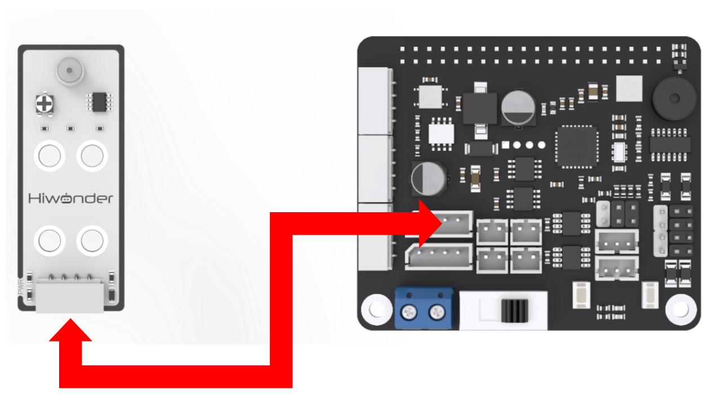
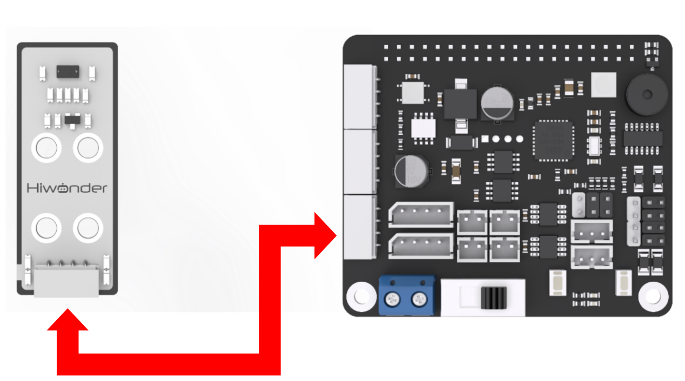
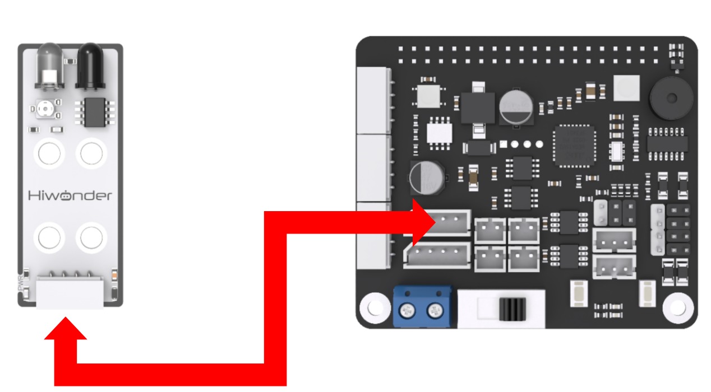
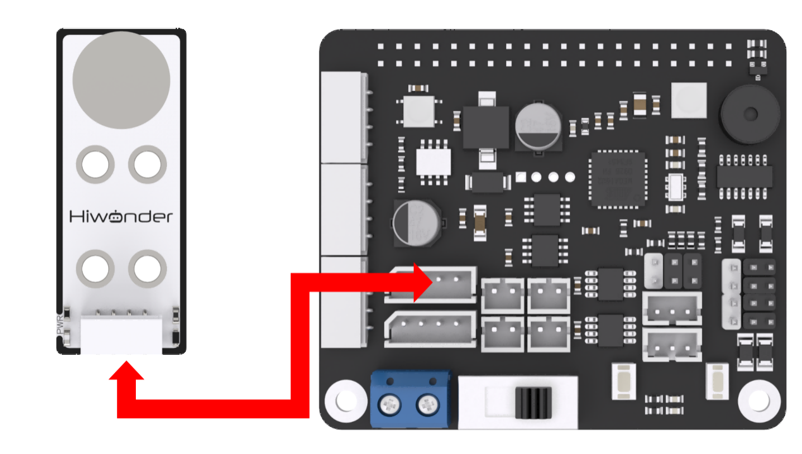
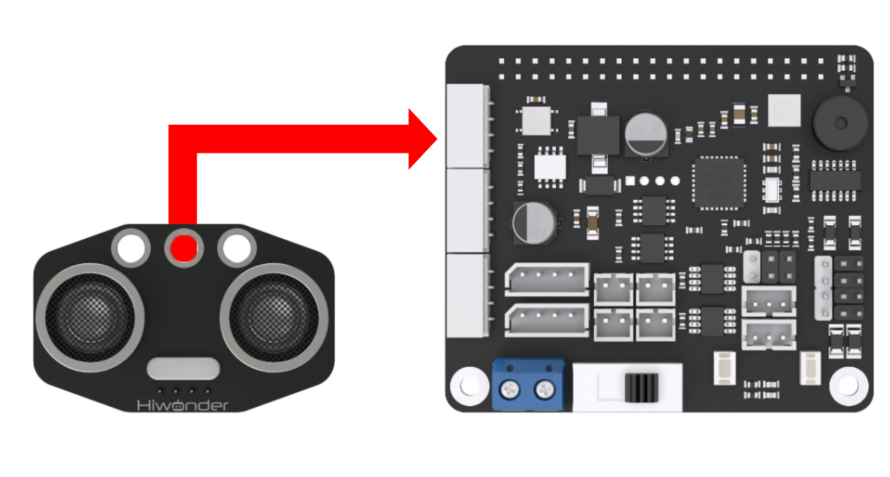
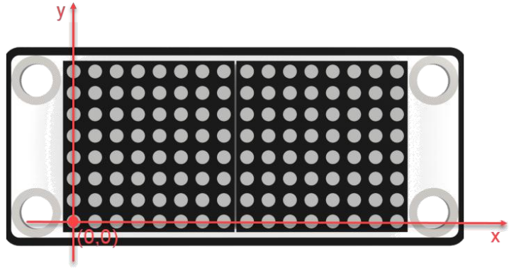
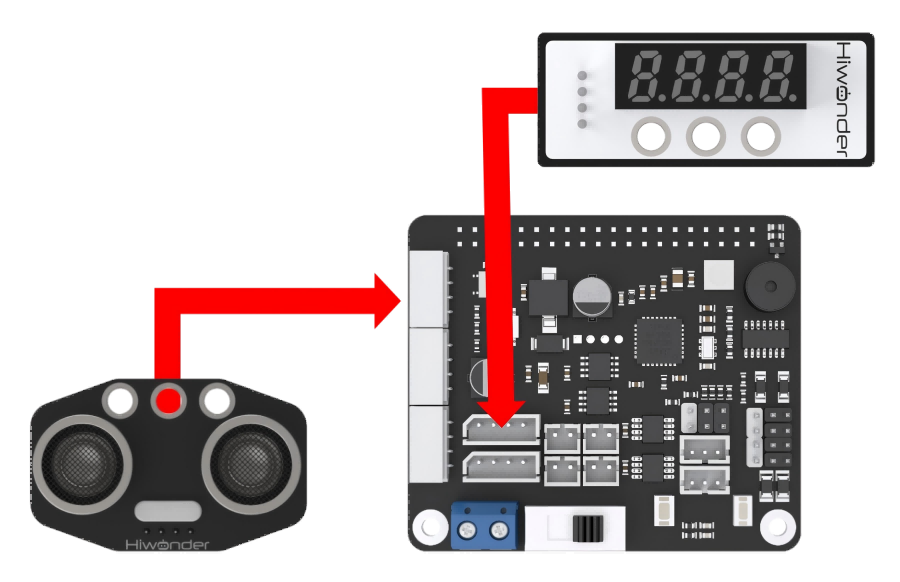
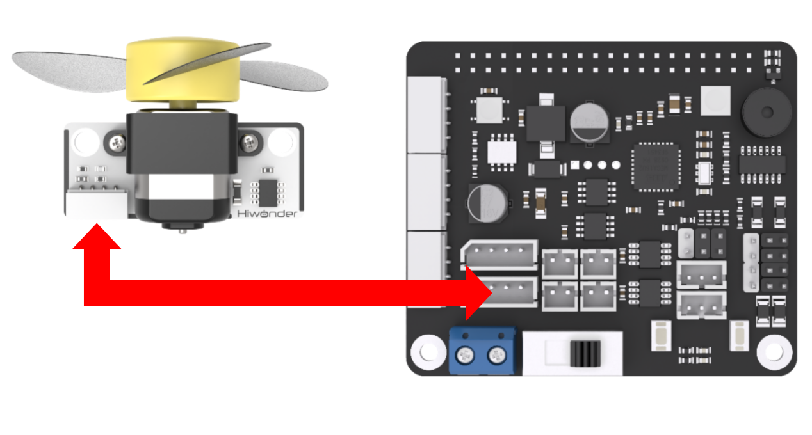

# 11. Sensor Basic Development Course

## 11.1 Light Sensor

### 11.1.1  Preparation

According to the below picture, please connect the light sensor to **"5V GND IO24 IO22"** interface on RaspberryPi expansion board through 4PIN wire.



:::{Note}
4PIN wire adopts anti-reverse plug design. Please do not insert violently.
:::

### 11.1.2 Sensor description

This light sensor mainly includes QT523C photodiode and LM358 chip voltage comparator. When in use, its threshold can be adjusted by rotating the potentiometer on the sensor.
When the external brightness exceeds the set threshold, the LED1 on the sensor lights up, and the signal terminal OUT outputs a low level. When the brightness does not exceed the set threshold, the LED1 on the sensor goes out, and the signal terminal OUT outputs a high level.
This sensor is usually applicable in roadside lighting automatic control system and surrounding monitor system.

### 11.1.3 Start and Close the Game

:::{Note}
The entered command must be strictly distinguished between uppercase and lowercase and spaces, and the keywords support the "TAB" key completing.
:::

(1) Power on the robot and use VNC Viewer to connect to the remote desktop.


(2) Click the icon  on the upper-left of the desktop, and open Terminator terminal.

(3) Enter command and press Enter to close app self-starter service.

```bash
sudo ./.stop_ros.sh
```

(4) Enter command and press Enter.

```bash
cd /home/ubuntu/course/sensor_course/sensor_examples
```

(5) Enter command and press Enter.

```bash
python3 light_sensor.py
```

(6) If want to close this program, press "Ctrl+C". If it cannot be closed, please try again.

(7) Click terminal icon  on the upper-left of the desktop. Note: it is needed to input command in system path, rather than input app service command in the docker container. Input "sudo systemctl restart start_node.service" in the system path and press Enter to start APP service. Wait for a moment until the robotic arm return to the initial posture and the buzzer emits "Di" for one time.

```bash
sudo systemctl restart start_node.service
```

### 11.1.4 Program Outcome

After the program starts, if the sensor is in black environment, its indicator will go out. When it is placed in well-lit environment, the indicator will light up, and the buzzer will sound for 0.1s once.

### 11.1.5 Program Analysis

The sensor first converts the optical signal into an electrical signal, then converts the electrical signal into a voltage of 0-5V, and finally the voltage is received by data collector through A/D converter. The greater the brightness intensity of the outside world, the smaller the output voltage. According to this feature, set the buzzer to give feedback. When the voltage value is less than the set threshold, the buzzer will sound.

The source code of this program lies in **[/home/ubuntu/course/sensor_course/sensor_examples/light_sensor.py](https://store.hiwonder.com.cn/docs/amrpi_fpv/source_code/sensor_basic_development/light_sensor.zip)**

Imported "time""gpiod" modules and custom module "Board". Then, created a Board object and initialized objects related to GPIO, including GPIO(chip), and the GPIO pins for the light sensor (light). The light sensor is set as an input direction.

Using a "while True" loop to continuously perform light detection. First, read the value of the light sensor. If light is detected, delay for 0.05 seconds. Then, read the value of the light sensor again. If light is still detected, check if it was previously dark (dark is False). If so, set dark to True to indicate that the light has dimmed. Then, call the "set_buzzer" method of the board object to set the frequency, duration, and volume of the buzzer.

## 11.2 Color Control

### 11.2.1 Preparation

According to the below picture, please connect the color sensor to any IIC interface on RaspberryPi expansion board through 4PIN wire.



:::{Note}
4PIN wire adopts anti-reverse plug design. Please do not insert violently.
:::

### 11.2.2 Sensor description

This color sensor mainly adopts the APDS9960 element, which can not only recognize the color of the object, but also involve various functions such as ambient brightness detection, object proximity detection and non-contact gesture detection.

RGB color detection integrated inside the sensor can recognize a variety of object colors. Ambient light detection can detect light intensity under various conditions. The sensor integrates infrared LED lights, which can realize object proximity detection.

The color sensor realizes color detection by measuring the reflectance ratio of the three primary colors of the color of the object. The amount of light that is reflected or absorbed depends on the color of the object, so the color signal can be identified.

### 11.2.3 Start and Close the Game

:::{Note}
The entered command must be strictly distinguished between uppercase and lowercase and spaces, and the keywords support the "TAB" key completing.
:::

(1) Power on the robot and use VNC Viewer to connect to the remote desktop.


(2) Click the icon  on the upper-left of the desktop, and open Terminator terminal.

(3) Enter command and press Enter to close app self-starter service.

```bash
sudo ./.stop_ros.sh
```

(4) Enter command and press Enter.

```bash
cd /home/ubuntu/course/sensor_course/sensor_examples
```

(5) Enter command and press Enter.

```bash
python3 color_sensor.py
```

(6) If want to close this program, press "Ctrl+C". If it cannot be closed, please try again.

(7) Click terminal icon  on the upper-left of the desktop.

:::{Note}

it is needed to input command in system path, rather than input app service command in the docker container. Input "sudo systemctl restart start_node.service" in the system path and press Enter to start APP service. Wait for a moment until the robotic arm return to the initial posture and the buzzer emits "Di" for one time.

:::

```bash
sudo systemctl restart start_node.service
```

### 11.2.4 Program Outcome

There are three built-in recognition colors, including red, green and blue. After the game starts, sensor will recognize different color. The display effect is as follow.

| **Recognition color** | **Color of RGB colored light** | **Display content** |
| :-------------------: | :----------------------------: | :-----------------: |
|          Red          |              Red               |         red         |
|         Green         |             Green              |        green        |
|         Blue          |              Blue              |        blue         |
|     Other colors      |             White              |        None         |

### 11.2.5 Program Analysis

Firstly, read the channel value of three colors. According to the range of color value, determine the color of the object. Then set the RGB light on expansion board to illustrate in corresponding color. 

The source code of this program lies in  **[/home/ubuntu/course/sensor_course/sensor_examples/color_sensor.py](https://store.hiwonder.com.cn/docs/amrpi_fpv/source_code/sensor_basic_development/color_sensor.zip)**

Color channel reading function of the apds9960 module is mainly used in controlling color sensor.

red = apds.readRedLight() function is used to read color value of "R" channel.

green = apds.readGreenLight() function is used to read color value of "G" channel.

blue = apds.readBlueLight() function is used to read color value of "B" channel.

## 11.3 Infrared Obstacle Avoidance Sensor

### 11.3.1 Preparation

According to the below picture, please connect the infrared obstacle avoidance sensor to **"5V GND IO24 IO22"** interface on RaspberryPi expansion board through 4PIN wire.



:::{Note}
4PIN wire adopts anti-reverse plug design. Please do not insert violently.
:::

### 11.3.2 Sensor description

The infrared obstacle avoidance sensor has a pair of infrared transmitting tube and infrared receiving tube. Once the sensor encounters an obstacle, the infrared light will be reflected back and received by the receiving tube.

There is also a miniature potentiometer on the sensor. We can adjust the detection distance of the sensor by rotating the potentiometer. When the LED1 light on the sensor is between off and on, the detection distance of the sensor is the largest.

The infrared obstacle avoidance sensor is widely used in different scenes, mainly used in the obstacle avoidance function of robots and smart cars.

### 11.3.3 Start and Close the Game

:::{Note}
The entered command must be strictly distinguished between uppercase and lowercase and spaces, and the keywords support the "TAB" key completing.
:::

(1) Power on the robot and use VNC Viewer to connect to the remote desktop.


(2) Click the icon  on the upper-left of the desktop, and open Terminator terminal.

(3) Enter command and press Enter to close app self-starter service.

```bash
sudo ./.stop_ros.sh
```

(4) Enter command and press Enter.

```bash
cd /home/ubuntu/course/sensor_course/sensor_examples/
```

(5) Enter command and press Enter.

```bash
python3 infrared_obstacle_avoidance.py
```

(6) If want to close this program, press "Ctrl+C". If it cannot be closed, please try again.

(7) Click terminal icon  on the upper-left of the desktop. Note: it is needed to input command in system path, rather than input app service command in the docker container. Input "sudo systemctl restart start_node.service" in the system path and press Enter to start APP service. Wait for a moment until the robotic arm return to the initial posture and the buzzer emits "Di" for one time.

```bash
sudo systemctl restart start_node.service
```

### 11.3.4 Program Outcome

After the game starts, the buzzer will sound if the infrared obstacle avoidance sensor recognize there is obstacle ahead, and the indicator will light up. Otherwise, the buzzer will keep silent and the indicator will go out.

### 11.3.5 Program Analysis

Firstly, read the signal of OUT terminal to judge whether there is obstacle ahead. Then set the buzzer to sound when there is obstacle ahead. Besides, there is mini potentiometer on the sensor, and you can adjust the detection distance of the sensor through rotating it.
When the LED1 light on the sensor is between off and on, the detection distance of the sensor is the largest.

The source code of this program is stored in : **[/home/ubuntu/course/sensor_course/sensor_examples/infrared_obstacle_avoidance.py](https://store.hiwonder.com.cn/docs/amrpi_fpv/source_code/sensor_basic_development/infrared_obstacle_avoidance.zip)**

Imported "time""gpiod" modules and custom module "Board". Then, created a Board object and initialized objects related to GPIO, including GPIO(chip), and the GPIO pins for the infrared obstacle avoidance sensor.. The light sensor is set as an input direction.

Using a "while True" loop to continuously perform infrared obstacle avoidance detection. First, read the pin value of the infrared obstacle avoidance sensor. If the infrared obstacle avoidance sensor detects an obstacle ahead, delay for 0.05 seconds. Then, read the value of the infrared obstacle avoidance sensor again. If an obstacle is still detected ahead, the buzzer will sound and the indicator light will illuminate. Otherwise, the buzzer remains silent and the indicator light is turned off.

## 11.4 Touch Sensor

### 11.4.1 Preparation

According to the below picture, please connect the touch sensor to "5V GND IO24 IO22" interface on RaspberryPi expansion board through 4PIN wire.



:::{Note}
4PIN wire adopts anti-reverse plug design. Please do not insert violently.
:::

### 11.4.2 Sensor description

The touch sensor is based on the principle of capacitive sensing. The touch on gold-plated contact surface by human or metal collision can be sensed. In addition, the contact through a certain thickness of plastic, paper and other materials can also be sensed. And the sensitivity is related to the size of the contact surface and the thickness of the covering material.

It is applicable in switch control, such as light switch and doorbell touch buttons.The holes on the module are compatible with Lego for more creative DIY designs.

### 11.4.3 Start and Close the Game

:::{Note}
The entered command must be strictly distinguished between uppercase and lowercase and spaces, and the keywords support the "TAB" key completing.
:::

(1) Power on the robot and use VNC Viewer to connect to the remote desktop.


(2) Click the icon  on the upper-left of the desktop, and open Terminator terminal.

(3) Enter command and press Enter to close app self-starter service.

```bash
sudo ./.stop_ros.sh
```

(4) Enter command and press Enter.

```bash
cd /home/ubuntu/course/sensor_course/sensor_examples/
```

(5) Enter command and press Enter.

```bash
python3 touch_sensor.py
```

(6) If want to close this program, press "Ctrl+C". If it cannot be closed, please try again.

(7) Click terminal icon  on the upper-left of the desktop. Note: it is needed to input command in system path, rather than input app service command in the docker container. Input "sudo systemctl restart start_node.service" in the system path and press Enter to start APP service. Wait for a moment until the robotic arm return to the initial posture and the buzzer emits "Di" for one time.

```bash
sudo systemctl restart start_node.service
```

### 11.4.4 Program Outcome

After the game starts, when the contact surface of the touch sensor is touched once, the buzzer will sound once as feedback.

### 11.4.5 Program Analysis

Set the buzzer to sound once when the gold-plated contact surface of touch sensor is touched. When the surface is not touched, the buzzer will not sound.
The source code of this program lies in  **[/home/ubuntu/course/sensor_course/sensor_examples/touch_sensor.py](https://store.hiwonder.com.cn/docs/amrpi_fpv/source_code/sensor_basic_development/touch_sensor.zip)**

Created a Board object from the "common.ros_robot_controller_sdk" module, used for communication with the expansion board.

Next, initialized a GPIO object "chip" using the "gpiod.chip" function, and obtained a GPIO pin object "touch" using the "get_line" method. This GPIO pin is connected to the touch sensor.

Then, set "touch" as input direction.

The following code continuously reads the value of the touch sensor within the loop. If the value of the touch sensor is 0 (touched), it waits for a period of time (0.05 seconds) before checking the value of the touch sensor again to avoid false triggering. If the value of the touch sensor remains 0 and the touch sensor was not pressed previously (pressed is False), it sets "pressed" to "True" and calls the "board.set_buzzer" method to trigger the buzzer sound.
If the value of the touch sensor is not 0, it sets "pressed" to "False", indicating the touch sensor has been released.

<p id="anchor_11_5"></p>

## 11.5 Glowing Ultrasonic Sensor

### 11.5.1 Preparation

According to the below picture, please connect the ultrasonic sensor to any IIC interface on RaspberryPi expansion board through 4PIN wire.



:::{Note}
4PIN wire adopts anti-reverse plug design. Please do not insert violently.
:::

### 11.5.2 Sensor description

The ultrasonic sensor adopts an industrial-grade ultrasonic ranging chip, which integrates an ultrasonic transmitting circuit, an ultrasonic receiving circuit, and a digital processing circuit. The sensor adopts the IIC communication interface, which can read the distance measured by the ultrasonic sensor through the IIC communication.
At the same time, two RGB lights are integrated in ultrasonic probe, which can not only adjust the brightness of the light, but also realize colors changing  by changing the three color channels of red (R), green (G), and blue (B) and superimposing them on each other. 

### 11.5.3 Start and Close the Game

:::{Note}
The entered command must be strictly distinguished between uppercase and lowercase and spaces, and the keywords support the "TAB" key completing.
:::

(1) Power on the robot and use VNC Viewer to connect to the remote desktop.


(2) Click the icon  on the upper-left of the desktop, and open Terminator terminal.

(3) Enter command and press Enter to close app self-starter service.

```bash
sudo ./.stop_ros.sh
```

(4) Enter command and press Enter.

```bash
cd /home/ubuntu/course/sensor_course/sensor_examples/
```

(5) Enter command and press Enter.

```bash
python3 ultrasonic_sensor.py
```

(6) If want to close this program, press "Ctrl+C". If it cannot be closed, please try again.

(7) Click terminal icon  on the upper-left of the desktop. Note: it is needed to input command in system path, rather than input app service command in the docker container. Input "sudo systemctl restart start_node.service" in the system path and press Enter to start APP service. Wait for a moment until the robotic arm return to the initial posture and the buzzer emits "Di" for one time.

```bash
sudo systemctl restart start_node.service
```

### 11.5.4 Program Outcome

After the program runs, the distance measured by ultrasonic sensor will be displayed on the terminal. When the distance is more than 15cm, buzzer will sound once. Otherwise, the buzzer will keep silent.

### 11.5.5 Program Analysis

Besides the function of ranging, glowing ultrasonic sensor involves RGB colored light. Control the RGB to light up or go out through the change of the high and low level. And change the color value to control the light color. 
The source code of this program lies in **[/home/ubuntu/course/sensor_course/sensor_examples/ultrasonic_sensor.py](https://store.hiwonder.com.cn/docs/amrpi_fpv/source_code/sensor_basic_development/ultrasonic_sensor.zip)**

ultrasonic_sensor() function in sensor module is mainly used in controlling the glowing ultrasonic sensor. This function is used to obtain the original distance, measured by ultrasonic sensor, of the obstacle.

## 11.6 Glowing Ultrasonic RGB Controlling

### 11.6.1 Preparation

According to the below picture, please connect the ultrasonic sensor to any IIC interface on RaspberryPi expansion board through 4PIN wire.


:::{Note}
4PIN wire adopts anti-reverse plug design. Please do not insert violently.
:::

### 11.6.2 Sensor description

The ultrasonic sensor adopts an industrial-grade ultrasonic ranging chip, which integrates an ultrasonic transmitting circuit, an ultrasonic receiving circuit, and a digital processing circuit. The sensor adopts the IIC communication interface, which can read the distance measured by the ultrasonic sensor through the IIC communication.
At the same time, two RGB lights are integrated in ultrasonic probe, which can not only adjust the brightness of the light, but also realize colors changing  by changing the three color channels of red (R), green (G), and blue (B) and superimposing them on each other.

### 11.6.3 Start and Close the Game

:::{Note}
The entered command must be strictly distinguished between uppercase and lowercase and spaces, and the keywords support the "TAB" key completing.
:::

(1) Power on the robot and use VNC Viewer to connect to the remote desktop.


(2) Click the icon  on the upper-left of the desktop, and open Terminator terminal.

(3) Enter command and press Enter to close app self-starter service.

```bash
sudo ./.stop_ros.sh
```

(4) Enter command and press Enter.

```bash
cd /home/ubuntu/course/sensor_course/sensor_examples/
```

(5) Enter command and press Enter.

```bash
python3 ultrasonic_rgb.py
```

(6) If want to close this program, press "Ctrl+C". If it cannot be closed, please try again.

(7) Click terminal icon  on the upper-left of the desktop. 

:::{Note}

it is needed to input command in system path, rather than input app service command in the docker container. Input "sudo systemctl restart start_node.service" in the system path and press Enter to start APP service. Wait for a moment until the robotic arm return to the initial posture and the buzzer emits "Di" for one time.

:::

```bash
sudo systemctl restart start_node.service
```

### 11.6.4 Program Outcome

After the game starts, RGB colored light of glowing ultrasonic sensor will illuminate in different color in loop.

### 11.6.5 Program Analysis

Besides the function of ranging, glowing ultrasonic sensor involves RGB colored light. Control the RGB to light up or go out through the change of the high and low level. And change the color value to control the light color.
The source code of this program lies in **[/home/ubuntu/course/sensor_course/sensor_examples/ultrasonic_rgb.py](https://store.hiwonder.com.cn/docs/amrpi_fpv/source_code/sensor_basic_development/ultrasonic_rgb.zip)**

`setRGBMode()`, `setRGB()` and `startSymphony()` function in GPIO module are mainly used to control the RGB of glowing ultrasonic sensor.

`setRGBMode()` function is used to set the mode of RGB colored light. `0` is colored light mode, and `1` is breathing light mode.

`setRGB()` function is used to set the color of RGB colored light. Take code `s.setRGB(1, (255,0,0))` for example. The meanings of the parameters in bracket are as follow. 

The first parameter `1` is the serial number of RGB colored light of ultrasonic sensor. `0` is left RGB colored light and `1` is right RGB colored light.

The second parameter `(255,0,0)` is color of the RGB colored light. The parameter in bracket respectively are the value of R, G and B channel. The color of RGB here is red. 

setBreathCycle() function is used to set the gradient color mode of the RGB light.

## 11.7 Dot Matrix Module Display

### 11.7.1 Preparation

According to the below picture, please connect the dot matrix module to "**5V GND IO24 IO22**" interface on RaspberryPi expansion board through 4PIN wire.


:::{Note}
4PIN wire adopts anti-reverse plug design. Please do not insert violently.
:::

### 11.7.2 Module description

The dot matrix module is composed of 8x8 LED dot matrix screen. Through driving the control ship, you can control the dot matrix screen. It features high display brightness, no flicker when displaying, convenient wiring, etc., and can display digital, text, pattern and other contents.

### 11.7.3 Start and Close the Game

:::{Note}
The entered command must be strictly distinguished between uppercase and lowercase and spaces, and the keywords support the "TAB" key completing.
:::

(1) Power on the robot and use VNC Viewer to connect to the remote desktop.


(2) Click the icon  on the upper-left of the desktop, and open Terminator terminal.

(3) Enter command and press Enter to close app self-starter service.

```bash
sudo ./.stop_ros.sh
```

(4) Enter command and press Enter.

```bash
cd /home/ubuntu/course/sensor_course/sensor_examples/
```

(5) Enter command and press Enter.

```bash
python3 dot_matrix_module.py
```

(6) If want to close this program, press "Ctrl+C". If it cannot be closed, please try again.

(7) Click terminal icon  on the upper-left of the desktop. Note: it is needed to input command in system path, rather than input app service command in the docker container. Input "sudo systemctl restart start_node.service" in the system path and press Enter to start APP service. Wait for a moment until the robotic arm return to the initial posture and the buzzer emits "Di" for one time.

```bash
sudo systemctl restart start_node.service
```

### 11.7.4 Program Outcome

After the program runs, dot matrix module will display "Hello" for 5s. Later the program will close automatically, and dot matrix module will stop displaying.

### 11.7.5 Program Analysis

A group of hexadecimal data is used to control the dot matrix display pattern. There are 16 data in a group of data. During control, each data controls dot matrix screen to display a column of LEDs.



It is easy to set each group of data. Take controlling the dot matrix module to display "Hello" for example. 


Please find the above two lines of codes in the routine, which is used to set the pattern to be displayed. The first element in array is 0x7f which is 01111111 when converted to binary. And the LED lights in the first line will be off on on on on on on on, from bottom to top. control the dot matrix module to display "Hello" for example. Similarly, the next 15 elements control the illumination of the other 15 columns of LEDs, controlling the dot matrix module to display "Hello" for example.

:::{Note}
You can find instructions on how to use the font editing software in the same directory. Utilize the font editing software to quickly obtain the control array.
:::

The source code of this program lies in: **[/home/ubuntu/course/sensor_course/sensor_examples/dot_matrix_module.py](https://store.hiwonder.com.cn/docs/amrpi_fpv/source_code/sensor_basic_development/dot_matrix_module.zip)**

dot_matrix_sensor() function in sensor library is mainly used to control the dot matrix module. This function is used to refresh the font in dms cache and display it on dot matrix module.

## 11.8 Digital Tube Display

### 11.8.1 Preparation

According to the picture below, connect the ultrasonic sensor to any IIC interface on RaspberryPi expansion board through 4PIN wire. And connect the digital tube to "5V GND IO24 IO22" interface on RaspberryPi expansion board.



:::{Note}
4PIN wire adopts anti-reverse plug design, please do not insert violently.
:::

### 11.8.2 Sensor description

Digital tube and glowing ultrasonic sensor are used in this lesson. For how ultrasonic sensor ranges, please check "[11.5 Glowing Ultrasonic Sensor Ranging](#anchor_11_5)" in same directory.

LED digital tube of 4 digits is used to display numbers, decimal points and special characters. Featuring compact size and user friendly design, it can be applicable in robot projects for displaying speed, time, fraction, temperature, distance and other values.

### 11.8.3 Start and Close the Game

:::{Note}
The entered command must be strictly distinguished between uppercase and lowercase and spaces, and the keywords support the "TAB" key completing.
:::

(1) Power on the robot and use VNC Viewer to connect to the remote desktop.


(2) Click the icon  on the upper-left of the desktop, and open Terminator terminal.

(3)  Enter command and press Enter to close app self-starter service.

```bash
sudo ./.stop_ros.sh
```

(4) Enter commandand press Enter.

```bash
cd /home/ubuntu/course/sensor_course/sensor_examples/
```

(5) Enter command and press Enter.

```bash
python3 digital_tube.py
```

(6) If want to close this program, press "Ctrl+C". If it cannot be closed, please try again.

(7) Click terminal icon  on the upper-left of the desktop. 

:::{Note}

it is needed to input command in system path, rather than input app service command in the docker container. Input "sudo systemctl restart start_node.service" in the system path and press Enter to start APP service. Wait for a moment until the robotic arm return to the initial posture and the buzzer emits "Di" for one time.

:::

```bash
sudo systemctl restart start_node.service
```

### 11.8.4 Program Outcome

After the program runs, the distance of the obstacle ahead the module will be displayed on the terminal and the digital tube. The distance is integer by default.

### 11.8.5 Program Analysis

Use the ultrasonic sensor to measure the distance between the module and the obstacle ahead, and the data will be displayed on digital tube. When the data is less than 4 digits, data in front digit will be replaced by 0. For example, if the detected distance is 17cm, digital tube will display "0017".

The source code of this program lies in **[/home/ubuntu/course/sensor_course/sensor_examples/digital_tube.py](https://store.hiwonder.com.cn/docs/amrpi_fpv/source_code/sensor_basic_development/digital_tube.zip)**

## 11.9 Fan Module Control

### 11.9.1 Preparation

According to the picture below, connect the fan module to **"5V GND IO24 IO22"** interface on RaspberryPi expansion board with 4PIN wire.



:::{Note}
4PIN wire adopts anti-reverse plug design. Please do not insert violently.
:::

### 11.9.2 Module description

No additional motor driver board is required. And the direction and speed of the fan can be adjusted by program.

### 11.9.3 Start and Close the Game

:::{Note}

The entered command must be strictly distinguished between uppercase and lowercase and spaces, and the keywords support the "TAB" key completing.

:::

(1) Power on the robot and use VNC Viewer to connect to the remote desktop.


(2) Click the icon  on the upper-left of the desktop, and open Terminator terminal.

(3) Enter command and press Enter to close app self-starter service.

```bash
sudo ./.stop_ros.sh
```

(4) Enter command Enter.


```bash
cd /home/ubuntu/course/sensor_course/sensor_examples/
```

(5) Enter command and press Enter.

```bash
python3 fan_module.py
```

(6) If want to close this program, press "Ctrl+C". If it cannot be closed, please try again.

(7) Click terminal icon  on the upper-left of the desktop. Note: it is needed to input command in system path, rather than input app service command in the docker container. Input "sudo systemctl restart start_node.service" in the system path and press Enter to start APP service. Wait for a moment until the robotic arm return to the initial posture and the buzzer emits "Di" for one time.

```bash
sudo systemctl restart start_node.service
```

<p id="anchor_9_4"></p>

### 11.9.4 Program Outcome

After the program runs, the fan will rotate for 3s, and then stop.

### 11.9.5 Program Analysis

Through 2 GPIO interfaces, control the fan to rotate. When one GPIO interface is set as high level, and the other GPIO interface is low level, the fan starts rotating. When 2 GPIO interfaces are both set as low level, the fan stops rotating.

The source code of this program lies in Docker container: **[/home/ubuntu/course/sensor_course/sensor_examples/fan_module.py](https://store.hiwonder.com.cn/docs/amrpi_fpv/source_code/sensor_basic_development/fan_module.zip)**

(1）chip.get_line(pin_number)：used to get GPIO (PIN).

(2）line.request(config)： used to configure obtained GPIO pin.

(3）line.set_value(value)： used to set the voltage level state of GPIO pin. 

(4）The example use digital logic level encoding method.

(5）High level (typically 1) and low level (typically 0).

(6）In the code, the `line.set_value(value)` function is used to set the level state of the GPIO line.

(7）fanPin1.set_value(1)： set the 8th GPIO pin to a high level.

(8）fanPin2.set_value(0)： set the 7th GPIO pin to a low level.

(9）time.sleep(3)： delay for three seconds.

(10）Invert the voltage level.
