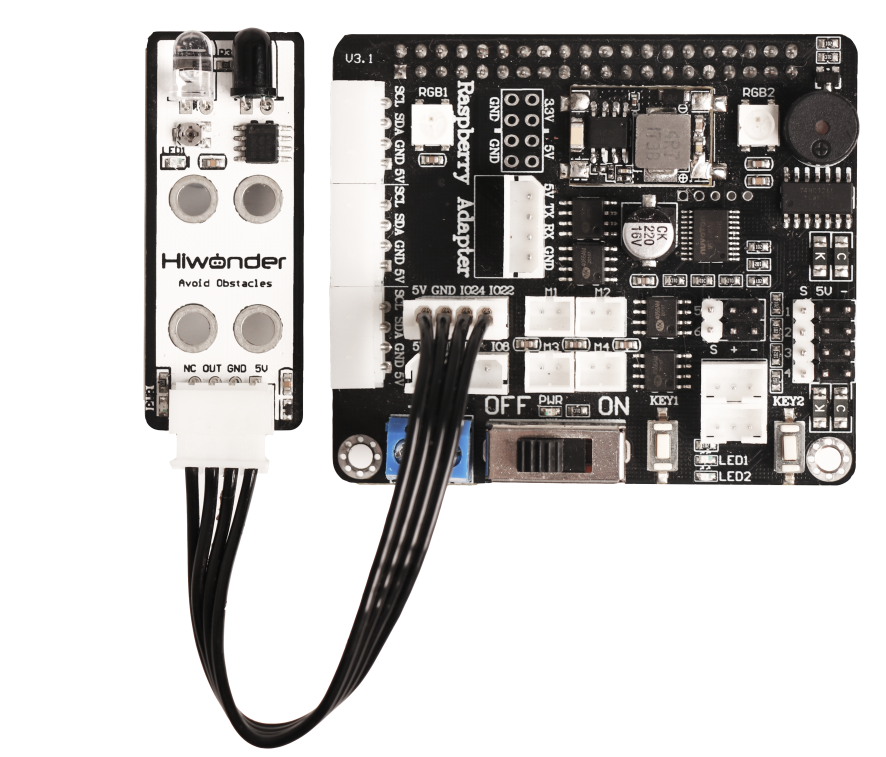

# 传感器基础开发课程

## 1.光敏传感器实验

### 1.1 准备工作

需要准备光敏传感器，并通过4PIN线将光敏传感器连接至树莓派扩展板上的"**5V GND IO24 IO22**"接口，接线效果如下图所示：


:::{Note}
4PIN线采用防反插设计，切勿硬塞。
:::

### 1.2 使用模块

本节课所用到的光敏传感器主要包含了一个QT523C（光敏二极管）和一个LM358芯片（电压比较器）。使用时，可以通过旋转传感器上的电位器来调整它的阈值。

当外界亮度超过设置的阈值时，传感器上LED1亮起，信号端OUT输出低电平。当亮度未超过设置阈值时，传感器上的LED1熄灭，信号端OUT则输出高电平。

这个传感器通常用来制作随光线强度变化产生特殊效果的互动作品，如路灯自动控制系统、环境监控系统。

### 1.3 玩法开启及关闭

:::{Note}
指令的输入需严格区分大小写，另外可按键盘"**Tab**"键进行关键词补齐。
:::

1. 将设备开机，并参照课程资料的"**[远程工具安装及容器进入方法\1. 远程工具安装与连接]()**"内容，通过VNC远程连接工具连接。


2. 点击系统桌面左上角的图标，打开Terminator终端。


3. 输入指令按下回车，关闭手机APP自启服务。

```commandline
sudo ./.stop_ros.sh
```

4. 输入进入玩法程序所在目录的指令，按下回车键。

```commandline
cd /home/ubuntu/course/sensor_course/sensor_examples
```

5. 输入运行玩法程序的指令，按下回车键。

```commandline
python3 light_sensor.py
```

6. 如需关闭此程序，可按下"**Ctrl+C**"。

7. 点击桌面左上角终端图标（**注意：需要在系统路径下输入指令，而不是在docker容器中输入开启APP服务的指令**），在系统路径下输入按下回车，启动APP服务，等待机械臂恢复至初始姿态，蜂鸣器"滴"一声即可。

```commandline
sudo systemctl restart start_node.service
```

### 1.4 功能实现

玩法开启后，若传感器处于黑暗环境，传感器的指示灯熄灭。将传感器置于明亮环境，指示灯会亮起，且蜂鸣器会短鸣一次，时间为0.1秒。

### 1.5 程序简要分析

传感器先将光信号转变成电信号，然后将电信号转化为0-5V的电压，最后经过A/D转换器被数据采集器接收。外界的亮度强度越大，输出的电压就越小。根据这一特性设置蜂鸣器作为反馈，当电压值小于设定的阈值时，蜂鸣器则响起。

该程序的源代码位于： **/home/ubuntu/course/sensor_course/sensor_examples/light_sensor.py**


导入了time、gpiod和自定义的Board模块。然后，创了一个Board对象，并初始化了与GPIO相关的对象，GPIO(chip)和光线传感器的GPIO引脚(light)。光线传感器为输入方向。

使用while True循环来实现持续的光线检测。首先，读取光线传感器的值，如果检测到光线，延时0.05秒。然后，再次读取光线传感器的值。如果仍然检测到光线，则判断之前是否已经变暗（dark为False），如果是，则将dark设置为True，表示光线变暗，然后调用board对象的set_buzzer方法，设置蜂鸣器的频率、持续时间和音量。如果检测不到光线，则将dark设置为False，表示光线变亮。

## 2. 颜色传感器控制

### 2.1 准备工作

需要准备颜色传感器，并通过4PIN线将颜色传感器连接至树莓派扩展板上的任意一个IIC接口，接线效果如下图所示：


:::{Note}
4PIN线采用防反插设计，切勿硬塞。
:::

### 2.2 使用模块

本节课所用到的颜色传感器主要用到了APDS9960传感器元件，它不仅能够识别被测物体的颜色，还具有检测周围环境光亮度，物体接近检测和非接触式手势检测等多种功能。

传感器内部的集成RGB颜色检测，可识别多种物体颜色；集成环境光检测，可以在多种环境光情况下检测光强度；传感器集成红外LED灯，可以实现物体接近检测。

颜色传感器是通过测量物体颜色的三基色反射比率来实现颜色检测的。光被反射或吸收的量值取决于物体颜色，这样即可将颜色信号给识别出来。

### 2.3 玩法开启及关闭

:::{Note}
指令的输入需严格区分大小写，另外可按键盘"**Tab**"键进行关键词补齐。
:::

1. 将设备开机，并参照课程资料的"**[远程工具安装及容器进入方法\1. 远程工具安装与连接]()**"内容，通过VNC远程连接工具连接。


2. 点击系统桌面左上角的图标，打开Terminator终端。


3. 输入指令按下回车，关闭手机APP自启服务。

```commandline
sudo ./.stop_ros.sh
```

4. 输入进入玩法程序所在目录的指令，按下回车键。

```commandline
cd /home/ubuntu/course/sensor_course/sensor_examples
```

5. 输入运行玩法程序的指令，按下回车键。

```commandline
python3 color_sensor.py
```

6. 如需关闭此程序，可按下"**Ctrl+C**"。

7. 点击桌面左上角终端图标（**注意：需要在系统路径下输入指令，而不是在docker容器中输入开启APP服务的指令**），在系统路径下输入按下回车，启动APP服务，等待机械臂恢复至初始姿态，蜂鸣器"滴"一声即可。

```commandline
sudo systemctl restart start_node.service
```

### 2.4 功能实现

程序内置三种识别颜色，分别为红色、绿色和蓝色。玩法开启后，传感器会识别不同的颜色，RGB彩灯颜色和终端打印内容如下表所示：

| **识别颜色** | **RGB彩灯颜色** | **打印内容** |
|:------------:|:---------------:|:------------:|
|     红色     |      红色       |     red      |
|     绿色     |      绿色       |    green     |
|     蓝色     |      蓝色       |     blue     |
|   其他颜色   |      白色       |     None     |

### 2.5 程序简要分析

首先，读取三个颜色的通道值，根据对颜色值的划分区间，来判断物体的颜色，再通过设置扩展板上的RGB彩灯，点亮对应的颜色。

该程序的源代码位于： **/home/ubuntu/course/sensor_course/sensor_examples/color_sensor.py**


颜色传感器的控制主要用到apds9960模块中的颜色通道读取函数。其中：

red = apds.readRedLight()函数用于读取"**R**"通道（红色分量）的颜色数值；

green = apds.readGreenLight()函数用于读取"**G**"通道（绿色分量）的颜色数值；

blue = apds.readBlueLight()函数用于读取"**B**"通道（蓝色分量）的颜色数值。

## 3. 红外避障传感器检测

### 3.1 准备工作

需要准备红外避障传感器，并通过4PIN线将红外避障传感器连接至树莓派扩展板上的"**5V GND IO24 IO22**"接口，接线效果如下图所示：



:::{Note}
4PIN线采用防反插设计，切勿硬塞。
:::

### 3.2 使用模块

本节课所用到的红外避障传感器具有一个红外发射管和一个红外接收管，一旦传感器遇到障碍物，红外光就会反射回来被接收管接收。

在传感器上还有一个微型的电位器，我们可以通过旋转电位器，来调节传感器的检测距离。当传感器上的LED1灯介于不亮与亮之间的临界点时，传感器的检测距离最大。

红外避障传感器场景使用广泛，主要应用于机器人、智能小车等的避障功能。

### 3.3 玩法开启及关闭

:::{Note}
指令的输入需严格区分大小写，另外可按键盘"**Tab**"键进行关键词补齐。
:::

1. 将设备开机，并参照课程资料的"**[远程工具安装及容器进入方法\1. 远程工具安装与连接]()**"内容，通过VNC远程连接工具连接。


2. 点击系统桌面左上角的图标，打开Terminator终端。


3. 输入指令按下回车，关闭手机APP自启服务。

```commandline
sudo ./.stop_ros.sh
```

4. 输入进入玩法程序所在目录的指令，按下回车键。

```commandline
cd /home/ubuntu/course/sensor_course/sensor_examples/
```

5. 输入运行玩法程序的指令，按下回车键。

```commandline
python3 infrared_obstacle_avoidance.py
```

6. 如需关闭此程序，可按下"**Ctrl+C**"。

7. 点击桌面左上角终端图标（**注意：需要在系统路径下输入指令，而不是在docker容器中输入开启APP服务的指令**），在系统路径下输入按下回车，启动APP服务，等待机械臂恢复至初始姿态，蜂鸣器"滴"一声即可。

```commandline
sudo systemctl restart start_node.service
```

### 3.4 功能实现

开启玩法后，若红外避障传感器识别到前方有障碍物，蜂鸣器会响起，同时指示灯会亮起。否则，蜂鸣器不发声，指示灯熄灭。

### 3.5 程序简要分析

首先，读取传感器信号端OUT的信号，以判断前方是否有障碍物。随后，设置蜂鸣器，当前方有障碍物时，蜂鸣器就会响起。此外，传感器上有一个微型电位器，可以通过旋转电位器来调节传感器的检测距离。

在调节电位器时，使传感器上的LED1灯介于不亮与亮之间的临界点，这时传感器的检测距离最大。

该程序的源代码位于： **/home/ubuntu/course/sensor_course/sensor_examples/infrared_obstacle_avoidance.py**


导入了time、gpiod和自定义的Board模块。创建了一个Board对象，并初始化了与GPIO相关的对象，GPIO(chip)和红外避障传感器传感器的GPIO引脚(pin)。配置红外避障传感器传感器设置为输入方向。

使用while True循环来实现持续的红外避障检测。首先，读取红外避障传感器的引脚值，如果检测红外避障传感器识别到前方有障碍物，则延时0.05秒，然后，我们再次读取红外避障传感器的值。如果仍然检测到前方有障碍物。蜂鸣器会响起，同时指示灯会亮起。否则，蜂鸣器不发声，指示灯熄灭。

## 4. 触摸传感器检测

### 4.1 准备工作

需要准备触摸传感器，并通过4PIN线将触摸传感器连接至树莓派扩展板上的"**5V GND IO24 IO22**"接口，接线效果如下图所示：


:::{Note}
4PIN线采用防反插设计，切勿硬塞。
:::

### 4.2 使用模块

触摸传感器是一款基于电容感应原理的触摸传感器，人体或者金属触碰传感器上的镀金接触面会被感应到；此外，隔着一定厚度的塑料、纸张等材料的接触也可以被感应到，且感应的灵敏度与接触面的大小和覆盖材料的厚度有关。

这个传感器可应用于设备的开关控制，比如控制开关灯、门铃触摸按键等；传感器板载了乐高兼容孔位，可进行更多创意DIY设计。

### 4.3 玩法开启及关闭

:::{Note}
指令的输入需严格区分大小写，另外可按键盘"**Tab**"键进行关键词补齐。
:::

1. 将设备开机，并参照课程资料的"**[远程工具安装及容器进入方法\1. 远程工具安装与连接]()**"内容，通过VNC远程连接工具连接。


2. 点击系统桌面左上角的图标，打开Terminator终端。


3. 输入指令按下回车，关闭手机APP自启服务。

```commandline
sudo ./.stop_ros.sh
```

4. 输入进入玩法程序所在目录的指令，按下回车键。

```commandline
cd /home/ubuntu/course/sensor_course/sensor_examples/
```

5. 输入运行玩法程序的指令，按下回车键。

```commandline
python3 touch_sensor.py
```

6. 如需关闭此程序，可按下"**Ctrl+C**"。

7. 点击桌面左上角终端图标（**注意：需要在系统路径下输入指令，而不是在docker容器中输入开启APP服务的指令**），在系统路径下输入指令按下回车，启动APP服务，等待机械臂恢复至初始姿态，蜂鸣器"滴"一声即可。

```commandline
sudo systemctl restart start_node.service
```

### 4.4 功能实现

玩法开启后，触摸传感器的触点一次，蜂鸣器将响一声作为反馈。

### 4.5 程序简要分析

当触摸到传感器触点后，设置蜂鸣器响一声，否则，蜂鸣器不发声。

该程序的源代码位于： **/home/ubuntu/course/sensor_course/sensor_examples/touch_sensor.py**


创建了一个Board对象，来自common.ros_robot_controller_sdk模块，用于与扩展板进行通信。

接下来，通过gpiod.chip函数初始化了一个GPIO对象chip，并使用get_line方法获取了一个GPIO引脚对象touch，这个GPIO引脚是连接到触摸传感器。

然后，配置touch设置为输入方向。

接下来代码在循环中不断读取触摸传感器的值。如果触摸传感器的值为0（被触摸），则等待一段时间（0.05秒），再次检查触摸传感器的值，以避免误触发。如果触摸传感器的值仍然为0，并且之前没有按下触摸传感器（pressed为False），则将pressed设置为True，并调用board.set_buzzer方法来触发蜂鸣器的声音。

如果触摸传感器的值不为0，则将pressed设置为False，表示触摸传感器已释放。

## 5. 发光超声波测距

### 5.1 准备工作

需要准备超声波测距模块，并通过4PIN线将超声波测距模块连接至树莓派扩展板上的任意一个IIC接口，接线效果如下图所示：


:::{Note}
4PIN线采用防反插设计，切勿硬塞。
:::

### 5.2 使用模块

本节课所用到的超声波测距模块采用工业级超声波测距芯片，芯片内部集成超声波发射电路、超声波接收电路、数字处理电路等。模块采用IIC通信接口，能通过IIC通信进行读取超声波传感器测量的距离。

同时超声波探头位置集成两个RGB灯，不仅能调节灯光亮度，还可以通过对红（R）、绿（G）、蓝（B）三个颜色通道的变化以及它们相互之间的叠加，实现多彩颜色变化。

### 5.3 玩法开启及关闭

:::{Note}
指令的输入需严格区分大小写，另外可按键盘"**Tab**"键进行关键词补齐。
:::

1. 将设备开机，并参照课程资料的"**[远程工具安装及容器进入方法\1. 远程工具安装与连接]()**"内容，通过VNC远程连接工具连接。


2. 点击系统桌面左上角的图标，打开Terminator终端。


3. 输入指令按下回车，关闭手机APP自启服务。

```commandline
sudo ./.stop_ros.sh
```

4.  输入进入玩法程序所在目录的指令，按下回车键。

```commandline
cd /home/ubuntu/course/sensor_course/sensor_examples/
```

5.  输入运行玩法程序的指令，按下回车键。

```commandline
python3 ultrasonic_sensor.py
```

6.  如需关闭此程序，可按下"**Ctrl+C**"。

7. 点击桌面左上角终端图标（**注意：需要在系统路径下输入指令，而不是在docker容器中输入开启APP服务的指令**），在系统路径下输入按下回车，启动APP服务，等待机械臂恢复至初始姿态，蜂鸣器"滴"一声即可。

```commandline
sudo systemctl restart start_node.service
```

### 5.4 功能实现

当程序开启后，终端窗口将会打印超声波模块测得的距离数据。距离大于15cm时，蜂鸣器将会响一声作为反馈。否则，蜂鸣器不发声。


### 5.5 程序简要分析

发光超声波除了拥有测距的功能外，还自带RGB彩灯。我们通过高低电平的变化控制RGB亮灭，改变各颜色分量数值控制显示的灯光颜色，便可以实现对它的控制。

该程序的源代码位于： **/home/ubuntu/course/sensor_course/sensor_examples/ultrasonic_sensor.py**


发光超声波的控制主要用到sensor模块中的ultrasonic_sensor()函数，该函数用于获取超声波传感器测量到的障碍物的原始距离数据。

## 6. 发光超声波RGB控制

### 6.1 准备工作

需要准备超声波测距模块，并通过4PIN线将超声波测距模块连接至树莓派扩展板上的任意一个IIC接口，接线效果如下图所示：


:::{Note}
4PIN线采用防反插设计，切勿硬塞。
:::

### 6.2 使用模块

本节课所用到的超声波测距模块采用工业级超声波测距芯片，芯片内部集成超声波发射电路、超声波接收电路、数字处理电路等。模块采用IIC通信接口，能通过IIC通信进行读取超声波传感器测量的距离。

同时超声波探头位置集成两个RGB灯，不仅能调节灯光亮度，还可以通过对红（R）、绿（G）、蓝（B）三个颜色通道的变化以及它们相互之间的叠加，实现多彩颜色变化。

### 6.3 玩法开启及关闭

:::{Note}
指令的输入需严格区分大小写，另外可按键盘"**Tab**"键进行关键词补齐。
:::

1. 将设备开机，并参照课程资料的"**[远程工具安装及容器进入方法\1. 远程工具安装与连接]()**"内容，通过VNC远程连接工具连接。

 

2.  点击系统桌面左上角的图标，打开Terminator终端。

 

3.  输入指令按下回车，关闭手机APP自启服务。

```commandline
sudo ./.stop_ros.sh
```

4. 输入进入玩法程序所在目录的指令，按下回车键。

```commandline
cd /home/ubuntu/course/sensor_course/sensor_examples/
```

5. 输入运行玩法程序的指令，按下回车键。

```commandline
python3 ultrasonic_rgb.py
```

6. 如需关闭此程序，可按下"**Ctrl+C**"。

7. 点击桌面左上角终端图标（**注意：需要在系统路径下输入指令，而不是在docker容器中输入开启APP服务的指令**），在系统路径下输入指令，按下回车，启动APP服务，等待机械臂恢复至初始姿态，蜂鸣器"滴"一声即可。

```commandline
sudo systemctl restart start_node.service
```

### 6.4 功能实现

开启玩法后，发光超声波模块的RGB彩灯会循环显示不同颜色。

### 6.5 程序简要分析

发光超声波除了拥有测距的功能外，还自带RGB彩灯。我们通过高低电平的变化控制RGB亮灭，改变各颜色分量数值控制显示的灯光颜色，便可以实现对它的控制。

该程序的源代码位于： **/home/ubuntu/course/sensor_course/sensor_examples/ultrasonic_rgb.py**


发光超声波的RGB控制主要用到GPIO模块中的setRGBMode()、setRGB()、setBreathCycle()函数。其中：

setRGBMode()函数用于设置RGB彩灯的模式，"**0**"是彩灯模式，"**1**"是呼吸灯模式。

setRGB()函数用于设置RGB彩灯的显示颜色。以代码"**s.setRGB(1, (255,0,0))**"为例，括号内的参数含义如下：

第一个参数"**1**"是超声波传感器的RGB彩灯序号，"**0**"是左侧RGB彩灯，"**1**"是右侧RGB彩灯；

第二个参数"**(255,0,0)**"是RGB彩灯显示颜色，括号内分别是R、G、B通道（颜色分量）的数值，此处为红色。

setBreathCycle()函数用于将RGB彩灯设置为颜色渐变模式。

## 7. 点阵模块显示

### 7.1 字模软件的使用方法

为了方便设置显示图案，我们可以用字模软件快速得到数据数值。具体设置步骤如下：

1. 打开字模软件文件夹，显示如下图：


2. 点击图标，显示如下图：


3. 点击文件新建16\*8的图片，如下图所示：


4. 我们可以利用鼠标设置需要显示图案，鼠标左键点击下面框图为设置图案，右键点 击下面框图为取消设置图案。


5. 设置心形图案，显示如下图：


6. 点击设置取模方式，设置如下图：


7. 设置完成后点击"**确定** "，然后点击下方"**生成子模** "，得到控制数组，如下图:


8. 将生成的数据替换到30和31行代码中，运行程序后，点阵就显示我们设置的心形图案。


### 7.2 准备工作

需要准备点阵屏显示模块，并通过4PIN线将点阵屏显示模块连接至树莓派扩展板上的"**5V GND IO24 IO22**"接口，接线效果如下图所示：


:::{Note}
4PIN线采用防反插设计，切勿硬塞。
:::

### 7.3 使用模块

本节课所用到的点阵屏显示模块由两个红色8x8 LED点阵屏组成，通过驱动控制芯片，可实现对点阵屏的控制。其具备显示亮度高，显示时无闪烁，接线方便等特点，能显示数字、文本、图案等内容。

### 7.4 玩法开启及关闭

:::{Note}
指令的输入需严格区分大小写，另外可按键盘"**Tab**"键进行关键词补齐。
:::

1. 将设备开机，并参照课程资料的"**[远程工具安装及容器进入方法\1. 远程工具安装与连接]()**"内容，通过VNC远程连接工具连接。


2. 点击系统桌面左上角的图标，打开Terminator终端。


3. 输入指令按下回车，关闭手机APP自启服务。

```commandline
sudo ./.stop_ros.sh
```

4. 输入进入玩法程序所在目录的指令，按下回车键。

```commandline
cd /home/ubuntu/course/sensor_course/sensor_examples/
```

5. 输入运行玩法程序的指令，按下回车键。

```commandline
python3 dot_matrix_module.py
```

6. 如需关闭此程序，可按下"**Ctrl+C**"。

7. 点击桌面左上角终端图标（**注意：需要在系统路径下输入指令，而不是在docker容器中输入开启APP服务的指令**），在系统路径下输入指令，按下回车，启动APP服务，等待机械臂恢复至初始姿态，蜂鸣器"滴"一声即可。

```commandline
sudo systemctl restart start_node.service
```

### 7.5 功能实现

程序运行后，点阵显示"**Hello**"字符5秒钟，随后程序会自动退出，点阵显示关闭。

### 7.6 程序简要分析

实验中通过利用一组十六进制数据控制点阵显示图案，一组数据共有16个数据，控制时，每个数据控制点阵显示一列LED。


每组数据设置方法非常简单，以本节课程为例，控制点阵模块显示"**Hello**"字符。


在例程中找到上图所示两行代码，它们是用于设置点阵显示图案的数组。数组中的第1个元素是0x7f，转换为二进制数是01111111，即第一列LED从下往上的灯光状态为：灭亮亮亮亮亮亮亮。同理，后面的15个元素分别控制其他15列LED的亮灭，最终让点阵显示"**Hello**"字符。

:::{Note}
可以到本节同目录下查看"**字模软件的使用方法**"，利用字模软件快速获取控制数组。
:::

该程序的源代码位于： **/home/ubuntu/course/sensor_course/sensor_examples/dot_matrix_module.py**


点阵模块显示控制主要用到sensor库中的**dot_matrix_sensor()** 函数，该函数主要用于将dms缓存区的字模刷新显示到点阵上。

## 8. 数码管显示

### 8.1 准备工作

需要准备发光超声波模块与数码管传感器模块，并通过4PIN线将超声波测距模块连接至树莓派扩展板上的任意一个IIC接口，将数码管传感器模块连接至树莓派扩展板上的"**5V GND IO24 IO22**"接口，接线效果如下图所示：


:::{Note}
4PIN线采用防反插设计，切勿硬塞。
:::

### 8.2 使用模块

本节课会用到数码管传感器模块与发光超声波模块，关于发光超声波模块的测距方法，可以参考本章节"**第5课 发光超声波测距**"的内容。

这里使用的是4位红色LED的数码管，用于显示数字、小数点和一些特殊字符。此模块体积小巧、使用方便，可以在机器人项目中应用此模块，用于显示速度、时间、分数、温度、距离等传感器数值。

### 8.3 玩法开启及关闭

:::{Note}
指令的输入需严格区分大小写，另外可按键盘"**Tab**"键进行关键词补齐。
:::

1. 将设备开机，并参照课程资料的"**[远程工具安装及容器进入方法\1. 远程工具安装与连接]()**"内容，通过VNC远程连接工具连接。


2. 点击系统桌面左上角的图标，打开Terminator终端。


3. 输入指令按下回车，关闭手机APP自启服务。

```commandline
sudo ./.stop_ros.sh
```

4. 输入进入玩法程序所在目录的指令，按下回车键。

```commandline
cd /home/ubuntu/course/sensor_course/sensor_examples/
```

5. 输入运行玩法程序的指令，按下回车键。

```commandline
python3 digital_tube.py
```

6.  如需关闭此程序，可按下"**Ctrl+C**"。

7. 点击桌面左上角终端图标（**注意：需要在系统路径下输入指令，而不是在docker容器中输入开启APP服务的指令**），在系统路径下输入按下回车，启动APP服务，等待机械臂恢复至初始姿态，蜂鸣器"滴"一声即可。

```commandline
sudo systemctl restart start_node.service
```

### 8.4 功能实现

程序运行后，终端和数码管上将显示前方障碍物的距离，距离默认为整数。

### 8.5 程序简要分析

实验中通过发光超声波模块测量出模块和前方障碍物的距离（单位是cm），并用数码管将数据显示出来。当测试数据小于4位时，前面数据我们用0代替，例如测试距离为17cm，数码管就显示"0017"。

该程序的源代码位于： **/home/ubuntu/course/sensor_course/sensor_examples/digital_tube.py**


## 9. 风扇模块控制

### 9.1 准备工作

需要准备风扇模块，并通过4PIN线将风扇模块连接至树莓派扩展板上的"5V GND IO24 IO22"接口，接线效果如下图所示：


:::{Note}
4PIN线采用防反插设计，切勿硬塞。
:::

### 9.2 使用模块

使用这款风扇模块时，不需要额外的电机驱动板，且可以通过程序来调节风扇的方向和转速。

### 9.3 玩法开启及关闭

指令的输入需严格区分大小写，另外可按键盘"**Tab**"键进行关键词补齐。

1. 将设备开机，并参照课程资料的"**[远程工具安装及容器进入方法\1. 远程工具安装与连接]()**"内容，通过VNC远程连接工具连接。


2. 点击系统桌面左上角的图标，打开Terminator终端。


3. 输入指令按下回车，关闭手机APP自启服务。

```commandline
sudo ./.stop_ros.sh
```

4. 输入进入玩法程序所在目录的指令，按下回车键。


```commandline
cd /home/ubuntu/course/sensor_course/sensor_examples/
```

5. 输入运行玩法程序的指令，按下回车键。

```commandline
python3 fan_module.py
```

6.  如需关闭此程序，可按下"**Ctrl+C**"。

7. 点击桌面左上角终端图标（**注意：需要在系统路径下输入指令，而不是在docker容器中输入开启APP服务的指令**），在系统路径下输入按下回车，启动APP服务，等待机械臂恢复至初始姿态，蜂鸣器"滴"一声即可。

```commandline
sudo systemctl restart start_node.service
```

<p id="anchor_9_4"></p>

### 9.4 功能实现

程序运行后，风扇正转3秒，反转3秒，然后停止。

### 9.5 程序简要分析

实验中直接通过2个GPIO口控制风扇转动，当设置1个GPIO口为高电平，另一个

GPIO口为低电平时，风扇开始转动。当设置2个GPIO口都为低电平时，风扇停止转动。

该程序的源代码位于**docker** 容器的位置如下： **/home/ubuntu/course/sensor_course/sensor_examples/fan_module.py**


1. chip.get_line(pin_number)：用于获取GPIO（引脚）。

2. line.request(config)：用于配置获取到的GPIO引脚。

3. line.set_value(value)：用于设置GPIO引脚的电平状态。

4. 在例程中，使用的编码方式是数字逻辑电平编码，

5. 高电平（通常为1）低电平（通常为0）

6. 在代码中，使用了line.set_value(value)函数来设置GPIO线路的电平状态：

7. fanPin1.set_value(1)：将第8号GPIO引脚设置为高电平。

8. fanPin2.set_value(0)：将第7号GPIO引脚设置为低电平。

9. time.sleep(3)：延时3秒

10. 将电平反转

### 9.6 功能延伸

- #### 调节风扇速度

例程中仅是控制风扇转动，其转速默认设置为最大值。其实，还可以通过设置PWM信号来控制风扇转速。以控制风扇低速转动3秒后停止转动为例，实现过程可分为4个步骤：

打开原程序，找到下图所示代码。


1)  将GPIO22设置为PWM接口，设置初始占空比为0。


2)  在开启风扇后，将占空比调整为40，从而调节风扇速度。


占空比的范围为0-100，若将占空比设置为100，风扇转速最快，最终现象和[9.4 功能实现](#anchor_9_4)现象一致。

3)  全部设置完成，最终代码如下图：


