# 拓展课程之传感器开发与应用

## 1. 机械臂人脸检测+风扇控制

### 1.1 安装方法

**准备工作**

在ArmPi FPV机械臂上安装风扇模块，我们需要提前准备好以下材料：

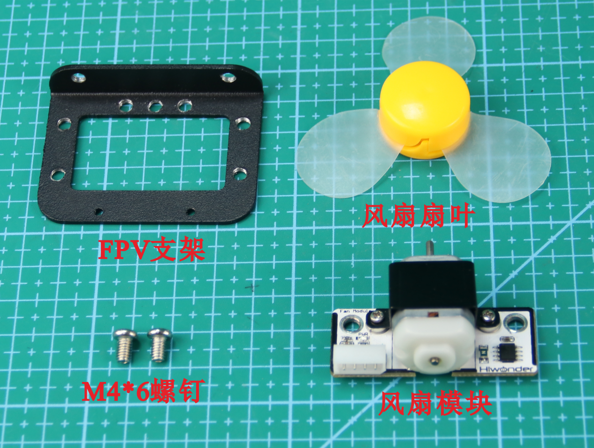

**在支架上安装风扇模块**

使用M4\*6圆头十字机械螺钉将风扇模块固定在支架上，安装效果如下图所示：

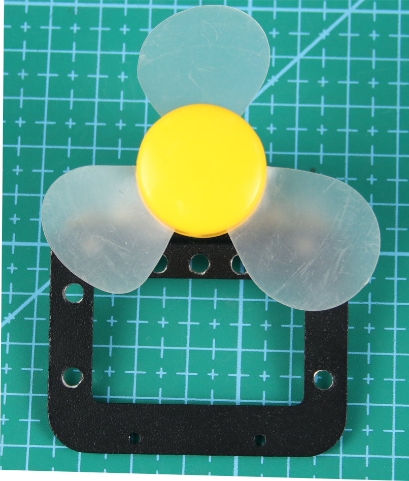

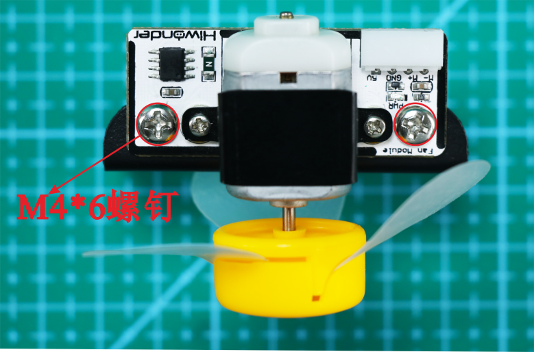

**在机械臂上安装支架**

1)  将摄像头上方的两个螺丝拆下。

2)  将风扇支架对准摄像头上方孔位进行安装固定，安装完成效果如下图所示：

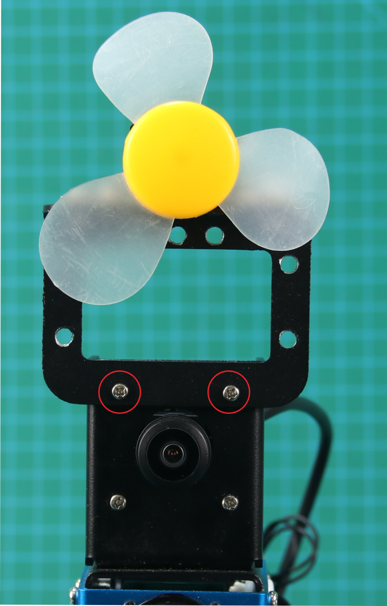

:::{Note}
风扇模块安装时，正面需和摄像头同方向。
:::

### 1.2 接线方法

通过4PIN线将点阵模块连接至树莓派扩展板上的"**5V GND IO7 IO8**"接口，接线效果如下图所示：

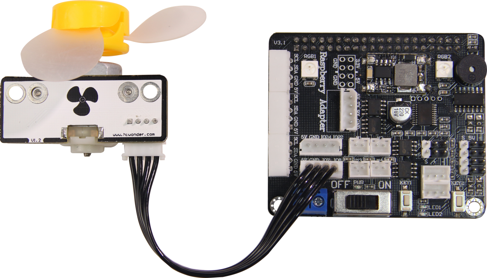

:::{Note}
4PIN线采用防反插设计，切勿硬塞。
:::

### 1.3 准备工作

本节课程中需要准备风扇传感器，并将它安装在ArmPi FPV机械臂上，具体的安装方法可参照上文"**风扇模块的安装和接线方法**"文档。

### 1.4 玩法开启及关闭

:::{Note}
指令的输入需严格区分大小写，另外可按键盘"**Tab**"键进行关键词补齐。
:::

1. 将设备开机，并参照课程资料的"**[远程工具安装及容器进入方法\1. 远程工具安装与连接]()**"内容，通过VNC远程连接工具连接。


2. 点击系统桌面左上角的图标，打开Terminator终端。


3. 输入指令按下回车，关闭手机APP自启服务。

```commandline
sudo ./.stop_ros.sh
```

4. 输入进入玩法程序所在目录的指令，按下回车键。

```commandline
cd /home/ubuntu/course/sensor_course/sensor_with_arm/
```

5. 输入运行玩法程序的指令，按下回车键。

```commandline
python3 fan_control_by_face_detect.py
```

6. 如需关闭此程序，可按下"**Ctrl+C**"。

7. 点击桌面左上角终端图标（**注意：需要在系统路径下输入指令，而不是在docker容器中输入开启APP服务的指令**），在系统路径下输入指令，按下回车，启动APP服务，等待机械臂恢复至初始姿态，蜂鸣器"滴"一声即可。

```commandline
sudo systemctl restart start_node.service
```

### 1.5 功能实现

开启玩法后，摄像头开始识别人脸，当识别到人脸，回传画面框出人脸，并且风扇开始转动，当识别不到人脸，风扇则停止转动。

### 1.6 程序简要分析

当摄像头识别到人脸后，开启风扇模块，如果摄像头识别不到人脸，则关闭风扇模块。

该程序的源代码位于Docker容器中的： /home/ubuntu/course/sensor_course/sensor_with_arm/fan_control_by_face_detect.py

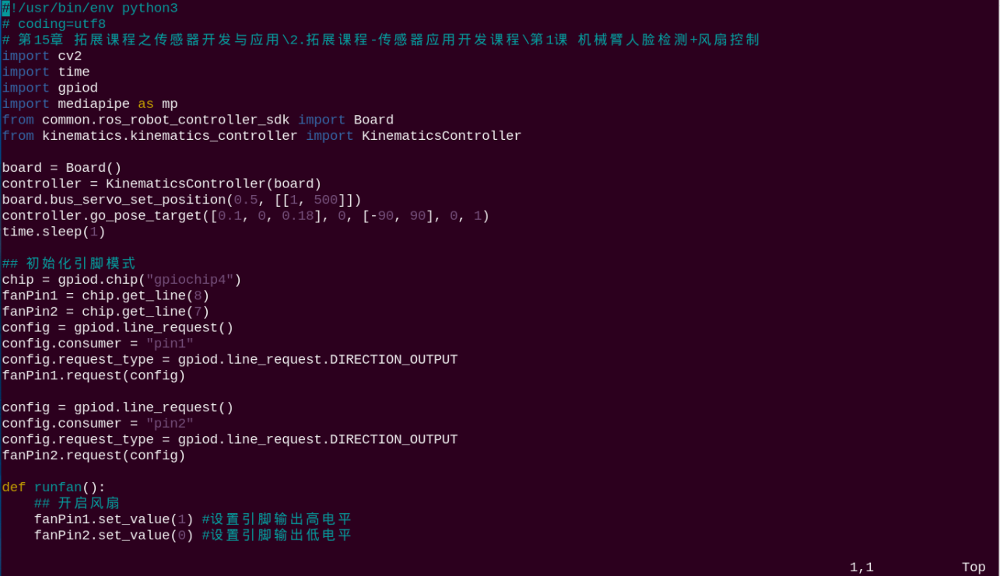

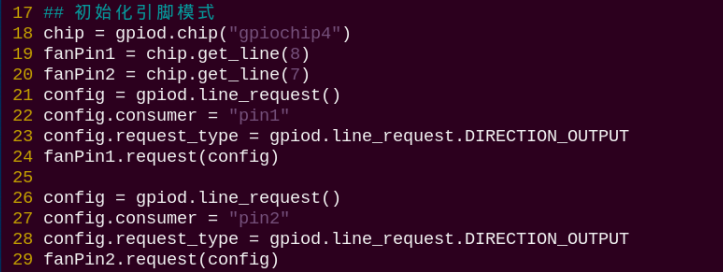

在扩展板上，风扇模块的控制需要使用两个端口，对应的BCM编码为7和8，故该函数的参数设置为(fanPin1, GPIO.OUT)和(fanPin2, GPIO.OUT)（其中fanPin1 = 8，fanPin2 = 7）。

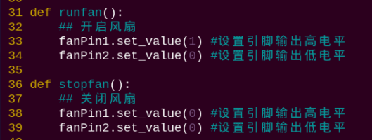

Runfan()函数用于设置GPIO口的输出电平，set_value()函数表示控制风扇模块的引脚之一。其中"1"表示高电平，"0"表示低电平。程序默认将fanPin1端口置0，然后改变fanPin1端口的电平，控制风扇在高电平是开启，低电平是停止转动。

## 2. 机械臂超声波扫描显示

### 2.1 安装方法

**准备工作**

在ArmPi FPV机械臂上安装超声波测距模块，我们需要提前准备好以下材料：


**在支架上安装超声波测距模块**

使用M4\*6圆头十字机械螺钉将超声波测距模块固定在支架上，安装效果如下图所示：

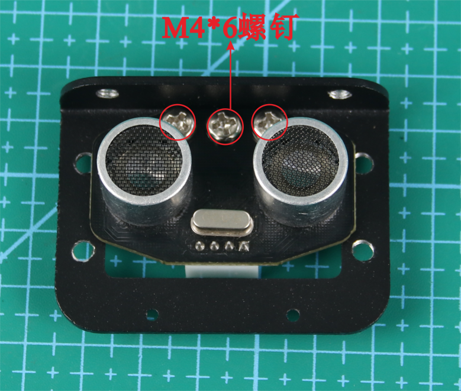


**在机械臂上安装支架**

1)  将摄像头上方的两个螺丝拆下。

2)  将超声波支架对准摄像头上方孔位进行安装固定，安装完成效果如下图所示：

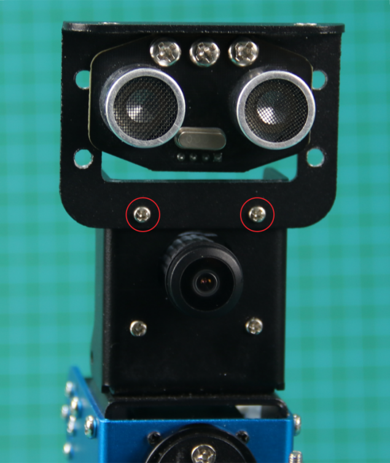

:::{Note}
超声波测距模块安装时，正面需和摄像头同方向。
:::

### 2.2 接线方法

通过4PIN线将超声波测距模块连接至树莓派扩展板上的任意一个IIC接口，接线效果如下图所示：


:::{Note}
4PIN线采用防反插设计，切勿硬塞。
:::

### 2.3 准备工作

本节课程中需要准备超声波模块，并将它安装在ArmPi FPV机械臂上，具体的安装方法可参照上文"**超声波模块的安装和接线方法**"文档。

### 2.4 玩法开启及关闭

:::{Note}
指令的输入需严格区分大小写，另外可按键盘"**Tab**"键进行关键词补齐。
:::

1. 将设备开机，并参照课程资料的"**[远程工具安装及容器进入方法\1. 远程工具安装与连接]()**"内容，通过VNC远程连接工具连接。


2. 点击系统桌面左上角的图标，打开Terminator终端。


3. 输入指令按下回车，关闭手机APP自启服务。

```commandline
sudo ./.stop_ros.sh
```

4. 输入进入玩法程序所在目录的指令，按下回车键。

```commandline
cd /home/ubuntu/course/sensor_course/sensor_with_arm/
```

5. 输入运行玩法程序的指令，按下回车键。

```commandline
python3 ultrasonic_measuring_display.py
```

6. 如需关闭此程序，可按下"**Ctrl+C**"。

7. 点击桌面左上角终端图标（**注意：需要在系统路径下输入指令，而不是在docker容器中输入开启APP服务的指令**），在系统路径下输入按下回车，启动APP服务，等待机械臂恢复至初始姿态，蜂鸣器"滴"一声即可。

```commandline
sudo systemctl restart start_node.service
```

### 2.5 功能实现

程序启动后，超声波对25cm半径内的范围进行扫描搜寻，并将探测到的信息传回至控制器，绘成雷达图。

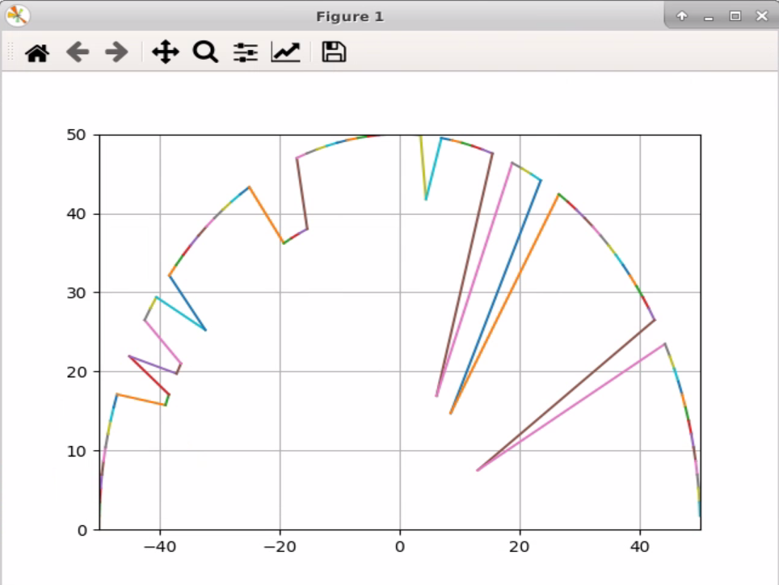

### 2.6 程序简要分析

超声波通过机械臂的转动，对角度范围内的物体进行检测，然后将接收的信息值以绘图的形式展现。

该程序的源代码位于Docker容器中的： **/home/ubuntu/course/sensor_course/sensor_with_arm/ultrasonic_measuring_display.py**

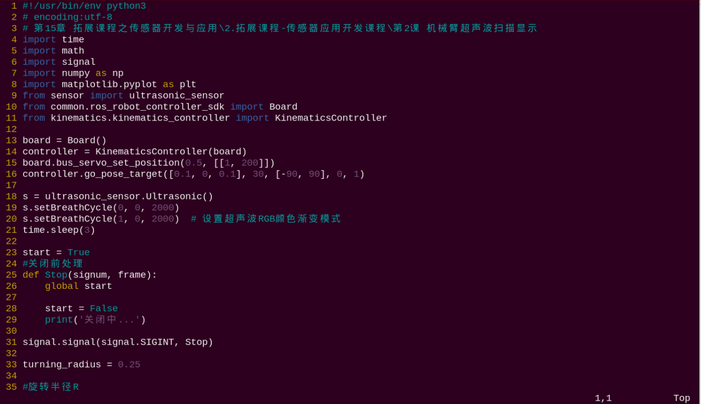

机械臂超声波扫描显示主要用到KinematicsController库中的go_pose_target()函数、pyplot库中的ion()、xlim()、ylim()、plot()函数。其中：

go_pose_target()函数用于控制机械臂舵机，以代码"**controller.go_pose_target(\[x, y, z\], -5, \[-90, 90\], 0, 2)**"为例，括号内的参数含义如下：

第一个参数"**\[x, y, z\]**"表示以机械臂为原点的三维空间末端坐标（X, Y, Z）；

第二个参数"**-5**"是机械臂运动到末端坐标的俯仰角；

第三个参数"**\[-90, 90\]**"与第四个参数"0"是俯仰角的取值范围，机械臂无法运动到指定俯仰角时，会自动寻找最接近给定俯仰角的解；

第四个参数"2"是舵机转动时间，单位为秒。

ion()函数用于打开绘图面板窗口，显示转换为可视化图形的超声波传感器测量数据。

xlim()和ylim()函数分别用于设置X、Y坐标轴的范围，两者的参数含义相同，括号内的两个参数分别是最小设定值与最大设定值。

plot()函数用于绘画出超声波检测到障碍物坐标点，以代码"**plt.plot(ax\[-2:\], ay\[-2:\])"为例，"ax\[-2:\]**"为坐标x轴数据，"ay\[-2:\]"为坐标y轴数据。

## 3. 机械臂超声波控制抓取

### 3.1 安装方法

**准备工作**

在ArmPi FPV机械臂上安装超声波测距模块，我们需要提前准备好以下材料：


**在支架上安装超声波测距模块**

使用M4\*6圆头十字机械螺钉将超声波测距模块固定在支架上，安装效果如下图所示：


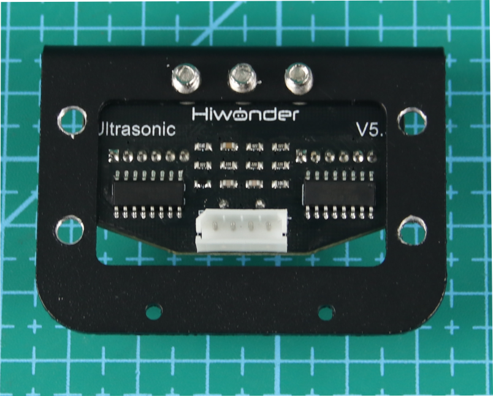

**在机械臂上安装支架**

1)  将摄像头上方的两个螺丝拆下。

2)  将超声波支架对准摄像头上方孔位进行安装固定，安装完成效果如下图所示：


:::{Note}
超声波测距模块安装时，正面需和摄像头同方向。
:::

### 3.2 接线方法

通过4PIN线将超声波测距模块连接至树莓派扩展板上的任意一个IIC接口，接线效果如下图所示：


:::{Note}
4PIN线采用防反插设计，切勿硬塞。
:::

### 3.3 准备工作

本节课程中需要准备超声波模块，并将它安装在ArmPi FPV机械臂上，具体的安装方法可参照上文"**超声波模块的安装和接线方法**"文档。

### 3.4 玩法开启与关闭

:::{Note}
指令的输入需严格区分大小写，另外可按键盘"**Tab**"键进行关键词补齐。
:::

1. 将设备开机，并参照课程资料的"**[远程工具安装及容器进入方法\1. 远程工具安装与连接]()**"内容，通过VNC远程连接工具连接。


2. 点击系统桌面左上角的图标，打开Terminator终端。


3. 输入指令按下回车，关闭手机APP自启服务。

```commandline
sudo ./.stop_ros.sh
```

4. 输入进入玩法程序所在目录的指令，按下回车键。

```commandline
cd /home/ubuntu/course/sensor_course/sensor_with_arm/
```

5.  输入运行玩法程序的指令，按下回车键。


```commandline
python3 grasp_by_ultrasonic_sensor.py
```

6.  如需关闭此程序，可按下"**Ctrl+C**"。

7.  点击桌面左上角终端图标（**注意：需要在系统路径下输入指令，而不是在docker容器中输入开启APP服务的指令**），在系统路径下输入按下回车，启动APP服务，等待机械臂恢复至初始姿态，蜂鸣器"滴"一声即可。

```commandline
sudo systemctl restart start_node.service
```

### 3.5 功能实现

程序运行后，手持物体放置到爪子前方，测距结果将以数字的形式在终端显示出来。对于物体的不同距离，机械臂会执行不同的动作，其现象如下表所示：

<table class="docutils-nobg" border="1">
<tbody>
<tr>
<td ><strong>物体距离</strong></td>
<td ><strong>机械臂</strong></td>
<td ><strong>蜂鸣器</strong></td>
</tr>
<tr>
<td >&lt;=15cm</td>
<td ><p>将手中的物体夹住</p>
<p>并放置到对应位置</p></td>
<td >响一声</td>
</tr>
<tr>
<td >&gt;15cm</td>
<td >保持不动</td>
<td >不响</td>
</tr>
</tbody>
</table>

### 3.6 程序简要分析

通过超声波模块对爪子前方的物体进行距离探测，不同的距离范围会有不同的反馈。

该程序的源代码位于Docker容器中的： **/home/ubuntu/course/sensor_course/sensor_with_arm/grasp_by_ultrasonic_sensor.py**

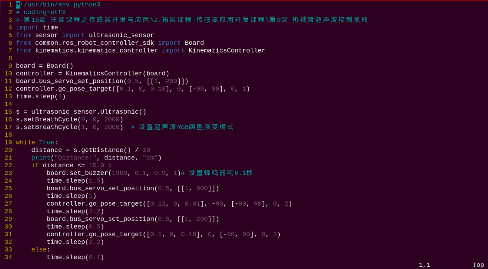

机械臂超声波控制抓取主要用到KinematicsController库中的go_pose_target()函数、pyplot库中的ion()、xlim()、ylim()、plot()函数。其中：

go_pose_target()函数用于控制机械臂舵机，以代码"**controller.go_pose_target(\[x, y, z\], -5, \[-90, 90\], 0, 2)**"为例，括号内的参数含义如下：

第一个参数"**\[x, y, z\]**"表示以机械臂为原点的三维空间末端坐标（X, Y, Z）；

第二个参数"**-5**"是机械臂运动到末端坐标的俯仰角；

第三个参数"**\[-90, 90\]**"与第四个参数"0"是俯仰角的取值范围，机械臂无法运动到指定俯仰角时，会自动寻找最接近给定俯仰角的解；

第四个参数"2"是舵机转动时间，单位为秒。

getDistance()函数用于获取超声波传感器测量到的障碍物的原始距离数据。

## 4. 机械臂超声波+AI识别控制抓取

### 4.1 安装方法

**准备工作**

在ArmPi FPV机械臂上安装超声波测距模块，我们需要提前准备好以下材料：

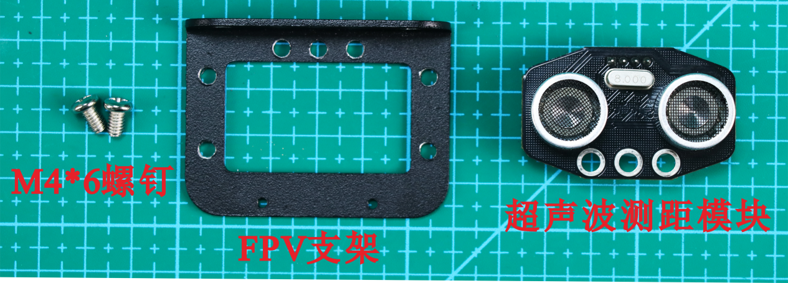

**在支架上安装超声波测距模块**

使用M4\*6圆头十字机械螺钉将超声波测距模块固定在支架上，安装效果如下图所示：


**在机械臂上安装支架**

1)  将摄像头上方的两个螺丝拆下。

2)  将超声波支架对准摄像头上方孔位进行安装固定，安装完成效果如下图所示：


:::{Note}
超声波测距模块安装时，正面需和摄像头同方向。
:::

### 4.2 接线方法

通过4PIN线将超声波测距模块连接至树莓派扩展板上的任意一个IIC接口，接线效果如下图所示：


:::{Note}
4PIN线采用防反插设计，切勿硬塞。
:::

### 4.3 准备工作

本节课程中需要准备超声波模块，并将它安装在ArmPi FPV机械臂上，具体的安装方法可参照本节目录下"**4.1 超声波模块的安装和接线方法**"文档。

### 4.4 玩法开启及关闭

:::{Note}
指令的输入需严格区分大小写，另外可按键盘"**Tab**"键进行关键词补齐。
:::

1. 将设备开机，并参照课程资料的"**[远程工具安装及容器进入方法\1. 远程工具安装与连接]()**"内容，通过VNC远程连接工具连接。


2. 点击系统桌面左上角的图标，打开Terminator终端。


3. 输入指令按下回车，关闭手机APP自启服务。

```commandline
sudo ./.stop_ros.sh
```

4.  输入进入玩法程序所在目录的指令，按下回车键。

```commandline
cd /home/ubuntu/course/sensor_course/sensor_with_arm/
```

5.  输入运行玩法程序的指令，按下回车键。

```commandline
python3 grasp_by_ultrasonic_and_vision.py
```

6.  如需关闭此程序，可按下"**Ctrl+C**"。

7. 点击桌面左上角终端图标（**注意：需要在系统路径下输入指令，而不是在docker容器中输入开启APP服务的指令**），在系统路径下输入指令，按下回车，启动APP服务，等待机械臂恢复至初始姿态，蜂鸣器"滴"一声即可。

```commandline
sudo systemctl restart start_node.service
```

### 4.5 功能实现

玩法开启后，手持色块放到爪子前方，此时超声波对色块距离进行探测，并将数值在终端显示出来。根据不同的距离和颜色，机械臂将执行不同的动作，如下表所示：

<table class="docutils-nobg" border="1">
<tbody>
<tr>
<td ><strong>检测距离</strong></td>
<td ><strong>蜂鸣器</strong></td>
<td ><strong>物体颜色</strong></td>
<td ><strong>机械臂</strong></td>
</tr>
<tr>
<td rowspan="2" >&lt;=15cm</td>
<td rowspan="2" >响一声</td>
<td >红色</td>
<td ><p>爪子将色块夹住</p>
<p>放置到对应位置</p></td>
</tr>
<tr>
<td >其他</td>
<td >机械臂左右转动。</td>
</tr>
<tr>
<td >&gt;15cm</td>
<td >不响</td>
<td >不检测物体颜色</td>
<td >机械臂无反应</td>
</tr>
</tbody>
</table>

### 4.6 程序简要分析

通过超声波模块对爪子前方物体进行探测，当距离符合范围，摄像头即对物体颜色进行识别，根据物体不同的距离及颜色，进行相应的反馈。

该程序的源代码位于Docker容器中的： **/home/ubuntu/course/sensor_course/sensor_with_arm/grasp_by_ultrasonic_and_vision.py**

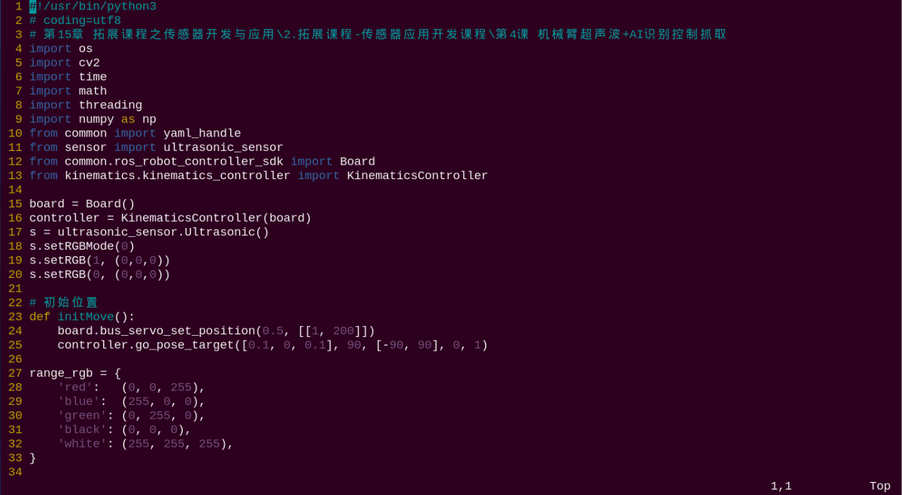

机械臂超声波+AI识别控制主要用到KinematicsController库中的go_pose_target()函数。其中：

go_pose_target()函数用于控制机械臂舵机，以代码"**controller.go_pose_target(\[x, y, z\], -5, \[-90, 90\], 0, 2)**"为例，括号内的参数含义如下：

第一个参数"**\[x, y, z\]**"表示以机械臂为原点的三维空间末端坐标（X, Y, Z）；

第二个参数"**-5**"是机械臂运动到末端坐标的俯仰角；

第三个参数"**\[-90, 90\]**"与第四个参数"0"是俯仰角的取值范围，机械臂无法运动到指定俯仰角时，会自动寻找最接近给定俯仰角的解；

第四个参数"2"是舵机转动时间，单位为秒。

**getDistance()** 函数用于获取超声波传感器测量到的障碍物的原始距离数据。

## 5. 机械臂颜色传感器识别

### 5.1 安装方法

**准备工作**

在ArmPi FPV机械臂上安装颜色传感器，我们需要提前准备好以下材料：

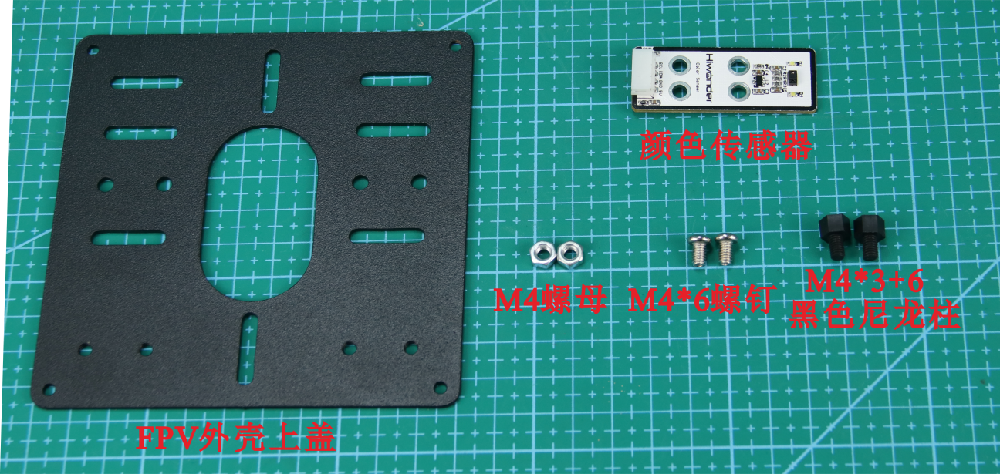

**安装颜色传感器**

使用M4\*6圆头十字机械螺钉、M4\*6螺母和M4\*3+6黑色尼龙柱将颜色传感器固定在FPV外壳上盖上，安装效果如下图所示：


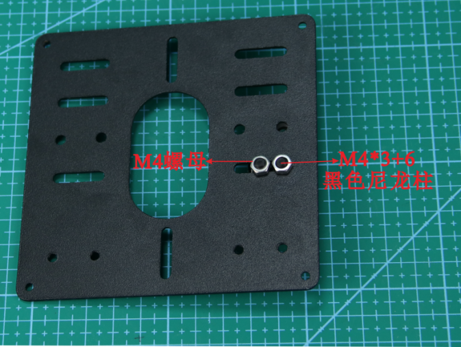

**安装ArmPi FPV机械臂外壳上盖**

将安装了颜色传感器的FPV外壳上盖安装在FPV外壳，安装完成效果如下图所示：

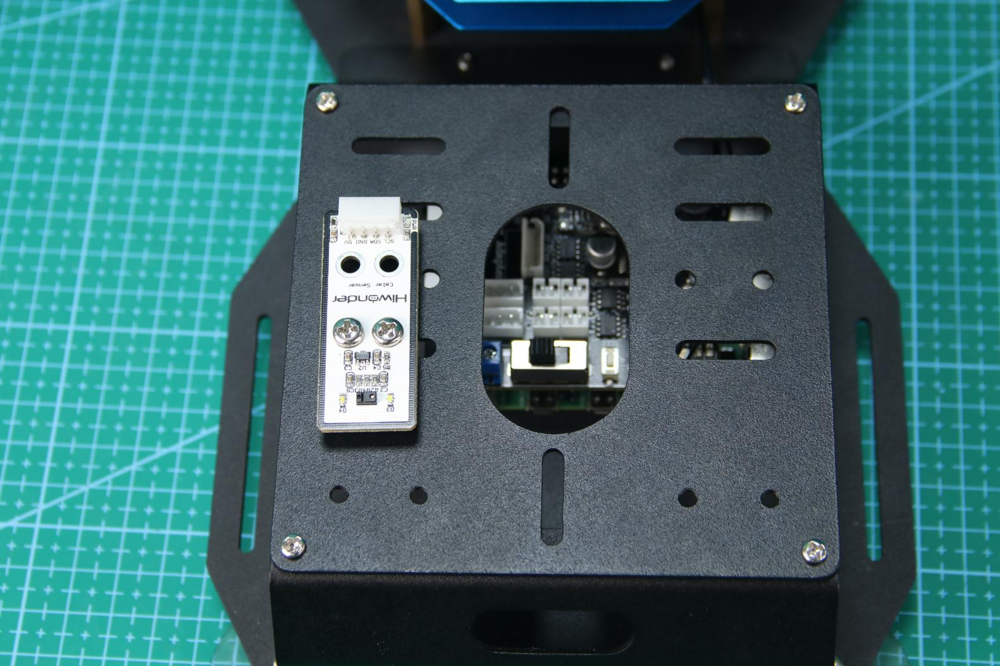

### 5.2 接线方法

通过4PIN线将颜色传感器连接至树莓派扩展板上的任意一个IIC接口，接线效果如下图所示：

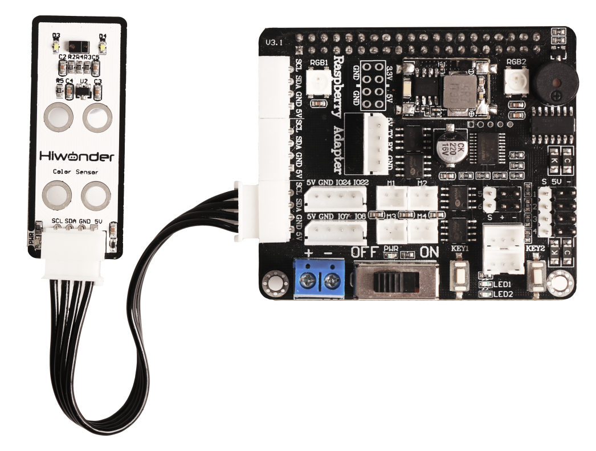

:::{Note}
4PIN线采用防反插设计，切勿硬塞。
:::

### 5.3 准备工作

本节课程中需要准备颜色传感器，并将它安装在ArmPi FPV机械臂上，具体的安装方法可参照上文"**颜色传感器的安装和接线方法**"文档。

### 5.4 玩法开启及关闭

:::{Note}
指令的输入需严格区分大小写，另外可按键盘"**Tab**"键进行关键词补齐。
:::

1. 将设备开机，并参照课程资料的"**[远程工具安装及容器进入方法\1. 远程工具安装与连接]()**"内容，通过VNC远程连接工具连接。


2. 点击系统桌面左上角的图标，打开Terminator终端。


3. 输入指令按下回车，关闭手机APP自启服务。

```commandline
sudo ./.stop_ros.sh
```

4.  输入进入玩法程序所在目录的指令，按下回车键。

```commandline
cd /home/ubuntu/course/sensor_course/sensor_with_arm/
```

5.  输入运行玩法程序的指令，按下回车键。


```commandline
python3 color_sorting_by_color_sensor.py
```

6.  如需关闭此程序，可按下"**Ctrl+C**"。

7.  点击桌面左上角终端图标（**注意：需要在系统路径下输入指令，而不是在docker容器中输入开启APP服务的指令**），在系统路径下输入指令，按下回车，启动APP服务，等待机械臂恢复至初始姿态，蜂鸣器"滴"一声即可。

```commandline
sudo systemctl restart start_node.service
```

### 5.5 功能实现

玩法开启后，识别到不同颜色的物体，机械臂会执行对应的动作，具体效果如下表所示：

| **物体颜色** |       **机械臂**       | **RGB颜色** | **蜂鸣器** |
|:------------:|:----------------------:|:-----------:|:----------:|
|     红色     |        左右转动        |    红色     |    不响    |
|     绿色     | 夹取物体放置到对应位置 |    绿色     |   响一声   |
|     蓝色     | 夹取物体放置到对应位置 |    蓝色     |   响一声   |

### 5.6 程序简要分析 

该程序的源代码位于Docker容器中的： **/home/ubuntu/course/sensor_course/sensor_with_arm/color_sorting_by_color_sensor.py**

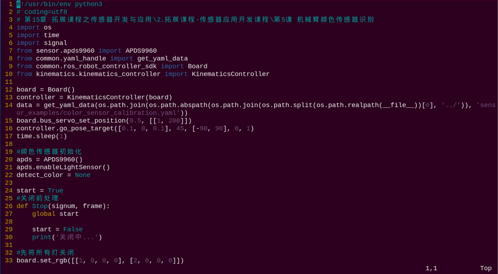

机械臂颜色传感器识别主要用到KinematicsController库中的go_pose_target()函数、bus_servo_set_position()函数。其中：

go_pose_target()函数用于控制机械臂舵机，以代码"**controller.go_pose_target(\[x, y, z\], -5, \[-90, 90\], 0, 2)**"为例，括号内的参数含义如下：

第一个参数"**\[x, y, z\]**"表示以机械臂为原点的三维空间末端坐标（X, Y, Z）；

第二个参数"**-5**"是机械臂运动到末端坐标的俯仰角；

第三个参数"**\[-90, 90\]**"与第四个参数"0"是俯仰角的取值范围，机械臂无法运动到指定俯仰角时，会自动寻找最接近给定俯仰角的解；

第四个参数"2"是舵机转动时间，单位为秒。

bus_servo_set_position()函数用于控制机械臂单个舵机；以代码"**board.bus_servo_set_position(0.5, \[\[1, 200\]\])**"为例：

"**0.5**"表示运行时间，单位为秒；

"**\[1, 200\]**"表示舵机ID，此处是1号舵机，"200"表示转动位置；

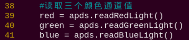

apds.readRedLight()函数用于读取"R"通道（红色分量）的颜色数值；

apds.readGreenLight()函数用于读取"G"通道（绿色分量）的颜色数值；

apds.readBlueLight()函数用于读取"B"通道（蓝色分量）的颜色数值。

### 6. 机械臂超声波补光

### 6.1 安装方法

**准备工作**

在ArmPi FPV机械臂上安装超声波测距模块，我们需要提前准备好以下材料：


**在支架上安装超声波测距模块**

使用M4\*6圆头十字机械螺钉将超声波测距模块固定在支架上，安装效果如下图所示：


**在机械臂上安装支架**

1)  将摄像头上方的两个螺丝拆下。

2)  将超声波支架对准摄像头上方孔位进行安装固定，安装完成效果如下图所示：


:::{Note}
超声波测距模块安装时，正面需和摄像头同方向。
:::

### 6.2 接线方法

通过4PIN线将超声波测距模块连接至树莓派扩展板上的任意一个IIC接口，接线效果如下图所示：

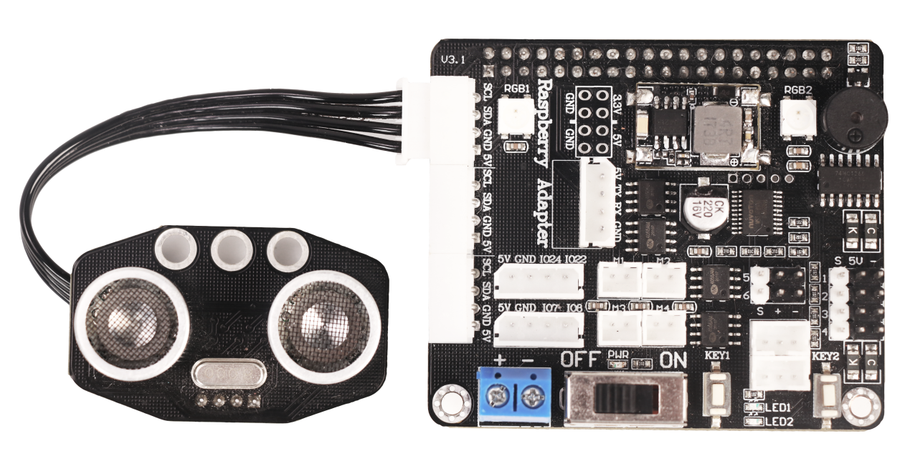

:::{Note}
4PIN线采用防反插设计，切勿硬塞。
:::

### 6.3 准备工作

本节课程中需要准备超声波模块，并将它安装在ArmPi FPV机械臂上，具体的安装方法可参照本节目录下**"6.1 超声波模块的安装和接线方法**"文档。

### 6.4 玩法开启及关闭

:::{Note}
指令的输入需严格区分大小写，另外可按键盘"**Tab**"键进行关键词补齐。
:::

1. 将设备开机，并参照课程资料的"**[远程工具安装及容器进入方法\1. 远程工具安装与连接]()**"内容，通过VNC远程连接工具连接。


2. 点击系统桌面左上角的图标，打开Terminator终端。


3. 输入指令按下回车，关闭手机APP自启服务。

```commandline
sudo ./.stop_ros.sh
```

4.  输入进入玩法程序所在目录的指令，按下回车键。

```commandline
cd /home/ubuntu/course/sensor_course/sensor_with_arm/
```

5.  输入运行玩法程序的指令，按下回车键。

```commandline
python3 fill_light_by_ultrasonic.py
```

6.  如需关闭此程序，可按下"**Ctrl+C**"。

7.  点击桌面左上角终端图标（**注意：需要在系统路径下输入指令，而不是在docker容器中输入开启APP服务的指令**），在系统路径下输入指令，按下回车，启动APP服务，等待机械臂恢复至初始姿态，蜂鸣器"滴"一声即可。

```commandline
sudo systemctl restart start_node.service
```

### 6.5 功能实现

玩法开启后，超声波模块的RGB默认亮起白色灯光。

### 6.6 程序简要分析

首先，控制超声波测距模块上的RGB灯熄灭3秒，再通过对RGB的数值进行设置，让RGB亮白色灯光。

该程序的源代码位于Docker容器中的： **/home/ubuntu/course/sensor_course/sensor_with_arm/fill_light_by_ultrasonic.py**

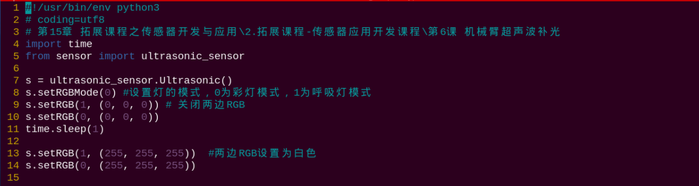

机械臂超声波补光主要用到Sonar模块中的setRGBMode()、setRGB()函数。其中：

setRGBMode()函数用于设置RGB彩灯的模式，"**0**"是彩灯模式，"**1**"是呼吸灯模式。

setRGB()函数用于设置RGB彩灯的显示颜色。以代码"**s.setRGB(1, (255, 255, 255))**"为例，括号内的参数含义如下：

第一个参数"**1**"是超声波传感器的RGB彩灯序号，"**0**"是左侧RGB彩灯，"**1**"是右侧RGB彩灯；

第二个参数"**(255,255,255)**"是RGB彩灯显示颜色，括号内分别是R、G、B通道（颜色分量）的数值，此处为白色。

## 7. 机械臂颜色+AI识别

### 7.1 安装方法

**准备工作**

在ArmPi FPV机械臂上安装颜色传感器，我们需要提前准备好以下材料：


**安装颜色传感器**

使用M4\*6圆头十字机械螺钉、M4\*6螺母和M4\*3+6黑色尼龙柱将颜色传感器固定在FPV外壳上盖上，安装效果如下图所示：

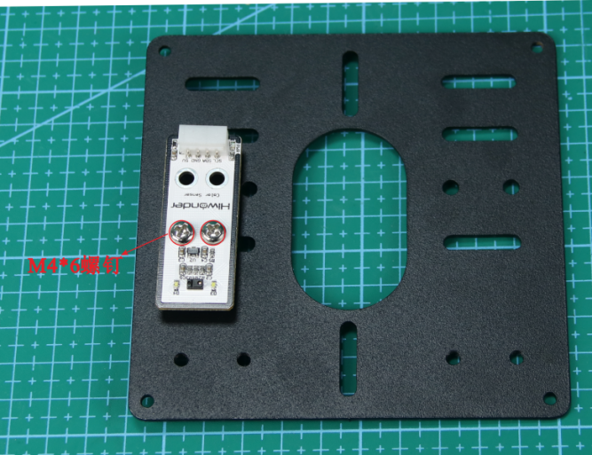


**安装ArmPi FPV机械臂外壳上盖**

将安装了颜色传感器的FPV外壳上盖安装在FPV外壳，安装完成效果如下图所示：


### 7.2 接线方法

通过4PIN线将颜色传感器连接至树莓派扩展板上的任意一个IIC接口，接线效果如下图所示：

.

:::{Note}
4PIN线采用防反插设计，切勿硬塞。
:::

### 7.3 准备工作

本节课程中需要准备颜色传感器，并将它安装在ArmPi FPV机械臂上，具体的安装方法可参照上文"**颜色传感器的安装和接线方法**"文档。

### 7.4 玩法开启及关闭

1. 将设备开机，并参照课程资料的"**[远程工具安装及容器进入方法\1. 远程工具安装与连接]()**"内容，通过VNC远程连接工具连接。


2. 点击系统桌面左上角的图标，打开Terminator终端。输入进入玩法程序所在目录的指令，按下回车键。

```commandline
cd course/sensor_course/sensor_with_arm/
```

3.  输入运行玩法程序的指令，按下回车键。

```commandline
python3 color_sorting_by_sensor_and_vision.py
```

如需关闭此程序，可按下"Ctrl+C"，若关闭失败，可多次按下。

### 7.5 功能实现

玩法开启后，当识别到红、绿、蓝色块时，蜂鸣器即响一声。此时终端画面会框选出色块轮廓，RGB也会亮起对应的颜色，然后机械臂夹取色块放置到对应位置。

放置完成后，机械臂回到初始位置，继续下一轮的检测。

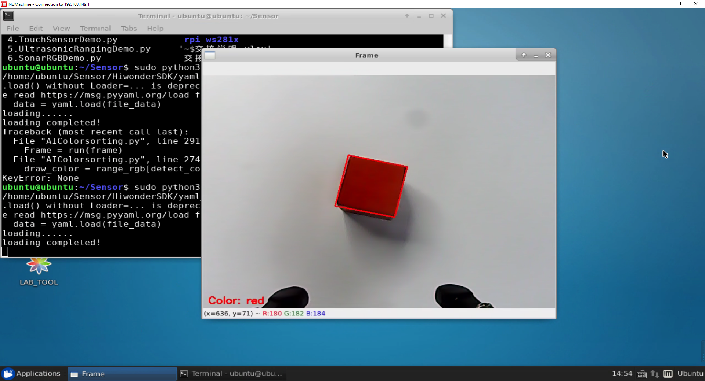

### 7.6 程序简要分析

首先，颜色传感器对视觉范围内的颜色进行检测，当识别到红绿蓝三种颜色后，就进行相应的反馈。

该程序的源代码位于Docker容器中的： **/home/ubuntu/course/sensor_course/sensor_with_arm/color_sorting_by_sensor_and_vision.py**

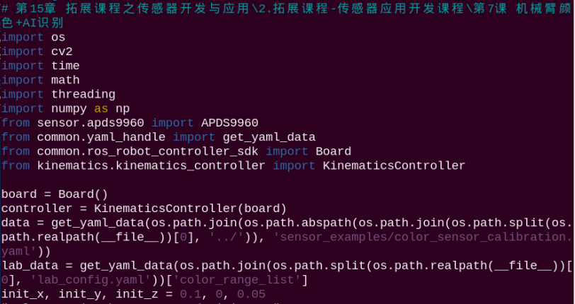

机械臂颜色+AI识别主要用到KinematicsController库中的go_pose_target()函数。其中：

**go_pose_target()** 函数用于控制机械臂舵机，以代码"controller.go_pose_target(\[x, y, z\], -5, \[-90, 90\], 0, 2)"为例，括号内的参数含义如下：

第一个参数"\[x, y, z\]"表示以机械臂为原点的三维空间末端坐标（X, Y, Z）；

第二个参数"-5"是机械臂运动到末端坐标的俯仰角；

第三个参数"\[-90, 90\]"与第四个参数"0"是俯仰角的取值范围，机械臂无法运动到指定俯仰角时，会自动寻找最接近给定俯仰角的解；

第四个参数"2"是舵机转动时间，单位为秒。

## 8. 机械臂点阵显示

### 8.1 安装方法

**准备工作**

在ArmPi FPV机械臂上安装点阵模块，我们需要提前准备好以下材料：

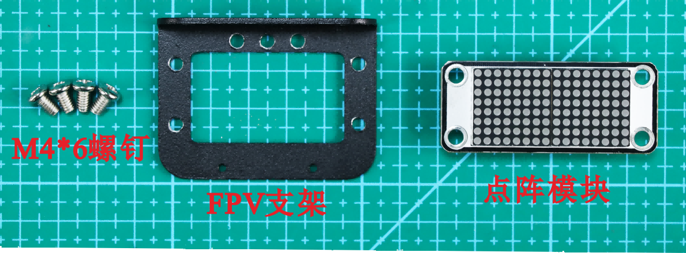

**在支架上安装点阵模块**

使用M4\*6圆头十字机械螺钉将点阵模块固定在支架上，安装效果如下图所示：


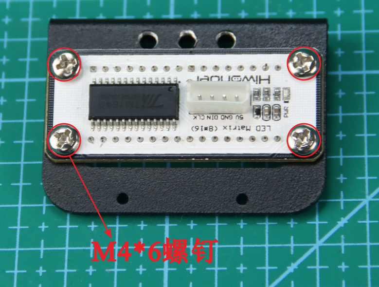

**在机械臂上安装支架**

1)  将摄像头上方的两个螺丝拆下。

2)  将点阵支架对准摄像头上方孔位进行安装固定，安装完成效果如下图所示：

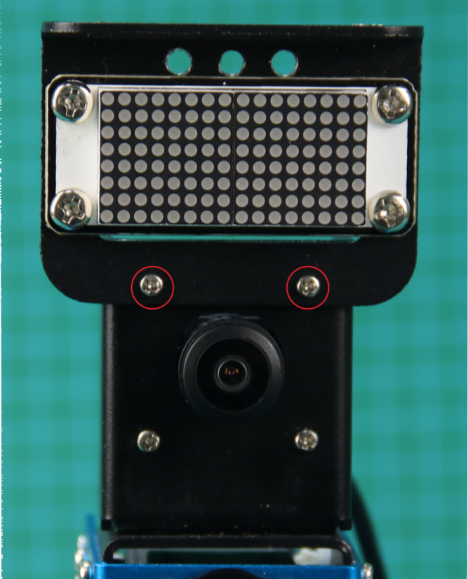

:::{Note}
点阵模块安装时，正面需和摄像头同方向。
:::

### 8.2 接线方法

通过4PIN线将点阵模块连接至树莓派扩展板上的"**5V GND IO24 IO22**"接口，接线效果如下图所示：

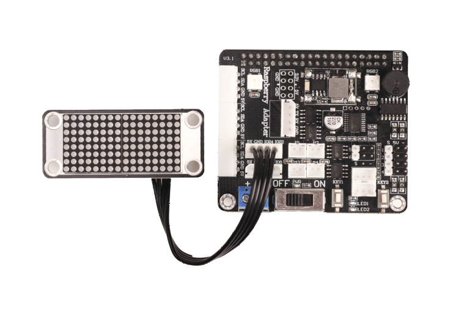

:::{Note}
4PIN线采用防反插设计，切勿硬塞。
:::

### 8.3 准备工作

本节课程中需要准备点阵模块，并将它安装在ArmPi FPV机械臂上，具体的安装方法可参照上文"**点阵模块的安装和接线方法**"文档。

### 8.4 玩法开启及关闭

1)  将设备开机，并参照课程资料的"**[远程工具安装及容器进入方法\1. 远程工具安装与连接]()**"内容，通过VNC远程连接工具连接。


2)  点击系统桌面左上角的图标，打开Terminator终端。输入进入玩法程序所在目录的指令，按下回车键。

```commandline
cd course/sensor_course/sensor_with_arm/
```


3)  输入运行玩法程序的指令，按下回车键。

```commandline
python3 dot_matrix_display.py
```

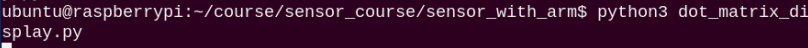

4)  如需关闭此程序，可按下"**Ctrl+C**"，若关闭失败，可多次按下。

### 8.5 功能实现

玩法启动后，点阵模块将显示"**FPV**"字样，且机械臂会执行"**挥手**"动作。

### 8.6 实现原理

首先，我们先让点阵模块显示"**FPV**"的字符，然后，控制机械臂执行一次"**挥手**"的动作，延时5S后关闭点阵模块的显示。

该程序的源代码位于Docker容器中的： **/home/ubuntu/course/sensor_course/sensor_with_arm/dot_matrix_display.py**

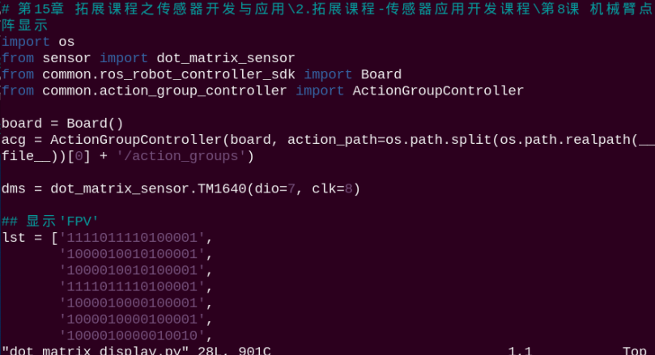

机械臂点阵显示主要用到dot_matrix_sensor中的update_display()函数，以及acg模块中的runAction()函数。其中：

update_display()函数主要用于将tm.display_buf缓存区的字模刷新显示到点阵上。

runAction()函数用于控制机械臂运行指定动作组，参数"**'wave'**"为动作组名称（若改变动作组，格式需和例程一致）。

## 9. 机械臂形状AI识别并显示

### 9.1 安装方法

**准备工作**

在ArmPi FPV机械臂上安装点阵模块，我们需要提前准备好以下材料：


**在支架上安装点阵模块**

使用M4\*6圆头十字机械螺钉将点阵模块固定在支架上，安装效果如下图所示：

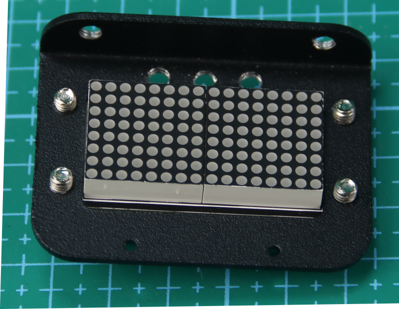


**在机械臂上安装支架**

1)  将摄像头上方的两个螺丝拆下。

2)  将点阵支架对准摄像头上方孔位进行安装固定，安装完成效果如下图所示：

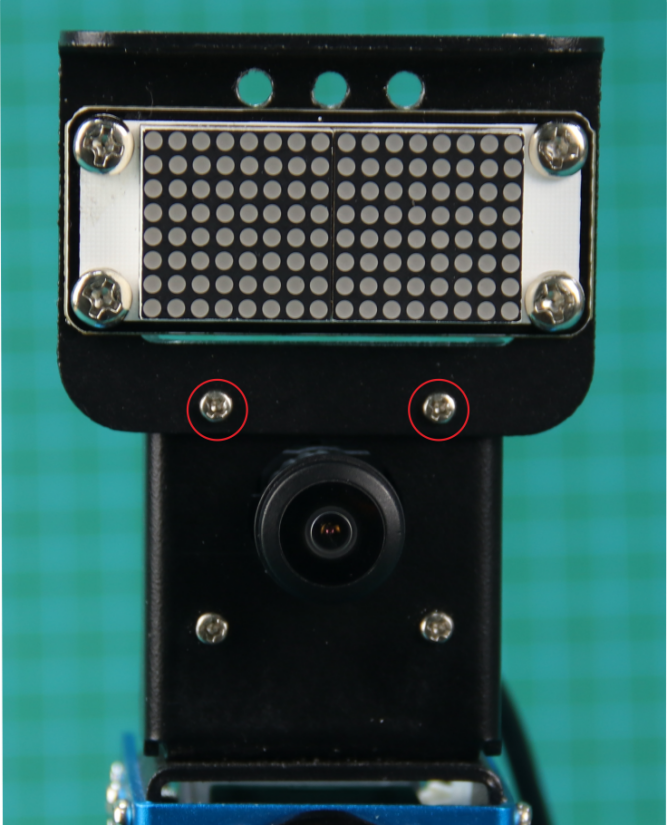

:::{Note}
点阵模块安装时，正面需和摄像头同方向。
:::

### 9.2 接线方法

通过4PIN线将点阵模块连接至树莓派扩展板上的"**5V GND IO24 IO22**"接口，接线效果如下图所示：

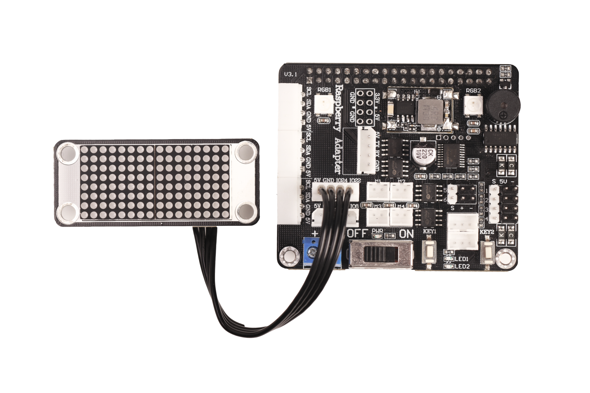

:::{Note}
4PIN线采用防反插设计，切勿硬塞。
:::

### 9.3 准备工作

本节课程中需要准备点阵模块，并将它安装在ArmPi FPV机械臂上，具体的安装方法可参照上文"**点阵模块的安装和接线方法**"文档。

### 9.4 玩法开启及关闭

1. 将设备开机，并参照课程资料的"**[远程工具安装及容器进入方法\1. 远程工具安装与连接]()**"内容，通过VNC远程连接工具连接。


2. 点击系统桌面左上角的图标，打开Terminator终端。输入进入玩法程序所在目录的指令，按下回车键。


```commandline
cd course/sensor_course/sensor_with_arm/
```

3. 输入运行玩法程序的指令，按下回车键。

```commandline
python3 shape_recognition_by_vision.py
```

4. 如需关闭此程序，可按下"**Ctrl+C**"，若关闭失败，可多次按下。

### 9.5 功能实现

玩法开启后，我们将一个矩形物体放置在摄像头视野范围内，此时，终端和点阵模块都会显示出当前形状的名称。

### 9.6 程序简要分析

首先，利用摄像头对图像信息进行采集，经过运算处理得出物体的形状，再结合点阵模块来显示形状名称。

该程序的源代码位于Docker容器中的： **/home/ubuntu/course/sensor_course/sensor_with_arm/shape_recognition_by_vision.py**

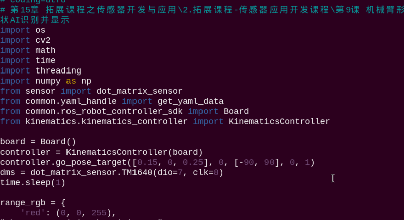

机械臂形状AI识别并显示主要用到cv2库中的approxPolyDP()函数，dot_matrix_sensor中的update_display()函数。其中：

approxPolyDP()函数功能是把一个连续光滑曲线折线化。以代码"**cv2.approxPolyDP**

**(areaMaxContour_max, epsilon, True)**"为例，"**areaMaxContour_max**"表示输入形状轮廓；"**epsilon**"是距离值，表示多边形的轮廓接近实际轮廓的程度，值越小，越精确；"**True**"表示轮廓为闭合曲线。

**update_display()** 函数用于将tm.display_buf缓存区的字模刷新显示到点阵上。

## 10. 机械臂感光控制

### 10.1 安装方法

**准备工作**

在ArmPi FPV机械臂上安装光敏传感器，我们需要提前准备好以下材料：

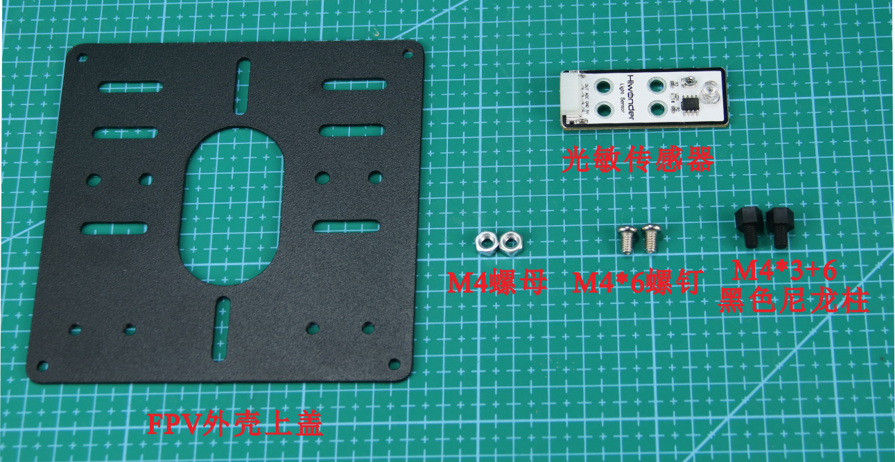

**安装光敏传感器**

使用M4\*6圆头十字机械螺钉、M4\*6螺母和M4\*3+6黑色尼龙柱将光敏传感器固定在FPV外壳上盖上，安装效果如下图所示：

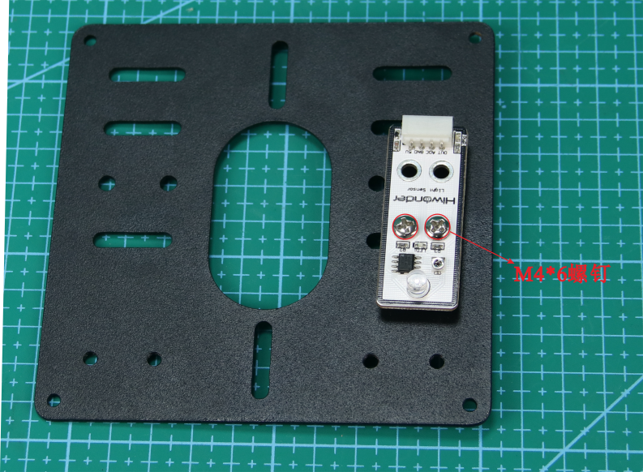

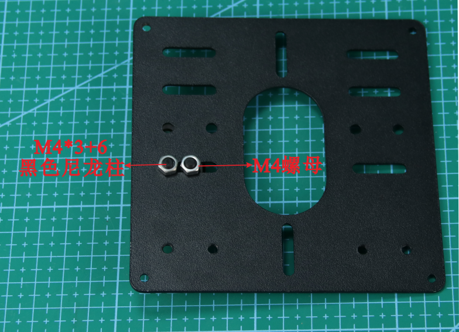

**安装ArmPi FPV机械臂外壳上盖**

将安装了光敏传感器的FPV外壳上盖安装在FPV外壳，安装完成效果如下图所示：

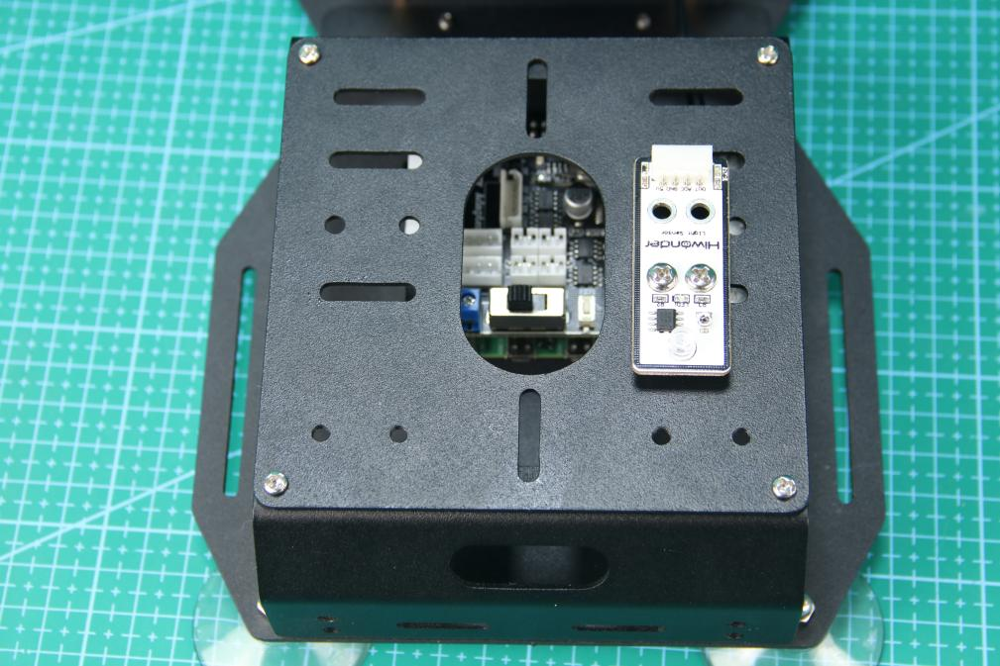

### 10.2 接线方法

通过4PIN线将光敏传感器连接至树莓派扩展板上的"**5V GND IO24 IO22**"接口，接线效果如下图所示：

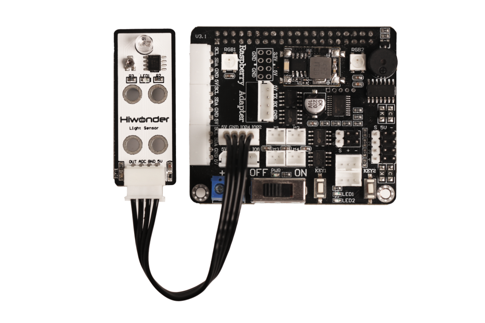

:::{Note}
4PIN线采用防反插设计，切勿硬塞。
:::

### 10.3 准备工作

本节课程中需要准备光敏传感器，并将它安装在ArmPi FPV机械臂上，具体的安装方法可参照本节目录下"**10.1 光敏传感器的安装和接线方法**"文档。

### 10.4 玩法开启及关闭

1. 将设备开机，并参照课程资料的"**[远程工具安装及容器进入方法\1. 远程工具安装与连接]()**"内容，通过VNC远程连接工具连接。


2. 点击系统桌面左上角的图标，打开Terminator终端。输入进入玩法程序所在目录的指令，按下回车键。

```commandline
cd course/sensor_course/sensor_with_arm/
```

3. 输入运行玩法程序的指令，按下回车键。

```commandline
python3 action_control_by_light_sensor.py
```

4. 如需关闭此程序，可按下"**Ctrl+C**"，若关闭失败，可多次按下。

### 10.5 功能实现

玩法开启后，我们用手遮住光敏传感器，此时指示灯熄灭。当把手放开后，蜂鸣器则发出警报，机械臂执行一次"**挥手**"动作。

### 10.6 程序简要分析

通过光敏传感器实时检测周围环境的光线强度。当强度低于阈值时，传感器的指示灯熄灭，控制器接收到高电平信号；否则，则设置机械臂和蜂鸣器做出相对应的反馈。

该程序的源代码位于Docker容器中的： **/home/ubuntu/course/sensor_course/sensor_with_arm/action_control_by_light_sensor.py**

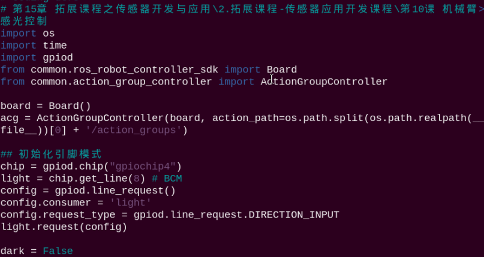

机械臂感光控制主要用到以下几个函数：

gpiod.chip("**gpiochip4**")：创建一个 GPIO 芯片对象。返回一个代表 GPIO 芯片的对象;

light.get_value()读取引脚数字值；

chip.get_line(8) 来获取 GPIO 引脚 8 的对象，并将其赋值给 pin 变量；

board.set_buzzer(1900, 0.1, 0.9, 1)来设置蜂鸣器响0.1秒；

**acg.runAction()** 函数用于控制机械臂运行指定动作组，参数为动作组名称（参数格式需和例程一致）。

## 11. 机械臂触摸控制

### 11.1 安装方法

**准备工作**

在ArmPi FPV机械臂上安装触摸传感器，我们需要提前准备好以下材料：

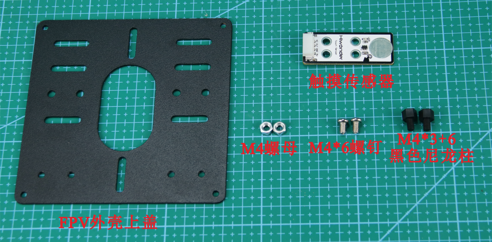

**安装触摸传感器**

使用M4\*6圆头十字机械螺钉、M4\*6螺母和M4\*3+6黑色尼龙柱将触摸传感器固定在FPV外壳上盖上，安装效果如下图所示：

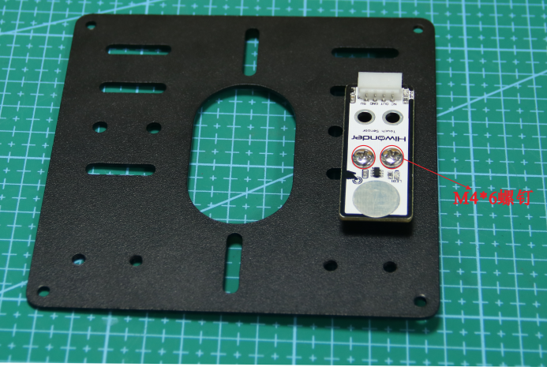


**安装ArmPi FPV机械臂外壳上盖**

将安装了触摸传感器的FPV外壳上盖安装在FPV外壳，安装完成效果如下图所示：

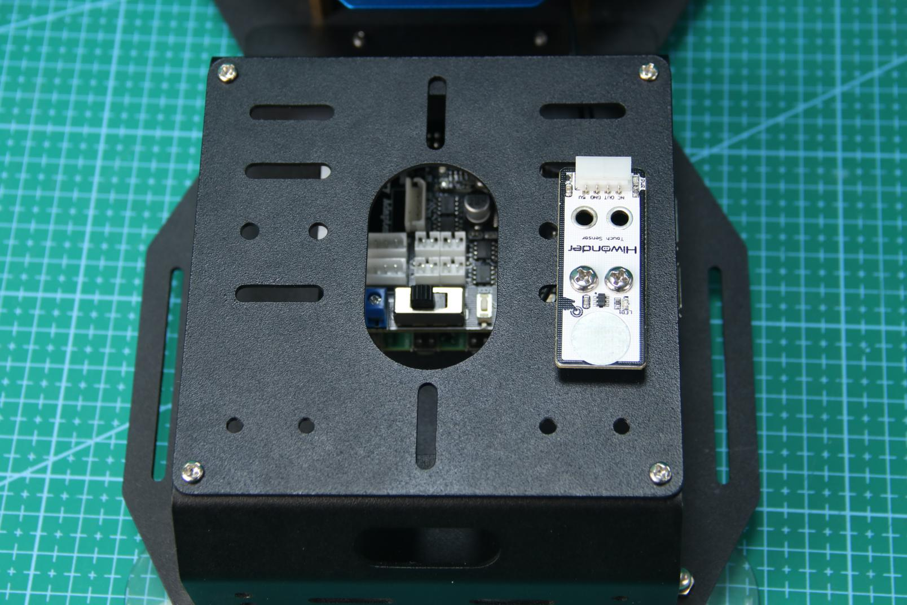

### 11.2 接线方法

通过4PIN线将触摸传感器连接至树莓派扩展板上的"**5V GND IO24 IO22**"接口，接线效果如下图所示：

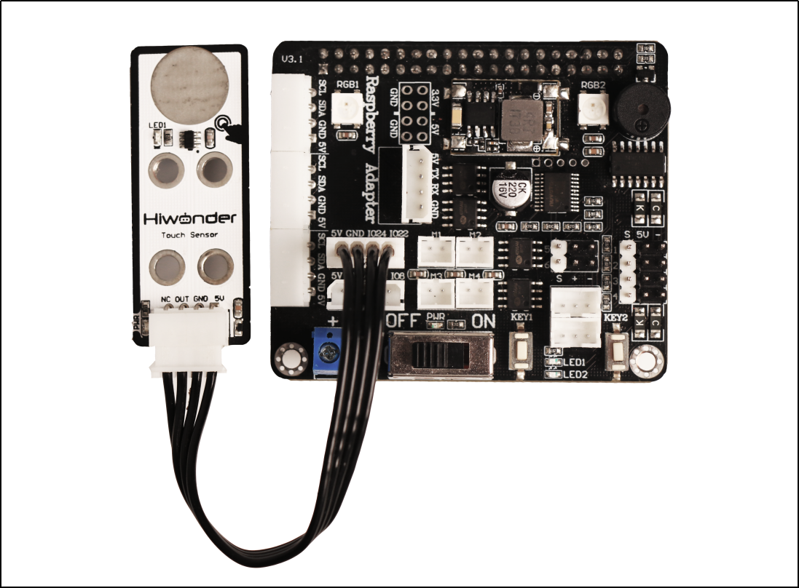

:::{Note}
4PIN线采用防反插设计，切勿硬塞。
:::

### 11.3 准备工作

本节课程中需要准备触摸传感器，并将它安装在ArmPi FPV机械臂上，具体的安装方法可参照上文"**触摸传感器的安装和接线方法**"文档。

### 11.4 玩法开启及关闭

1. 将设备开机，并参照课程资料的"**[远程工具安装及容器进入方法\1. 远程工具安装与连接]()**"内容，通过VNC远程连接工具连接。


2. 点击系统桌面左上角的图标，打开Terminator终端。输入进入玩法程序所在目录的指令，按下回车键。

```commandline
cd course/sensor_course/sensor_with_arm/
```

3. 输入运行玩法程序的指令，按下回车键。

```commandline
python3 action_control_by_touch_sensor.py
```

4. 如需关闭此程序，可按下"**Ctrl+C**"，若关闭失败，可多次按下。

### 11.5 功能实现

玩法开启后，当触碰到传感器的金属面，指示灯会亮起，蜂鸣器会发出警报，且机械臂会执行一次"**挥手**"动作。

### 11.6 程序简要分析

首先，实时检测触摸传感器的状态。当触摸传感器的金属面时，控制器接收到的是低电平信号，否则，则为高电平信号，根据这一特性，通过设置机械臂和蜂鸣器做出相对应的反馈。

该程序的源代码位于Docker容器中的： **/home/ubuntu/course/sensor_course/sensor_with_arm/action_control_by_touch_sensor.py**

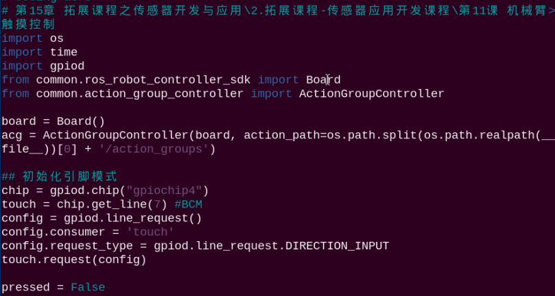

机械臂触摸控制主要用到以下几个函数：

chip.get_line(7)来获取 GPIO 引脚 7 的对象，并将其赋值给touch变量；

touch.get_value()读取引脚数字值；

board.set_buzzer(1900, 0.1, 0.9, 1)来设置蜂鸣器响0.1秒；

runAction()函数用于控制机械臂运行指定动作组，参数为动作组名称（参数格式需和例程一致）。

## 12. 机械臂红外检测

### 12.1 安装方法

**准备工作**

在ArmPi FPV机械臂上安装红外避障传感器，我们需要提前准备好以下材料：

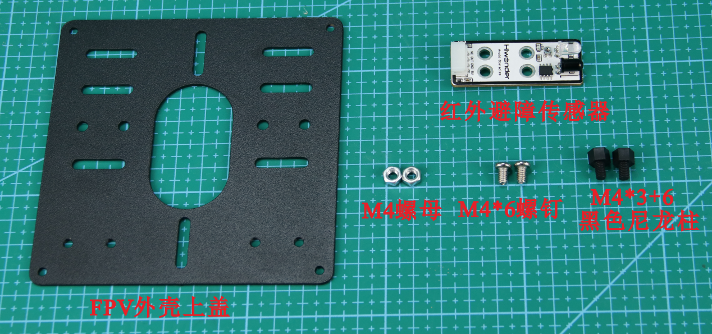

**安装红外避障传感器**

使用M4\*6圆头十字机械螺钉、M4\*6螺母和M4\*3+6黑色尼龙柱将红外避障传感器固定在FPV外壳上盖上，安装效果如下图所示：

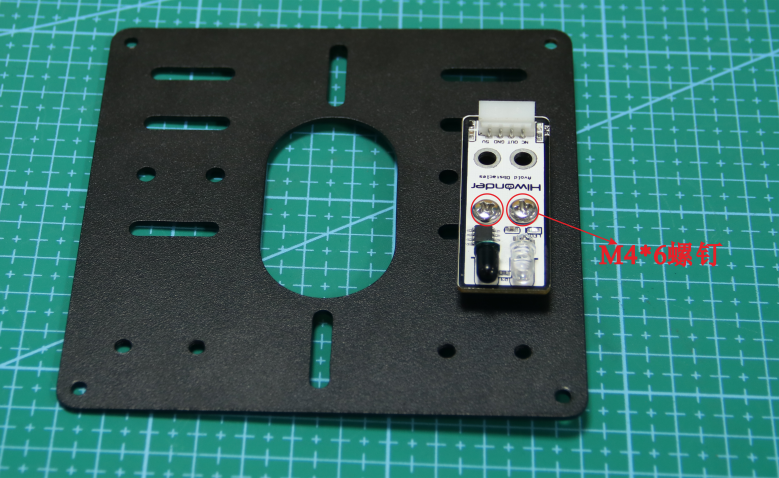


**安装ArmPi FPV机械臂外壳上盖**

将安装了红外避障传感器的FPV外壳上盖安装在FPV外壳，安装完成效果如下图所示：

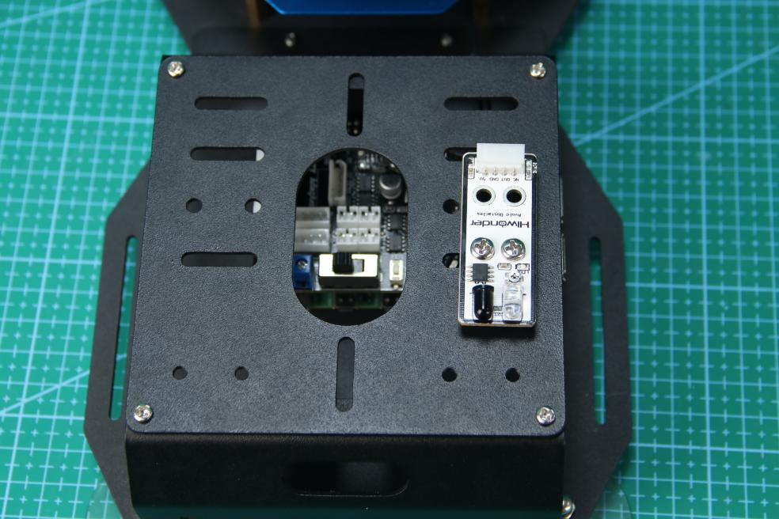

### 12.2 接线方法

通过4PIN线将红外避障传感器连接至树莓派扩展板上的"**5V GND IO24 IO22**"接口，接线效果如下图所示：

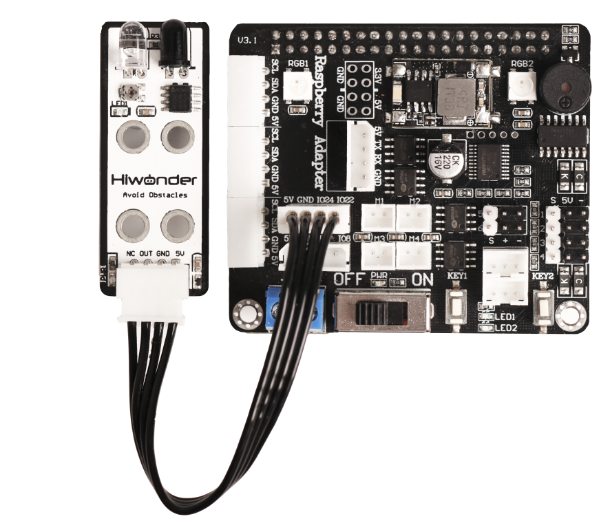

:::{Note}
4PIN线采用防反插设计，切勿硬塞。
:::

### 12.3 准备工作

本节课程中需要准备红外避障传感器，并将它安装在ArmPi FPV机械臂上，具体的安装方法可参照上文"**红外避障传感器的安装和接线方法**"文档。

### 12.4 玩法开启及关闭

1. 将设备开机，并参照课程资料的"**[远程工具安装及容器进入方法\1. 远程工具安装与连接]()**"内容，通过VNC远程连接工具连接。


2. 点击系统桌面左上角的图标，打开Terminator终端。输入进入玩法程序所在目录的指令，按下回车键。

```commandline
cd course/sensor_course/sensor_with_arm/
```

3. 输入运行玩法程序的指令，按下回车键。

```commandline
python3 action_control_by_infrared_sensor.py
```

4. 如需关闭此程序，可按下"**Ctrl+C**"，若关闭失败，可多次按下。

### 12.5 功能实现

玩法开启后，用手掌挡住红外传感器的前方。此时，传感器指示灯亮起，随后蜂鸣器发出警报，机械臂执行一次"**挥手**"动作。

### 12.6 程序简要分析

首先，实时检测红外传感器的状态。当前方无障碍物时，控制器接收到的是高电平信号；否则，则接受为低电平信号。根据这一特性，通过设置机械臂和蜂鸣器做出相对应的反馈。

该程序的源代码位于Docker容器中的： **/home/ubuntu/course/sensor_course/sensor_with_arm/action_control_by_infrared_sensor.py**

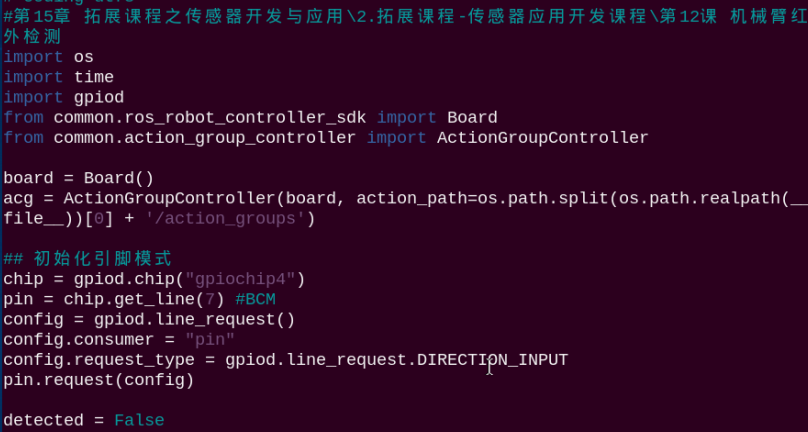

机械臂红外检测主要用到以下几个函数：

**pin.get_value()** 读取引脚数字值；

**chip.get_line(7)** 来获取 GPIO 引脚 7 的对象，并将其赋值给 pin 变量；

**board.set_buzzer(1900, 0.1, 0.9, 1)** 来设置蜂鸣器响0.1秒；

**runAction()** 函数用于控制机械臂运行指定动作组，参数为动作组名称（参数格式需和例程一致）。
