# 12. Sensor Application Course

## 12.1 Face Detection and Fan Control

### 12.1.1 Installation

* **Install the bracket on robotic arm** 

(1) Remove these two screws on the camera

(2) As the picture shown, align the holes on bracket with that of the camera, and then fix the bracket with screws.

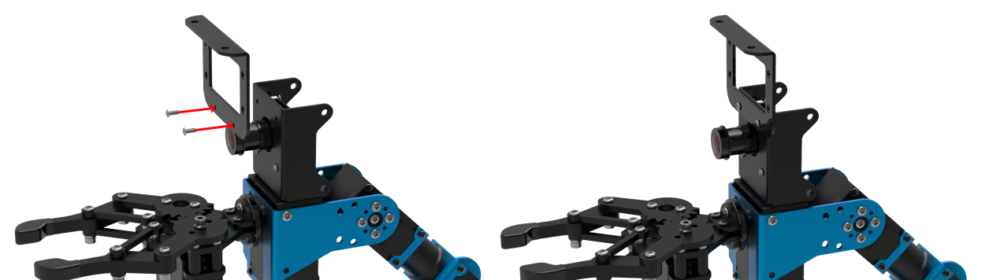

* **Install fan module on the bracket** 

According to the below picture, fix the fan module on the bracket with M4*6 round head cross machine screw. 

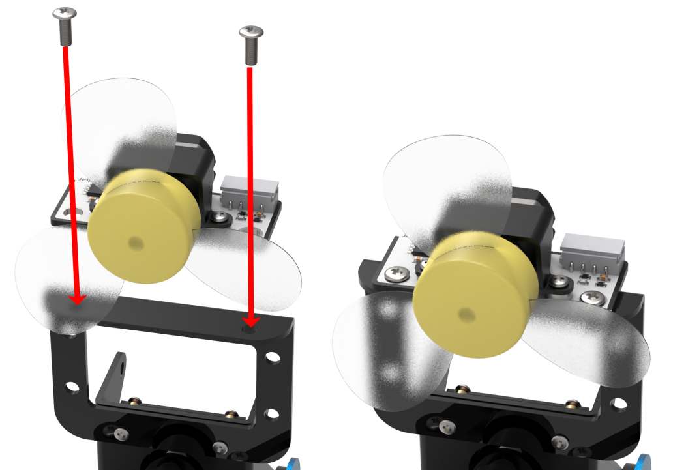

:::{Note}
Pay attention: the front of the fan module should kept in the same direction as the camera.
:::

### 12.1.2 Wiring

Through 4PIN wire, connect the dot matrix module to "**5V GND IO7 IO8**" interface on RaspberryPi expansion board. 

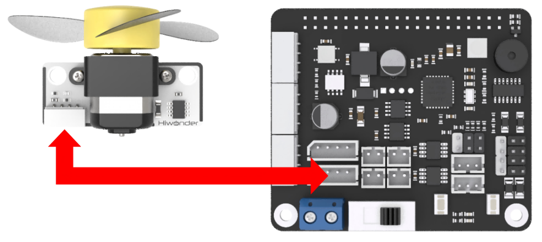

:::{Note}
4 PIN wire adopts anti-reverse plug-in design, please don't insert violently.
:::

### 12.1.3 Start and Close the Game

:::{Note}
The entered command must be strictly distinguished between uppercase and lowercase and spaces, and the keywords support the **"TAB"** key completing.
:::

(1) Power on the robot and use VNC Viewer to connect to the remote desktop.


(2) Click the icon  on the upper-left of the desktop, and open Terminator terminal.

(3) Enter command and press Enter to close app self-starter service.

```bash
sudo ./.stop_ros.sh
```

(4) Enter command and press Enter.

```bash
cd /home/ubuntu/course/sensor_course/sensor_with_arm/
```

(5) Enter command and press Enter.

```bash
python3 fan_control_by_face_detect.py
```

(6) If want to close this program, press **"Ctrl+C"**. If it cannot be closed, please try again.

(7) Click terminal icon  on the upper-left of the desktop. Note: it is needed to input command in system path, rather than input app service command in the docker container. Input "sudo systemctl restart start_node.service" in the system path and press Enter to start APP service. Wait for a moment until the robotic arm return to the initial posture and the buzzer emits "**Di**" for one time.

```bash
sudo systemctl restart start_node.service
```

### 12.1.4 Program Outcome

After the game starts, the camera will start recognizing human face. When human face is recognized, human face will be framed in the transmitted image, and the fan starts turning. When human face is not recognized, fan will stop turning.

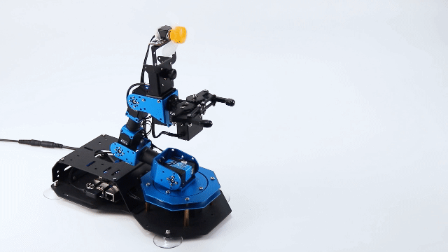

### 12.1.5 Program Analysis

When the camera recognizes human face, the fan module will be turned on. If not, fan module will be turned off.
The source code of this program lies in Docker container: **[/home/ubuntu/course/sensor_course/sensor_with_arm/fan_control_by_face_detect.py](../_static/source_code/fan_control_by_face_detect.zip)**

```python
## 初始化引脚模式
chip = gpiod.chip("gpiochip4")
fanPin1 = chip.get_line(8)
fanPin2 = chip.get_line(7)
config = gpiod.line_request()
config.consumer = "pin1"
config.request_type = gpiod.line_request.DIRECTION_OUTPUT
fanPin1.request(config)

config = gpiod.line_request()
config.consumer = "pin2"
config.request_type = gpiod.line_request.DIRECTION_OUTPUT
fanPin2.request(config)
```

On expansion board, controlling fan module needs to use two interfaces, and the corresponding BCM codes are 7 and 8. Therefore, set the parameter of the function as (fanPin1, GPIO.OUT) and (fanPin2, GPIO.OUT). Meanwhile, fanPin1 = 8 and fanPin2 =7 

```python
def runfan():
    ## 开启风扇
    fanPin1.set_value(1) #设置引脚输出高电平
    fanPin2.set_value(0) #设置引脚输出低电平

def stopfan():
    ## 关闭风扇
    fanPin1.set_value(0) #设置引脚输出高电平
    fanPin2.set_value(0) #设置引脚输出低电平
```

`Runfan()` function is used to read output level of GPIO interface. Set_value() function represents one of the pins of controlling fan module. "**1**" represents high level and "**0**" represents low level. fanPin1 interface is default to 0. Then change the level of fanPin1 interface, and control the fan to turn on in high level, and turn off in low level. 

## 12.2 Ultrasonic Scanning and Displaying

### 12.2.1 Installation

* **Install the bracket on robotic arm** 

(1) Remove these two screws on the camera

(2) As the picture shown, align the holes on bracket with that of the camera, and then fix the bracket with screws.


:::{Note}

the front of the ultrasonic module should kept in the same direction as the camera.

:::

* **Install ultrasonic module on bracket** 

According to the below picture, fix the ultrasonic module on the bracket with M4*6 round head cross machine screw.


### 12.2.2 Wiring

Through 4PIN wire, connect the ultrasonic module to any IIC interface on RaspberryPi expansion board.


:::{Note}
4 PIN wire adopts anti-reverse plug-in design, please don't insert violently.
:::

### 12.2.3 Start and Close the Game

:::{Note}
The entered command must be strictly distinguished between uppercase and lowercase and spaces, and the keywords support the **"TAB"** key completing.
:::

(1) Power on the robot and use VNC Viewer to connect to the remote desktop.


(2) Click the icon  on the upper-left of the desktop, and open Terminator terminal.

(3)  Enter command and press Enter to close app self-starter service.

```bash
sudo ./.stop_ros.sh
```

(4) Enter command and press Enter.

```bash
cd /home/ubuntu/course/sensor_course/sensor_with_arm/
```

(5) Enter command and press Enter.

```bash
python3 ultrasonic_measuring_display.py
```

(6) If want to close this program, press "**Ctrl+C**". If it cannot be closed, please try again.

(7) Click terminal icon  on the upper-left of the desktop. Note: it is needed to input command in system path, rather than input app service command in the docker container. Input "**sudo systemctl restart start_node.service**" in the system path and press Enter to start APP service. Wait for a moment until the robotic arm return to the initial posture and the buzzer emits "**Di**" for one time.

```bash
sudo systemctl restart start_node.service
```

### 12.2.4 Program Outcome

After the program runs, the ultrasonic sensor will scan and search the object within the radius of 25cm. And send the detected message back to the controller, and draw the radar graph based on the message.

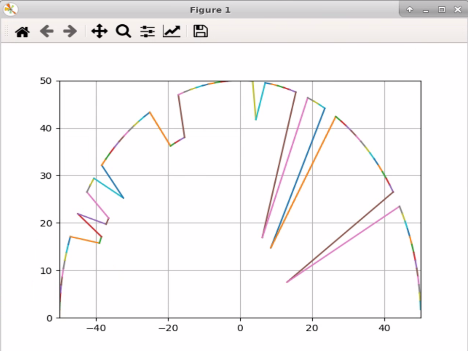

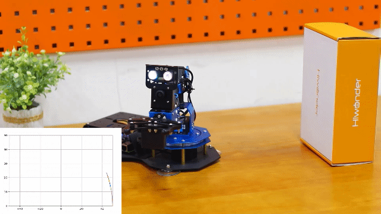

### 12.2.5 Program Analysis

Ultrasonic module will detect the object within the range when the robotic arm is moving. And, draw to display the received value.

The source code of this program lies in Docker container: **[/home/ubuntu/course/sensor_course/sensor_with_arm/ultrasonic_measuring_display.py](../_static/source_code/ultrasonic_measuring_display.zip)**

`go_pose_target()` function in KinematicsController library, and ion(), xlim(), ylim() and plot() function in pyplot in library are mainly used in ultrasonic scanning and displaying. 

`go_pose_target()` function is used to control the servo of robotic arm. Take `controller.go_pose_target([x, y, z], -5, [-90, 90], 0, 2)` code for example. The meanings of the parameters in bracket are as follow.

The first parameter `[x, y, z]` represents the end coordinate(X, Y, Z) of 3D space with robotic arm as origin.

The second parameter `-5` is pitch angle when the robotic arm moves to the end coordinate.

The third parameter `-[-90, 90]` and the fourth parameter "**0**" are pitch angle range. If the robotic arm cannot move to the designated pitch angle, it will automatically search for the solution closest to given pitch angle.

The fourth parameter`2` is servo rotation time in second.

`ion()` function is used to open the window of drawing panel which will convert the value measured by ultrasonic sensor into visual graphic.

xlim()k and ylim() function are used to set range of X and Y axis respectively. Both meanings of the parameters are the same. The two parameters in bracket respectively are the minimum set value and the maximum set value.

plot() function is used to draw the coordinate of the obstacle detected by ultrasonic sensor. Take code `plt.plot(ax[-2:], ay[-2:])` for example. `ax[-2:]` is data of x axis, and `ay[-2:]` is data of y axis.

## 12.3 Ultrasonic Controlling and Picking

### 12.3.1 Installation

* **Install the bracket on robotic arm** 

(1) Remove these two screws on the camera

(2) As the picture shown, align the holes on bracket with that of the camera, and then fix the bracket with screws.


:::{Note}

the front of the ultrasonic module should kept in the same direction as the camera.

:::

* **Install ultrasonic module on bracket** 

According to the below picture, fix the ultrasonic module on the bracket with M4*6 round head cross machine screw.


### 12.3.2 Wiring

Through 4PIN wire, connect the ultrasonic module to any IIC interface on RaspberryPi expansion board.


:::{Note}
4 PIN wire adopts anti-reverse plug-in design, please don't insert violently.
:::

### 12.3.3 Start and Close the Game

:::{Note}
The entered command must be strictly distinguished between uppercase and lowercase and spaces, and the keywords support the "**TAB**" key completing.
:::

(1) Power on the robot and use VNC Viewer to connect to the remote desktop.


(2) Click the icon  on the upper-left of the desktop, and open Terminator terminal.

(3) Enter command and press Enter to close app self-starter service.

```bash
sudo ./.stop_ros.sh
```

(4) Enter command and press Enter.

```bash
cd /home/ubuntu/course/sensor_course/sensor_with_arm/
```

(5) Enter command and press Enter.

```bash
python3 grasp_by_ultrasonic_sensor.py
```

(6) If want to close this program, press "**Ctrl+C**". If it cannot be closed, please try again.

(7) Click terminal icon  on the upper-left of the desktop. Note: it is needed to input command in system path, rather than input app service command in the docker container. Input "**sudo systemctl restart start_node.service**" in the system path and press Enter to start APP service. Wait for a moment until the robotic arm return to the initial posture and the buzzer emits "**Di**" for one time.

```bash
sudo systemctl restart start_node.service
```

### 12.3.4 Program Outcome

After the game starts, place the object in front of the gripper. Then the distance will be displayed on the terminal. According to different distance , the robotic arm will execute different action.

<table class="docutils" border="1">
<tbody>
<tr>
<td ><strong>Distance</strong></td>
<td ><strong>Robotic arm</strong></td>
<td ><strong>Buzzer</strong></td>
</tr>
<tr>
<td >&lt;=15cm</td>
<td ><p>Pick the object </p>
<p>and place it to the corresponding position</p></td>
<td >Sound once</td>
</tr>
<tr>
<td >&gt;15cm</td>
<td >Remain stationary</td>
<td >Quiet</td>
</tr>
</tbody>
</table>
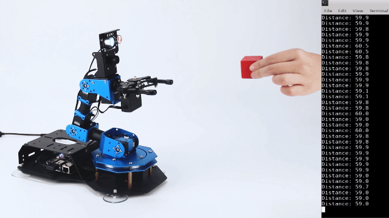

### 12.3.5 Program Analysis

Through ultrasonic module, measure the distance between the robotic arm and the object, in front of the gripper. Ultrasonic module will make different reaction according to the distance. 

The source code of this program is stored in Docker container:  **[/home/ubuntu/course/sensor_course/sensor_with_arm/grasp_by_ultrasonic_sensor.py](../_static/source_code/grasp_by_ultrasonic_sensor.zip)**

`go_pose_target()` function in KinematicsController library, and ion()、xlim()、ylim()、plot() functions in pyplot library are mainly used in ultrasonic controlling and picking. 
`go_pose_target()` function is used to control the servo of robotic arm. Take code `controller.go_pose_target([x, y, z], -5, [-90, 90], 0, 2)` for example. The meanings of the parameters in bracket are as follow.

The first parameter `[x, y, z]` represents the end coordinate(X, Y, Z) of 3D space with robotic arm as origin. 

The second parameter `-5` is pitch angle when the robotic arm moves to the end coordinate.

The third parameter `[-90, 90]` and the fourth parameter "**0**" are pitch angle range. If the robotic arm cannot move to the designated pitch angle, it will automatically search for the solution closest to given pitch angle.

The fourth parameter `2` is servo rotation time in second.

`getDistance()` function is used to obtain the original distance of the obstacle measured by ultrasonic sensor.

## 12.4 Ultrasonic and AI Recognition

### 12.4.1 Installation

* **Install the bracket on robotic arm** 

(1) Remove these two screws on the camera

(2) As the picture shown, align the holes on bracket with that of the camera, and then fix the bracket with screws.


:::{Note}

the front of the ultrasonic module should kept in the same direction as the camera.

:::

* **Install ultrasonic module on bracket** 

According to the below picture, fix the ultrasonic module on the bracket with M4*6 round head cross machine screw.


### 12.4.2 Wiring

Through 4PIN wire, connect the ultrasonic module to any IIC interface on RaspberryPi expansion board.


:::{Note}
4 PIN wire adopts anti-reverse plug-in design, please don't insert violently.
:::

### 12.4.3 Start and Close the Game

:::{Note}
The entered command must be strictly distinguished between uppercase and lowercase and spaces, and the keywords support the "**TAB**" key completing.
:::

(1) Power on the robot and use VNC Viewer to connect to the remote desktop.


(2) Click the icon  on the upper-left of the desktop, and open Terminator terminal.

(3) Enter command and press Enter to close app self-starter service.

```bash
sudo ./.stop_ros.sh
```

(4) Enter command and press Enter.

```bash
cd /home/ubuntu/course/sensor_course/sensor_with_arm/
```

(5) Enter command and press Enter.

```bash
python3 grasp_by_ultrasonic_and_vision.py
```

(6) If want to close this program, press **"Ctrl+C"**. If it cannot be closed, please try again.

(7) Click terminal icon  on the upper-left of the desktop. Note: it is needed to input command in system path, rather than input app service command in the docker container. Input "**sudo systemctl restart start_node.service**" in the system path and press Enter to start APP service. Wait for a moment until the robotic arm return to the initial posture and the buzzer emits "**Di**" for one time.

```bash
sudo systemctl restart start_node.service
```

### 12.4.4 Program Outcome

After the game starts, place the colored block in front of the gripper. Then ultrasonic sensor will detect the distance between it and the block, and display the value in the terminal. According to different distance and color, the robotic arm will execute different actions.

<table class="docutils-nobg" border="1">
<tbody>
<tr>
<td ><strong>Detected distance</strong></td>
<td ><strong>Buzzer</strong></td>
<td ><strong>Color of the object</strong></td>
<td ><strong>Robotic arm</strong></td>
</tr>
<tr>
<td rowspan="2" >&lt;=15cm</td>
<td rowspan="2" >Sound once</td>
<td >Red</td>
<td ><p>The gripper will pick and place the block to the corresponding position </p>
<p></p></td>
</tr>
<tr>
<td >Other</td>
<td >Robotic arm will rotate left and right.</td>
</tr>
<tr>
<td >&gt;15cm</td>
<td >Quiet</td>
<td >Will not recognize the object color</td>
<td >The robotic will make no reaction</td>
</tr>
</tbody>
</table>
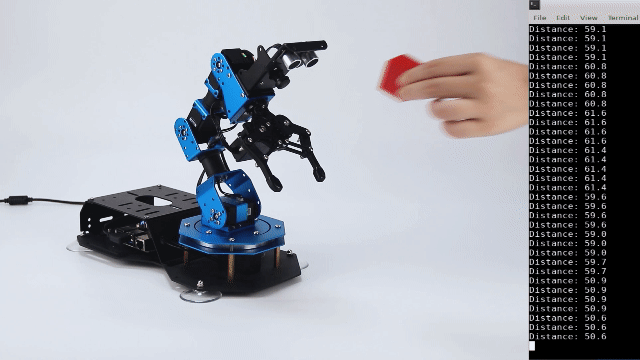

### 12.4.5 Program Analysis

Detect the front object through ultrasonic module. When the distance is within the set range, camera will recognize color of the object. Robotic arm will make corresponding response based on the distance and color of the object.
The source code of this program lies in Docker container:  **[/home/ubuntu/course/sensor_course/sensor_with_arm/grasp_by_ultrasonic_and_vision.py](../_static/source_code/grasp_by_ultrasonic_and_vision.zip)**

`Go_pose_target()` function of the KinematicsController library is mainly used to control robotic arm ultrasonic + AI recognition.

`go_pose_target()` function is used to control the servo of the robotic arm. Take "**controller.go_pose_target(\[x, y, z\], -5, \[-90, 90\], 0, 2)**" for example.The meanings of the parameters in bracket are as follow.

The first parameter `[x, y, z]` represents the end coordinate(X, Y, Z) of 3D space with robotic arm as origin. 

The second parameter `-5` is pitch angle when the robotic arm moves to the end coordinate.

The third parameter `[-90, 90]` and the fourth parameter `0` are pitch angle range. If the robotic arm cannot move to the designated pitch angle, it will automatically search for the solution closest to given pitch angle.

The fourth parameter `2` is servo rotation time in second.

`getDistance()` function is used to obtain the original distance of the obstacle measured by ultrasonic sensor.

## 12.5 Color Recognition 

### 12.5.1 Installation

According to the below picture, fix the color sensor on the cover with M4\*6 round head cross machine screw, M4 nut and M4*3+6 black nylon column.

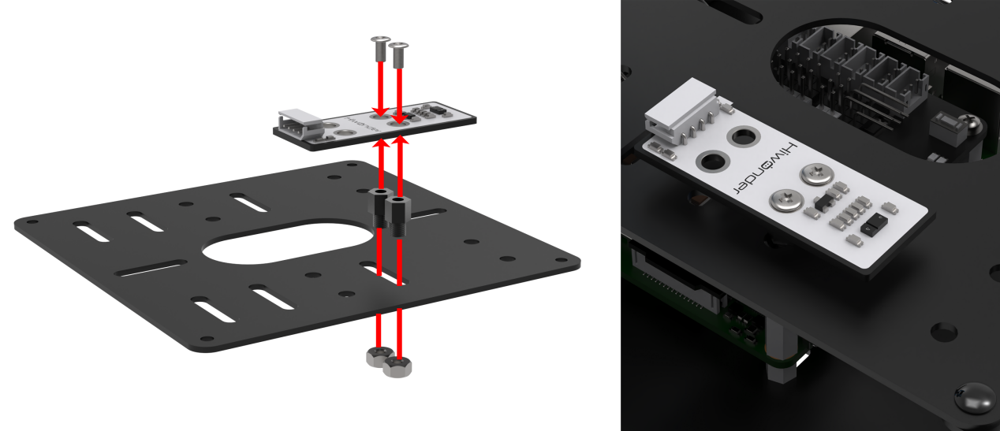

### 12.5.2 Wiring

Through 4PIN wire, connect the color sensor to any IIC interface on RaspberryPi expansion board.


:::{Note}
4 PIN wire adopts anti-reverse plug-in design, please don't insert violently.
:::

### 12.5.3 Start and Close the Game

:::{Note}
The entered command must be strictly distinguished between uppercase and lowercase and spaces, and the keywords support the **"TAB"** key completing.
:::

(1) Power on the robot and use VNC Viewer to connect to the remote desktop.


(2) Click the icon  on the upper-left of the desktop, and open Terminator terminal.

(3) Enter command and press Enter to close app self-starter service.

```bash
sudo ./.stop_ros.sh
```

(4) Enter command and press Enter.

```bash
cd /home/ubuntu/course/sensor_course/sensor_with_arm/
```

(5) Enter command to run the game, and press Enter.

```bash
python3 color_sorting_by_color_sensor.py
```

(6) If want to close this program, press "**Ctrl+C**". If it cannot be closed, please try again.

(7) Click terminal icon  on the upper-left of the desktop. 

:::{Note}

it is needed to input command in system path, rather than input app service command in the docker container. Input "**sudo systemctl restart start_node.service**" in the system path and press Enter to start APP service. Wait for a moment until the robotic arm return to the initial posture and the buzzer emits "**Di**" for one time.

:::

```bash
sudo systemctl restart start_node.service
```

### 12.5.4 Program Outcome

After the game starts, robotic arm will start recognizing object of different colors. Then the robotic arm will perform corresponding action. The specific effect is as follow.

| Color of the object |                      Robotic arm                       | RGB color | Buzzer     |
| ------------------- | :----------------------------------------------------: | :-------: | ---------- |
| Red                 |                 Rotate left and right                  |    Red    | Quiet      |
| Green               | Pick the object and place it to corresponding position |   Green   | Sound once |
| Blue                | Pick the object and place it to corresponding position |   Blue    | Sound once |

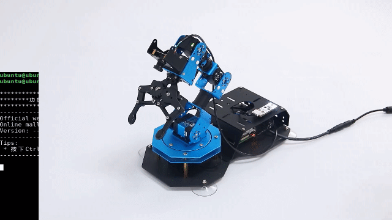

### 12.5.5 Program Analysis

According to the feature of color sensor reading color channel, color sensor can sort the color. When sensor recognizes the corresponding color, set the robotic arm to perform different action, and change the status of RGB and buzzer to give feedback.
The source code of this program lies in Docker container：**[/home/ubuntu/course/sensor_course/sensor_with_arm/color_sorting_by_color_sensor.py](../_static/source_code/color_sorting_by_color_sensor.zip)**

`go_pose_target()` function in KinematicsController library, and ion()、xlim()、ylim()、plot() functions in pyplot library are mainly used in robotic arm color recognition.

`go_pose_target() `function is used to control individual servo of the robotic arm. Take code "**controller.go_pose_target(\[x, y, z\], -5, \[-90, 90\], 0, 2)**" for example:

The first parameter `[x, y, z]` represents the end coordinate(X, Y, Z) of 3D space with robotic arm as origin. 

The second parameter `-5` is pitch angle when the robotic arm moves to the end coordinate.

The third parameter `[-90, 90]` and the fourth parameter `0` are pitch angle range. If the robotic arm cannot move to the designated pitch angle, it will automatically search for the solution closest to given pitch angle.

The fourth parameter `2` is servo rotation time in second.

`bus_servo_set_position()` function is used to control individual servo of robotic arm. Take code `board.bus_servo_set_position(0.5, [[1, 200]])` as example:
"**0.5**": running time in second.

`[1, 200]`: servo ID. Here indicates servo No.1, `200` means rotation position.

```py
#读取三个颜色通道值(read three color channel value)
red = apds.readRedLight()
green = apds.readGreenLight()
blue = apds.readBlueLight()
```

`apds.readRedLight()` function is used to read color value of "**R**" channel (red).

`apds.readGreenLight()` function is used to read color value of "**G**" channel (green).

`apds.readBlueLight()` function is used to read color value of "**B**" channel (blue).

## 12.6 Ultrasonic Fill Light

### 12.6.1  Installation

* **Install the bracket on robotic arm** 

(1) Remove these two screws on the camera

(2) As the picture shown, align the holes on bracket with that of the camera, and then fix the bracket with screws.


Pay attention: the front of the ultrasonic module should kept in the same direction as the camera.

* **Install ultrasonic module on bracket** 
  According to the below picture, fix the ultrasonic module on the bracket with M4*6 round head cross machine screw.

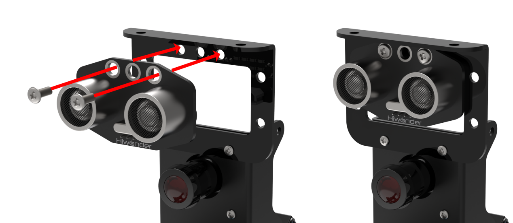

### 12.6.2 Wiring

Through 4PIN wire, connect the ultrasonic module to any IIC interface on RaspberryPi expansion board.


:::{Note}
4 PIN wire adopts anti-reverse plug-in design, please don't insert violently.
:::

### 12.6.3 Start and Close the Game

:::{Note}
The entered command must be strictly distinguished between uppercase and lowercase and spaces, and the keywords support the "**TAB**" key completing.
:::

(1) Power on the robot and use VNC Viewer to connect to the remote desktop.


(2) Click the icon  on the upper-left of the desktop, and open Terminator terminal.

(3) Enter command and press Enter to close app self-starter service.

```bash
sudo ./.stop_ros.sh
```

(4) Enter command and press Enter.

```bash
cd /home/ubuntu/course/sensor_course/sensor_with_arm/
```

(5) Enter command and press Enter.

```bash
python3 fill_light_by_ultrasonic.py
```

(6) If want to close this program, press "**Ctrl+C**". If it cannot be closed, please try again.

(7) Click terminal icon  on the upper-left of the desktop. Note: it is needed to input command in system path, rather than input app service command in the docker container. Input "**sudo systemctl restart start_node.service**" in the system path and press Enter to start APP service. Wait for a moment until the robotic arm return to the initial posture and the buzzer emits "**Di**" for one time.

```bash
sudo systemctl restart start_node.service
```

### 12.6.4 Program Outcome

After the game starts, RGB light on ultrasonic module will illuminate in white.

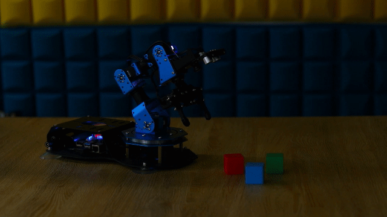

### 12.6.5 Program Analysis

Firstly, control the RGB light on ultrasonic module to go out for 3s. Then, through setting RGB value, make RGB illuminate in bright white. 
The source code of this programs are stored in Docker container: **[/home/ubuntu/course/sensor_course/sensor_with_arm/fill_light_by_ultrasonic.py](../_static/source_code/fill_light_by_ultrasonic.zip)**

`setRGBMode()` and `setRGB()` function in Sonar module are mainly used in this ultrasonic fill light. 

`setRGBMode()` function is used to set the mode of RGB colored light. `0` is colored light mode, and `1` is breathing light mode.

setRGB() function is used to set RGB light to display which color. Take `s.setRGB(1, (255,255,255))` code for example. The meanings of the parameters in bracket are as follow.

The first parameter `1` is serial number of RGB light on ultrasonic sensor. `0` is left RGB colored light, and `1` is right RGB colored light
The second parameter `(255,255,255)` is display color of RGB light. The values in bracket are respectively corresponding to R,G and B. The color here is white.

## 12.7 Color and AI Recognition

### 12.7.1 Installation

According to the below picture, fix the color sensor on the cover with M4\*6 round head cross machine screw, M4 nut and M4*3+6 black nylon column.


### 12.7.2 Wiring

Through 4PIN wire, connect the color sensor to any IIC interface on RaspberryPi expansion board.

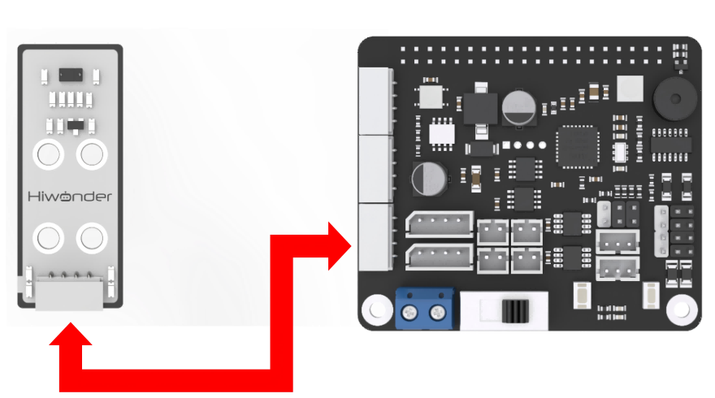

:::{Note}
4 PIN wire adopts anti-reverse plug-in design, please don't insert violently.
:::

### 12.7.3 Start and Close the Game

(1) Power on the robot and use VNC Viewer to connect to the remote desktop.


(2) Click the icon  on the upper-left of the desktop, and open Terminator terminal. Enter command and press Enter.

```bash
cd course/sensor_course/sensor_with_arm/
```

(3) Enter command and press Enter.

```bash
python3 color_sorting_by_sensor_and_vision.py
```

If want to close this program, press "**Ctrl+C**". If it cannot be closed, please try again.

### 12.7.4 Program Outcome

After the game starts, the buzzer will sound once when red, green or blue block is recognized. The contour of the block will be framed. And RGB will illuminate in the corresponding color. Then the robotic arm will pick the block and place it in corresponding position.
Having placed it, the robotic arm will be back to the initial position for later detection. 

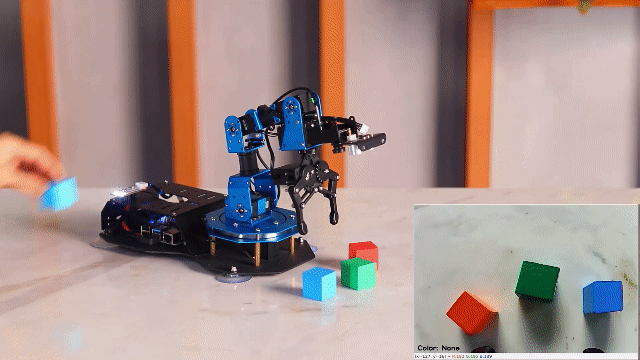

### 12.7.5 Program Analysis

Firstly, color sensor will detect the color within the robotic arm's vision. When recognizing three colors, including red, green and blue, it will make corresponding reaction.
The source code of this program lies in Docker container: **[/home/ubuntu/course/sensor_course/sensor_with_arm/color_sorting_by_sensor_and_vision.py](../_static/source_code/color_sorting_by_sensor_and_vision.zip)**

`go_pose_target()` function in KinematicsController library is mainly used in color + AI recognition. 

`go_pose_target()` function is used to control the servo of robotic arm. Take code `controller.go_pose_target([x, y, z], -5, [-90, 90], 0, 2)` for example. The meanings of the parameters in bracket are as follow.

The first parameter `[x, y, z]` represents the end coordinate(X, Y, Z) of 3D space with robotic arm as origin. 

The second parameter `-5` is pitch angle when the robotic arm moves to the end coordinate.

The third parameter `[-90, 90]` and the fourth parameter `0` are pitch angle range. If the robotic arm cannot move to the designated pitch angle, it will automatically search for the solution closest to given pitch angle.

The fourth parameter `2` is servo rotation time in second.

`getDistance()` function is used to obtain the original distance of the obstacle measured by ultrasonic sensor. 

## 12.8 Dot Matrix Display

### 12.8.1 Installation

* **Install the bracket on robotic arm** 

(1) Remove these two screws on the camera/8.1/image

(2) As the picture shown, align the holes on bracket with that of the camera, and then fix the bracket with screws.


* **Install dot matrix module on bracket** 

According to the below picture, fix the dot matrix module on the bracket with M4*6 round head cross machine screw.


:::{Note}
the front of the dot matrix module should be kept in the same direction as the camera.
:::

### 12.8.2  Wiring

Through 4PIN wire, connect the dot matrix module to **"5V GND IO24 IO22"** interface on RaspberryPi expansion board.

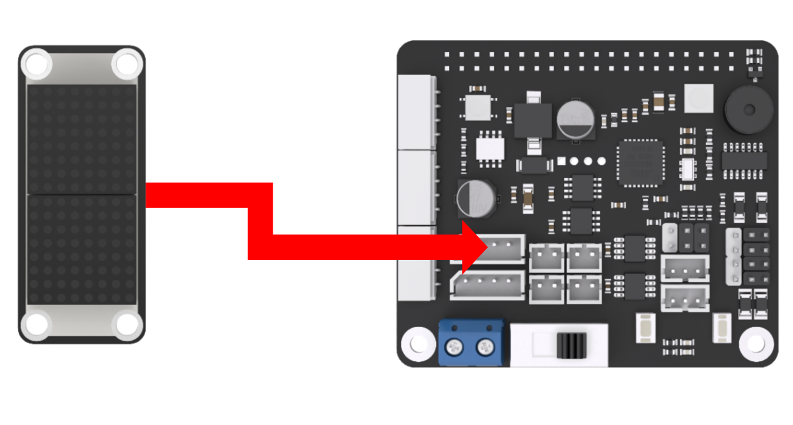

:::{Note}
4 PIN wire adopts anti-reverse plug-in design, please don't insert violently.
:::

### 12.8.3 Start and Close the Game

(1) Power on the robot and use VNC Viewer to connect to the remote desktop.


(2) Click the icon  on the upper-left of the desktop, and open Terminator terminal. Enter command and press Enter.

```bash
cd course/sensor_course/sensor_with_arm/
```

(3) Enter command and press Enter.

```bash
python3 dot_matrix_display.py
```

(4) If want to close this program, press "**Ctrl+C**". If it cannot be closed, please try again.

### 12.8.4 Program Outcome

After the game starts, dot matrix module will display "**FPV**", and the robotic arm will "**wave**".

### 12.8.5 Program Analysis

Firstly, make dot matrix module display "**FPV**". Then, control robotic arm to "**wave**" once. Next, turn off the dot matrix display after a delay of 5s.
The source code of this program lies in Docker container: **[/home/ubuntu/course/sensor_course/sensor_with_arm/dot_matrix_display.py](../_static/source_code/dot_matrix_display.zip)**

`update_display()` function in dot_matrix_sensor library is mainly used in dot matrix display.

`update_display()` function is used to refresh the font in tm.display_buf cache and display it on dot matrix.

`runAction()` function is used to control the robotic arm to run designated action group. Parameter "**'wave'**" is the name of action group. If you want to change the action group, the format of the action group name needs to be consistent with that of the routine.

## 12.9 Shape AI Recognition and Display

### 12.9.1 Installation

* **Install the bracket on robotic arm** 

(1) Remove these two screws on the camera

(2) As the picture shown, align the holes on bracket with that of the camera, and then fix the bracket with screws.


* **Install dot matrix module on bracket** 

According to the below picture, fix the dot matrix module on the bracket with M4*6 round head cross machine screw.

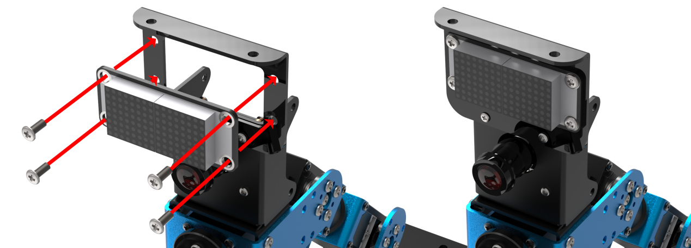

:::{Note}
the front of the dot matrix module should be kept in the same direction as the camera.
:::

### 12.9.2 Wiring

Through 4PIN wire, connect the dot matrix module to **"5V GND IO24 IO22"** interface on RaspberryPi expansion board.


:::{Note}
4 PIN wire adopts anti-reverse plug-in design, please don't insert violently.
:::

### 12.9.3 Start and Close the Game

(1) Power on the robot and use VNC Viewer to connect to the remote desktop.


(2) Click the icon  on the upper-left of the desktop, and open Terminator terminal.Enter command and press Enter.

```bash
cd course/sensor_course/sensor_with_arm/
```

(3) Enter command and press Enter.

```bash
python3 shape_recognition_by_vision.py
```

(4) If want to close this program, press "**Ctrl+C**". If it cannot be closed, please try again.

### 12.9.4 Program Outcome

After the game starts, place a rectangle object within the camera vision. At this time, the current shape type will be displayed in the terminal and dot matrix module.

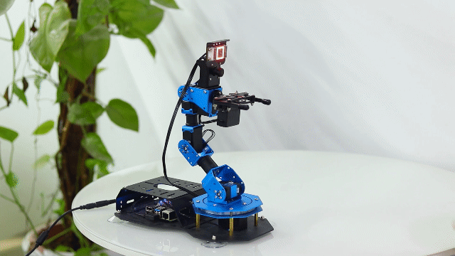

### 12.9.5 Program Description 

Firstly, use the camera to collect the image information. Through calculation, the shape of the object will be obtained. Combined with dot matrix module, the shape type will be displayed.
The source code of this program lies in Docker container:  **[/home/ubuntu/course/sensor_course/sensor_with_arm/shape_recognition_by_vision.py](../_static/source_code/shape_recognition_by_vision.zip)**

`approxPolyDP()` function in cv2 library and update_display() function in dot_matrix_sensor library are mainly used in shaping AI recognition and display. 

`approxPolyDP()` function is used to polyline a continuous smooth curve. Take `cv2.approxPolyDP (areaMaxContour_max, epsilon, True)` for example. 

`areaMaxContour_max` represents the entered shape contour. "**epsilon**" is distance representing the degree to which the outline of a polygon approximates the actual outline. The smaller the value is, the more accurate the result is. "**True**" represents the contour is a closed curve.

`update_display()` function is used to refresh the font in "**tm.display_buf**" cache and display it on dot matrix module.

## 12.10 Photosensitive Control

### 12.10.1 Installation

According to the below picture, fix the light sensor on the cover with M4\*6 round head cross machine screw, M4 nut and M4*3+6 black nylon column.

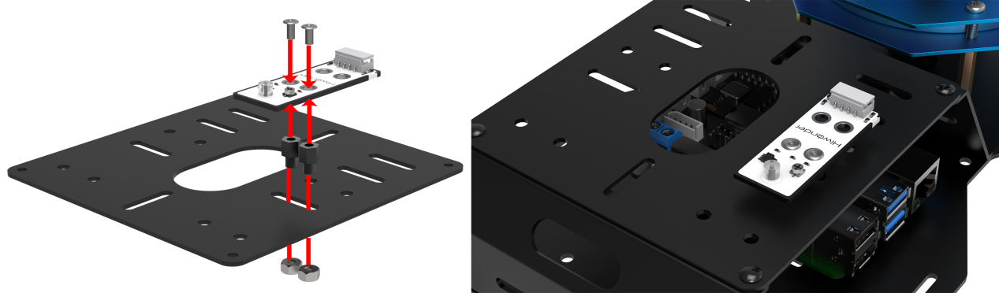

### 12.10.2 Wiring

Through 4PIN wire, connect the light sensor to **"5V GND IO24 IO22"** interface on RaspberryPi expansion board.


:::{Note}
 4 PIN wire adopts anti-reverse plug-in design, please don't insert violently.
:::

### 12.10.3 Start and Close the Game

(1) Power on the robot and use VNC Viewer to connect to the remote desktop.


(2) Click the icon  on the upper-left of the desktop, and open Terminator terminal.Enter command and press Enter.

```bash
cd course/sensor_course/sensor_with_arm/
```

(3) Enter command and press Enter.

```bash
python3 action_control_by_light_sensor.py
```

(4) If want to close this program, press "**Ctrl+C**". If it cannot be closed, please try again.

### 12.10.4 Program Outcome

After the game starts, use your hand to cover the light sensor. At this time, the indicator will go out. When you remove your hand, the buzzer will sound alarm and the robotic arm will "**wave**" once.

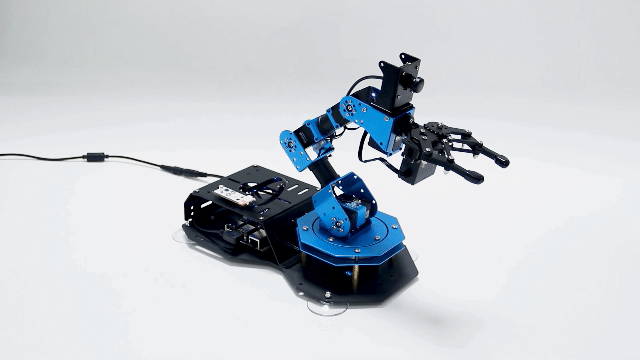

### 12.10.5 Program Analysis

Through light sensor, detect the ambient light intensity. When the intensity is less than the threshold, the indicator of sensor will go out, and the controller will receive high level signal. Otherwise, set the robotic arm and buzzer to make corresponding reaction.
The source code of this program lies in Docker container: **[/home/ubuntu/course/sensor_course/sensor_with_arm/action_control_by_light_sensor.py](../_static/source_code/action_control_by_light_sensor.zip)**

There are several functions mainly used in photosensitive control.

`gpiod.chip("gpiochip4")`：create a GPIO chip object. Return one of the objects.

`light.get_value()`: read the value of pin.

`chip.get_line(8)`: get the object of pin8, and assign it to variable "**pin**".

`board.set_buzzer(1900, 0.1, 0.9, 1)`: set the buzzer to sound for 0.1 second.

`acg.runAction()` function is used to control the robotic arm to run the designated action group. Its parameter is the name of action group. Pay attention, the format of the parameter should be the same as the routine. 

## 12.11 Touch Control

### 12.11.1 Installation

According to the below picture, fix the touch sensor on the cover with M4\*6 round head cross machine screw, M4 nut and M4*3+6 black nylon column.

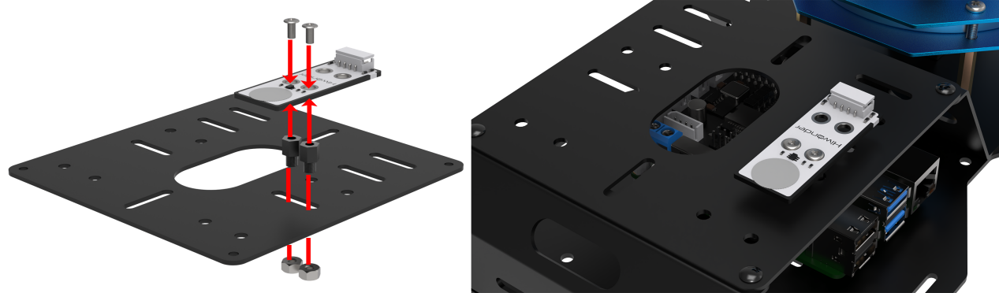

### 12.11.2 Wiring

Through 4PIN wire, connect the touch sensor to "**5V GND IO24 IO22**" interface on RaspberryPi expansion board.

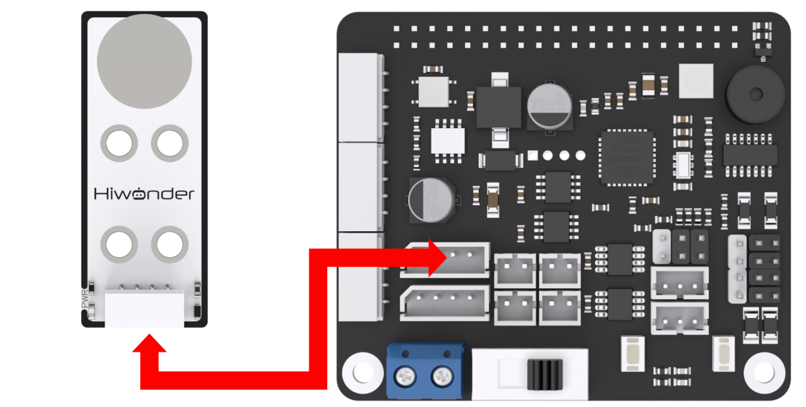

:::{Note}
4 PIN wire adopts anti-reverse plug-in design, please don't insert violently.
:::

### 12.11.3 Start and Close the Game

(1) Power on the robot and use VNC Viewer to connect to the remote desktop.


(2) Click the icon  on the upper-left of the desktop, and open Terminator terminal.Enter command and press Enter.

```bash
cd course/sensor_course/sensor_with_arm/
```

(3) Enter command and press Enter.

```bash
python3 action_control_by_touch_sensor.py
```

(4) If want to close this program, press "**Ctrl+C**". If it cannot be closed, please try again.

### 12.11.4 Program Outcome

After the program runs, the indicator will light up when the object touches the metal plate of the touch sensor. And the buzzer will sound alarm, and then robotic arm will "**wave**" once.

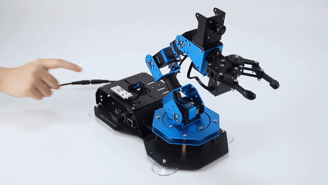

### 12.11.5 Program Analysis

Firstly, monitor the status of the touch sensor in real-time. When object touches the metal plate of the touch sensor, the controller will receive low level signal. Otherwise, it will receive high level signal. Based on this feature, set the robotic arm and buzzer to make corresponding response.
The source code of this program lies in Docker container:

**[/home/ubuntu/course/sensor_course/sensor_with_arm/action_control_by_touch_sensor.py](../_static/source_code/action_control_by_touch_sensor.zip)**

There are several functions mainly used in touch control.

chip.get_line(7): get object of pin7, and assign it to variable "**touch**".

touch.get_value(): read the value of pin.

board.set_buzzer(1900, 0.1, 0.9, 1): set the buzzer to sound for 0.1 second.

"**runAction()**" function is used to control the robotic arm to run the designated action group. Its parameter is the name of action group. Pay attention, the format of the parameter should be the same as the routine.

## 12.12 Infrared Detection

### 12.12.1 Installation

According to the below picture, fix the infrared obstacle avoidance sensor on the cover with M4\*6 round head cross machine screw, M4 nut and M4*3+6 black nylon column.

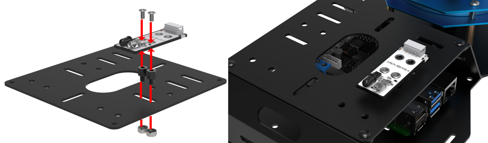

### 12.12.2 Wiring

Through 4PIN wire, connect the infrared obstacle avoidance sensor to **"5V GND IO24 IO22"** interface on RaspberryPi expansion board.

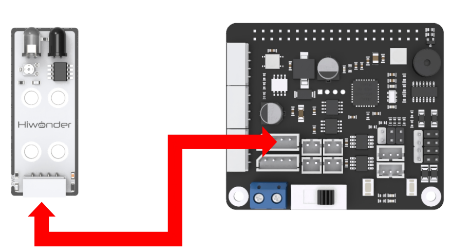

:::{Note}
 4 PIN wire adopts anti-reverse plug-in design, please don't insert violently.
:::

### 12.12.3 Infrared Detection

(1) Power on the robot and use VNC Viewer to connect to the remote desktop.


(2) Click the icon  on the upper-left of the desktop, and open Terminator terminal. Enter command and press Enter.

```bash
cd course/sensor_course/sensor_with_arm/
```

(3) Enter command and press Enter.

```bash
python3 action_control_by_infrared_sensor.py
```

(4) If want to close this program, press "**Ctrl+C**". If it cannot be closed, please try again.

### 12.12.4 Program Outcome

After the game starts, use your hand to cover the front of light sensor. At this time, the indicator will light up. Then the buzzer will sound alarm and the robotic arm will "**wave**" once.

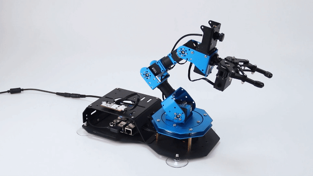

### 12.12.5 Program Analysis

Firstly, detect the status of infrared sensor in real-time. When there is no obstacle ahead, controller will receive high level signal. According to this feature, set the robotic arm and buzzer to make corresponding reaction.

The source code of this program lies in Docker container: **[/home/ubuntu/course/sensor_course/sensor_with_arm/action_control_by_infrared_sensor.py](../_static/source_code/action_control_by_infrared_sensor.zip)**

There are several functions mainly used in infrared detection.

`pin.get_value()`: read the value of pin

`chip.get_line(7)`: get the object of pin7, and assign it to variable "**pin**".

`board.set_buzzer(1900, 0.1, 0.9, 1)`: set the buzzer to sound for 0.1 second.

`runAction()` function is used to control the robotic arm to run the designated action group. Its parameter is the name of action group. Please note that the parameter format should match that of the example routine.
