# 2. Quick User Experience

## 2.1 APP Installation and Connection 

The following instructions use TurboPi as an example and apply to other Hiwonder Raspberry Pi series products as well.
In this section, you will learn how to use APP "**WonderPi**" to control TurboPi. The installation method is as follows.

:::{Note}

① Make sure all APP permissions are turned on in settings, otherwise APP functions will be limited!

② Turn on Location and WiFi before operation.

:::

### 2.1.1 Installation

**[APP Installation Pack (Android)](https://play.google.com/store/apps/details?id=com.Wonder.Pi)**

**[APP Installation Pack (iOS)](https://apps.apple.com/cn/app/wonderpi/id1477946178)**

:::{Note}
- Please turn TurboPi on before connecting. 

- Make sure all APP permissions are turned on in settings, otherwise APP functions will be limited!

- Turn on Location and WiFi before operation.

:::

### 2.1.2 APP Connection

(1) Start robot. (The switch is on Raspberry Pi expansion board). For detailed instruction, please refer to the file in "**[Getting Ready\1.4 Power-On Status Explanation](https://docs.hiwonder.com/projects/ArmPi_FPV/en/latest/docs/1.getting_ready.html#power-on-status-explanation)**".

(2) After TurboPi boots up successfully, it enters AP direct connection mode, and generates a WiFi starting with **"HW"**. Join this WiFi, and then you can experience robot games

* **Introduction to Connection Mode**

There are two connection modes, namely direct connection mode and LAN mode. APP functions are the same under these two modes.

(1) AP direct connection mode: RaspberryPi generates a WiFi which can be connected by phones. But this WiFi has no internet access. 

(2) STA LAN mode: Raspberry Pi actively connects to specific WiFi. In this mode, you can access internet.

* **Direct Connection Mode (MUST-READ)** 

:::{Note}
After TurboPi boots up successfully, it enters AP direct connection mode, and generates a WiFi starting with **"HW"**.
:::

(1) Open"**WonderPi**". Select **"Standard ->TurboPi"** in sequence.

(2) Tap **"+"** in bottom right corner, and then select **Direct Connection Mode**.

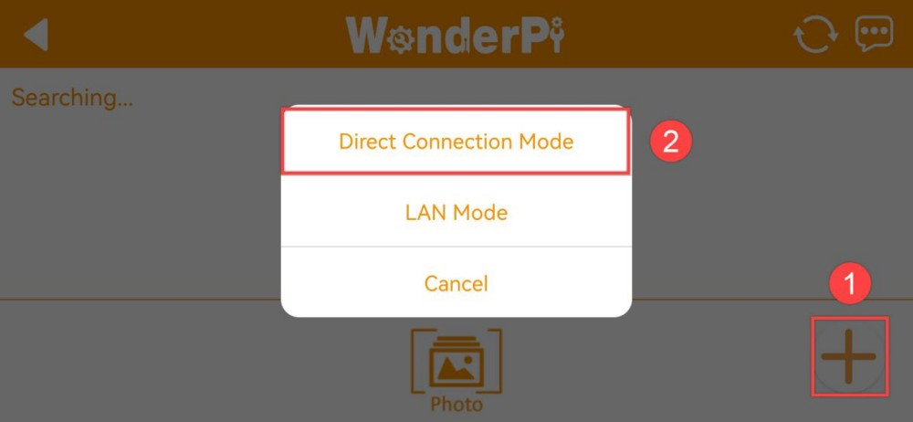

(3) Tap **"Go to connect device hotspot"**. Join WiFi starting with "**HW**". The password is **"hiwonder"**.

(4) Return back to APP after connection.

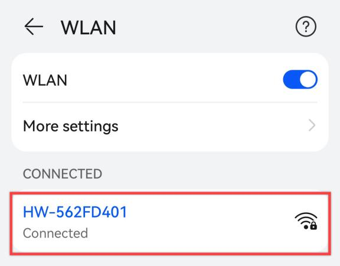

:::{Note}
 for iOS user, please don't return to APP until WiFi icon appears on status bar, otherwise robot cannot be searched. If robot cannot be searched by APP, tap  to refresh.
:::

(5) APP automatically connects to robot. When robot icon below occurs, connection completes. 

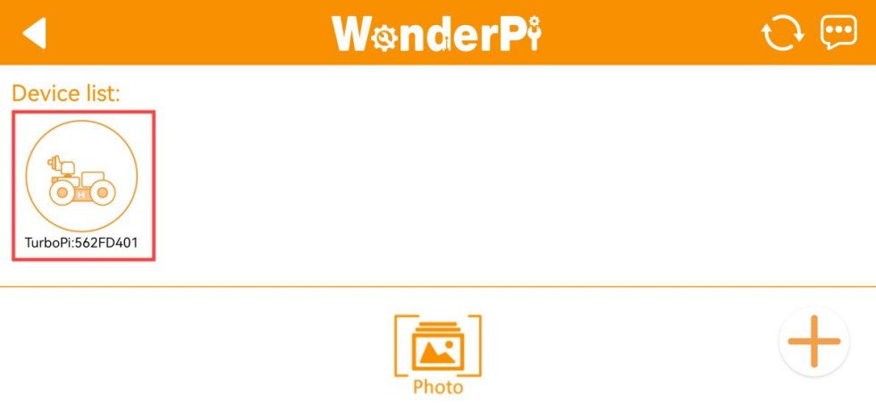

:::{Note}
if you are informed of "**No Internet. Whether to keep connection**", just select "**keep connected**".
:::

(6) Tap robot icon to enter mode selection interface.

For detailed introduction to robot games, please refer to the file in "**[2.2 APP Control](#anchor_2)**".

### 2.1.3  LAN Connection Mode

(1) Disconnect the WiFi generated by TurboPi. Connect your phone to a WiFi. Take **"Hiwonder"** as example.

(2) After connection, open **"WonderPi"**. Select **"Standard ->TurboPi"** in sequence.

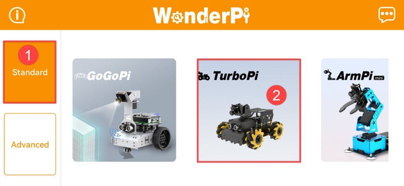

(3) Tap "**+**" in bottom right corner, and then select LAN Mode.

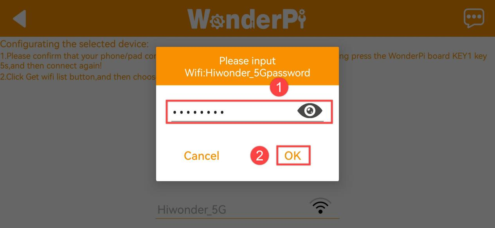

(4) Input the password of the WiFi your phone joins. Ensure the password you input is correct, otherwise APP fails to connect to robot. Tap **"OK"**.

(5) Tap "**Go to connect device hotspot**".

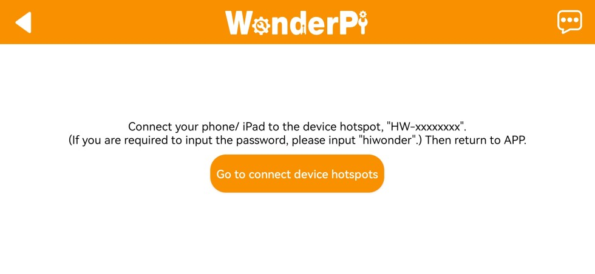

(6) Join the WiFi starting with **"HW".** The password is **"hiwonder"**. After connection, return back to APP.

(7) APP automatically configures network.

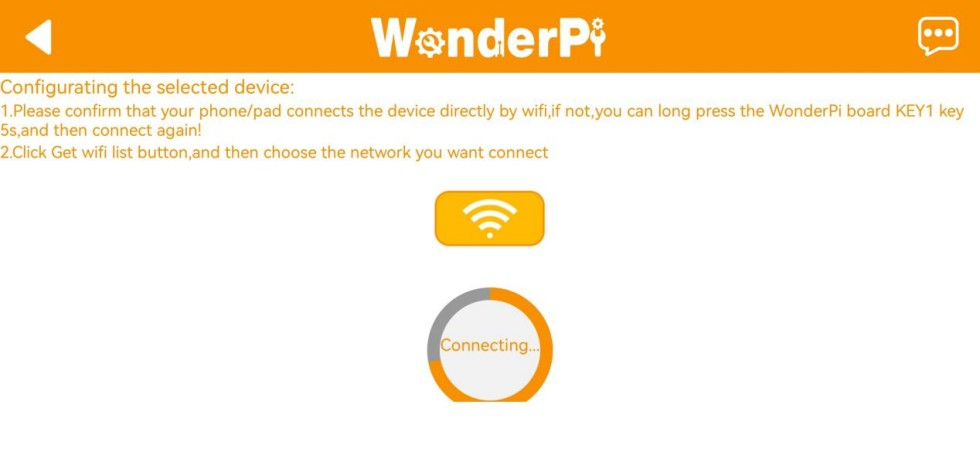

(8) After a while, robot icon below occurs, and LED on expansion board keeps on.

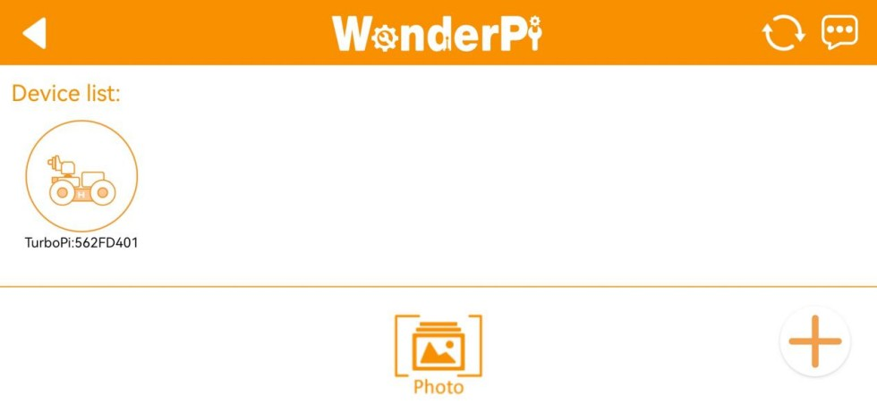

(9) Long press robot icon to check TurboPi's IP and ID.

(10) Tap robot icon to enter mode selection interface.

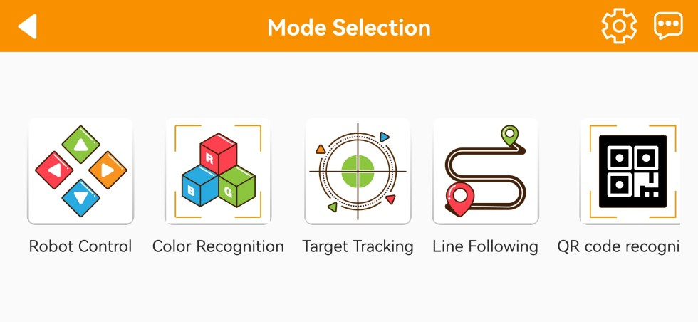

For detailed introduction to robot games, please refer to the file in"**[2.2 APP Control](#anchor_2)**".

## 2.2 App Control

App supports 8 AI games, among which the beginner kit and standard kit only supports 1~6 games, and other two versions support 1~8 games. Please refer to the following table to learn about these games: 

| No. | Game | Outcome |
|:--:|:--:|:--:|
| 1 | Remote Control | Control the movement of the robotic arm |
| 2 | Item Tracking | Select the color. Then the robotic arm will move to track the item in selected color |
| 3 | Face Recognition | The camera will be lifted, and the robotic arm will perform a set of action when recognizing human face |
| 4 | Item Sorting | Select the color and ID of the items to be sorted. And the robotic arm will pick corresponding blocks in recognition area and place them in corresponding sorting area. |
| 5 | Intelligent Stacking | Pick and stack the blocks in corresponding stacking area after identifying the blocks |
| 6 | Intelligent Warehousing | Select the blocks to be warehoused and the shelf for storage. Then the robotic arm will pick the corresponding blocks and place them to the selected shelf. |
| 7 |  Intelligent Delivering  | Select the shelf of the items to be delivered and the place to place. The robotic arm will grab a block from the specified shelf and place it in the corresponding position. |
| 8 | Intelligent Transferring | Move the blocks from one side of the shelf to the other side of the shelf, or move the blocks from one layer to other layer on the same shelf. |

### 2.2.1 Remote Control

After entering "**Remote control**", robotic arm will stand up straight. At this time, you can control each servos of robotic arm. The interface of "**Model Control**" consists of two parts:

(1) At left, it is the robotic arm control area.

(2) At right, it is the area for live camera feed.

Servo can be controlled in two ways. You can click the corresponding buttons at left to control servos, or drag the corresponding servos on live camera feed.

|                                           **Icon**                                        | **Function** |
|:---------------------------------------------------------------------------------------------:|:--:|
|  | Click the corresponding icon to control the servo of ID1, ID2 and ID6 respectively, that is, control the opening, closing and rotation of the gripper as well as the movement of the body. |
|     | Make all the servos on the ArmPi FPV come to the middle position. (The robotic arm will keep upright. ) |
|      | Click "**Hide**" to hide the camera interface . |
|       | Capture the real-time image. |
|       | Close the menu bar. |
|       | Get help information. |

### 2.2.2 Color tracking

The game will track the object in target color. The interface of "**color tracking**" consists of two parts:

(1) At left, it is the area for game start control, color selection and target color display.

(2) At right, it is the live camera feed area.

After starting game, first select the target color. Hold the object containing the target color and move slowly in front of the camera. ArmPi FPV will follow the movement of object while the target color is recognized.

:::{Note}

* Please start this game in a well-lit indoor environment and do not place the object containing the same color with target color on map.

*  Place the target object within the view of camera and move it at appropriate speed.

:::

### 2.2.3 Face Recognition

In this game, ArmPi FPV is able to recognize human face and perform corresponding action. The interface of "**face recognition**" consists of two parts:

(1)  At left, start or stop game.

(2)  At right, it is the live camera feed area.

After stating this game, ArmPi FPV will rotate vertically. When human face is recognized, robotic gripper will perform rotation and picking action.

:::{Note}

* The maximum distance for face recognition is about 1m. Please do not exceed this range.
* Do not move human face too close to avoid failure recognition or accidental injury.

:::

### 2.2.4 Object Sorting

In this game, ArmPi FPV will sort out the block with tag. After entering this game, the interface of "**object sorting**" consists of two parts:

① At left, it is the area for game start control, color selection and target color display.

② At right, it is the live camera feed area.

After selecting the corresponding color and tag at left, tap “Start”. The camera will recognize target block in sorting area, then robotic arm will pick it up and and put in corresponding placement zone.

:::{Note}

- Please start this game in a well-lit indoor environment. 

- Keep a certain interval between the blocks, do not get too close to each other.

- Keep the integrity of the tool, if there are missing corners and stains, the recognition effect of this game may be affected by missing corners and stains.

:::

### 2.2.5 Intelligent Stacking

After starting this game, ArmPi FPV will identify and stack these blocks. The interface is divided into two parts:

① At left, it is the area for game start control.

② At right, it is the live camera feed area.

Before starting game, place the blocks in recognition area. ArmPi FPV will place the block to corresponding area according to the block category.

:::{Note}

* Please start this game in a well-lit indoor environment. 

* Keep a certain interval between the blocks, do not get too close to each other.

* No more than three blocks can be stacked, if you want to continue stacking, you need to remove the stacked blocks.

:::

## 2.3 Adjust Color Threshold

Different light source will have different influence on the colors, which will result in recognition discrepancy. To tackle this problem, you can adjust color threshold via "**WonderPi**" APP.

### 2.3.1 Preparation

Start TurboPi. Open "**WonderPi**" APP, and connect it to TurboPi. For how to connect robot to APP, operate referring to "**[2.1 APP Installation and Connection ](#anchor_1)**".

### 2.3.2 Interface Layout

Tap  in upper right corner to enter color threshold adjustment interface.

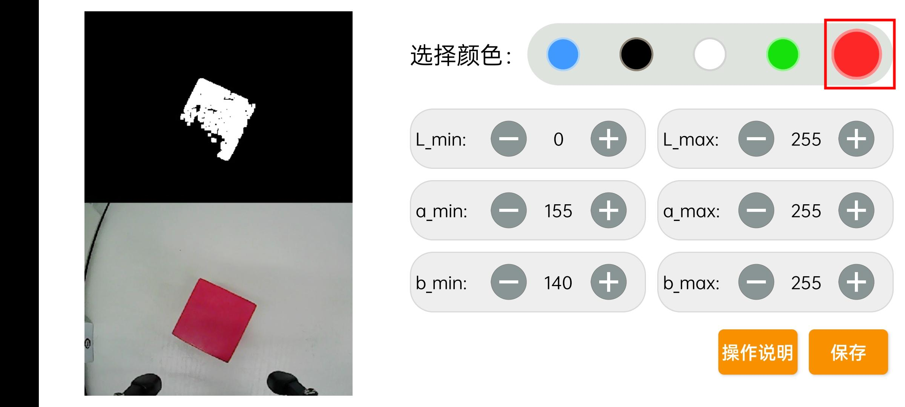

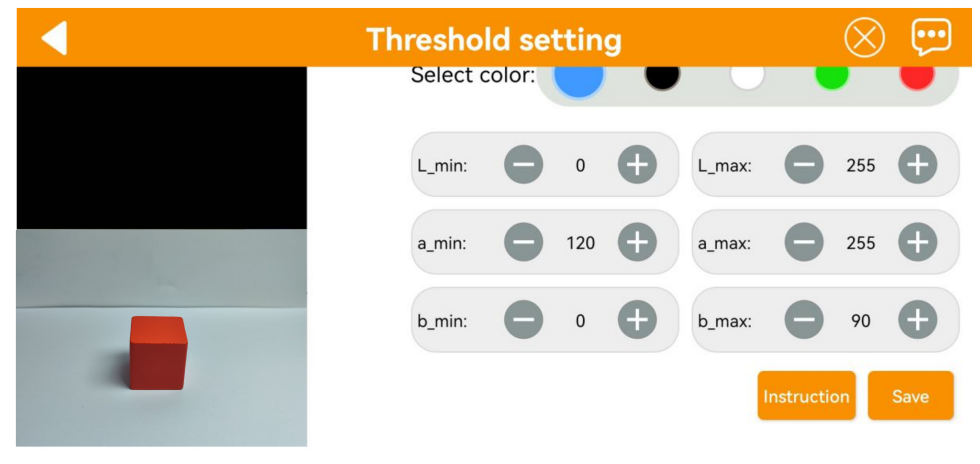

The table below list function of specific icon.

<table class="docutils-nobg" border="1">
<colgroup>
<col  />
<col  />
</colgroup>
<tbody>
<tr>
<td ><strong>Icon</strong></td>
<td ><strong>Function</strong></td>
</tr>
<tr>
<td >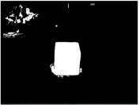</td>
<td >
Processed camera returned image.

Target object is white, and other area is black.
</td>
</tr>
<tr>
<td >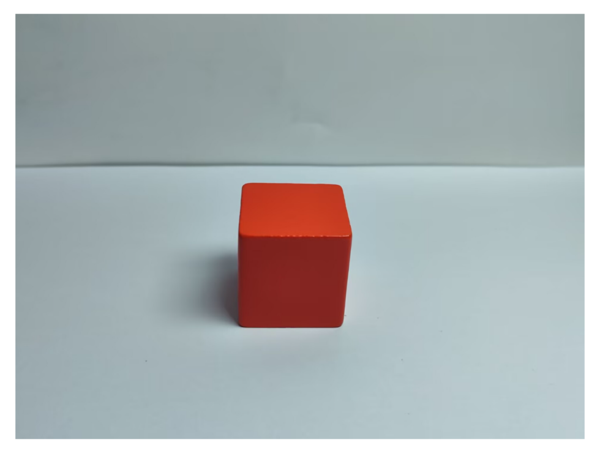</td>
<td >Raw camera returned image.</td>
</tr>
<tr>
<td ></td>
<td >Select the color to be adjusted.</td>
</tr>
<tr>
<td >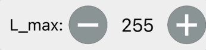</td>
<td >
Adjust L component of camera returned image. "<b>L_min</b>" is lower limit and "<b>L_max</b>" is upper limit.

</tr>
<tr>
<td ></td>
<td >
Adjust A component of camera returned image. "<b>a_min</b>" is lower limit and "<b>a_max</b>" is upper limit.

</tr>
<tr>
<td ></td>
<td >
Adjust B component of camera returned image. "<b>b_min</b>" is lower limit and "<b>b_max</b>" is upper limit.

</tr>
<tr>
<td ></td>
<td >Get instruction to check how to adjust color threshold.</td>
</tr>
<tr>
<td ></td>
<td >Save the adjusted color threshold.</td>
</tr>
<tr>
<td ></td>
<td >Return back to mode selection interface.</td>
</tr>
<tr>
<td ></td>
<td >Hide navigation bar.</td>
</tr>
<tr>
<td ></td>
<td >Display Hiwonder info.</td>
</tr>
</tbody>
</table>

**2.3.3 Adjust Color Threshold**

(1) Select color to be adjusted. Take red as example.

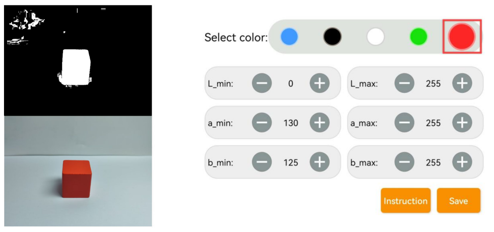

(2) Put red object within camera recognition zone. Set L_min, a_min and b_min to 0, and L_max, a_max and b_max to 255.

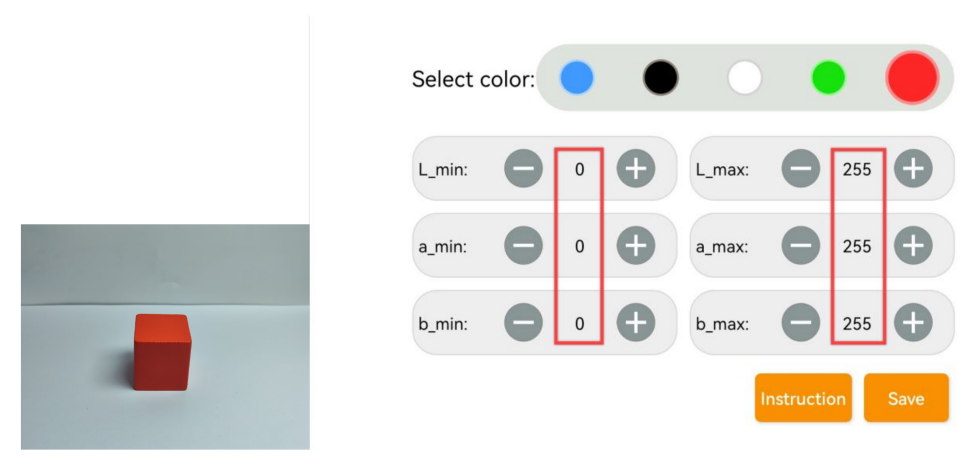

(3) Tap "**Instruction**" icon to check how to adjust color threshold.

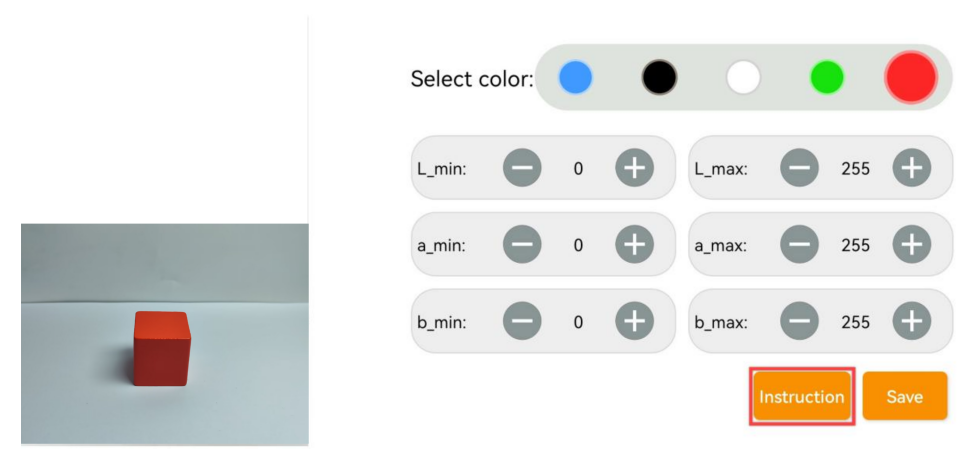

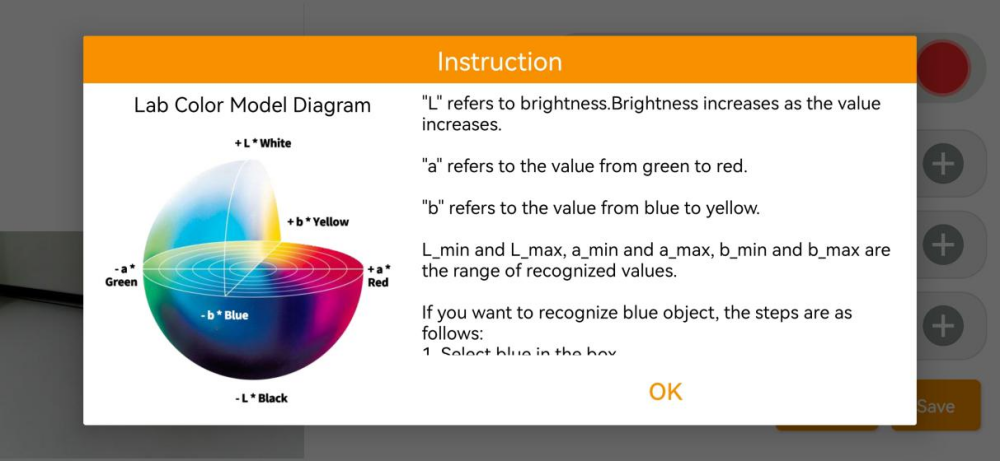

:::{Note}
if you need to close Instruction window, select "**OK**".
:::

(4) Red approaches "**+a**" zone, so you need to adjust A component.

(5) Keep "**a_max**" value the same, and then increase "**a_min**" value till red object turns white and other area is black.

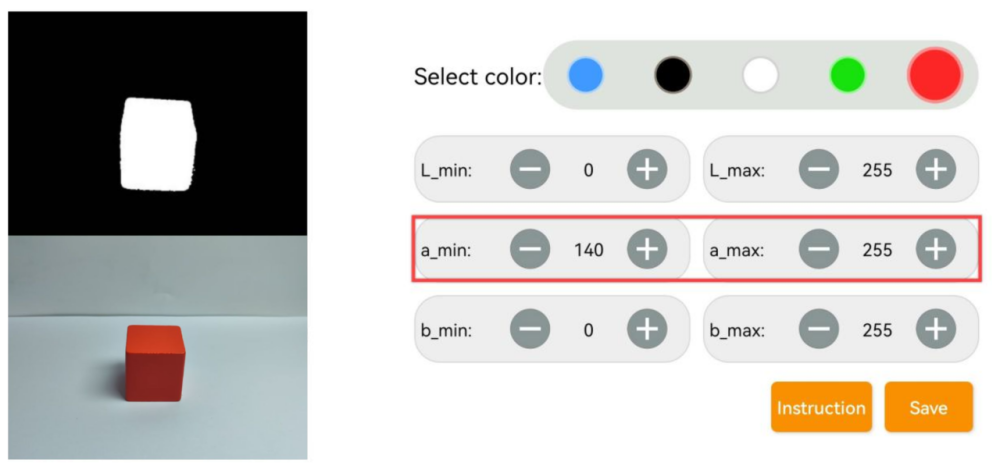

(6) Adjust "**L**" and "**B**" values. If it belongs to light red, increase L_min. Otherwise, decrease L_max. If it belongs to warm tone, increase B_min. Otherwise, decrease B_max.

(7) Remember to save the value after adjustment.

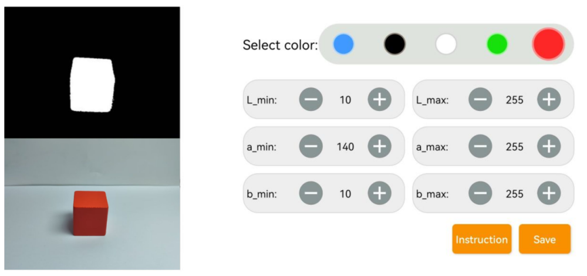

