# 2.Quick User Experience

## [1. APP Installation and Connection]()

## 2. App Control

App supports 8 AI games, among which the beginner kit and standard kit only supports 1~6 games, and other two versions support 1~8 games. Please refer to the following table to learn about these games: 

| No. | Game | Outcome |
|:--:|:--:|:--:|
| 1 | Remote Control | Control the movement of the robotic arm |
| 2 | Item Tracking | Select the color. Then the robotic arm will move to track the item in selected color |
| 3 | Face Recognition | The camera will be lifted, and the robotic arm will perform a set of action when recognizing human face |
| 4 | Item Sorting | Select the color and ID of the items to be sorted. And the robotic arm will pick corresponding blocks in recognition area and place them in corresponding sorting area. |
| 5 | Intelligent Stacking | Pick and stack the blocks in corresponding stacking area after identifying the blocks |
| 6 | Intelligent Warehousing | Select the blocks to be warehoused and the shelf for storage. Then the robotic arm will pick the corresponding blocks and place them to the selected shelf. |
| 7 |  Intelligent Delivering  | Select the shelf of the items to be delivered and the place to place. The robotic arm will grab a block from the specified shelf and place it in the corresponding position. |
| 8 | Intelligent Transferring | Move the blocks from one side of the shelf to the other side of the shelf, or move the blocks from one layer to other layer on the same shelf. |

### 2.1 Remote Control

After entering "Remote control", robotic arm will stand up straight. At this time, you can control each servos of robotic arm. The interface of "Model Control" consists of two parts:

(1) At left, it is the robotic arm control area.

(2) At right, it is the area for live camera feed.

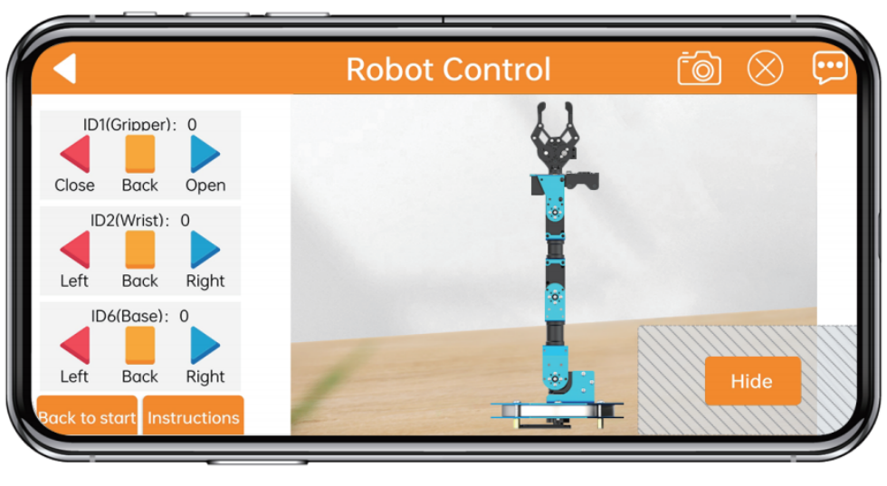

Servo can be controlled in two ways. You can click the corresponding buttons at left to control servos, or drag the corresponding servos on live camera feed.

|                                           **Icon**                                        | **Function** |
|:---------------------------------------------------------------------------------------------:|:--:|
| 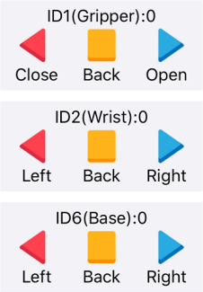    style="width:150px" | Click the corresponding icon to control the servo of ID1, ID2 and ID6 respectively, that is, control the opening, closing and rotation of the gripper as well as the movement of the body. |
|     | Make all the servos on the ArmPi FPV come to the middle position. (The robotic arm will keep upright. ) |
|      | Click "Hide" to hide the camera interface . |
|       | Capture the real-time image. |
|       | Close the menu bar. |
|       | Get help information. |

### 2.2 Color tracking

The game will track the object in target color. The interface of "color tracking" consists of two parts:

(1) At left, it is the area for game start control, color selection and target color display.

(2) At right, it is the live camera feed area.

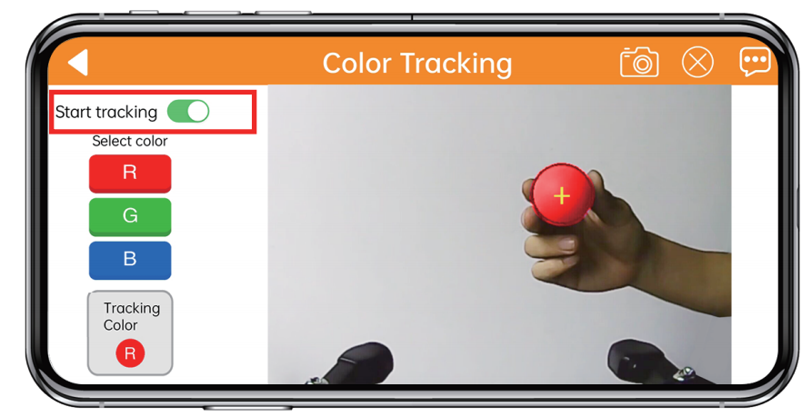

After starting game, first select the target color. Hold the object containing the target color and move slowly in front of the camera. ArmPi FPV will follow the movement of object while the target color is recognized.

|                                          Icon                                          | **Function** |
|:------------------------------------------------------------------------------------------:|:--:|
|  | Start/stop game. |
| 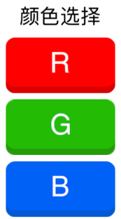 | Select the target color. |
| 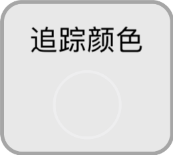 | Display the selected target color. |
|  | Capture the real-time image. |
|  | Close the menu bar of game. |
|   | Get help information. |

:::{Note}

* Please start this game in a well-lit indoor environment and do not place the object containing the same color with target color on map.

*  Place the target object within the view of camera and move it at appropriate speed.

  :::

### 2.3 Face Recognition

In this game, ArmPi FPV is able to recognize human face and perform corresponding action. The interface of "face recognition" consists of two parts:

(1)  At left, start or stop game.

(2)  At right, it is the live camera feed area.

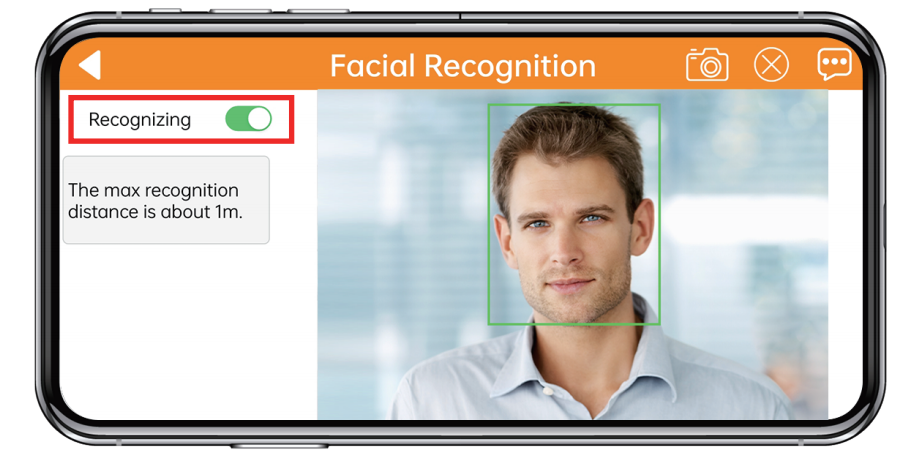

After stating this game, ArmPi FPV will rotate vertically. When human face is recognized, robotic gripper will perform rotation and picking action.

|                                          Icon                                          | Function |
|:------------------------------------------------------------------------------------------:|:--:|
|  | Start/stop game. |
|    | Capture the real-time image. |
|    | Close menu bar. |
|    | Get help information. |

:::{Note}

* The maximum distance for face recognition is about 1m. Please do not exceed this range.
* Do not move human face too close to avoid failure recognition or accidental injury.

:::

### 2.4 Object Sorting

In this game, ArmPi FPV will sort out the block with tag. After entering this game, the interface of "object sorting" consists of two parts:

① At left, it is the area for game start control, color selection and target color display.

② At right, it is the live camera feed area.

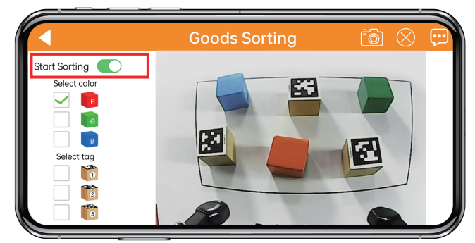

在左侧选择需要分拣的颜色与标签方块后，开启玩法。摄像头识别到分拣区内的目标方块时，会将其夹起，并移动到对应放置区。

|                                          Icon                                       | Function |
|:-------------------------------------------------------------------------------------------:|:--:|
|   | Start/Stop game |
| 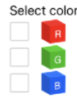 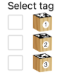 | Select the color and tag to be sorted |
|     | Capture the real-time camera image |
|     | Close menu bar. |
|    | Get help information. |

:::{Note}

- Please start this game in a well-lit indoor environment. 

- Keep a certain interval between the blocks, do not get too close to each other.

- Keep the integrity of the tool, if there are missing corners and stains, the recognition effect of this game may be affected by missing corners and stains.

:::

### 2.5 Intelligent Stacking

After starting this game, ArmPi FPV will identify and stack these blocks. The interface is divided into two parts:

① At left, it is the area for game start control.

② At right, it is the live camera feed area.

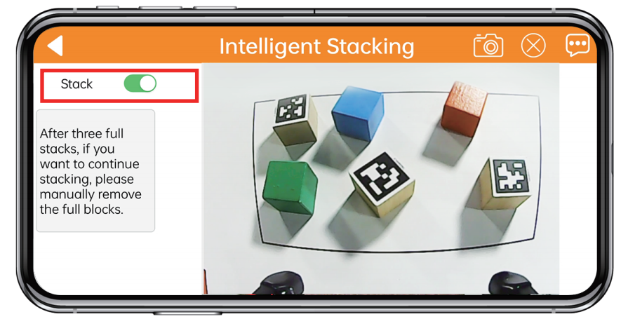

Before starting game, place the blocks in recognition area. ArmPi FPV will place the block to corresponding area according to the block category.

|                                                            Icon                                                            | Function |
|:------------------------------------------------------------------------------------------------------------------------------:|:--:|
|                                     | Start/Stop game |
|                                       | Capture the real-time camera image |
|                                        | Close menu bar. |
|                                        | Get help information. |

:::{Note}

* Please start this game in a well-lit indoor environment. 

* Keep a certain interval between the blocks, do not get too close to each other.

* No more than three blocks can be stacked, if you want to continue stacking, you need to remove the stacked blocks.

:::

### 2.6 Intelligent Warehousing

For users who purchased ArmPi FPV advanced kit or developer kit, you can refer to the document in "[Intelligent Warehouse Course]()" to assemble the shelf for this game.

After starting this game, ArmPi FPV will put target block to the specific position on the shelf. The app interface of game is divided into four parts. 

① The left and right side is the area for selecting shelf.

② The middle is the live camera feed area.

③ The bottom part is the block selection area. 

④ The lower right part is the function button area.

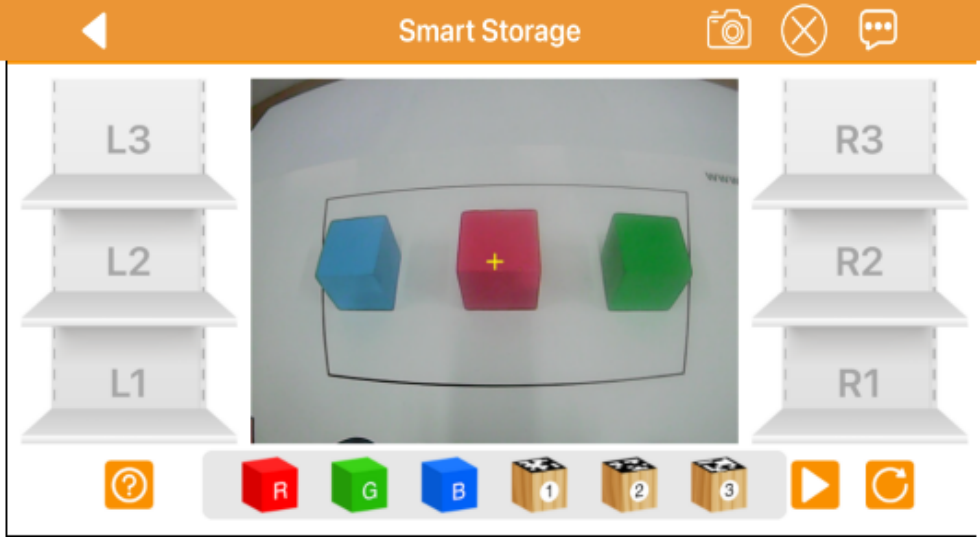

Select the blocks to be warehoused and the shelf for storage and click on.Then the robotic arm will pick the corresponding blocks and place them to the selected shelf. 

|                                                                                      Icon                                                                                      | Function |
|:----------------------------------------------------------------------------------------------------------------------------------------------------------------------------------:|:--:|
|                                                                                           | Start/Stop game. |
|                                                                                           | Clear the previous selection record. |
| 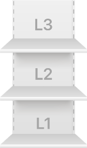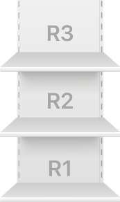 | Select the shelf where the block is placed. |
|                                                                                          | Select the block to be warehoused. |
|                                                                                            | Capture the real-time camera image |
|                                                                                            | Close menu bar. |
|                                                                                            | Get help information. |

:::{Note}

① Please start this game in a well-lit environment.

② Keep a certain interval between the blocks, do not get too close to each other.

:::

### 2.7 Intelligent Delivering

For users who purchased ArmPi FPV advanced kit or developer kit, you can refer to the document in "[Intelligent Warehouse Course]()" to assemble the shelf for this game.

After starting this game, ArmPi FPV will put target block to the specific position on the shelf. The app interface of game is divided into four parts. 

① The left and right side is the area for selecting shelf.

② The middle is the live camera feed area.

③ The bottom part is the area where the delivering sequence of block is selected.

④ The lower right part is the function button area.

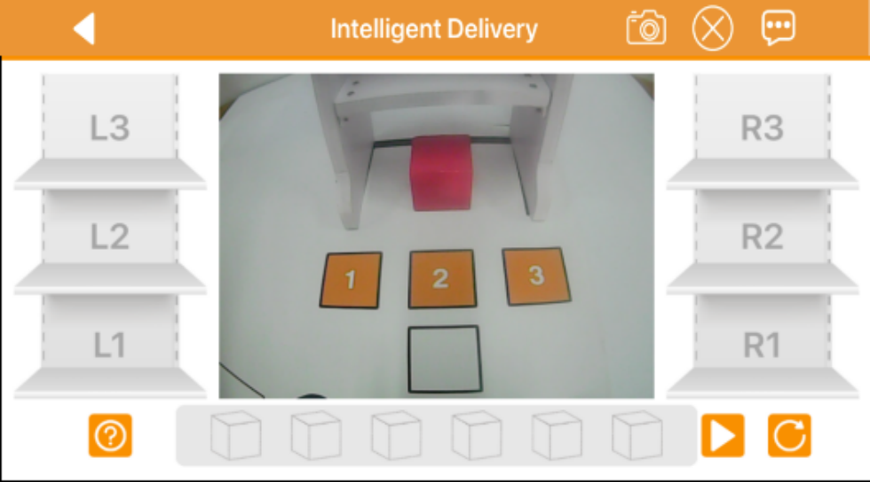

Select the shelf of the items to be delivered and the place to place. Click on  ，robotic arm will grab a block from the specified shelf and place it in the corresponding position. 

|                                                                                      **Icon**                                                                                      | Function |
|:----------------------------------------------------------------------------------------------------------------------------------------------------------------------------------:|:--:|
|                                                                                           | Start/Stop game. |
|                                                                                           | Clear the previous selection record. |
|  | Select the corresponding layer of the shelf |
|                                                                                          | Select the sequence of block to be delivered. |
|                                                                                            | Capture the real-time camera image. |
|                                                                                            | Close menu bar. |
|                                                                                            | Get help information. |

:::{Note}

the block must be placed in the middle of the shelf.

:::

### 2.8 Intelligent Transferring 

For users who purchased ArmPi FPV advanced kit or developer kit, you can refer to the document in "[Intelligent Warehouse Course]()" to assemble the shelf for this game.

After starting this game, ArmPi FPV will put target block to the specific position on the shelf. The app interface of game is divided into four parts. 

① The left and right side is the area for selecting shelf.

② The middle is the live camera feed area.

③ The bottom part is the area for selecting the blocks to be transferred.

④ The lower right part is the function button area.

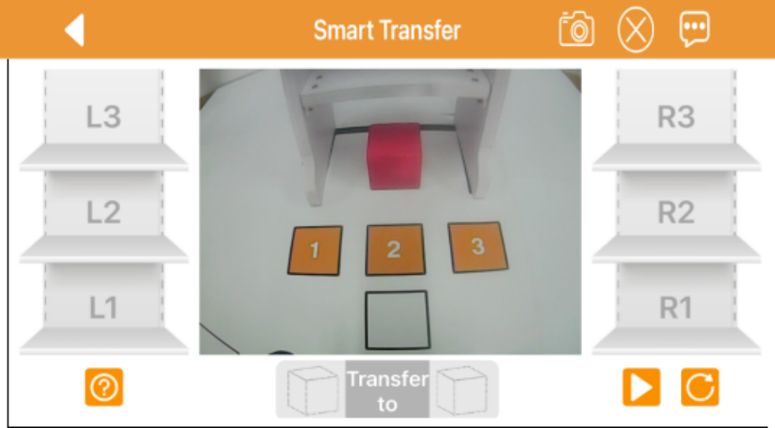

Move the blocks from one side of the shelf to the other side of the shelf, or move the blocks from one layer to other layer on the same shelf.

Drag the specific layer of shelf in which the target block is located to the left of the transferring selection area and tap . The robotic arm will grab the block and move it to the target shelf.

|                                                                                      Icon                                                                                      | Function |
|:----------------------------------------------------------------------------------------------------------------------------------------------------------------------------------:|:--:|
|                                                                                           | Start/Stop game. |
|                                                                                           | Clear the previous selection record. |
|  | Select the shelf to be transferred. |
|                                            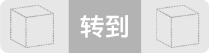                                             | Select the initial shelf layer and the target shelf layer |
|                                                                                            | Capture the real-time camera image |
|                                                                                            | Close menu bar. |
|                                                                                            | Get help information. |

:::{Note}

* Must place the block in the middle of the shelf.

* There must be block in the corresponding position to be transferred, and there should be no square in the place to be transferred.

  :::

  

## [3. Adjust Color Threshold]()

