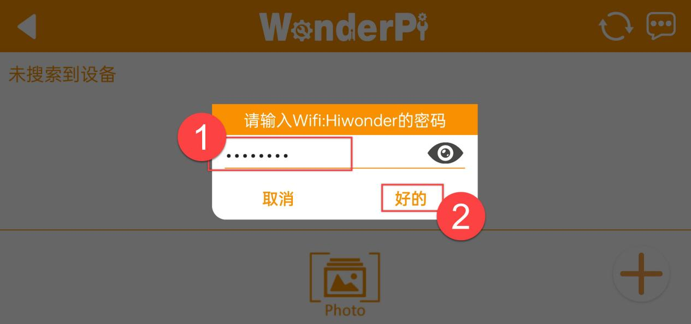

# 上手试玩

## 1. 手机APP安装与连接

### 1.1 APP安装

**[安卓系统](https://play.google.com/store/apps/details?id=com.Wonder.Pi)**： 需要注意，请务必在手机设置内为APP开启所有权限，否则可能会影响正常功能实现！

**[iOS系统](https://apps.apple.com/cn/app/wonderpi/id1477946178)**

### 1.2 设备开机

1)  确认ArmPi FPV机械臂已按照"**[学前先看\2. 安装吸盘、货架及地图摆放](https://docs.hiwonder.com/projects/ArmPi_FPV/en/latest/docs/1.getting_ready.html#id4)**"正确放置在地图上。

2)  确认摄像头连接是否牢固，摄像头连接线可连接至树莓派主板USB的4个接口中的任意一个。

3)  打开树莓派扩展板的开关，等待开机完成。

### 1.3 设备连接

- **连接模式简介**

以下为ArmPi FPV的两种网络模式：

1)  AP 直连模式：开发板能够开启热点被手机连接上。(但不能联通外部网络)

2)  STA局域网模式：开发板能够主动去连接指定的热点/Wi-Fi。(可联通外部网络)

- **直连模式连接方法（必看）**

机器人在开机成功后默认会产生一个以"**HW**"开头的热点，使用手机APP连接到这个热点后，便能启动其它玩法。

1. 打开手机APP，依次选择"**进阶平台-\>ArmPi-\>手眼合一 ArmPi FPV**"。

2)  点击下方图示右下角的"**+**"按钮，选择"**直连模式**"。

3)  接下来按照画面提示，前往手机设置连接"**HW**"名开头的热点。

:::{Note}
若使用苹果手机进行操作，大家在连接热点时，切记要等待手机上方出现了Wi-Fi连接成功的图标（如上图）之后再返回APP，否则可能会搜索不到设备，需按界面右上角的进行刷新。
:::

4)  稍等片刻，等待搜索到下图所示的机器人图标时即代表成功连接。

:::{Note}
若手机弹窗提示"**网络不可用，是否继续连接**"之类的弹窗，单击"保持连接"即可。
:::

- **局域网模式连接方法（选看）**

1.  断开之前ArmPi FPV直连模式下的热点，将手机连接至一个Wi-Fi，这里以连接名称为："**Hiwomder**"的Wi-Fi为例。

2.  连接完成之后，打开"**WonderPi**"，依次选择"**进阶平台-\>ArmPi-\>手眼合一 ArmPi FPV**"。

3.  然后单击右下角"**+**"按钮，选择"**局域网模式**"。

4.  此时APP会提示输入你所连接Wi-Fi的密码（请确认密码是否输入正确，如果输入错误会导致连接失败），输入完成后点击"**好的**"。

5.  再点击"**去连接设备热点**"。

6. 此时手机会自动跳转到Wi-Fi连接页面，找到"**HW**"开头的热点，输入密码 "**hiwonder**"连接它。连接完成之后点击"**返回**"按钮。

7.  连接完成后，可以看到APP已经开始自动配置网络了。

8.  稍等片刻，主界面会显示ArmPi FPV的图标，同时扩展板上的LED灯也会常亮。

9.  长按APP中的ArmPi FPV图标，可以查看分配给ArmPi FPV的IP地址和ID。

10. 点击ArmPi FPV的图标，就可以进入到玩法页面了。

## 2. 手机APP试玩

APP共支持8种玩法，其中入门版和标准版课支持1~6玩法，豪华版与专业开发版支持1~8玩法，玩法总体介绍可参考下表：

| **序号** | **玩法名** | **实现效果** |
|:--:|:--:|:--:|
| 1 | 机体遥控 | 可操控机械臂运动 |
| 2 | 物品追踪 | 在APP中选择指定颜色，机械臂将追踪指定颜色的物品进行运动 |
| 3 | 人脸识别 | 开启功能后，摄像头斜向上抬起，当识别到人脸时，机器人将执行一套动作 |
| 4 | 物品分拣 | 在APP中选择需要被分拣的方块颜色或标签ID，机械臂将从识别区域内夹取对应的方块，然后放置至对应分拣区 |
| 5 | 智能码垛 | 将识别区域内的方块，逐个夹取并**叠放**至对应码垛区 |
| 6 | 智能入库 | 在APP中选择需要被入库方块和入库后的货架位置，机械臂将从识别区域内夹取对应的方块，然后放置至对应货架位置上 |
| 7 | 智能出库 | 在APP中选择出库物品的货架位置和出库后的放置位置，机械臂将从指定货架上夹取方块并放置至识别区的对应位置上 |
| 8 | 智能转仓 | 将一侧货架上的方块夹取至另一侧货架，或同一货架的不同层格 |

### 2.1 机体遥控

此玩法可对机械臂各部位舵机进行操纵。进入玩法界面，机械臂恢复笔直立起姿态。该界面分为两部分：

1.  左侧是机械臂操控区域；

2.  右侧是摄像头回传画面区域。

操控舵机的方式有两种，一是点击左侧对应的控制按键，二是在右侧回传画面内滑动对应舵机。

|                                           **按钮图标**                                            | **功能说明** |
|:---------------------------------------------------------------------------------------------:|:--:|
|     style="width:150px" | 点击对应按键可分别操控ID1、ID2、ID6舵机，即控制夹取器的张合、旋转和机体的转动。 |
|     | 使全部舵机回归中位姿态（机体呈笔直立起状态）。 |
|      | 隐藏摄像头回传画面。 |
|       | 截取实时画面图片。 |
|       | 关闭玩法菜单栏。 |
|       | 打开玩法启动的帮助信息。 |

### 2.2 颜色追踪

此玩法可对含有目标颜色的物体进行追踪。进入玩法界面，该界面分为两部分：

1.  左侧是玩法开关、颜色选择与目标颜色显示区域；

2.  右侧是摄像头画面回传区域。

开启玩法后，选择目标颜色。手持含该颜色的物体在摄像头前缓慢移动，摄像头识别到目标颜色时，机械臂将会跟之进行移动。

|                                          **按钮图标**                                          | **功能说明** |
|:------------------------------------------------------------------------------------------:|:--:|
|  | 开启/关闭玩法。 |
|  | 选择需要追踪的目标颜色。 |
|  | 显示追踪的目标颜色。 |
|  | 截取实时画面图片。 |
|  | 关闭玩法菜单栏。 |
|   | 打开玩法启动的帮助信息。 |

**本玩法注意事项：**

1.  请在光线充足的室内环境下进行此玩法，地图内应无与追踪目标颜色相同或相近的杂物。

2.  追踪的目标需始终位于摄像头的视野范围内，且目标移动的速度不宜过快。

### 2.3 人脸识别

此玩法可对人脸进行识别，并执行动作。进入玩法界面，该界面分为两部分：

1.  左侧是玩法开关区域；

2.  右侧是摄像头画面回传区域。

开启玩法后，机械臂水平转动。摄像头识别到人脸时，机械爪做旋转与夹取动作。

|                                          **按钮图标**                                          | **功能说明** |
|:------------------------------------------------------------------------------------------:|:--:|
|  | 开启/关闭玩法。 |
|    | 截取实时画面图片。 |
|    | 关闭玩法菜单栏。 |
|    | 打开玩法启动的帮助信息。 |

**本玩法注意事项：**

1.  人脸识别的最大距离约为1m，请勿超出该范围；

2.  请勿将人脸过于靠近机械臂，以免无法进行识别，甚至被误伤。

### 2.4 物品分拣

此玩法可对颜色、标签方块进行分拣。进入玩法界面，该界面分为两部分：

1.  左侧是玩法开关、目标颜色与标签选择区域；

2.  右侧是摄像头回传画面区域。

在左侧选择需要分拣的颜色与标签方块后，开启玩法。摄像头识别到分拣区内的目标方块时，会将其夹起，并移动到对应放置区。

|                                          **按钮图标**                                           | **功能说明** |
|:-------------------------------------------------------------------------------------------:|:--:|
|   | 开启/关闭玩法。 |
|  | 选择需要分拣的颜色、标签方块。 |
|     | 截取实时画面图片。 |
|     | 关闭玩法菜单栏。 |
|    | 打开玩法启动的帮助信息。 |

**本玩法注意事项：**

- 请在光线充足的室内环境下进行此玩法。

- 木块之间保持一定的间隔，切勿靠得太近。

- 请保持标签纸面的完整性，若存在缺角、污渍，该玩法的识别效果可能会受到影响。

### 2.5 智能码垛

此玩法可对颜色、标签方块进行分类堆叠。进入玩法界面，该界面分为两部分：

1.  左侧是玩法开关区域；

2.  右侧是摄像头回传画面区域。

将方块放置于识别区内后，开启玩法。摄像头识别到方块时，机械臂会将方块按类别依次堆放到对应区域。

|                                                            **按钮图标**                                                            | **功能说明** |
|:------------------------------------------------------------------------------------------------------------------------------:|:--:|
|                                     | 开启/关闭玩法。 |
|                                       | 截取实时画面图片。 |
|                                        | 关闭玩法菜单栏。 |
|                                        | 打开玩法启动的帮助信息。 |

**本玩法注意事项：**

1.  请在光线充足的室内环境下进行此玩法。

2.  木块之间保持一定的间隔，切勿靠得太近。

3.  方块堆叠的个数不可超过三个，若要继续堆放，则需手动移走已堆叠的方块。

### 2.6 智能入库

豪华版与专业开发版用户可前往"**[智慧仓储课程\1. 货架的安装和摆放](https://docs.hiwonder.com/projects/ArmPi_FPV/en/latest/docs/15.smart_warehousing_course.html#id2)**"进行货架的组装，与玩法的体验。

此玩法可将目标方块放置到设定的货架位置。进入玩法界面，该界面分为四部分：

1.  左侧与右侧是货架层位选择区域；

2.  中间是摄像头回传画面区域；

3.  底部是入库方块选择区域；

4.  右下部分是功能按键区域。

将需要入库的方块拖动到目标货架层位后，点击按键。机械臂检测到识别区内的目标方块时，会将方块依次夹取与放置到对应的货架层位。

|                                                                                      **按钮图标**                                                                                      | **功能说明** |
|:----------------------------------------------------------------------------------------------------------------------------------------------------------------------------------:|:--:|
|                                                                                           | 点击此按键，机械臂开始搬运。 |
|                                                                                           | 清除当前的入库选择。 |
|  | 选择方块入库放置的货架层位。 |
|                                                                                          | 选择需要入库的方块。 |
|                                                                                            | 截取实时画面图片。 |
|                                                                                            | 关闭玩法菜单栏。 |
|                                                                                            | 打开玩法启动的帮助信息。 |

**本玩法注意事项：**

1.  请在光线充足的室内环境下进行此玩法。

2.  木块之间保持一定的间隔，切勿靠得太近。

### 2.7 智能出库

豪华版与专业开发版用户可前往"**[智慧仓储课程\1. 货架的安装和摆放](https://docs.hiwonder.com/projects/ArmPi_FPV/en/latest/docs/15.smart_warehousing_course.html#id2)**"进行货架的组装，与玩法的体验。

此玩法可将货架上的方块按选择依次出库。进入玩法界面，该界面分为四部分：

1.  左侧与右侧是出库货架层位选择区域；

2.  中间是摄像头回传画面区域；

3.  底部是方块的出库顺序排列区域；

4.  右下部分是功能按键区域。

将目标方块所处的货架层位拖动至出库顺序排列区，排列完成后，点击按键。机械臂会依次夹取对应位置的方块，并将其移动至识别区。

|                                                                                      **按钮图标**                                                                                      | **功能说明** |
|:----------------------------------------------------------------------------------------------------------------------------------------------------------------------------------:|:--:|
|                                                                                           | 点击此按键，机械臂开始搬运。 |
|                                                                                           | 清除当前的入库选择。 |
|  | 选择方块入库放置的货架层位。 |
|                                                                                          | 选择方块的出库顺序。 |
|                                                                                            | 截取实时画面图片。 |
|                                                                                            | 关闭玩法菜单栏。 |
|                                                                                            | 打开玩法启动的帮助信息。 |

**本玩法注意事项：**

方块需放置在货架各层的中间位置。

### 2.8 智能转仓

豪华版与专业开发版用户可前往"**[智慧仓储课程\1. 货架的安装和摆放](https://docs.hiwonder.com/projects/ArmPi_FPV/en/latest/docs/15.smart_warehousing_course.html#id2)**"进行货架的组装，与玩法的体验。

此玩法可将货架上的方块转移到指定位置。进入玩法界面，该界面分为四部分：

1.  左侧与右侧是货架层位选择区域；

2.  中间是摄像头回传画面区域；

3.  底部是方块转仓选择区域；

4.  右下部分是功能按键区域。

将目标方块所处的货架层位拖动至转仓选择区的左侧，将目标的转仓位置拖动到选择区的右侧，选择完成后，点击按键。机械臂会夹取目标方块，并将其搬运到目标货架层位。

|                                                                                      **按钮图标**                                                                                      | **功能说明** |
|:----------------------------------------------------------------------------------------------------------------------------------------------------------------------------------:|:--:|
|                                                                                           | 点击此按键，机械臂开始搬运。 |
|                                                                                           | 清除当前的入库选择。 |
|  | 选择方块入库放置的货架层位。 |
|                                                                                         | 选择转仓的初始货架层位与目标货架层位。 |
|                                                                                            | 截取实时画面图片。 |
|                                                                                            | 关闭玩法菜单栏。 |
|                                                                                            | 打开玩法启动的帮助信息。 |

**本玩法注意事项：**

1.  方块需放置在货架各层的中间位置；

2.  被转仓的相应位置要有方块，要转到的地方不能有方块。

## 3. 颜色阈值设置教学  

我们在体验ArmPi FPV视觉玩法过程中，可能会受到周围环境光线的干扰，使得某些玩法达不到预期的效果。这个问题我们可以通过调节颜色阈值得以解决（本节以安卓界面为例进行说明，苹果手机用户也一致适用此方法）。

本节以调节红色为例，步骤如下：

1)  参照"**[1. 手机APP安装和连接](#anchor_1)**"内容，打开APP，连接设备。

2)  在APP控制界面内点击如下图框出按钮，进入阈值设置界面。

3)  我们将红色色块放置在摄像头底下，然后点击红色按钮。

4)  点击"**操作说明**"按钮，进入帮助界面。

5)  我们可以看到红色位于Lab颜色模型图"**+a**"附近（在这里我们只截取了部分操作说明图片，用户可以往下滑动看到更详细的操作说明），故我们需要将阈值的区间往该处调整。点击"**好的**"返回阈值设置界面。

6)  将L、A、B三个颜色分量的数值范围都调整为0~255，即所有_min的参数都为0，所有_max的参数都为255。

7)  保持A分量"**a_max**"的数值不变，将"**a_min**"的数值增大，直至画面显示区上方的颜色物 体区域变为白色，其它区域变为黑色。

8)  再根据所处的环境修改L和B分量的数值。若红色偏浅，则增加L分量"L_min"的数值；偏深，则减小L分量"L_max"的数值。若红色偏暖，则增加B分量"b_min"的数值；偏冷，则减小B 分量"b_max"的数值。调节完成后，点击"**保存**"。

9)  点击屏幕上方空白的地方调出"**菜单栏**"后点击"**返回**"即可。

