# 3. Remote Desktop Installation and Connection

<p id="anchor_1"></p>

## 3.1 VNC Installation and Connection

### 3.1.1 Preparation

* **Hardware**

Prepare a computer. If you are using desktop computer, wireless network card is required.The network card should support 5G band.

* **Install VNC**

VNC is a graphical remote desktop control software. Through connecting your computer to the WiFi generated by Raspberry Pi, you can control Raspberry Pi. Installation of VNC is as below.

(1) Double-click the installation program **"VNC-Viewer-6.17.731-Windows"** in the same directory as this section. Select the installation language as "**English**" and lick "**OK**".


(2) Click "**Next**".


(3) Tick **"I accept the terms in the License Agreement"**. Then click **"Next"**.

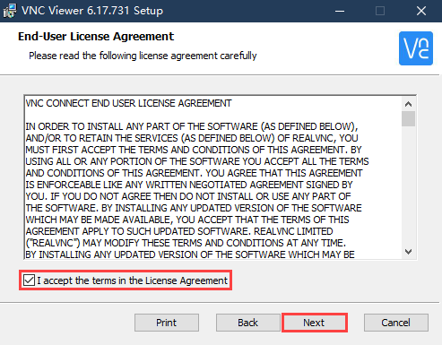

(4) Remain default location where the software is installed. Click **"Next"** to proceed next interface. Then directly click **"Install"**.


(5) When the installation completes, click **"Finish"**.


(6) Click  to open VNC.

* **Start Robot**

Start Robot When LED1 on expansion board starts flickering and buzzer emits one beep, robot boots up successfully.

### 3.1.2 Connect to Robot

(1) After turning Robot on successfully, the default mode is AP direct connection mode. Robot generates a WiFi starting with HW. Connect your computer to this WiFi.


(2) Input password. The password is **"hiwonder"**.


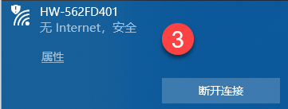

(3) After connection, open VNC Viewer. Input the default IP address of Raspberry Pi, **192.168.149.1**, and then press Enter. If you receive security warning, select **"Continue"**.


(4) Input username and password. **(Username: pi  Password: raspberrypi)**. Click **"OK"** to enter Raspberry Pi desktop.


(5) The desktop is as pictured. If black screen occurs or only cursor leaves on the screen, restart Raspberry Pi.


### 3.1.3 Introduction to Desktop

The desktop is as pictured after connecting Robot through VNC successfully.


The following table demonstrates common functions:

<table  class="docutils-nobg" border="1" style="text-align:center;">
<colgroup>
<col  />
<col  />
</colgroup>
<tbody>
<tr>
<td >Icon</td>
<td >Function</td>
</tr>
<tr>
<td ></td>
<td ><p>Application menu. Click to select different applications.</p>
<p></p></td>
</tr>
<tr>
<td ></td>
<td >Browser.</td>
</tr>
<tr>
<td ></td>
<td >File manager.</td>
</tr>
<tr>
<td ></td>
<td >LX terminal. Click to input command line in the opened interface.</td>
</tr>
<tr>
<td >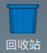</td>
<td >Trash. You can find the files deleted here.</td>
</tr>
<tr>
<td ></td>
<td >PC software. You can adjust pan tilt and adjust color threshold on it.</td>
</tr>
<tr>
<td ></td>
<td >Full screen or exit full screen.。</td>
</tr>
<tr>
<td ></td>
<td >Exit full screen.</td>
</tr>
<tr>
<td >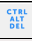</td>
<td ><p>Shut down, reboot and logout</p>
<p></p></td>
</tr>
</tbody>
</table>


## 3.2. Brief Instruction to System Directory

### 3.2.1 Desktop Layout

After remotely connecting to VNC, Raspberry Pi system desktop is as follow:


The following six icons are mainly focused:

|                                   Icon                                   | Function |
|:--------------------------------------------------------------------------:|:--:|
| 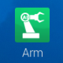 | ArmPi FPV PC Software contains action programming and calling functions, etc. |
|   | Color model parameter adjustment tool |
| 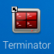  | Command line terminal used for inputting command to perform operation |
|   | Trash |
|   | Raspberry Pi Menu Bar |
| 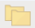  | System File Folder |

### 3.2.2 Program Structure Instruction

:::{Note}
The entered command should be case sensitive, as well as spaces. And "**TAB**" key can auto-complement key words.
:::

* **Raspberry Pi host**

(1) Click the icon  on the top left corner of the desktop, or press "**Ctrl+Alt+T**" to open command line terminal. 

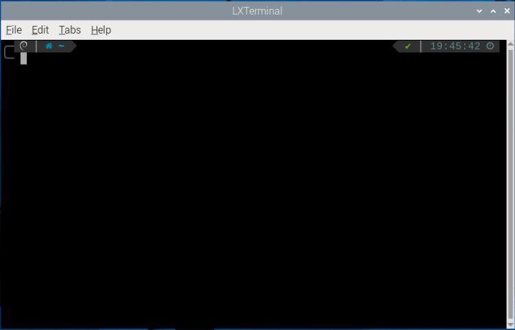

(2) Input command, then press enter to list all the current files. Mainly focuses on these two directories as pictured:

```shell
ls
```

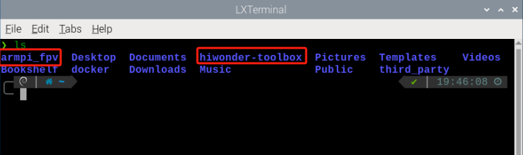

|     **Name**     |                           Function                           |
| :--------------: | :----------------------------------------------------------: |
|    armpi_fpv     | Store the armpi_fpv PC software and adjustment tool of color threshold. |
| hiwonder-toolbox |                    Wi-Fi management tool                     |

* **docker**

Because all the games and program source code of armpi_fpv are stored in Docker container, you need to enter the container to check them. 

(1) Click the icon  on the left top corner of the system desktop to open Terminator terminal. 


(2) In command line terminal, enter "**docker ps -a**" to display the container currently running and previously run. The "**container id**" is the ID of container, "**image**" is the image name of the container, "**created**" is the created time of the container, "**status**" is the current state of the container.

```shell
docker ps -a
```

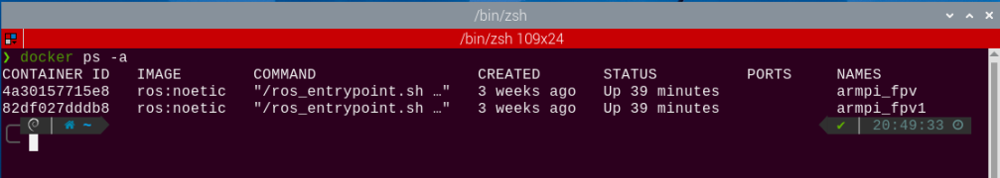

(3) Based on the acquired container ID (the only one), input command to enter the container where the functional program is installed. The container ID can be abbreviated as long as it is the unique identification of this container.

```shell
docker exec -it -u ubuntu -w /home/ubuntu 82df /bin/bash
```

(4) Enter command to list all the current files. Mainly focuses on these two directories as pictured:

```shell
ls
```

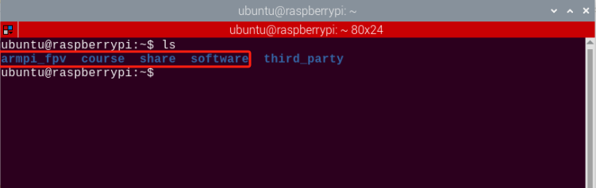

|   Name    |                           Function                           |
| :-------: | :----------------------------------------------------------: |
| armpi_fpv |           The working space stored armpi_fpv games           |
|   coure   |                  Store games of python type                  |
|   share   |          Shared drive letter with the Raspberry Pi           |
| softwave  | store PC software and adjustment tool of color threshold, etc. |

(5) Next, proceed to the game and program source code directory. Input command.

```shell
cd armpi_fpv/src/
```

(6) And input command to list all the folders and files in this directory.

```shell
ls
```

|       **Name**        |           **Function**           |
|:---------------------:| :------------------------------: |
|     ActionGroups      | Store all the action group files |
|   AprilTagTrack.py    |           Tag location           |
| ApriltagCoordinate.py |           Tag tracking           |
|   ApriltagDetect.py   |       AprilTag recognition       |
|    ApriltagSize.py    |       AprilTag recognition       |
|  CV2_ColorDiscern.py  |        Color recognition         |
|     ColorAngle.py     |     Blocks angle recognition     |
|  ColorCoordinate.py   |         Colored locating         |
|   ColorTracking.py    |          Color tracking          |
|   GestureControl.py   |  Gesture-guided goods stacking   |
| GestureRecognition.py |       Gesture recognition        |
|     ShapeCode.py      |       Barcode recognition        |

(7) Next, enter the game and program source code directory, and enter command. 

```shell
cd armpi_fpv/src
```

(8) Then input command to list all folders and files in this directory.

```shell
tree -L 1
```

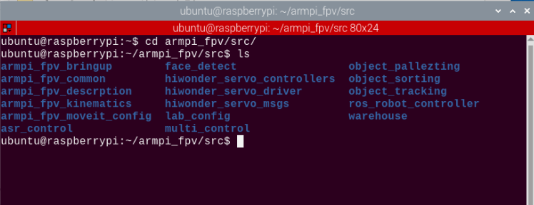

|     **Name**      |                     **Function**                     |
| :---------------: | :--------------------------------------------------: |
|    face_detect    |                   Face recognition                   |
| object_pallezting |                 Intelligent stacking                 |
|  object_sorting   |                 Intelligent sorting                  |
|  object_tracking  |                    Color tracking                    |
|     warehouse     | Intelligent warehouse (advanced version source code) |
|    asr_control    |     Voice control (advanced version source code)     |

## 3.3 Docker Container Introduction and Entry

### 3.3.1 Docker Introduction

Docker, an open-source platform and tool, helps you to package, distribute, and run apps within containers. Container is a lightweight, independent, executable software package that includes the application code, runtime environment, system tools, system libraries and settings. Docker allows developers to package applications along with their dependencies, not just the application itself, facilitating rapid and consistent deployment across different environments. 
In technical terms, Docker utilizes Linux containerization technology of operating system, making the isolation between applications more efficient. And it can run multiple containers on the same physical machine, with each container being independent and not affecting each other.
After all, Docker can be understood as a tool that makes applications and their dependencies more portable and easier to manage, bringing great convenience to software development and deployment.


<p style="text-align: center;">Docker Sign</p>

You can go to "**Docker Container Basic Course**" or relevant Docker websites to learn Docker.

Docker official website：[http://www.docker.com](http://www.docker.com)

Docker Chinese website：[https://www.docker-cn.com](https://www.docker-cn.com)

Docker Hub (warehouse) official website：[https://hub.docker.com](https://hub.docker.com)

### 3.3.2 Docker General Commands

All the games and programs of this product will be run in the Docker container. In order to help users to quickly understand and get started with this product, the following introduces the general commands of Docker. 

(1) Start up the device and connect it with VNC remote connection tool according to "[**3.1 VNC Installation and Connection**](#anchor_1)".

(2)  Click the icon  on the left top corner of the system desktop to open Terminator terminal. 

<p id="anchor_3_2_1"></p>

* **Check Containers**

Command parameters instruction：`docker ps [OPTIONS]`

General parameters instruction:

(1) -a ：list all currently running containers + containers that have been run in the past.

(2) -l ：display recently created containers

(3) -n=? ：display recently created n containers

(4) -q ：silent mode, only display container number

In the command line terminal, enter "**docker ps -a**" to display running and previously run containers. "**container id**" is the ID of containers, "**image**" is the image name of this container, "**created**" is the created time of the container, "**status**" is current state of container.

```bash
docker ps -a
```


- **Enter Containers**

According to "[**3.3.2 Docker General Commands->Check Containers**](#anchor_3_2_1)" to get container ID (the only one). Input command to enter the container where the functional program is installed. The container ID can be abbreviated as long as it is the unique identification of this container.

```bash
docker exec -it -u ubuntu -w /home/ubuntu 82df /bin/bash
```

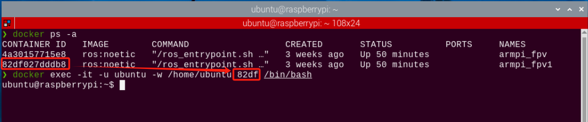

- **Exit Containers**

There are two commands to exit containers:

(1) Input "**exit**" directly in terminal and press enter key. While the container will stop running and exit.

```bash
exit
```

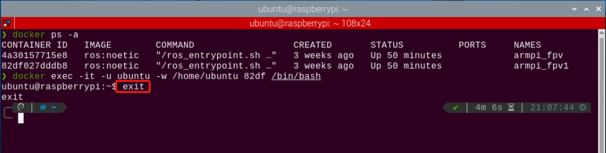

(2)  Use the shortcut key combination **"ctrl+P+Q"**. The container will exit directly but remain running. You can input command in terminal to check the running containers. 

```bash
docker ps
```

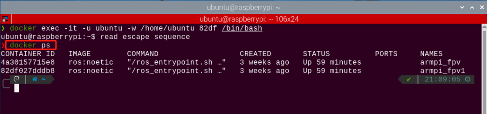

### 3.3.3 Convenient Tool Usage (MUST READ)

It is inconvenient to input command in the terminator terminal every time. Therefore, you can set command to enter the container in the terminator tool. 

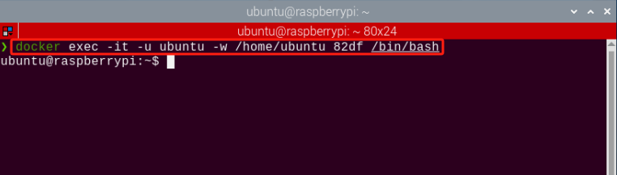

(1)  Right-click the terminator window, and click "**Preference**".

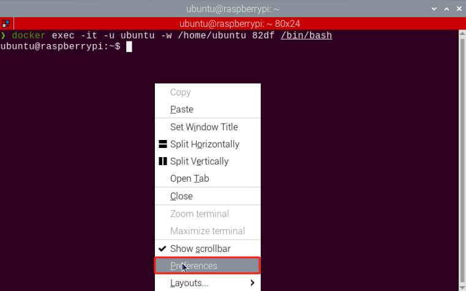

(2) Select **Profiles->Command**.

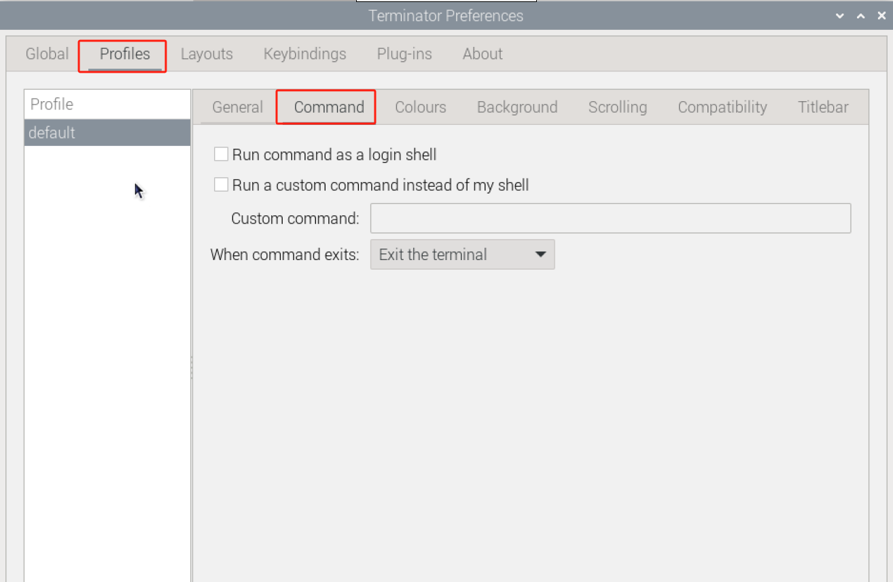

(3)  In the  column, input command to enter the container. 

Note: 82df is the container ID of the container with the functional games.

```bash
host + && docker exec -it -u ubuntu -w /home/ubuntu puppypi /bin/zsh
```

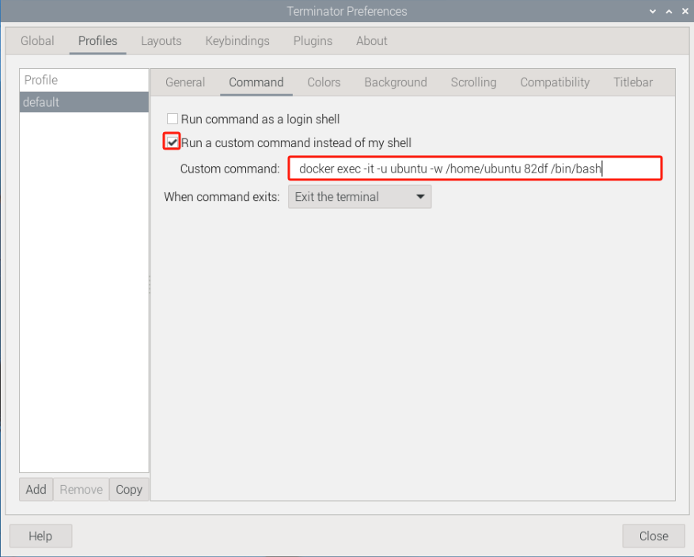

(4)  Then click to close. In this way, every time you open the terminal, you can enter directly to the container with the functional program. 

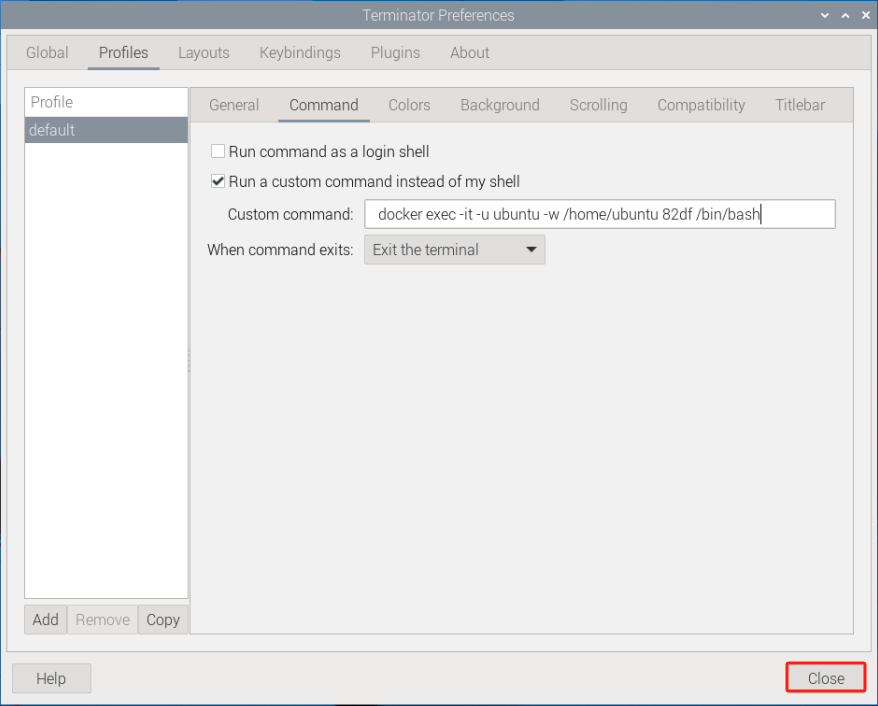
