# 5. Robotic Arm Coordinate System Establishment

## 1. Coordinate System 

### 1.1 Coordinate System 

Most of the descriptions of spatial position, speed and acceleration are in Cartesian coordinate system, which is well known as a coordinate system composed of three mutually perpendicular coordinate axes. When we say how many angles to rotate around a certain axis, the right-hand rule is used to determine the positive direction, as shown below:


### 1.2 Position, Translation Swap

The position is represented by a three-dimensional vector, and the translation transformation is the transformation of the coordinate system space position, which can be represented by the position vector of the coordinate system origin O, as shown in the figure below. Multiple translation transformations are also very simple. You can find the coordinates of a point in space in the coordinate system {B} after translation transformation by adding directly between vectors.


### 1.3 Angle/Direction, Rotation Transformation

Compared with the position, the representation method of the bearing is relatively troublesome. Before discussing the bearing , it is necessary to explain one point: the three-dimensional position and orientation of an object are usually "attached" to the object with a coordinate system that moves and rotates with it, and then by describing the coordinate system and the reference coordinate system Relationship to describe this object.

Describing the position and orientation of an object in the coordinate system can be equivalently understood as describing the relationship between the coordinate systems. We talk about angle/direction notation here, as long as we talk about the relationship between two coordinate systems. To know how and how much a coordinate system is rotated relative to another coordinate system, what should be done? Let's start with the two-dimensional situation:


By coordinate axis unit vector with the reference coordinate system expressing, though reference the picture we can directly written the following formula:


We define a 2x2 matrix:

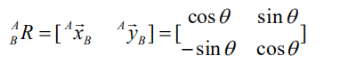

Obviously, each column of this matrix is the representation of the coordinate axis unit vector of coordinate system B in the coordinate system. With this matrix, we can draw the x-axis and y-axis of coordinate system B and determine the unique orientation of B.

### 1.4 Rotation Matrix

The three-dimensional orientation of space is relatively more complicated, because the orientation of the coordinates on the plane can only have one degree of freedom, that is, to rotate around the axis of the vertical plane. The orientation of objects in space will have three degrees of freedom. However, if we start from the first method in the figure above, we can easily write a 3×3 R matrix, which we call the rotation matrix:


This formula shows that in the rotation matrix from the coordinate system {B} to the coordinate system {A}, each column is the representation of the coordinate axis unit vector of the coordinate system {B} in the coordinate system {A}.

## 2. Brief Analysis of Inverse Kinematics

### 2.1 Inverse Kinematics Introduction

Inverse kinematics is the process of determining the parameters of the joint movable object to be set to achieve the required posture.

The inverse kinematics of the robotic arm is an important foundation for its trajectory planning and control. Whether the inverse kinematics solution is fast and accurate will directly affect the accuracy of the robotic arm’s trajectory planning and control. so it is important to design a fast and accurate inverse kinematics solution method for a six-degree-of-freedom robotic arm.

### 2.2 Brief Analysis of Inverse Kinematics

For the robotic arm, the position and orientation of the gripper are given to obtain the rotation angle of each joint. The three-dimensional motion of the robotic arm is complicated. In order to simplify the model, we remove the rotation joint of the pan-tilt so that the kinematics analysis can be performed on a two-dimensional plane.

Inverse kinematics analysis generally requires a large number of matrix operations, and the process is complex and computationally expensive, so it is difficult to implement. In order to better meet our needs, we use geometric methods to analyze the robotic arm.


We simplify the model of the robotic arm, remove the pan-tilt at the base, and the actuator part to get the main body of the robotic arm. From the figure above, you can see the coordinates (x, y) of the end point P of the robotic arm, which ultimately consists of three parts (x1+x2+x3, y1+y2+y3).

Among them θ1, θ2,θ3 in the above figure are the angles of the servo that we need to solve, and α is the angle between the paw and the horizontal plane. From the figure, it is obvious that the top angle of the claw α=θ1+θ2+θ3, based on which we can formulate the following formula:


Among them, x and y are given by the user, and l1, l2, and l3 are the inherent properties of the mechanical structure of the robotic arm.

In order to facilitate the calculation, we will deal with the known part and consider the whole:


Substituting m and n into the existing equation, and then simplifying can get:


Through calculation:


We see that the above formula is the root-finding formula of a quadratic equation in one variable:


Based on this, we can find the angle of θ1, and similarly we can also find θ2. From this we can obtain the angles of the three steering gears, and then control the steering gears according to the angles to realize the control of the coordinate position.

### 2.3 Inverse Kinematics Program Position

The inverse kinematics program has been packaged, and the path can be found in **[/home/ubuntu/armpi_fpv/src/armpi_fpv_kinematics/scripts/]().** For detailed code instruction, please refer to the corresponding program comments.

```
search_kinematics_solution_node.py
```

## 3. Multiple Servos Control

### 3.1 Program Description

In this section, you will learn how to use control function to control servos on the robotic arm respectively. 

You can control the width pulse of servo through servo control function to make servo rotate to the specific position.

### 3.2 Start and Close the Game

:::{Note}
 the entered command should be case sensitive and "Tab" key can be used to complement the keywords.
:::

(1) Power on the robot and use VNC Viewer to connect to the remote desktop.


(2) Click the icon  on the top left corner of the system desktop, and open Terminator terminal to input command. Then press enter key to switch to the program directory. 

```shell
cd /home/ubuntu/course/control_course/
```

(3) Enter command to start the game. 

```shell
python3 control_by_servo.py
```

(4) You can press "Ctrl+C" to close this program.

### 3.3 Program Outcome

After starting the game, the servos will begin to rotate starting from the servo No.1.

### 3.4 Program Analysis

The source code of program is stored in **[/home/ubuntu/course/control_course/control_by_servo.py]()**

**3.4.1 Import related library**

```python
import time
from commom.ros_robot_controller_sdk import Board
```

"time" is the time-related library; "Board" is the library related to the expansion board control.

To call the function in function library, you can use code "the library name.function name (param, param)". For example, time.sleep (1)

```python
time.sleep(1)
```

The function of code above is to call "sleep()" function from in "time" library. "Sleep()" is used for latency.

There are some built-in libraries in Python, which can be directly imported to call. For example, time, cv2, math, etc. In addition, you can customize a library, such as "Board" inverse kinematics library applied in the program of this lesson.

**3.4.2 Robotic arm movement**

```python
board.bus_servo_set_position(0.5, [[2, 200], [3, 700]])
```

Take code `board.bus_servo_set_position(0.5, [[2, 200], [3, 700]])` for example. The meaning of parameters in parentheses is as follow:

Parameter `0.5` means the duration of rotation in second.

Parameter `2, 200` means the ID number and the target pulse width of servo. 

Parameter `3, 700` means the ID number and the target pulse width of servo.


## 4.Movement Control

### 4.1 Program Description

This lesson will control robotic arm’s movement by setting the position coordinate of the end effector of robotic arm.

Inverse kinematics is used to calculate the joint angle based on the coordinate of the target position. Then it converts the angle to the pulse width for controlling the servo. This process allows the robotic arm’s end-effector to move precisely to the target position.

### 4.2 Start and Close the Game

:::{Note}
 the entered command should be case sensitive and "Tab" key can be used to complement the keywords.
:::

(1) Power on the robot and use VNC Viewer to connect to the remote desktop.


(2) Click the iconon the left top-corner of the system desktop, and open Terminator terminal to input command . Then press enter key to close the self-starter service of the app. 

(3) Enter the command in the program directory.

```shell
cd /home/ubuntu/course/control_course/
```

(4) Enter command to start the game. 

```shell
python3 control_by_kinematics.py
```

(5) You can press "Ctrl+C" to close this program.

(6) After experiencing the game, you can start app service through command or restarting the robot. If the app service is not opened, the related function of app will be failure to perform. If the robot restarts, the app service will automatically start.

(7) Click icon  on the top left corner of the desktop and input "sudo systemctl restart start_node.service" in the system path. Then press enter to start the app service. Wait for the robotic arm to return to its initial pose, and you will hear a "Di" sound from the buzzer, signaling completion. Note: input command of starting app service in system path rather than in the docker container.

### 4.3 Program Outcome

After starting the program, robotic arm will first move left and right, then forward and backward, and finally up and down.

### 4.4 Program Analysis

The source code of program is stored in container:  **[/home/ubuntu/course/control_course/control_by_kinematics.py]()**

**4.4.1 Import related library**

```python
import time
import numpy as np
from kinematics import transform
from commom.ros_robot_controller_sdk import Board
from kinematics.kinematics_controller import kinematicsController
```

"time" is the time-related library; "KinematicsController" is the library related to the inverse kinematics.
To call the function in function library, you can use code "the library name.function name (param, param)". For example, time.sleep (1)

```python
time.sleep(1)
```

The function of code above is to call "sleep()" function from in "time" library. "Sleep()" is used for latency.

There are some built-in libraries in Python, which can be directly imported to call. For example, time, cv2, math, etc. In addition, you can customize a library, such as "KinematicsController" inverse kinematics library applied in the program of this lesson.

**4.4.2 Instantiate function**

```python
board = Board()
controller = kinematicsController(board)
```

Instantiate the function for easier invocation later on. For example,

In "controller = KinematicsController(board)," the KinematicsController class is instantiated as an object assigned to the variable "controller." Pass parameter "board" to the constructor function of the " KinematicsController" class.

**4.4.3 Robotic arm movement**

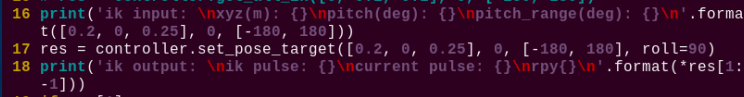

Take the following code as an example.

```python
controller.set_pose_target([0.2, 0, 0.25], 0, [-180, 180], roll=90)
```

The meaning of parameters in parentheses is as follow:

Parameter "[0.2, 0, 0.25]" represents the coordinate (X,Y,Z) of end-effector in three dimensional space with robotic arm as origin. 

Parameter "0" is the pitch angle of robotic arm moving to the end coordinate. 

Parameter "[-180, ]" and "[180]" are the range of pitch angle. When robotic arm can not reach to the specified pitch angle, it will find a solution closest to the given pitch angle. 

Parameter "roll=90" is the target pose of the "roll angle".

## 5. Color Block Localization

### 5.1 Program Description

(1) The colored block needs to be identified before it is located. Firstly, convert RGB color space to Lab by using Lab color space, and perform binarization, open and closed operations to obtain the contour of the target color. In this way, object color can be recognized. 

(2) Next, detect all contours obtained and find the maximum area by comparing them. Then get the coordinate of four corners of the target contour and calculate the coordinate of the center.

(3) Finally, outline the target contour with a red box, display the center coordinates of the contour, and control the LED lights on the expansion board to illuminate in the target color.

(4) After getting the maximum contour, the minimum bounding rectangle is
obtained by calling the "minAreaRect()" function in cv2 library, which is an array or vector of point sets with point coordinates stored in parentheses.

(5) Calling the "boxPoints()" function to obtain the coordinates of four vertex of target rectangle. Take code "box = np.int0(cv2.boxPoints(rect))" as example. The coordinates of the four vertices of the minimum external rectangle of the target contour are obtained here, and the coordinates of the center of the rectangle can be calculated on this basis subsequently.

### 5.2 Start and Close the Game

:::{Note}
the entered command should be case sensitive and "Tab" key can be used to complement the keywords.
:::

(1) Power on the robot and use VNC Viewer to connect to the remote desktop.


(2) Click the iconon the left top-corner of the system desktop, and open Terminator terminal to input command . Then press enter key to close the self-starter service of the app. 

```shell
sudo ./.stop_ros.sh
```

(3) Enter the command in the program directory.

```shell
cd /home/ubuntu/course/vision_course/
```

(4) Enter the command in the program directory.

```shell
python3 get_color_position.py
```

(5) You can press "Ctrl+C" to close this program.

(6) After experiencing the game, you can start app service through command or restarting the robot. If the app service is not opened, the related function of app will be failure to perform. If the robot restarts, the app service will automatically start.

(6) Click iconon the top left corner of the desktop and input "sudo systemctl restart start_node.service" in the system path. Then press enter to start the app service. Wait for the robotic arm to return to its initial pose, and you will hear a "Di" sound from the buzzer, signaling completion. Note: input command of starting app service in system path rather than in the docker container. 

```shell
sudo systemctl restart start_node.service
```

### 5.3 Program Outcome

After program starts, robotic arm starts to move to adjust camera right ahead. In Frame tool, you can find that after the red block is recognized, it will be framed in red and display corresponding coordinate on terminal.

### 5.4 Program Analysis

The source code of the program is located at: 

**[/home/ubuntu/course/vision_course/get_color_position.py]()**

After obtaining the maximum contour area, call the "minAreaRect()" function from the cv2 library. This allows to obtain the minimum bounding rectangle.  The parenthesis contains an array or vector that holds a collection of point coordinates.

Take the following code as an example.

```py
box = np.int0(cv2.boxPoints(rect))
```

The four corner coordinates of the minimum bounding rectangle for the target contour. Subsequently, the center coordinates of the rectangle can be calculated based on these corner coordinates.

## 6. Color Block Angle Recognition

### 6.1 Program Description

The process of angle recognition includes three parts: recognition, calculation, and display.

Firstly, use Lab color space to identify color. Convert RGB color space to Lab and perform binarization, open and closed operations to obtain the contour of the target color only containing red, green and blue.

Next, detect all the obtained contours and find the maximum area by comparing them. Then calculate the rotation angle of the target object and box it with corresponding color.

Lastly, print the rotation angle of the identified object on terminal and light up corresponding color. In the meantime, its color and rotation angle will display on transmitted camera image.

### 6.2 Start and Close the Game

:::{Note}

the entered command should be case sensitive and "Tab" key can be

used to complement the keywords.

:::

(1) Power on the robot and use VNC Viewer to connect to the remote desktop.

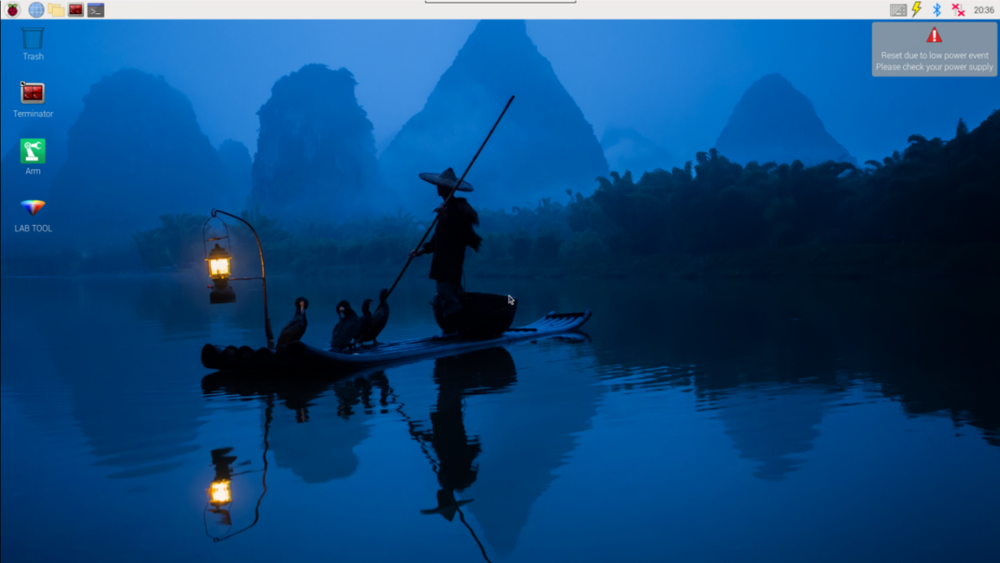

(2) Click the iconon the top left corner of the system desktop, and open Terminator terminal to input command. Then press enter key to close the self-start service of the app. 

```shell
sudo ./.stop_ros.sh
```

(3) Enter the command in the game directory. 

```shell
cd /home/ubuntu/course/vision_course/
```

(4) Enter command to perform the program. 

```shell
python3 get_color_rotation_angle.py
```

(5) You can press "Ctrl+C" to close this program.

(6) After experiencing the game, you can start app service through command or restarting the robot. If the app service is not started, the related function of app will be failure to perform. If the robot restarts, the app service will automatically start.

(7) Click icon  on the top left corner of the desktop and input "sudo systemctl restart start_node.service" in the system path. Then press enter to start the app service. Wait for the robotic arm to return to its initial pose, and you will hear a "Di" sound from the buzzer, signaling completion. Note: input command of starting app service in system path rather than in the docker container. 

```shell
sudo systemctl restart start_node.service
```

### 6.3 Program Outcome

After program starts, robotic arm will go back to initial pose. Place color block within the view of camera. When the color block is recognized, the current rotation angle of color block will print on terminal and RGB will emit the light in corresponding color. The transmitted camera image will box the color block and display its color and rotation angle.

### 6.4 Program Analysis

The source code of program is stored in the Docker container:  **[/home/ubuntu/course/vision_course/get_color_rotation_angle.py]()**

In example, drawContours() function in cv2 is used to draw the target contour in an image.

Take the following code as an example

```shell
cv2.drawContours(img, [box], -1, range_rgb[color_area_max], 2)
```

The first parameter"img" is the contour image. 

The second parameter "[box]" is the data of the obtained dot angle. 

The third parameter "-1" is to draw contour in specific contour list and the value refers to draw all contours in the list. 

The fourth parameter "range_rgb[color_area_max]" is the color of contour. 

The fifth parameter "2" is the thickness of line and value "-1" is to fill the contour with specified color.

## 7. Color Tracking

### 7.1 Program Description

The previous lessons achieve color recognition. This lesson will extend the function on the basis of color recognition by having robot find and track red block within robot’s view.

After the color of block is recognized successfully, using inverse kinematics to control robotic arm to move. Inverse kinematics knowledge is primarily utilized as follows:

- Using the coordinate of the object to calculate pitch angle. 

- Using the pitch angle to calculate servo angle. 

- Using the servo to calculate the pulse width.

### 7.2 Start and Close the Game

:::{Note}
 the entered command should be case sensitive and "Tab" key can be used to complement the keywords.
:::

(1) Power on the robot and use VNC Viewer to connect to the remote desktop.


(2) Click the icon  on the left top-corner of the system desktop, and open Terminator terminal to input command . Then press enter key to close the self-starter service of the app. 

```shell
sudo ./.stop_ros.sh
```

(3) Enter the command in the program directory.

```shell
cd /home/ubuntu/course/vision_course/
```

(4) Enter the command of performing the program

```shell
python3 track_by_color.py
```

(5) You can press "Ctrl+C" to close this program.

(6) After experiencing the game, you can start app service through command or restarting the robot. If the app service is not opened, the related function of app will be failure to perform. If the robot restarts, the app service will automatically start.

(7) Click iconon the top left corner of the desktop and input "sudo systemctl restart start_node.service" in the system path. Then press enter to start the app service. Wait for the robotic arm to return to its initial pose, and you will hear a "Di" sound from the buzzer, signaling completion. Note: input command of starting app service in system path rather than in the docker container.

```shell
sudo systemctl restart start_node.service
```

### 7.3 Program Outcome

Start the game, place red black within camera’s view. When block is

recognized, it will be circled on the transmitted camera image. At this time, when you slowly move the block, robotic arm will move with it.

### 7.4 Project Analysis

The source code of program is stored in the Docker container:  **[/home/ubuntu/course/vision_course/track_by_color.py]()**

Control robotic arm to move after recognizing red block. This part is

divided into three parts to achieve this function.

**7.4.1 Obtain new coordinate**

After red block is moved, the new coordinate (x,y,z) can be calculated. The variables of x_dis, y_di and z_dis are used to store value. When recognizing, place red block in front of camera and three dimensional coordinate is created as following picture.

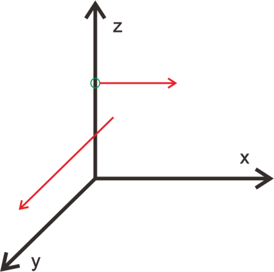

The camera actually detects a two-dimensional image of the block, as the 

picture shown below.


Then, according to the detected the two-dimensional image data, the

three-dimensional coordinate data is calculated with the used of corresponding equation,e.i, the value of "x_dis", "y_dis" and "z_dis". Please refer to the following detailed calculation steps.

**(1) Obtain x_dis**

When moving block along the x-axis direction, the corresponding two-dimensional image also moves along the x-axis, that is, the data of x-axis coordinate can be read from current two-dimensional image to calculate the coordinate of x axis of the block on three-dimensional image, which is the value of x_dis.

```python
x_pid.SetPoint = img_w / 2.0  #设定(setting)
x_pid.update(x)  #当前(current)
x_dis += int(x_pid.output)  #输出(output)

x_dis = 0 if x_dis > 1000 else x_dis
```

x_pid.SetPoint = img_w / 2.0: the x-axis data of two-dimensional image before moving. 

x_pid.update(x): the data of x-axis of two-dimensional image after moving. 

x_dis += int(x_pid.output): calculate the offset value of x axis of three-dimensional coordinates

x_dis = 1000 if x_dis > 1000 else x_dis: increase the offset value to obtain the value of x_dis.

(2) Obtain y_dis

When moving block along y-axis, the area of two dimensional image will change. That is, the coordinate of y-axis of three dimensional image can be calculated by reading the area of current two-dimensional image, which is the value of y_dis.

```python
if abs(area_max - 6000) < 500:
    area_max = 6000
y_pid.update(area_max)  #当前(current)
y_dis += y_pid.output  #输出(output)
y_dis = 0.05 if y_dis < 0.05 else y_dis
y_dis = 0.10 if y_pid > 0.10 else y_dis
```

y_pid.SetPoint = area_max: the area of two dimensional image is 6000 before moving

if abs(area_max – 6000) < 500:

area_max = 6000 :Set the area remains unchanged by default if the the detected area compared with the original is less than 500.

y_pid.update(area_max):The area of two-dimensional image after moving

y_dis += y_pid.output  

y_dis = 0.05 if y_dis < 0.05 else y_dis

y_dis = 0.10 if y_dis > 0.10 else y_dis : calculate the offset value of the y-axis of the three-dimensional coordinates.

Increase the offset value to obtain the value of y_dis. If the calculate result of y_dis is larger than 0.10, the y_dis is set to 0.10 to obtain the value of y_dis.

(3)  Obtain z_dis

When moving block along z-axis, the area of two dimensional image will change, that is, the coordinate of z-axis of three dimensional image can be calculated by reading the area of current two-dimensional image, which is the value of z_dis.

```python
z_pid.update(y)
z_dis += z_pid.output

z_dis = 0.23 if z_dis > 0.23 else z_dis
z_dis = 0.15 if z_dis < 0.15 else z_dis
```

z_pid.SetPoint = img_h / 2.0:The data of y-axis of two-dimensional image before moving

if abs(y - img_h/2.0) < 20:

y = int(img_h/2.0)  :the difference between the current position and the center is less than 20 units, set the y-value to half of the image height, that is, vertically centering it. 

z_pid.update(y):the data of y-axis of two-dimensional image after moving.

z_dis= z_pid.output:calculate the offset value of z-axis of three-dimensional coordinate.

z_dis = 0.23 if z_dis > 0.23 else z_dis

z_dis = 0.15 if z_dis < 0.15 else z_dis:increase the offset value of robotic arm to obtain the value of z_dis.

(4) calculate the pulse width of the servo

Call the encapsulated inverse kinematics program.

```python
board = Board()
controller = KinematicsController(board)
```

Please refer to following three steps to obtain all servo pulse width:

(5) Set the target pose of the robotic arm.

```python
res = controller.set_pose_target([y_dis, 0, z_dis], 0, [-90, 90], 0)
```

(6) Set servo angle.

Given the solution provided above, the corresponding servo angle is calculated and the program is as follows:

```python
if res[1]:
    board.bus_servo_set_position(0.02, [[3, res[1][3]], [4, res[1][2]],[5, res[1][1]], [6, x_dis]])
```

**[\[3, res\[1\]\[3\]\], \[4, res\[1\]\[2\]\], \[5, res\[1\]\[1\]\], \[6, x_dis\]\]** is a list, which includes servo ID and corresponding target position.

**Res\[1\]\[1\]、res\[1\]\[2\]、res\[1\]\[3\]**  is the value of angle and position calculated by "set_pose_target" method, which is used to control servo No.3, 4, 5. x_dis, the x-axis displacement previously calculated by PID controller, is used to control servo No.6. 

The program relies on the principles of inverse kinematics, involving extensive matrix operations. Due to the complexity and computational intensity of the process, a detailed explanation of the program implementation is omitted here. For a better understanding of inverse kinematics, the robotic arm will be analyzed by geometry.


To simplify the model of robotic arm, the main body of the robotic arm is extracted by getting rid of the base pan-tilt and the actuators. From the above figure, the coordinates (x, y) of the point P of the robotic arm can also be regarded as (x1+x2+x3, y1+y2+y3).

θ1, θ2, and θ3 in the figure are the angles of the servos that need to be solved, and α is the angle between the gripper and the horizontal plane. It can be seen from the above figure that the pitch angle of the gripper α=θ1+θ2+θ3, so the following equation can be listed:

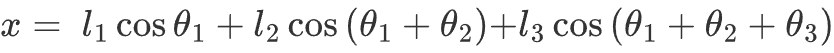

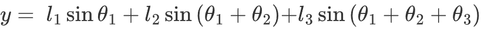

Among them, x and y are given by user and l1, l2 and l3 are the inherent attribute of the robotic arm. 

To facilitate calculation, the known part are treated for overall consideration:

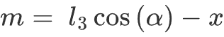

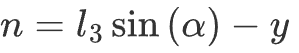

Substitute m and n into the existing equation, and then simplify to get:

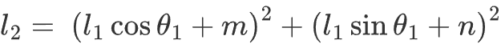

then get the solution:

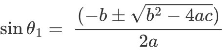

The above formula is for finding the root of a quadratic equation in one

variable,

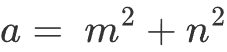

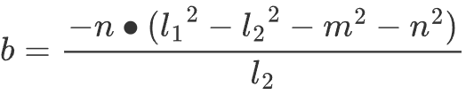

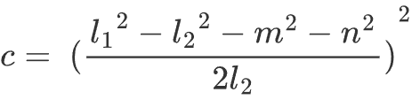

Based on this, we can calculate the angle θ1. θ2 and θ3 can be obtained in the same way. Consequently, we can ascertain the angles for all three servos. 

## 8. Gripper Position Adaptive Adjustment

### 8.1 Program Description

In this lesson, intelligent stacking will be taken as am example to explain gripper self-adaptive adjustment. Other program involving adaptive adjustment of the gripper can be referred to in this section. 

The gripper position adjustment for this game consists of two respects: picking and placement.

Firstly, using inverse kinematics and angle conversion to obtain the corresponding angle of the coordinate of the target and the corresponding pulse width of the servo. Then, control servo to rotate, move, pick up and lift the block. Lastly, stack the block in stacking area by the process of rotation, lift and placement.

<p id="anchor_8_2"></p>

### 8.2 Start and Close the Game

:::{Note}
the entered command should be case sensitive and "Tab" key can be used to complement the keywords.
:::

**8.2.1 Access to game**

(1) Power on the robot and use VNC Viewer to connect to the remote desktop.


(2) Click the iconon the top left corner of the system desktop, and open Terminator terminal to input command . Then press enter key to close the self-start service of the app.


```shell
sudo ./.stop_ros.sh
```

(3) In Terminator terminal, input command "roslaunch armpi_fpv_bringup bringup.launch". Then press enter key to perform movement control, camera and other underlying services.

```shell
roslaunch armpi_fpv_bringup bringup.launch
```

(4) Open the new terminal according to "2". Enter command to stack blocks. After entering successfully, the prompt information is printed as pictured:

```shell
rosservice call /object_pallezting/enter "{}"
```


**8.2.2 Start Live Camera Feed**

(1) After entering game, rqt tool is required to enable live camera feed. Open the new terminal according to "step2".

(2) Input command "rqt_image_view" and press enter. Wait for a moment to open rqt tool.

```python
rqt_image_view
```

(3) Select the topic of intelligent stacking "//object_pallezting/image_result" and others remain the same. 

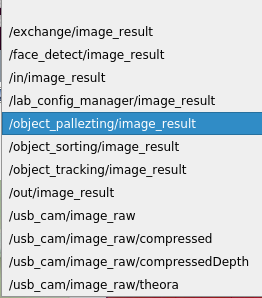

:::{Note}
after camera image is enabled, you must select the topic corresponding to the game or the recognition process can not be displayed normally after game starts.
:::

**8.2.3 Start game**

Get back to the terminal opened in "8.2.1 Access to game" and enter command. The prompt in box as below picture denotes game is started.

```shell
rosservice call /object_pallezting/set_running "data: true"
```

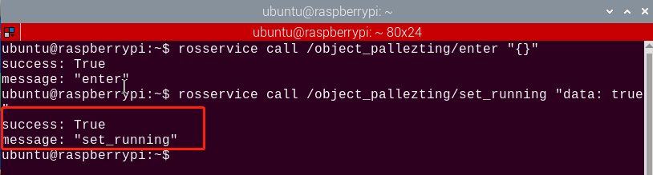

**8.2.4 Stop and exit game**

(1) If desire to stop the game, please enter command .。

```shell
rosservice call /object_pallezting/set_running "data: false"
```

(2) If desire to exit the game, enter command .

```shell
rosservice call /object_pallezting/exit "{}"
```

:::{Note}
before game is exited, it will continue to run in the current Raspberry Pi power-on state. To prevent occupying the RAM of Raspberry Pi, please refer to the above steps to close the current program before performing other AI vision program.
:::

(3) For closing live camera feed, you can return to open rqt tool terminal and press "Ctrl+C".

(4) After experiencing the game, you can start app service through command or restarting the robot. If the app service is not opened, the related function of app will be failure to perform. If the robot restarts, the app service will automatically start.

(5) Click icon  on the top left corner of the desktop and input command in the system path.

```shell
sudo systemctl restart start_node.service
```

(6) Then press enter to start the app service. Wait for the robotic arm to return to its initial pose, and you will hear a "Di" sound from the buzzer, signaling completion. Note: input command of starting app service in system path rather than in the docker container. 

### 8.3 Program Outcome

After game starts, robotic arm will pick the tag block and colored block in turn and stack them in stacking area.

### 8.4 Program Analysis

The source code of program is stored in: **[/home/ubuntu/armpi_fpv/src/object_pallezting/scripts/pallezting.py]()**

 **8.4.1 Import function library**

  |                      **Import Module**                       |                         **Function**                         |
  | :----------------------------------------------------------: | :----------------------------------------------------------: |
  |                          import cv2                          | The OpenCV library is imported for image processing and AIvision-related functions. |
  |                         import copy                          |               Used for copying Python objects.               |
  |                         import math                          | The math module provides access to underlying mathematical operations, including many commonly used mathematical functions and constants. |
  |                         import queue                         | Provide queue data structure, supporting multi-threaded programming. |
  |                         import rospy                         | Import the library for the Python interface of ROS for communicationwith ROS. |
  |                        import signal                         |                Allow to handle Unix signals.                 |
  |                      import  threading                       |    Provide an environment for executing multiple threads.    |
  |                          import np                           | Import the NumPy library: an open-source numerical computing extension library for Python, used for array and matrix operations. |
  |                 from threading import Timer                  | Import the Timer class from thethreading module, used to call a method after a specified amount of time. |
  |              from sensor_msgs.msg import Image               | Import the Image message type from the sensor_msgs package.  |
  |  from std_srvs.srv import Trigger, SetBool,SetBoolResponse   | Import the Trigger and SetBool service types from the ROS standard services, as well as the response type for SetBool. |
  |               from warehouse.msg import Grasp                |           Import data related to grasping actions.           |
  |     from hiwonder_servo_msgs.msg import MultiRawIdPosDur     | Import the MultiRawIdPosDur message type to control multiple servos. |
  |  from ros_robot_controller.msg import RGBState, BuzzerState  | Import the message types of RGB light, and buzzer, controlling the status of RGB lights and buzzer. |
  |    from armpi_fpv_common import pid,misc,common,apriltag     | Import the PID controller, the misc Handling module, common function module, and the module for handling AprilTag. |
  |     from hiwonder_servo_control import bus_servo_control     |              Import the servo control library.               |
  | from armpi_fpv_kinematics_controllers import set_pose_target, go_pose_target |      Import the libraries related to robot kinematics.       |

To call the function in function library, you can use code "the library name + function name (param, param)". For example, "sleep" function called in "rospy" library.

```py
rospy.sleep(0.1)
```

"Sleep()" is used for latency. There are some built-in libraries in Python, which can be directly imported to call. For example, "cv2", "math", etc.

 **8.4.2 Main function analysis**

**(1) Initialization node**

```py
if __name__ == '__main__':
    # 初始化节点(initialization)
    rospy.init_node('object_pallezting', log_level=rospy.INFO)
```

Initialize the node "object_pallezting".

**(2) Publish node topic**

```py
    # 舵机发布(servo publish)
    joints_pub = rospy.Publisher('/servo_controllers/port_id_1/multi_id_pos_dur', MultiRawIdPosDur, queue_size=1)

    # 图像发布(image publish)
    image_pub = rospy.Publisher('/object_pallezting/image_result', Image, queue_size=1)  # register result image publisher
```

joints_pub:create and publish "/servo_controllers/port_id_1/multi_id_pos_dur" topic. The topic type is "MulitiRawIdPosDur", with a queue length of 1. Start relevant nodes for the robotic arm.

**image_pub:** create and publish "/object_pallezting/image_result" topic. The topic typr is "Image", with a queue length of 1.

**buzzer_pub:** create and publish "/ros_robot_controller/set_buzzer" topic. The topic type is "BuzzerState", with a queue length of 1.

**rgb_pub:** create and publish "/ros_robot_controller/set_rgb" topic. The topic type is "RGBsState", with a queue length of 1.

**(3) Start Service**

```py
    # app通信服务(app communication service)
    enter_srv = rospy.Service('/object_pallezting/enter', Trigger, enter_func)
    exit_srv = rospy.Service('/object_pallezting/exit', Trigger, exit_func)
    running_srv = rospy.Service('/object_pallezting/set_running', SetBool, set_running)
    heartbeat_srv = rospy.Service('/object_pallezting/heartbeat', SetBool, heartbeat_srv_cb)
```

**enter_srv:** subscribe "/object_pallezting/enter" topic. The topic type is Trigger. Call back "enter_func" function.

**exit_srv:** subscribe "/object_pallezting/exit" topic. The topic type is Trigger. Call back "exit_func" function.

**runing_srv:** subscribe "/object_pallezting/set_running" topic. The topic type is SetBool. Call back "set_running" function.

**hearbeat_srv:** subscribe "/object_pallezting/heartbeat" topic. The topic type is SetBool. Call back "heartbeat_srv_cb" function.

**(4)  Test (Optional)**

```py
    debug = 0
    if debug:
        rospy.sleep(0.2)
        enter_func(1)
        start_running()
```

This part will enter debug mode to start color sorting directly. The specified content is as follows:
After modifying the value of "debug" to "Ture", start program to directly enter debug mode.
Start the program when the built-in parameter of "enter_func" function is set to 1.
Start function "start_running" to stack the color blocks.

### 8.5 Position Self-Adaptive Adjustment Analysis

Take the picking action as example. The principle of placement is as the same.

(1) Import function library

Import a series of Python function library for self-adaptive adjustment before controlling robotic arm’s movement.

```py
import cv2
import copy
import math
import queue
import rospy
import signal
import threading
import numpy as np
from threading import Timer

from sensor_msgs.msg import Image
from std_srvs.srv import Trigger, SetBool, SetBoolResponse

from warehouse.msg import Grasp
from hiwonder_servo_msgs.msg import MultiRawIdPosDur
from ros_robot_controller.msg import RGBState, RGBsState, BuzzerState 

from armpi_fpv_common import pid, misc, common, apriltag
from hiwonder_servo_controllers import bus_servo_control
from armpi_fpv_kinematics.kinematics_control import set_pose_target, go_pose_target
```

**(2) Calculate whether it is possible to reach the target position**

Check whether it is possible to reach the four target positions. Each target position is set through the "set_pose_target" function. If it is impossible to reach these positions, the code will return "False".

```py
    # 计算是否能够到达目标位置，如果不能够到达，返回False
    target1 = set_pose_target((position.y + approach.y, position.x + approach.x, position.z + approach.z), rotation.r, [-90, 90], 0)
    target2 = set_pose_target((position.y, position.x, position.z), rotation.r, [-90, 90], 0)
    target3 = set_pose_target((position.y, position.x, position.z + grasps.up), rotation.r, [-90, 90], 0)
    target4 = set_pose_target((position.y + retreat.y, position.x + retreat.x, position.z + retreat.z), rotation.r, [-90, 90], 0)
    
    if not running:
        return False 
    if target1[1] and target2[1] and target3[1] and target4[1]:
```

Put simply, the program will continue running only if all four target positions can reach the desired location.

```py
servo_data = target1[1]
bus_servo_control.set_servos(joints_pub, 1.8, ((3, servo_data[3]), (4, servo_data[2]), (5, servo_data[1]))) 
rospy.sleep(2)
if not running:
    return False
```

Call "set_servos" function to set multiple desired position and posture of servos. The first parameter "joints_pub" is the publisher used to publish servo control command. The second parameter 1 means the time (1 second) required for action execution. The last parameter consist of a collection of tuples, each containing servo ID and their respective target positions. 

**(3) Aligning with target**

Due to the random placement of the target block, when approaching the target, the gripper and the block may not necessarily be in a parallel state. "If gripping the block while not in a parallel state, the gripper may fail to grip or grip inadequately, thus affecting the stacking effect later on.
Therefore, it is necessary to rotate servo 2 to align the gripper with the block ensuring parallelism, such as "((2, 500 + int(F*gripper_rotation)), ))".

```py
# 第五步: 对齐(step five:aligning)
bus_servo_control.set_servos(joints_pub, 0.5, ((2, 500 + int(F*gripper_rotation)), ))
rospy.sleep(0.8)
if not running:
    target4 = set_pose_target((position.y + retreat.y, position.x + retreat.x, position.z + retreat.z), rotation.r, [-90, 90], 0)
    servo_data = target4[1]
    bus_servo_control.set_servos(joints_pub, 1, ((1, 200), (3, servo_data[3]), (4, servo_data[2]), (5, servo_data[1])))       
    rospy.sleep(1)             
    return False
```

**(4) Pick up block**

Once the robotic arm is parallel with the block, you can adjust servo No.1 to retract the gripper. After the robotic arm is align with the block, you can adjust servo No.1 to pick the block. If the robotic arm can not pick the block at this moment, it means there is a small gap between them, please use the provided PC software to check and adjust the deviation of servo appropriately.

```py
# 第六步:夹取(step six:grasp)
bus_servo_control.set_servos(joints_pub, 0.5, ((1, grasps.grasp_posture), ))               
rospy.sleep(0.8)
if not running:
    bus_servo_control.set_servos(joints_pub, 0.5, ((1, grasps.pre_grasp_posture), ))               
    target4 = set_pose_target((position.y + retreat.y, position.x + retreat.x, position.z + retreat.z), rotation.r, [-90, 90], 0)
    rospy.sleep(0.5)            
    servo_data = target4[1]
    bus_servo_control.set_servos(joints_pub, 1, ((1, 200), (3, servo_data[3]), (4, servo_data[2]), (5, servo_data[1])))       
    rospy.sleep(1)             
    return False
```

**(5) Robotic arm ascend**

After picking up the block, control robotic arm to lift up. Otherwise the friction will get larger while moving due to the tightly contact between block and ground. If robotic arm right rotates in this pose during placing, it may lead to block servo.

```py
# 第七步:抬升物体(step seven: lift the objects)
if grasps.up != 0:
    target3 = set_pose_target((position.y, position.x, position.z + grasps.up), rotation.r, [-90, 90], 0)
    servo_data = target3[1]
    bus_servo_control.set_servos(joints_pub, 0.5, ((3, servo_data[3]), (4, servo_data[2]), (5, servo_data[1])))
    rospy.sleep(0.6)
    if not running:
        bus_servo_control.set_servos(joints_pub, 0.5, ((1, grasps.pre_grasp_posture), ))               
        target4 = set_pose_target((position.y + retreat.y, position.x + retreat.x, position.z + retreat.z), rotation.r, [-90, 90], 0)
        rospy.sleep(0.5)            
        servo_data = target4[1]
        bus_servo_control.set_servos(joints_pub, 1, ((1, 200), (3, servo_data[3]), (4, servo_data[2]), (5, servo_data[1])))       
        rospy.sleep(1)             
        return False
```

**(6) Robotic arm restore to initial position**

Get robotic arm back to initial position and ready for rotation and placement.

```py
# 第八步:移到撤离点(step eight:move to the extracction point)
target4 = set_pose_target((position.y + retreat.y, position.x + retreat.x, position.z + retreat.z), rotation.r, [-90, 90], 0)
servo_data = target4[1]
if servo_data != target3[1]:    
    bus_servo_control.set_servos(joints_pub, 1, ((3, servo_data[3]), (4, servo_data[2]), (5, servo_data[1])))        
    rospy.sleep(1)
    if not running:
        bus_servo_control.set_servos(joints_pub, 0.5, ((1, grasps.pre_grasp_posture), ))               
        rospy.sleep(0.5)                
        return False

    # 第九步:移到稳定点(step nine:move to stable point)
    bus_servo_control.set_servos(joints_pub, 1.5, ((2, 500), (3, 80), (4, 825), (5, 625)))
    rospy.sleep(1.5)
    if not running:
        bus_servo_control.set_servos(joints_pub, 0.5, ((1, grasps.pre_grasp_posture), ))               
        rospy.sleep(0.5)            
        return False

    return target2[3][1]
else:
    rospy.loginfo('pick failed')
    return False
```

## 9. Color Sorting

### 9.1 Program Description

The process of color sorting are mainly divided into three parts including recognition, picking and placement.

Firstly, it is the tag and color recognition. 
Label recognition is achieved through localization, image segmentation, and contour detection. Encoding and decoding processing are performed based on the detected labels.
The color recognition is recognized through Lab color space. Convert the RGB color space to Lab, image binarization, and then perform operations such as expansion and corrosion to obtain an outline containing only the target color. Use circles to frame the color outline to realize object color recognition.
After recognition, comparing the areas of regions where objects of corresponding colors are located by obtaining their respective areas. Then, the average of multiple judgments is taken to compare their sizes, thereby determining the gripping order between the color blocks based on their areas. (prioritizing the gripping of larger objects).
Finally, the robotic arm will place items according to different color. After that, the robotic arm will return to the initial position. 

<p id="anchor_9_2"></p>

### 9.2 Start and Close the Game

:::{Note}
the entered command should be case sensitive and "Tab" key can be used to complement the keywords.
:::

**9.2.1 Preparation**

(1) Please place the map on flat desk and the robotic arm should be placed on the corresponding area on the map.
 (2) Prepare 3 blocks in red, green and yellow and 3 blocks labeled with tag1, tag2 and tag3. And place them randomly on the recognition area of the map. Note: the interval between each blocks is not less than 3cm.
(3) Turn on the robotic arm and wait to finish.

<p id="anchor_9_2_2"></p>

**9.2.2 Access to game**

(1) Power on the robot and use VNC Viewer to connect to the remote desktop.

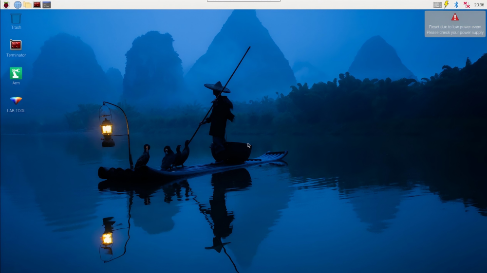

(2) Click the iconon the top left corner of the system desktop, and open Terminator terminal to input command . Then press enter key to close the self-start service of the app.

```python
sudo ./.stop_ros.sh
```

(3) In Terminator terminal, input command. Then press enter key to perform movement control, camera and other underlying services.

```py
roslaunch armpi_fpv_bringup bringup.launch
```

(4) Open the new terminal according to "Step2". Enter command  to stack blocks. 

```shell
rosservice call /object_sorting/enter "{}"
```

**9.2.3 Start Live Camera Feed**

(1) After entering game, rqt tool is required to enable live camera feed. Open the new terminal according to "step2".

(2) Input command and press enter. Wait for a moment to open rqt tool.

```py
rqt_image_view
```

(3) Select the topic of intelligent stacking "//object_pallezting/image_result" and others remain the same.

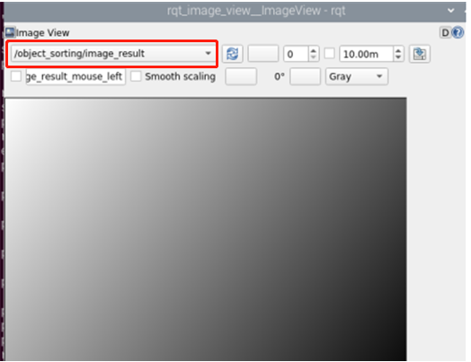

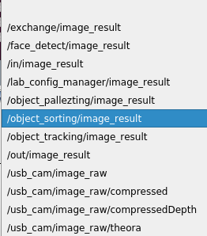

:::{Note}
after camera image is enabled, you must select the topic corresponding to the game or the recognition process can not be displayed normally after game starts.
:::

<p id="anchor_9_2_4"></p>

**9.2.4 Start game**

(1) Get back to the terminal opened in "[9.2.2 Access to game](#anchor_9_2_2)" and enter command. The prompt in box as below picture denotes game is started.

```shell
rosservice call /object_sorting/set_running "data: true"
```

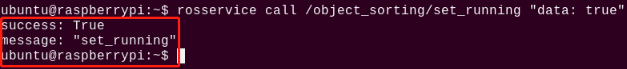

(2) After starting the game, we need to set parameter to select targeted color. Take targeted red as example. Enter command

```shell
rosservice call /object_sorting/set_target "color:
- 'red'
tag:
- 'tag1'
```

:::{Note}

To track green and blue, you can fill in "> ' ' with 'green' or 'blue'. (Case sensitive)

:::

**9.2.5 Stop and exit game**

(1) If desire to stop the game, please enter command and press Enter. Referring to "[9.2.4 Start game](#anchor_9_2_4)", you can change the targeted color or label after a pause

```shell
rosservice call /object_pallezting/set_running "data: false"
```

(2) Enter command to quit the game.

```shell
rosservice call /object_sorting/exit "{}"
```

:::{Note}
before game is exited, it will continue to run in the current Raspberry Pi power-on state. To prevent occupying the RAM of Raspberry Pi, please refer to the above steps to close the current program before another AI vision programs are executed.
:::

(3) For disabling camera image function, please return to the terminal of rqt tool and press "Ctrl+C".

(4) After experiencing the game, you can start app service through command or restarting the robot. If the app service is not opened, the related function of app will be failure to perform. If the robot restarts, the app service will automatically start.

(5) Click icon  on the top left corner of the desktop and input "sudo systemctl restart start_node.service" in the system path. Then press enter to start the app service. Wait for the robotic arm to return to its initial pose, and you will hear a "Di" sound from the buzzer, signaling completion. Note: input command of starting app service in system path rather than in the docker container.

```shell
sudo systemctl restart start_node.service
```

### 9.3 Function Extension

**9.3.1 Add new recognizable color**

There are three built-in colors red, green and blue in the object tracking program. Besides these three built-in colors, we can also add other recognizable colors. For example, if we want to add orange as a new recognizable color, the program steps are as follows:

(1) Open the new terminal according to "2". Enter command to open color threshold debugging tool.

```shell
python3 /home/ubuntu/software/lab_config/main.py
```


(2) If the feedback screen does not appear in the pop-up interface, it indicates that the camera is not successfully connected. Please check the camera connection to ensure it is properly connected.


(3) The real-time feedback screen is on the right side of the interface, while the colors to be captured are on the left side. Align the camera with the orange object, then drag the six sliders below to ensure that the region of the orange object in the left screen turns completely white, while the other regions turn black. Then click "save" to preserve data.

:::{Note}

It is recommended to capture a screenshot or back up the initial values of the sliders before dragging them, so that you can easily revert back to the red color settings later on. Alternatively, you can place a red object and adjust the sliders to reset red as a recognizable color.

:::


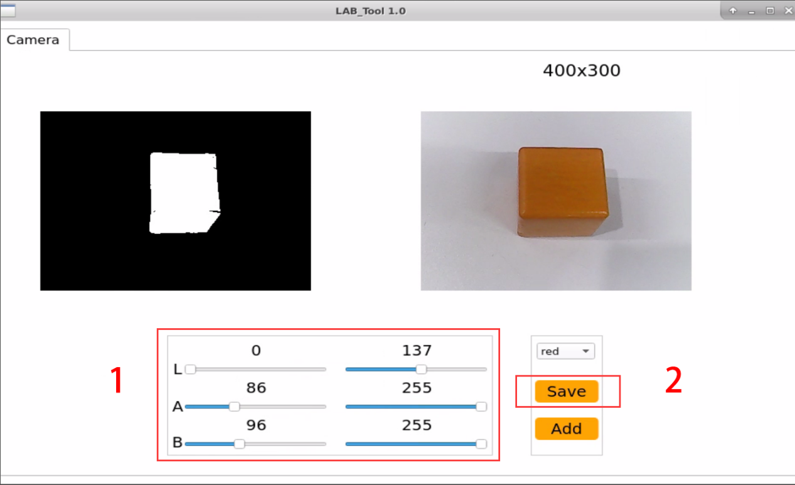

(4) Follow the first three steps from section "9.2 Starting and Stopping the Game" ("2.1 Access to Game" to "9.2.3 Start Game") to initiate the color tracking program.

(5) Place the orange object in front of the camera and slowly move it by hand. The body of the ArmPi FPV will follow the movement of the orange object. 

If you need to add other colors as recognizable colors, you can refer to the previous steps.

### 9.5 Program Analysis

The source code of program is stored in : [/home/ubuntu/armpi_fpv/src/object_sorting/scripts/sorting.py]()

- #### 9.5.1 Import function library

  |                      **Import Module**                       |                         **Function**                         |
  | :----------------------------------------------------------: | :----------------------------------------------------------: |
  |                          import cv2                          | The OpenCV library is imported for image processing and AIvision-related functions. |
  |                         import copy                          |               Used for copying Python objects.               |
  |                         import math                          | The math module provides access to underlying mathematical operations, including many commonly used mathematical functions and constants. |
  |                         import queue                         | Provide queue data structure, supporting multi-threaded programming. |
  |                         import rospy                         | Import the library for the Python interface of ROS for communicationwith ROS. |
  |                        import signal                         |                Allow to handle Unix signals.                 |
  |                      import  threading                       |    Provide an environment for executing multiple threads.    |
  |                          import np                           | Import the NumPy library: an open-source numerical computing extension library for Python, used for array and matrix operations. |
  |                 from threading import Timer                  | Import the Timer class from thethreading module, used to call a method after a specified amount of time. |
  |              from sensor_msgs.msg import Image               | Import the Image message type from the sensor_msgs package.  |
  |  from std_srvs.srv import Trigger, SetBool,SetBoolResponse   | Import the Trigger and SetBool service types from the ROS standard services, as well as the response type for SetBool. |
  |               from warehouse.msg import Grasp                |           Import data related to grasping actions.           |
  |     from hiwonder_servo_msgs.msg import MultiRawIdPosDur     | Import the MultiRawIdPosDur message type to control multiple servos. |
  |  from ros_robot_controller.msg import RGBState, BuzzerState  | Import the message types of RGB light, and buzzer, controlling the status of RGB lights and buzzer. |
  |    from armpi_fpv_common import pid,misc,common,apriltag     | Import the PID controller, the misc Handling module, common function module, and the module for handling AprilTag. |
  |     from hiwonder_servo_control import bus_servo_control     |              Import the servo control library.               |
  | from armpi_fpv_kinematics_controllers import set_pose_target, go_pose_target |      Import the libraries related to robot kinematics.       |

To call the function in function library, you can use code "the library name + function name (param, param)". For example, "sleep" function called in "rospy" library.

```py
rospy.sleep(0.1)
```

"Sleep()" is used for latency. There are some built-in libraries in Python, which can be directly imported to call. For example, "cv2", "math", etc.

- #### 9.5.2 Main function analysis

 **(1) Initialization node**


```py
if __name__ == '__main__':
    # 初始化节点(initialization node)
    rospy.init_node('object_sorting', log_level=rospy.INFO)
```

Initialize the node "object_sorting".

**(2) Publish node topic**

```py
# 舵机发布(servo publish)
joints_pub = rospy.Publisher('/servo_controllers/port_id_1/multi_id_pos_dur', MultiRawIdPosDur, queue_size=1)

# 图像发布(image publish)
image_pub = rospy.Publisher('/object_sorting/image_result', Image, queue_size=1)  # register result image publisher
```

```py
# 蜂鸣器(buzzer)
buzzer_pub = rospy.Publisher('/ros_robot_controller/set_buzzer', BuzzerState, queue_size=1)
# rgb 灯(rgb light)
rgb_pub = rospy.Publisher('/ros_robot_controller/set_rgb', RGBsState, queue_size=1)
```

**joints_pub**:create and publish "/servo_controllers/port_id_1/multi_id_pos_dur" topic. The topic type is "MulitiRawIdPosDur", with a queue length of 1. Start relevant nodes for the robotic arm.

**image_pub**:create and publish "/object_sorting/image_result" topic. The topic type is "Image", with a queue length of 1.

**buzzer_pub**:create and publish "/ros_robot_controller/set_buzzer" topic. The topic type is "BuzzerState", with a queue length of 1.

**rgb_pub**:create and publish "/ros_robot_controller/set_rgb" topic. The topic type is "RGBsState", with a queue length of 1.

**(3) Start Service**

```py
# app通信服务(app communication publish)
enter_srv = rospy.Service('/object_sorting/enter', Trigger, enter_func)
exit_srv = rospy.Service('/object_sorting/exit', Trigger, exit_func)
running_srv = rospy.Service('/object_sorting/set_running', SetBool, set_running)
set_target_srv = rospy.Service('/object_sorting/set_target', SetTarget, set_target)
heartbeat_srv = rospy.Service('/object_sorting/heartbeat', SetBool, heartbeat_srv_cb)
```

**enter_srv**:subscribe "/object_sorting/enter" topic. The topic type is Trigger. Call back "enter_func" function.
**exit_srv**:subscribe "/object_sorting/exit" topic. The topic type is Trigger. Call back "exit_func" function.
**runing_srv**:subscribe "/object_sorting/set_running" topic. The topic type is SetBool. Call back "set_running" function.
**set_target_srv**:subscribe "/object_sorting/set_target" topic. The topic type is SetTarget. Call back "set_target" function.
**hearbeat_srv**:subscribe "/object_sorting/heartbeat" topic. The topic type is SetBool. Call back "heartbeat_srv_cb" function.

**(4) Test (Optional)**

```py
debug = 0
if debug:
    rospy.sleep(0.2)
    enter_func(1)

    msg = SetTarget()
    msg.color = ['red', 'green', 'blue']
    msg.tag = ['tag1', 'tag2', 'tag3']
    set_target(msg)

    start_running()
```

```py
debug = False
if debug:
    rospy.sleep(0.2)
    enter_func(1)

    msg = SetTarget()
    msg.data = 'blue'

    set_target(msg)
    start_running()
```

This part will enter debug mode to start tracking directly. The specified content is as follows:

After modifying the value of "debug" to "Ture", start program to directly enter debug mode.
Start the program when the built-in parameter of "enter_func" function is set to 1.

Using variable "msg" to initialize SetTarget type, and set "color" attribute of "msg" to a list containing three colors: ‘red’, ‘green’, ‘blue’.

Using variable "mag" to initialize SetTarget type, and set "tag" attribute of "msg" to a list containing three tags:’tag1’, ‘tag2’, ‘tag3’.

You can modify other colors and labels according to your own needs.

The built-in parameter of the "set_target" function is set to "msg". Set the targeted color and tag.

Start "start_running" function to perform color block sorting.

<p id="anchor_9_5_3"></p>

**9.5.3 Subfunction analysis**

**(1)  Initialization position**

```py
# 初始位置(initialization position)
def initMove(delay=True):
    with lock:
        bus_servo_control.set_servos(joints_pub, 1.5, ((1, 200), (2, 500), (3, 80), (4, 825), (5, 625), (6, 500)))
    if delay:
        rospy.sleep(2) 
```

Take ((1, 200) of the code "bus_servo_control.set_servos(joints_pub, 1.5, ((1, 200), (2, 500), (3, 80), (4, 825), (5, 625), (6, 500)))" as example,

The meaning of parameters in parentheses is as follow:

The first parameter "joints_pub" is published topic.

The second parameter "1.5" is the rotation time of servo in second.

The third parameter "((1, 200)". [1,200]: the first parameter "1" is the ID number of servo. The second parameter "200" is the rotation position of servo. 

**(2) Define color block location and tracking function**

Recognize color at first and circle the targeted color. Then, compare the position of the color block in the frame with the center point of the feedback screen, and adjust the position of the servo camera using a PID algorithm so that the object remains at the center of the feedback screen. This presents the effect of the servo moving along with the target object."

**(3) Scaling processing**

Use the "resize()" function in the cv2 library to process image scaling, which reduces calculated quantity, 

```py
frame_resize = cv2.resize(img, size, interpolation=cv2.INTER_NEAREST)
```

The first parameter in the function parenthesis "image" means input image. The second parameter "size" represents the width and length of the image after scaling.

**(4) Convert LAB space**

Use the "cvtColor()" function in the cv2 library to convert the image to the LAB space.

```py
frame_lab = cv2.cvtColor(frame_resize, cv2.COLOR_BGR2LAB)  # 将图像转换到LAB空间(convert the image to the LAB space)
```

**(5) Binarization processing**

Use the "inRange()" function in the cv2 library to proceed binarization.

```py
frame_mask1 = cv2.inRange(frame_lab, tuple(target_color_range['min']), tuple(target_color_range['max'])) #对原图像和掩模进行位运算
```

① The first parameter "frame_lab" represents input image.
② The second parameter "tuple(self.target_color_range['min'])" is the minimum value of the color threshold.
③ The third parameter "tuple(self.target_color_range['max'])" is the maximum value of the color threshold. 

**(6) Corrosion and dilation processing**

Perform corrosion and dilation on the image to smooth  the contour edges within the image, facilitating the subsequent search for target contours.

```py
frame_mask2 = cv2.bitwise_and(roi, frame_mask1)
eroded = cv2.erode(frame_mask2, cv2.getStructuringElement(cv2.MORPH_RECT, (3, 3)))  #腐蚀(Corrosion)
dilated = cv2.dilate(eroded, cv2.getStructuringElement(cv2.MORPH_RECT, (3, 3))) #膨胀(dilation)
```

frame_mask2 combines the region (ROI) with the mask. frame_mask1 is a mask, and frame_mask2 is their intersection."

The "erode()" function is used to perform corrosion. Take the node "eroded = cv2.erode(frame_mask2, cv2.getStructuringElement(cv2.MORPH_RECT, (3, 3)))" as an example. The definition of parameters in the parenthesis are as follows:

The first parameter "frame_mask" means input image.

The second parameter "cv2.getStructuringElement(cv2.MORPH_RECT, (3, 3))" determines the structural element or kernel of the operational nature. Within the parentheses, the first parameter is the kernel shape, and the second parameter is the kernel size.

The "dilate()" function is used to perform image dilation. The parameters within the parentheses of this function have the same meanings as those in the "erode()" function.

**(7) Obtain maximal contour area**

Call the "findContours()" function in the cv2 library to find the largest contour of the recognized color in the image.

```py
contours = cv2.findContours(dilated, cv2.RETR_EXTERNAL, cv2.CHAIN_APPROX_NONE)[-2]  # 找出轮廓(find out contour)
areaMaxContour, area_max = common.get_area_max_contour(contours)  # 找出最大轮廓(find out the largest contour)
```

① The first parameter "dilated" represents input image.

② The second parameter "cv2.RETR_EXTERNAL" means contour retrieval mode.

③ The third parameter "cv2.CHAIN_APPROX_NONE" means contour approximation method.

**(8) Circle the tracking target mapped to the original image size**

```py
if max_area > 100:  # 有找到最大面积(the largest area is found)
    rect = cv2.minAreaRect(areaMaxContour_max)
    box_rotation_angle = rect[2]
    if box_rotation_angle > 45:
        box_rotation_angle =  box_rotation_angle - 90        

        box = np.int0(cv2.boxPoints(rect))   
        for j in range(4): # 映射到原图大小(mapping to original image size)
            box[j, 0] = int(misc.map(box[j, 0], 0, size[0], 0, img_w))
            box[j, 1] = int(misc.map(box[j, 1], 0, size[1], 0, img_h))

            cv2.drawContours(img, [box], -1, common.range_rgb[color_area_max], 2)
```

**(9) PID数据更新**

Update the coordinate of x-axis, y-axis and z-axis through PID algorithm.

```py
last_x = centerX
last_y = centerY
if (not approach or adjust) and start_move: # pid调节(pid adjustment)          
    detect_color = (color_area_max, )            
    x_pid.SetPoint = center_x #设定(setting)           
    x_pid.update(centerX) #当前(current)
    dx = x_pid.output
    x_dis += dx #输出(output)
    # print(x_dis, dx, center_x centerX)
    x_dis = 0 if x_dis < 0 else x_dis          
    x_dis = 1000 if x_dis > 1000 else x_dis
             
    if adjust:
        y_pid.SetPoint = color_y_adjust
        start_move = True
        # print(1111, gripper_rotation, roll_angle)
        centerY += abs(misc.map(70*math.sin(math.pi/4)/2, 0, size[0], 0, img_w)*math.sin(math.radians(abs(gripper_rotation) + 45))) + 65*math.sin(math.radians(abs(roll_angle)))
        if Y < 0.12 + 0.04:
            centerY += d_color_y 
        if 0 < centerY - color_y_adjust <= 5:
            centerY = color_y_adjust
        y_pid.update(centerY)

        dy = y_pid.output
        y_dis += dy
        y_dis = 0.1 if y_dis > 0.1 else y_dis
        y_dis = -0.1 if y_dis < -0.1 else y_dis
    else:
        dy = 0
```

Update the data information of PID. Finally update the coordinate of x-axis and y-axis using output result.

**(10) Set servo rotation**

Call the "set_servos" function in the "bus_servo_control" library to drive robotic arm.

```py
bus_servo_control.set_servos(joints_pub, 0.1, ((3, servo_data[3]), (4, servo_data[2]), (5, servo_data[1]), (6, int(x_dis))))
rospy.sleep(0.1)
last_x_dis = x_dis
last_y_dis = y_dis
else:
    bus_servo_control.set_servos(joints_pub, 0.02, ((6, int(x_dis)), ))
else:                    
    bus_servo_control.set_servos(joints_pub, 0.02, ((6, int(x_dis)), ))
```

Analysis of the function "bus_servo_control.set_servos" can be found in "[9.5.3 Subfunction analysis/ (1) Initialization Position](#anchor_9_5_3)".

## 10. Intelligent Stacking

### 10.1 Program Description 

The process of color stacking are mainly divided into three parts including recognition, picking and placement.

First, the robotic arm will recognize the color. Color recognition is realized by Lab color space. Convert the RGB color space to Lab, image binarization, and then perform operations such as expansion and corrosion to obtain an outline containing only the target color. Use circles to frame the color outline to realize object color recognition.

The next step is to determine whether the block continues to move or not. If it detect that the blocks stop moving for a while, it will begin picking the block.

Comparing the areas of regions where objects of corresponding colors are located by obtaining their respective areas. Then, the average of multiple judgments is taken to compare their sizes, thereby determining the gripping order between the color blocks based on their areas. (prioritizing the gripping of larger objects).

After stacking all blocks, the robotic arm will return to the initial position. 

<p id="anchor_10_2"></p>

### 10.2 Start and Close the Game

:::{Note}
the entered command should be case sensitive and "Tab" key can be used to complement the keywords.
:::

<p id="anchor_10_2_1"></p>

**10.2.1 Access to game**

(1) Power on the robot and use VNC Viewer to connect to the remote desktop.


(2) Click the icon  on the top left corner of the system desktop, and open Terminator terminal to input command . Then press enter key to close the self-start service of the app.

```shell
sudo ./.stop_ros.sh
```

(3) In Terminator terminal, input command . Then press enter key to perform movement control, camera and other underlying services.


```shell
roslaunch armpi_fpv_bringup bringup.launch
```

(4) Open the new terminal according to "Step2". Enter command to stack blocks. After entering successfully, the prompt information is printed as pictured:

```shell
rosservice call /object_pallezting/enter "{}"
```

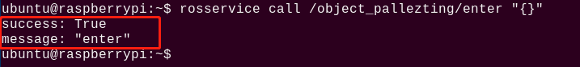

**10.2.2 Start Live Camera Feed**

① After entering game, rqt tool is required to enable live camera feed. Open the new terminal according to "step2".
② Input command and press enter. Wait for a moment to open rqt tool.

```py
rqt_image_view
```

③ Select the topic of intelligent stacking "//object_pallezting/image_result" and others remain the same.


:::{Note}
after camera image is enabled, you must select the topic corresponding to the game or the recognition process can not be displayed normally after game starts.
:::

**10.2.3 Start game**

(1) Get back to the terminal opened in "[10.2.1 Access to game](#anchor_10_2_1)" and enter command. The prompt in box as below picture denotes game is started.

```shell
rosservice call /object_pallezting/set_running "data: true"
```

**10.2.4 Stop and exit game**

(1) If desire to stop the game, please enter command and press Enter.


```shell
rosservice call /object_pallezting/set_running "data: false"
```

(2) Enter command to quit the game.

```shell
rosservice call /object_pallezting/exit "{}"
```

::{Note}
before game is exited, it will continue to run in the current Raspberry Pi power-on state. To prevent occupying the RAM of Raspberry Pi, please refer to the above steps to close the current program before another AI vision programs are executed.
:::

(3) For disabling camera image function, please return to the terminal of rqt tool and press "Ctrl+C".

(4) You can press "Ctrl+C" to close this program. If it is failure to close, you can press it multiple times.

(5) After experiencing the game, you can start app service through command or restarting the robot. If the app service is not opened, the related function of app will be failure to perform. If the robot restarts, the app service will automatically start.

(6) Click iconon the top left corner of the desktop and input in the system path. Then press enter to start the app service. Wait for the robotic arm to return to its initial pose, and you will hear a "Di" sound from the buzzer, signaling completion. Note: input command of starting app service in system path rather than in the docker container.

```shell
sudo systemctl restart start_node.service
```

### 10.3 Program Outcome

After starting the game, the robotic arm will pick up labeled blocks and color blocks in turn, and stack them separately in corresponding stacking area.

### 10.4 Program Analysis

The source code of this program is located in: 

**[/home/ubuntu/armpi_fpv/src/object_pallezting/scripts/pallezting.py]()**

**10.4.1 Import Function Library**

|                      **Import Module**                       |                         **Function**                         |
| :----------------------------------------------------------: | :----------------------------------------------------------: |
|                          import cv2                          | The OpenCV library is imported for image processing and AIvision-related functions. |
|                         import copy                          |               Used for copying Python objects.               |
|                         import math                          | The math module provides access to underlying mathematical operations, including many commonly used mathematical functions and constants. |
|                         import queue                         | Provide queue data structure, supporting multi-threaded programming. |
|                         import rospy                         | Import the library for the Python interface of ROS for communicationwith ROS. |
|                        import signal                         |                Allow to handle Unix signals.                 |
|                      import  threading                       |    Provide an environment for executing multiple threads.    |
|                          import np                           | Import the NumPy library: an open-source numerical computing extension library for Python, used for array and matrix operations. |
|                 from threading import Timer                  | Import the Timer class from thethreading module, used to call a method after a specified amount of time. |
|              from sensor_msgs.msg import Image               | Import the Image message type from the sensor_msgs package.  |
|  from std_srvs.srv import Trigger, SetBool,SetBoolResponse   | Import the Trigger and SetBool service types from the ROS standard services, as well as the response type for SetBool. |
|               from warehouse.msg import Grasp                |           Import data related to grasping actions.           |
|     from hiwonder_servo_msgs.msg import MultiRawIdPosDur     | Import the MultiRawIdPosDur message type to control multiple servos. |
|  from ros_robot_controller.msg import RGBState, BuzzerState  | Import the message types of RGB light, and buzzer, controlling the status of RGB lights and buzzer. |
|    from armpi_fpv_common import pid,misc,common,apriltag     | Import the PID controller, the misc Handling module, common function module, and the module for handling AprilTag. |
|     from hiwonder_servo_control import bus_servo_control     |              Import the servo control library.               |
| from armpi_fpv_kinematics_controllers import set_pose_target, go_pose_target |      Import the libraries related to robot kinematics.       |

To call the function in function library, you can use code "the library name + function name (param, param)". For example, "sleep" function called in "rospy" library.

````py
rospy.sleep(0.1)
````

"Sleep()" is used for latency. There are some built-in libraries in Python, which can be directly imported to call. For example, "cv2", "math", etc.

**10.4.2 Main function analysis**

**(1) Initialization node**

```py
if __name__ == '__main__':
    # 初始化节点
    rospy.init_node('object_pallezting', log_level=rospy.INFO)
```

Initialize the node "object_pallezting".

**(2) Publish node topic**

```py
# 舵机发布
joints_pub = rospy.Publisher('/servo_controllers/port_id_1/multi_id_pos_dur', MultiRawIdPosDur, queue_size=1)

# 图像发布
image_pub = rospy.Publisher('/object_pallezting/image_result', Image, queue_size=1)  # register result image publisher
```

```py
# 蜂鸣器
buzzer_pub = rospy.Publisher('/ros_robot_controller/set_buzzer', BuzzerState, queue_size=1)
# rgb 灯
rgb_pub = rospy.Publisher('/ros_robot_controller/set_rgb', RGBsState, queue_size=1)
```

joints_pub:create and publish "/servo_controllers/port_id_1/multi_id_pos_dur" topic. The topic type is "MulitiRawIdPosDur", with a queue length of 1. Start relevant nodes for the robotic arm.

**image_pub:** create and publish "/object_pallezting/image_result" topic. The topic type is "Image", with a queue length of 1.

**buzzer_pub:** create and publish "/ros_robot_controller/set_buzzer" topic. The topic type is "BuzzerState", with a queue length of 1.

**rgb_pub:** create and publish "/ros_robot_controller/set_rgb" topic. The topic type is "RGBsState", with a queue length of 1.

**(3) Start Service**

```py
# app通信服务
enter_srv = rospy.Service('/object_pallezting/enter', Trigger, enter_func)
exit_srv = rospy.Service('/object_pallezting/exit', Trigger, exit_func)
running_srv = rospy.Service('/object_pallezting/set_running', SetBool, set_running)
heartbeat_srv = rospy.Service('/object_pallezting/heartbeat', SetBool, heartbeat_srv_cb)
```

**enter_srv:** subscribe "/object_pallezting/enter" topic. The topic type is Trigger. Call back "enter_func" function.

**exit_srv:** subscribe "/object_pallezting/exit" topic. The topic type is Trigger. Call back "exit_func" function.

**runing_srv:** subscribe "/object_pallezting/set_running" topic. The topic type is SetBool. Call back "set_running" function.

**hearbeat_srv:** subscribe "/object_pallezting/heartbeat" topic. The topic type is SetBool. Call back "heartbeat_srv_cb" function.

**(4) Test (Optional)**

```py
debug = 0
if debug:
	rospy.sleep(0.2)
	enter_func(1)
	start_running()
```

This part will enter debug mode to start tracking directly. The specified content is as follows:
After modifying the value of "debug" to "Ture", start program to directly enter debug mode.

Start the program when the built-in parameter of "enter_func" function is set to 1.

Start "start_running" function to perform color block stacking.
