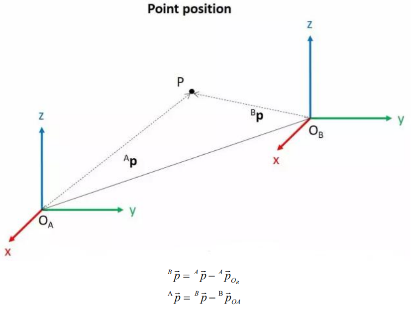
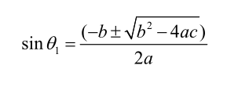
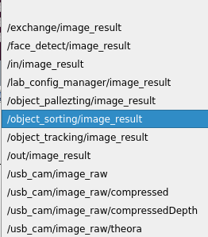

# 逆运动学基础及实战应用课程

## 1. 机械臂坐标系的建立

### 1.1 坐标系介绍

描述空间位置、速度和加速度，大部分都是用笛卡尔坐标系，也就是大家熟知由三个互相垂直的坐标轴所组成的坐标系。当我们说绕某一个轴旋转多少角度时，正方向的确定使用右手定则，如下图：


### 1.2 位置、平移交换

位置是使用一个三维向量来表示，平移变换是坐标系空间位置的变换，可以用坐标系原点 O 的位置向量表示，如下图所示。多次平移变换也很简单，向量之间直接相加就可以求空间中一个点的位置在经过平移变换后的坐标系{B} 中的坐标。



### 1.3 角度/方向、旋转变换

相比于位置，方位的表示方法相对会麻烦一些。在讨论方位之前，有必要先说明一点：一个物体的三维位置和朝向，通常都会在物体上"附上"一个跟着它动跟着它转的坐标系，然后通过描述这个坐标系与参考坐标系的关系来描述这个物体。

描述一个物体在坐标系中的位置和朝向，可以等效理解为描述坐标系之间的关系。我们这里讲角度/方向表示法，只要讲两个坐标系之间的关系就可以了。 要知道一个坐标系相对于另一个坐标系如何旋转、旋转了多少，应该怎么做呢？我们先从二维的情况看起：


通过将坐标轴单位向量用参考坐标系表示，看图可以直接写出下列公式：


我们再定义一个2x2的矩阵：


显然，这个矩阵的每一列为坐标系B的坐标轴单位向量在坐标系中的表示，有了这个矩阵我们就能画出坐标系B的x轴y轴，确定B的唯一朝向。

### 1.4 旋转矩阵

空间三维朝向相对来讲更加复杂，因为平面上坐标的朝向只能有一个自由度，即绕垂直平面的轴旋转。而空间中物体的朝向会有三个自由度。不过如果我们从上图的第一种方法出发，就可以轻松写出一个3×3的R矩阵，我们称它为旋转矩阵：


这个式子表明从坐标系{B}到坐标系{A}的旋转矩阵中，每一列都是坐标系{B}的坐标轴单位向量在坐标系{A}中的表示。

## 2. 逆运动学简要分析

### 2.1 逆运动学简介

逆运动学是决定要达成所需要的姿势所要设置的关节可活动对象的参数的过程。

机械臂的逆运动学问题是其轨迹规划与控制的重要基础，逆运动学求解是否快速准确将直接影响到机械臂轨迹规划与控制的精度，因此针对六自由度机械臂，设计一种快速准确的逆运动学求解方法是十分重要的。

### 2.2 逆运动学简析

对于机械臂而言，就是给出夹持器的位置和朝向后求出每个关节的旋转角度。机械臂的三维运动是比较复杂的，这里为了简化模型，我们去掉下方云台的旋转关节，这样就可以在二维的平面上进行运动学分析了。

进行逆运动学分析一般要进行大量的矩阵运算，过程复杂计算量大所以实现起来较难。为了更好的适应我们的需要，我们使用几何法对机械臂进行分析。


我们将机械臂的模型简化，去掉底座云台，和执行器部分得到机械臂的主体。从上图可以看到机械臂的端点P的坐标（x,y），最终由三个部分组成（x1+x2+x3，y1+y2+y3）。

其中上图的θ1，θ2 ，θ3就是我们要求解的舵机的角度，α是爪子与水平面的夹角。从图上来看显然爪子的俯视角度α=θ1+θ2+θ3，据此我们可以列出下式：


其中x，y由使用者给出，l1、l2、l3为机械臂的机械结构固有属性。

为了方便计算，我们将已知部分处理一下，作整体考虑：


将m、n代入已有方程，再化简可得：


通过计算可得：



我们看到上式为一元二次方程的求根公式，其中：


据此我们可以求出θ1的角度，同理我们也可以求出θ2。由此我们便可求出三个舵机的角度，然后根据角度控制舵机即可实现坐标位置的控制。

### 2.3 逆运动学程序位置

逆运动学程序已经封装好了，路径查看可在 **"/home/ubuntu/armpi_fpv/src/armpi_fpv_kinematics/scripts/"** 中找到，详细代码说明可参考对应程序注释即可。

## 3. 单次控制多个舵机

### 3.1 实验原理

本节课通过舵机控制函数，分别控制机械臂上的舵机。

主要使用舵机控制函数，直接控制舵机脉宽，使舵机转动到指定位置。

### 3.2 玩法开启及关闭

:::{Note}
指令的输入需严格区分大小写，另外可按键盘"Tab"键进行关键词补齐。
:::

将设备开机，并参照课程资料的"**[远程工具安装及容器进入方法\1. 远程桌面工具安装与连接]()**"内容，通过VNC远程连接工具连接。


1)  点击系统桌面左上角的图标，打开Terminator终端输入指令，并按下回车，切换至玩法程序所在目录。

```commandline
cd /home/ubuntu/course/control_course/
```

2. 输入指令，并按下回车，开启玩法。

```commandline
python3 control_by_servo.py
```

3. 如需关闭此程序，可按下"**Ctrl+C**"。

### 3.3 功能实现

玩法开启后，机械臂上的舵机会从1号舵机开始转动。

### 3.4 代码分析

该程序的源代码位于容器内的: **/home/ubuntu/course/control_course/control_by_servo.py**


- **导入相关库**

```python
import time
from commom.ros_robot_controller_sdk import Board
```

"time"是时间相关的库；"Board"是控制扩展板相关的库。

如需调用功能库里的函数，可以使用代码"功能库名.函数名（参数，参数...）"，如：

```python
time.sleep(1)
```

上图所示代码的作用是调用"time"库中的sleep()函数，此函数用于延时。

Python中有一些内置的库，用户可以直接导入调用，如time、cv2、math等。此外，用户也可以自定义一个库，如本节课所用程序中的"Board"逆运动学库。

**机械臂运动**

```python
board.bus_servo_set_position(0.5, [[2, 200], [3, 700]])
```

以代码"board.bus_servo_set_position(0.5, \[\[2, 200\], \[3, 700\]\])"为例，括号内的参数含义如下：

第一个参数"0.5"表示舵机转动时间，单位为秒；

第二个参数"2，200"是舵机ID和目标脉冲宽度；

第二个参数"3，700"是舵机ID和目标脉冲宽度；

## 4.机械臂上下左右移动

### 4.1 实验原理

本节课通过逆运动学设置机械臂末端位置坐标，控制机械臂末端上下左右移动。

主要使用逆运动学，根据设置的目标位置坐标，计算出关节角度；再将关节角度换算成舵机脉宽，再控制舵机就可以实现机械臂末端移动到目标位置。

### 4.2 玩法开启及关闭

:::{Note}
指令的输入需严格区分大小写，另外可按键盘"Tab"键进行关键词补齐。
:::

将设备开机，并参照课程资料的"**[远程工具安装及容器进入方法\1. 远程工具安装与连接]()**"内容，通过VNC远程连接工具连接。


1)  点击系统桌面左上角的图标，打开Terminator终端输入指令并按下回车，切换至玩法程序所在目录。

```commandline
cd /home/ubuntu/course/control_course/
```

2. 输入指令，并按下回车，开启玩法。

```commandline
python3 control_by_kinematics.py
```

3. 如需关闭此程序，可按下"**Ctrl+C**"。

### 4.3 功能实现

玩法开启后，机械臂会左右移动，再前后移动，最后上下移动。

### 4.4 代码分析

程序的源代码位于容器内： **/home/ubuntu/course/control_course/control_by_kinematics.py**


- **导入相关库**

```python
import time
import numpy as np
from kinematics import transform
from commom.ros_robot_controller_sdk import Board
from kinematics.kinematics_controller import kinematicsController
```

"time"是时间相关的库；"KinematicsController"是逆运动学相关的库。

如需调用功能库里的函数，可以使用代码"功能库名.函数名（参数，参数...）"，如：

```python
time.sleep(1)
```

上图所示代码的作用是调用"time"库中的sleep()函数，此函数用于延时。

Python中有一些内置的库，用户可以直接导入调用，如time、cv2、math等。此外，用户也可以自定义一个库，如本节课所用程序中的"**KinematicsController**"逆运动学库。

- **实例化函数**

```python
board = Board()
controller = kinematicsController(board)
```

将函数实例化，方便后面调用函数。如：

controller = KinematicsController(board) 中，KinematicsController 类，被 controller 的对象实例。board 被作为参数传递给了 KinematicsController 类的构造函数

- **机械臂运动**


以代码

```python
controller.set_pose_target([0.2, 0, 0.25], 0, [-180, 180], roll=90)
```

为例，括号内的参数含义如下：

第一个参数"\[0.2, 0, 0.25\]"表示以机械臂为原点的三维空间末端坐标（X, Y, Z）；

第二个参数"0"是机械臂运动到末端坐标的俯仰角；

第三个参数"\[-180, \], "与第四个参数"\[180\], "是俯仰角的取值范围，机械臂无法运动到指定俯仰角时，会自动寻找最接近给定俯仰角的解；

第五个参数"roll=90"是目标姿态中的"滚转角"。

## 5. 机械臂色块位置识别

### 5.1 实验原理

1)  首先，色块在确定位置之前，需先进行颜色识别。我们使用Lab颜色空间来进行处理。先将RGB颜色空间转换为Lab，再进行二值化处理、开运算、闭运算等操作，获得只包含目标颜色的轮廓，即可实现物体颜色的识别。

2)  接着，遍历所有找到的目标颜色轮廓，通过逐一比较，找到最大轮廓面积。然后获取目标轮廓的四个角点坐标，并计算出中心点坐标。

3)  最后，将目标轮廓用红框框出，显示轮廓的中心坐标，并控制扩展板的LED灯亮起目标颜色。

4)  在获得最大轮廓面积后，通过调用cv2库内的minAreaRect()函数，可以得到其最小外接矩形，括号内是存放了点坐标的点集数组或向量。

5)  通过调用boxPoints()函数，可以获取目标矩形的四个顶点坐标。以"box = np.int0(cv2.boxPoints(rect))"为例，此处得到了目标轮廓最小外接矩形的四个顶点坐标，后续可以在此基础上，通过计算求得该矩形的中心坐标。

### 5.2 玩法开启及关闭

:::{Note}
指令的输入需严格区分大小写，另外可按键盘"**Tab**"键进行关键词补齐。
:::

将设备开机，并参照课程资料的"**[远程工具安装及容器进入方法\远程桌面工具安装与连接]()**"内容，通过VNC远程连接工具连接。


1)  点击系统桌面左上角的图标，打开Terminator终端，输入指令按下回车，关闭手机APP自启服务。

```commandline
sudo ./.stop_ros.sh
```

2. 输入进入玩法程序所在目录的指令，按下回车。

```commandline
cd /home/ubuntu/course/vision_course/
```

3. 输入运行玩法程序的指令，按下回车。

```commandline
python3 get_color_position.py
```

4. 如需关闭此程序，可按下"Ctrl+C"。

玩法体验完毕后，可通过指令或重启机器人来开启手机APP服务。如未开启手机APP服务，则APP相关功能会失效。（若机器人重启，手机APP服务将会自动开启）

点击桌面左上角终端图标（注意：需要在系统路径下输入指令，而不是在docker容器中输入开启APP服务的指令），在系统路径下输入指令并按下回车，启动APP服务，等待机械臂恢复至初始姿态，蜂鸣器"滴"一声即可。

```commandline
sudo  systemctl restart start_node.service
```

### 5.3 功能实现

程序运行后，机械臂运动，使摄像头正对正前方。在Frame工具内可以看到当红色色块被识别到后，会将红色色块目标框出，并且在终端显示对应的坐标。


### 5.4 程序简要分析

该程序的源代码位于Docker容器中的： **/home/ubuntu/course/vision_course/get_color_position.py**


在获得最大轮廓面积后，通过调用cv2库内的minAreaRect()函数，可以得到其最小外接矩形，括号内是存放了点坐标的点集数组或向量。

通过调用boxPoints()函数，可以获取目标矩形的四个顶点坐标。

以代码

```py
box = np.int0(cv2.boxPoints(rect))
```

为例，此处得到了目标轮廓最小外接矩形的四个顶点坐标，后续可以在此基础上，通过计算求得该矩形的中心坐标。

## 6. 色块角度识别

### 6.1 实验原理

本节色块角度识别的实现过程包括两个部分：识别、计算、显示。

首先，需要进行颜色识别，这里使用Lab颜色空间来进行处理。先将RGB颜色空间转换为Lab，然后进行二值化处理、开运算、闭运算等操作，获得只包含红、绿、蓝三种颜色的物体轮廓，从而实现颜色的识别。

接着，使用算法遍历所有获得的物体轮廓，得到其中面积最大的颜色物体轮廓。然后，计算出该目标物体的旋转角度，并将其用对应颜色线条框出。

最后，将识别到的物体旋转角度打印到终端窗口，并让RGB彩灯亮起该物体的颜色，同时在回传画面上显示其颜色种类及旋转角度。

### 6.2 玩法开启及关闭

:::{Note}
指令的输入需严格区分大小写，另外可按键盘"**Tab**"键进行关键词补齐。
:::

1. 将设备开机，并参照课程资料的"**[远程工具安装及容器进入方法\1. 远程桌面工具安装与连接]()**"内容，通过VNC远程连接工具连接。


2. 点击系统桌面左上角的图标，打开Terminator终端，输入指令按下回车，关闭手机APP自启服务。

```commandline
sudo ./.stop_ros.sh
```

3. 输入进入玩法程序所在目录指令，按下回车键。

```commandline
cd /home/ubuntu/course/vision_course/
```

4. 输入运行玩法程序的指令，按下回车键。

```commandline
python3 get_color_rotation_angle.py
```

5. 如需关闭此程序，可按下"Ctrl+C"。

玩法体验完毕后，可通过指令或重启机器人来开启手机APP服务。如未开启手机APP服务，则APP相关功能会失效。（若机器人重启，手机APP服务将会自动开启）

点击桌面左上角终端图标（注意：需要在系统路径下输入指令，而不是在docker容器中输入开启APP服务的指令），在系统路径下输入指令按下回车，启动APP服务，等待机械臂恢复至初始姿态，蜂鸣器"滴"一声即可。

```commandline
sudo systemctl restart start_node.service
```

### 6.3 功能实现

程序运行后，机械臂恢复初始姿态。将色块放置于摄像头视野范围内，当摄像头识别到色块，终端会打印色块当前的旋转角度，RGB彩灯会亮起对应颜色的灯光，且回传画面会框出色块，显示其颜色种类及旋转角度。


### 6.4 程序简要分析

程序在Docker容器中的： **/home/ubuntu/course/vision_course/get_color_rotation_angle.py**


在例程中，cv2库内的drawContours()函数用于绘制图像中的目标轮廓，以代码

```commandline
cv2.drawContours(img, [box], -1, range_rgb[color_area_max], 2)
```

为例，括号内的参数含义如下：

第一个参数"img"是绘制轮廓的图像；

第二个参数"\[box\]"是获得的角点数据；

第三个参数"-1"是指定轮廓list内进行绘制的轮廓，此处数值代表绘制其中的所有轮廓；

第四个参数"range_rgb\[color_area_max\]"是轮廓颜色；

第五个参数"2"是轮廓线条宽度，"-1"代表用指定颜色填充轮廓。

## 7. 机械臂色块追踪

可在本节文件夹下观看演示效果。

### 7.1 实验原理

前面的课程实现了识别色块颜色的功能，本节将在识别的基础上进行延伸，让机器人寻找并追踪视野范围内的红色方块。

成功识别物体颜色后，利用逆运动学原理控制机械臂的运动，主要用到逆运动学的以下知识：

- 利用物体新坐标，计算机械臂俯仰角的解；

- 利用俯仰角的解，计算舵机的角度；

- 利用舵机角度，计算舵机的脉冲宽度。

### 7.2 实验步骤

:::{Note}
指令的输入需严格区分大小写，另外可按键盘"**Tab**"键进行关键词补齐。
:::

1. 将设备开机，并参照课程资料的"**[远程工具安装及容器进入方法\1. 远程桌面工具安装与连接]()**"内容，通过VNC远程连接工具连接。


2)  点击系统桌面左上角的图标，打开Terminator终端，输入指令按下回车，关闭手机APP自启服务。

```commandline
sudo ./.stop_ros.sh
```

3.  输入进入玩法程序所在目录的指令，按下回车键。

```commandline
cd /home/ubuntu/course/vision_course/
```

3.  输入运行玩法程序的指令，按下回车键。

```commandline
python3 track_by_color.py
```

4. 如需关闭此程序，可按下"**Ctrl+C**"。

玩法体验完毕后，可通过指令或重启机器人来开启手机APP服务。如未开启手机APP服务，则APP相关功能会失效。（若机器人重启，手机APP服务将会自动开启）

点击桌面左上角终端图标（注意：需要在系统路径下输入指令，而不是在docker容器中输入开启APP服务的指令），在系统路径下输入指令，按下回车，启动APP服务，等待机械臂恢复至初始姿态，蜂鸣器"滴"一声即可。

```commandline
sudo systemctl restart start_node.service
```

### 7.3 功能实现

玩法开启后，将红色方块移至摄像头范围内，当摄像头识别到色块，回传画面内会将其框出。此时缓慢移动色块，机械臂会随之进行移动。


### 7.4 程序简要分析

程序在Docker容器中的： **/home/ubuntu/course/vision_course/track_by_color.py**


在识别到红色方块后，需要对机械臂进行控制，这部分主要分为3个步骤：

- **获取新坐标**

移动红色方块后，通过计算可以得到新的X、Y、Z三轴坐标的数据，这里创建x_dis、y_dis和z_dis的变量来存储数值。识别时，将红色方块置于机械臂摄像头前，建立的三维坐标如下图所示：


将色块置于摄像头前，实际上，摄像头检测到的是一个二维图像，如下图所示：


然后，通过对应公式，可以根据检测到的二维图像数据，计算出移动后色块的三维坐标数据，即x_dis、y_dis和z_dis的值。详细计算步骤如下：

1)  **获取x_dis**

在X轴方向上移动色块，可以发现对应的二维图像也在X轴方向上移动，即可以通过读取当前二维图像中X轴的数据，计算出色块在三维图像中X轴方向的坐标（即x_dis的值）。

```python
x_pid.SetPoint = img_w / 2.0  #设定
x_pid.update(x)  #当前
x_dis += int(x_pid.output)  #输出

x_dis = 0 if x_dis > 1000 else x_dis
```

**x_pid.SetPoint = img_w / 2.0：** 移动前，二维图像中X轴数据。

**x_pid.update(x) :** 移动后，二维图像中X轴数据。

**x_dis += int(x_pid.output) ：** 计算出三维坐标X轴的偏移量。

**x_dis = 0 if x_dis \< 0 else x_dis**

**x_dis = 1000 if x_dis \> 1000 else x_dis :** 增加偏移量进行了边界检查，获取 x_dis的值。

2)  **获取y_dis**

在Y轴方向上移动色块，可以发现二维图像的面积数据发生变化，即可以通过读取当前二维图像中面积数据，计算出色块在三维图像中Y轴方向的坐标（即y_dis的值）。

```python
if abs(area_max - 6000) < 500:
    area_max = 6000
y_pid.update(area_max)  #当前
y_dis += y_pid.output  #输出
y_dis = 0.05 if y_dis < 0.05 else y_dis
y_dis = 0.10 if y_pid > 0.10 else y_dis
```

**y_pid.SetPoint = area_max：** 移动前，二维图像的面积为6000。

**if abs(area_max – 6000) \< 500:**

**area_max = 6000 ：** 设置如果检测到的面积变化小于500，就默认为检测面积 不变。

**y_pid.update(area_max)：** 移动后，二维图像的面积。

**y_dis += y_pid.output**

**y_dis = 0.05 if y_dis \< 0.05 else y_dis**

**y_dis = 0.10 if y_dis \> 0.10 else y_dis ：** 计算出三维坐标Y轴的偏移量，

增加偏移量并且设置了 y_dis 变量的最大值。如果 y_dis 的计算结果大于0.10，则 y_dis 被设置为0.10，获取y_dis的值。

3)  **获取z_dis**

在Z轴方向上移动色块，可以发现检测到的二维图像中在Y轴方向移动，即可以通过读取当前二维图像中Y轴数据，计算出色块在三维图像中Z轴方向的坐标（即z_dis的值）。

```python
z_pid.update(y)
z_dis += z_pid.output

z_dis = 0.23 if z_dis > 0.23 else z_dis
z_dis = 0.15 if z_dis < 0.15 else z_dis
```

**z_pid.SetPoint = img_h / 2.0：** 移动前，二维图像中Y轴数据。

**if abs(y - img_h/2.0) \< 20:**

**y = int(img_h/2.0) ：** 当前位置与中心的差距小于20个单位，将y值设置为图 像高度的一半，即垂直居中。

**z_pid.update(y)：** 移动后，二维图像中Y轴数据。

**z_dis= z_pid.output：**计算出三维坐标Z轴的偏移量。

**z_dis = 0.23 if z_dis \> 0.23 else z_dis**

**z_dis = 0.15 if z_dis \< 0.15 else z_dis：** 进行了边界检查并且机械臂增加偏移量，获取z_dis的值

4. **计算舵机脉冲宽度**

此处调用已经封装好的逆运动学程序。

```python
board = Board()
controller = KinematicsController(board)
```

通过以下3个步骤即可求得所有舵机脉冲宽度：

5. **设置机械臂的目标姿态**

```python
res = controller.set_pose_target([y_dis, 0, z_dis], 0, [-90, 90], 0)
```

6. **设置舵机角度**

利用上面给出的的解，计算出对应舵机的角度，程序如下：

```python
if res[1]:
    board.bus_servo_set_position(0.02, [[3, res[1][3]], [4, res[1][2]],[5, res[1][1]], [6, x_dis]])
```

**[\[3, res\[1\]\[3\]\], \[4, res\[1\]\[2\]\], \[5, res\[1\]\[1\]\], \[6, x_dis\]\]** 是一个列表，其中包含舵机ID和对应的目标位置。

**Res\[1\]\[1\]、res\[1\]\[2\]、res\[1\]\[3\]** 是由 set_pose_target 方法计算出的角度或位置值，用于 控制ID为3、4、5的舵机。x_dis 是之前通过PID控制器计算出的x轴位移量，用于控制ID为6的舵机。

程序中用到了逆运动学原理，需要进行大量的矩阵运算，过程复杂计算量大，实现起来较难，所以这里就不详细介绍程序了。同时，为了让大家更好地理解逆运动学原理，此处使用几何法对机械臂进行分析。


将机械臂的模型简化，去掉底座云台和执行器部分，得到机械臂的主体。由上图可得，机械臂的端点P的坐标（x,y），也可看作是（x1+x2+x3，y1+y2+y3）。

图中的θ1、θ2、θ3即为需要求解的舵机角度，α是爪子与水平面的夹角。由上图可知，爪子的俯视角度α=θ1+θ2+θ3，据此可以列出下式：


其中，x、y由使用者给定，l1、l2、l3为机械臂的机械结构固有属性。

为了方便计算，将已知部分处理一下，作整体考虑：


将m、n代入已有方程，再化简可得：


通过计算可得：


上式为一元二次方程的求根公式，其中：


据此可以求出θ1的角度，同理可得θ2和θ3，由此便解得三个舵机的角度。

## 8. 机械爪位置自适应调整

### 8.1 实验原理

本节课以机械臂的智能码垛原理为例进行分析，其它涉及机械爪位置自适应调整的玩法可参考本节。

示例玩法涉及的机械爪位置调整的部分主要有两个方面：夹取、放置。

首先，通过逆运动学求解和角度转化，获得目标点坐标的对应角度数值和转化后的舵机脉宽数据。然后，控制舵机的转动，经过移动、夹取、抬升将木块抓取。最后，再经过转动、抬升、放置操作将木块堆叠至码垛区。

<p id="anchor_8_2"></p>

### 8.2 玩法开启及关闭

:::{Note}
指令的输入需严格区分大小写，另外可按键盘"**Tab**"键进行关键词补齐。
:::

**玩法进入**

1. 将设备开机，并参照课程资料的"**[远程工具安装及容器进入方法\1. 远程桌面工具安装与连接]()**"内容，通过VNC远程连接工具连接。


2. 点击系统桌面左上角的图标，打开Terminator终端，输入指令按下回车，关闭手机APP自启服务。


```commandline
sudo ./.stop_ros.sh
```

3. 在Terminator终端，输入如下指令，然后按下回车开启运动控制、相机等底层服务。

```commandline
roslaunch armpi_fpv_bringup bringup.launch
```

4. 参照"2."打开新的终端，输入如下指令

```commandline
rosservice call /object_pallezting/enter "{}"
```

然后按下回车进入色块码垛玩法。当成功进入后，会打印提示信息，如下图所示：


**开启图像回传**

1)  进入玩法后我们需要使用rqt工具来开启图像回传，参照"[玩法开启及关闭\ 步骤2](#anchor_8_2)"打开新的终端。

输入指令，按下回车，稍等片刻即可打开rqt工具。

```python
rqt_image_view
```

2)  单击下图所示红框位置，对智能码垛的话题选项（topic）进行选择，选项为"**//object_pallezting/image_result**"，其余设置保持不变。


:::{Note}
图像开启后请务必选择与玩法相对应的话题选项，否则在后续玩法启动后，将无法正常显示其识别过程。
:::

**玩法启动**

此时返回[玩法开启及关闭\ 步骤2](#anchor_8_2)开启的终端，输入如下指令：

```commandline
rosservice call /object_pallezting/set_running "data: true"
```

同理出现下图所框提示即为启动成功。


**玩法停止及退出**

如需停止该玩法，输入指令。

```commandline
rosservice call /object_pallezting/set_running "data: false"
```

如需退出该玩法，输入指令即可退出。

```commandline
rosservice call /object_pallezting/exit "{}"
```

:::{Note}
玩法在未退出时，会在当前树莓派通电状态下持续运行。为避免过多占用树莓派的运行内存，如需执行其它AI视玩法，请先按照上述指令关闭当前玩法。
:::

如需关闭摄像头回传图像，返回开启rqt工具的终端，按下"Ctrl+C"即可。

玩法体验完毕后，可通过指令或重启机器人来开启手机APP服务。如未开启手机APP服务，则APP相关功能会失效。（若机器人重启，手机APP服务将会自动开启）

点击桌面左上角终端图标（注意：需要在系统路径下输入指令，而不是在docker容器中输入开启APP服务的指令），在系统路径下输入指令，按下回车，启动APP服务，等待机械臂恢复至初始姿态，蜂鸣器"滴"一声即可。

```commandline
sudo systemctl restart start_node.service
```

### 8.3 实现效果

玩法开启后，机械臂将会依次夹取标签方块、颜色方块，并将夹取的方块分别叠放在对应的码垛区。

### 8.4 代码简要分析

该程序的源代码位于： **/home/ubuntu/armpi_fpv/src/object_pallezting/scripts/pallezting.py**


- #### 8.4.1 导入功能库

| **导入模块** | **作用** |
|:--:|:--:|
| import cv2 | 导入了OpenCV库，用于图像处理和计算机视觉相关的功能 |
| import copy | 用于复制Python对象 |
| import math | math模块提供了对数学运算的底层访问，包含了许多常用的数学函数和常量 |
| import queue | 提供队列数据结构，支持多线程编程 |
| import rospy | 导入 ROS的 Python 接口的库，用于与 ROS 通信 |
| import signal | 允许处理Unix信号 |
| import threading | 提供多线程运行的环境 |
| import np | 导入NumPy库，是Python的一个开源数值计算扩展库，用于处理数组和矩阵运算 |
| from threading import Timer | 从threading模块导入Timer类，用于在设定的时间后调用一个方法 |
| from sensor_msgs.msg import Image | 从 sensor_msgs 包导入 Image 消息类型 |
| from std_srvs.srv import Trigger, SetBool,SetBoolResponse | 导入ROS标准服务的Trigger和SetBool服务类型，以及SetBool的响应类型 |
| from warehouse.msg import Grasp | 导入用于处理抓取动作相关的数据 |
| from hiwonder_servo_msgs.msg import MultiRawIdPosDur | 导入 MultiRawIdPosDur 消息类型，用于控制多个舵机的的消息 |
| from ros_robot_controller.msg import RGBState, BuzzerState | 导入 GB灯和蜂鸣器的消息类型，控制机器人的RGB灯和蜂鸣器状态 |
| from armpi_fpv_common import pid,misc,common,apriltag | 导入PID控制器，处理misc的模块，常用函数模块、处理AprilTag的模块 |
| from hiwonder_servo_control import bus_servo_control | 导入舵机控制库 |
| from armpi_fpv_kinematics_controllers import set_pose_target, go_pose_target | 导入机器人运动学相关的库 |

我们如果想要调用功能库里的函数，就可以使用"功能库名+函数名（参数，参数...）"如：

```py
rospy.sleep(0.1)
```

就是调用"**rospy**"库中的"**sleep**"函数，sleep()的作用是延时。在 python 中有一些已经内置的库，我们直接导入调用就可以，比如"**cv2**"、"**math**"等。

- #### 8.4.2 主函数分析

- **初始化节点**


```py
if __name__ == '__main__':
    # 初始化节点
    rospy.init_node('object_pallezting', log_level=rospy.INFO)
```

初始化名为"**object_pallezting**"的节点。

- **发布节点话题**

```py
    # 舵机发布
    joints_pub = rospy.Publisher('/servo_controllers/port_id_1/multi_id_pos_dur', MultiRawIdPosDur, queue_size=1)

    # 图像发布
    image_pub = rospy.Publisher('/object_pallezting/image_result', Image, queue_size=1)  # register result image publisher
```

**joints_pub**:创建并发布'**/servo_controllers/port_id_1/multi_id_pos_dur**'的话题，话题类型为**MulitiRawIdPosDur**，列队长度为1，开启机械臂的相关节点。

**image_pub**:创建并发布'**/object_pallezting/image_result**'的话题，话题类型为**Image**，列队长度为1。

**buzzer_pub**:创建并发布'**/ros_robot_controller/set_buzzer**'的话题，话题类型为**BuzzerState**，列队长度为1。

**rgb_pub**：创建并发布'**/ros_robot_controller/set_rgb**'的话题，话题类型为**RGBsState**，列队长度为1。

- **开启服务**

```py
    # app通信服务
    enter_srv = rospy.Service('/object_pallezting/enter', Trigger, enter_func)
    exit_srv = rospy.Service('/object_pallezting/exit', Trigger, exit_func)
    running_srv = rospy.Service('/object_pallezting/set_running', SetBool, set_running)
    heartbeat_srv = rospy.Service('/object_pallezting/heartbeat', SetBool, heartbeat_srv_cb)
```

**enter_srv**：订阅名为'**/object_pallezting/enter**'的话题，类型为**Trigger**，回调**enter_func**的函数。

**exit_srv**：订阅名为'**/object_pallezting/exit**'的话题，类型为**Trigger**，回调**exit_func**的函数。

**runing_srv**：订阅名为'**/object_pallezting/set_running**'的话题，类型为**SetBool**，回调**set_running**的函数。

**hearbeat_srv**：订阅名为'**/object_pallezting/heartbeat**'的话题，类型为**SetBool**，回调**heartbeat_srv_cb**的函数。

- **测试（可选）**

```py
    debug = 0
    if debug:
        rospy.sleep(0.2)
        enter_func(1)
        start_running()
```

该部分为进入调试模式，会直接开始色块分拣，具体内容如下：

将debug的值修改为Ture后，我们开启玩法后会直接进入调试模式。

函数enter_func的内参设置为1时，开启玩法。

启动start_running函数，开始色块码垛。

### 8.5 位置自适应调整实现分析

本节以机械臂抓取部分的调整为例进行分析，放置部分原理相同。

1. **导入功能库**

在控制机械臂运动前，需要导入一系列自适应调整使用的Python功能库。

```py
import cv2
import copy
import math
import queue
import rospy
import signal
import threading
import numpy as np
from threading import Timer

from sensor_msgs.msg import Image
from std_srvs.srv import Trigger, SetBool, SetBoolResponse

from warehouse.msg import Grasp
from hiwonder_servo_msgs.msg import MultiRawIdPosDur
from ros_robot_controller.msg import RGBState, RGBsState, BuzzerState 

from armpi_fpv_common import pid, misc, common, apriltag
from hiwonder_servo_controllers import bus_servo_control
from armpi_fpv_kinematics.kinematics_control import set_pose_target, go_pose_target
```

2. **计算是否能够到达目标位置**

检查是否能够到达四个设定的目标位置。每个目标位置都是通过 set_pose_target 函数来设定，如果不能到达这些位置，代码就会返回 False。

```py
    # 计算是否能够到达目标位置，如果不能够到达，返回False
    target1 = set_pose_target((position.y + approach.y, position.x + approach.x, position.z + approach.z), rotation.r, [-90, 90], 0)
    target2 = set_pose_target((position.y, position.x, position.z), rotation.r, [-90, 90], 0)
    target3 = set_pose_target((position.y, position.x, position.z + grasps.up), rotation.r, [-90, 90], 0)
    target4 = set_pose_target((position.y + retreat.y, position.x + retreat.x, position.z + retreat.z), rotation.r, [-90, 90], 0)
    
    if not running:
        return False 
    if target1[1] and target2[1] and target3[1] and target4[1]:
```

简单来说，只有当所有四个目标位置可以到达目标位置，程序才会继续运行。

```py
servo_data = target1[1]
bus_servo_control.set_servos(joints_pub, 1.8, ((3, servo_data[3]), (4, servo_data[2]), (5, servo_data[1]))) 
rospy.sleep(2)
if not running:
    return False
```

调用 set_servos 函数来设置多个舵机指定的位置或姿态。函数的第一个参数 joints_pub 是发布者对象，用来发布舵机控制命令。第二个参数 1 表示动作执行所需的时间（1秒）。后面的参数是一个元组的集合，分别是舵机的ID和它们要到达的目标位置。

3. **对齐目标**

由于目标方块是随机放置的，在靠近目标后，机械爪与方块不一定处于平行状态。若在非平行状态下夹取方块，机械爪有可能出现夹取失败或夹取位置不佳的情况，进而影响后期码垛的效果。

因此需要使2号舵机旋转"((2, 500 + int(F\*gripper_rotation)), ))"，令机械爪和方块相互平行。

```py
# 第五步: 对齐
bus_servo_control.set_servos(joints_pub, 0.5, ((2, 500 + int(F*gripper_rotation)), ))
rospy.sleep(0.8)
if not running:
    target4 = set_pose_target((position.y + retreat.y, position.x + retreat.x, position.z + retreat.z), rotation.r, [-90, 90], 0)
    servo_data = target4[1]
    bus_servo_control.set_servos(joints_pub, 1, ((1, 200), (3, servo_data[3]), (4, servo_data[2]), (5, servo_data[1])))       
    rospy.sleep(1)             
    return False
```

4. **夹取目标**

使得机械臂与方块相互平行后，便可以调整1号舵机以收缩机械爪。若此时机械爪无法夹紧方块，即机械爪与方块之间存在微小间隙，请利用内置的上位机软件进行检查，并适当调整舵机偏差。

```py
# 第六步：夹取
bus_servo_control.set_servos(joints_pub, 0.5, ((1, grasps.grasp_posture), ))               
rospy.sleep(0.8)
if not running:
    bus_servo_control.set_servos(joints_pub, 0.5, ((1, grasps.pre_grasp_posture), ))               
    target4 = set_pose_target((position.y + retreat.y, position.x + retreat.x, position.z + retreat.z), rotation.r, [-90, 90], 0)
    rospy.sleep(0.5)            
    servo_data = target4[1]
    bus_servo_control.set_servos(joints_pub, 1, ((1, 200), (3, servo_data[3]), (4, servo_data[2]), (5, servo_data[1])))       
    rospy.sleep(1)             
    return False
```

5. **机体抬升**

夹取方块后，需要控制机械臂抬升。否则方块紧贴地面会导致移动的摩擦力变大，若在放置过程中，机械臂以这种姿态强行转向，可能会造成舵机堵转。

```py
# 第七步：抬升物体
if grasps.up != 0:
    target3 = set_pose_target((position.y, position.x, position.z + grasps.up), rotation.r, [-90, 90], 0)
    servo_data = target3[1]
    bus_servo_control.set_servos(joints_pub, 0.5, ((3, servo_data[3]), (4, servo_data[2]), (5, servo_data[1])))
    rospy.sleep(0.6)
    if not running:
        bus_servo_control.set_servos(joints_pub, 0.5, ((1, grasps.pre_grasp_posture), ))               
        target4 = set_pose_target((position.y + retreat.y, position.x + retreat.x, position.z + retreat.z), rotation.r, [-90, 90], 0)
        rospy.sleep(0.5)            
        servo_data = target4[1]
        bus_servo_control.set_servos(joints_pub, 1, ((1, 200), (3, servo_data[3]), (4, servo_data[2]), (5, servo_data[1])))       
        rospy.sleep(1)             
        return False
```

6. **回到初始位置**

让机械臂回归初始位置，为转向放置做好准备。

```py
# 第八步：移到撤离点
target4 = set_pose_target((position.y + retreat.y, position.x + retreat.x, position.z + retreat.z), rotation.r, [-90, 90], 0)
servo_data = target4[1]
if servo_data != target3[1]:    
    bus_servo_control.set_servos(joints_pub, 1, ((3, servo_data[3]), (4, servo_data[2]), (5, servo_data[1])))        
    rospy.sleep(1)
    if not running:
        bus_servo_control.set_servos(joints_pub, 0.5, ((1, grasps.pre_grasp_posture), ))               
        rospy.sleep(0.5)                
        return False

    # 第九步：移到稳定点
    bus_servo_control.set_servos(joints_pub, 1.5, ((2, 500), (3, 80), (4, 825), (5, 625)))
    rospy.sleep(1.5)
    if not running:
        bus_servo_control.set_servos(joints_pub, 0.5, ((1, grasps.pre_grasp_posture), ))               
        rospy.sleep(0.5)            
        return False

    return target2[3][1]
else:
    rospy.loginfo('pick failed')
    return False
```

## 9. 机械臂色块分拣

### 9.1 实验原理

机械臂色块分拣实验主要涉及三大部分：识别、抓取、放置。

首先，需要进行标签与颜色识别。

标签识别通过定位、图像分割、轮廓查找来实现，根据检测的标签进行编码与解码处理。

颜色识别通过 Lab 颜色空间来实现。先将RGB颜色空间转换为Lab，然后进行二值化处理，再经过膨胀腐蚀等操作，可获得只包含目标颜色的轮廓，然后将该颜色轮廓用圆圈框起，便实现了物体颜色的识别。

识别完成后，通过获取区域面积，对相应颜色物体所在的面积进行比较，然后取多次判断的平均值来比较其大小，进而根据面积大小决定色块之间夹取的先后顺序（优先夹取面积大的物体）。

最后，机械臂会将不同颜色的物品进行归类放置。放置完成后，机械臂会返回初始位置。

<p id="anchor_9_2"></p>

### 9.2 玩法开启及关闭

:::{Note}
指令的输入需严格区分大小写，另外可按键盘"**Tab**"键进行关键词补齐。
:::

**玩法准备**

1. 将地图铺设在平整的桌面，并将机械臂摆放到地图的对应位置。

2. 将3个颜色方块（红、绿、蓝）和3个标签方块（tag1、tag2、tag3）随机摆放在地图的物品可识别区域，方块的间距不能小于3cm。

3. 启动机械臂，等待开机完成。

**玩法进入**

1. 将设备开机，并参照课程资料的"**[远程工具安装及容器进入方法\1. 远程桌面工具安装与连接]()**"内容，通过VNC远程连接工具连接。


2. 点击系统桌面左上角的图标，打开Terminator终端，输入指令按下回车，关闭手机APP自启服务。

```python
sudo ./.stop_ros.sh
```

3. 输入指令，然后按下回车开启运动控制、相机等底层服务。

```py
roslaunch armpi_fpv_bringup bringup.launch
```

4. 打开新的终端，输入指令，然后按下回车进入色块分拣玩法。当成功进入后，会打印提示信息，如下图所示：

```py
"rosservice call /object_sorting/enter "{}""
```

**开启图像回传**

1)  进入玩法后我们需要使用rqt工具来开启图像回传，打开新的终端。

2)  输入指令，按下回车，稍等片刻即可打开rqt工具。


```py
rqt_image_view
```

3)  单击下图所示红框位置，对色块分拣的话题选项（topic）进行选择，选项为"**/object_sorting/image_result**"，其余设置保持不变。




:::{Note}
图像开启后请务必选择与玩法相对应的话题选项，否则在后续玩法启动后，将无法正常显示其识别过程。
:::

**玩法启动**

1)  此时返回[9.2 玩法开启及关闭](#anchor_9_2)开启的终端，输入如下指令

```py
rosservice call /object_sorting/set_running "data: true"
```

同理出现下图所框提示即为启动成功。


启动玩法后我们还需要设置参数来选择追踪的目标颜色，这里以追踪红色为例，输入指令**。**

```py
rosservice call /object_sorting/set_target "color:
- 'red'
tag:
- 'tag1'
```

**追踪绿色和蓝色可在"\> ' '内填写green或blue。（严格区分大小写）**

**玩法停止及退出**

1. 如需停止该玩法，输入指令。在停止该玩法后可参考[9.2 玩法开启及关闭](#anchor_9_2)，更换绿色或蓝色进行追踪。

```commandline
rosservice call /object_pallezting/set_running "data: false"
```

2)  如需退出该玩法，输入指令即可退出。

```commandline
rosservice call /object_sorting/exit "{}"
```

:::{Note}
玩法在未退出时，会在当前树莓派通电状态下持续运行。为避免过多占用树莓派的运行内存，如需执行其它AI视玩法，请先按照上述指令关闭当前玩法。
:::

3. 如需关闭摄像头回传图像，返回开启rqt工具的终端，按下"Ctrl+C"即可。

玩法体验完毕后，可通过指令或重启机器人来开启手机APP服务。如未开启手机APP服务，则APP相关功能会失效。（若机器人重启，手机APP服务将会自动开启）

点击桌面左上角终端图标（注意：需要在系统路径下输入指令，而不是在docker容器中输入开启APP服务的指令），在系统路径下输入按下回车，启动APP服务，等待机械臂恢复至初始姿态，蜂鸣器"滴"一声即可。

```commandline
sudo systemctl restart start_node.service
```

### 9.3 功能延伸

**增加新的可识别颜色**

物品追踪玩法程序内置了三种颜色：红、绿、蓝。除了这三种内置的颜色，我们还可以添加其它可识别颜色，**例如我们将橙色作为新的可识别颜色，程序步骤如下：**

1)  打开新的终端，输入指令，打开颜色阈值调试工具。若在弹出的界面中没有出现回传画面，说明摄像头未连接成功，需检查一下摄像头连接线是否连接好。

```commandline
python3 /home/ubuntu/software/lab_config/main.py
```


2. 连接成功后，在界面右下角的颜色选项栏中选择"red"。


3. 此时界面右侧是实时回传画面，左侧是需要被采集的颜色。将摄像头对准橙色物品，然后拖动下方的六个滑杆，使得左侧画面中橙色物品的区域全部变为白色，其它区域为黑色。接着点击"**save**"按钮保存数据。

**建议在拖动滑杆前使用截图或文件备份的方式记录滑杆初始数值，以便后续更改回红色。或者也可以放入一个红色物品通过拖动滑杆来实现将红色重新设置为可识别颜色。**


4. 按照[9.2 玩法开启及关闭](#anchor_9_2)中的前三步骤（"玩法进入"至"玩法启动"）的步骤启动颜色追踪玩法。

**因为我们在阈值调试工具中是用橙色代替了红色的位置，因此启动玩法时目标颜色应选择"red"。**

5. 将橙色物品放在摄像头前，并手持该物品缓慢移动，ArmPi FPV的机身便会跟随橙色物品的移动而跟随移动。如果需添加其它颜色作为可识别颜色，可参考前面的步骤。

### 9.5 程序简要分析

该程序的源代码位于Docker容器中的：

```py
/home/ubuntu/armpi_fpv/src/object_sorting/scripts/sorting.py
```


- #### 9.5.1 导入功能库

| **导入模块** | **作用** |
|:--:|:--:|
| import cv2 | 导入了OpenCV库，用于图像处理和计算机视觉相关的功能 |
| import copy | 用于复制Python对象 |
| import math | math模块提供了对数学运算的底层访问，包含了许多常用的数学函数和常量 |
| import queue | 提供队列数据结构，支持多线程编程 |
| import rospy | 导入 ROS的 Python 接口的库，用于与 ROS 通信 |
| import signal | 允许处理Unix信号 |
| import threading | 提供多线程运行的环境 |
| import np | 导入NumPy库，是Python的一个开源数值计算扩展库，用于处理数组和矩阵运算 |
| from threading import Timer | 从threading模块导入Timer类，用于在设定的时间后调用一个方法 |
| from sensor_msgs.msg import Image | 从 sensor_msgs 包导入 Image 消息类型 |
| from std_srvs.srv import Trigger, SetBool,SetBoolResponse | 导入ROS标准服务的Trigger和SetBool服务类型，以及SetBool的响应类型 |
| from warehouse.msg import Grasp | 导入用于处理抓取动作相关的数据 |
| from hiwonder_servo_msgs.msg import MultiRawIdPosDur | 导入 MultiRawIdPosDur 消息类型，用于控制多个舵机的的消息 |
| from ros_robot_controller.msg import RGBState, BuzzerState | 导入 GB灯和蜂鸣器的消息类型，控制机器人的RGB灯和蜂鸣器状态 |
| from armpi_fpv_common import pid,misc,common,apriltag | 导入PID控制器，处理misc的模块，常用函数模块、处理AprilTag的模块 |
| from hiwonder_servo_control import bus_servo_control | 导入舵机控制库 |
| from armpi_fpv_kinematics_controllers import set_pose_target, go_pose_target | 导入机器人运动学相关的库 |

我们如果想要调用功能库里的函数，就可以使用"功能库名+函数名（参数，参数...）"如：

```py
rospy.sleep(0.1)
```

就是调用"**rospy**"库中的"**sleep**"函数，sleep()的作用是延时。在 python 中有一些已经内置的库，我们直接导入调用就可以，比如"**cv2**"、"**math**"等。

- #### 9.5.2 主函数分析

- **初始化节点**


```py
if __name__ == '__main__':
    # 初始化节点
    rospy.init_node('object_sorting', log_level=rospy.INFO)
```

初始化名为"**object_sorting**"的节点。

- **发布节点话题**

```py
# 舵机发布
joints_pub = rospy.Publisher('/servo_controllers/port_id_1/multi_id_pos_dur', MultiRawIdPosDur, queue_size=1)

# 图像发布
image_pub = rospy.Publisher('/object_sorting/image_result', Image, queue_size=1)  # register result image publisher
```

```py
# 蜂鸣器
buzzer_pub = rospy.Publisher('/ros_robot_controller/set_buzzer', BuzzerState, queue_size=1)
# rgb 灯
rgb_pub = rospy.Publisher('/ros_robot_controller/set_rgb', RGBsState, queue_size=1)
```

**joints_pub**:创建并发布'**/servo_controllers/port_id_1/multi_id_pos_dur**'的话题，话题类型为**MulitiRawIdPosDur**，列队长度为1，开启机械臂的相关节点。

**image_pub**:创建并发布'**/object_sorting/image_result**'的话题，话题类型为**Image**，列队长度为1。

**buzzer_pub**:创建并发布'**/ros_robot_controller/set_buzzer**'的话题，话题类型为**BuzzerState**，列队长度为1。

**rgb_pub**：创建并发布'**/ros_robot_controller/set_rgb**'的话题，话题类型为**RGBsState**，列队长度为1。

- **开启服务**

```py
# app通信服务
enter_srv = rospy.Service('/object_sorting/enter', Trigger, enter_func)
exit_srv = rospy.Service('/object_sorting/exit', Trigger, exit_func)
running_srv = rospy.Service('/object_sorting/set_running', SetBool, set_running)
set_target_srv = rospy.Service('/object_sorting/set_target', SetTarget, set_target)
heartbeat_srv = rospy.Service('/object_sorting/heartbeat', SetBool, heartbeat_srv_cb)
```

**enter_srv**：订阅名为'/object_sorting/enter'的话题，类型为Trigger，回调enter_func的函数。

**exit_srv**：订阅名为'/object_sorting/exit'的话题，类型为Trigger，回调exit_func的函数。

**runing_srv**：订阅名为'/object_sorting/set_running'的话题，类型为SetBool，回调set_running的函数。

**set_target_srv：**订阅名为'/object_sorting/set_target'的话题，类型为SetTarget，回调set_target的函数。

**hearbeat_srv：**订阅名为'/object_sorting/heartbeat'的话题，类型为SetBool，回调heartbeat_srv_cb的函数。

- **测试（可选）**

```py
debug = 0
if debug:
    rospy.sleep(0.2)
    enter_func(1)

    msg = SetTarget()
    msg.color = ['red', 'green', 'blue']
    msg.tag = ['tag1', 'tag2', 'tag3']
    set_target(msg)

    start_running()
```

```py
debug = False
if debug:
    rospy.sleep(0.2)
    enter_func(1)

    msg = SetTarget()
    msg.data = 'blue'

    set_target(msg)
    start_running()
```

该部分为进入调试模式，会直接开始进行追踪，具体内容如下：

将debug的值修改为Ture后，我们开启玩法后会直接进入调试模式。

函数enter_func的内参设置为1时，开启玩法。

使用变量msg初始化SetTarget这个类型的对象，并设置msg对象的color属性为一 个包含三种颜色的列表:'red', 'green', 'blue'。

使用变量msg初始化SetTarget这个类型的对象，并设置msg对象的tag属性为一个包含三个标签的列表:'tag1', 'tag2', 'tag3'。

可根据自己的需求进行修改其他颜色及标签。

函数set_target的内参设置为msg，设置目标颜色及标签。

启动start_running函数，开始色块分拣。

<p id="anchor_9_5_2"></p>

- #### 9.5.3 子函数分析

- **初始化位置**

```py
# 初始位置
def initMove(delay=True):
    with lock:
        bus_servo_control.set_servos(joints_pub, 1.5, ((1, 200), (2, 500), (3, 80), (4, 825), (5, 625), (6, 500)))
    if delay:
        rospy.sleep(2) 
```

以代码"bus_servo_control.set_servos(joints_pub, 1.5, ((1, 200), (2, 500), (3, 80), (4, 825), (5, 625), (6, 500)))"的((1, 200)为例，

函数括号内的参数含义如下：

第一个参数"joints_pub"为发布的话题。

第二个参数"1.5"是舵机的转动时间，单位为s。

第三个参数"((1, 200)"，其中\[1,200\]：第一个参数"1"为舵机的ID号，第二个参数"200"是舵机的转动位置。

- **定义色块定位及追踪函数**

首先对颜色进行识别，在识别到目标颜色后将其圈出来；再根据色块在画面中的位置与回传画面的中心点进行比对，通过pid算法对云台相机的位置进行调节，使物体始终位于回传画面的中心点；从而呈现出云台舵机跟着目标物体移动而移动的效果。

- **缩放处理**

采用cv2库中的resize()函数对图像进行缩放处理，以减小计算量。

```py
frame_resize = cv2.resize(img, size, interpolation=cv2.INTER_NEAREST)
```

函数括号内的第一个参数"**image**"是输入图像，第二个参数"**size**"是图像缩放后的宽度与长度。

- **转换LAB空间**

采用cv2库中的cvtColor()函数对图像进行图像转换到LAB空间。

```py
frame_lab = cv2.cvtColor(frame_resize, cv2.COLOR_BGR2LAB)  # 将图像转换到LAB空间
```

- **二值化处理**

采用cv2库中的inRange()函数对图像进行二值化处理。

```py
frame_mask1 = cv2.inRange(frame_lab, tuple(target_color_range['min']), tuple(target_color_range['max'])) #对原图像和掩模进行位运算
```

1)  第一个参数"frame_lab"是输入图像。

2)  第二个参数"tuple(self.target_color_range\['min'\])"是颜色阈值的最小值；

3)  第三个参数"tuple(self.target_color_range\['max'\])"是颜色阈值的最大值。

- **腐蚀膨胀处理**

对图像进行腐蚀和膨胀处理，平滑图像内的轮廓边缘，便于后续查找目标轮廓。

```py
frame_mask2 = cv2.bitwise_and(roi, frame_mask1)
eroded = cv2.erode(frame_mask2, cv2.getStructuringElement(cv2.MORPH_RECT, (3, 3)))  #腐蚀
dilated = cv2.dilate(eroded, cv2.getStructuringElement(cv2.MORPH_RECT, (3, 3))) #膨胀
```

frame_mask2是将区域（ROI）和掩模（mask）合并，frame_mask1 是一个掩模， frame_mask2 是两者的交集。

erode()函数用于对图像进行腐蚀操作。以代码"eroded = cv2.erode(frame_mask2, cv2.getStructuringElement(cv2.MORPH_RECT, (3, 3)))"为例，括号内的参数含义如下：

第一个参数"frame_mask"是输入图像；

第二个参数"cv2.getStructuringElement(cv2.MORPH_RECT, (3, 3))"是决定操作性质的结构元素或内核。其中，括号内的第一个参数是内核形状，第二个参数是内核尺寸。

dilate()函数用于对图像进行膨胀操作。此函数括号内参数的含义与erode()函数的相同。

- **获取最大面积轮廓**

通过调用cv2库中的findContours()函数，查找图像内目标识别颜色的最大轮廓。

```py
contours = cv2.findContours(dilated, cv2.RETR_EXTERNAL, cv2.CHAIN_APPROX_NONE)[-2]  # 找出轮廓
areaMaxContour, area_max = common.get_area_max_contour(contours)  # 找出最大轮廓
```

1)  第一个参数"dilated"是输入图像；

2)  第二个参数"cv2.RETR_EXTERNAL"是轮廓检索模式；

3)  第三个参数"cv2.CHAIN_APPROX_NONE"是轮廓近似方法。

- **圈出追踪目标映射到原始图像大小**

```py
if max_area > 100:  # 有找到最大面积
    rect = cv2.minAreaRect(areaMaxContour_max)
    box_rotation_angle = rect[2]
    if box_rotation_angle > 45:
        box_rotation_angle =  box_rotation_angle - 90        

        box = np.int0(cv2.boxPoints(rect))   
        for j in range(4): # 映射到原图大小
            box[j, 0] = int(misc.map(box[j, 0], 0, size[0], 0, img_w))
            box[j, 1] = int(misc.map(box[j, 1], 0, size[1], 0, img_h))

            cv2.drawContours(img, [box], -1, common.range_rgb[color_area_max], 2)
```

- **PID数据更新**

通过PID算法，更新X轴、Y轴和Z轴的坐标。

```py
last_x = centerX
last_y = centerY
if (not approach or adjust) and start_move: # pid调节           
    detect_color = (color_area_max, )            
    x_pid.SetPoint = center_x #设定           
    x_pid.update(centerX) #当前
    dx = x_pid.output
    x_dis += dx #输出  
    # print(x_dis, dx, center_x centerX)
    x_dis = 0 if x_dis < 0 else x_dis          
    x_dis = 1000 if x_dis > 1000 else x_dis
             
    if adjust:
        y_pid.SetPoint = color_y_adjust
        start_move = True
        # print(1111, gripper_rotation, roll_angle)
        centerY += abs(misc.map(70*math.sin(math.pi/4)/2, 0, size[0], 0, img_w)*math.sin(math.radians(abs(gripper_rotation) + 45))) + 65*math.sin(math.radians(abs(roll_angle)))
        if Y < 0.12 + 0.04:
            centerY += d_color_y 
        if 0 < centerY - color_y_adjust <= 5:
            centerY = color_y_adjust
        y_pid.update(centerY)

        dy = y_pid.output
        y_dis += dy
        y_dis = 0.1 if y_dis > 0.1 else y_dis
        y_dis = -0.1 if y_dis < -0.1 else y_dis
    else:
        dy = 0
```

更新PID的数据信息，最后用输出的结果更新X轴和Y轴的坐标。

- **设置舵机转动**

通过调用bus_servo_control库里的函数set_servos，驱使机械臂运动。

```py
bus_servo_control.set_servos(joints_pub, 0.1, ((3, servo_data[3]), (4, servo_data[2]), (5, servo_data[1]), (6, int(x_dis))))
rospy.sleep(0.1)
last_x_dis = x_dis
last_y_dis = y_dis
else:
    bus_servo_control.set_servos(joints_pub, 0.02, ((6, int(x_dis)), ))
else:                    
    bus_servo_control.set_servos(joints_pub, 0.02, ((6, int(x_dis)), ))
```

有关函数bus_servo_control.set_servos的分析可参照"[初始化位置](#anchor_9_5_2)"进行查看。

## 10. 机械臂色块码垛

### 10.1 实验原理

本节机械臂色块码垛的实现过程包括三个部分：识别、夹取、码垛。

首先，需要进行颜色识别，这里使用Lab颜色空间来进行。先将RGB颜色空间转换为Lab，然后进行二值化处理，再经过膨胀腐蚀等操作，可获得只包含目标颜色的轮廓，然后将该颜色轮廓用圆圈框起，实现物体颜色的识别。

接着，对放置方块的移动状态进行判断。若检测到方块已停止移动一段时间，则机械臂进入夹取流程。

通过获取区域面积，对相应颜色物体所在的面积进行比较，然后取多次判断的平均值来比较其大小，进而根据面积大小决定色块之间夹取的先后顺序（优先夹取面积大的）。

进行叠加。当全部方块码垛完毕，机械臂回到初始位置。

<p id="anchor_10_2"></p>

### 10.2 玩法开启及关闭

:::{Note}
指令的输入需严格区分大小写，另外可按键盘"**Tab**"键进行关键词补齐。
:::

**玩法进入**

1. 将设备开机，并参照课程资料的"**[远程工具安装及容器进入方法\1. 远程桌面工具安装与连接]()**"内容，通过VNC远程连接工具连接。


2. 点击系统桌面左上角的图标，打开Terminator终端，输入指令按下回车，关闭手机APP自启服务。

```commandline
sudo ./.stop_ros.sh
```

3. 输入指令，然后按下回车开启运动控制、相机等底层服务。


```py
roslaunch armpi_fpv_bringup bringup.launch
```

4. 打开新的终端，输入指令，然后按下回车进入色块码垛玩法。当成功进入后，会打印提示信息，如下图所示：

```py
rosservice call /object_pallezting/enter "{}"
```

**开启图像回传**

1)  进入玩法后我们需要使用rqt工具来开启图像回传，打开新的终端。

2)  输入指令，按下回车，稍等片刻即可打开rqt工具。


```py
rqt_image_view
```

3)  单击下图所示红框位置，对色块码垛的话题选项（topic）进行选择，选项为"**//object_pallezting/image_result**"，其余设置保持不变。


:::{Note}
图像开启后请务必选择与玩法相对应的话题选项，否则在后续玩法启动后，将无法正常显示其识别过程。**
:::

**玩法启动**

1)  此时返回[10.2 玩法开启及关闭](#anchor_10_2)开启的终端，输入指令，同理出现下图所框提示即为启动成功。

```commandline
rosservice call /object_pallezting/set_running "data: true"
```

**玩法停止及退出**

1)  如需停止该玩法，输入指令。


```commandline
rosservice call /object_pallezting/set_running "data: false"
```

2. 如需退出该玩法，输入指令即可退出。

```commandline
rosservice call /object_pallezting/exit "{}"
```

::{Note}
玩法在未退出时，会在当前树莓派通电状态下持续运行。为避免过多占用树莓派的运行内存，如需执行其它AI视玩法，请先按照上述指令关闭当前玩法。
:::

3)  如需关闭摄像头回传图像，返回开启rqt工具的终端，按下"**Ctrl+C**"即可。

如需关闭此程序，可按下"Ctrl+C"，若关闭失败，可多次按下。

玩法体验完毕后，可通过指令或重启机器人来开启手机APP服务。如未开启手机APP服务，则APP相关功能会失效。（**若机器人重启，手机APP服务将会自动开启**）

点击桌面左上角终端图标（**注意：需要在系统路径下输入指令，而不是在docker容器中输入开启APP服务的指令**），在系统路径下输入指令并按下回车，启动APP服务，等待机械臂恢复至初始姿态，蜂鸣器"**滴**"一声即可。

```commandline
sudo systemctl restart start_node.service
```

### 10.3 实现效果

玩法开启后，机械臂将会依次夹取标签方块、颜色方块，并将夹取的方块分别叠放在对应的码垛区。

### 10.4 代码分析

该程序的源代码位于Docker容器中的：

```py
/home/ubuntu/armpi_fpv/src/object_pallezting/scripts/pallezting.py
```

- #### 10.4.1 导入功能库

| **导入模块** | **作用** |
|:--:|:--:|
| import cv2 | 导入了OpenCV库，用于图像处理和计算机视觉相关的功能 |
| import copy | 用于复制Python对象 |
| import math | math模块提供了对数学运算的底层访问，包含了许多常用的数学函数和常量 |
| import queue | 提供队列数据结构，支持多线程编程 |
| import rospy | 导入 ROS的 Python 接口的库，用于与 ROS 通信 |
| import signal | 允许处理Unix信号 |
| import threading | 提供多线程运行的环境 |
| import np | 导入NumPy库，是Python的一个开源数值计算扩展库，用于处理数组和矩阵运算 |
| from threading import Timer | 从threading模块导入Timer类，用于在设定的时间后调用一个方法 |
| from sensor_msgs.msg import Image | 从 sensor_msgs 包导入 Image 消息类型 |
| from std_srvs.srv import Trigger, SetBool,SetBoolResponse | 导入ROS标准服务的Trigger和SetBool服务类型，以及SetBool的响应类型 |
| from warehouse.msg import Grasp | 导入用于处理抓取动作相关的数据 |
| from hiwonder_servo_msgs.msg import MultiRawIdPosDur | 导入 MultiRawIdPosDur 消息类型，用于控制多个舵机的的消息 |
| from ros_robot_controller.msg import RGBState, BuzzerState | 导入 GB灯和蜂鸣器的消息类型，控制机器人的RGB灯和蜂鸣器状态 |
| from armpi_fpv_common import pid,misc,common,apriltag | 导入PID控制器，处理misc的模块，常用函数模块、处理AprilTag的模块 |
| from hiwonder_servo_control import bus_servo_control | 导入舵机控制库 |
| from armpi_fpv_kinematics_controllers import set_pose_target, go_pose_target | 导入机器人运动学相关的库 |

我们如果想要调用功能库里的函数，就可以使用"功能库名+函数名（参数，参数...）"如：


就是调用"**rospy**"库中的"**sleep**"函数，sleep()的作用是延时。在 python 中有一些已经内置的库，我们直接导入调用就可以，比如"**cv2**"、"**math**"等。

- #### 10.4.2 主函数分析

- **初始化节点**


初始化名为"**object_pallezting**"的节点。

- **发布节点话题**


**joints_pub:**创建并发布**'/servo_controllers/port_id_1/multi_id_pos_dur'**的话题，话题类型为**MulitiRawIdPosDur**，列队长度为1，开启机械臂的相关节点。

**image_pub:**创建并发布'**/object_pallezting/image_result**'的话题，话题类型为**Image**，列队长度为1。

**buzzer_pub**:创建并发布**'/ros_robot_controller/set_buzzer'**的话题，话题类型为**BuzzerState**,，列队长度为1。

**rgb_pub：**创建并发布**'/ros_robot_controller/set_rgb'**的话题，话题类型为**RGBsState**，列队长度为1。

- **开启服务**


**enter_srv：**订阅名为**'/object_pallezting/enter'**的话题，类型为**Trigger**，回调**enter_func**的函数。

**exit_srv：**订阅名为**'/object_pallezting/exit'**的话题，类型为**Trigger**，回调**exit_func**的函数。

**runing_srv：**订阅名为**'/object_pallezting/set_running'**的话题，类型为**SetBool**，回调**set_running**的函数。

**hearbeat_srv：**订阅名为**'/object_pallezting/heartbeat'**的话题，类型为**SetBool**，回调**heartbeat_srv_cb**的函数。

- **测试（可选）**

```py
rospy.sleep(0.1)
```

该部分为进入调试模式，会直接开始色块分拣，具体内容如下：

将debug的值修改为Ture后，我们开启玩法后会直接进入调试模式。

函数enter_func的内参设置为1时，开启玩法。

启动start_running函数，开始色块码垛。
